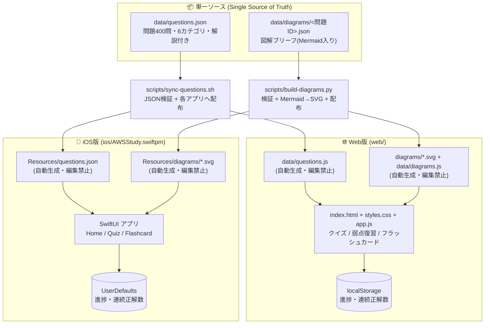
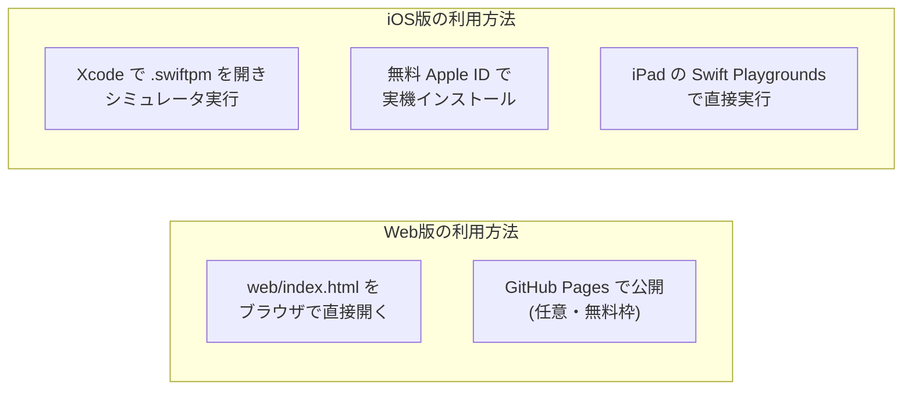

# アーキテクチャ図

最終レビュー: 2026-08-02(図解の事前SVG化を反映。運用は [RULES.md](RULES.md) 参照)

## 全体構成

ゼロコスト方針のため、サーバー・DB・外部 SaaS を一切使わない完全ローカル構成。
問題データは `data/questions.json` を単一ソースとし、同期スクリプトで各プラットフォームへ配布する。

## 実行・配布経路(すべて無料)

## 設計上のポイント

| 項目 | 決定 | 理由 |
|---|---|---|
| バックエンド | なし | ゼロコスト。進捗は端末内(localStorage / UserDefaults)に保存 |
| 問題データ | `data/questions.json` を単一ソース | Web/iOS で問題内容が乖離するのを防ぐ |
| Web のデータ読込 | `questions.js`(JS埋め込み) | `file://` で開いても CORS で fetch が失敗しないため |
| iOS の形式 | App Playground (`.swiftpm`) | 有料 Developer Program 不要。Xcode / Swift Playgrounds 両対応 |
| 進捗スキーマ | `{attempts, correct, wrongStreak}` + streak | 「要復習(wrongStreak>0)」「習得済み(correct≥2 かつ wrongStreak=0)」を両OSで同一ロジックにする |
| 図解 | ビルド時に Mermaid → SVG(事前生成) | 実行時に Mermaid ランタイム(CDN / ベンダリング)を持たずに済み、オフラインでもそのまま表示できる |
| iOS の図解表示 | WKWebView に SVG を埋め込む | SwiftUI は SVG を直接描画できないため。OS 標準の WebKit だけで完結し、外部ライブラリを足さない |

## コンポーネント対応表(Web ⇔ iOS)

| 機能 | Web | iOS |
|---|---|---|
| ホーム / 統計 | `app.js: renderHome()` | `HomeView.swift` |
| クイズ・解説・結果 | `app.js: startQuiz()/answer()` | `QuizView.swift` |
| フラッシュカード | `app.js: startFlash()` | `FlashcardView.swift` |
| 進捗ストア | `app.js: store` (localStorage) | `Models.swift: ProgressStore` (UserDefaults) |
| 図解表示 | `app.js: showDiagram()` (``) | `DiagramView.swift: DiagramCard` (WKWebView) |
