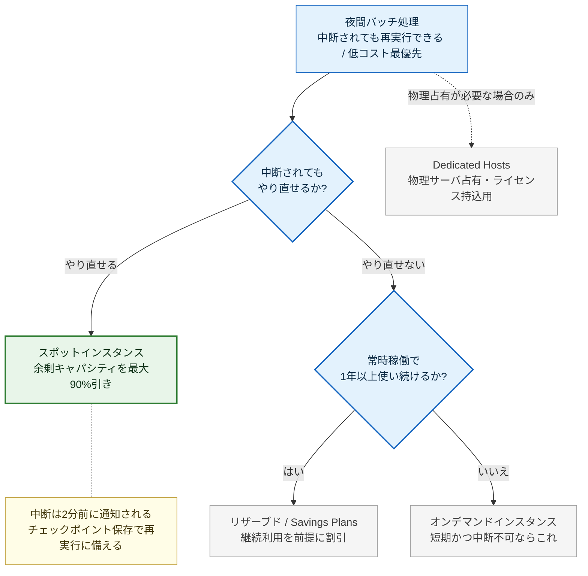
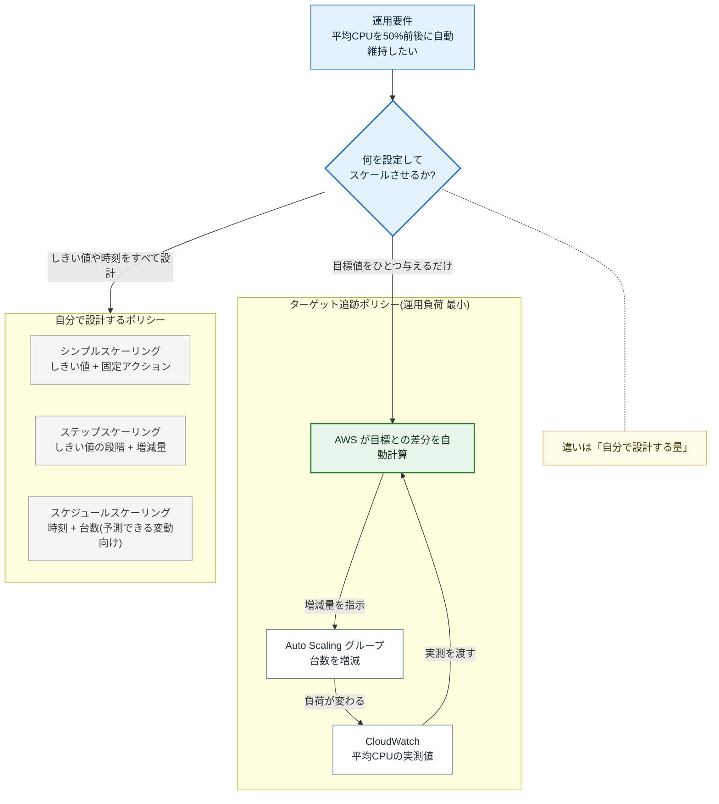
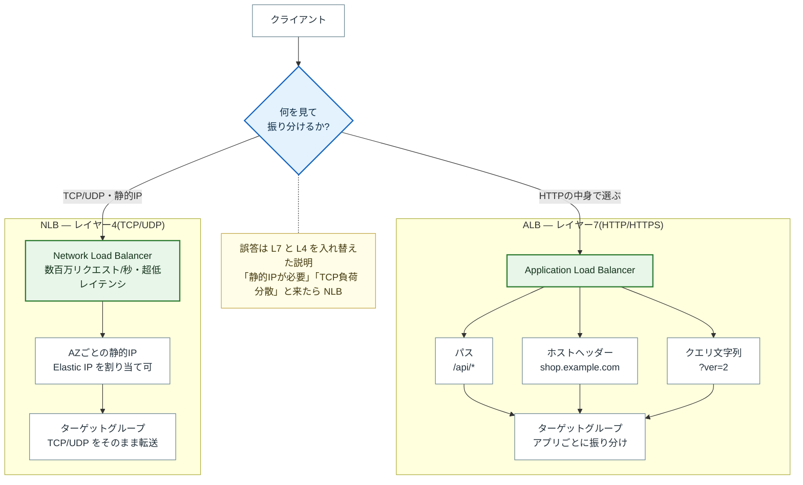

# 問題図解ギャラリー

**自動生成ファイル — 直接編集禁止。**
`data/diagrams/<問題ID>.json` を編集して `python3 scripts/build-diagrams.py` を実行すること
(手順: [DIAGRAM-WORKFLOW.md](../DIAGRAM-WORKFLOW.md))。

収録: 3 問 / 全 400 問

---

## cmp01 — コンピューティング / level 1

**問題**: 夜間バッチ処理のように中断されても再実行可能なワークロードを、最も低コストで EC2 上で実行したい。どの購入オプションが最適か?

**正解**: スポットインスタンス

**他の選択肢**: オンデマンドインスタンス / リザーブドインスタンス(1年・全前払い) / Dedicated Hosts

**図解の主メッセージ**: 中断されても再実行できるワークロードなら、最安のスポットインスタンスを選ぶ。

**採用パターン**: 分岐(判断フロー)。試験本番の判断順序(まず中断耐性、次に稼働の継続性)をそのままなぞれるため、2軸マトリクスより解読が少なくて済む。(候補: 分岐(判断フロー): 2つの問いで4つの選択肢に振り分ける / マトリクス: 中断耐性 × 稼働期間の2軸に4オプションを配置)

アプリ表示用の SVG: [`web/diagrams/cmp01.svg`](../../web/diagrams/cmp01.svg)

**解説**: スポットインスタンスは AWS の余剰キャパシティを最大 90% 引きで利用でき、中断耐性のあるバッチ処理・分析処理に最適です。中断通知(2分前)を受けてチェックポイントを保存する設計にします。常時稼働かつ中断不可ならリザーブド/Savings Plans、短期かつ中断不可ならオンデマンドを選びます。

**確認事項**: Savings Plans はリザーブドと1ノードにまとめている(解説の粒度に合わせた)。両者の違いを問う問題を追加する場合は分割が必要。

---

## cmp02 — コンピューティング / level 1

**問題**: Auto Scaling グループで、平均 CPU 使用率を 50% 前後に自動で維持したい。最も運用負荷が低いスケーリングポリシーはどれか?

**正解**: ターゲット追跡スケーリングポリシー

**他の選択肢**: シンプルスケーリングポリシー / ステップスケーリングポリシー / スケジュールされたスケーリング

**図解の主メッセージ**: 目標値の維持が要件なら、目標を1つ与えるだけで AWS が増減を計算するターゲット追跡が最も運用負荷が低い。

**採用パターン**: 循環(フィードバックループ)+ 対比。「AWS が代わりに回してくれる輪」が絵として見えることが主メッセージそのものであり、表では運用負荷の差が伝わりにくい。(候補: 循環(フィードバックループ)+ 対比: 自動で回る制御ループと、手で設計するポリシー群を並べる / テーブル: 4ポリシー × 設定項目 / 向くケースの比較表)

アプリ表示用の SVG: [`web/diagrams/cmp02.svg`](../../web/diagrams/cmp02.svg)

**解説**: ターゲット追跡(Target Tracking)は「CPU 50% を維持」のように目標値を指定するだけで、必要な増減を AWS が自動計算するため運用が最も簡単です。ステップ/シンプルはしきい値とアクションを自分で細かく設計する必要があり、スケジュールは予測可能な負荷変動(平日9時に増加など)向けです。

**確認事項**: スケジュールスケーリングは「運用負荷が高い」のではなく「用途が違う(予測可能な変動向け)」。図ではグレー群に入れているため、ラベルで用途を明示している。

---

## cmp03 — コンピューティング / level 2

**問題**: ALB(Application Load Balancer)と NLB(Network Load Balancer)の使い分けとして正しい説明はどれか?

**正解**: ALB は L7 でパスベースルーティングが可能、NLB は L4 で超低レイテンシと静的 IP に対応

**他の選択肢**: ALB は L4 で TCP 負荷分散に特化、NLB は L7 で HTTP ヘッダーを解釈できる / どちらも L7 だが、NLB のほうがルーティング機能が豊富 / NLB は HTTP/HTTPS 専用で、ALB は全プロトコル対応

**図解の主メッセージ**: HTTPの中身で振り分けるなら L7 の ALB、TCP/UDP の性能と静的IPが要るなら L4 の NLB。

**採用パターン**: 対比(左右2グループ)+ 分岐。試験では「どちらを選ぶか」を問われるので、層の上下関係より選択の分かれ目を主役にした方が主メッセージに直結する。(候補: 対比(左右2グループ)+ 分岐: 1つの判断から L7 側 / L4 側へ分ける / レイヤー図: OSI の L7 / L4 を上下に積み、各層に該当サービスを置く)

アプリ表示用の SVG: [`web/diagrams/cmp03.svg`](../../web/diagrams/cmp03.svg)

**解説**: ALB はレイヤー7(HTTP/HTTPS)で動作し、パス・ホストヘッダー・クエリ文字列に基づくルーティングができます。NLB はレイヤー4(TCP/UDP)で動作し、数百万リクエスト/秒・超低レイテンシ・AZ ごとの静的 IP(Elastic IP 割当可)が特徴です。「静的 IP が必要」「TCP 負荷分散」と来たら NLB を選びます。

**確認事項**: この問題は「正しい説明を選ぶ」形式のため、誤答選択肢に対応する構成要素が図中に存在しない。誤答は注釈(L7とL4を逆にした説明)で補っている。 / Gateway Load Balancer / Classic Load Balancer は解説の範囲外のため描いていない。
