# 問題図解ギャラリー

**自動生成ファイル — 直接編集禁止。**
`data/diagrams/<問題ID>.json` を編集して `python3 scripts/build-diagrams.py` を実行すること
(手順: [DIAGRAM-WORKFLOW.md](../DIAGRAM-WORKFLOW.md))。

収録: 23 問 / 全 400 問

---

## cmp01 — コンピューティング / level 1

**問題**: 夜間バッチ処理のように中断されても再実行可能なワークロードを、最も低コストで EC2 上で実行したい。どの購入オプションが最適か?

**正解**: スポットインスタンス

**他の選択肢**: オンデマンドインスタンス / リザーブドインスタンス(1年・全前払い) / Dedicated Hosts

**図解の主メッセージ**: 中断されても再実行できるワークロードなら、最安のスポットインスタンスを選ぶ。

**採用パターン**: 分岐(判断フロー)。試験本番の判断順序(まず中断耐性、次に稼働の継続性)をそのままなぞれるため、2軸マトリクスより解読が少なくて済む。(候補: 分岐(判断フロー): 2つの問いで4つの選択肢に振り分ける / マトリクス: 中断耐性 × 稼働期間の2軸に4オプションを配置)

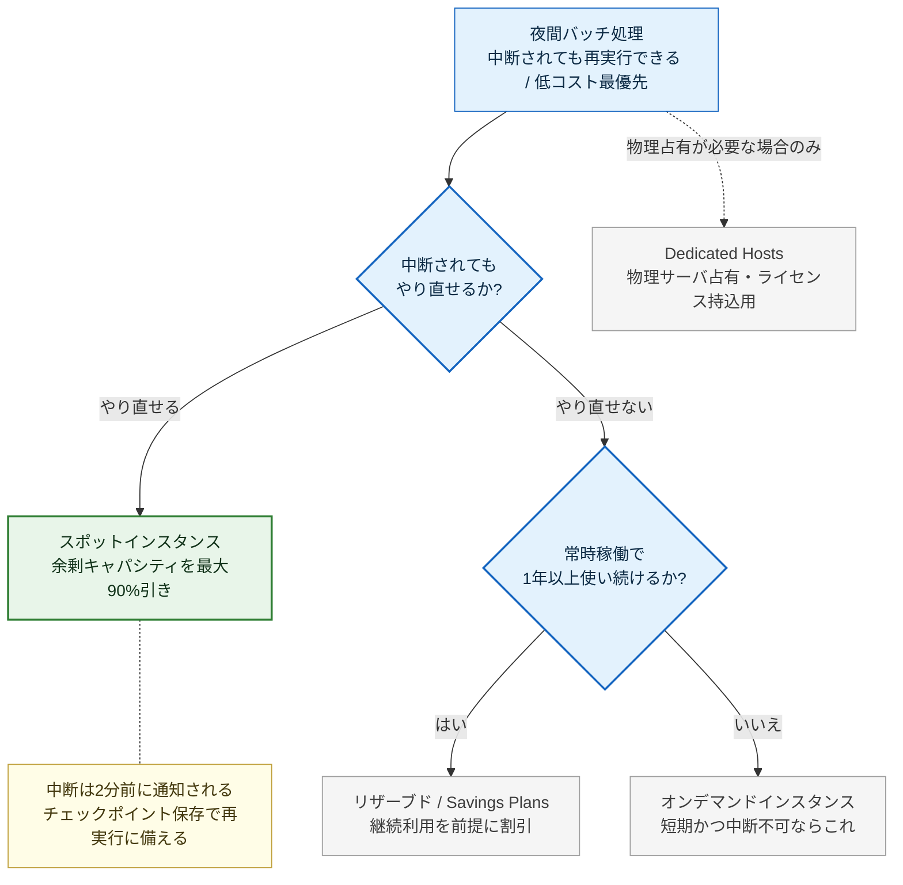
```mermaid
flowchart TD
    START["夜間バッチ処理<br/>中断されても再実行できる / 低コスト最優先"]:::req
    Q1{"中断されても<br/>やり直せるか?"}:::judge
    SPOT["スポットインスタンス<br/>余剰キャパシティを最大90%引き"]:::best
    NOTE["中断は2分前に通知される<br/>チェックポイント保存で再実行に備える"]:::note
    Q2{"常時稼働で<br/>1年以上使い続けるか?"}:::judge
    RI["リザーブド / Savings Plans<br/>継続利用を前提に割引"]:::alt
    OD["オンデマンドインスタンス<br/>短期かつ中断不可ならこれ"]:::alt
    DH["Dedicated Hosts<br/>物理サーバ占有・ライセンス持込用"]:::alt

    START --> Q1
    Q1 -->|"やり直せる"| SPOT
    Q1 -->|"やり直せない"| Q2
    Q2 -->|"はい"| RI
    Q2 -->|"いいえ"| OD
    START -.->|"物理占有が必要な場合のみ"| DH
    SPOT -.- NOTE
    classDef req fill:#e3f2fd,stroke:#1565c0,stroke-width:1px,color:#0d2b45
    classDef judge fill:#e3f2fd,stroke:#1565c0,stroke-width:2px,color:#0d2b45
    classDef best fill:#e8f5e9,stroke:#2e7d32,stroke-width:2px,color:#12331a
    classDef alt fill:#f5f5f5,stroke:#9e9e9e,stroke-width:1px,color:#3c3c3c
    classDef svc fill:#ffffff,stroke:#607d8b,stroke-width:1px,color:#22303a
    classDef note fill:#fffde7,stroke:#c0a03c,stroke-width:1px,color:#43380d
```

アプリ表示用の SVG: [`web/diagrams/cmp01.svg`](../../web/diagrams/cmp01.svg)

**解説**: スポットインスタンスは AWS の余剰キャパシティを最大 90% 引きで利用でき、中断耐性のあるバッチ処理・分析処理に最適です。中断通知(2分前)を受けてチェックポイントを保存する設計にします。常時稼働かつ中断不可ならリザーブド/Savings Plans、短期かつ中断不可ならオンデマンドを選びます。

**確認事項**: Savings Plans はリザーブドと1ノードにまとめている(解説の粒度に合わせた)。両者の違いを問う問題を追加する場合は分割が必要。

---

## cmp02 — コンピューティング / level 1

**問題**: Auto Scaling グループで、平均 CPU 使用率を 50% 前後に自動で維持したい。最も運用負荷が低いスケーリングポリシーはどれか?

**正解**: ターゲット追跡スケーリングポリシー

**他の選択肢**: シンプルスケーリングポリシー / ステップスケーリングポリシー / スケジュールされたスケーリング

**図解の主メッセージ**: 目標値の維持が要件なら、目標を1つ与えるだけで AWS が増減を計算するターゲット追跡が最も運用負荷が低い。

**採用パターン**: 循環(フィードバックループ)+ 対比。「AWS が代わりに回してくれる輪」が絵として見えることが主メッセージそのものであり、表では運用負荷の差が伝わりにくい。(候補: 循環(フィードバックループ)+ 対比: 自動で回る制御ループと、手で設計するポリシー群を並べる / テーブル: 4ポリシー × 設定項目 / 向くケースの比較表)

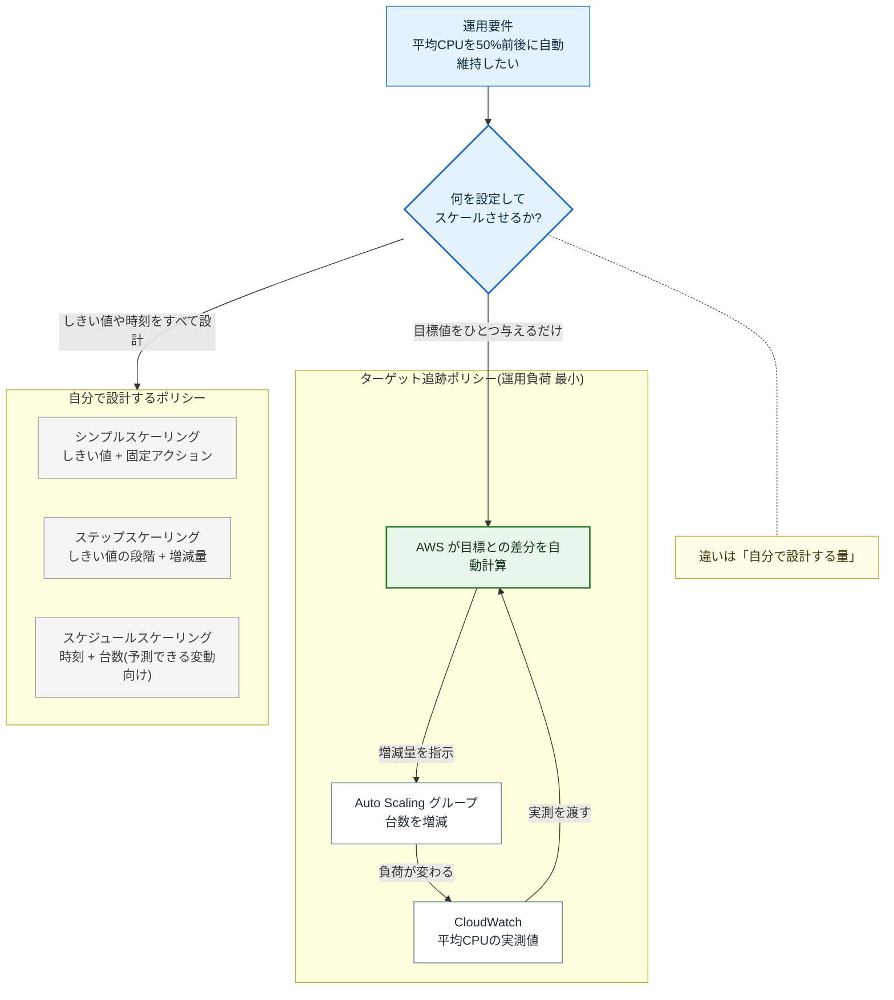
```mermaid
flowchart TB
    GOAL["運用要件<br/>平均CPUを50%前後に自動維持したい"]:::req
    Q{"何を設定して<br/>スケールさせるか?"}:::judge
    NOTE["違いは「自分で設計する量」"]:::note

    GOAL --> Q

    subgraph TT["ターゲット追跡ポリシー(運用負荷 最小)"]
        direction LR
        CALC["AWS が目標との差分を自動計算"]:::best
        ASG["Auto Scaling グループ<br/>台数を増減"]:::svc
        CW["CloudWatch<br/>平均CPUの実測値"]:::svc
        CALC -->|"増減量を指示"| ASG
        ASG -->|"負荷が変わる"| CW
        CW -->|"実測を渡す"| CALC
    end

    subgraph MANUAL["自分で設計するポリシー"]
        SIMPLE["シンプルスケーリング<br/>しきい値 + 固定アクション"]:::alt
        STEP["ステップスケーリング<br/>しきい値の段階 + 増減量"]:::alt
        SCHED["スケジュールスケーリング<br/>時刻 + 台数(予測できる変動向け)"]:::alt
    end

    Q -->|"目標値をひとつ与えるだけ"| CALC
    Q -->|"しきい値や時刻をすべて設計"| MANUAL
    Q -.- NOTE
    classDef req fill:#e3f2fd,stroke:#1565c0,stroke-width:1px,color:#0d2b45
    classDef judge fill:#e3f2fd,stroke:#1565c0,stroke-width:2px,color:#0d2b45
    classDef best fill:#e8f5e9,stroke:#2e7d32,stroke-width:2px,color:#12331a
    classDef alt fill:#f5f5f5,stroke:#9e9e9e,stroke-width:1px,color:#3c3c3c
    classDef svc fill:#ffffff,stroke:#607d8b,stroke-width:1px,color:#22303a
    classDef note fill:#fffde7,stroke:#c0a03c,stroke-width:1px,color:#43380d
```

アプリ表示用の SVG: [`web/diagrams/cmp02.svg`](../../web/diagrams/cmp02.svg)

**解説**: ターゲット追跡(Target Tracking)は「CPU 50% を維持」のように目標値を指定するだけで、必要な増減を AWS が自動計算するため運用が最も簡単です。ステップ/シンプルはしきい値とアクションを自分で細かく設計する必要があり、スケジュールは予測可能な負荷変動(平日9時に増加など)向けです。

**確認事項**: スケジュールスケーリングは「運用負荷が高い」のではなく「用途が違う(予測可能な変動向け)」。図ではグレー群に入れているため、ラベルで用途を明示している。

---

## cmp03 — コンピューティング / level 2

**問題**: ALB(Application Load Balancer)と NLB(Network Load Balancer)の使い分けとして正しい説明はどれか?

**正解**: ALB は L7 でパスベースルーティングが可能、NLB は L4 で超低レイテンシと静的 IP に対応

**他の選択肢**: ALB は L4 で TCP 負荷分散に特化、NLB は L7 で HTTP ヘッダーを解釈できる / どちらも L7 だが、NLB のほうがルーティング機能が豊富 / NLB は HTTP/HTTPS 専用で、ALB は全プロトコル対応

**図解の主メッセージ**: HTTPの中身で振り分けるなら L7 の ALB、TCP/UDP の性能と静的IPが要るなら L4 の NLB。

**採用パターン**: 対比(左右2グループ)+ 分岐。試験では「どちらを選ぶか」を問われるので、層の上下関係より選択の分かれ目を主役にした方が主メッセージに直結する。(候補: 対比(左右2グループ)+ 分岐: 1つの判断から L7 側 / L4 側へ分ける / レイヤー図: OSI の L7 / L4 を上下に積み、各層に該当サービスを置く)

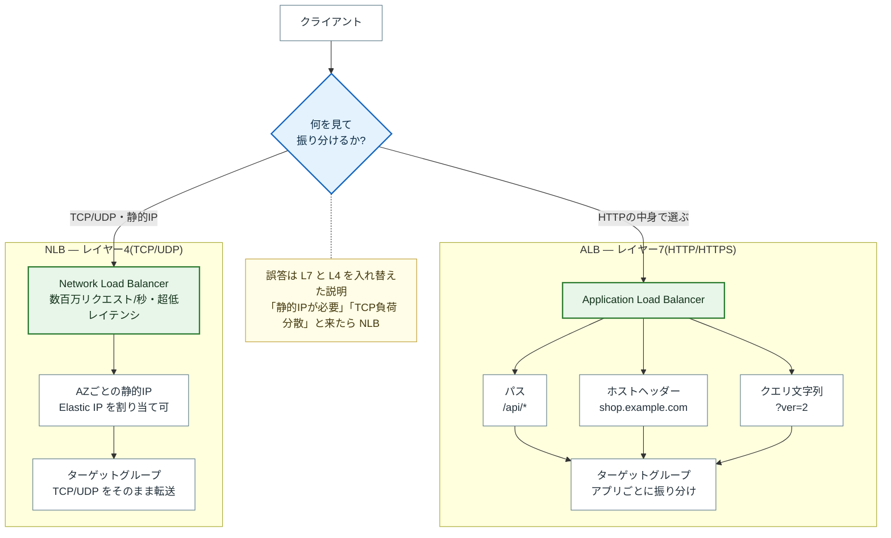
```mermaid
flowchart TB
    CLIENT["クライアント"]:::svc
    Q{"何を見て<br/>振り分けるか?"}:::judge
    NOTE["誤答は L7 と L4 を入れ替えた説明<br/>「静的IPが必要」「TCP負荷分散」と来たら NLB"]:::note

    CLIENT --> Q

    subgraph L7["ALB — レイヤー7(HTTP/HTTPS)"]
        ALB["Application Load Balancer"]:::best
        PATH["パス<br/>/api/*"]:::svc
        HOST["ホストヘッダー<br/>shop.example.com"]:::svc
        QS["クエリ文字列<br/>?ver=2"]:::svc
        TG7["ターゲットグループ<br/>アプリごとに振り分け"]:::svc
        ALB --> PATH --> TG7
        ALB --> HOST --> TG7
        ALB --> QS --> TG7
    end

    subgraph L4["NLB — レイヤー4(TCP/UDP)"]
        NLB["Network Load Balancer<br/>数百万リクエスト/秒・超低レイテンシ"]:::best
        EIP["AZごとの静的IP<br/>Elastic IP を割り当て可"]:::svc
        TG4["ターゲットグループ<br/>TCP/UDP をそのまま転送"]:::svc
        NLB --> EIP --> TG4
    end

    Q -->|"HTTPの中身で選ぶ"| ALB
    Q -->|"TCP/UDP・静的IP"| NLB
    Q -.- NOTE
    classDef req fill:#e3f2fd,stroke:#1565c0,stroke-width:1px,color:#0d2b45
    classDef judge fill:#e3f2fd,stroke:#1565c0,stroke-width:2px,color:#0d2b45
    classDef best fill:#e8f5e9,stroke:#2e7d32,stroke-width:2px,color:#12331a
    classDef alt fill:#f5f5f5,stroke:#9e9e9e,stroke-width:1px,color:#3c3c3c
    classDef svc fill:#ffffff,stroke:#607d8b,stroke-width:1px,color:#22303a
    classDef note fill:#fffde7,stroke:#c0a03c,stroke-width:1px,color:#43380d
```

アプリ表示用の SVG: [`web/diagrams/cmp03.svg`](../../web/diagrams/cmp03.svg)

**解説**: ALB はレイヤー7(HTTP/HTTPS)で動作し、パス・ホストヘッダー・クエリ文字列に基づくルーティングができます。NLB はレイヤー4(TCP/UDP)で動作し、数百万リクエスト/秒・超低レイテンシ・AZ ごとの静的 IP(Elastic IP 割当可)が特徴です。「静的 IP が必要」「TCP 負荷分散」と来たら NLB を選びます。

**確認事項**: この問題は「正しい説明を選ぶ」形式のため、誤答選択肢に対応する構成要素が図中に存在しない。誤答は注釈(L7とL4を逆にした説明)で補っている。 / Gateway Load Balancer / Classic Load Balancer は解説の範囲外のため描いていない。

---

## cmp04 — コンピューティング / level 2

**問題**: 単一 AZ の障害に耐えられるよう、EC2 ベースの Web アプリの可用性を高める構成として最も適切なのはどれか?

**正解**: 複数 AZ にまたがる Auto Scaling グループ + ALB

**他の選択肢**: 同一 AZ 内でインスタンスサイズを大きくする(垂直スケーリング) / 単一 AZ に Auto Scaling グループを構成し最小台数を増やす / 別リージョンに AMI をコピーして手動フェイルオーバーする

**図解の主メッセージ**: AZ 障害で全滅しないのは、複数 AZ に分散して ALB が生存インスタンスにだけ流す構成だけ。

**採用パターン**: 分岐(判断フロー)。対比は2つの構成図を描き分ける必要があり密になる。判断は「AZ をまたいでいるか」の一点なので、分岐1つに還元した方が解読が少ない。(候補: 分岐(判断フロー): 「AZ 障害で処理が残るか」の1問で正解と誤答を振り分け、正解側だけ構成を展開する / 対比(左右2枚): 単一 AZ 構成とマルチ AZ 構成を並べ、同じ AZ 障害を当てて結果を比べる)

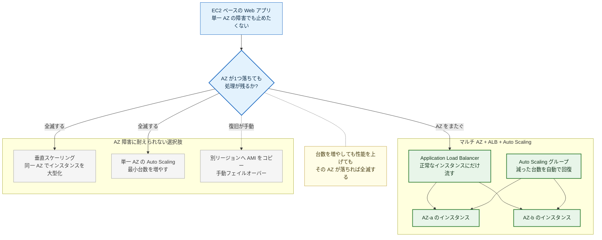
```mermaid
flowchart TD
    REQ["EC2 ベースの Web アプリ<br/>単一 AZ の障害でも止めたくない"]:::req
    Q{"AZ が1つ落ちても<br/>処理が残るか?"}:::judge

    subgraph HA["マルチ AZ + ALB + Auto Scaling"]
        ALB["Application Load Balancer<br/>正常なインスタンスにだけ流す"]:::best
        AZA["AZ-a のインスタンス"]:::best
        AZB["AZ-b のインスタンス"]:::best
        ASG["Auto Scaling グループ<br/>減った台数を自動で回復"]:::best
        ALB --> AZA
        ALB --> AZB
        ASG --> AZA
        ASG --> AZB
    end

    subgraph NG["AZ 障害に耐えられない選択肢"]
        VERT["垂直スケーリング<br/>同一 AZ でインスタンスを大型化"]:::alt
        ONE["単一 AZ の Auto Scaling<br/>最小台数を増やす"]:::alt
        DR["別リージョンへ AMI をコピー<br/>手動フェイルオーバー"]:::alt
    end

    NOTE["台数を増やしても性能を上げても<br/>その AZ が落ちれば全滅する"]:::note

    REQ --> Q
    Q -->|"AZ をまたぐ"| ALB
    Q -->|"全滅する"| VERT
    Q -->|"全滅する"| ONE
    Q -.->|"復旧が手動"| DR
    Q -.- NOTE
    classDef req fill:#e3f2fd,stroke:#1565c0,stroke-width:1px,color:#0d2b45
    classDef judge fill:#e3f2fd,stroke:#1565c0,stroke-width:2px,color:#0d2b45
    classDef best fill:#e8f5e9,stroke:#2e7d32,stroke-width:2px,color:#12331a
    classDef alt fill:#f5f5f5,stroke:#9e9e9e,stroke-width:1px,color:#3c3c3c
    classDef svc fill:#ffffff,stroke:#607d8b,stroke-width:1px,color:#22303a
    classDef note fill:#fffde7,stroke:#c0a03c,stroke-width:1px,color:#43380d
```

アプリ表示用の SVG: [`web/diagrams/cmp04.svg`](../../web/diagrams/cmp04.svg)

**解説**: 高可用性の基本パターンは「マルチ AZ + ELB + Auto Scaling」です。ALB が正常なインスタンスにのみトラフィックを流し、AZ 障害時も他 AZ のインスタンスが処理を継続、Auto Scaling が台数を回復します。垂直スケーリングや単一 AZ 構成は AZ 障害で全滅するため高可用性になりません。

**確認事項**: ALB のヘルスチェック機構そのもの(間隔・閾値)は解説の範囲外のため描いていない。 / 別リージョンへの AMI コピーは「手動フェイルオーバー」という選択肢の記述だけを根拠に非最適としている。RTO の数値は解説にないため図に入れていない。

---

## cmp05 — コンピューティング / level 1

**問題**: コンテナ化されたアプリを、サーバー(EC2 インスタンス)の管理なしで実行したい。どの組み合わせが最適か?

**正解**: ECS + Fargate 起動タイプ

**他の選択肢**: ECS + EC2 起動タイプ / EC2 に Docker を手動インストール / Elastic Beanstalk の EC2 プラットフォーム

**図解の主メッセージ**: サーバー管理をなくしたいなら、ホストを持たない Fargate 起動タイプを選ぶ。

**採用パターン**: 分岐(判断フロー)。この問題は層の理解ではなく起動タイプの二択そのものを問うており、分かれ目を主役にした方が主メッセージに直結する。レイヤー図は cmp13 側で使う。(候補: 分岐(判断フロー): 「ホスト EC2 を自分で持つか」の1問で Fargate 側と EC2 側に分ける / レイヤー図: オーケストレーション層(ECS)と実行基盤層(Fargate / EC2)を上下に積む)

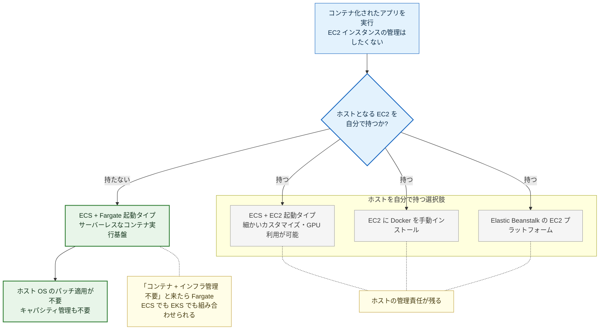
```mermaid
flowchart TD
    REQ["コンテナ化されたアプリを実行<br/>EC2 インスタンスの管理はしたくない"]:::req
    Q{"ホストとなる EC2 を<br/>自分で持つか?"}:::judge
    FARGATE["ECS + Fargate 起動タイプ<br/>サーバーレスなコンテナ実行基盤"]:::best
    FREE["ホスト OS のパッチ適用が不要<br/>キャパシティ管理も不要"]:::best

    subgraph OWN["ホストを自分で持つ選択肢"]
        EC2T["ECS + EC2 起動タイプ<br/>細かいカスタマイズ・GPU 利用が可能"]:::alt
        MANUAL["EC2 に Docker を手動インストール"]:::alt
        EB["Elastic Beanstalk の EC2 プラットフォーム"]:::alt
    end

    HOST["ホストの管理責任が残る"]:::note
    NOTE["「コンテナ + インフラ管理不要」と来たら Fargate<br/>ECS でも EKS でも組み合わせられる"]:::note

    REQ --> Q
    Q -->|"持たない"| FARGATE
    FARGATE --> FREE
    Q -->|"持つ"| EC2T
    Q -->|"持つ"| MANUAL
    Q -->|"持つ"| EB
    EC2T -.- HOST
    MANUAL -.- HOST
    EB -.- HOST
    FARGATE -.- NOTE
    classDef req fill:#e3f2fd,stroke:#1565c0,stroke-width:1px,color:#0d2b45
    classDef judge fill:#e3f2fd,stroke:#1565c0,stroke-width:2px,color:#0d2b45
    classDef best fill:#e8f5e9,stroke:#2e7d32,stroke-width:2px,color:#12331a
    classDef alt fill:#f5f5f5,stroke:#9e9e9e,stroke-width:1px,color:#3c3c3c
    classDef svc fill:#ffffff,stroke:#607d8b,stroke-width:1px,color:#22303a
    classDef note fill:#fffde7,stroke:#c0a03c,stroke-width:1px,color:#43380d
```

アプリ表示用の SVG: [`web/diagrams/cmp05.svg`](../../web/diagrams/cmp05.svg)

**解説**: Fargate はサーバーレスなコンテナ実行基盤で、ホスト OS のパッチ適用・キャパシティ管理が不要です。「コンテナ + インフラ管理不要」というキーワードが出たら Fargate(ECS または EKS と組み合わせ)を選びます。EC2 起動タイプはインスタンスの管理が必要になる代わりに、細かいカスタマイズや GPU 利用が可能です。

**確認事項**: Elastic Beanstalk の EC2 プラットフォームが非最適な理由は解説に明示がないため、「ホストの管理責任が残る」という共通の理由に寄せている。 / cmp13 も Fargate が正解の問題で、判断軸が重なる。cmp05 は ECS の起動タイプ二択、cmp13 は ECS/EKS 共通の実行基盤としての Fargate、と描き分けている。

---

## cmp06 — コンピューティング / level 1

**問題**: HTTP リクエストの URL パス(/api, /images など)に応じて異なるターゲットグループへ振り分けたい。どのロードバランサーを使うべきか?

**正解**: Application Load Balancer

**他の選択肢**: Network Load Balancer / Gateway Load Balancer / Classic Load Balancer

**図解の主メッセージ**: URL の中身を読んで振り分けられるのはレイヤー7の ALB だけ。

**採用パターン**: 分岐(判断フロー)。レイヤー図は4種すべての層を正確に置く必要があり、解説に記述のない GWLB / CLB の層まで断定してしまう。分岐なら解説にある「L7 か否か」だけで判断でき、創作を避けられる。(候補: 分岐(判断フロー): 「URL の中身を読む必要があるか」で ALB と他の ELB に分ける / レイヤー図: OSI の L7 / L4 / L3 を積み、各層に該当する ELB を配置する)

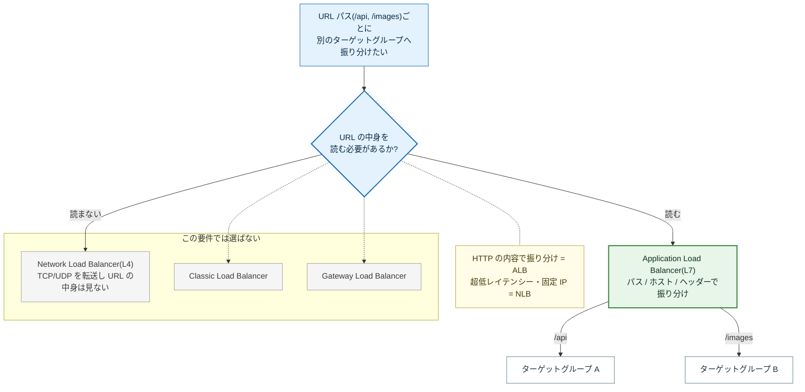
```mermaid
flowchart TD
    REQ["URL パス(/api, /images)ごとに<br/>別のターゲットグループへ振り分けたい"]:::req
    Q{"URL の中身を<br/>読む必要があるか?"}:::judge
    ALB["Application Load Balancer(L7)<br/>パス / ホスト / ヘッダーで振り分け"]:::best
    TG1["ターゲットグループ A"]:::svc
    TG2["ターゲットグループ B"]:::svc

    subgraph OTHERS["この要件では選ばない"]
        NLB["Network Load Balancer(L4)<br/>TCP/UDP を転送し URL の中身は見ない"]:::alt
        CLB["Classic Load Balancer"]:::alt
        GWLB["Gateway Load Balancer"]:::alt
    end

    NOTE["HTTP の内容で振り分け = ALB<br/>超低レイテンシー・固定 IP = NLB"]:::note

    REQ --> Q
    Q -->|"読む"| ALB
    ALB -->|"/api"| TG1
    ALB -->|"/images"| TG2
    Q -->|"読まない"| NLB
    Q -.-> CLB
    Q -.-> GWLB
    Q -.- NOTE
    classDef req fill:#e3f2fd,stroke:#1565c0,stroke-width:1px,color:#0d2b45
    classDef judge fill:#e3f2fd,stroke:#1565c0,stroke-width:2px,color:#0d2b45
    classDef best fill:#e8f5e9,stroke:#2e7d32,stroke-width:2px,color:#12331a
    classDef alt fill:#f5f5f5,stroke:#9e9e9e,stroke-width:1px,color:#3c3c3c
    classDef svc fill:#ffffff,stroke:#607d8b,stroke-width:1px,color:#22303a
    classDef note fill:#fffde7,stroke:#c0a03c,stroke-width:1px,color:#43380d
```

アプリ表示用の SVG: [`web/diagrams/cmp06.svg`](../../web/diagrams/cmp06.svg)

**解説**: ALB はレイヤー 7(HTTP/HTTPS)で動作し、パスベース・ホストベース・ヘッダーベースのルーティングが可能です。NLB はレイヤー 4(TCP/UDP)で動作するため URL の中身を見た振り分けはできません。「HTTP の内容で振り分け = ALB」「超低レイテンシー・固定 IP = NLB」と覚えます。

**確認事項**: Gateway Load Balancer と Classic Load Balancer は解説に説明がないため、名称のみを置きグループの枠で「この要件では選ばない」ことだけを示している。 / cmp03 / cmp07 も ALB と NLB の使い分けを扱う。cmp06 は「L7 側から見る」視点に固定して重複を避けている。

---

## cmp07 — コンピューティング / level 1

**問題**: 毎秒数百万リクエストの TCP トラフィックを超低レイテンシーで処理し、かつ固定 IP アドレスを顧客に案内する必要がある。どのロードバランサーが適切か?

**正解**: Network Load Balancer

**他の選択肢**: Application Load Balancer / Classic Load Balancer / Amazon CloudFront

**図解の主メッセージ**: TCP の超低レイテンシーと固定 IP を同時に満たすのはレイヤー4の NLB だけ。

**採用パターン**: 合流(2要件 → 1解)。マトリクスは CLB / CloudFront の位置を解説にない根拠で決める必要が出る。合流なら「2つの要件が同じ答えを指す」という主メッセージがそのまま線の形になる。(候補: 合流(2要件 → 1解): 2つの要件を1つの判断へ集め、両方を満たす NLB を導く / マトリクス: 「TCP 性能」×「固定 IP」の2軸に4選択肢を配置する)

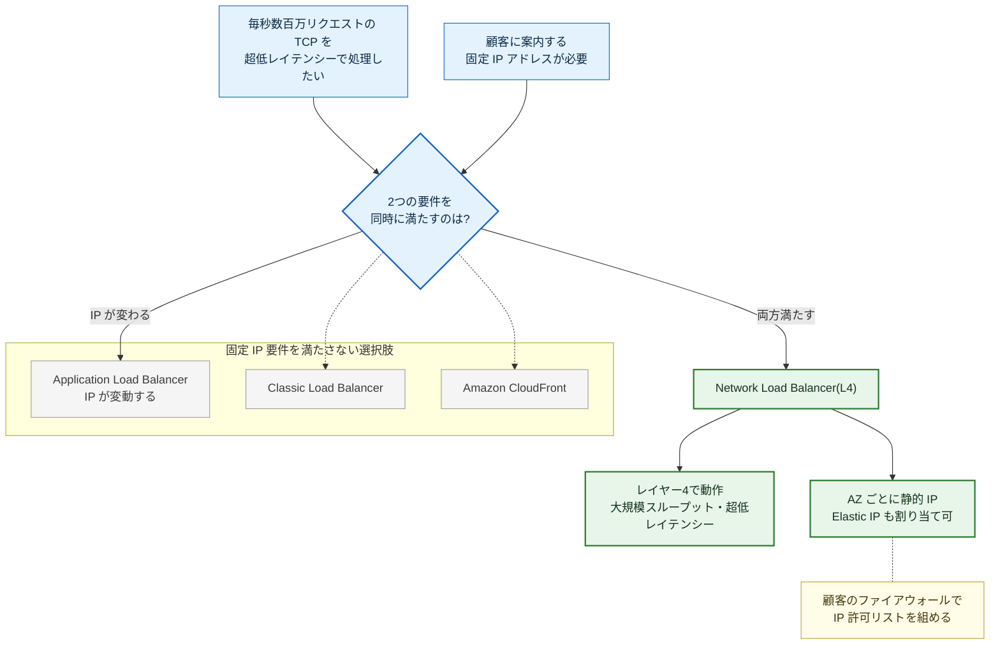
```mermaid
flowchart TD
    R1["毎秒数百万リクエストの TCP を<br/>超低レイテンシーで処理したい"]:::req
    R2["顧客に案内する<br/>固定 IP アドレスが必要"]:::req
    Q{"2つの要件を<br/>同時に満たすのは?"}:::judge
    NLB["Network Load Balancer(L4)"]:::best
    PERF["レイヤー4で動作<br/>大規模スループット・超低レイテンシー"]:::best
    EIP["AZ ごとに静的 IP<br/>Elastic IP も割り当て可"]:::best
    FW["顧客のファイアウォールで<br/>IP 許可リストを組める"]:::note

    subgraph NG["固定 IP 要件を満たさない選択肢"]
        ALB["Application Load Balancer<br/>IP が変動する"]:::alt
        CLB["Classic Load Balancer"]:::alt
        CF["Amazon CloudFront"]:::alt
    end

    R1 --> Q
    R2 --> Q
    Q -->|"両方満たす"| NLB
    NLB --> PERF
    NLB --> EIP
    EIP -.- FW
    Q -->|"IP が変わる"| ALB
    Q -.-> CLB
    Q -.-> CF
    classDef req fill:#e3f2fd,stroke:#1565c0,stroke-width:1px,color:#0d2b45
    classDef judge fill:#e3f2fd,stroke:#1565c0,stroke-width:2px,color:#0d2b45
    classDef best fill:#e8f5e9,stroke:#2e7d32,stroke-width:2px,color:#12331a
    classDef alt fill:#f5f5f5,stroke:#9e9e9e,stroke-width:1px,color:#3c3c3c
    classDef svc fill:#ffffff,stroke:#607d8b,stroke-width:1px,color:#22303a
    classDef note fill:#fffde7,stroke:#c0a03c,stroke-width:1px,color:#43380d
```

アプリ表示用の SVG: [`web/diagrams/cmp07.svg`](../../web/diagrams/cmp07.svg)

**解説**: NLB はレイヤー 4 で動作し、超低レイテンシーかつ大規模スループットに対応します。AZ ごとに静的 IP(または Elastic IP)を割り当てられるため、顧客のファイアウォールで IP 許可リストが必要な場合にも最適です。ALB は IP が変動するため固定 IP 要件には向きません。

**確認事項**: Classic Load Balancer と CloudFront が非最適な理由は解説に記述がないため、グループの枠で示すにとどめている。 / 「毎秒数百万リクエスト」は問題文の数値をそのまま使っており、図側で独自の性能値は足していない。

---

## cmp08 — コンピューティング / level 2

**問題**: HPC(ハイパフォーマンスコンピューティング)ワークロードで、ノード間通信のレイテンシーを最小化したい。どのプレイスメントグループを選ぶべきか?

**正解**: クラスタープレイスメントグループ

**他の選択肢**: スプレッドプレイスメントグループ / パーティションプレイスメントグループ / デフォルト配置(グループなし)

**図解の主メッセージ**: ノード間を速くしたいなら、物理的に近くへ集めるクラスタープレイスメントグループを選ぶ。

**採用パターン**: 分岐(判断フロー)。物理イメージの対比は絵として分かりやすい反面、ラック配置を図示すると解説にない構造まで描くことになる。分岐なら「目的が速さか耐障害性か」という解説どおりの判断軸で済む。(候補: 分岐(判断フロー): 「近づけるか離すか」の1問で3種のプレイスメントグループを振り分ける / 対比(左右2枚): 集約配置と分散配置の物理イメージを並べ、ノード間距離の違いを描く)

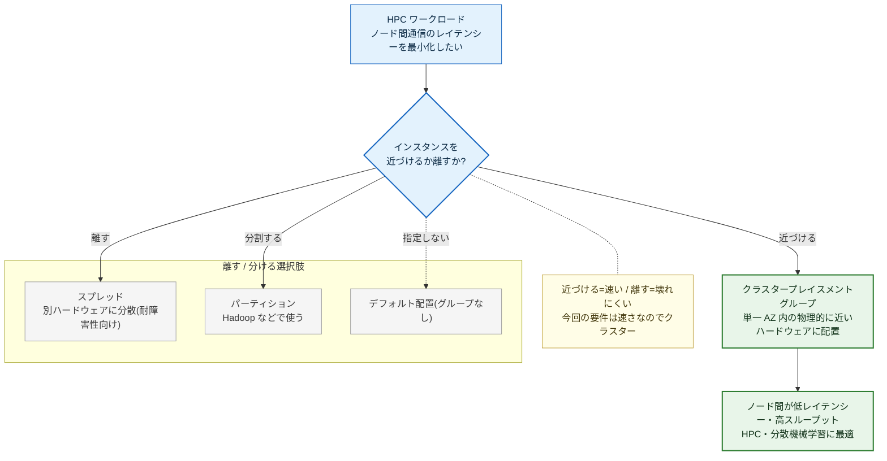
```mermaid
flowchart TD
    REQ["HPC ワークロード<br/>ノード間通信のレイテンシーを最小化したい"]:::req
    Q{"インスタンスを<br/>近づけるか離すか?"}:::judge
    CLUSTER["クラスタープレイスメントグループ<br/>単一 AZ 内の物理的に近いハードウェアに配置"]:::best
    EFFECT["ノード間が低レイテンシー・高スループット<br/>HPC・分散機械学習に最適"]:::best

    subgraph FAR["離す / 分ける選択肢"]
        SPREAD["スプレッド<br/>別ハードウェアに分散(耐障害性向け)"]:::alt
        PART["パーティション<br/>Hadoop などで使う"]:::alt
        DEF["デフォルト配置(グループなし)"]:::alt
    end

    NOTE["近づける=速い / 離す=壊れにくい<br/>今回の要件は速さなのでクラスター"]:::note

    REQ --> Q
    Q -->|"近づける"| CLUSTER
    CLUSTER --> EFFECT
    Q -->|"離す"| SPREAD
    Q -->|"分割する"| PART
    Q -.->|"指定しない"| DEF
    Q -.- NOTE
    classDef req fill:#e3f2fd,stroke:#1565c0,stroke-width:1px,color:#0d2b45
    classDef judge fill:#e3f2fd,stroke:#1565c0,stroke-width:2px,color:#0d2b45
    classDef best fill:#e8f5e9,stroke:#2e7d32,stroke-width:2px,color:#12331a
    classDef alt fill:#f5f5f5,stroke:#9e9e9e,stroke-width:1px,color:#3c3c3c
    classDef svc fill:#ffffff,stroke:#607d8b,stroke-width:1px,color:#22303a
    classDef note fill:#fffde7,stroke:#c0a03c,stroke-width:1px,color:#43380d
```

アプリ表示用の SVG: [`web/diagrams/cmp08.svg`](../../web/diagrams/cmp08.svg)

**解説**: クラスタープレイスメントグループは単一 AZ 内の物理的に近いハードウェアにインスタンスを配置し、ノード間の低レイテンシー・高スループット通信を実現します。HPC や分散機械学習に最適です。逆に耐障害性を高めたい場合はスプレッド(別ハードウェアに分散)、Hadoop などはパーティションを選びます。

**確認事項**: デフォルト配置が非最適な理由は解説に明示がないため、「配置を指定しない」という事実のみを示している。 / パーティションの用途は解説の「Hadoop など」をそのまま使い、それ以上の説明は足していない。

---

## cmp09 — コンピューティング / level 2

**問題**: 7 台の重要なインスタンスを、同一ハードウェア障害で同時に停止しないよう互いに異なる物理ラックへ配置したい。どの構成が適切か?

**正解**: スプレッドプレイスメントグループ

**他の選択肢**: クラスタープレイスメントグループ / 同一 AZ の同一サブネットに配置 / Dedicated Hosts に集約

**図解の主メッセージ**: 同一ハードウェア障害で共倒れさせないなら、各インスタンスを別ラックへ置くスプレッドを選ぶ。

**採用パターン**: 包含(分離の可視化)。この問題の要点は「別ラックに1台ずつ」という配置そのものなので、ラックを枠として描くと主メッセージが図の形と一致する。対比は cmp08 と絵が重複し、同じ絵を2問で使うことになる。(候補: 包含(分離の可視化): スプレッドの配下に独立したラックを並べ、1ラック1台であることを枠で示す / 対比(スプレッド vs クラスター): 同じ7台を集約配置と分散配置で並べて比べる)

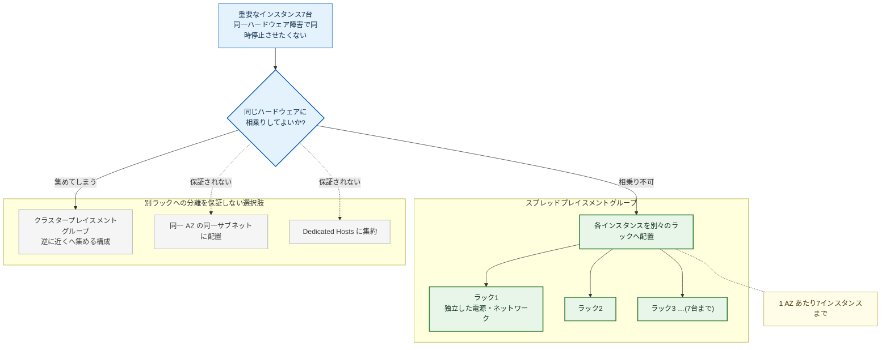
```mermaid
flowchart TD
    REQ["重要なインスタンス7台<br/>同一ハードウェア障害で同時停止させたくない"]:::req
    Q{"同じハードウェアに<br/>相乗りしてよいか?"}:::judge

    subgraph SP["スプレッドプレイスメントグループ"]
        SPREAD["各インスタンスを別々のラックへ配置"]:::best
        RACK1["ラック1<br/>独立した電源・ネットワーク"]:::best
        RACK2["ラック2"]:::best
        RACK3["ラック3 …(7台まで)"]:::best
        SPREAD --> RACK1
        SPREAD --> RACK2
        SPREAD --> RACK3
    end

    subgraph NG["別ラックへの分離を保証しない選択肢"]
        CLUSTER["クラスタープレイスメントグループ<br/>逆に近くへ集める構成"]:::alt
        SUBNET["同一 AZ の同一サブネットに配置"]:::alt
        DH["Dedicated Hosts に集約"]:::alt
    end

    LIMIT["1 AZ あたり7インスタンスまで"]:::note

    REQ --> Q
    Q -->|"相乗り不可"| SPREAD
    SPREAD -.- LIMIT
    Q -->|"集めてしまう"| CLUSTER
    Q -.->|"保証されない"| SUBNET
    Q -.->|"保証されない"| DH
    classDef req fill:#e3f2fd,stroke:#1565c0,stroke-width:1px,color:#0d2b45
    classDef judge fill:#e3f2fd,stroke:#1565c0,stroke-width:2px,color:#0d2b45
    classDef best fill:#e8f5e9,stroke:#2e7d32,stroke-width:2px,color:#12331a
    classDef alt fill:#f5f5f5,stroke:#9e9e9e,stroke-width:1px,color:#3c3c3c
    classDef svc fill:#ffffff,stroke:#607d8b,stroke-width:1px,color:#22303a
    classDef note fill:#fffde7,stroke:#c0a03c,stroke-width:1px,color:#43380d
```

アプリ表示用の SVG: [`web/diagrams/cmp09.svg`](../../web/diagrams/cmp09.svg)

**解説**: スプレッドプレイスメントグループは各インスタンスを別々のラック(独立した電源・ネットワーク)に配置し、ハードウェア障害の同時影響を防ぎます。1 AZ あたり 7 インスタンスまでという制限がある点も頻出です。クラスターは逆に「近くに集める」構成なので障害分離には不向きです。

**確認事項**: 同一サブネット配置と Dedicated Hosts が非最適な理由は解説に明示がない。解説が示す「スプレッドだけが別ラック配置を保証する」という点から、『分離は保証されない』とだけ書いている。 / ラックは図の都合で3つに省略している(実際の要件は7台)。ノード側に「7台まで」と明記して補った。

---

## cmp10 — コンピューティング / level 1

**問題**: Auto Scaling グループの平均 CPU 使用率を常に 50% 前後に保ちたい。最も簡単に実現できるスケーリングポリシーはどれか?

**正解**: ターゲット追跡スケーリング

**他の選択肢**: ステップスケーリング / スケジュールスケーリング / 手動スケーリング

**図解の主メッセージ**: メトリクスを目標値に保ちたいだけなら、目標を宣言するターゲット追跡が最も簡単。

**採用パターン**: 分岐(判断フロー)。制御ループはターゲット追跡の仕組みは説明できるが、他の3ポリシーを同じ図に置けず「なぜこれを選ぶか」に答えられない。設問は選択理由を問うているので分岐を採る。(候補: 分岐(判断フロー): 「増減の計算を誰がやるか」でターゲット追跡と他ポリシーを分ける / 循環(制御ループ): メトリクス測定 → 目標との差 → 台数調整 → 再測定 のフィードバックを描く)

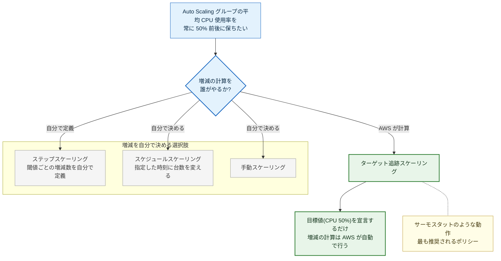
```mermaid
flowchart TD
    REQ["Auto Scaling グループの平均 CPU 使用率を<br/>常に 50% 前後に保ちたい"]:::req
    Q{"増減の計算を<br/>誰がやるか?"}:::judge
    TT["ターゲット追跡スケーリング"]:::best
    DECL["目標値(CPU 50%)を宣言するだけ<br/>増減の計算は AWS が自動で行う"]:::best

    subgraph SELF["増減を自分で決める選択肢"]
        STEP["ステップスケーリング<br/>閾値ごとの増減数を自分で定義"]:::alt
        SCHED["スケジュールスケーリング<br/>指定した時刻に台数を変える"]:::alt
        MANUAL["手動スケーリング"]:::alt
    end

    THERMO["サーモスタットのような動作<br/>最も推奨されるポリシー"]:::note

    REQ --> Q
    Q -->|"AWS が計算"| TT
    TT --> DECL
    TT -.- THERMO
    Q -->|"自分で定義"| STEP
    Q -->|"自分で決める"| SCHED
    Q -->|"自分で決める"| MANUAL
    classDef req fill:#e3f2fd,stroke:#1565c0,stroke-width:1px,color:#0d2b45
    classDef judge fill:#e3f2fd,stroke:#1565c0,stroke-width:2px,color:#0d2b45
    classDef best fill:#e8f5e9,stroke:#2e7d32,stroke-width:2px,color:#12331a
    classDef alt fill:#f5f5f5,stroke:#9e9e9e,stroke-width:1px,color:#3c3c3c
    classDef svc fill:#ffffff,stroke:#607d8b,stroke-width:1px,color:#22303a
    classDef note fill:#fffde7,stroke:#c0a03c,stroke-width:1px,color:#43380d
```

アプリ表示用の SVG: [`web/diagrams/cmp10.svg`](../../web/diagrams/cmp10.svg)

**解説**: ターゲット追跡スケーリングは「メトリクスを目標値(例: CPU 50%)に保つ」と宣言するだけで、増減の計算を AWS が自動で行います。サーモスタットのような動作で、最も推奨されるポリシーです。ステップスケーリングは閾値ごとの増減数を自分で細かく定義する必要があります。

**確認事項**: 手動スケーリングとスケジュールスケーリングが非最適な理由は解説に明示がないため、「台数を自分で決める」という共通点でまとめている。 / スケジュールスケーリングの詳細な使いどころは cmp11 側で扱う。

---

## cmp11 — コンピューティング / level 2

**問題**: 業務アプリは毎週月曜 9 時に必ずアクセスが急増する。スパイクの発生前にキャパシティを確保しておくには、どのスケーリング方式が適切か?

**正解**: スケジュールスケーリング

**他の選択肢**: ターゲット追跡スケーリング / 簡易スケーリング / ヘルスチェックによる置き換え

**図解の主メッセージ**: 急増の時刻が分かっているなら、起こる前に台数を増やすスケジュールスケーリングを選ぶ。

**採用パターン**: 分岐 + 短い時間軸。タイムライン2本は台数の推移カーブを描くことになるが、解説に台数や所要時間の数値はなく創作になる。分岐に 8:45 → 9:00 の2ステップだけ添えれば「スパイク前」という要点が数値を作らずに伝わる。(候補: 分岐 + 短い時間軸: 判断を1問に絞り、正解側だけ 8:45 → 9:00 の順序を描いて『前に増やす』を見せる / タイムライン2本: スケジュールとターゲット追跡の台数推移を同じ時間軸に並べて比較する)

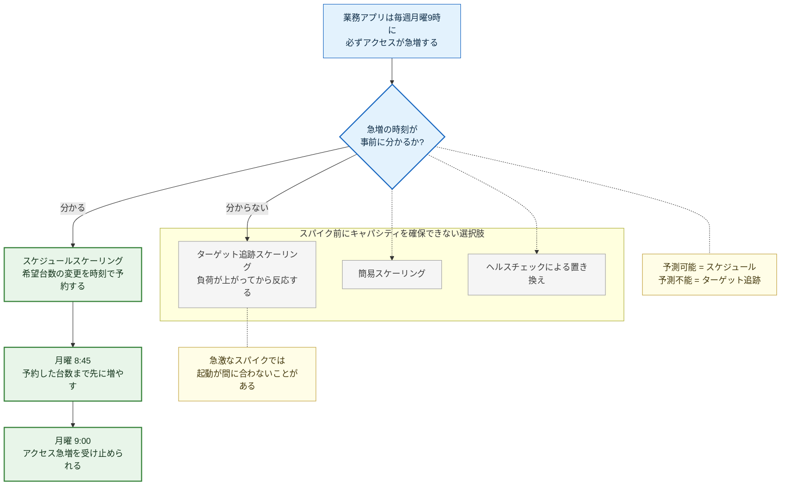
```mermaid
flowchart TD
    REQ["業務アプリは毎週月曜9時に<br/>必ずアクセスが急増する"]:::req
    Q{"急増の時刻が<br/>事前に分かるか?"}:::judge
    SCHED["スケジュールスケーリング<br/>希望台数の変更を時刻で予約する"]:::best
    T845["月曜 8:45<br/>予約した台数まで先に増やす"]:::best
    T900["月曜 9:00<br/>アクセス急増を受け止められる"]:::best

    subgraph NG["スパイク前にキャパシティを確保できない選択肢"]
        TT["ターゲット追跡スケーリング<br/>負荷が上がってから反応する"]:::alt
        SIMPLE["簡易スケーリング"]:::alt
        HC["ヘルスチェックによる置き換え"]:::alt
    end

    LATE["急激なスパイクでは<br/>起動が間に合わないことがある"]:::note
    NOTE["予測可能 = スケジュール<br/>予測不能 = ターゲット追跡"]:::note

    REQ --> Q
    Q -->|"分かる"| SCHED
    SCHED --> T845 --> T900
    Q -->|"分からない"| TT
    TT -.- LATE
    Q -.-> SIMPLE
    Q -.-> HC
    Q -.- NOTE
    classDef req fill:#e3f2fd,stroke:#1565c0,stroke-width:1px,color:#0d2b45
    classDef judge fill:#e3f2fd,stroke:#1565c0,stroke-width:2px,color:#0d2b45
    classDef best fill:#e8f5e9,stroke:#2e7d32,stroke-width:2px,color:#12331a
    classDef alt fill:#f5f5f5,stroke:#9e9e9e,stroke-width:1px,color:#3c3c3c
    classDef svc fill:#ffffff,stroke:#607d8b,stroke-width:1px,color:#22303a
    classDef note fill:#fffde7,stroke:#c0a03c,stroke-width:1px,color:#43380d
```

アプリ表示用の SVG: [`web/diagrams/cmp11.svg`](../../web/diagrams/cmp11.svg)

**解説**: アクセス増加のタイミングが事前に分かっている場合は、スケジュールスケーリングで「月曜 8:45 に希望台数を増やす」ように予約します。ターゲット追跡は負荷が実際に上がってから反応するため、急激なスパイクには起動が間に合わないことがあります。「予測可能 = スケジュール、予測不能 = ターゲット追跡」と整理します。

**確認事項**: 簡易スケーリングとヘルスチェック置き換えが非最適な理由は解説に明示がないため、グループの枠で「事前確保できない」とだけ示している。 / ターゲット追跡が間に合わない度合い(起動時間)は解説に数値がないため図に入れていない。

---

## cmp12 — コンピューティング / level 2

**問題**: 今後 3 年間 EC2 を使い続けるが、インスタンスファミリーやリージョンは柔軟に変更したい。割引を受けつつ柔軟性を最大化する購入オプションはどれか?

**正解**: Compute Savings Plans

**他の選択肢**: スタンダードリザーブドインスタンス / EC2 Instance Savings Plans / スポットインスタンス

**図解の主メッセージ**: ファミリーやリージョンを変えたいなら、適用先を固定しない Compute Savings Plans を選ぶ。

**採用パターン**: 分岐(判断フロー)。マトリクスはリザーブドとスポットの割引率を解説にない根拠で位置づけることになる。分岐なら解説にある「柔軟性か割引率か」という一点だけで判断でき、創作せずに済む。(候補: 分岐(判断フロー): 「適用先を固定してよいか」の1問で Compute と他オプションを分ける / マトリクス: 「柔軟性」×「割引率」の2軸に4オプションを配置する)

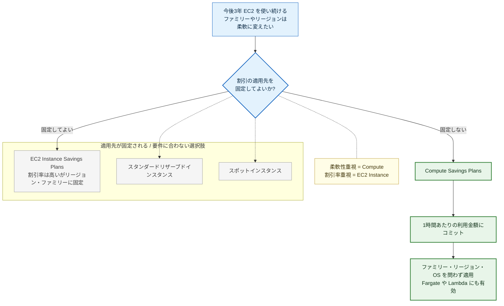
```mermaid
flowchart TD
    REQ["今後3年 EC2 を使い続ける<br/>ファミリーやリージョンは柔軟に変えたい"]:::req
    Q{"割引の適用先を<br/>固定してよいか?"}:::judge
    CSP["Compute Savings Plans"]:::best
    COMMIT["1時間あたりの利用金額にコミット"]:::best
    SCOPE["ファミリー・リージョン・OS を問わず適用<br/>Fargate や Lambda にも有効"]:::best

    subgraph NG["適用先が固定される / 要件に合わない選択肢"]
        EISP["EC2 Instance Savings Plans<br/>割引率は高いがリージョン・ファミリーに固定"]:::alt
        RI["スタンダードリザーブドインスタンス"]:::alt
        SPOT["スポットインスタンス"]:::alt
    end

    NOTE["柔軟性重視 = Compute<br/>割引率重視 = EC2 Instance"]:::note

    REQ --> Q
    Q -->|"固定しない"| CSP
    CSP --> COMMIT --> SCOPE
    Q -->|"固定してよい"| EISP
    Q -.-> RI
    Q -.-> SPOT
    Q -.- NOTE
    classDef req fill:#e3f2fd,stroke:#1565c0,stroke-width:1px,color:#0d2b45
    classDef judge fill:#e3f2fd,stroke:#1565c0,stroke-width:2px,color:#0d2b45
    classDef best fill:#e8f5e9,stroke:#2e7d32,stroke-width:2px,color:#12331a
    classDef alt fill:#f5f5f5,stroke:#9e9e9e,stroke-width:1px,color:#3c3c3c
    classDef svc fill:#ffffff,stroke:#607d8b,stroke-width:1px,color:#22303a
    classDef note fill:#fffde7,stroke:#c0a03c,stroke-width:1px,color:#43380d
```

アプリ表示用の SVG: [`web/diagrams/cmp12.svg`](../../web/diagrams/cmp12.svg)

**解説**: Compute Savings Plans は「1 時間あたりの利用金額」にコミットする方式で、インスタンスファミリー・リージョン・OS を問わず割引が適用され、Fargate や Lambda にも有効です。EC2 Instance Savings Plans は割引率が高い代わりに特定リージョン・ファミリーに固定されます。「柔軟性重視 = Compute、割引率重視 = EC2 Instance」と覚えます。

**確認事項**: スタンダードリザーブドインスタンスとスポットインスタンスが非最適な理由は解説に明示がないため、グループの枠で示すにとどめている。 / cmp01 では『リザーブド / Savings Plans』を1ノードにまとめている。本問で両者を分けたことで粒度が異なるが、いずれも各問の解説の粒度に合わせた結果。

---

## cmp13 — コンピューティング / level 1

**問題**: コンテナを実行したいが、EC2 インスタンスのプロビジョニングやパッチ適用などのサーバー管理を一切行いたくない。どの選択肢が適切か?

**正解**: AWS Fargate

**他の選択肢**: ECS on EC2 / EKS のセルフマネージドノード / EC2 上に Docker を手動インストール

**図解の主メッセージ**: サーバー管理をゼロにしたいなら、ECS でも EKS でもホストを持たない Fargate を選ぶ。

**採用パターン**: レイヤー図 + 分岐。分岐のみだと Fargate が ECS/EKS と並ぶ別サービスに見えてしまい、解説の「ECS・EKS の起動タイプとして選択できる」を伝えられない。オーケストレーション層を1ノード足すだけで誤読を防げる。(候補: レイヤー図 + 分岐: ECS/EKS の下に起動タイプを置き、その選択を1つの判断で決める / 分岐のみ: 4選択肢を「ホストを持つ/持たない」で二分する)

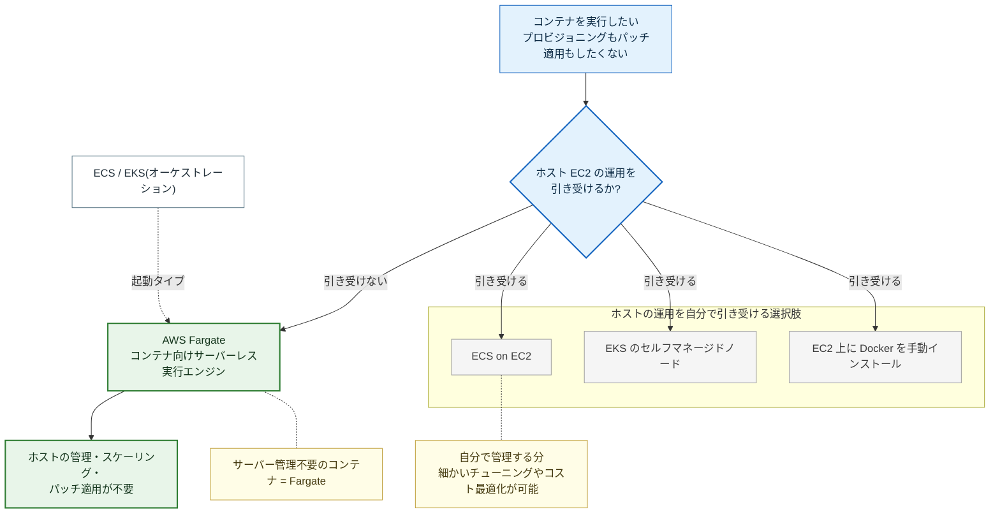
```mermaid
flowchart TD
    REQ["コンテナを実行したい<br/>プロビジョニングもパッチ適用もしたくない"]:::req
    ORCH["ECS / EKS(オーケストレーション)"]:::svc
    Q{"ホスト EC2 の運用を<br/>引き受けるか?"}:::judge
    FARGATE["AWS Fargate<br/>コンテナ向けサーバーレス実行エンジン"]:::best
    FREE["ホストの管理・スケーリング・<br/>パッチ適用が不要"]:::best

    subgraph OWN["ホストの運用を自分で引き受ける選択肢"]
        ECSEC2["ECS on EC2"]:::alt
        EKSSELF["EKS のセルフマネージドノード"]:::alt
        DOCKER["EC2 上に Docker を手動インストール"]:::alt
    end

    TUNE["自分で管理する分<br/>細かいチューニングやコスト最適化が可能"]:::note
    NOTE["サーバー管理不要のコンテナ = Fargate"]:::note

    REQ --> Q
    Q -->|"引き受けない"| FARGATE
    ORCH -.->|"起動タイプ"| FARGATE
    FARGATE --> FREE
    Q -->|"引き受ける"| ECSEC2
    Q -->|"引き受ける"| EKSSELF
    Q -->|"引き受ける"| DOCKER
    ECSEC2 -.- TUNE
    FARGATE -.- NOTE
    classDef req fill:#e3f2fd,stroke:#1565c0,stroke-width:1px,color:#0d2b45
    classDef judge fill:#e3f2fd,stroke:#1565c0,stroke-width:2px,color:#0d2b45
    classDef best fill:#e8f5e9,stroke:#2e7d32,stroke-width:2px,color:#12331a
    classDef alt fill:#f5f5f5,stroke:#9e9e9e,stroke-width:1px,color:#3c3c3c
    classDef svc fill:#ffffff,stroke:#607d8b,stroke-width:1px,color:#22303a
    classDef note fill:#fffde7,stroke:#c0a03c,stroke-width:1px,color:#43380d
```

アプリ表示用の SVG: [`web/diagrams/cmp13.svg`](../../web/diagrams/cmp13.svg)

**解説**: Fargate はコンテナ向けのサーバーレスコンピューティングエンジンで、ECS・EKS の起動タイプとして選択でき、ホストの管理・スケーリング・パッチ適用が不要になります。EC2 起動タイプはホストを自分で管理する分、細かいチューニングやコスト最適化が可能です。「サーバー管理不要のコンテナ = Fargate」が鉄板です。

**確認事項**: EKS + Fargate の組み合わせは解説に「ECS・EKS の起動タイプ」とあることを根拠に、オーケストレーション層を ECS/EKS の1ノードにまとめて表現している。EC2 起動タイプ側への線は交差が増えるため引いていない。 / cmp05 と正解サービスが同じ。cmp05 は ECS の起動タイプ二択、本問は ECS/EKS 共通の実行基盤という視点で描き分けている。

---

## cmp14 — コンピューティング / level 2

**問題**: オンプレミスで Kubernetes を運用してきたチームが、既存のマニフェストやツールをそのまま使いながら AWS へ移行したい。どのサービスが適切か?

**正解**: Amazon EKS

**他の選択肢**: Amazon ECS / AWS Elastic Beanstalk / AWS App Runner

**図解の主メッセージ**: 既存の Kubernetes 資産をそのまま使うことが要件なら、標準 Kubernetes API と完全互換の EKS を選ぶ。

**採用パターン**: 分岐。対比だと ECS / Beanstalk / App Runner それぞれの特徴を解説にない根拠で書き分ける必要が出る。分岐なら解説が示す唯一の判断軸(互換が要るか)がそのまま線の形になる。(候補: 分岐: 「Kubernetes 互換が要るか」の1判断から EKS 側と非 Kubernetes 側へ分ける / 対比(左右2グループ): Kubernetes 互換陣営と AWS 独自陣営を並べて特徴を比べる)

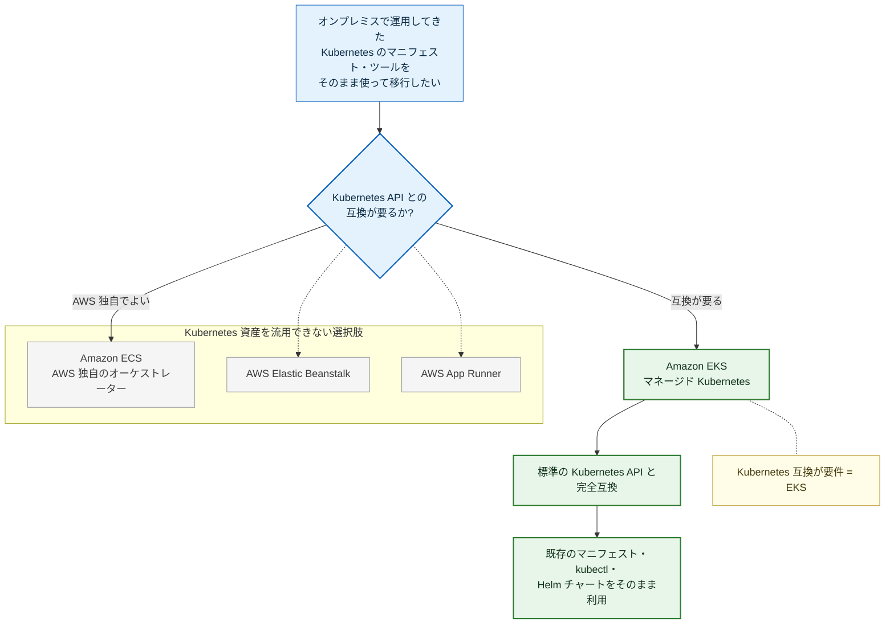
```mermaid
flowchart TD
    REQ["オンプレミスで運用してきた<br/>Kubernetes のマニフェスト・ツールを<br/>そのまま使って移行したい"]:::req
    Q{"Kubernetes API との<br/>互換が要るか?"}:::judge
    EKS["Amazon EKS<br/>マネージド Kubernetes"]:::best
    COMPAT["標準の Kubernetes API と完全互換"]:::best
    ASSETS["既存のマニフェスト・kubectl・<br/>Helm チャートをそのまま利用"]:::best
    NOTE["Kubernetes 互換が要件 = EKS"]:::note

    subgraph NG["Kubernetes 資産を流用できない選択肢"]
        ECS["Amazon ECS<br/>AWS 独自のオーケストレーター"]:::alt
        EB["AWS Elastic Beanstalk"]:::alt
        AR["AWS App Runner"]:::alt
    end

    REQ --> Q
    Q -->|"互換が要る"| EKS
    EKS --> COMPAT --> ASSETS
    Q -->|"AWS 独自でよい"| ECS
    Q -.-> EB
    Q -.-> AR
    EKS -.- NOTE
    classDef req fill:#e3f2fd,stroke:#1565c0,stroke-width:1px,color:#0d2b45
    classDef judge fill:#e3f2fd,stroke:#1565c0,stroke-width:2px,color:#0d2b45
    classDef best fill:#e8f5e9,stroke:#2e7d32,stroke-width:2px,color:#12331a
    classDef alt fill:#f5f5f5,stroke:#9e9e9e,stroke-width:1px,color:#3c3c3c
    classDef svc fill:#ffffff,stroke:#607d8b,stroke-width:1px,color:#22303a
    classDef note fill:#fffde7,stroke:#c0a03c,stroke-width:1px,color:#43380d
```

アプリ表示用の SVG: [`web/diagrams/cmp14.svg`](../../web/diagrams/cmp14.svg)

**解説**: EKS はマネージド Kubernetes サービスで、標準の Kubernetes API と完全互換のため、既存のマニフェスト・kubectl・Helm チャートをそのまま利用できます。ECS は AWS 独自のオーケストレーターなので Kubernetes 資産は流用できません。「Kubernetes 互換が要件 = EKS」で判断します。

**確認事項**: Elastic Beanstalk と App Runner が非最適な理由は解説に記述がないため、個別の理由を書かずグループの枠で位置づけるにとどめている。 / EKS のコントロールプレーン運用やコスト面は解説の範囲外のため描いていない。

---

## cmp15 — コンピューティング / level 1

**問題**: EC2 で一時的なスクラッチデータに対し最高レベルの IOPS が必要だが、インスタンス停止時にデータが消えても構わない。どのストレージが適切か?

**正解**: インスタンスストア

**他の選択肢**: EBS io2 ボリューム / EFS / S3

**図解の主メッセージ**: データが消えてよいという条件があって初めて、ホスト直結 NVMe のインスタンスストアが最高 IOPS の答えになる。

**採用パターン**: 合流(2要件 → 1解)。マトリクスは EFS と S3 の IOPS を解説にない根拠で位置づける必要が出る。合流なら「消えてよい、が効いて初めてインスタンスストアが選べる」という主メッセージがそのまま線の形になる。(候補: 合流(2要件 → 1解): 性能要件と永続性要件を1つの判断へ集め、両方を満たすインスタンスストアを導く / マトリクス: 「IOPS の高さ」×「永続性」の2軸に4つの選択肢を配置する)

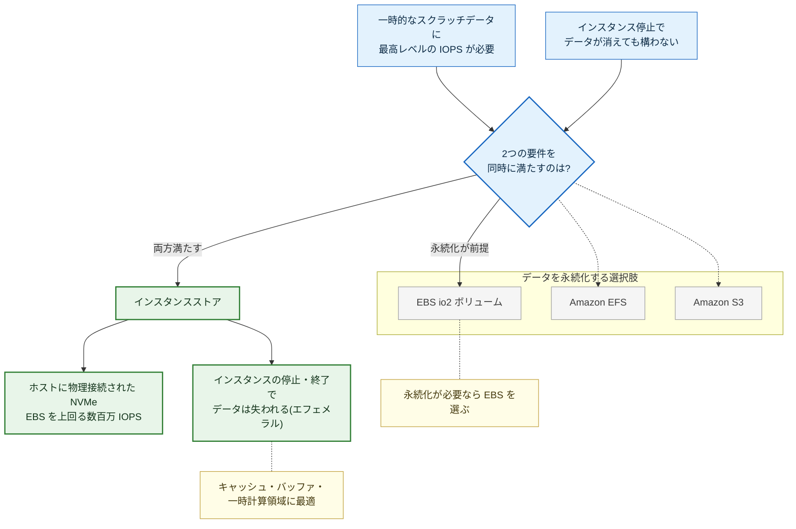
```mermaid
flowchart TD
    R1["一時的なスクラッチデータに<br/>最高レベルの IOPS が必要"]:::req
    R2["インスタンス停止で<br/>データが消えても構わない"]:::req
    Q{"2つの要件を<br/>同時に満たすのは?"}:::judge
    IS["インスタンスストア"]:::best
    NVME["ホストに物理接続された NVMe<br/>EBS を上回る数百万 IOPS"]:::best
    EPH["インスタンスの停止・終了で<br/>データは失われる(エフェメラル)"]:::best
    USE["キャッシュ・バッファ・<br/>一時計算領域に最適"]:::note
    NOTE["永続化が必要なら EBS を選ぶ"]:::note

    subgraph KEEP["データを永続化する選択肢"]
        IO2["EBS io2 ボリューム"]:::alt
        EFS["Amazon EFS"]:::alt
        S3["Amazon S3"]:::alt
    end

    R1 --> Q
    R2 --> Q
    Q -->|"両方満たす"| IS
    IS --> NVME
    IS --> EPH
    EPH -.- USE
    Q -->|"永続化が前提"| IO2
    Q -.-> EFS
    Q -.-> S3
    IO2 -.- NOTE
    classDef req fill:#e3f2fd,stroke:#1565c0,stroke-width:1px,color:#0d2b45
    classDef judge fill:#e3f2fd,stroke:#1565c0,stroke-width:2px,color:#0d2b45
    classDef best fill:#e8f5e9,stroke:#2e7d32,stroke-width:2px,color:#12331a
    classDef alt fill:#f5f5f5,stroke:#9e9e9e,stroke-width:1px,color:#3c3c3c
    classDef svc fill:#ffffff,stroke:#607d8b,stroke-width:1px,color:#22303a
    classDef note fill:#fffde7,stroke:#c0a03c,stroke-width:1px,color:#43380d
```

アプリ表示用の SVG: [`web/diagrams/cmp15.svg`](../../web/diagrams/cmp15.svg)

**解説**: インスタンスストアはホストに物理接続された NVMe ディスクで、EBS を上回る数百万 IOPS を実現できますが、インスタンスの停止・終了でデータが失われるエフェメラル(一時)ストレージです。キャッシュ・バッファ・一時計算領域に最適です。永続化が必要なら EBS を選びます。

**確認事項**: EFS と S3 が非最適な理由は解説に記述がないため、「永続化する選択肢」という枠の位置づけにとどめている。 / インスタンスストアを持つインスタンスファミリーの限定や、再起動(reboot)ではデータが残る点は解説の範囲外のため描いていない。

---

## cmp16 — コンピューティング / level 2

**問題**: EC2 インスタンス内のアプリが自身のインスタンス ID や IAM ロールの一時認証情報を取得する際、SSRF 攻撃への耐性を高めるために使用すべき方式はどれか?

**正解**: IMDSv2(セッショントークン方式)

**他の選択肢**: IMDSv1(リクエスト/レスポンス方式) / 認証情報をユーザーデータに埋め込む / アクセスキーを環境変数にハードコード

**図解の主メッセージ**: 単純な GET だけで読めるか、先にセッショントークンを取る必要があるか — その一手間の差が SSRF 耐性の差になる。

**採用パターン**: 対比 + 分岐。直列だと v2 の手順は分かっても「なぜ v1 では駄目か」が図に現れず、主メッセージ(一手間の差が耐性の差)を伝えられない。手順を左右に並べて初めて差が見える。(候補: 対比(上下2グループ)+ 分岐: v2 と v1 の取得手順を並べ、1つの判断から分ける / 直列: IMDSv2 の PUT → ヘッダー付与 → 取得の3ステップだけをタイムラインで描く)

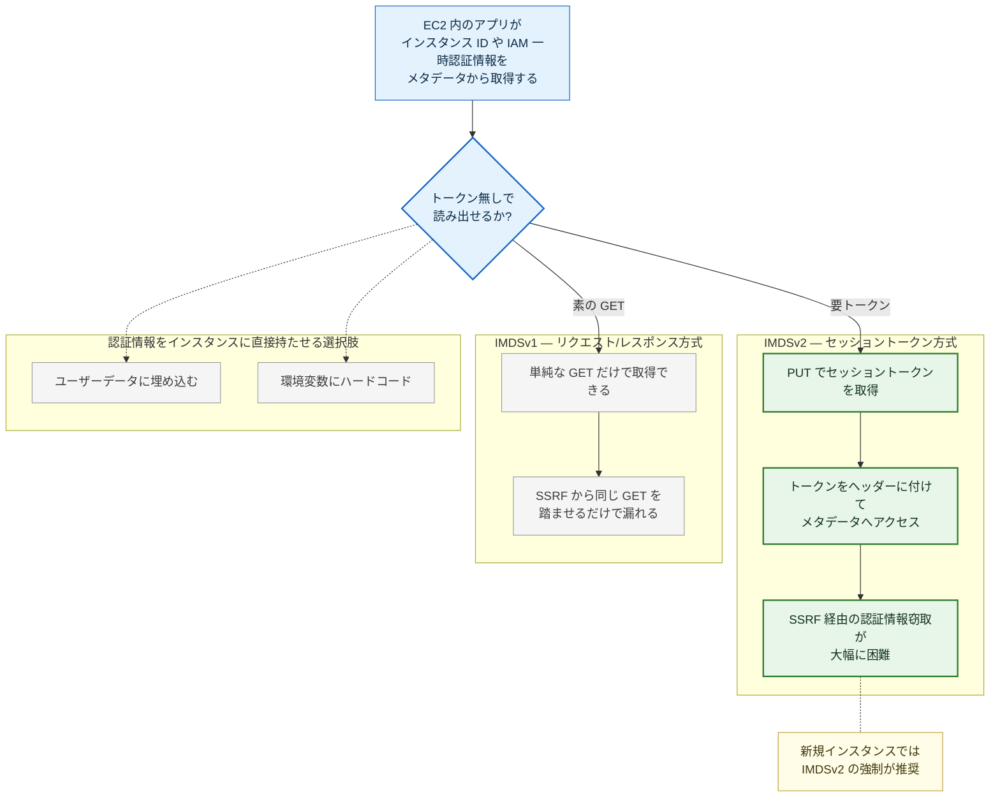
```mermaid
flowchart TD
    REQ["EC2 内のアプリが<br/>インスタンス ID や IAM 一時認証情報を<br/>メタデータから取得する"]:::req
    Q{"トークン無しで<br/>読み出せるか?"}:::judge

    subgraph V2["IMDSv2 — セッショントークン方式"]
        PUT["PUT でセッショントークンを取得"]:::best
        HDR["トークンをヘッダーに付けて<br/>メタデータへアクセス"]:::best
        HARD["SSRF 経由の認証情報窃取が<br/>大幅に困難"]:::best
        PUT --> HDR --> HARD
    end

    subgraph V1["IMDSv1 — リクエスト/レスポンス方式"]
        GET["単純な GET だけで取得できる"]:::alt
        LEAK["SSRF から同じ GET を<br/>踏ませるだけで漏れる"]:::alt
        GET --> LEAK
    end

    subgraph OWN["認証情報をインスタンスに直接持たせる選択肢"]
        UD["ユーザーデータに埋め込む"]:::alt
        ENV["環境変数にハードコード"]:::alt
    end

    NOTE["新規インスタンスでは<br/>IMDSv2 の強制が推奨"]:::note

    REQ --> Q
    Q -->|"要トークン"| PUT
    Q -->|"素の GET"| GET
    Q -.-> UD
    Q -.-> ENV
    HARD -.- NOTE
    classDef req fill:#e3f2fd,stroke:#1565c0,stroke-width:1px,color:#0d2b45
    classDef judge fill:#e3f2fd,stroke:#1565c0,stroke-width:2px,color:#0d2b45
    classDef best fill:#e8f5e9,stroke:#2e7d32,stroke-width:2px,color:#12331a
    classDef alt fill:#f5f5f5,stroke:#9e9e9e,stroke-width:1px,color:#3c3c3c
    classDef svc fill:#ffffff,stroke:#607d8b,stroke-width:1px,color:#22303a
    classDef note fill:#fffde7,stroke:#c0a03c,stroke-width:1px,color:#43380d
```

アプリ表示用の SVG: [`web/diagrams/cmp16.svg`](../../web/diagrams/cmp16.svg)

**解説**: IMDSv2 はまず PUT リクエストでセッショントークンを取得し、それをヘッダーに付けてメタデータへアクセスする方式です。単純な GET だけで取得できる IMDSv1 と異なり、SSRF 経由での認証情報窃取を大幅に困難にします。新規インスタンスでは IMDSv2 の強制が推奨されます。

**確認事項**: ユーザーデータ埋め込みとアクセスキーのハードコードが不適切な理由は解説に記述がないため、選択肢の文面だけを置き、理由は書いていない。 / IMDSv2 のホップ制限(既定 1)は SSRF 耐性に関わるが解説に記述がないため描いていない。

---

## cmp17 — コンピューティング / level 2

**問題**: 起動に 20 分かかる分析アプリを載せた EC2 を夜間停止してコスト削減したいが、翌朝はメモリ上の状態を保ったまま数分で再開したい。どの機能を使うべきか?

**正解**: EC2 Hibernate(休止)

**他の選択肢**: 通常の停止と起動 / AMI を作成して毎朝復元 / リザーブドインスタンスへ変更

**図解の主メッセージ**: メモリ上の状態を翌朝へ持ち越すのは、RAM を EBS へ保存して復元する Hibernate だけ。

**採用パターン**: 対比(2経路)+ 分岐。タイムラインは時刻の目盛りが必要になり要素が増える割に、判断軸(メモリ状態を持ち越すか)が図の中心に来ない。分岐なら1つの問いから2経路へ分かれ、主メッセージがそのまま構造になる。(候補: 対比(2経路)+ 分岐: メモリ状態を持ち越す経路と持ち越さない経路を並べる / タイムライン: 夜(停止)→ 朝(起動)の時間軸に、Hibernate と通常停止の2本を敷く)

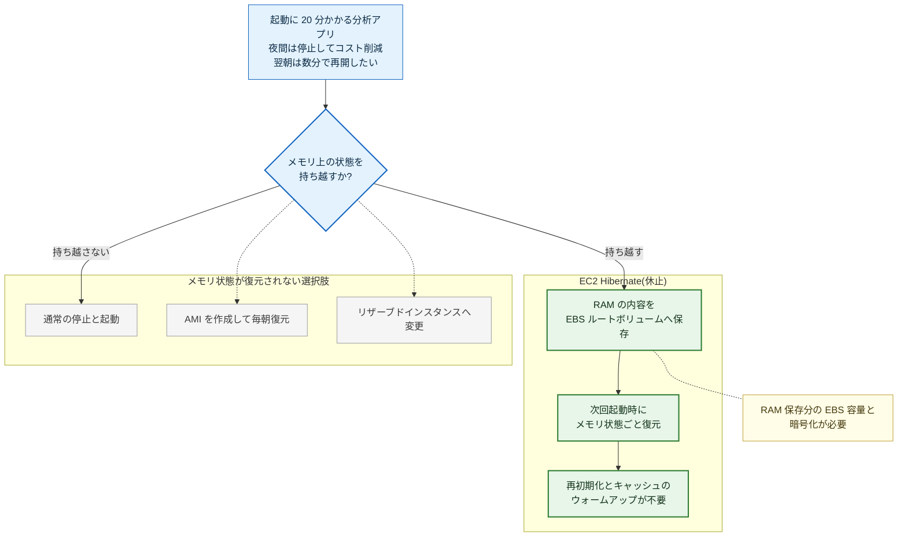
```mermaid
flowchart TD
    REQ["起動に 20 分かかる分析アプリ<br/>夜間は停止してコスト削減<br/>翌朝は数分で再開したい"]:::req
    Q{"メモリ上の状態を<br/>持ち越すか?"}:::judge

    subgraph HIB["EC2 Hibernate(休止)"]
        SAVE["RAM の内容を<br/>EBS ルートボリュームへ保存"]:::best
        RESTORE["次回起動時に<br/>メモリ状態ごと復元"]:::best
        FAST["再初期化とキャッシュの<br/>ウォームアップが不要"]:::best
        SAVE --> RESTORE --> FAST
    end

    subgraph PLAIN["メモリ状態が復元されない選択肢"]
        STOP["通常の停止と起動"]:::alt
        AMI["AMI を作成して毎朝復元"]:::alt
        RI["リザーブドインスタンスへ変更"]:::alt
    end

    COST["RAM 保存分の EBS 容量と<br/>暗号化が必要"]:::note

    REQ --> Q
    Q -->|"持ち越す"| SAVE
    Q -->|"持ち越さない"| STOP
    Q -.-> AMI
    Q -.-> RI
    SAVE -.- COST
    classDef req fill:#e3f2fd,stroke:#1565c0,stroke-width:1px,color:#0d2b45
    classDef judge fill:#e3f2fd,stroke:#1565c0,stroke-width:2px,color:#0d2b45
    classDef best fill:#e8f5e9,stroke:#2e7d32,stroke-width:2px,color:#12331a
    classDef alt fill:#f5f5f5,stroke:#9e9e9e,stroke-width:1px,color:#3c3c3c
    classDef svc fill:#ffffff,stroke:#607d8b,stroke-width:1px,color:#22303a
    classDef note fill:#fffde7,stroke:#c0a03c,stroke-width:1px,color:#43380d
```

アプリ表示用の SVG: [`web/diagrams/cmp17.svg`](../../web/diagrams/cmp17.svg)

**解説**: Hibernate は RAM の内容を EBS ルートボリュームへ保存してから停止し、次回起動時にメモリ状態ごと復元します。アプリの再初期化やキャッシュのウォームアップが不要になるため、起動準備が長いワークロードに有効です。RAM 保存分の EBS 容量と暗号化が必要な点に注意します。

**確認事項**: 通常の停止/起動・AMI 復元・リザーブドインスタンスが要件を満たさない理由は解説に個別記述がないため、Hibernate 側の説明の裏返し(メモリ状態が復元されない)としてグループ名で示すにとどめている。 / Hibernate の対象インスタンスタイプや RAM サイズの上限といった前提条件は解説の範囲外のため描いていない。

---

## cmp18 — コンピューティング / level 1

**問題**: 開発者がコードをアップロードするだけで、EC2・ALB・Auto Scaling などのインフラを自動構築・管理してくれるサービスはどれか?

**正解**: AWS Elastic Beanstalk

**他の選択肢**: AWS CloudFormation / AWS Systems Manager / Amazon Lightsail

**図解の主メッセージ**: 渡すのがコードだけなら PaaS の Elastic Beanstalk、インフラ定義のテンプレートを書くなら CloudFormation。

**採用パターン**: 分岐 + 包含。レイヤー図は Beanstalk の内部構造の説明になり、試験で問われる「CloudFormation との使い分け」が図から消える。分岐にすれば判断軸が主役のまま、自動化の範囲は1ノードで足りる。(候補: 分岐 + 包含: 「渡すもの」の1判断で分け、Beanstalk が面倒を見る範囲を枠で囲う / レイヤー図: 開発者 / PaaS / 実リソース(EC2・ALB・ASG)を上下に積む)

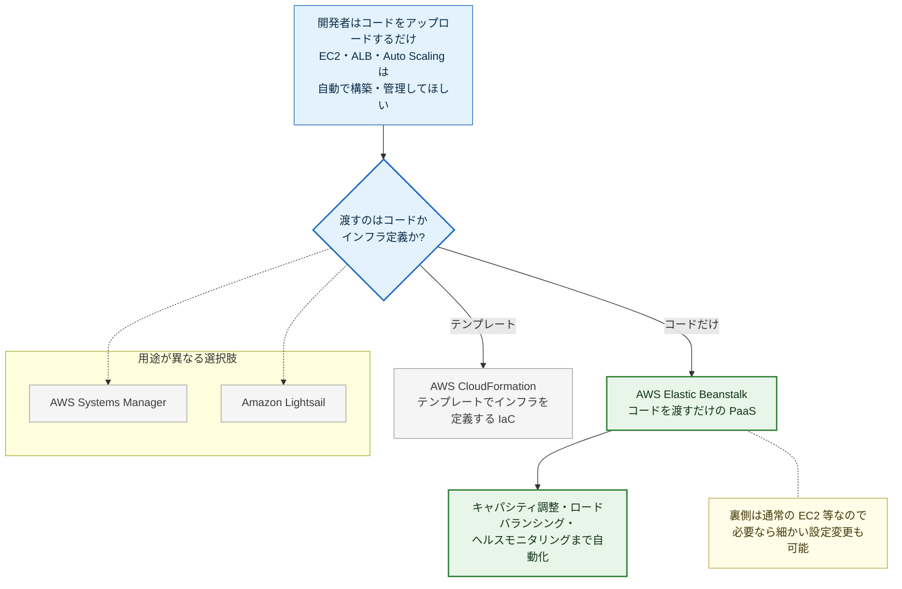
```mermaid
flowchart TD
    REQ["開発者はコードをアップロードするだけ<br/>EC2・ALB・Auto Scaling は<br/>自動で構築・管理してほしい"]:::req
    Q{"渡すのはコードか<br/>インフラ定義か?"}:::judge
    EB["AWS Elastic Beanstalk<br/>コードを渡すだけの PaaS"]:::best
    AUTO["キャパシティ調整・ロードバランシング・<br/>ヘルスモニタリングまで自動化"]:::best
    CFN["AWS CloudFormation<br/>テンプレートでインフラを定義する IaC"]:::alt
    NOTE["裏側は通常の EC2 等なので<br/>必要なら細かい設定変更も可能"]:::note

    subgraph OTHER["用途が異なる選択肢"]
        SSM["AWS Systems Manager"]:::alt
        LS["Amazon Lightsail"]:::alt
    end

    REQ --> Q
    Q -->|"コードだけ"| EB
    EB --> AUTO
    EB -.- NOTE
    Q -->|"テンプレート"| CFN
    Q -.-> SSM
    Q -.-> LS
    classDef req fill:#e3f2fd,stroke:#1565c0,stroke-width:1px,color:#0d2b45
    classDef judge fill:#e3f2fd,stroke:#1565c0,stroke-width:2px,color:#0d2b45
    classDef best fill:#e8f5e9,stroke:#2e7d32,stroke-width:2px,color:#12331a
    classDef alt fill:#f5f5f5,stroke:#9e9e9e,stroke-width:1px,color:#3c3c3c
    classDef svc fill:#ffffff,stroke:#607d8b,stroke-width:1px,color:#22303a
    classDef note fill:#fffde7,stroke:#c0a03c,stroke-width:1px,color:#43380d
```

アプリ表示用の SVG: [`web/diagrams/cmp18.svg`](../../web/diagrams/cmp18.svg)

**解説**: Elastic Beanstalk はコードをデプロイするだけで、キャパシティ調整・ロードバランシング・ヘルスモニタリングまで自動化する PaaS です。裏側のリソースは通常の EC2 等なので、必要なら細かい設定変更も可能です。CloudFormation は「テンプレートでインフラを定義する IaC」であり、コードだけ渡す使い方とは異なります。

**確認事項**: Systems Manager と Lightsail が非最適な理由は解説に記述がないため、個別の理由を書かず「用途が異なる選択肢」の枠に置くにとどめている。 / Beanstalk が構築するリソース名(EC2・ALB・Auto Scaling)は問題文に挙がっているものだけを自動化の対象として記載している。

---

## cmp19 — コンピューティング / level 2

**問題**: 東京リージョンで稼働中の EC2 環境を、災害対策として大阪リージョンでも起動できるようにしたい。カスタム AMI についてまず行うべきことは?

**正解**: AMI を大阪リージョンへコピーする

**他の選択肢**: AMI はグローバルリソースなのでそのまま使える / EBS スナップショットを S3 にエクスポートする / 大阪で新規にインスタンスを手動構築する

**図解の主メッセージ**: AMI はリージョン単位のリソースなので、大阪で使うにはまず AMI のコピーが要る。

**採用パターン**: 包含 + コピー矢印。分岐だけだと「リージョン単位」という言葉を読ませるだけになるが、枠を2つ描けばスコープが図形として伝わり、コピーが枠をまたぐ操作であることも同時に分かる。(候補: 包含(リージョン枠2つ)+ コピー矢印: リソースのスコープを枠そのもので表す / 分岐: 「AMI はグローバルかリージョン単位か」の判断から正解と誤答へ分ける)

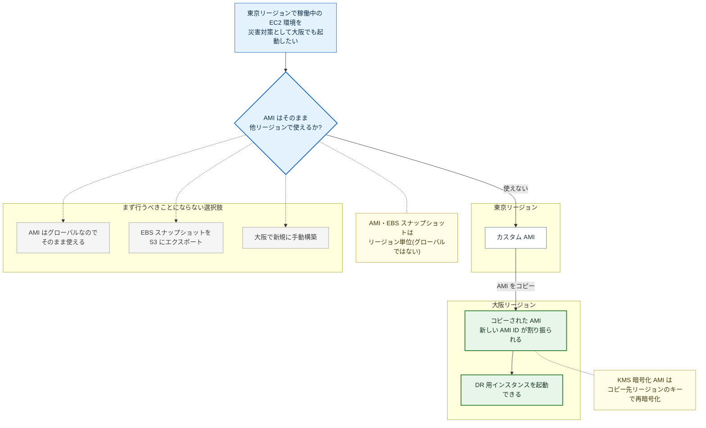
```mermaid
flowchart TD
    REQ["東京リージョンで稼働中の EC2 環境を<br/>災害対策として大阪でも起動したい"]:::req
    Q{"AMI はそのまま<br/>他リージョンで使えるか?"}:::judge
    NOTE["AMI・EBS スナップショットは<br/>リージョン単位(グローバルではない)"]:::note

    subgraph TOKYO["東京リージョン"]
        AMI_T["カスタム AMI"]:::svc
    end

    subgraph OSAKA["大阪リージョン"]
        AMI_O["コピーされた AMI<br/>新しい AMI ID が割り振られる"]:::best
        EC2_O["DR 用インスタンスを起動できる"]:::best
        AMI_O --> EC2_O
    end

    KMS["KMS 暗号化 AMI は<br/>コピー先リージョンのキーで再暗号化"]:::note

    subgraph NG["まず行うべきことにならない選択肢"]
        GLOBAL["AMI はグローバルなので<br/>そのまま使える"]:::alt
        EXP["EBS スナップショットを<br/>S3 にエクスポート"]:::alt
        MANUAL["大阪で新規に手動構築"]:::alt
    end

    REQ --> Q
    Q -->|"使えない"| AMI_T
    AMI_T -->|"AMI をコピー"| AMI_O
    Q -.-> GLOBAL
    Q -.-> EXP
    Q -.-> MANUAL
    AMI_O -.- KMS
    Q -.- NOTE
    classDef req fill:#e3f2fd,stroke:#1565c0,stroke-width:1px,color:#0d2b45
    classDef judge fill:#e3f2fd,stroke:#1565c0,stroke-width:2px,color:#0d2b45
    classDef best fill:#e8f5e9,stroke:#2e7d32,stroke-width:2px,color:#12331a
    classDef alt fill:#f5f5f5,stroke:#9e9e9e,stroke-width:1px,color:#3c3c3c
    classDef svc fill:#ffffff,stroke:#607d8b,stroke-width:1px,color:#22303a
    classDef note fill:#fffde7,stroke:#c0a03c,stroke-width:1px,color:#43380d
```

アプリ表示用の SVG: [`web/diagrams/cmp19.svg`](../../web/diagrams/cmp19.svg)

**解説**: AMI はリージョンローカルなリソースであり、別リージョンで使うには明示的なコピーが必要です。コピー先で新しい AMI ID が割り振られます。KMS 暗号化された AMI をコピーする場合は、コピー先リージョンのキーを指定して再暗号化します。「AMI・EBS スナップショットはリージョン単位」は頻出ポイントです。

**確認事項**: EBS スナップショットの S3 エクスポートと手動構築が非最適な理由は解説に記述がないため、枠の位置づけにとどめている。 / コピー後のインスタンス起動は DR の目的から自明な後続として1ノードだけ置いた。実際の DR 手順(起動テンプレート等)は解説の範囲外のため描いていない。

---

## cmp20 — コンピューティング / level 2

**問題**: Auto Scaling によるスケールイン時、インスタンスが終了する前にログを S3 へ退避する処理を確実に実行したい。どの機能を使うべきか?

**正解**: ライフサイクルフック

**他の選択肢**: 終了保護(Termination Protection) / スケールインクールダウン / CloudWatch アラーム

**図解の主メッセージ**: 終了を Terminating:Wait で待たせて自前の処理を挟めるのはライフサイクルフックだけ。

**採用パターン**: 直列(状態遷移)。対比は他3つの役割を解説にない根拠で書き分ける必要が出るうえ、「どこで処理が走るのか」という肝心の一点が図に現れない。直列なら待ち状態が流れの中の一区間として見える。(候補: 直列(状態遷移): スケールイン → Terminating:Wait → 処理 → continue → 終了 の順に並べる / 対比: 4つの選択肢の役割を並べ、終了前に割り込めるものを1つ選ばせる)

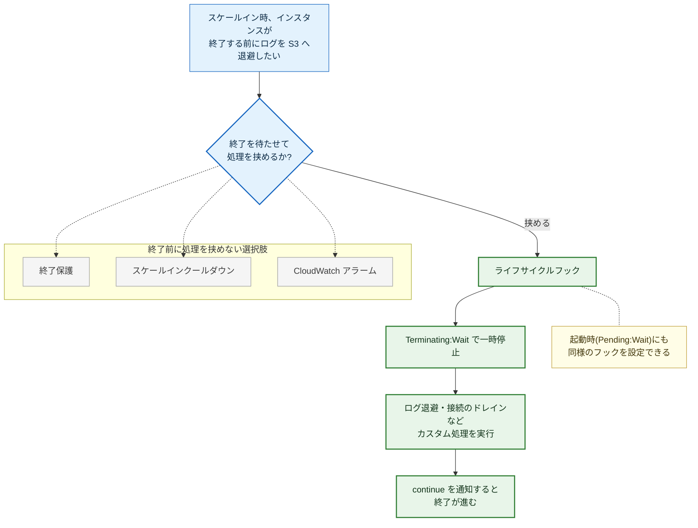
```mermaid
flowchart TD
    REQ["スケールイン時、インスタンスが<br/>終了する前にログを S3 へ退避したい"]:::req
    Q{"終了を待たせて<br/>処理を挟めるか?"}:::judge
    HOOK["ライフサイクルフック"]:::best
    WAIT["Terminating:Wait で一時停止"]:::best
    JOB["ログ退避・接続のドレインなど<br/>カスタム処理を実行"]:::best
    CONT["continue を通知すると<br/>終了が進む"]:::best
    LAUNCH["起動時(Pending:Wait)にも<br/>同様のフックを設定できる"]:::note

    subgraph NG["終了前に処理を挟めない選択肢"]
        PROT["終了保護"]:::alt
        COOL["スケールインクールダウン"]:::alt
        CWA["CloudWatch アラーム"]:::alt
    end

    REQ --> Q
    Q -->|"挟める"| HOOK
    HOOK --> WAIT --> JOB --> CONT
    Q -.-> PROT
    Q -.-> COOL
    Q -.-> CWA
    HOOK -.- LAUNCH
    classDef req fill:#e3f2fd,stroke:#1565c0,stroke-width:1px,color:#0d2b45
    classDef judge fill:#e3f2fd,stroke:#1565c0,stroke-width:2px,color:#0d2b45
    classDef best fill:#e8f5e9,stroke:#2e7d32,stroke-width:2px,color:#12331a
    classDef alt fill:#f5f5f5,stroke:#9e9e9e,stroke-width:1px,color:#3c3c3c
    classDef svc fill:#ffffff,stroke:#607d8b,stroke-width:1px,color:#22303a
    classDef note fill:#fffde7,stroke:#c0a03c,stroke-width:1px,color:#43380d
```

アプリ表示用の SVG: [`web/diagrams/cmp20.svg`](../../web/diagrams/cmp20.svg)

**解説**: ライフサイクルフックを使うと、インスタンスが Terminating:Wait 状態で一時停止し、その間にログ退避や接続のドレインなどのカスタム処理を実行できます。処理完了後に continue を通知すると終了が進みます。起動時(Pending:Wait)にも同様のフックを設定できます。

**確認事項**: 終了保護・クールダウン・CloudWatch アラームが要件を満たさない理由は解説に記述がないため、「終了前に処理を挟めない」という共通点だけで枠にまとめている。 / フックのタイムアウト時間や既定の継続動作(ABANDON / CONTINUE)は解説の範囲外のため描いていない。

---

## cmp21 — コンピューティング / level 2

**問題**: セッション情報をローカルに保持するレガシー Web アプリを ALB 配下で動かしたところ、リクエストごとに別サーバーへ振られてログインが切れる。応急対応として有効な ALB の機能はどれか?

**正解**: スティッキーセッション(セッションアフィニティ)

**他の選択肢**: クロスゾーン負荷分散 / 接続ドレイン / ホストベースルーティング

**図解の主メッセージ**: ローカルにセッションを持つアプリの応急対応は、Cookie で同じターゲットへ固定するスティッキーセッション。

**採用パターン**: 直列(症状 → 応急対応 → 恒久対応)。対比では解説が明示する「応急と恒久は別物」という前提が図から抜ける。直列なら正解が応急対応の位置に置かれ、外部化がその先にあることも同じ1枚で伝わる。(候補: 直列(症状 → 応急対応 → 恒久対応): 時間軸に沿って対応の段階を並べる / 対比: ALB の4機能を並べ、セッション固定に効くものを1つ選ばせる)

```mermaid
flowchart TD
    REQ["セッション情報をローカルに保持する<br/>レガシー Web アプリを ALB 配下で稼働"]:::req
    SYM["リクエストごとに別サーバーへ振られ<br/>ログインが切れる"]:::req
    Q{"同じターゲットへ<br/>固定できるか?"}:::judge
    STICKY["スティッキーセッション<br/>(セッションアフィニティ)"]:::best
    COOKIE["ALB が Cookie で同一クライアントを<br/>同じターゲットへ振り続ける"]:::best
    LIMIT["負荷の偏り・インスタンス障害時の<br/>セッション消失は残る"]:::note
    PERM["ElastiCache や DynamoDB へ<br/>セッションを外部化"]:::svc

    subgraph NG["振り先を固定しない選択肢"]
        XZ["クロスゾーン負荷分散"]:::alt
        DRAIN["接続ドレイン"]:::alt
        HOST["ホストベースルーティング"]:::alt
    end

    REQ --> SYM --> Q
    Q -->|"応急対応"| STICKY
    STICKY --> COOKIE
    COOKIE -.- LIMIT
    LIMIT -.->|"恒久対応"| PERM
    Q -.-> XZ
    Q -.-> DRAIN
    Q -.-> HOST
    classDef req fill:#e3f2fd,stroke:#1565c0,stroke-width:1px,color:#0d2b45
    classDef judge fill:#e3f2fd,stroke:#1565c0,stroke-width:2px,color:#0d2b45
    classDef best fill:#e8f5e9,stroke:#2e7d32,stroke-width:2px,color:#12331a
    classDef alt fill:#f5f5f5,stroke:#9e9e9e,stroke-width:1px,color:#3c3c3c
    classDef svc fill:#ffffff,stroke:#607d8b,stroke-width:1px,color:#22303a
    classDef note fill:#fffde7,stroke:#c0a03c,stroke-width:1px,color:#43380d
```

アプリ表示用の SVG: [`web/diagrams/cmp21.svg`](../../web/diagrams/cmp21.svg)

**解説**: スティッキーセッションを有効にすると、ALB が Cookie を使って同一クライアントを同じターゲットへ振り続けるため、ローカルセッション依存のアプリでも動作します。ただし負荷の偏りやインスタンス障害時のセッション消失は残るため、恒久対応としては ElastiCache や DynamoDB へのセッション外部化が推奨されます。

**確認事項**: クロスゾーン負荷分散・接続ドレイン・ホストベースルーティングが要件を満たさない理由は解説に記述がないため、「振り先を固定しない」という共通点だけで枠にまとめている。 / セッション外部化は正解の選択肢ではないが解説が推奨として挙げているため、緑(正解の構成要素)ではなく白のサービスとして応急対応の先に置いている。

---

## cmp22 — コンピューティング / level 1

**問題**: スケールアウト(水平分散)に対応していないモノリシックなデータベースサーバーの性能が不足してきた。まず取れる対応はどれか?

**正解**: より大きいインスタンスタイプへ変更する(スケールアップ)

**他の選択肢**: インスタンスを複数台に増やす / スポットインスタンスに変更する / AZ を追加する

**図解の主メッセージ**: アプリが分散に対応していないなら台数は増やせない。まずインスタンスタイプを上げる垂直スケーリング。

**採用パターン**: 分岐(前提の確認 → 2経路)。対比だと2つのやり方が対等に見え、「今回は前提を満たさないから垂直しかない」という主メッセージが弱まる。判断を先頭に置けば前提が効いていることが線で分かる。(候補: 分岐(前提の確認 → 2経路): 「水平分散できるか」を先に問い、垂直側と水平側へ分ける / 対比(左右2グループ): 垂直スケーリングと水平スケーリングの特徴を並べて比べる)

```mermaid
flowchart TD
    REQ["スケールアウトに対応していない<br/>モノリシックな DB サーバー<br/>性能が不足してきた"]:::req
    Q{"アプリは水平分散<br/>できるか?"}:::judge
    UP["より大きいインスタンスタイプへ変更<br/>(垂直スケーリング / スケールアップ)"]:::best
    STEP["停止 → タイプ変更 → 起動"]:::best
    PRE["水平スケーリングはアプリが<br/>ステートレスであることが前提"]:::note

    subgraph NG["今回は性能不足を解決しない選択肢"]
        MULTI["インスタンスを複数台に増やす<br/>(水平スケーリング)"]:::alt
        AZ["AZ を追加する"]:::alt
        SPOT["スポットインスタンスに変更"]:::alt
    end

    REQ --> Q
    Q -->|"できない"| UP
    UP --> STEP
    Q -->|"前提が不成立"| MULTI
    Q -.-> AZ
    Q -.-> SPOT
    MULTI -.- PRE
    classDef req fill:#e3f2fd,stroke:#1565c0,stroke-width:1px,color:#0d2b45
    classDef judge fill:#e3f2fd,stroke:#1565c0,stroke-width:2px,color:#0d2b45
    classDef best fill:#e8f5e9,stroke:#2e7d32,stroke-width:2px,color:#12331a
    classDef alt fill:#f5f5f5,stroke:#9e9e9e,stroke-width:1px,color:#3c3c3c
    classDef svc fill:#ffffff,stroke:#607d8b,stroke-width:1px,color:#22303a
    classDef note fill:#fffde7,stroke:#c0a03c,stroke-width:1px,color:#43380d
```

アプリ表示用の SVG: [`web/diagrams/cmp22.svg`](../../web/diagrams/cmp22.svg)

**解説**: 分散処理に対応していないアプリの性能向上は、インスタンスタイプを上位に変更する垂直スケーリング(スケールアップ)が基本です。EC2 は停止→タイプ変更→起動で簡単に変更できます。台数を増やす水平スケーリングはアプリ側がステートレスであることが前提です。

**確認事項**: スポットインスタンスへの変更と AZ 追加が性能不足の解決にならない理由は解説に記述がないため、共通の枠に置くにとどめている。 / 水平スケーリング自体は正当な手段だが、本問はアプリが対応していない前提のため誤答側に置き、その前提を注釈で明示している。

---

## cmp23 — コンピューティング / level 2

**問題**: 稼働中の EC2 群に対し、CloudWatch メトリクスの実績に基づいて「過剰・過小プロビジョニング」を判定し、最適なインスタンスタイプを提案してほしい。どのサービスを使うか?

**正解**: AWS Compute Optimizer

**他の選択肢**: AWS Cost Explorer / AWS Budgets / Amazon Inspector

**図解の主メッセージ**: 利用実績のメトリクスから最適なインスタンスタイプを出すのは Compute Optimizer。コストの可視化とは役割が違う。

**採用パターン**: 直列(入力 → 分析 → 推奨)+ 分岐。対比表は Budgets の役割を解説にない根拠で書く必要が出る。直列にすれば「CloudWatch の実績が入力で、推奨が出力」という Compute Optimizer 固有の働きが主役になり、他サービスは経路の違いとして片付く。(候補: 直列(入力 → 分析 → 推奨)+ 分岐: 実績が推奨に変わる流れを描き、他サービスは別経路にする / テーブル/対比: 4サービスの役割を並べて比較する)

```mermaid
flowchart TD
    REQ["稼働中の EC2 群について<br/>過剰・過小プロビジョニングを判定し<br/>最適なインスタンスタイプを提案してほしい"]:::req
    Q{"利用実績から<br/>サイズを判定するか?"}:::judge
    CW["CloudWatch メトリクス<br/>CPU・メモリなどの利用実績"]:::svc
    CO["AWS Compute Optimizer"]:::best
    ML["機械学習で分析"]:::best
    REC["EC2・Auto Scaling・EBS・Lambda の<br/>最適なサイズを推奨"]:::best
    NOTE["Cost Explorer もライトサイジング推奨を持つが<br/>体系的な性能分析は Compute Optimizer"]:::note

    subgraph NG["役割が異なる選択肢"]
        CE["AWS Cost Explorer<br/>コストの可視化"]:::alt
        BUD["AWS Budgets"]:::alt
        INSP["Amazon Inspector<br/>脆弱性診断"]:::alt
    end

    REQ --> Q
    Q -->|"実績で判定"| CO
    CW --> CO
    CO --> ML --> REC
    Q -.-> CE
    Q -.-> BUD
    Q -.-> INSP
    CE -.- NOTE
    classDef req fill:#e3f2fd,stroke:#1565c0,stroke-width:1px,color:#0d2b45
    classDef judge fill:#e3f2fd,stroke:#1565c0,stroke-width:2px,color:#0d2b45
    classDef best fill:#e8f5e9,stroke:#2e7d32,stroke-width:2px,color:#12331a
    classDef alt fill:#f5f5f5,stroke:#9e9e9e,stroke-width:1px,color:#3c3c3c
    classDef svc fill:#ffffff,stroke:#607d8b,stroke-width:1px,color:#22303a
    classDef note fill:#fffde7,stroke:#c0a03c,stroke-width:1px,color:#43380d
```

アプリ表示用の SVG: [`web/diagrams/cmp23.svg`](../../web/diagrams/cmp23.svg)

**解説**: Compute Optimizer は CPU・メモリなどの利用実績を機械学習で分析し、EC2・Auto Scaling・EBS・Lambda の最適なサイズを推奨します。Cost Explorer もライトサイジング推奨を持ちますが、体系的な性能分析は Compute Optimizer が担当です。Inspector は脆弱性診断でありサイジングとは無関係です。

**確認事項**: Budgets が非最適な理由は解説に記述がないため、名前だけを「役割が異なる選択肢」の枠に置いている。 / Compute Optimizer の推奨対象(EC2・Auto Scaling・EBS・Lambda)は解説の記述をそのまま使い、精度や有効化手順は描いていない。
