# 問題図解ギャラリー

**自動生成ファイル — 直接編集禁止。**
`data/diagrams/<問題ID>.json` を編集して `python3 scripts/build-diagrams.py` を実行すること
(手順: [DIAGRAM-WORKFLOW.md](../DIAGRAM-WORKFLOW.md))。

収録: 213 問 / 全 400 問

---

## cmp01 — コンピューティング / level 1

**問題**: 夜間バッチ処理のように中断されても再実行可能なワークロードを、最も低コストで EC2 上で実行したい。どの購入オプションが最適か?

**正解**: スポットインスタンス

**他の選択肢**: オンデマンドインスタンス / リザーブドインスタンス(1年・全前払い) / Dedicated Hosts

**図解の主メッセージ**: 中断されても再実行できるワークロードなら、最安のスポットインスタンスを選ぶ。

**採用パターン**: 分岐(判断フロー)。試験本番の判断順序(まず中断耐性、次に稼働の継続性)をそのままなぞれるため、2軸マトリクスより解読が少なくて済む。(候補: 分岐(判断フロー): 2つの問いで4つの選択肢に振り分ける / マトリクス: 中断耐性 × 稼働期間の2軸に4オプションを配置)

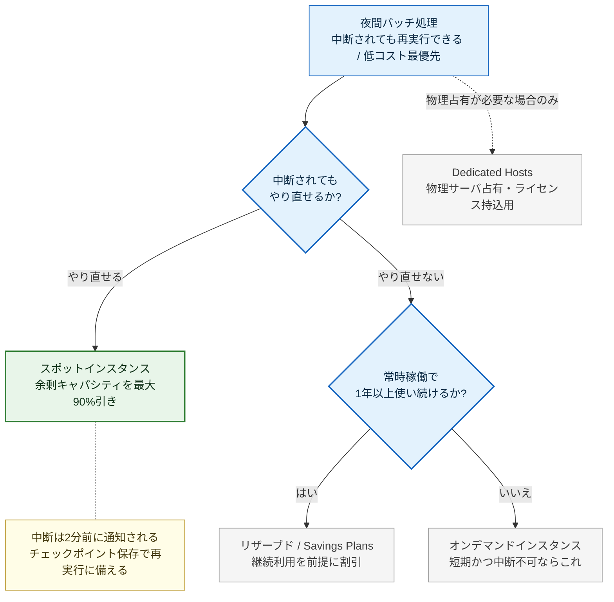
```mermaid
flowchart TD
    START["夜間バッチ処理<br/>中断されても再実行できる / 低コスト最優先"]:::req
    Q1{"中断されても<br/>やり直せるか?"}:::judge
    SPOT["スポットインスタンス<br/>余剰キャパシティを最大90%引き"]:::best
    NOTE["中断は2分前に通知される<br/>チェックポイント保存で再実行に備える"]:::note
    Q2{"常時稼働で<br/>1年以上使い続けるか?"}:::judge
    RI["リザーブド / Savings Plans<br/>継続利用を前提に割引"]:::alt
    OD["オンデマンドインスタンス<br/>短期かつ中断不可ならこれ"]:::alt
    DH["Dedicated Hosts<br/>物理サーバ占有・ライセンス持込用"]:::alt

    START --> Q1
    Q1 -->|"やり直せる"| SPOT
    Q1 -->|"やり直せない"| Q2
    Q2 -->|"はい"| RI
    Q2 -->|"いいえ"| OD
    START -.->|"物理占有が必要な場合のみ"| DH
    SPOT -.- NOTE
    classDef req fill:#e3f2fd,stroke:#1565c0,stroke-width:1px,color:#0d2b45
    classDef judge fill:#e3f2fd,stroke:#1565c0,stroke-width:2px,color:#0d2b45
    classDef best fill:#e8f5e9,stroke:#2e7d32,stroke-width:2px,color:#12331a
    classDef alt fill:#f5f5f5,stroke:#9e9e9e,stroke-width:1px,color:#3c3c3c
    classDef svc fill:#ffffff,stroke:#607d8b,stroke-width:1px,color:#22303a
    classDef note fill:#fffde7,stroke:#c0a03c,stroke-width:1px,color:#43380d
```

アプリ表示用の SVG: [`web/diagrams/cmp01.svg`](../../web/diagrams/cmp01.svg)

**解説**: スポットインスタンスは AWS の余剰キャパシティを最大 90% 引きで利用でき、中断耐性のあるバッチ処理・分析処理に最適です。中断通知(2分前)を受けてチェックポイントを保存する設計にします。常時稼働かつ中断不可ならリザーブド/Savings Plans、短期かつ中断不可ならオンデマンドを選びます。

**確認事項**: Savings Plans はリザーブドと1ノードにまとめている(解説の粒度に合わせた)。両者の違いを問う問題を追加する場合は分割が必要。

---

## cmp02 — コンピューティング / level 1

**問題**: Auto Scaling グループで、平均 CPU 使用率を 50% 前後に自動で維持したい。最も運用負荷が低いスケーリングポリシーはどれか?

**正解**: ターゲット追跡スケーリングポリシー

**他の選択肢**: シンプルスケーリングポリシー / ステップスケーリングポリシー / スケジュールされたスケーリング

**図解の主メッセージ**: 目標値の維持が要件なら、目標を1つ与えるだけで AWS が増減を計算するターゲット追跡が最も運用負荷が低い。

**採用パターン**: 循環(フィードバックループ)+ 対比。「AWS が代わりに回してくれる輪」が絵として見えることが主メッセージそのものであり、表では運用負荷の差が伝わりにくい。(候補: 循環(フィードバックループ)+ 対比: 自動で回る制御ループと、手で設計するポリシー群を並べる / テーブル: 4ポリシー × 設定項目 / 向くケースの比較表)

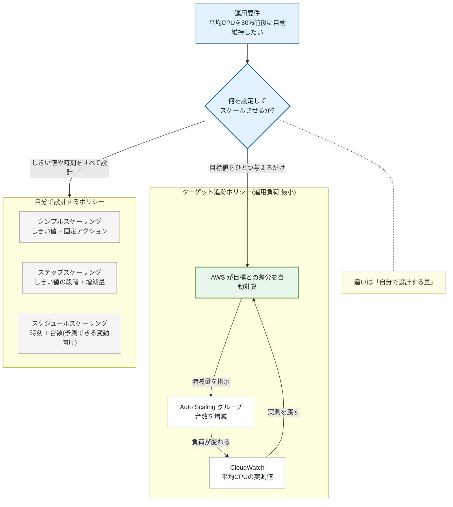
```mermaid
flowchart TB
    GOAL["運用要件<br/>平均CPUを50%前後に自動維持したい"]:::req
    Q{"何を設定して<br/>スケールさせるか?"}:::judge
    NOTE["違いは「自分で設計する量」"]:::note

    GOAL --> Q

    subgraph TT["ターゲット追跡ポリシー(運用負荷 最小)"]
        direction LR
        CALC["AWS が目標との差分を自動計算"]:::best
        ASG["Auto Scaling グループ<br/>台数を増減"]:::svc
        CW["CloudWatch<br/>平均CPUの実測値"]:::svc
        CALC -->|"増減量を指示"| ASG
        ASG -->|"負荷が変わる"| CW
        CW -->|"実測を渡す"| CALC
    end

    subgraph MANUAL["自分で設計するポリシー"]
        SIMPLE["シンプルスケーリング<br/>しきい値 + 固定アクション"]:::alt
        STEP["ステップスケーリング<br/>しきい値の段階 + 増減量"]:::alt
        SCHED["スケジュールスケーリング<br/>時刻 + 台数(予測できる変動向け)"]:::alt
    end

    Q -->|"目標値をひとつ与えるだけ"| CALC
    Q -->|"しきい値や時刻をすべて設計"| MANUAL
    Q -.- NOTE
    classDef req fill:#e3f2fd,stroke:#1565c0,stroke-width:1px,color:#0d2b45
    classDef judge fill:#e3f2fd,stroke:#1565c0,stroke-width:2px,color:#0d2b45
    classDef best fill:#e8f5e9,stroke:#2e7d32,stroke-width:2px,color:#12331a
    classDef alt fill:#f5f5f5,stroke:#9e9e9e,stroke-width:1px,color:#3c3c3c
    classDef svc fill:#ffffff,stroke:#607d8b,stroke-width:1px,color:#22303a
    classDef note fill:#fffde7,stroke:#c0a03c,stroke-width:1px,color:#43380d
```

アプリ表示用の SVG: [`web/diagrams/cmp02.svg`](../../web/diagrams/cmp02.svg)

**解説**: ターゲット追跡(Target Tracking)は「CPU 50% を維持」のように目標値を指定するだけで、必要な増減を AWS が自動計算するため運用が最も簡単です。ステップ/シンプルはしきい値とアクションを自分で細かく設計する必要があり、スケジュールは予測可能な負荷変動(平日9時に増加など)向けです。

**確認事項**: スケジュールスケーリングは「運用負荷が高い」のではなく「用途が違う(予測可能な変動向け)」。図ではグレー群に入れているため、ラベルで用途を明示している。

---

## cmp03 — コンピューティング / level 2

**問題**: ALB(Application Load Balancer)と NLB(Network Load Balancer)の使い分けとして正しい説明はどれか?

**正解**: ALB は L7 でパスベースルーティングが可能、NLB は L4 で超低レイテンシと静的 IP に対応

**他の選択肢**: ALB は L4 で TCP 負荷分散に特化、NLB は L7 で HTTP ヘッダーを解釈できる / どちらも L7 だが、NLB のほうがルーティング機能が豊富 / NLB は HTTP/HTTPS 専用で、ALB は全プロトコル対応

**図解の主メッセージ**: HTTPの中身で振り分けるなら L7 の ALB、TCP/UDP の性能と静的IPが要るなら L4 の NLB。

**採用パターン**: 対比(左右2グループ)+ 分岐。試験では「どちらを選ぶか」を問われるので、層の上下関係より選択の分かれ目を主役にした方が主メッセージに直結する。(候補: 対比(左右2グループ)+ 分岐: 1つの判断から L7 側 / L4 側へ分ける / レイヤー図: OSI の L7 / L4 を上下に積み、各層に該当サービスを置く)

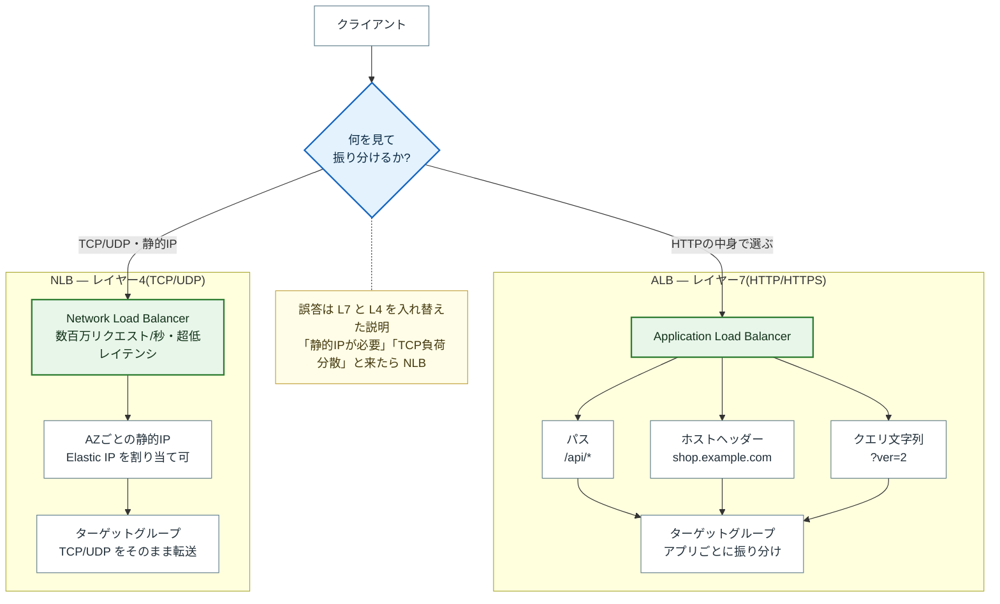
```mermaid
flowchart TB
    CLIENT["クライアント"]:::svc
    Q{"何を見て<br/>振り分けるか?"}:::judge
    NOTE["誤答は L7 と L4 を入れ替えた説明<br/>「静的IPが必要」「TCP負荷分散」と来たら NLB"]:::note

    CLIENT --> Q

    subgraph L7["ALB — レイヤー7(HTTP/HTTPS)"]
        ALB["Application Load Balancer"]:::best
        PATH["パス<br/>/api/*"]:::svc
        HOST["ホストヘッダー<br/>shop.example.com"]:::svc
        QS["クエリ文字列<br/>?ver=2"]:::svc
        TG7["ターゲットグループ<br/>アプリごとに振り分け"]:::svc
        ALB --> PATH --> TG7
        ALB --> HOST --> TG7
        ALB --> QS --> TG7
    end

    subgraph L4["NLB — レイヤー4(TCP/UDP)"]
        NLB["Network Load Balancer<br/>数百万リクエスト/秒・超低レイテンシ"]:::best
        EIP["AZごとの静的IP<br/>Elastic IP を割り当て可"]:::svc
        TG4["ターゲットグループ<br/>TCP/UDP をそのまま転送"]:::svc
        NLB --> EIP --> TG4
    end

    Q -->|"HTTPの中身で選ぶ"| ALB
    Q -->|"TCP/UDP・静的IP"| NLB
    Q -.- NOTE
    classDef req fill:#e3f2fd,stroke:#1565c0,stroke-width:1px,color:#0d2b45
    classDef judge fill:#e3f2fd,stroke:#1565c0,stroke-width:2px,color:#0d2b45
    classDef best fill:#e8f5e9,stroke:#2e7d32,stroke-width:2px,color:#12331a
    classDef alt fill:#f5f5f5,stroke:#9e9e9e,stroke-width:1px,color:#3c3c3c
    classDef svc fill:#ffffff,stroke:#607d8b,stroke-width:1px,color:#22303a
    classDef note fill:#fffde7,stroke:#c0a03c,stroke-width:1px,color:#43380d
```

アプリ表示用の SVG: [`web/diagrams/cmp03.svg`](../../web/diagrams/cmp03.svg)

**解説**: ALB はレイヤー7(HTTP/HTTPS)で動作し、パス・ホストヘッダー・クエリ文字列に基づくルーティングができます。NLB はレイヤー4(TCP/UDP)で動作し、数百万リクエスト/秒・超低レイテンシ・AZ ごとの静的 IP(Elastic IP 割当可)が特徴です。「静的 IP が必要」「TCP 負荷分散」と来たら NLB を選びます。

**確認事項**: この問題は「正しい説明を選ぶ」形式のため、誤答選択肢に対応する構成要素が図中に存在しない。誤答は注釈(L7とL4を逆にした説明)で補っている。 / Gateway Load Balancer / Classic Load Balancer は解説の範囲外のため描いていない。

---

## cmp04 — コンピューティング / level 2

**問題**: 単一 AZ の障害に耐えられるよう、EC2 ベースの Web アプリの可用性を高める構成として最も適切なのはどれか?

**正解**: 複数 AZ にまたがる Auto Scaling グループ + ALB

**他の選択肢**: 同一 AZ 内でインスタンスサイズを大きくする(垂直スケーリング) / 単一 AZ に Auto Scaling グループを構成し最小台数を増やす / 別リージョンに AMI をコピーして手動フェイルオーバーする

**図解の主メッセージ**: AZ 障害で全滅しないのは、複数 AZ に分散して ALB が生存インスタンスにだけ流す構成だけ。

**採用パターン**: 分岐(判断フロー)。対比は2つの構成図を描き分ける必要があり密になる。判断は「AZ をまたいでいるか」の一点なので、分岐1つに還元した方が解読が少ない。(候補: 分岐(判断フロー): 「AZ 障害で処理が残るか」の1問で正解と誤答を振り分け、正解側だけ構成を展開する / 対比(左右2枚): 単一 AZ 構成とマルチ AZ 構成を並べ、同じ AZ 障害を当てて結果を比べる)

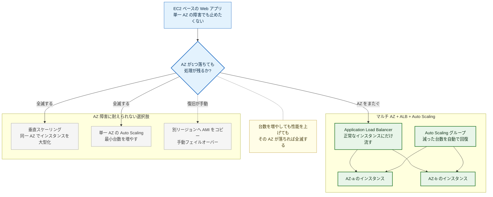
```mermaid
flowchart TD
    REQ["EC2 ベースの Web アプリ<br/>単一 AZ の障害でも止めたくない"]:::req
    Q{"AZ が1つ落ちても<br/>処理が残るか?"}:::judge

    subgraph HA["マルチ AZ + ALB + Auto Scaling"]
        ALB["Application Load Balancer<br/>正常なインスタンスにだけ流す"]:::best
        AZA["AZ-a のインスタンス"]:::best
        AZB["AZ-b のインスタンス"]:::best
        ASG["Auto Scaling グループ<br/>減った台数を自動で回復"]:::best
        ALB --> AZA
        ALB --> AZB
        ASG --> AZA
        ASG --> AZB
    end

    subgraph NG["AZ 障害に耐えられない選択肢"]
        VERT["垂直スケーリング<br/>同一 AZ でインスタンスを大型化"]:::alt
        ONE["単一 AZ の Auto Scaling<br/>最小台数を増やす"]:::alt
        DR["別リージョンへ AMI をコピー<br/>手動フェイルオーバー"]:::alt
    end

    NOTE["台数を増やしても性能を上げても<br/>その AZ が落ちれば全滅する"]:::note

    REQ --> Q
    Q -->|"AZ をまたぐ"| ALB
    Q -->|"全滅する"| VERT
    Q -->|"全滅する"| ONE
    Q -.->|"復旧が手動"| DR
    Q -.- NOTE
    classDef req fill:#e3f2fd,stroke:#1565c0,stroke-width:1px,color:#0d2b45
    classDef judge fill:#e3f2fd,stroke:#1565c0,stroke-width:2px,color:#0d2b45
    classDef best fill:#e8f5e9,stroke:#2e7d32,stroke-width:2px,color:#12331a
    classDef alt fill:#f5f5f5,stroke:#9e9e9e,stroke-width:1px,color:#3c3c3c
    classDef svc fill:#ffffff,stroke:#607d8b,stroke-width:1px,color:#22303a
    classDef note fill:#fffde7,stroke:#c0a03c,stroke-width:1px,color:#43380d
```

アプリ表示用の SVG: [`web/diagrams/cmp04.svg`](../../web/diagrams/cmp04.svg)

**解説**: 高可用性の基本パターンは「マルチ AZ + ELB + Auto Scaling」です。ALB が正常なインスタンスにのみトラフィックを流し、AZ 障害時も他 AZ のインスタンスが処理を継続、Auto Scaling が台数を回復します。垂直スケーリングや単一 AZ 構成は AZ 障害で全滅するため高可用性になりません。

**確認事項**: ALB のヘルスチェック機構そのもの(間隔・閾値)は解説の範囲外のため描いていない。 / 別リージョンへの AMI コピーは「手動フェイルオーバー」という選択肢の記述だけを根拠に非最適としている。RTO の数値は解説にないため図に入れていない。

---

## cmp05 — コンピューティング / level 1

**問題**: コンテナ化されたアプリを、サーバー(EC2 インスタンス)の管理なしで実行したい。どの組み合わせが最適か?

**正解**: ECS + Fargate 起動タイプ

**他の選択肢**: ECS + EC2 起動タイプ / EC2 に Docker を手動インストール / Elastic Beanstalk の EC2 プラットフォーム

**図解の主メッセージ**: サーバー管理をなくしたいなら、ホストを持たない Fargate 起動タイプを選ぶ。

**採用パターン**: 分岐(判断フロー)。この問題は層の理解ではなく起動タイプの二択そのものを問うており、分かれ目を主役にした方が主メッセージに直結する。レイヤー図は cmp13 側で使う。(候補: 分岐(判断フロー): 「ホスト EC2 を自分で持つか」の1問で Fargate 側と EC2 側に分ける / レイヤー図: オーケストレーション層(ECS)と実行基盤層(Fargate / EC2)を上下に積む)

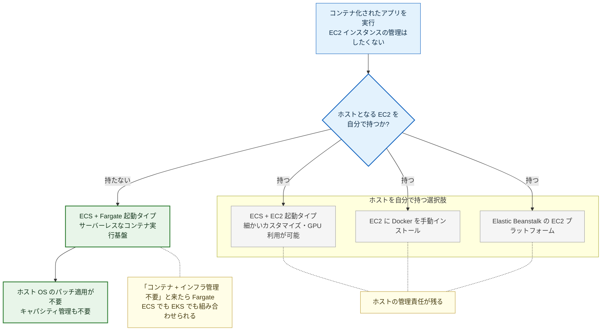
```mermaid
flowchart TD
    REQ["コンテナ化されたアプリを実行<br/>EC2 インスタンスの管理はしたくない"]:::req
    Q{"ホストとなる EC2 を<br/>自分で持つか?"}:::judge
    FARGATE["ECS + Fargate 起動タイプ<br/>サーバーレスなコンテナ実行基盤"]:::best
    FREE["ホスト OS のパッチ適用が不要<br/>キャパシティ管理も不要"]:::best

    subgraph OWN["ホストを自分で持つ選択肢"]
        EC2T["ECS + EC2 起動タイプ<br/>細かいカスタマイズ・GPU 利用が可能"]:::alt
        MANUAL["EC2 に Docker を手動インストール"]:::alt
        EB["Elastic Beanstalk の EC2 プラットフォーム"]:::alt
    end

    HOST["ホストの管理責任が残る"]:::note
    NOTE["「コンテナ + インフラ管理不要」と来たら Fargate<br/>ECS でも EKS でも組み合わせられる"]:::note

    REQ --> Q
    Q -->|"持たない"| FARGATE
    FARGATE --> FREE
    Q -->|"持つ"| EC2T
    Q -->|"持つ"| MANUAL
    Q -->|"持つ"| EB
    EC2T -.- HOST
    MANUAL -.- HOST
    EB -.- HOST
    FARGATE -.- NOTE
    classDef req fill:#e3f2fd,stroke:#1565c0,stroke-width:1px,color:#0d2b45
    classDef judge fill:#e3f2fd,stroke:#1565c0,stroke-width:2px,color:#0d2b45
    classDef best fill:#e8f5e9,stroke:#2e7d32,stroke-width:2px,color:#12331a
    classDef alt fill:#f5f5f5,stroke:#9e9e9e,stroke-width:1px,color:#3c3c3c
    classDef svc fill:#ffffff,stroke:#607d8b,stroke-width:1px,color:#22303a
    classDef note fill:#fffde7,stroke:#c0a03c,stroke-width:1px,color:#43380d
```

アプリ表示用の SVG: [`web/diagrams/cmp05.svg`](../../web/diagrams/cmp05.svg)

**解説**: Fargate はサーバーレスなコンテナ実行基盤で、ホスト OS のパッチ適用・キャパシティ管理が不要です。「コンテナ + インフラ管理不要」というキーワードが出たら Fargate(ECS または EKS と組み合わせ)を選びます。EC2 起動タイプはインスタンスの管理が必要になる代わりに、細かいカスタマイズや GPU 利用が可能です。

**確認事項**: Elastic Beanstalk の EC2 プラットフォームが非最適な理由は解説に明示がないため、「ホストの管理責任が残る」という共通の理由に寄せている。 / cmp13 も Fargate が正解の問題で、判断軸が重なる。cmp05 は ECS の起動タイプ二択、cmp13 は ECS/EKS 共通の実行基盤としての Fargate、と描き分けている。

---

## cmp06 — コンピューティング / level 1

**問題**: HTTP リクエストの URL パス(/api, /images など)に応じて異なるターゲットグループへ振り分けたい。どのロードバランサーを使うべきか?

**正解**: Application Load Balancer

**他の選択肢**: Network Load Balancer / Gateway Load Balancer / Classic Load Balancer

**図解の主メッセージ**: URL の中身を読んで振り分けられるのはレイヤー7の ALB だけ。

**採用パターン**: 分岐(判断フロー)。レイヤー図は4種すべての層を正確に置く必要があり、解説に記述のない GWLB / CLB の層まで断定してしまう。分岐なら解説にある「L7 か否か」だけで判断でき、創作を避けられる。(候補: 分岐(判断フロー): 「URL の中身を読む必要があるか」で ALB と他の ELB に分ける / レイヤー図: OSI の L7 / L4 / L3 を積み、各層に該当する ELB を配置する)

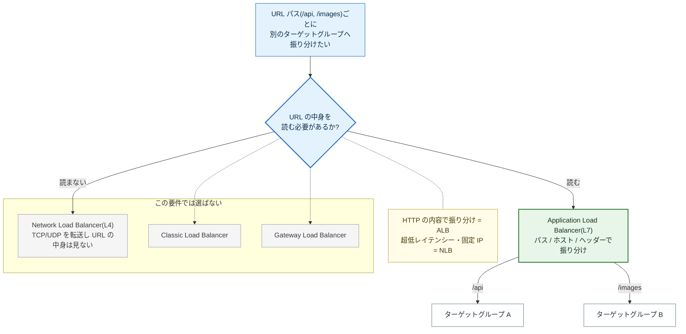
```mermaid
flowchart TD
    REQ["URL パス(/api, /images)ごとに<br/>別のターゲットグループへ振り分けたい"]:::req
    Q{"URL の中身を<br/>読む必要があるか?"}:::judge
    ALB["Application Load Balancer(L7)<br/>パス / ホスト / ヘッダーで振り分け"]:::best
    TG1["ターゲットグループ A"]:::svc
    TG2["ターゲットグループ B"]:::svc

    subgraph OTHERS["この要件では選ばない"]
        NLB["Network Load Balancer(L4)<br/>TCP/UDP を転送し URL の中身は見ない"]:::alt
        CLB["Classic Load Balancer"]:::alt
        GWLB["Gateway Load Balancer"]:::alt
    end

    NOTE["HTTP の内容で振り分け = ALB<br/>超低レイテンシー・固定 IP = NLB"]:::note

    REQ --> Q
    Q -->|"読む"| ALB
    ALB -->|"/api"| TG1
    ALB -->|"/images"| TG2
    Q -->|"読まない"| NLB
    Q -.-> CLB
    Q -.-> GWLB
    Q -.- NOTE
    classDef req fill:#e3f2fd,stroke:#1565c0,stroke-width:1px,color:#0d2b45
    classDef judge fill:#e3f2fd,stroke:#1565c0,stroke-width:2px,color:#0d2b45
    classDef best fill:#e8f5e9,stroke:#2e7d32,stroke-width:2px,color:#12331a
    classDef alt fill:#f5f5f5,stroke:#9e9e9e,stroke-width:1px,color:#3c3c3c
    classDef svc fill:#ffffff,stroke:#607d8b,stroke-width:1px,color:#22303a
    classDef note fill:#fffde7,stroke:#c0a03c,stroke-width:1px,color:#43380d
```

アプリ表示用の SVG: [`web/diagrams/cmp06.svg`](../../web/diagrams/cmp06.svg)

**解説**: ALB はレイヤー 7(HTTP/HTTPS)で動作し、パスベース・ホストベース・ヘッダーベースのルーティングが可能です。NLB はレイヤー 4(TCP/UDP)で動作するため URL の中身を見た振り分けはできません。「HTTP の内容で振り分け = ALB」「超低レイテンシー・固定 IP = NLB」と覚えます。

**確認事項**: Gateway Load Balancer と Classic Load Balancer は解説に説明がないため、名称のみを置きグループの枠で「この要件では選ばない」ことだけを示している。 / cmp03 / cmp07 も ALB と NLB の使い分けを扱う。cmp06 は「L7 側から見る」視点に固定して重複を避けている。

---

## cmp07 — コンピューティング / level 1

**問題**: 毎秒数百万リクエストの TCP トラフィックを超低レイテンシーで処理し、かつ固定 IP アドレスを顧客に案内する必要がある。どのロードバランサーが適切か?

**正解**: Network Load Balancer

**他の選択肢**: Application Load Balancer / Classic Load Balancer / Amazon CloudFront

**図解の主メッセージ**: TCP の超低レイテンシーと固定 IP を同時に満たすのはレイヤー4の NLB だけ。

**採用パターン**: 合流(2要件 → 1解)。マトリクスは CLB / CloudFront の位置を解説にない根拠で決める必要が出る。合流なら「2つの要件が同じ答えを指す」という主メッセージがそのまま線の形になる。(候補: 合流(2要件 → 1解): 2つの要件を1つの判断へ集め、両方を満たす NLB を導く / マトリクス: 「TCP 性能」×「固定 IP」の2軸に4選択肢を配置する)

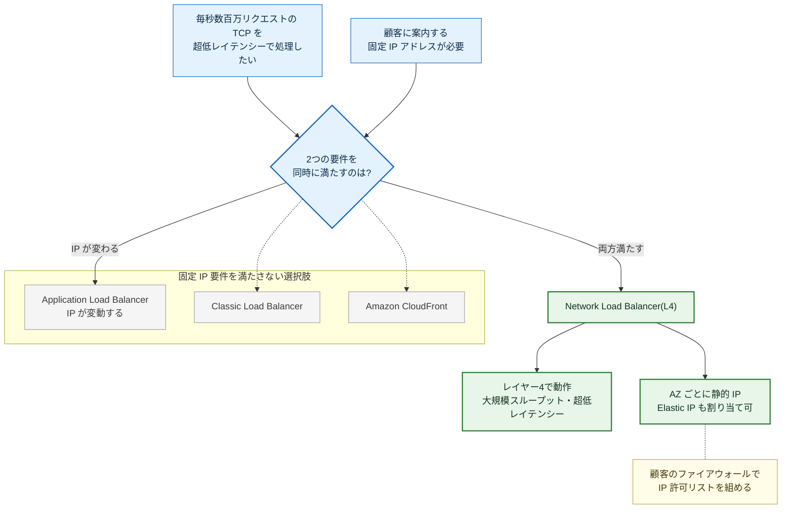
```mermaid
flowchart TD
    R1["毎秒数百万リクエストの TCP を<br/>超低レイテンシーで処理したい"]:::req
    R2["顧客に案内する<br/>固定 IP アドレスが必要"]:::req
    Q{"2つの要件を<br/>同時に満たすのは?"}:::judge
    NLB["Network Load Balancer(L4)"]:::best
    PERF["レイヤー4で動作<br/>大規模スループット・超低レイテンシー"]:::best
    EIP["AZ ごとに静的 IP<br/>Elastic IP も割り当て可"]:::best
    FW["顧客のファイアウォールで<br/>IP 許可リストを組める"]:::note

    subgraph NG["固定 IP 要件を満たさない選択肢"]
        ALB["Application Load Balancer<br/>IP が変動する"]:::alt
        CLB["Classic Load Balancer"]:::alt
        CF["Amazon CloudFront"]:::alt
    end

    R1 --> Q
    R2 --> Q
    Q -->|"両方満たす"| NLB
    NLB --> PERF
    NLB --> EIP
    EIP -.- FW
    Q -->|"IP が変わる"| ALB
    Q -.-> CLB
    Q -.-> CF
    classDef req fill:#e3f2fd,stroke:#1565c0,stroke-width:1px,color:#0d2b45
    classDef judge fill:#e3f2fd,stroke:#1565c0,stroke-width:2px,color:#0d2b45
    classDef best fill:#e8f5e9,stroke:#2e7d32,stroke-width:2px,color:#12331a
    classDef alt fill:#f5f5f5,stroke:#9e9e9e,stroke-width:1px,color:#3c3c3c
    classDef svc fill:#ffffff,stroke:#607d8b,stroke-width:1px,color:#22303a
    classDef note fill:#fffde7,stroke:#c0a03c,stroke-width:1px,color:#43380d
```

アプリ表示用の SVG: [`web/diagrams/cmp07.svg`](../../web/diagrams/cmp07.svg)

**解説**: NLB はレイヤー 4 で動作し、超低レイテンシーかつ大規模スループットに対応します。AZ ごとに静的 IP(または Elastic IP)を割り当てられるため、顧客のファイアウォールで IP 許可リストが必要な場合にも最適です。ALB は IP が変動するため固定 IP 要件には向きません。

**確認事項**: Classic Load Balancer と CloudFront が非最適な理由は解説に記述がないため、グループの枠で示すにとどめている。 / 「毎秒数百万リクエスト」は問題文の数値をそのまま使っており、図側で独自の性能値は足していない。

---

## cmp08 — コンピューティング / level 2

**問題**: HPC(ハイパフォーマンスコンピューティング)ワークロードで、ノード間通信のレイテンシーを最小化したい。どのプレイスメントグループを選ぶべきか?

**正解**: クラスタープレイスメントグループ

**他の選択肢**: スプレッドプレイスメントグループ / パーティションプレイスメントグループ / デフォルト配置(グループなし)

**図解の主メッセージ**: ノード間を速くしたいなら、物理的に近くへ集めるクラスタープレイスメントグループを選ぶ。

**採用パターン**: 分岐(判断フロー)。物理イメージの対比は絵として分かりやすい反面、ラック配置を図示すると解説にない構造まで描くことになる。分岐なら「目的が速さか耐障害性か」という解説どおりの判断軸で済む。(候補: 分岐(判断フロー): 「近づけるか離すか」の1問で3種のプレイスメントグループを振り分ける / 対比(左右2枚): 集約配置と分散配置の物理イメージを並べ、ノード間距離の違いを描く)

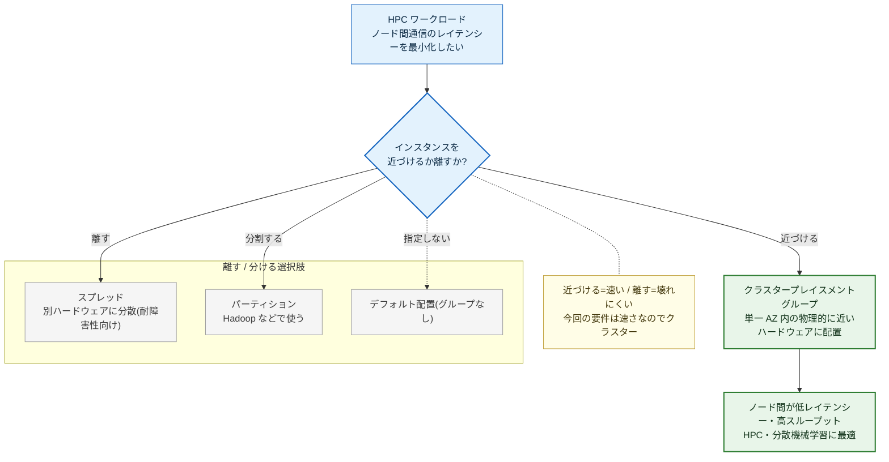
```mermaid
flowchart TD
    REQ["HPC ワークロード<br/>ノード間通信のレイテンシーを最小化したい"]:::req
    Q{"インスタンスを<br/>近づけるか離すか?"}:::judge
    CLUSTER["クラスタープレイスメントグループ<br/>単一 AZ 内の物理的に近いハードウェアに配置"]:::best
    EFFECT["ノード間が低レイテンシー・高スループット<br/>HPC・分散機械学習に最適"]:::best

    subgraph FAR["離す / 分ける選択肢"]
        SPREAD["スプレッド<br/>別ハードウェアに分散(耐障害性向け)"]:::alt
        PART["パーティション<br/>Hadoop などで使う"]:::alt
        DEF["デフォルト配置(グループなし)"]:::alt
    end

    NOTE["近づける=速い / 離す=壊れにくい<br/>今回の要件は速さなのでクラスター"]:::note

    REQ --> Q
    Q -->|"近づける"| CLUSTER
    CLUSTER --> EFFECT
    Q -->|"離す"| SPREAD
    Q -->|"分割する"| PART
    Q -.->|"指定しない"| DEF
    Q -.- NOTE
    classDef req fill:#e3f2fd,stroke:#1565c0,stroke-width:1px,color:#0d2b45
    classDef judge fill:#e3f2fd,stroke:#1565c0,stroke-width:2px,color:#0d2b45
    classDef best fill:#e8f5e9,stroke:#2e7d32,stroke-width:2px,color:#12331a
    classDef alt fill:#f5f5f5,stroke:#9e9e9e,stroke-width:1px,color:#3c3c3c
    classDef svc fill:#ffffff,stroke:#607d8b,stroke-width:1px,color:#22303a
    classDef note fill:#fffde7,stroke:#c0a03c,stroke-width:1px,color:#43380d
```

アプリ表示用の SVG: [`web/diagrams/cmp08.svg`](../../web/diagrams/cmp08.svg)

**解説**: クラスタープレイスメントグループは単一 AZ 内の物理的に近いハードウェアにインスタンスを配置し、ノード間の低レイテンシー・高スループット通信を実現します。HPC や分散機械学習に最適です。逆に耐障害性を高めたい場合はスプレッド(別ハードウェアに分散)、Hadoop などはパーティションを選びます。

**確認事項**: デフォルト配置が非最適な理由は解説に明示がないため、「配置を指定しない」という事実のみを示している。 / パーティションの用途は解説の「Hadoop など」をそのまま使い、それ以上の説明は足していない。

---

## cmp09 — コンピューティング / level 2

**問題**: 7 台の重要なインスタンスを、同一ハードウェア障害で同時に停止しないよう互いに異なる物理ラックへ配置したい。どの構成が適切か?

**正解**: スプレッドプレイスメントグループ

**他の選択肢**: クラスタープレイスメントグループ / 同一 AZ の同一サブネットに配置 / Dedicated Hosts に集約

**図解の主メッセージ**: 同一ハードウェア障害で共倒れさせないなら、各インスタンスを別ラックへ置くスプレッドを選ぶ。

**採用パターン**: 包含(分離の可視化)。この問題の要点は「別ラックに1台ずつ」という配置そのものなので、ラックを枠として描くと主メッセージが図の形と一致する。対比は cmp08 と絵が重複し、同じ絵を2問で使うことになる。(候補: 包含(分離の可視化): スプレッドの配下に独立したラックを並べ、1ラック1台であることを枠で示す / 対比(スプレッド vs クラスター): 同じ7台を集約配置と分散配置で並べて比べる)

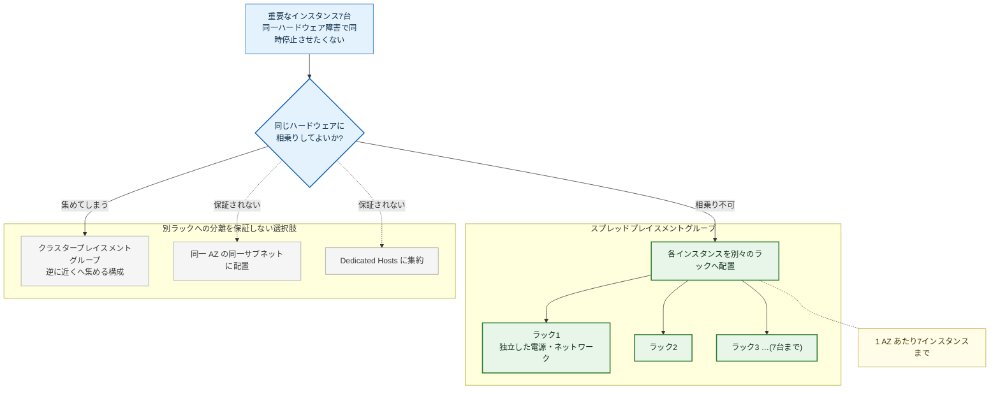
```mermaid
flowchart TD
    REQ["重要なインスタンス7台<br/>同一ハードウェア障害で同時停止させたくない"]:::req
    Q{"同じハードウェアに<br/>相乗りしてよいか?"}:::judge

    subgraph SP["スプレッドプレイスメントグループ"]
        SPREAD["各インスタンスを別々のラックへ配置"]:::best
        RACK1["ラック1<br/>独立した電源・ネットワーク"]:::best
        RACK2["ラック2"]:::best
        RACK3["ラック3 …(7台まで)"]:::best
        SPREAD --> RACK1
        SPREAD --> RACK2
        SPREAD --> RACK3
    end

    subgraph NG["別ラックへの分離を保証しない選択肢"]
        CLUSTER["クラスタープレイスメントグループ<br/>逆に近くへ集める構成"]:::alt
        SUBNET["同一 AZ の同一サブネットに配置"]:::alt
        DH["Dedicated Hosts に集約"]:::alt
    end

    LIMIT["1 AZ あたり7インスタンスまで"]:::note

    REQ --> Q
    Q -->|"相乗り不可"| SPREAD
    SPREAD -.- LIMIT
    Q -->|"集めてしまう"| CLUSTER
    Q -.->|"保証されない"| SUBNET
    Q -.->|"保証されない"| DH
    classDef req fill:#e3f2fd,stroke:#1565c0,stroke-width:1px,color:#0d2b45
    classDef judge fill:#e3f2fd,stroke:#1565c0,stroke-width:2px,color:#0d2b45
    classDef best fill:#e8f5e9,stroke:#2e7d32,stroke-width:2px,color:#12331a
    classDef alt fill:#f5f5f5,stroke:#9e9e9e,stroke-width:1px,color:#3c3c3c
    classDef svc fill:#ffffff,stroke:#607d8b,stroke-width:1px,color:#22303a
    classDef note fill:#fffde7,stroke:#c0a03c,stroke-width:1px,color:#43380d
```

アプリ表示用の SVG: [`web/diagrams/cmp09.svg`](../../web/diagrams/cmp09.svg)

**解説**: スプレッドプレイスメントグループは各インスタンスを別々のラック(独立した電源・ネットワーク)に配置し、ハードウェア障害の同時影響を防ぎます。1 AZ あたり 7 インスタンスまでという制限がある点も頻出です。クラスターは逆に「近くに集める」構成なので障害分離には不向きです。

**確認事項**: 同一サブネット配置と Dedicated Hosts が非最適な理由は解説に明示がない。解説が示す「スプレッドだけが別ラック配置を保証する」という点から、『分離は保証されない』とだけ書いている。 / ラックは図の都合で3つに省略している(実際の要件は7台)。ノード側に「7台まで」と明記して補った。

---

## cmp10 — コンピューティング / level 1

**問題**: Auto Scaling グループの平均 CPU 使用率を常に 50% 前後に保ちたい。最も簡単に実現できるスケーリングポリシーはどれか?

**正解**: ターゲット追跡スケーリング

**他の選択肢**: ステップスケーリング / スケジュールスケーリング / 手動スケーリング

**図解の主メッセージ**: メトリクスを目標値に保ちたいだけなら、目標を宣言するターゲット追跡が最も簡単。

**採用パターン**: 分岐(判断フロー)。制御ループはターゲット追跡の仕組みは説明できるが、他の3ポリシーを同じ図に置けず「なぜこれを選ぶか」に答えられない。設問は選択理由を問うているので分岐を採る。(候補: 分岐(判断フロー): 「増減の計算を誰がやるか」でターゲット追跡と他ポリシーを分ける / 循環(制御ループ): メトリクス測定 → 目標との差 → 台数調整 → 再測定 のフィードバックを描く)

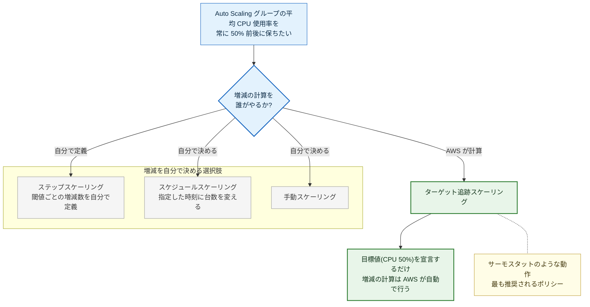
```mermaid
flowchart TD
    REQ["Auto Scaling グループの平均 CPU 使用率を<br/>常に 50% 前後に保ちたい"]:::req
    Q{"増減の計算を<br/>誰がやるか?"}:::judge
    TT["ターゲット追跡スケーリング"]:::best
    DECL["目標値(CPU 50%)を宣言するだけ<br/>増減の計算は AWS が自動で行う"]:::best

    subgraph SELF["増減を自分で決める選択肢"]
        STEP["ステップスケーリング<br/>閾値ごとの増減数を自分で定義"]:::alt
        SCHED["スケジュールスケーリング<br/>指定した時刻に台数を変える"]:::alt
        MANUAL["手動スケーリング"]:::alt
    end

    THERMO["サーモスタットのような動作<br/>最も推奨されるポリシー"]:::note

    REQ --> Q
    Q -->|"AWS が計算"| TT
    TT --> DECL
    TT -.- THERMO
    Q -->|"自分で定義"| STEP
    Q -->|"自分で決める"| SCHED
    Q -->|"自分で決める"| MANUAL
    classDef req fill:#e3f2fd,stroke:#1565c0,stroke-width:1px,color:#0d2b45
    classDef judge fill:#e3f2fd,stroke:#1565c0,stroke-width:2px,color:#0d2b45
    classDef best fill:#e8f5e9,stroke:#2e7d32,stroke-width:2px,color:#12331a
    classDef alt fill:#f5f5f5,stroke:#9e9e9e,stroke-width:1px,color:#3c3c3c
    classDef svc fill:#ffffff,stroke:#607d8b,stroke-width:1px,color:#22303a
    classDef note fill:#fffde7,stroke:#c0a03c,stroke-width:1px,color:#43380d
```

アプリ表示用の SVG: [`web/diagrams/cmp10.svg`](../../web/diagrams/cmp10.svg)

**解説**: ターゲット追跡スケーリングは「メトリクスを目標値(例: CPU 50%)に保つ」と宣言するだけで、増減の計算を AWS が自動で行います。サーモスタットのような動作で、最も推奨されるポリシーです。ステップスケーリングは閾値ごとの増減数を自分で細かく定義する必要があります。

**確認事項**: 手動スケーリングとスケジュールスケーリングが非最適な理由は解説に明示がないため、「台数を自分で決める」という共通点でまとめている。 / スケジュールスケーリングの詳細な使いどころは cmp11 側で扱う。

---

## cmp11 — コンピューティング / level 2

**問題**: 業務アプリは毎週月曜 9 時に必ずアクセスが急増する。スパイクの発生前にキャパシティを確保しておくには、どのスケーリング方式が適切か?

**正解**: スケジュールスケーリング

**他の選択肢**: ターゲット追跡スケーリング / 簡易スケーリング / ヘルスチェックによる置き換え

**図解の主メッセージ**: 急増の時刻が分かっているなら、起こる前に台数を増やすスケジュールスケーリングを選ぶ。

**採用パターン**: 分岐 + 短い時間軸。タイムライン2本は台数の推移カーブを描くことになるが、解説に台数や所要時間の数値はなく創作になる。分岐に 8:45 → 9:00 の2ステップだけ添えれば「スパイク前」という要点が数値を作らずに伝わる。(候補: 分岐 + 短い時間軸: 判断を1問に絞り、正解側だけ 8:45 → 9:00 の順序を描いて『前に増やす』を見せる / タイムライン2本: スケジュールとターゲット追跡の台数推移を同じ時間軸に並べて比較する)

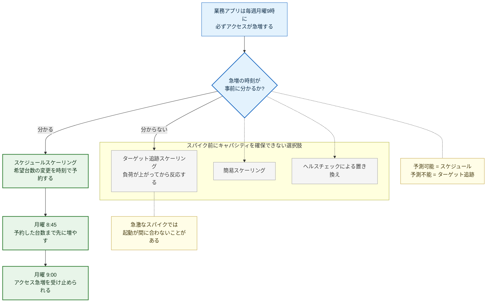
```mermaid
flowchart TD
    REQ["業務アプリは毎週月曜9時に<br/>必ずアクセスが急増する"]:::req
    Q{"急増の時刻が<br/>事前に分かるか?"}:::judge
    SCHED["スケジュールスケーリング<br/>希望台数の変更を時刻で予約する"]:::best
    T845["月曜 8:45<br/>予約した台数まで先に増やす"]:::best
    T900["月曜 9:00<br/>アクセス急増を受け止められる"]:::best

    subgraph NG["スパイク前にキャパシティを確保できない選択肢"]
        TT["ターゲット追跡スケーリング<br/>負荷が上がってから反応する"]:::alt
        SIMPLE["簡易スケーリング"]:::alt
        HC["ヘルスチェックによる置き換え"]:::alt
    end

    LATE["急激なスパイクでは<br/>起動が間に合わないことがある"]:::note
    NOTE["予測可能 = スケジュール<br/>予測不能 = ターゲット追跡"]:::note

    REQ --> Q
    Q -->|"分かる"| SCHED
    SCHED --> T845 --> T900
    Q -->|"分からない"| TT
    TT -.- LATE
    Q -.-> SIMPLE
    Q -.-> HC
    Q -.- NOTE
    classDef req fill:#e3f2fd,stroke:#1565c0,stroke-width:1px,color:#0d2b45
    classDef judge fill:#e3f2fd,stroke:#1565c0,stroke-width:2px,color:#0d2b45
    classDef best fill:#e8f5e9,stroke:#2e7d32,stroke-width:2px,color:#12331a
    classDef alt fill:#f5f5f5,stroke:#9e9e9e,stroke-width:1px,color:#3c3c3c
    classDef svc fill:#ffffff,stroke:#607d8b,stroke-width:1px,color:#22303a
    classDef note fill:#fffde7,stroke:#c0a03c,stroke-width:1px,color:#43380d
```

アプリ表示用の SVG: [`web/diagrams/cmp11.svg`](../../web/diagrams/cmp11.svg)

**解説**: アクセス増加のタイミングが事前に分かっている場合は、スケジュールスケーリングで「月曜 8:45 に希望台数を増やす」ように予約します。ターゲット追跡は負荷が実際に上がってから反応するため、急激なスパイクには起動が間に合わないことがあります。「予測可能 = スケジュール、予測不能 = ターゲット追跡」と整理します。

**確認事項**: 簡易スケーリングとヘルスチェック置き換えが非最適な理由は解説に明示がないため、グループの枠で「事前確保できない」とだけ示している。 / ターゲット追跡が間に合わない度合い(起動時間)は解説に数値がないため図に入れていない。

---

## cmp12 — コンピューティング / level 2

**問題**: 今後 3 年間 EC2 を使い続けるが、インスタンスファミリーやリージョンは柔軟に変更したい。割引を受けつつ柔軟性を最大化する購入オプションはどれか?

**正解**: Compute Savings Plans

**他の選択肢**: スタンダードリザーブドインスタンス / EC2 Instance Savings Plans / スポットインスタンス

**図解の主メッセージ**: ファミリーやリージョンを変えたいなら、適用先を固定しない Compute Savings Plans を選ぶ。

**採用パターン**: 分岐(判断フロー)。マトリクスはリザーブドとスポットの割引率を解説にない根拠で位置づけることになる。分岐なら解説にある「柔軟性か割引率か」という一点だけで判断でき、創作せずに済む。(候補: 分岐(判断フロー): 「適用先を固定してよいか」の1問で Compute と他オプションを分ける / マトリクス: 「柔軟性」×「割引率」の2軸に4オプションを配置する)

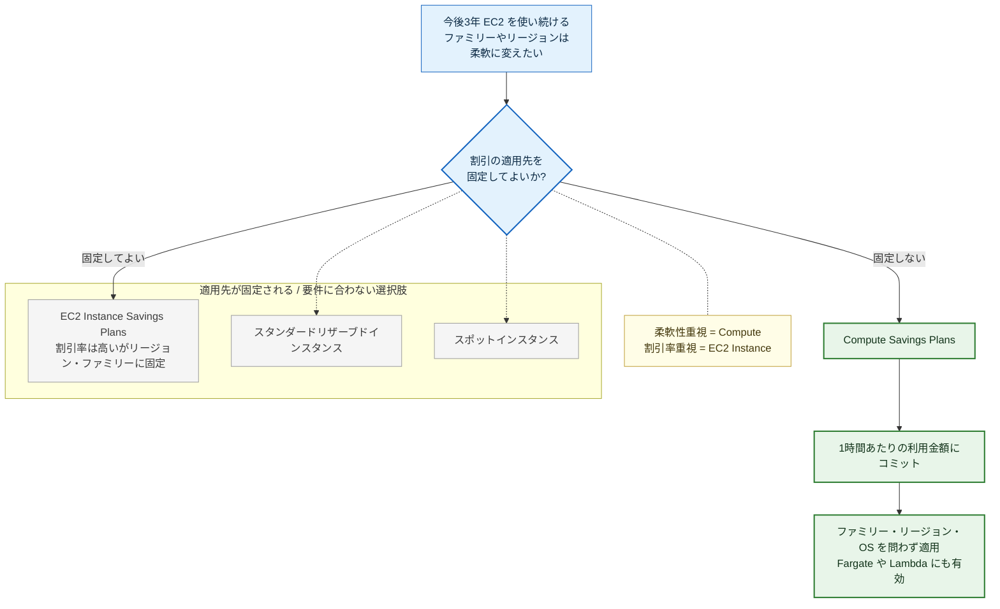
```mermaid
flowchart TD
    REQ["今後3年 EC2 を使い続ける<br/>ファミリーやリージョンは柔軟に変えたい"]:::req
    Q{"割引の適用先を<br/>固定してよいか?"}:::judge
    CSP["Compute Savings Plans"]:::best
    COMMIT["1時間あたりの利用金額にコミット"]:::best
    SCOPE["ファミリー・リージョン・OS を問わず適用<br/>Fargate や Lambda にも有効"]:::best

    subgraph NG["適用先が固定される / 要件に合わない選択肢"]
        EISP["EC2 Instance Savings Plans<br/>割引率は高いがリージョン・ファミリーに固定"]:::alt
        RI["スタンダードリザーブドインスタンス"]:::alt
        SPOT["スポットインスタンス"]:::alt
    end

    NOTE["柔軟性重視 = Compute<br/>割引率重視 = EC2 Instance"]:::note

    REQ --> Q
    Q -->|"固定しない"| CSP
    CSP --> COMMIT --> SCOPE
    Q -->|"固定してよい"| EISP
    Q -.-> RI
    Q -.-> SPOT
    Q -.- NOTE
    classDef req fill:#e3f2fd,stroke:#1565c0,stroke-width:1px,color:#0d2b45
    classDef judge fill:#e3f2fd,stroke:#1565c0,stroke-width:2px,color:#0d2b45
    classDef best fill:#e8f5e9,stroke:#2e7d32,stroke-width:2px,color:#12331a
    classDef alt fill:#f5f5f5,stroke:#9e9e9e,stroke-width:1px,color:#3c3c3c
    classDef svc fill:#ffffff,stroke:#607d8b,stroke-width:1px,color:#22303a
    classDef note fill:#fffde7,stroke:#c0a03c,stroke-width:1px,color:#43380d
```

アプリ表示用の SVG: [`web/diagrams/cmp12.svg`](../../web/diagrams/cmp12.svg)

**解説**: Compute Savings Plans は「1 時間あたりの利用金額」にコミットする方式で、インスタンスファミリー・リージョン・OS を問わず割引が適用され、Fargate や Lambda にも有効です。EC2 Instance Savings Plans は割引率が高い代わりに特定リージョン・ファミリーに固定されます。「柔軟性重視 = Compute、割引率重視 = EC2 Instance」と覚えます。

**確認事項**: スタンダードリザーブドインスタンスとスポットインスタンスが非最適な理由は解説に明示がないため、グループの枠で示すにとどめている。 / cmp01 では『リザーブド / Savings Plans』を1ノードにまとめている。本問で両者を分けたことで粒度が異なるが、いずれも各問の解説の粒度に合わせた結果。

---

## cmp13 — コンピューティング / level 1

**問題**: コンテナを実行したいが、EC2 インスタンスのプロビジョニングやパッチ適用などのサーバー管理を一切行いたくない。どの選択肢が適切か?

**正解**: AWS Fargate

**他の選択肢**: ECS on EC2 / EKS のセルフマネージドノード / EC2 上に Docker を手動インストール

**図解の主メッセージ**: サーバー管理をゼロにしたいなら、ECS でも EKS でもホストを持たない Fargate を選ぶ。

**採用パターン**: レイヤー図 + 分岐。分岐のみだと Fargate が ECS/EKS と並ぶ別サービスに見えてしまい、解説の「ECS・EKS の起動タイプとして選択できる」を伝えられない。オーケストレーション層を1ノード足すだけで誤読を防げる。(候補: レイヤー図 + 分岐: ECS/EKS の下に起動タイプを置き、その選択を1つの判断で決める / 分岐のみ: 4選択肢を「ホストを持つ/持たない」で二分する)

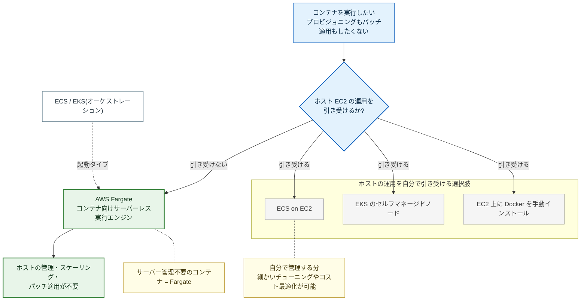
```mermaid
flowchart TD
    REQ["コンテナを実行したい<br/>プロビジョニングもパッチ適用もしたくない"]:::req
    ORCH["ECS / EKS(オーケストレーション)"]:::svc
    Q{"ホスト EC2 の運用を<br/>引き受けるか?"}:::judge
    FARGATE["AWS Fargate<br/>コンテナ向けサーバーレス実行エンジン"]:::best
    FREE["ホストの管理・スケーリング・<br/>パッチ適用が不要"]:::best

    subgraph OWN["ホストの運用を自分で引き受ける選択肢"]
        ECSEC2["ECS on EC2"]:::alt
        EKSSELF["EKS のセルフマネージドノード"]:::alt
        DOCKER["EC2 上に Docker を手動インストール"]:::alt
    end

    TUNE["自分で管理する分<br/>細かいチューニングやコスト最適化が可能"]:::note
    NOTE["サーバー管理不要のコンテナ = Fargate"]:::note

    REQ --> Q
    Q -->|"引き受けない"| FARGATE
    ORCH -.->|"起動タイプ"| FARGATE
    FARGATE --> FREE
    Q -->|"引き受ける"| ECSEC2
    Q -->|"引き受ける"| EKSSELF
    Q -->|"引き受ける"| DOCKER
    ECSEC2 -.- TUNE
    FARGATE -.- NOTE
    classDef req fill:#e3f2fd,stroke:#1565c0,stroke-width:1px,color:#0d2b45
    classDef judge fill:#e3f2fd,stroke:#1565c0,stroke-width:2px,color:#0d2b45
    classDef best fill:#e8f5e9,stroke:#2e7d32,stroke-width:2px,color:#12331a
    classDef alt fill:#f5f5f5,stroke:#9e9e9e,stroke-width:1px,color:#3c3c3c
    classDef svc fill:#ffffff,stroke:#607d8b,stroke-width:1px,color:#22303a
    classDef note fill:#fffde7,stroke:#c0a03c,stroke-width:1px,color:#43380d
```

アプリ表示用の SVG: [`web/diagrams/cmp13.svg`](../../web/diagrams/cmp13.svg)

**解説**: Fargate はコンテナ向けのサーバーレスコンピューティングエンジンで、ECS・EKS の起動タイプとして選択でき、ホストの管理・スケーリング・パッチ適用が不要になります。EC2 起動タイプはホストを自分で管理する分、細かいチューニングやコスト最適化が可能です。「サーバー管理不要のコンテナ = Fargate」が鉄板です。

**確認事項**: EKS + Fargate の組み合わせは解説に「ECS・EKS の起動タイプ」とあることを根拠に、オーケストレーション層を ECS/EKS の1ノードにまとめて表現している。EC2 起動タイプ側への線は交差が増えるため引いていない。 / cmp05 と正解サービスが同じ。cmp05 は ECS の起動タイプ二択、本問は ECS/EKS 共通の実行基盤という視点で描き分けている。

---

## cmp14 — コンピューティング / level 2

**問題**: オンプレミスで Kubernetes を運用してきたチームが、既存のマニフェストやツールをそのまま使いながら AWS へ移行したい。どのサービスが適切か?

**正解**: Amazon EKS

**他の選択肢**: Amazon ECS / AWS Elastic Beanstalk / AWS App Runner

**図解の主メッセージ**: 既存の Kubernetes 資産をそのまま使うことが要件なら、標準 Kubernetes API と完全互換の EKS を選ぶ。

**採用パターン**: 分岐。対比だと ECS / Beanstalk / App Runner それぞれの特徴を解説にない根拠で書き分ける必要が出る。分岐なら解説が示す唯一の判断軸(互換が要るか)がそのまま線の形になる。(候補: 分岐: 「Kubernetes 互換が要るか」の1判断から EKS 側と非 Kubernetes 側へ分ける / 対比(左右2グループ): Kubernetes 互換陣営と AWS 独自陣営を並べて特徴を比べる)

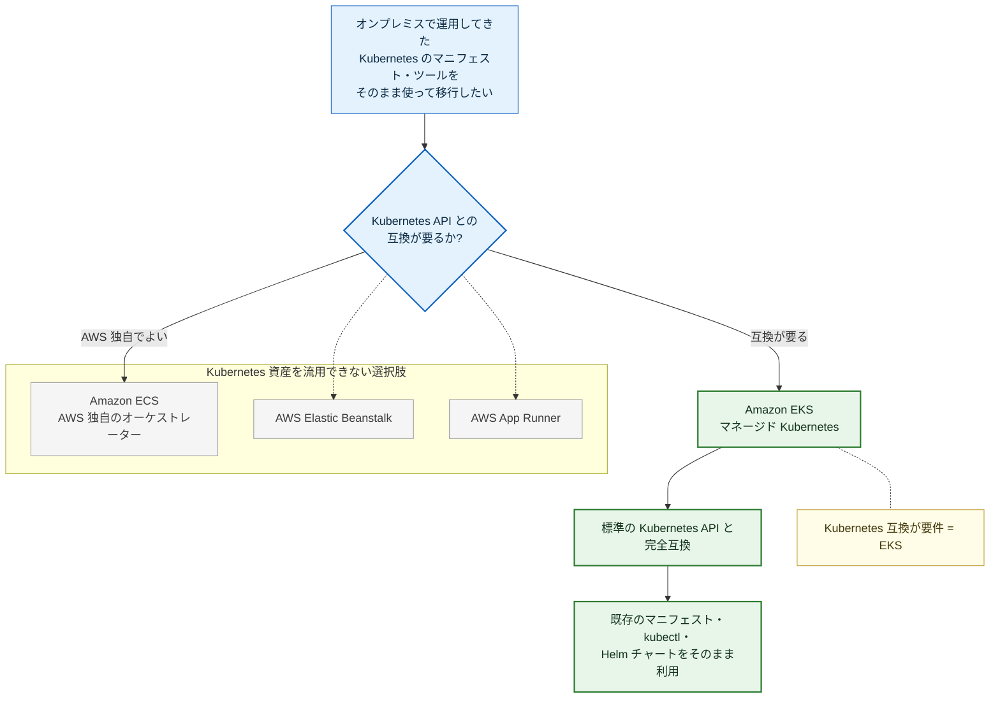
```mermaid
flowchart TD
    REQ["オンプレミスで運用してきた<br/>Kubernetes のマニフェスト・ツールを<br/>そのまま使って移行したい"]:::req
    Q{"Kubernetes API との<br/>互換が要るか?"}:::judge
    EKS["Amazon EKS<br/>マネージド Kubernetes"]:::best
    COMPAT["標準の Kubernetes API と完全互換"]:::best
    ASSETS["既存のマニフェスト・kubectl・<br/>Helm チャートをそのまま利用"]:::best
    NOTE["Kubernetes 互換が要件 = EKS"]:::note

    subgraph NG["Kubernetes 資産を流用できない選択肢"]
        ECS["Amazon ECS<br/>AWS 独自のオーケストレーター"]:::alt
        EB["AWS Elastic Beanstalk"]:::alt
        AR["AWS App Runner"]:::alt
    end

    REQ --> Q
    Q -->|"互換が要る"| EKS
    EKS --> COMPAT --> ASSETS
    Q -->|"AWS 独自でよい"| ECS
    Q -.-> EB
    Q -.-> AR
    EKS -.- NOTE
    classDef req fill:#e3f2fd,stroke:#1565c0,stroke-width:1px,color:#0d2b45
    classDef judge fill:#e3f2fd,stroke:#1565c0,stroke-width:2px,color:#0d2b45
    classDef best fill:#e8f5e9,stroke:#2e7d32,stroke-width:2px,color:#12331a
    classDef alt fill:#f5f5f5,stroke:#9e9e9e,stroke-width:1px,color:#3c3c3c
    classDef svc fill:#ffffff,stroke:#607d8b,stroke-width:1px,color:#22303a
    classDef note fill:#fffde7,stroke:#c0a03c,stroke-width:1px,color:#43380d
```

アプリ表示用の SVG: [`web/diagrams/cmp14.svg`](../../web/diagrams/cmp14.svg)

**解説**: EKS はマネージド Kubernetes サービスで、標準の Kubernetes API と完全互換のため、既存のマニフェスト・kubectl・Helm チャートをそのまま利用できます。ECS は AWS 独自のオーケストレーターなので Kubernetes 資産は流用できません。「Kubernetes 互換が要件 = EKS」で判断します。

**確認事項**: Elastic Beanstalk と App Runner が非最適な理由は解説に記述がないため、個別の理由を書かずグループの枠で位置づけるにとどめている。 / EKS のコントロールプレーン運用やコスト面は解説の範囲外のため描いていない。

---

## cmp15 — コンピューティング / level 1

**問題**: EC2 で一時的なスクラッチデータに対し最高レベルの IOPS が必要だが、インスタンス停止時にデータが消えても構わない。どのストレージが適切か?

**正解**: インスタンスストア

**他の選択肢**: EBS io2 ボリューム / EFS / S3

**図解の主メッセージ**: データが消えてよいという条件があって初めて、ホスト直結 NVMe のインスタンスストアが最高 IOPS の答えになる。

**採用パターン**: 合流(2要件 → 1解)。マトリクスは EFS と S3 の IOPS を解説にない根拠で位置づける必要が出る。合流なら「消えてよい、が効いて初めてインスタンスストアが選べる」という主メッセージがそのまま線の形になる。(候補: 合流(2要件 → 1解): 性能要件と永続性要件を1つの判断へ集め、両方を満たすインスタンスストアを導く / マトリクス: 「IOPS の高さ」×「永続性」の2軸に4つの選択肢を配置する)

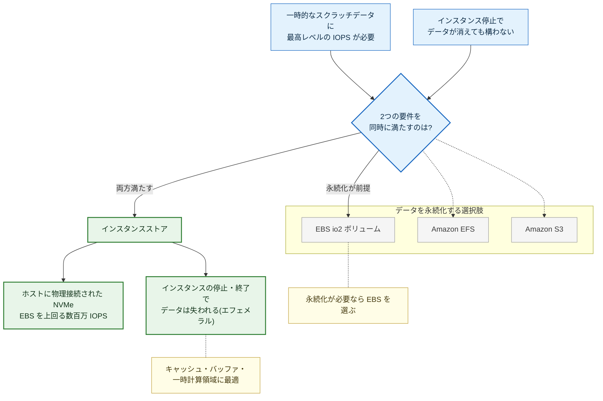
```mermaid
flowchart TD
    R1["一時的なスクラッチデータに<br/>最高レベルの IOPS が必要"]:::req
    R2["インスタンス停止で<br/>データが消えても構わない"]:::req
    Q{"2つの要件を<br/>同時に満たすのは?"}:::judge
    IS["インスタンスストア"]:::best
    NVME["ホストに物理接続された NVMe<br/>EBS を上回る数百万 IOPS"]:::best
    EPH["インスタンスの停止・終了で<br/>データは失われる(エフェメラル)"]:::best
    USE["キャッシュ・バッファ・<br/>一時計算領域に最適"]:::note
    NOTE["永続化が必要なら EBS を選ぶ"]:::note

    subgraph KEEP["データを永続化する選択肢"]
        IO2["EBS io2 ボリューム"]:::alt
        EFS["Amazon EFS"]:::alt
        S3["Amazon S3"]:::alt
    end

    R1 --> Q
    R2 --> Q
    Q -->|"両方満たす"| IS
    IS --> NVME
    IS --> EPH
    EPH -.- USE
    Q -->|"永続化が前提"| IO2
    Q -.-> EFS
    Q -.-> S3
    IO2 -.- NOTE
    classDef req fill:#e3f2fd,stroke:#1565c0,stroke-width:1px,color:#0d2b45
    classDef judge fill:#e3f2fd,stroke:#1565c0,stroke-width:2px,color:#0d2b45
    classDef best fill:#e8f5e9,stroke:#2e7d32,stroke-width:2px,color:#12331a
    classDef alt fill:#f5f5f5,stroke:#9e9e9e,stroke-width:1px,color:#3c3c3c
    classDef svc fill:#ffffff,stroke:#607d8b,stroke-width:1px,color:#22303a
    classDef note fill:#fffde7,stroke:#c0a03c,stroke-width:1px,color:#43380d
```

アプリ表示用の SVG: [`web/diagrams/cmp15.svg`](../../web/diagrams/cmp15.svg)

**解説**: インスタンスストアはホストに物理接続された NVMe ディスクで、EBS を上回る数百万 IOPS を実現できますが、インスタンスの停止・終了でデータが失われるエフェメラル(一時)ストレージです。キャッシュ・バッファ・一時計算領域に最適です。永続化が必要なら EBS を選びます。

**確認事項**: EFS と S3 が非最適な理由は解説に記述がないため、「永続化する選択肢」という枠の位置づけにとどめている。 / インスタンスストアを持つインスタンスファミリーの限定や、再起動(reboot)ではデータが残る点は解説の範囲外のため描いていない。

---

## cmp16 — コンピューティング / level 2

**問題**: EC2 インスタンス内のアプリが自身のインスタンス ID や IAM ロールの一時認証情報を取得する際、SSRF 攻撃への耐性を高めるために使用すべき方式はどれか?

**正解**: IMDSv2(セッショントークン方式)

**他の選択肢**: IMDSv1(リクエスト/レスポンス方式) / 認証情報をユーザーデータに埋め込む / アクセスキーを環境変数にハードコード

**図解の主メッセージ**: 単純な GET だけで読めるか、先にセッショントークンを取る必要があるか — その一手間の差が SSRF 耐性の差になる。

**採用パターン**: 対比 + 分岐。直列だと v2 の手順は分かっても「なぜ v1 では駄目か」が図に現れず、主メッセージ(一手間の差が耐性の差)を伝えられない。手順を左右に並べて初めて差が見える。(候補: 対比(上下2グループ)+ 分岐: v2 と v1 の取得手順を並べ、1つの判断から分ける / 直列: IMDSv2 の PUT → ヘッダー付与 → 取得の3ステップだけをタイムラインで描く)

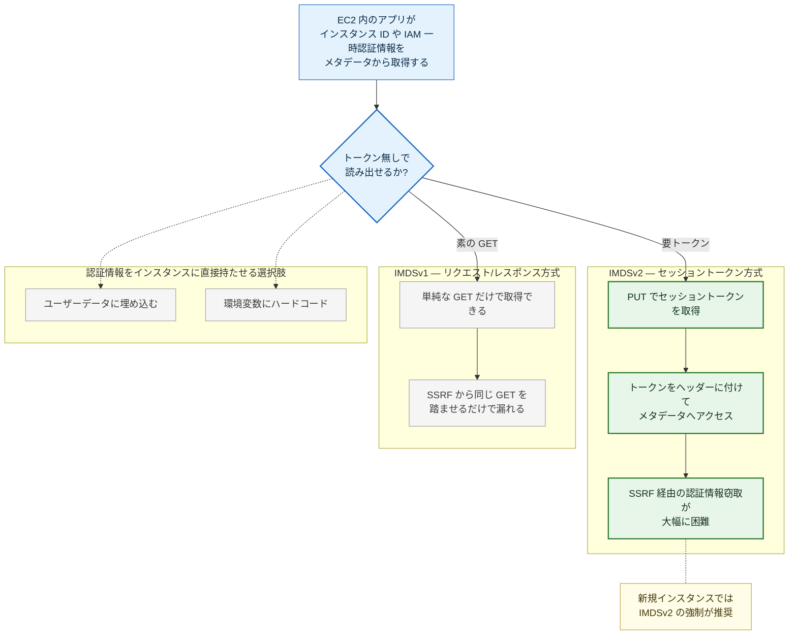
```mermaid
flowchart TD
    REQ["EC2 内のアプリが<br/>インスタンス ID や IAM 一時認証情報を<br/>メタデータから取得する"]:::req
    Q{"トークン無しで<br/>読み出せるか?"}:::judge

    subgraph V2["IMDSv2 — セッショントークン方式"]
        PUT["PUT でセッショントークンを取得"]:::best
        HDR["トークンをヘッダーに付けて<br/>メタデータへアクセス"]:::best
        HARD["SSRF 経由の認証情報窃取が<br/>大幅に困難"]:::best
        PUT --> HDR --> HARD
    end

    subgraph V1["IMDSv1 — リクエスト/レスポンス方式"]
        GET["単純な GET だけで取得できる"]:::alt
        LEAK["SSRF から同じ GET を<br/>踏ませるだけで漏れる"]:::alt
        GET --> LEAK
    end

    subgraph OWN["認証情報をインスタンスに直接持たせる選択肢"]
        UD["ユーザーデータに埋め込む"]:::alt
        ENV["環境変数にハードコード"]:::alt
    end

    NOTE["新規インスタンスでは<br/>IMDSv2 の強制が推奨"]:::note

    REQ --> Q
    Q -->|"要トークン"| PUT
    Q -->|"素の GET"| GET
    Q -.-> UD
    Q -.-> ENV
    HARD -.- NOTE
    classDef req fill:#e3f2fd,stroke:#1565c0,stroke-width:1px,color:#0d2b45
    classDef judge fill:#e3f2fd,stroke:#1565c0,stroke-width:2px,color:#0d2b45
    classDef best fill:#e8f5e9,stroke:#2e7d32,stroke-width:2px,color:#12331a
    classDef alt fill:#f5f5f5,stroke:#9e9e9e,stroke-width:1px,color:#3c3c3c
    classDef svc fill:#ffffff,stroke:#607d8b,stroke-width:1px,color:#22303a
    classDef note fill:#fffde7,stroke:#c0a03c,stroke-width:1px,color:#43380d
```

アプリ表示用の SVG: [`web/diagrams/cmp16.svg`](../../web/diagrams/cmp16.svg)

**解説**: IMDSv2 はまず PUT リクエストでセッショントークンを取得し、それをヘッダーに付けてメタデータへアクセスする方式です。単純な GET だけで取得できる IMDSv1 と異なり、SSRF 経由での認証情報窃取を大幅に困難にします。新規インスタンスでは IMDSv2 の強制が推奨されます。

**確認事項**: ユーザーデータ埋め込みとアクセスキーのハードコードが不適切な理由は解説に記述がないため、選択肢の文面だけを置き、理由は書いていない。 / IMDSv2 のホップ制限(既定 1)は SSRF 耐性に関わるが解説に記述がないため描いていない。

---

## cmp17 — コンピューティング / level 2

**問題**: 起動に 20 分かかる分析アプリを載せた EC2 を夜間停止してコスト削減したいが、翌朝はメモリ上の状態を保ったまま数分で再開したい。どの機能を使うべきか?

**正解**: EC2 Hibernate(休止)

**他の選択肢**: 通常の停止と起動 / AMI を作成して毎朝復元 / リザーブドインスタンスへ変更

**図解の主メッセージ**: メモリ上の状態を翌朝へ持ち越すのは、RAM を EBS へ保存して復元する Hibernate だけ。

**採用パターン**: 対比(2経路)+ 分岐。タイムラインは時刻の目盛りが必要になり要素が増える割に、判断軸(メモリ状態を持ち越すか)が図の中心に来ない。分岐なら1つの問いから2経路へ分かれ、主メッセージがそのまま構造になる。(候補: 対比(2経路)+ 分岐: メモリ状態を持ち越す経路と持ち越さない経路を並べる / タイムライン: 夜(停止)→ 朝(起動)の時間軸に、Hibernate と通常停止の2本を敷く)

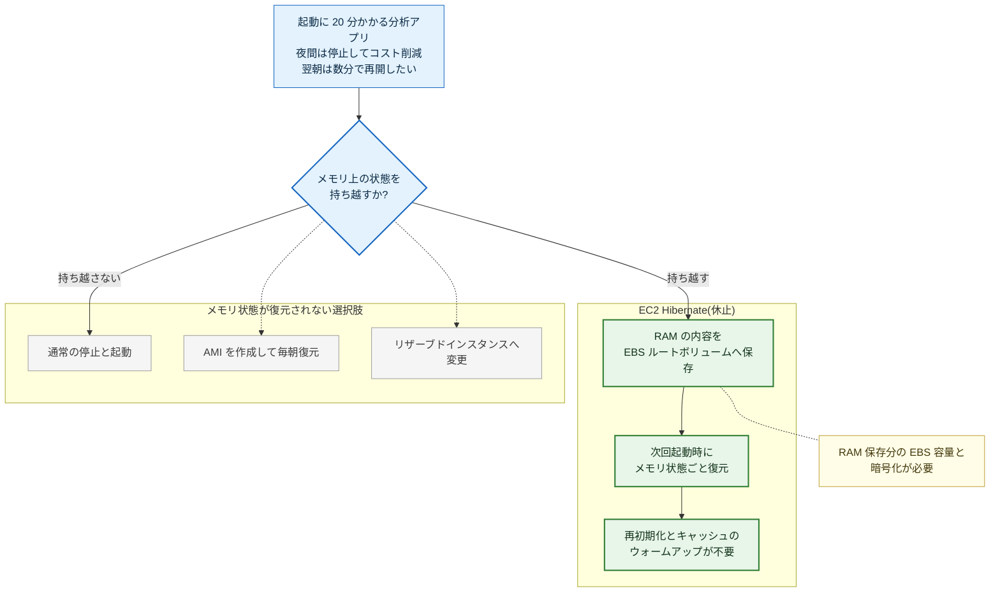
```mermaid
flowchart TD
    REQ["起動に 20 分かかる分析アプリ<br/>夜間は停止してコスト削減<br/>翌朝は数分で再開したい"]:::req
    Q{"メモリ上の状態を<br/>持ち越すか?"}:::judge

    subgraph HIB["EC2 Hibernate(休止)"]
        SAVE["RAM の内容を<br/>EBS ルートボリュームへ保存"]:::best
        RESTORE["次回起動時に<br/>メモリ状態ごと復元"]:::best
        FAST["再初期化とキャッシュの<br/>ウォームアップが不要"]:::best
        SAVE --> RESTORE --> FAST
    end

    subgraph PLAIN["メモリ状態が復元されない選択肢"]
        STOP["通常の停止と起動"]:::alt
        AMI["AMI を作成して毎朝復元"]:::alt
        RI["リザーブドインスタンスへ変更"]:::alt
    end

    COST["RAM 保存分の EBS 容量と<br/>暗号化が必要"]:::note

    REQ --> Q
    Q -->|"持ち越す"| SAVE
    Q -->|"持ち越さない"| STOP
    Q -.-> AMI
    Q -.-> RI
    SAVE -.- COST
    classDef req fill:#e3f2fd,stroke:#1565c0,stroke-width:1px,color:#0d2b45
    classDef judge fill:#e3f2fd,stroke:#1565c0,stroke-width:2px,color:#0d2b45
    classDef best fill:#e8f5e9,stroke:#2e7d32,stroke-width:2px,color:#12331a
    classDef alt fill:#f5f5f5,stroke:#9e9e9e,stroke-width:1px,color:#3c3c3c
    classDef svc fill:#ffffff,stroke:#607d8b,stroke-width:1px,color:#22303a
    classDef note fill:#fffde7,stroke:#c0a03c,stroke-width:1px,color:#43380d
```

アプリ表示用の SVG: [`web/diagrams/cmp17.svg`](../../web/diagrams/cmp17.svg)

**解説**: Hibernate は RAM の内容を EBS ルートボリュームへ保存してから停止し、次回起動時にメモリ状態ごと復元します。アプリの再初期化やキャッシュのウォームアップが不要になるため、起動準備が長いワークロードに有効です。RAM 保存分の EBS 容量と暗号化が必要な点に注意します。

**確認事項**: 通常の停止/起動・AMI 復元・リザーブドインスタンスが要件を満たさない理由は解説に個別記述がないため、Hibernate 側の説明の裏返し(メモリ状態が復元されない)としてグループ名で示すにとどめている。 / Hibernate の対象インスタンスタイプや RAM サイズの上限といった前提条件は解説の範囲外のため描いていない。

---

## cmp18 — コンピューティング / level 1

**問題**: 開発者がコードをアップロードするだけで、EC2・ALB・Auto Scaling などのインフラを自動構築・管理してくれるサービスはどれか?

**正解**: AWS Elastic Beanstalk

**他の選択肢**: AWS CloudFormation / AWS Systems Manager / Amazon Lightsail

**図解の主メッセージ**: 渡すのがコードだけなら PaaS の Elastic Beanstalk、インフラ定義のテンプレートを書くなら CloudFormation。

**採用パターン**: 分岐 + 包含。レイヤー図は Beanstalk の内部構造の説明になり、試験で問われる「CloudFormation との使い分け」が図から消える。分岐にすれば判断軸が主役のまま、自動化の範囲は1ノードで足りる。(候補: 分岐 + 包含: 「渡すもの」の1判断で分け、Beanstalk が面倒を見る範囲を枠で囲う / レイヤー図: 開発者 / PaaS / 実リソース(EC2・ALB・ASG)を上下に積む)

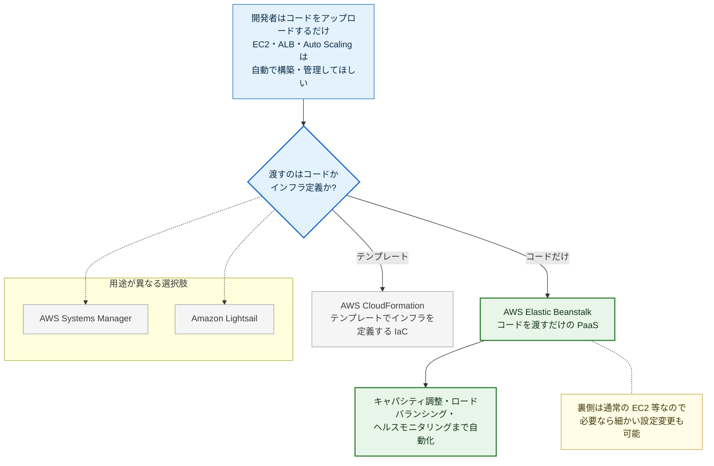
```mermaid
flowchart TD
    REQ["開発者はコードをアップロードするだけ<br/>EC2・ALB・Auto Scaling は<br/>自動で構築・管理してほしい"]:::req
    Q{"渡すのはコードか<br/>インフラ定義か?"}:::judge
    EB["AWS Elastic Beanstalk<br/>コードを渡すだけの PaaS"]:::best
    AUTO["キャパシティ調整・ロードバランシング・<br/>ヘルスモニタリングまで自動化"]:::best
    CFN["AWS CloudFormation<br/>テンプレートでインフラを定義する IaC"]:::alt
    NOTE["裏側は通常の EC2 等なので<br/>必要なら細かい設定変更も可能"]:::note

    subgraph OTHER["用途が異なる選択肢"]
        SSM["AWS Systems Manager"]:::alt
        LS["Amazon Lightsail"]:::alt
    end

    REQ --> Q
    Q -->|"コードだけ"| EB
    EB --> AUTO
    EB -.- NOTE
    Q -->|"テンプレート"| CFN
    Q -.-> SSM
    Q -.-> LS
    classDef req fill:#e3f2fd,stroke:#1565c0,stroke-width:1px,color:#0d2b45
    classDef judge fill:#e3f2fd,stroke:#1565c0,stroke-width:2px,color:#0d2b45
    classDef best fill:#e8f5e9,stroke:#2e7d32,stroke-width:2px,color:#12331a
    classDef alt fill:#f5f5f5,stroke:#9e9e9e,stroke-width:1px,color:#3c3c3c
    classDef svc fill:#ffffff,stroke:#607d8b,stroke-width:1px,color:#22303a
    classDef note fill:#fffde7,stroke:#c0a03c,stroke-width:1px,color:#43380d
```

アプリ表示用の SVG: [`web/diagrams/cmp18.svg`](../../web/diagrams/cmp18.svg)

**解説**: Elastic Beanstalk はコードをデプロイするだけで、キャパシティ調整・ロードバランシング・ヘルスモニタリングまで自動化する PaaS です。裏側のリソースは通常の EC2 等なので、必要なら細かい設定変更も可能です。CloudFormation は「テンプレートでインフラを定義する IaC」であり、コードだけ渡す使い方とは異なります。

**確認事項**: Systems Manager と Lightsail が非最適な理由は解説に記述がないため、個別の理由を書かず「用途が異なる選択肢」の枠に置くにとどめている。 / Beanstalk が構築するリソース名(EC2・ALB・Auto Scaling)は問題文に挙がっているものだけを自動化の対象として記載している。

---

## cmp19 — コンピューティング / level 2

**問題**: 東京リージョンで稼働中の EC2 環境を、災害対策として大阪リージョンでも起動できるようにしたい。カスタム AMI についてまず行うべきことは?

**正解**: AMI を大阪リージョンへコピーする

**他の選択肢**: AMI はグローバルリソースなのでそのまま使える / EBS スナップショットを S3 にエクスポートする / 大阪で新規にインスタンスを手動構築する

**図解の主メッセージ**: AMI はリージョン単位のリソースなので、大阪で使うにはまず AMI のコピーが要る。

**採用パターン**: 包含 + コピー矢印。分岐だけだと「リージョン単位」という言葉を読ませるだけになるが、枠を2つ描けばスコープが図形として伝わり、コピーが枠をまたぐ操作であることも同時に分かる。(候補: 包含(リージョン枠2つ)+ コピー矢印: リソースのスコープを枠そのもので表す / 分岐: 「AMI はグローバルかリージョン単位か」の判断から正解と誤答へ分ける)

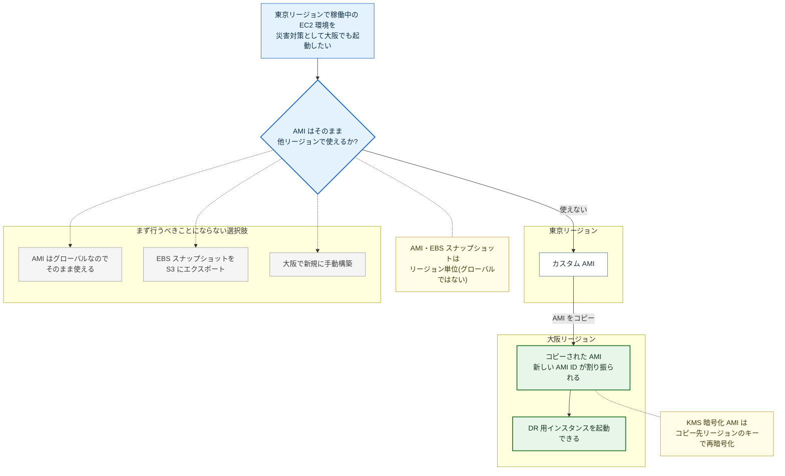
```mermaid
flowchart TD
    REQ["東京リージョンで稼働中の EC2 環境を<br/>災害対策として大阪でも起動したい"]:::req
    Q{"AMI はそのまま<br/>他リージョンで使えるか?"}:::judge
    NOTE["AMI・EBS スナップショットは<br/>リージョン単位(グローバルではない)"]:::note

    subgraph TOKYO["東京リージョン"]
        AMI_T["カスタム AMI"]:::svc
    end

    subgraph OSAKA["大阪リージョン"]
        AMI_O["コピーされた AMI<br/>新しい AMI ID が割り振られる"]:::best
        EC2_O["DR 用インスタンスを起動できる"]:::best
        AMI_O --> EC2_O
    end

    KMS["KMS 暗号化 AMI は<br/>コピー先リージョンのキーで再暗号化"]:::note

    subgraph NG["まず行うべきことにならない選択肢"]
        GLOBAL["AMI はグローバルなので<br/>そのまま使える"]:::alt
        EXP["EBS スナップショットを<br/>S3 にエクスポート"]:::alt
        MANUAL["大阪で新規に手動構築"]:::alt
    end

    REQ --> Q
    Q -->|"使えない"| AMI_T
    AMI_T -->|"AMI をコピー"| AMI_O
    Q -.-> GLOBAL
    Q -.-> EXP
    Q -.-> MANUAL
    AMI_O -.- KMS
    Q -.- NOTE
    classDef req fill:#e3f2fd,stroke:#1565c0,stroke-width:1px,color:#0d2b45
    classDef judge fill:#e3f2fd,stroke:#1565c0,stroke-width:2px,color:#0d2b45
    classDef best fill:#e8f5e9,stroke:#2e7d32,stroke-width:2px,color:#12331a
    classDef alt fill:#f5f5f5,stroke:#9e9e9e,stroke-width:1px,color:#3c3c3c
    classDef svc fill:#ffffff,stroke:#607d8b,stroke-width:1px,color:#22303a
    classDef note fill:#fffde7,stroke:#c0a03c,stroke-width:1px,color:#43380d
```

アプリ表示用の SVG: [`web/diagrams/cmp19.svg`](../../web/diagrams/cmp19.svg)

**解説**: AMI はリージョンローカルなリソースであり、別リージョンで使うには明示的なコピーが必要です。コピー先で新しい AMI ID が割り振られます。KMS 暗号化された AMI をコピーする場合は、コピー先リージョンのキーを指定して再暗号化します。「AMI・EBS スナップショットはリージョン単位」は頻出ポイントです。

**確認事項**: EBS スナップショットの S3 エクスポートと手動構築が非最適な理由は解説に記述がないため、枠の位置づけにとどめている。 / コピー後のインスタンス起動は DR の目的から自明な後続として1ノードだけ置いた。実際の DR 手順(起動テンプレート等)は解説の範囲外のため描いていない。

---

## cmp20 — コンピューティング / level 2

**問題**: Auto Scaling によるスケールイン時、インスタンスが終了する前にログを S3 へ退避する処理を確実に実行したい。どの機能を使うべきか?

**正解**: ライフサイクルフック

**他の選択肢**: 終了保護(Termination Protection) / スケールインクールダウン / CloudWatch アラーム

**図解の主メッセージ**: 終了を Terminating:Wait で待たせて自前の処理を挟めるのはライフサイクルフックだけ。

**採用パターン**: 直列(状態遷移)。対比は他3つの役割を解説にない根拠で書き分ける必要が出るうえ、「どこで処理が走るのか」という肝心の一点が図に現れない。直列なら待ち状態が流れの中の一区間として見える。(候補: 直列(状態遷移): スケールイン → Terminating:Wait → 処理 → continue → 終了 の順に並べる / 対比: 4つの選択肢の役割を並べ、終了前に割り込めるものを1つ選ばせる)

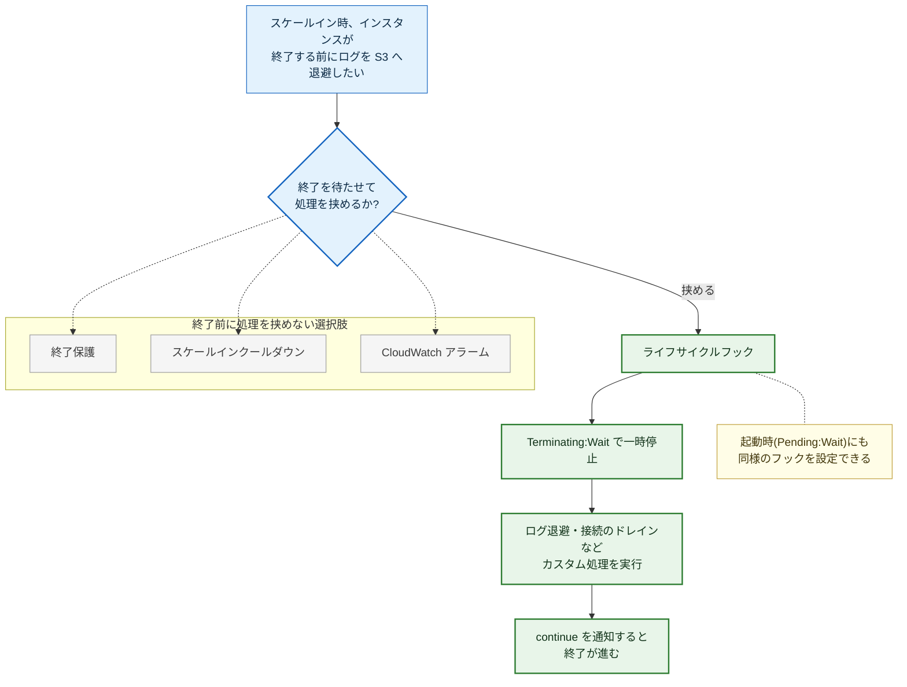
```mermaid
flowchart TD
    REQ["スケールイン時、インスタンスが<br/>終了する前にログを S3 へ退避したい"]:::req
    Q{"終了を待たせて<br/>処理を挟めるか?"}:::judge
    HOOK["ライフサイクルフック"]:::best
    WAIT["Terminating:Wait で一時停止"]:::best
    JOB["ログ退避・接続のドレインなど<br/>カスタム処理を実行"]:::best
    CONT["continue を通知すると<br/>終了が進む"]:::best
    LAUNCH["起動時(Pending:Wait)にも<br/>同様のフックを設定できる"]:::note

    subgraph NG["終了前に処理を挟めない選択肢"]
        PROT["終了保護"]:::alt
        COOL["スケールインクールダウン"]:::alt
        CWA["CloudWatch アラーム"]:::alt
    end

    REQ --> Q
    Q -->|"挟める"| HOOK
    HOOK --> WAIT --> JOB --> CONT
    Q -.-> PROT
    Q -.-> COOL
    Q -.-> CWA
    HOOK -.- LAUNCH
    classDef req fill:#e3f2fd,stroke:#1565c0,stroke-width:1px,color:#0d2b45
    classDef judge fill:#e3f2fd,stroke:#1565c0,stroke-width:2px,color:#0d2b45
    classDef best fill:#e8f5e9,stroke:#2e7d32,stroke-width:2px,color:#12331a
    classDef alt fill:#f5f5f5,stroke:#9e9e9e,stroke-width:1px,color:#3c3c3c
    classDef svc fill:#ffffff,stroke:#607d8b,stroke-width:1px,color:#22303a
    classDef note fill:#fffde7,stroke:#c0a03c,stroke-width:1px,color:#43380d
```

アプリ表示用の SVG: [`web/diagrams/cmp20.svg`](../../web/diagrams/cmp20.svg)

**解説**: ライフサイクルフックを使うと、インスタンスが Terminating:Wait 状態で一時停止し、その間にログ退避や接続のドレインなどのカスタム処理を実行できます。処理完了後に continue を通知すると終了が進みます。起動時(Pending:Wait)にも同様のフックを設定できます。

**確認事項**: 終了保護・クールダウン・CloudWatch アラームが要件を満たさない理由は解説に記述がないため、「終了前に処理を挟めない」という共通点だけで枠にまとめている。 / フックのタイムアウト時間や既定の継続動作(ABANDON / CONTINUE)は解説の範囲外のため描いていない。

---

## cmp21 — コンピューティング / level 2

**問題**: セッション情報をローカルに保持するレガシー Web アプリを ALB 配下で動かしたところ、リクエストごとに別サーバーへ振られてログインが切れる。応急対応として有効な ALB の機能はどれか?

**正解**: スティッキーセッション(セッションアフィニティ)

**他の選択肢**: クロスゾーン負荷分散 / 接続ドレイン / ホストベースルーティング

**図解の主メッセージ**: ローカルにセッションを持つアプリの応急対応は、Cookie で同じターゲットへ固定するスティッキーセッション。

**採用パターン**: 直列(症状 → 応急対応 → 恒久対応)。対比では解説が明示する「応急と恒久は別物」という前提が図から抜ける。直列なら正解が応急対応の位置に置かれ、外部化がその先にあることも同じ1枚で伝わる。(候補: 直列(症状 → 応急対応 → 恒久対応): 時間軸に沿って対応の段階を並べる / 対比: ALB の4機能を並べ、セッション固定に効くものを1つ選ばせる)

```mermaid
flowchart TD
    REQ["セッション情報をローカルに保持する<br/>レガシー Web アプリを ALB 配下で稼働"]:::req
    SYM["リクエストごとに別サーバーへ振られ<br/>ログインが切れる"]:::req
    Q{"同じターゲットへ<br/>固定できるか?"}:::judge
    STICKY["スティッキーセッション<br/>(セッションアフィニティ)"]:::best
    COOKIE["ALB が Cookie で同一クライアントを<br/>同じターゲットへ振り続ける"]:::best
    LIMIT["負荷の偏り・インスタンス障害時の<br/>セッション消失は残る"]:::note
    PERM["ElastiCache や DynamoDB へ<br/>セッションを外部化"]:::svc

    subgraph NG["振り先を固定しない選択肢"]
        XZ["クロスゾーン負荷分散"]:::alt
        DRAIN["接続ドレイン"]:::alt
        HOST["ホストベースルーティング"]:::alt
    end

    REQ --> SYM --> Q
    Q -->|"応急対応"| STICKY
    STICKY --> COOKIE
    COOKIE -.- LIMIT
    LIMIT -.->|"恒久対応"| PERM
    Q -.-> XZ
    Q -.-> DRAIN
    Q -.-> HOST
    classDef req fill:#e3f2fd,stroke:#1565c0,stroke-width:1px,color:#0d2b45
    classDef judge fill:#e3f2fd,stroke:#1565c0,stroke-width:2px,color:#0d2b45
    classDef best fill:#e8f5e9,stroke:#2e7d32,stroke-width:2px,color:#12331a
    classDef alt fill:#f5f5f5,stroke:#9e9e9e,stroke-width:1px,color:#3c3c3c
    classDef svc fill:#ffffff,stroke:#607d8b,stroke-width:1px,color:#22303a
    classDef note fill:#fffde7,stroke:#c0a03c,stroke-width:1px,color:#43380d
```

アプリ表示用の SVG: [`web/diagrams/cmp21.svg`](../../web/diagrams/cmp21.svg)

**解説**: スティッキーセッションを有効にすると、ALB が Cookie を使って同一クライアントを同じターゲットへ振り続けるため、ローカルセッション依存のアプリでも動作します。ただし負荷の偏りやインスタンス障害時のセッション消失は残るため、恒久対応としては ElastiCache や DynamoDB へのセッション外部化が推奨されます。

**確認事項**: クロスゾーン負荷分散・接続ドレイン・ホストベースルーティングが要件を満たさない理由は解説に記述がないため、「振り先を固定しない」という共通点だけで枠にまとめている。 / セッション外部化は正解の選択肢ではないが解説が推奨として挙げているため、緑(正解の構成要素)ではなく白のサービスとして応急対応の先に置いている。

---

## cmp22 — コンピューティング / level 1

**問題**: スケールアウト(水平分散)に対応していないモノリシックなデータベースサーバーの性能が不足してきた。まず取れる対応はどれか?

**正解**: より大きいインスタンスタイプへ変更する(スケールアップ)

**他の選択肢**: インスタンスを複数台に増やす / スポットインスタンスに変更する / AZ を追加する

**図解の主メッセージ**: アプリが分散に対応していないなら台数は増やせない。まずインスタンスタイプを上げる垂直スケーリング。

**採用パターン**: 分岐(前提の確認 → 2経路)。対比だと2つのやり方が対等に見え、「今回は前提を満たさないから垂直しかない」という主メッセージが弱まる。判断を先頭に置けば前提が効いていることが線で分かる。(候補: 分岐(前提の確認 → 2経路): 「水平分散できるか」を先に問い、垂直側と水平側へ分ける / 対比(左右2グループ): 垂直スケーリングと水平スケーリングの特徴を並べて比べる)

```mermaid
flowchart TD
    REQ["スケールアウトに対応していない<br/>モノリシックな DB サーバー<br/>性能が不足してきた"]:::req
    Q{"アプリは水平分散<br/>できるか?"}:::judge
    UP["より大きいインスタンスタイプへ変更<br/>(垂直スケーリング / スケールアップ)"]:::best
    STEP["停止 → タイプ変更 → 起動"]:::best
    PRE["水平スケーリングはアプリが<br/>ステートレスであることが前提"]:::note

    subgraph NG["今回は性能不足を解決しない選択肢"]
        MULTI["インスタンスを複数台に増やす<br/>(水平スケーリング)"]:::alt
        AZ["AZ を追加する"]:::alt
        SPOT["スポットインスタンスに変更"]:::alt
    end

    REQ --> Q
    Q -->|"できない"| UP
    UP --> STEP
    Q -->|"前提が不成立"| MULTI
    Q -.-> AZ
    Q -.-> SPOT
    MULTI -.- PRE
    classDef req fill:#e3f2fd,stroke:#1565c0,stroke-width:1px,color:#0d2b45
    classDef judge fill:#e3f2fd,stroke:#1565c0,stroke-width:2px,color:#0d2b45
    classDef best fill:#e8f5e9,stroke:#2e7d32,stroke-width:2px,color:#12331a
    classDef alt fill:#f5f5f5,stroke:#9e9e9e,stroke-width:1px,color:#3c3c3c
    classDef svc fill:#ffffff,stroke:#607d8b,stroke-width:1px,color:#22303a
    classDef note fill:#fffde7,stroke:#c0a03c,stroke-width:1px,color:#43380d
```

アプリ表示用の SVG: [`web/diagrams/cmp22.svg`](../../web/diagrams/cmp22.svg)

**解説**: 分散処理に対応していないアプリの性能向上は、インスタンスタイプを上位に変更する垂直スケーリング(スケールアップ)が基本です。EC2 は停止→タイプ変更→起動で簡単に変更できます。台数を増やす水平スケーリングはアプリ側がステートレスであることが前提です。

**確認事項**: スポットインスタンスへの変更と AZ 追加が性能不足の解決にならない理由は解説に記述がないため、共通の枠に置くにとどめている。 / 水平スケーリング自体は正当な手段だが、本問はアプリが対応していない前提のため誤答側に置き、その前提を注釈で明示している。

---

## cmp23 — コンピューティング / level 2

**問題**: 稼働中の EC2 群に対し、CloudWatch メトリクスの実績に基づいて「過剰・過小プロビジョニング」を判定し、最適なインスタンスタイプを提案してほしい。どのサービスを使うか?

**正解**: AWS Compute Optimizer

**他の選択肢**: AWS Cost Explorer / AWS Budgets / Amazon Inspector

**図解の主メッセージ**: 利用実績のメトリクスから最適なインスタンスタイプを出すのは Compute Optimizer。コストの可視化とは役割が違う。

**採用パターン**: 直列(入力 → 分析 → 推奨)+ 分岐。対比表は Budgets の役割を解説にない根拠で書く必要が出る。直列にすれば「CloudWatch の実績が入力で、推奨が出力」という Compute Optimizer 固有の働きが主役になり、他サービスは経路の違いとして片付く。(候補: 直列(入力 → 分析 → 推奨)+ 分岐: 実績が推奨に変わる流れを描き、他サービスは別経路にする / テーブル/対比: 4サービスの役割を並べて比較する)

```mermaid
flowchart TD
    REQ["稼働中の EC2 群について<br/>過剰・過小プロビジョニングを判定し<br/>最適なインスタンスタイプを提案してほしい"]:::req
    Q{"利用実績から<br/>サイズを判定するか?"}:::judge
    CW["CloudWatch メトリクス<br/>CPU・メモリなどの利用実績"]:::svc
    CO["AWS Compute Optimizer"]:::best
    ML["機械学習で分析"]:::best
    REC["EC2・Auto Scaling・EBS・Lambda の<br/>最適なサイズを推奨"]:::best
    NOTE["Cost Explorer もライトサイジング推奨を持つが<br/>体系的な性能分析は Compute Optimizer"]:::note

    subgraph NG["役割が異なる選択肢"]
        CE["AWS Cost Explorer<br/>コストの可視化"]:::alt
        BUD["AWS Budgets"]:::alt
        INSP["Amazon Inspector<br/>脆弱性診断"]:::alt
    end

    REQ --> Q
    Q -->|"実績で判定"| CO
    CW --> CO
    CO --> ML --> REC
    Q -.-> CE
    Q -.-> BUD
    Q -.-> INSP
    CE -.- NOTE
    classDef req fill:#e3f2fd,stroke:#1565c0,stroke-width:1px,color:#0d2b45
    classDef judge fill:#e3f2fd,stroke:#1565c0,stroke-width:2px,color:#0d2b45
    classDef best fill:#e8f5e9,stroke:#2e7d32,stroke-width:2px,color:#12331a
    classDef alt fill:#f5f5f5,stroke:#9e9e9e,stroke-width:1px,color:#3c3c3c
    classDef svc fill:#ffffff,stroke:#607d8b,stroke-width:1px,color:#22303a
    classDef note fill:#fffde7,stroke:#c0a03c,stroke-width:1px,color:#43380d
```

アプリ表示用の SVG: [`web/diagrams/cmp23.svg`](../../web/diagrams/cmp23.svg)

**解説**: Compute Optimizer は CPU・メモリなどの利用実績を機械学習で分析し、EC2・Auto Scaling・EBS・Lambda の最適なサイズを推奨します。Cost Explorer もライトサイジング推奨を持ちますが、体系的な性能分析は Compute Optimizer が担当です。Inspector は脆弱性診断でありサイジングとは無関係です。

**確認事項**: Budgets が非最適な理由は解説に記述がないため、名前だけを「役割が異なる選択肢」の枠に置いている。 / Compute Optimizer の推奨対象(EC2・Auto Scaling・EBS・Lambda)は解説の記述をそのまま使い、精度や有効化手順は描いていない。

---

## cmp24 — コンピューティング / level 2

**問題**: Web サービスの Auto Scaling グループで、最低限の安定性を保ちつつコストを最大限削減したい。ベースラインはオンデマンド、変動分は安価に賄う構成はどれか?

**正解**: 混合インスタンスポリシーでオンデマンド + スポットを併用する

**他の選択肢**: 全台スポットインスタンスにする / 全台リザーブドインスタンスにする / Dedicated Hosts で固定する

**図解の主メッセージ**: 安定性とコストを両立させる分かれ目は購入オプションを一律に選ぶかどうかで、ベースをオンデマンド・超過分をスポットに分けられる混合インスタンスポリシーが要件を満たす。

**採用パターン**: 分岐 + 包含。主メッセージは「一律に選ばず需要を2層に分ける」ことそのものなので、ベースと超過分が上下に積まれた形が見えれば解読なしで伝わる。比較表では安定性とコストを解説にない粒度で数値化したくなり、書きすぎのリスクがある。(候補: 分岐 + 包含: 需要を2層に割り、それぞれに当てる購入オプションを枠でまとめる / テーブル/対比: 4つの購入オプションを安定性・コストの2列で比較する)

```mermaid
flowchart TD
    REQ["要件<br/>最低限の安定性は保ちつつ<br/>コストを最大限削減したい"]:::req
    Q{"購入オプションを一律に選ぶか<br/>需要を分けて当てるか?"}:::judge
    NOTE["全台スポットは中断時に<br/>サービス全体が落ちる"]:::note

    REQ --> Q

    subgraph MIX["混合インスタンスポリシー"]
        direction TB
        BASE["ベース台数<br/>オンデマンド(中断されない土台)"]:::best
        SPOT["ベースを超える変動分<br/>スポット比率を指定して安く賄う"]:::best
        TYPES["複数インスタンスタイプへ分散<br/>スポット中断リスクを下げる"]:::best
        BASE -->|"超過分"| SPOT
        SPOT -->|"分散"| TYPES
    end

    subgraph FLAT["一律に揃える選択肢"]
        ALLSPOT["全台スポットインスタンス"]:::alt
        ALLRI["全台リザーブドインスタンス"]:::alt
        DH["Dedicated Hosts で固定"]:::alt
    end

    Q -->|"分けて当てる"| MIX
    Q -.->|"一律に選ぶ"| FLAT
    ALLSPOT -.- NOTE
    classDef req fill:#e3f2fd,stroke:#1565c0,stroke-width:1px,color:#0d2b45
    classDef judge fill:#e3f2fd,stroke:#1565c0,stroke-width:2px,color:#0d2b45
    classDef best fill:#e8f5e9,stroke:#2e7d32,stroke-width:2px,color:#12331a
    classDef alt fill:#f5f5f5,stroke:#9e9e9e,stroke-width:1px,color:#3c3c3c
    classDef svc fill:#ffffff,stroke:#607d8b,stroke-width:1px,color:#22303a
    classDef note fill:#fffde7,stroke:#c0a03c,stroke-width:1px,color:#43380d
```

アプリ表示用の SVG: [`web/diagrams/cmp24.svg`](../../web/diagrams/cmp24.svg)

**解説**: Auto Scaling の混合インスタンスポリシーでは「オンデマンドのベース台数」と「それ以上の部分のスポット比率」を指定でき、複数インスタンスタイプへの分散でスポット中断リスクも下げられます。全台スポットは中断時にサービス全体が落ちるリスクがあり、Web サービスのベースには不適切です。

**確認事項**: 全台リザーブド・Dedicated Hosts が不適切な理由は解説に記述がないため、名前だけを「一律に揃える選択肢」の枠に置いている。 / スポット比率やベース台数の具体値は解説にないため図には書いていない(指定できる、という事実だけを描く)。

---

## cmp25 — コンピューティング / level 2

**問題**: ソケット単位・コア単位でライセンスされた商用ソフトウェア(BYOL)を EC2 で利用したい。物理サーバーを専有し、ソケット/コアの可視性が得られる購入オプションはどれか?

**正解**: Dedicated Hosts

**他の選択肢**: ハードウェア専有インスタンス(Dedicated Instances) / オンデマンドインスタンス / キャパシティ予約

**図解の主メッセージ**: ソケット/コア単位ライセンスの持ち込みでは、専有できるだけでは足りず、ソケット・コア・ホスト ID が可視化される Dedicated Hosts が要る。

**採用パターン**: 二段の判断分岐。誤答の中心は Dedicated Instances で、これは一段目の「専有するか」では落ちず二段目でしか落ちない。段を分けた図はその落ちる位置がそのまま見えるので、比較表より誤読が起きにくい。(候補: 二段の判断分岐: 「専有するか」→「可視性が要るか」の順に絞る / テーブル/対比: 4つの購入オプションを専有・可視性・BYOL 可否の3列で比較する)

```mermaid
flowchart TD
    REQ["要件<br/>ソケット単位・コア単位でライセンスされた<br/>商用ソフトを EC2 に持ち込みたい(BYOL)"]:::req
    Q1{"物理サーバーを<br/>専有するか?"}:::judge
    Q2{"ソケット・コアの<br/>可視性が要るか?"}:::judge
    DH["Dedicated Hosts<br/>物理サーバー全体を専有"]:::best
    VIS["ソケット・コア・ホスト ID が可視<br/>= BYOL のライセンス要件を満たせる"]:::best
    DI["ハードウェア専有インスタンス<br/>専有はできるが<br/>ホストの可視性・制御がない"]:::alt
    NOTE["分かれ目は専有の有無ではなく<br/>ホストの可視性"]:::note

    subgraph SHARED["ハードウェアを専有しない選択肢"]
        OD["オンデマンドインスタンス"]:::alt
        CR["キャパシティ予約"]:::alt
    end

    REQ --> Q1
    Q1 -->|"専有する"| Q2
    Q1 -.->|"専有しない"| SHARED
    Q2 -->|"要る"| DH
    DH --> VIS
    Q2 -.->|"不要"| DI
    Q2 -.- NOTE
    classDef req fill:#e3f2fd,stroke:#1565c0,stroke-width:1px,color:#0d2b45
    classDef judge fill:#e3f2fd,stroke:#1565c0,stroke-width:2px,color:#0d2b45
    classDef best fill:#e8f5e9,stroke:#2e7d32,stroke-width:2px,color:#12331a
    classDef alt fill:#f5f5f5,stroke:#9e9e9e,stroke-width:1px,color:#3c3c3c
    classDef svc fill:#ffffff,stroke:#607d8b,stroke-width:1px,color:#22303a
    classDef note fill:#fffde7,stroke:#c0a03c,stroke-width:1px,color:#43380d
```

アプリ表示用の SVG: [`web/diagrams/cmp25.svg`](../../web/diagrams/cmp25.svg)

**解説**: Dedicated Hosts は物理サーバー全体を専有し、ソケット・コア・ホスト ID が可視化されるため、Windows Server や SQL Server などのソケット/コア単位ライセンスの持ち込み(BYOL)に対応できます。Dedicated Instances はハードウェア専有ですがホストの可視性・制御がなく、ライセンス要件を満たせない場合があります。

**確認事項**: キャパシティ予約が不適切な理由は解説に記述がないため、「専有しない選択肢」の枠に名前だけを置いている。 / 解説は Dedicated Instances について「ライセンス要件を満たせない場合がある」と条件付きで述べているため、図でも断定せず「可視性・制御がない」までにとどめている。

---

## cmp26 — コンピューティング / level 2

**問題**: データレジデンシー(データを自社データセンター内に保持する)要件があるが、AWS と同じ API・ツールでオンプレミス上のインフラを運用したい。どのサービスが適切か?

**正解**: AWS Outposts

**他の選択肢**: AWS Local Zones / AWS Wavelength / AWS Direct Connect

**図解の主メッセージ**: データを自社データセンターから出せない要件では、AWS の設備を自社 DC 内に置ける Outposts だけが AWS と同一の API での運用と両立できる。

**採用パターン**: 分岐。設問が問うのは位置関係そのものではなく「データを外に出さない配置はどれか」という一択の判断なので、判断ノードから設置先ごとに分ける形がいちばん短く読める。レイヤー図は距離の遠近まで描き込むことになり、解説にない情報を足しやすい。(候補: 中心放射/分岐: 「どこに置くか」を中心に、設置先ごとにサービスを枝分かれさせる / レイヤー: 自社 DC / 都市部 / 5G 網 / リージョン を層に積んで位置関係を示す)

```mermaid
flowchart TD
    REQ["要件<br/>データは自社データセンター内に保持したい<br/>かつ AWS と同じ API・ツールで運用したい"]:::req
    Q{"AWS のインフラを<br/>どこに置くか?"}:::judge
    OP["AWS Outposts<br/>AWS のラック/サーバーを自社 DC に設置"]:::best
    SAME["EC2・EBS・RDS などを<br/>AWS と同一の API で運用"]:::best
    DX["AWS Direct Connect<br/>拠点と AWS をつなぐ接続の手段"]:::alt
    NOTE["分かれ目はデータが<br/>施設外に出るかどうか"]:::note

    subgraph OUTSIDE["データが自社 DC の外に出る配置"]
        LZ["AWS Local Zones<br/>設置先は AWS 側の都市部"]:::alt
        WL["AWS Wavelength<br/>設置先は 5G ネットワーク内"]:::alt
    end

    REQ --> Q
    Q -->|"自社 DC 内"| OP
    OP --> SAME
    Q -.->|"AWS 側"| OUTSIDE
    Q -.->|"置かない"| DX
    OP -.- NOTE
    classDef req fill:#e3f2fd,stroke:#1565c0,stroke-width:1px,color:#0d2b45
    classDef judge fill:#e3f2fd,stroke:#1565c0,stroke-width:2px,color:#0d2b45
    classDef best fill:#e8f5e9,stroke:#2e7d32,stroke-width:2px,color:#12331a
    classDef alt fill:#f5f5f5,stroke:#9e9e9e,stroke-width:1px,color:#3c3c3c
    classDef svc fill:#ffffff,stroke:#607d8b,stroke-width:1px,color:#22303a
    classDef note fill:#fffde7,stroke:#c0a03c,stroke-width:1px,color:#43380d
```

アプリ表示用の SVG: [`web/diagrams/cmp26.svg`](../../web/diagrams/cmp26.svg)

**解説**: Outposts は AWS のラック/サーバーを自社データセンターに設置し、EC2・EBS・RDS などを AWS と同一の API で運用できるサービスです。データを施設外に出せない規制要件と AWS の運用モデルを両立できます。Local Zones は AWS 側の設備を都市部に置くもの、Wavelength は 5G ネットワーク内へ置くものです。

**確認事項**: Direct Connect が不適切な理由は解説に記述がないため、「接続の手段であって設備を置くサービスではない」以上のことは書いていない。 / Local Zones / Wavelength のレイテンシー特性は本問の解説の範囲外なので、設置先だけを書いている。

---

## cmp27 — コンピューティング / level 2

**問題**: リージョンから遠い大都市のユーザーに対し、ミリ秒単位の低レイテンシーでゲームサーバーを提供したい。データセンターは自社で持ちたくない。どの選択肢が適切か?

**正解**: AWS Local Zones

**他の選択肢**: AWS Outposts / リージョンを増やして全リージョンに展開 / S3 Transfer Acceleration

**図解の主メッセージ**: ユーザーの近くで EC2 を動かしたいが自社設備は持ちたくない場合、AWS 側が大都市圏に設置する Local Zones が要件を満たす。

**採用パターン**: 分岐(設備の所有者で分ける)。この問題の誤答の中心は Outposts で、レイテンシーの軸では落ちず所有者の軸でだけ落ちる。分岐なら落ちる位置が一目で分かる。マトリクスは残り2選択肢を置く座標を解説にない根拠で決めることになる。(候補: 分岐(設備の所有者で分ける): 近くに置く点は共通としたうえで所有者で Local Zones と Outposts を分ける / マトリクス: 「レイテンシー」×「自社設備の要否」の2軸に4選択肢を配置する)

```mermaid
flowchart TD
    REQ["要件<br/>リージョンから遠い大都市のユーザーに<br/>ミリ秒単位の低レイテンシーで提供したい<br/>データセンターは自社で持ちたくない"]:::req
    Q{"ユーザーの近くに置く設備を<br/>誰が持つか?"}:::judge
    LZ["AWS Local Zones<br/>AWS がリージョン外の大都市圏に設置<br/>自社設備は不要"]:::best
    RES["EC2・EBS をユーザーの近くで実行<br/>1 桁ミリ秒のレイテンシー"]:::best
    OP["AWS Outposts<br/>自社データセンターへの設置が前提"]:::alt
    NOTE["近さを満たしても<br/>自社設備が要る構成は要件外"]:::note

    subgraph OTHER["要件を満たさない他の選択肢"]
        MR["全リージョンに展開"]:::alt
        TA["S3 Transfer Acceleration"]:::alt
    end

    REQ --> Q
    Q -->|"AWS が持つ"| LZ
    LZ --> RES
    Q -.->|"自社が持つ"| OP
    Q -.-> OTHER
    OP -.- NOTE
    classDef req fill:#e3f2fd,stroke:#1565c0,stroke-width:1px,color:#0d2b45
    classDef judge fill:#e3f2fd,stroke:#1565c0,stroke-width:2px,color:#0d2b45
    classDef best fill:#e8f5e9,stroke:#2e7d32,stroke-width:2px,color:#12331a
    classDef alt fill:#f5f5f5,stroke:#9e9e9e,stroke-width:1px,color:#3c3c3c
    classDef svc fill:#ffffff,stroke:#607d8b,stroke-width:1px,color:#22303a
    classDef note fill:#fffde7,stroke:#c0a03c,stroke-width:1px,color:#43380d
```

アプリ表示用の SVG: [`web/diagrams/cmp27.svg`](../../web/diagrams/cmp27.svg)

**解説**: Local Zones は AWS がリージョン外の大都市圏に設置するインフラ拡張で、EC2 や EBS をユーザーの近くで実行し 1 桁ミリ秒のレイテンシーを実現します。自社設備は不要です。Outposts は自社データセンターへの設置が前提であり、要件(設備を持ちたくない)に合いません。

**確認事項**: 全リージョン展開・S3 Transfer Acceleration が不適切な理由は解説に記述がないため、名前だけを「要件を満たさない他の選択肢」の枠に置いている。 / 「1 桁ミリ秒」は解説の表現をそのまま使い、具体的な数値目標は足していない。

---

## cmp28 — コンピューティング / level 1

**問題**: AWS が設計した ARM ベースのプロセッサを搭載し、同等の x86 インスタンスより優れた価格性能比を提供するのはどれか?

**正解**: AWS Graviton 搭載インスタンス

**他の選択肢**: Intel Xeon 搭載インスタンス / GPU 搭載 P 系インスタンス / Mac インスタンス

**図解の主メッセージ**: AWS が自社設計した ARM プロセッサを積み、x86 比で優れた価格性能比を出すのは Graviton 搭載インスタンス。

**採用パターン**: 分岐。解説が根拠として挙げているのは「AWS 自社設計の ARM である」という一点だけなので、判断も一段で足りる。比較表にすると GPU 系や Mac の用途欄を解説にない知識で埋めることになる。(候補: 分岐: 「誰が設計した何のアーキテクチャか」の1問で該当する1つだけを抜き出す / テーブル: 4つのインスタンス群をアーキテクチャ・設計元・用途の3列で比較する)

```mermaid
flowchart TD
    REQ["要件<br/>同等の x86 インスタンスより<br/>優れた価格性能比がほしい"]:::req
    Q{"プロセッサを誰が設計し<br/>どのアーキテクチャか?"}:::judge
    GV["AWS Graviton 搭載インスタンス<br/>AWS が自社設計した ARM プロセッサ"]:::best
    PERF["対応するワークロードなら<br/>x86 比で最大 40% 程度<br/>優れた価格性能比"]:::best
    MARK["見分け方<br/>世代の後ろに g が付く(例 m7g, c7g)"]:::best
    NOTE["ARM 対応のビルドが必要な点だけ注意"]:::note

    subgraph NOTARM["AWS 自社設計の ARM ではない選択肢"]
        X86["Intel Xeon 搭載インスタンス"]:::alt
        GPU["GPU 搭載 P 系インスタンス"]:::alt
        MAC["Mac インスタンス"]:::alt
    end

    REQ --> Q
    Q -->|"AWS 設計 ARM"| GV
    GV --> PERF
    GV --> MARK
    Q -.-> NOTARM
    GV -.- NOTE
    classDef req fill:#e3f2fd,stroke:#1565c0,stroke-width:1px,color:#0d2b45
    classDef judge fill:#e3f2fd,stroke:#1565c0,stroke-width:2px,color:#0d2b45
    classDef best fill:#e8f5e9,stroke:#2e7d32,stroke-width:2px,color:#12331a
    classDef alt fill:#f5f5f5,stroke:#9e9e9e,stroke-width:1px,color:#3c3c3c
    classDef svc fill:#ffffff,stroke:#607d8b,stroke-width:1px,color:#22303a
    classDef note fill:#fffde7,stroke:#c0a03c,stroke-width:1px,color:#43380d
```

アプリ表示用の SVG: [`web/diagrams/cmp28.svg`](../../web/diagrams/cmp28.svg)

**解説**: Graviton は AWS が自社設計した ARM アーキテクチャのプロセッサで、対応するワークロードなら x86 比で最大 40% 程度優れた価格性能比を発揮します。インスタンス名の世代の後に g が付く(例: m7g, c7g)のが目印です。ARM 対応のビルドが必要な点だけ注意します。

**確認事項**: GPU 搭載 P 系・Mac インスタンスの用途は解説に記述がないため、名前だけを枠に置いている。 / 「最大 40% 程度」は解説の表現をそのまま引いており、ワークロード別の内訳は描いていない。

---

## cmp29 — コンピューティング / level 2

**問題**: ALB 配下の Auto Scaling グループで、OS は正常だがアプリケーションプロセスだけが応答しないインスタンスを自動的に入れ替えたい。どの設定が必要か?

**正解**: Auto Scaling のヘルスチェックタイプを ELB に変更する

**他の選択肢**: EC2 ステータスチェックだけを利用する / CloudWatch エージェントをインストールする / 終了保護を有効にする

**図解の主メッセージ**: OS は生きていてアプリだけ落ちた状態を置換につなげたいなら、ヘルスチェックタイプを ELB にして ALB の判定を Auto Scaling に使わせる。

**採用パターン**: 対比 + 直列。要件は「置換まで到達させたい」ことなので、判定から終了・置換までつながる線があるかどうかを2本の経路として並べると、守備範囲の帯を読ませるレイヤー図より結論が早い。(候補: 対比 + 直列: 既定の EC2 ヘルスチェックが取りこぼす経路と、ELB 連携で置換まで届く経路を並べる / レイヤー: ハードウェア / OS / アプリケーションの層を積み、各ヘルスチェックの守備範囲を帯で示す)

```mermaid
flowchart TD
    REQ["要件<br/>OS は正常だがアプリのプロセスだけが<br/>応答しないインスタンスを自動で入れ替えたい"]:::req
    Q{"どの層の異常を<br/>置換の根拠にするか?"}:::judge
    NOTE["アプリ層の死活監視で置き換え<br/>= ELB ヘルスチェック連携"]:::note

    REQ --> Q

    subgraph ELBHC["ヘルスチェックタイプ = ELB"]
        direction TB
        ALB["ALB のヘルスチェック<br/>HTTP 応答を確認"]:::best
        UNH["unhealthy と判定"]:::best
        ASG["Auto Scaling が終了・置換"]:::best
        ALB -->|"応答なし"| UNH
        UNH -->|"置換"| ASG
    end

    subgraph DEF["EC2 ヘルスチェック(既定)"]
        direction TB
        EC2HC["ハードウェア・OS レベルの<br/>障害だけを検知"]:::alt
        MISS["アプリだけ応答しない状態は<br/>検知されない"]:::alt
        EC2HC -->|"取りこぼす"| MISS
    end

    subgraph OTHER["要件を満たさない他の選択肢"]
        CWA["CloudWatch エージェントを導入"]:::alt
        TP["終了保護を有効にする"]:::alt
    end

    Q -->|"アプリ層"| ALB
    Q -.->|"OS 層のみ"| EC2HC
    Q -.-> OTHER
    ASG -.- NOTE
    classDef req fill:#e3f2fd,stroke:#1565c0,stroke-width:1px,color:#0d2b45
    classDef judge fill:#e3f2fd,stroke:#1565c0,stroke-width:2px,color:#0d2b45
    classDef best fill:#e8f5e9,stroke:#2e7d32,stroke-width:2px,color:#12331a
    classDef alt fill:#f5f5f5,stroke:#9e9e9e,stroke-width:1px,color:#3c3c3c
    classDef svc fill:#ffffff,stroke:#607d8b,stroke-width:1px,color:#22303a
    classDef note fill:#fffde7,stroke:#c0a03c,stroke-width:1px,color:#43380d
```

アプリ表示用の SVG: [`web/diagrams/cmp29.svg`](../../web/diagrams/cmp29.svg)

**解説**: デフォルトの EC2 ヘルスチェックはハードウェア・OS レベルの障害しか検知しません。ヘルスチェックタイプを ELB にすると、ALB のヘルスチェック(HTTP 応答の確認)で unhealthy と判定されたインスタンスを Auto Scaling が終了・置換します。「アプリ層の死活監視で置き換え = ELB ヘルスチェック連携」と覚えます。

**確認事項**: CloudWatch エージェント・終了保護が不適切な理由は解説に記述がないため、名前だけを「要件を満たさない他の選択肢」の枠に置いている。 / ALB のヘルスチェック設定値(閾値・間隔)は解説の範囲外なので描いていない。

---

## cmp30 — コンピューティング / level 2

**問題**: DR 用に特定 AZ で必要なときに確実に EC2 を起動できるようキャパシティを確保したいが、1 年・3 年の長期コミットはしたくない。どのオプションが適切か?

**正解**: オンデマンドキャパシティ予約

**他の選択肢**: スタンダードリザーブドインスタンス / スポットフリート / Savings Plans

**図解の主メッセージ**: 目的が割引ではなくキャパシティの確実な確保で、しかも長期コミットを避けたいなら、オンデマンドキャパシティ予約が該当する。

**採用パターン**: 二段の判断分岐。この問題は目的の取り違え(割引と混同する)が主な落とし穴で、それは一段目で片付く。二段目のコミット有無は補助的な条件にすぎないため、両者を対等な軸として扱うマトリクスより順序のある分岐のほうが誤読しにくい。(候補: 二段の判断分岐: 「目的は割引か確保か」→「長期コミットを受け入れるか」で絞る / マトリクス: 「割引の有無」×「コミットの要否」の2軸に4選択肢を配置する)

```mermaid
flowchart TD
    REQ["要件<br/>DR 用に特定 AZ で必要なときに<br/>確実に EC2 を起動できるようにしたい<br/>1年・3年の長期コミットはしたくない"]:::req
    Q1{"目的は割引か<br/>キャパシティの確保か?"}:::judge
    Q2{"長期コミットを<br/>受け入れるか?"}:::judge
    ODCR["オンデマンドキャパシティ予約"]:::best
    HOW["特定 AZ・インスタンスタイプの枠を確保<br/>期間コミットなし・いつでも解約できる"]:::best
    SF["スポットフリート"]:::alt
    COST["確保中は起動していなくても<br/>オンデマンド料金が発生する"]:::note

    subgraph DISC["割引が目的の選択肢(枠の確保が目的ではない)"]
        RI["スタンダードリザーブドインスタンス"]:::alt
        SP["Savings Plans"]:::alt
    end

    REQ --> Q1
    Q1 -->|"確保が目的"| Q2
    Q1 -.->|"割引が目的"| DISC
    Q1 -.-> SF
    Q2 -->|"コミット不要"| ODCR
    ODCR --> HOW
    ODCR -.- COST
    classDef req fill:#e3f2fd,stroke:#1565c0,stroke-width:1px,color:#0d2b45
    classDef judge fill:#e3f2fd,stroke:#1565c0,stroke-width:2px,color:#0d2b45
    classDef best fill:#e8f5e9,stroke:#2e7d32,stroke-width:2px,color:#12331a
    classDef alt fill:#f5f5f5,stroke:#9e9e9e,stroke-width:1px,color:#3c3c3c
    classDef svc fill:#ffffff,stroke:#607d8b,stroke-width:1px,color:#22303a
    classDef note fill:#fffde7,stroke:#c0a03c,stroke-width:1px,color:#43380d
```

アプリ表示用の SVG: [`web/diagrams/cmp30.svg`](../../web/diagrams/cmp30.svg)

**解説**: オンデマンドキャパシティ予約は、特定 AZ・インスタンスタイプのキャパシティを期間コミットなしで確保でき、いつでも解約できます。確保中は起動していなくてもオンデマンド料金が発生します。割引が目的の RI/Savings Plans とは役割が異なり、「キャパシティの確実な確保」が目的の機能です。

**確認事項**: スポットフリートが不適切な理由は本問の解説に記述がないため、名前だけを分岐の外に置き、断定的な説明は付けていない。 / 解説にある「確保中は未起動でも課金される」は選択の根拠ではないが、実運用で誤解しやすいため注釈として残した。

---

## cmp31 — コンピューティング / level 1

**問題**: EC2 インスタンスの初回起動時に、ミドルウェアのインストールや設定スクリプトを自動実行させたい。どの仕組みを使うか?

**正解**: ユーザーデータ

**他の選択肢**: インスタンスメタデータ / AMI の手動カスタマイズのみ / プレイスメントグループ

**図解の主メッセージ**: 初回起動時に root 権限で自動実行されるのはユーザーデータで、ミドルウェア導入や設定の初期化はここに書く。

**採用パターン**: 直列 + 分岐。要件が「初回起動時」という時点を指定しているので、起動という時点を起点に一本の線で描けば、ユーザーデータがその線の上にある唯一の選択肢だと解読なしで分かる。(候補: 直列(起動 → 自動実行 → 初期化完了)+ 分岐: 起動時に何が走るかを時間順に描く / テーブル: 4つの仕組みを「実行タイミング」「用途」の2列で比較する)

```mermaid
flowchart TD
    REQ["要件<br/>EC2 の初回起動時にミドルウェアの導入や<br/>設定スクリプトを自動実行させたい"]:::req
    Q{"初回起動時に自動実行される<br/>仕組みはどれか?"}:::judge
    UD["ユーザーデータ<br/>シェルスクリプト / cloud-init ディレクティブ"]:::best
    RUN["初回起動時に root 権限で自動実行"]:::best
    BOOT["パッケージ導入・設定の初期化<br/>= ブートストラップ"]:::best
    NOTE["定石<br/>頻繁に使う構成はゴールデン AMI に焼き込み<br/>環境差分だけユーザーデータで注入"]:::note

    subgraph OTHER["要件を満たさない他の選択肢"]
        MD["インスタンスメタデータ"]:::alt
        AMI["AMI の手動カスタマイズのみ"]:::alt
        PG["プレイスメントグループ"]:::alt
    end

    REQ --> Q
    Q -->|"起動時に実行"| UD
    UD --> RUN
    RUN --> BOOT
    Q -.-> OTHER
    UD -.- NOTE
    AMI -.- NOTE
    classDef req fill:#e3f2fd,stroke:#1565c0,stroke-width:1px,color:#0d2b45
    classDef judge fill:#e3f2fd,stroke:#1565c0,stroke-width:2px,color:#0d2b45
    classDef best fill:#e8f5e9,stroke:#2e7d32,stroke-width:2px,color:#12331a
    classDef alt fill:#f5f5f5,stroke:#9e9e9e,stroke-width:1px,color:#3c3c3c
    classDef svc fill:#ffffff,stroke:#607d8b,stroke-width:1px,color:#22303a
    classDef note fill:#fffde7,stroke:#c0a03c,stroke-width:1px,color:#43380d
```

アプリ表示用の SVG: [`web/diagrams/cmp31.svg`](../../web/diagrams/cmp31.svg)

**解説**: ユーザーデータに記述したシェルスクリプトや cloud-init ディレクティブは、インスタンスの初回起動時に root 権限で自動実行されます。パッケージ導入や設定の初期化(ブートストラップ)に使われます。頻繁に使う構成は AMI に焼き込み(ゴールデン AMI)、環境差分だけユーザーデータで注入するのが定石です。

**確認事項**: インスタンスメタデータ・プレイスメントグループの本来の役割は解説に記述がないため、名前だけを枠に置いている。 / AMI は「不適切な選択肢」であると同時に解説の定石にも登場するため、注釈側にも線を引いて役割の違いを示している。

---

## cmp32 — コンピューティング / level 2

**問題**: サードパーティー製のファイアウォール/IPS 仮想アプライアンス群へ、全トラフィックを透過的に流して検査させたい。どのロードバランサーを使うべきか?

**正解**: Gateway Load Balancer

**他の選択肢**: Application Load Balancer / Network Load Balancer / Classic Load Balancer

**図解の主メッセージ**: トラフィックを透過的にセキュリティアプライアンス群へ流して検査させたいなら、レイヤー 3 のゲートウェイとして動く Gateway Load Balancer を使う。

**採用パターン**: 直列 + 分岐。解説の要点は「トラフィックがアプライアンス群へ透過的に流れる」ことなので、その流れを1本の線で見せるのが最短。レイヤー図は各ロードバランサーの層を解説にない粒度で説明することになり、主メッセージがぼやける。(候補: 直列(トラフィック → GWLB → アプライアンス群)+ 分岐: 透過的に流れる経路を1本描く / レイヤー: L7 / L4 / L3 の層に4種類のロードバランサーを積んで位置づけを示す)

```mermaid
flowchart TD
    REQ["要件<br/>サードパーティー製のファイアウォール/IPS<br/>仮想アプライアンス群へ全トラフィックを<br/>透過的に流して検査させたい"]:::req
    Q{"何をどの層で<br/>分散するか?"}:::judge
    GWLB["Gateway Load Balancer<br/>レイヤー 3 のゲートウェイとして動作"]:::best
    GEN["GENEVE プロトコルで<br/>トラフィックを透過的に分散"]:::best
    APPL["FW / IPS 仮想アプライアンス群<br/>スケーリングと可用性管理も GWLB が担う"]:::best
    NOTE["検査用アプライアンスの前段 = GWLB<br/>一対一対応で覚えてよい"]:::note

    subgraph OTHER["要件を満たさない他のロードバランサー"]
        ALB["Application Load Balancer"]:::alt
        NLB["Network Load Balancer"]:::alt
        CLB["Classic Load Balancer"]:::alt
    end

    REQ --> Q
    Q -->|"L3 で透過"| GWLB
    GWLB --> GEN
    GEN --> APPL
    Q -.-> OTHER
    GWLB -.- NOTE
    classDef req fill:#e3f2fd,stroke:#1565c0,stroke-width:1px,color:#0d2b45
    classDef judge fill:#e3f2fd,stroke:#1565c0,stroke-width:2px,color:#0d2b45
    classDef best fill:#e8f5e9,stroke:#2e7d32,stroke-width:2px,color:#12331a
    classDef alt fill:#f5f5f5,stroke:#9e9e9e,stroke-width:1px,color:#3c3c3c
    classDef svc fill:#ffffff,stroke:#607d8b,stroke-width:1px,color:#22303a
    classDef note fill:#fffde7,stroke:#c0a03c,stroke-width:1px,color:#43380d
```

アプリ表示用の SVG: [`web/diagrams/cmp32.svg`](../../web/diagrams/cmp32.svg)

**解説**: GWLB はレイヤー 3 のゲートウェイとして動作し、GENEVE プロトコルでトラフィックをセキュリティアプライアンス群へ透過的に分散します。アプライアンスのスケーリングと可用性管理も担います。「検査用アプライアンスの前段 = GWLB」という一対一対応で覚えて問題ありません。

**確認事項**: ALB / NLB / CLB それぞれが不適切な理由は解説に記述がないため、名前だけを「要件を満たさない他のロードバランサー」の枠に置いている。 / 検査後のトラフィックがどこへ戻るかは解説に記述がないため、図でも戻りの経路は描いていない。

---

## cmp33 — コンピューティング / level 2

**問題**: 数十万件のシミュレーションジョブをキューで管理し、依存関係や優先度を考慮しつつ最適なコンピューティングリソースへ自動配置したい。どのサービスが適切か?

**正解**: AWS Batch

**他の選択肢**: AWS Lambda / Amazon EC2 Auto Scaling 単体 / AWS Step Functions 単体

**図解の主メッセージ**: 大量ジョブのキューイングと依存関係・優先度を考えたスケジューリング、リソース確保までフルマネージドで引き受けるのが AWS Batch。

**採用パターン**: 直列 + 分岐。要件が「キューで管理し」「配置したい」と順序のある仕事として書かれているため、その順に並べれば Batch がどこまでを引き受けるかが枠の範囲としてそのまま読める。包含図では順序が消え、依存関係・優先度を考える段が見えにくくなる。(候補: 直列(投入 → キュー/スケジューリング → リソース確保)+ 分岐: Batch が担う範囲を枠で囲う / 階層/包含: Batch を大枠として内側に機能を並べ、他サービスを外側に置く)

```mermaid
flowchart TD
    REQ["要件<br/>数十万件のシミュレーションジョブをキューで管理し<br/>依存関係や優先度を考慮しつつ<br/>最適なコンピューティングリソースへ自動配置したい"]:::req
    Q{"キューイングと<br/>スケジューリングを<br/>マネージドで任せるか?"}:::judge
    LAM["AWS Lambda<br/>15 分の実行時間制限"]:::alt
    NOTE["長時間のシミュレーションは<br/>15 分の制限に収まらない"]:::note

    subgraph BATCH["AWS Batch(フルマネージド)"]
        direction TB
        QUEUE["ジョブのキューイング<br/>依存関係・優先度を考慮したスケジューリング"]:::best
        PROV["コンピューティングリソースを自動プロビジョニング<br/>スポットインスタンス活用でコスト最適化"]:::best
        QUEUE -->|"実行先を確保"| PROV
    end

    subgraph OTHER["要件を満たさない他の選択肢"]
        ASGONLY["EC2 Auto Scaling 単体"]:::alt
        SFNONLY["Step Functions 単体"]:::alt
    end

    REQ --> Q
    Q -->|"任せる"| BATCH
    Q -.->|"時間制限あり"| LAM
    Q -.-> OTHER
    LAM -.- NOTE
    classDef req fill:#e3f2fd,stroke:#1565c0,stroke-width:1px,color:#0d2b45
    classDef judge fill:#e3f2fd,stroke:#1565c0,stroke-width:2px,color:#0d2b45
    classDef best fill:#e8f5e9,stroke:#2e7d32,stroke-width:2px,color:#12331a
    classDef alt fill:#f5f5f5,stroke:#9e9e9e,stroke-width:1px,color:#3c3c3c
    classDef svc fill:#ffffff,stroke:#607d8b,stroke-width:1px,color:#22303a
    classDef note fill:#fffde7,stroke:#c0a03c,stroke-width:1px,color:#43380d
```

アプリ表示用の SVG: [`web/diagrams/cmp33.svg`](../../web/diagrams/cmp33.svg)

**解説**: AWS Batch はバッチジョブのキューイング・スケジューリング・リソースプロビジョニングをフルマネージドで行い、ジョブの依存関係定義やスポットインスタンス活用によるコスト最適化も可能です。Lambda は 15 分の実行時間制限があるため長時間のシミュレーションには不向きです。

**確認事項**: EC2 Auto Scaling 単体・Step Functions 単体が不適切な理由は解説に記述がないため、名前だけを「要件を満たさない他の選択肢」の枠に置いている。 / スポットインスタンス活用は解説にある「可能」という記述にとどめ、削減率などは書いていない。

---

## cmp34 — コンピューティング / level 3

**問題**: ステートレスな Web API を Auto Scaling グループで運用している。平常時 40 台・ピーク時 200 台で、コストを 60% 削減するためスポットを積極活用したいが、単一インスタンスタイプに偏ると中断が集中して SLA 99.9% を割る恐れがある。ベースライン 40 台は中断させたくない。最も適切な構成はどれか?

**正解**: 混在インスタンスポリシーで 4〜6 種類のインスタンスタイプを指定し、オンデマンドベース容量を 40 台、それを超える分をスポット 100%(割当戦略 capacity-optimized)にし、キャパシティリバランスを有効化する

**他の選択肢**: スポット 100% の Auto Scaling グループを 1 種類のインスタンスタイプで構成し、中断時に備えてヘルスチェックの猶予時間を長くする / オンデマンド 200 台のグループを常時起動し、Compute Savings Plans を 3 年全前払いで購入する / スポットフリートを lowest-price 戦略で構成し、ベースライン分はリザーブドインスタンスを購入して同じグループ内で併用する

**図解の主メッセージ**: ベースライン分はオンデマンドで固定し、それを超える分だけを複数タイプに分散したスポットに任せることで、コスト削減と SLA を両立できる。

**採用パターン**: 分岐 + 包含。要件が「ベースラインは中断させたくない / 超過分は安くしたい」と台数の切り分けとして書かれているため、1本の分岐で割ってから、それぞれに何を設定するかを枠で示すのが最も解読が少ない。2軸マトリクスでは「同じ1グループの中で割る」という要点が消える。(候補: 分岐 + 包含: 1つの判断で台数を2つに割り、それぞれの扱いを枠で囲う / マトリクス: 中断耐性 × 割当戦略の2軸に4つの構成を配置)

```mermaid
flowchart TD
    REQ["要件<br/>ステートレスな Web API を平常時 40 台・ピーク時 200 台で運用<br/>コストは 60% 削減したいが SLA 99.9% は割れない<br/>ベースライン 40 台は中断させたくない"]:::req
    Q{"中断させたくない台数と<br/>中断してよい台数を<br/>分けられるか?"}:::judge

    subgraph MIX["混在インスタンスポリシー(1つの Auto Scaling グループ)"]
        direction TB
        BASE["オンデマンドベース容量 40 台<br/>ベースラインは中断させない"]:::best
        SPOT["ベース超過分はスポット 100%<br/>ピーク時の増分を安く賄う"]:::best
        BASE -->|"超過分"| SPOT
    end

    subgraph GUARD["中断を集中させないための設定"]
        direction TB
        TYPES["インスタンスタイプを 4〜6 種類指定<br/>複数タイプ・複数 AZ へ分散"]:::best
        CAPOPT["割当戦略 capacity-optimized<br/>余剰キャパシティの多いプールから起動"]:::best
        REBAL["キャパシティリバランス<br/>中断通知の前に代替を先行起動"]:::best
    end

    ONETYPE["単一タイプでスポット 100%<br/>中断が同時に集中する"]:::alt
    ALLOD["オンデマンド 200 台 + Savings Plans<br/>ピーク前提の台数を常時起動"]:::alt
    LOWEST["スポットフリート lowest-price<br/>価格優先で中断率は下がらない"]:::alt

    REQ --> Q
    Q -->|"分けられる"| MIX
    SPOT --> GUARD
    Q -.->|"分けない"| ONETYPE
    Q -.->|"分けない"| ALLOD
    Q -.->|"分けない"| LOWEST
    classDef req fill:#e3f2fd,stroke:#1565c0,stroke-width:1px,color:#0d2b45
    classDef judge fill:#e3f2fd,stroke:#1565c0,stroke-width:2px,color:#0d2b45
    classDef best fill:#e8f5e9,stroke:#2e7d32,stroke-width:2px,color:#12331a
    classDef alt fill:#f5f5f5,stroke:#9e9e9e,stroke-width:1px,color:#3c3c3c
    classDef svc fill:#ffffff,stroke:#607d8b,stroke-width:1px,color:#22303a
    classDef note fill:#fffde7,stroke:#c0a03c,stroke-width:1px,color:#43380d
```

アプリ表示用の SVG: [`web/diagrams/cmp34.svg`](../../web/diagrams/cmp34.svg)

**解説**: 混在インスタンスポリシーの OnDemandBaseCapacity でベースラインをオンデマンドに固定し、超過分をスポットにするのが定石です。割当戦略は lowest-price ではなく capacity-optimized(または price-capacity-optimized)を選ぶと余剰キャパシティの多いプールから起動するため中断率が下がり、複数タイプ・複数 AZ に分散させることで同時中断のリスクも減ります。キャパシティリバランスは中断通知の前に代替インスタンスを先行起動します。

**確認事項**: price-capacity-optimized は解説で capacity-optimized と並記されているが、図では代表として capacity-optimized のみを書いている。 / オンデマンド 200 台 + Savings Plans が不適切な理由は解説に明示がないため、ピーク前提の台数を常時起動する構成であることだけを書いている。

---

## cmp35 — コンピューティング / level 3

**問題**: 今後 3 年間、月あたり平均 $8,000 相当のコンピュートを使い続ける見込みだが、ワークロードは EC2(複数のインスタンスファミリー)・Fargate・Lambda の間で年内に大きく移り変わる予定である。コミットメントによる割引を得つつ最大の柔軟性を確保したい。最適な購入方法はどれか?

**正解**: Compute Savings Plans を 3 年契約で購入する

**他の選択肢**: EC2 Instance Savings Plans を主要ファミリー向けに 3 年契約で購入する / コンバーティブルリザーブドインスタンスを 3 年契約で購入する / スタンダードリザーブドインスタンスを 1 年契約で毎年買い直す

**図解の主メッセージ**: 実行環境が EC2・Fargate・Lambda をまたいで移り変わるなら、その全体に効く Compute Savings Plans を選ぶ。

**採用パターン**: 包含 + 分岐。「Compute Savings Plans だけが3つの実行環境をまとめて覆える」という一点が主メッセージなので、覆える範囲を枠として描けば比較表を読まなくても差が見える。テーブルは項目が増えるぶん、どこで決まったのかが埋もれる。(候補: 包含 + 分岐: 移り変わる実行環境を1つの枠にまとめ、その枠全体を覆えるかで判断する / テーブル/対比: 4つの購入方法を「適用範囲」「割引率」「交換の手間」で並べて比較する)

```mermaid
flowchart TD
    REQ["要件<br/>3 年間 月 $8,000 相当のコンピュートを使い続ける見込み<br/>ただし年内に EC2・Fargate・Lambda の間で<br/>ワークロードが大きく移り変わる"]:::req
    Q{"割引の適用範囲が<br/>実行環境の乗り換えを<br/>またげるか?"}:::judge
    CSP["Compute Savings Plans(3 年契約)<br/>リージョン・インスタンスファミリー・OS を問わず適用"]:::best

    subgraph TARGET["年内に移り変わる実行環境"]
        direction LR
        EC2["EC2<br/>複数ファミリー"]:::svc
        FG["Fargate"]:::svc
        LAM["Lambda"]:::svc
    end

    EISP["EC2 Instance Savings Plans<br/>特定リージョン内の特定ファミリーに固定"]:::alt
    CRI["コンバーティブル RI<br/>交換操作が必要 / Fargate・Lambda は対象外"]:::alt
    SRI["スタンダード RI を 1 年ごとに買い直し<br/>構成変更に追随できない"]:::alt
    NOTE["割引率の高さと適用範囲の広さは引き換え<br/>ここは柔軟性が最優先"]:::note

    REQ --> Q
    Q -->|"またげる"| CSP
    CSP --> TARGET
    Q -.->|"またげない"| EISP
    Q -.->|"またげない"| CRI
    Q -.->|"またげない"| SRI
    EISP -.- NOTE
    classDef req fill:#e3f2fd,stroke:#1565c0,stroke-width:1px,color:#0d2b45
    classDef judge fill:#e3f2fd,stroke:#1565c0,stroke-width:2px,color:#0d2b45
    classDef best fill:#e8f5e9,stroke:#2e7d32,stroke-width:2px,color:#12331a
    classDef alt fill:#f5f5f5,stroke:#9e9e9e,stroke-width:1px,color:#3c3c3c
    classDef svc fill:#ffffff,stroke:#607d8b,stroke-width:1px,color:#22303a
    classDef note fill:#fffde7,stroke:#c0a03c,stroke-width:1px,color:#43380d
```

アプリ表示用の SVG: [`web/diagrams/cmp35.svg`](../../web/diagrams/cmp35.svg)

**解説**: Compute Savings Plans は EC2・Fargate・Lambda を横断し、リージョン・インスタンスファミリー・OS を問わず適用されるため、構成が変化するワークロードに最適です。EC2 Instance Savings Plans は割引率が高い代わりに特定リージョン内の特定ファミリーに固定され、コンバーティブル RI は交換操作が必要で Fargate/Lambda には適用されません。「柔軟性最優先」なら Compute Savings Plans と覚えます。

**確認事項**: 割引率の大小は解説に「EC2 Instance Savings Plans は割引率が高い」とあるだけで具体値がないため、注釈で関係だけを述べ数値は書いていない。 / 月 $8,000 というコミットメント額は選択の分かれ目ではないため図には出していない(4択すべてが同じ利用量を前提としている)。

---

## cmp36 — コンピューティング / level 3

**問題**: 気象シミュレーションの HPC ジョブを 100 ノードの EC2 で実行する。ノード間は MPI 通信を行い、ノード間レイテンシーとネットワークスループットが実行時間を支配する。一方でハードウェア障害時に全ノードが同時に失われる事態は許容できるとされている。最適な配置と設定はどれか?

**正解**: クラスタープレイスメントグループ内に同一 AZ で起動し、Elastic Fabric Adapter(EFA)を有効にする

**他の選択肢**: パーティションプレイスメントグループを 3 AZ に分散し、拡張ネットワーキング(ENA)を有効にする / スプレッドプレイスメントグループを使い、各インスタンスを異なるハードウェアに分散させる / 複数 AZ の Auto Scaling グループで起動し、プレイスメントグループは使わずインスタンスタイプを最大サイズにする

**図解の主メッセージ**: ノード間レイテンシーが実行時間を支配し、全ノードの同時消失も許容できるなら、単一 AZ に近接配置するクラスタープレイスメントグループを選ぶ。

**採用パターン**: 分岐(2段の判断フロー)。本問は「近接配置が要る」と「単一 AZ に寄せてよい」の2つが揃って初めてクラスターが選べる構造なので、問いを2つ直列に置くと判断順序がそのまま追える。比較表では2つ目の条件(同時消失の許容)が要件由来であることが見えない。(候補: 分岐(2段の判断フロー): 通信が支配するか → 同時消失を許容できるか / テーブル: 3種のプレイスメントグループを「配置」「レイテンシー」「可用性」で比較する)

```mermaid
flowchart TD
    REQ["要件<br/>100 ノードで MPI 通信を行う HPC ジョブ<br/>実行時間を支配するのはノード間レイテンシーとスループット<br/>ハードウェア障害で全ノードを同時に失うことは許容できる"]:::req
    Q1{"実行時間を支配するのは<br/>ノード間の通信か?"}:::judge
    Q2{"全ノードの同時消失を<br/>許容できるか?"}:::judge
    CPG["クラスタープレイスメントグループ<br/>単一 AZ 内の近接した位置に配置し低レイテンシー・高帯域"]:::best
    EFA["Elastic Fabric Adapter(EFA)<br/>OS バイパスで集団通信を高速化"]:::best

    subgraph OTHER["ノード間レイテンシーを最小化しない配置"]
        direction TB
        SPREAD["スプレッドプレイスメントグループ<br/>異なるハードウェアへ分散"]:::alt
        PART["パーティションプレイスメントグループ<br/>分散データストア向け"]:::alt
        NOPG["複数 AZ + プレイスメントグループなし<br/>インスタンスタイプを最大サイズに"]:::alt
    end
    NOTE["スプレッドは可用性重視の配置で<br/>1 AZ あたり最大 7 インスタンス"]:::note

    REQ --> Q1
    Q1 -->|"通信が支配"| Q2
    Q2 -->|"許容できる"| CPG
    CPG --> EFA
    Q1 -.-> OTHER
    Q2 -.->|"許容しない"| SPREAD
    OTHER -.- NOTE
    classDef req fill:#e3f2fd,stroke:#1565c0,stroke-width:1px,color:#0d2b45
    classDef judge fill:#e3f2fd,stroke:#1565c0,stroke-width:2px,color:#0d2b45
    classDef best fill:#e8f5e9,stroke:#2e7d32,stroke-width:2px,color:#12331a
    classDef alt fill:#f5f5f5,stroke:#9e9e9e,stroke-width:1px,color:#3c3c3c
    classDef svc fill:#ffffff,stroke:#607d8b,stroke-width:1px,color:#22303a
    classDef note fill:#fffde7,stroke:#c0a03c,stroke-width:1px,color:#43380d
```

アプリ表示用の SVG: [`web/diagrams/cmp36.svg`](../../web/diagrams/cmp36.svg)

**解説**: クラスタープレイスメントグループは単一 AZ 内の近接した位置にインスタンスを配置し、ノード間の低レイテンシー・高帯域を実現するため MPI ベースの HPC に最適です。さらに EFA を使うと OS バイパスによる高速な集団通信が可能になります。スプレッドは可用性重視(最大 7 インスタンス/AZ)、パーティションは分散データストア向けで、いずれもノード間レイテンシーは最小化されません。

**確認事項**: 選択肢2の ENA(拡張ネットワーキング)は、パーティション+3 AZ という配置側が要件に合わないことが本質のため、図では配置の違いだけを描き ENA そのものには触れていない。

---

## cmp37 — コンピューティング / level 3

**問題**: Auto Scaling グループで動く Java アプリは、起動から JVM ウォームアップ・キャッシュ事前読み込みが完了するまで約 8 分かかる。トラフィックは予測不能に数分でスパイクし、その間レイテンシーが悪化して機会損失が出ている。予測スケーリングは効かず、常時多めに起動するとコストが合わない。最適な対策はどれか?

**正解**: Auto Scaling グループにウォームプールを構成し、初期化済みインスタンスを停止状態(Stopped)でプールしておく

**他の選択肢**: ヘルスチェックの猶予期間を 10 分に延ばし、ターゲット追跡のしきい値を下げる / スケジュールされたスケーリングで日中は最小台数を高く設定する / 起動テンプレートのユーザーデータを最適化して初期化時間を短縮し、簡易スケーリングポリシーに切り替える

**図解の主メッセージ**: 初期化に 8 分かかるなら、その 8 分をスパイクの前に済ませて待機させておく(ウォームプール)。

**採用パターン**: 対比 + タイムライン。効くかどうかの差は「初期化の 8 分がスパイクの後ろにあるか前にあるか」という時間軸上の位置だけなので、2本の時系列を並べれば説明なしで差が見える。分岐図だと選択肢は整理できるが、なぜ効くのかが伝わらない。(候補: 対比 + タイムライン: 現状の時系列とウォームプールの時系列を並べ、初期化の位置がどこへ動くかを見せる / 分岐: 「初期化を短縮するか / 前倒しするか」で選択肢を振り分ける)

```mermaid
flowchart TD
    REQ["要件<br/>起動から JVM ウォームアップとキャッシュ事前読み込みまで約 8 分<br/>トラフィックは数分で予測不能にスパイクする<br/>常時多めに起動するとコストが合わない"]:::req

    subgraph NOW["現状: スケールアウトのたびに初期化する"]
        direction LR
        N_SPIKE["スパイク発生"]:::alt
        N_BOOT["インスタンス起動"]:::alt
        N_INIT["初期化 約 8 分<br/>この間レイテンシーが悪化"]:::alt
        N_SERVE["ようやくサービス投入"]:::alt
        N_SPIKE --> N_BOOT --> N_INIT --> N_SERVE
    end

    Q{"初期化の 8 分を<br/>スパイクより前に<br/>済ませられるか?"}:::judge

    subgraph WARM["ウォームプール: 初期化を先に済ませて待機させる"]
        direction LR
        W_INIT["平常時に初期化まで実施"]:::best
        W_POOL["Stopped で待機<br/>EBS 料金のみ"]:::best
        W_SPIKE["スパイク発生"]:::best
        W_SERVE["起動するだけで即サービス投入"]:::best
        W_INIT --> W_POOL --> W_SPIKE --> W_SERVE
    end

    OTHER["猶予期間の延長 / しきい値の引き下げ<br/>スケジュールで最小台数を高く<br/>ユーザーデータの最適化"]:::alt
    NOTE["いずれも初期化そのものを<br/>スパイクより前へ動かせない"]:::note

    REQ --> NOW
    NOW --> Q
    Q -->|"前倒しする"| WARM
    Q -.->|"できない"| OTHER
    OTHER -.- NOTE
    classDef req fill:#e3f2fd,stroke:#1565c0,stroke-width:1px,color:#0d2b45
    classDef judge fill:#e3f2fd,stroke:#1565c0,stroke-width:2px,color:#0d2b45
    classDef best fill:#e8f5e9,stroke:#2e7d32,stroke-width:2px,color:#12331a
    classDef alt fill:#f5f5f5,stroke:#9e9e9e,stroke-width:1px,color:#3c3c3c
    classDef svc fill:#ffffff,stroke:#607d8b,stroke-width:1px,color:#22303a
    classDef note fill:#fffde7,stroke:#c0a03c,stroke-width:1px,color:#43380d
```

アプリ表示用の SVG: [`web/diagrams/cmp37.svg`](../../web/diagrams/cmp37.svg)

**解説**: ウォームプールは初期化済みのインスタンスを Stopped(または Hibernated / Running)で待機させ、スケールアウト時に起動するだけで即座にサービス投入できるため、初期化に時間がかかるアプリのスパイク対応に有効です。Stopped 状態なら EBS 料金のみでインスタンス料金はかからずコスト効率も良好です。猶予期間の延長やしきい値変更は初期化そのものを短縮しません。

**確認事項**: ウォームプールの状態は Stopped 以外に Hibernated / Running も選べるが、解説がコスト効率の観点で Stopped を挙げているため図では Stopped に絞っている。

---

## cmp38 — コンピューティング / level 3

**問題**: スケールイン時、終了するインスタンス上のアプリはローカルバッファに残る処理中データを外部へフラッシュする必要があり、これに最大 5 分かかる。フラッシュ完了前に終了するとデータが失われる。追加のサーバーを立てずに確実に猶予を確保する方法はどれか?

**正解**: Auto Scaling グループに終了ライフサイクルフックを設定し、フック内で処理完了後に CompleteLifecycleAction を呼び出す

**他の選択肢**: スケールインポリシーのクールダウン期間を 300 秒に設定する / ALB のターゲットグループの登録解除の遅延(deregistration delay)を 300 秒に設定する / インスタンスにスケールイン保護を有効化し、運用者が手動で終了させる

**図解の主メッセージ**: 終了処理の猶予が要るなら、インスタンスを Terminating:Wait で保留できる終了ライフサイクルフックを使う。

**採用パターン**: 分岐 + 直列。誤答の3つはいずれも「終了を止められない」という一点で落ちるため、その1問で振り分けたうえで、正解側だけ保留→退避→完了の流れを見せれば足りる。レイヤー図は正確だが層の定義を読ませる手間が増える。(候補: 分岐 + 直列: 「終了を保留できるか」で振り分け、フック内の流れを直列で示す / レイヤー: ALB 層・Auto Scaling 層・アプリ層に分け、各設定がどの層に効くかを示す)

```mermaid
flowchart TD
    REQ["要件<br/>終了するインスタンス上のデータのフラッシュに最大 5 分<br/>完了前に終了するとデータが失われる<br/>追加のサーバーは立てられない"]:::req
    Q{"インスタンスの<br/>終了そのものを<br/>保留できるか?"}:::judge

    subgraph HOOK["終了ライフサイクルフック(EC2_INSTANCE_TERMINATING)"]
        direction TB
        WAIT["Terminating:Wait で保留<br/>タイムアウトは最大 100 分"]:::best
        FLUSH["残った処理中データを外部へフラッシュ"]:::best
        DONE["CompleteLifecycleAction を呼ぶ<br/>呼べば即座に終了する"]:::best
        WAIT --> FLUSH --> DONE
    end

    COOL["クールダウン 300 秒<br/>次のスケーリング動作の間隔"]:::alt
    DEREG["登録解除の遅延 300 秒<br/>ALB からの接続ドレイン"]:::alt
    PROT["スケールイン保護<br/>運用者が手動で終了させる"]:::alt
    NOTE["制御しているのは ALB との接続であって<br/>アプリ内部のバッファ処理ではない"]:::note

    REQ --> Q
    Q -->|"保留できる"| HOOK
    Q -.->|"保留しない"| COOL
    Q -.->|"保留しない"| DEREG
    Q -.->|"保留しない"| PROT
    DEREG -.- NOTE
    classDef req fill:#e3f2fd,stroke:#1565c0,stroke-width:1px,color:#0d2b45
    classDef judge fill:#e3f2fd,stroke:#1565c0,stroke-width:2px,color:#0d2b45
    classDef best fill:#e8f5e9,stroke:#2e7d32,stroke-width:2px,color:#12331a
    classDef alt fill:#f5f5f5,stroke:#9e9e9e,stroke-width:1px,color:#3c3c3c
    classDef svc fill:#ffffff,stroke:#607d8b,stroke-width:1px,color:#22303a
    classDef note fill:#fffde7,stroke:#c0a03c,stroke-width:1px,color:#43380d
```

アプリ表示用の SVG: [`web/diagrams/cmp38.svg`](../../web/diagrams/cmp38.svg)

**解説**: ライフサイクルフック(autoscaling:EC2_INSTANCE_TERMINATING)はインスタンスを Terminating:Wait 状態で保留し、その間にデータ退避などの終了処理を実行できます。処理完了後 CompleteLifecycleAction を呼べば即座に終了し、呼ばれなくてもタイムアウト(最大 100 分)まで待ちます。登録解除の遅延は ALB からの接続ドレインを制御するだけでアプリ内部のバッファ処理は保証せず、クールダウンは次のスケーリング動作の間隔にすぎません。

**確認事項**: スケールイン保護が不適切な理由は解説に記述がないため、図では「運用者が手動で終了させる」という選択肢そのものの性質だけを書いている。

---

## cmp39 — コンピューティング / level 3

**問題**: ALB 配下の EC2 群で、リクエストごとに処理時間が数ミリ秒〜数十秒と大きくばらつく API を運用している。ラウンドロビンのため重いリクエストが偏ったインスタンスの応答が悪化し、一部のインスタンスだけ CPU が張り付く。アプリを改修せずに負荷の偏りを緩和したい。最も適切な設定はどれか?

**正解**: ターゲットグループのルーティングアルゴリズムを Least Outstanding Requests(未処理リクエスト最小)に変更する

**他の選択肢**: ターゲットグループでスティッキーセッション(期間ベースのクッキー)を有効にする / ALB をやめて NLB に変更し、フローハッシュによる分散に切り替える / ターゲットグループのスロースタート期間を 300 秒に設定する

**図解の主メッセージ**: 処理時間のばらつきが偏りの原因なら、未処理リクエスト数を見て振り分ける Least Outstanding Requests に変える。

**採用パターン**: 対比 + 分岐。原因(順番で配るから偏る)と対策(処理中の量で配る)が一対一で対応しているため、現状を左に置いてから1問で切り替える形が最も短く読める。中心放射では設定の一覧にはなるが、原因と対策の対応が見えない。(候補: 対比 + 分岐: 現状の振り分け方と結果を示したうえで、基準を変えるかで振り分ける / 中心放射: ターゲットグループの各設定を中心から並べ、それぞれの効き方を書く)

```mermaid
flowchart TD
    REQ["要件<br/>1 リクエストの処理時間が数ミリ秒〜数十秒と大きくばらつく API<br/>アプリを改修せずに負荷の偏りを緩和したい"]:::req

    subgraph RRG["現状: ラウンドロビン"]
        direction TB
        RR["順番に均等配分する"]:::alt
        SKEW["重いリクエストが偏ったインスタンスの<br/>応答が悪化し CPU が張り付く"]:::alt
        RR -->|"偏りを生む"| SKEW
    end

    Q{"振り分けの基準を<br/>順番から処理中の量へ<br/>変えるか?"}:::judge
    LOR["Least Outstanding Requests<br/>未処理リクエスト数が最小のターゲットへ振り分ける"]:::best

    STICKY["スティッキーセッション<br/>同じターゲットへ固定するため偏りを助長"]:::alt
    NLB["NLB のフローハッシュ<br/>L4 の均等分散にすぎない"]:::alt
    SLOW["スロースタート 300 秒<br/>新規登録ターゲットへ徐々に増やす機能"]:::alt

    REQ --> RRG
    RRG --> Q
    Q -->|"変える"| LOR
    Q -.->|"変えない"| STICKY
    Q -.->|"変えない"| NLB
    Q -.->|"変えない"| SLOW
    classDef req fill:#e3f2fd,stroke:#1565c0,stroke-width:1px,color:#0d2b45
    classDef judge fill:#e3f2fd,stroke:#1565c0,stroke-width:2px,color:#0d2b45
    classDef best fill:#e8f5e9,stroke:#2e7d32,stroke-width:2px,color:#12331a
    classDef alt fill:#f5f5f5,stroke:#9e9e9e,stroke-width:1px,color:#3c3c3c
    classDef svc fill:#ffffff,stroke:#607d8b,stroke-width:1px,color:#22303a
    classDef note fill:#fffde7,stroke:#c0a03c,stroke-width:1px,color:#43380d
```

アプリ表示用の SVG: [`web/diagrams/cmp39.svg`](../../web/diagrams/cmp39.svg)

**解説**: Least Outstanding Requests は処理中リクエスト数が最も少ないターゲットへ振り分けるため、処理時間のばらつきが大きいワークロードで偏りを抑えられます。スティッキーセッションはむしろ偏りを助長し、NLB のフローハッシュは L4 の均等分散でしかありません。スロースタートは新規登録ターゲットへ徐々にトラフィックを増やす機能で、定常時の偏りには効きません。

**確認事項**: 「アプリを改修せずに」という制約はすべての選択肢が満たすため、判断軸としては使わず要件として上部に置くにとどめている。

---

## cmp40 — コンピューティング / level 3

**問題**: ECS on Fargate で動くバッチ処理サービスがある。処理は中断されても再実行可能で、コストを最大限下げたいが、キャパシティ不足で 1 タスクも動かない状態は避けたい。最適な構成はどれか?

**正解**: サービスのキャパシティプロバイダー戦略で FARGATE をベース 1・ウェイト 1、FARGATE_SPOT をウェイト 9 に設定する

**他の選択肢**: FARGATE_SPOT のみをキャパシティプロバイダーに指定し、タスク数を多めに設定する / EC2 起動タイプに変更し、スポットインスタンスの Auto Scaling グループをキャパシティプロバイダーにする / FARGATE のみを使い、タスクサイズを最小の 0.25 vCPU に下げる

**図解の主メッセージ**: base=1 の FARGATE で最低 1 タスクを守り、残りを weight 9:1 で FARGATE_SPOT に寄せれば、全停止を避けつつ最大限安くできる。

**採用パターン**: 分岐 + 包含。base と weight は「何台を守るか」「残りをどう配るか」という別々の問いに答える設定なので、2つのノードに分けて並べれば役割の違いがそのまま読める。比率バーは配分は伝わるが、base が『中断しない枠』であるという意味が面積からは読み取れない。(候補: 分岐 + 包含: 1問でタスクを2つに割り、base と weight のそれぞれの役割を枠内に置く / 比率バー: タスク総数を1本の帯として base 部分と 9:1 の配分を面積で表す)

```mermaid
flowchart TD
    REQ["要件<br/>ECS on Fargate のバッチ処理・中断されても再実行できる<br/>コストは最大限下げたい<br/>ただし 1 タスクも動かない状態は避けたい"]:::req
    Q{"止めない最低限と<br/>安くする残りを<br/>分けられるか?"}:::judge

    subgraph CP["サービスのキャパシティプロバイダー戦略"]
        direction TB
        BASE["FARGATE: ベース 1・ウェイト 1<br/>最低 1 タスクは中断させない"]:::best
        SPOT["FARGATE_SPOT: ウェイト 9<br/>9:1 の比率で寄せて最大約 70% の割引"]:::best
        BASE -->|"超過分"| SPOT
    end

    ONLYSPOT["FARGATE_SPOT のみ<br/>キャパシティ不足時に全タスクが停止"]:::alt
    EC2SPOT["EC2 起動タイプ + スポットの ASG<br/>Fargate をやめる構成"]:::alt
    ONLYFG["FARGATE のみ・0.25 vCPU に縮小<br/>スポットの割引は得られない"]:::alt

    REQ --> Q
    Q -->|"分けられる"| CP
    Q -.->|"分けない"| ONLYSPOT
    Q -.->|"分けない"| EC2SPOT
    Q -.->|"分けない"| ONLYFG
    classDef req fill:#e3f2fd,stroke:#1565c0,stroke-width:1px,color:#0d2b45
    classDef judge fill:#e3f2fd,stroke:#1565c0,stroke-width:2px,color:#0d2b45
    classDef best fill:#e8f5e9,stroke:#2e7d32,stroke-width:2px,color:#12331a
    classDef alt fill:#f5f5f5,stroke:#9e9e9e,stroke-width:1px,color:#3c3c3c
    classDef svc fill:#ffffff,stroke:#607d8b,stroke-width:1px,color:#22303a
    classDef note fill:#fffde7,stroke:#c0a03c,stroke-width:1px,color:#43380d
```

アプリ表示用の SVG: [`web/diagrams/cmp40.svg`](../../web/diagrams/cmp40.svg)

**解説**: キャパシティプロバイダー戦略ではベース(base)で最低限確保するタスク数を通常 Fargate に固定し、ウェイト(weight)で超過分の配分比率を決められます。base=1 の FARGATE により最低 1 タスクは中断しない一方、残りは 9:1 の比率で FARGATE_SPOT に寄せられ最大約 70% の割引を得られます。SPOT のみではキャパシティ不足時に全タスクが停止するリスクがあります。

**確認事項**: EC2 起動タイプ + スポット ASG が不適切な理由は解説に明示がないため、図では Fargate をやめる構成である点だけを書いている。

---

## cmp41 — コンピューティング / level 3

**問題**: EKS クラスターで、ジョブの種類ごとに必要な CPU/メモリ比や GPU の有無が大きく異なる Pod が投入される。既存の Cluster Autoscaler ではノードグループを事前に多数定義する必要があり、スケールアウトにも数分かかっている。運用負荷を下げつつ最適なインスタンスタイプを自動選択させたい。最適な選択肢はどれか?

**正解**: Karpenter を導入し、保留中の Pod の要求に基づいて最適なインスタンスタイプを直接プロビジョニングさせる

**他の選択肢**: マネージドノードグループを Pod の種類ごとに作成し、Cluster Autoscaler の優先度エクスパンダーで制御する / Horizontal Pod Autoscaler の対象メトリクスをカスタムメトリクスに変更する / 全ノードを最大サイズのインスタンスタイプに統一し、Vertical Pod Autoscaler を有効化する

**図解の主メッセージ**: 要求が多様でノードグループの事前定義が膨らむなら、保留中 Pod の要求からインスタンスタイプを直接選ぶ Karpenter にする。

**採用パターン**: 対比 + 分岐。Cluster Autoscaler と Karpenter の差は「ノードを決める入力が事前定義のグループか、保留中 Pod の要求か」の一点なので、その1問を軸に2方式を並べれば運用負荷と起動時間の差まで同時に説明できる。レイヤー図は HPA/VPA の位置づけには向くが、主メッセージである2方式の差が薄まる。(候補: 対比 + 分岐: 「何を見てノードを決めるか」で2つの方式を左右に置く / レイヤー: Pod 層とノード層を分け、各選択肢がどちらの層に効くかを示す)

```mermaid
flowchart TD
    REQ["要件<br/>ジョブごとに CPU/メモリ比や GPU の有無が大きく異なる Pod が投入される<br/>ノードグループを多数事前定義する必要があり運用負荷が高い<br/>スケールアウトにも数分かかっている"]:::req
    Q{"ノードを決めるとき<br/>何を見るか?"}:::judge

    subgraph KP["Karpenter"]
        direction TB
        KP_READ["保留中 Pod の要求を解釈<br/>リソース要求・アフィニティ・アーキテクチャ"]:::best
        KP_LAUNCH["EC2 API から最適なインスタンスタイプを直接起動<br/>ノードグループの事前定義が不要"]:::best
        KP_READ --> KP_LAUNCH
    end

    subgraph CA["Cluster Autoscaler(現状)"]
        direction TB
        CA_DEF["Pod の種類ごとにノードグループを事前定義"]:::alt
        CA_SCALE["定義済みグループの台数を増減する"]:::alt
        CA_DEF --> CA_SCALE
    end

    HPA["HPA のメトリクスをカスタムに変更"]:::alt
    VPA["全ノードを最大サイズに統一 + VPA"]:::alt
    NOTE["HPA・VPA は Pod のスケーリングであり<br/>ノード供給の課題は解決しない"]:::note

    REQ --> Q
    Q -->|"Pod の要求"| KP
    Q -.->|"事前定義"| CA
    Q -.-> HPA
    Q -.-> VPA
    HPA -.- NOTE
    classDef req fill:#e3f2fd,stroke:#1565c0,stroke-width:1px,color:#0d2b45
    classDef judge fill:#e3f2fd,stroke:#1565c0,stroke-width:2px,color:#0d2b45
    classDef best fill:#e8f5e9,stroke:#2e7d32,stroke-width:2px,color:#12331a
    classDef alt fill:#f5f5f5,stroke:#9e9e9e,stroke-width:1px,color:#3c3c3c
    classDef svc fill:#ffffff,stroke:#607d8b,stroke-width:1px,color:#22303a
    classDef note fill:#fffde7,stroke:#c0a03c,stroke-width:1px,color:#43380d
```

アプリ表示用の SVG: [`web/diagrams/cmp41.svg`](../../web/diagrams/cmp41.svg)

**解説**: Karpenter は Auto Scaling グループを介さず、保留中 Pod のリソース要求・アフィニティ・アーキテクチャを解釈して最適なインスタンスタイプを EC2 API から直接起動するため、ノードグループの事前定義が不要で起動も高速です。Cluster Autoscaler は事前定義したノードグループの台数を増減するモデルのため、多様な要求には多数のグループ定義が必要になります。HPA/VPA は Pod のスケーリングであってノード供給の課題は解決しません。

**確認事項**: EKS Auto Mode など Karpenter を含むマネージド形態には解説が触れていないため図でも扱っていない。 / 起動が速い理由(Auto Scaling グループを介さない)は解説の記述どおりに書き、具体的な短縮時間は書いていない。

---

## cmp42 — コンピューティング / level 3

**問題**: EKS 上の複数のマイクロサービスが、それぞれ異なる S3 バケットと DynamoDB テーブルにアクセスする。現在はノードの IAM ロールに全権限をまとめており、同居する他の Pod からも権限が使えてしまう。最小権限を Pod 単位で徹底したい。最適な方法はどれか?

**正解**: IAM Roles for Service Accounts(IRSA)を有効化し、Kubernetes サービスアカウントと IAM ロールを OIDC 経由で紐付ける

**他の選択肢**: 各 Pod の環境変数に個別の IAM ユーザーのアクセスキーを Secret 経由で渡す / ノードグループを Pod の種類ごとに分け、それぞれのノード IAM ロールに必要な権限のみ付与する / Pod のセキュリティグループを分け、S3 と DynamoDB へのエンドポイントポリシーでアクセス制御する

**図解の主メッセージ**: 同居する Pod に権限が漏れるのを止めるには、権限の境界をノードから Pod へ移す IRSA を使う。

**採用パターン**: 分岐 + 直列。誤答は「境界がノードのまま」「そもそも ID の話ではない」の2種に整理でき、1問で振り分けられる。IRSA 側は紐付けの経路(サービスアカウント → OIDC → AssumeRoleWithWebIdentity → ロール)を追えることが理解の要なので直列で示す。包含図は現状の問題は伝わるが、IRSA がどう成立するかが描けない。(候補: 分岐 + 直列: 権限の境界をどこに置くかで振り分け、IRSA の紐付けの流れを直列で示す / 包含(対比): ノード枠の中に Pod を描き、権限がノード枠に付く現状と Pod に付く IRSA を並べる)

```mermaid
flowchart TD
    REQ["要件<br/>マイクロサービスごとに異なる S3 バケット・DynamoDB テーブルへアクセスする<br/>現在はノードの IAM ロールに全権限をまとめている<br/>同居する他の Pod からも権限が使えてしまう"]:::req
    Q{"権限の境界を<br/>ノードに置くか<br/>Pod に置くか?"}:::judge

    subgraph IRSA["IAM Roles for Service Accounts(IRSA)"]
        direction TB
        SA["Kubernetes サービスアカウント"]:::best
        OIDC["クラスターの OIDC プロバイダーを IAM に登録"]:::best
        STS["sts:AssumeRoleWithWebIdentity"]:::best
        ROLE["Pod 単位の IAM ロール(最小権限)"]:::best
        SA -->|"トークン"| OIDC
        OIDC --> STS
        STS --> ROLE
    end

    NODESPLIT["ノードグループを種類ごとに分割<br/>境界はノードのまま・運用が煩雑"]:::alt
    KEY["IAM ユーザーのアクセスキーを Secret で配布<br/>長期の認証情報は漏洩リスクが高い"]:::alt
    NET["セキュリティグループ / エンドポイントポリシー<br/>ネットワーク層の制御"]:::alt
    NOTE["ネットワーク層の制御は<br/>ID ベースの最小権限にはならない"]:::note
    NOTE2["EKS Pod Identity も<br/>同じ目的の新しい仕組み"]:::note

    REQ --> Q
    Q -->|"Pod に置く"| IRSA
    Q -.->|"ノードのまま"| NODESPLIT
    Q -.->|"ID 管理でない"| KEY
    Q -.->|"ID 管理でない"| NET
    NET -.- NOTE
    ROLE -.- NOTE2
    classDef req fill:#e3f2fd,stroke:#1565c0,stroke-width:1px,color:#0d2b45
    classDef judge fill:#e3f2fd,stroke:#1565c0,stroke-width:2px,color:#0d2b45
    classDef best fill:#e8f5e9,stroke:#2e7d32,stroke-width:2px,color:#12331a
    classDef alt fill:#f5f5f5,stroke:#9e9e9e,stroke-width:1px,color:#3c3c3c
    classDef svc fill:#ffffff,stroke:#607d8b,stroke-width:1px,color:#22303a
    classDef note fill:#fffde7,stroke:#c0a03c,stroke-width:1px,color:#43380d
```

アプリ表示用の SVG: [`web/diagrams/cmp42.svg`](../../web/diagrams/cmp42.svg)

**解説**: IRSA はクラスターの OIDC プロバイダーを IAM に登録し、サービスアカウントのトークンで sts:AssumeRoleWithWebIdentity を行うことで Pod 単位に IAM ロールを割り当てます(EKS Pod Identity も同様の目的の新しい仕組み)。長期のアクセスキー配布は漏洩リスクが高く、ノード分割は運用が煩雑でスケールしません。セキュリティグループやエンドポイントポリシーはネットワーク層の制御であり ID ベースの最小権限にはなりません。

**確認事項**: EKS Pod Identity は解説が併記しているため注釈として置いたが、IRSA との使い分けを問う問題を追加する場合は別図が必要。

---

## cmp43 — コンピューティング / level 3

**問題**: Fargate で動く 3 つのタスクが、同一の設定ファイル群とアップロード済み画像を共有し、タスクの再起動をまたいで永続化する必要がある。書き込みは全タスクから発生する。最も適切なストレージ構成はどれか?

**正解**: タスク定義で EFS ボリュームをマウントし、アクセスポイント経由で POSIX 権限を固定する

**他の選択肢**: タスクのエフェメラルストレージを 200 GiB に拡張し、各タスクのローカルに保持する / 各タスクが起動時に S3 から同期し、更新時に S3 へ書き戻すスクリプトを実装する / EBS ボリュームをタスクにアタッチし、マルチアタッチを有効化する

**図解の主メッセージ**: 複数タスクからの同時書き込みと再起動をまたぐ永続化を同時に満たせるのは EFS だけなので、タスク定義で EFS ボリュームをマウントする。

**採用パターン**: 分岐(2段の判断フロー)。誤答は落ちる理由がそれぞれ別(同時書き込み・利用不可・揮発)なので、条件を順に当てて脱落先を示すほうが、どの条件で落ちたかが1本の線で追える。マトリクスは4象限のうち2つが空になり、読む手間の割に情報が増えない。(候補: 分岐(2段の判断フロー): 同時書き込み → 永続化 の順に条件をふるいにかける / マトリクス: 同時書き込みの可否 × 永続化の可否の2軸に4つのストレージを配置)

```mermaid
flowchart TD
    REQ["要件<br/>Fargate の 3 タスクが設定ファイル群とアップロード済み画像を共有する<br/>書き込みは全タスクから発生する<br/>タスクの再起動をまたいで永続化する"]:::req
    Q1{"全タスクから<br/>同時に書けるか?"}:::judge
    Q2{"タスクの再起動を<br/>またいで残るか?"}:::judge
    EFS["タスク定義で EFS ボリュームをマウント<br/>複数タスクからの同時読み書きと永続化を両立"]:::best
    AP["EFS アクセスポイント<br/>マウント時の UID/GID とルートディレクトリを固定"]:::best

    S3["起動時に S3 から同期し更新時に書き戻す<br/>同時書き込みの整合性を担保できない"]:::alt
    EBS["EBS ボリューム + マルチアタッチ<br/>Fargate では利用できない"]:::alt
    EPH["エフェメラルストレージ 200 GiB<br/>タスク終了で消える"]:::alt

    REQ --> Q1
    Q1 -->|"書ける"| Q2
    Q2 -->|"残る"| EFS
    EFS -->|"権限を固定"| AP
    Q1 -.->|"担保できない"| S3
    Q1 -.->|"使えない"| EBS
    Q2 -.->|"消える"| EPH
    classDef req fill:#e3f2fd,stroke:#1565c0,stroke-width:1px,color:#0d2b45
    classDef judge fill:#e3f2fd,stroke:#1565c0,stroke-width:2px,color:#0d2b45
    classDef best fill:#e8f5e9,stroke:#2e7d32,stroke-width:2px,color:#12331a
    classDef alt fill:#f5f5f5,stroke:#9e9e9e,stroke-width:1px,color:#3c3c3c
    classDef svc fill:#ffffff,stroke:#607d8b,stroke-width:1px,color:#22303a
    classDef note fill:#fffde7,stroke:#c0a03c,stroke-width:1px,color:#43380d
```

アプリ表示用の SVG: [`web/diagrams/cmp43.svg`](../../web/diagrams/cmp43.svg)

**解説**: Fargate タスクは EFS ボリュームをマウントでき、複数タスクからの同時読み書きとタスク再起動をまたいだ永続化を両立できます。EFS アクセスポイントを使えばマウント時の UID/GID とルートディレクトリを強制でき、権限管理も簡潔になります。エフェメラルストレージはタスク終了で消え、EBS マルチアタッチは Fargate では利用できず、S3 同期は同時書き込みの整合性を担保できません。

**確認事項**: EBS は「Fargate では利用できない」という解説どおりの理由で落としており、マルチアタッチ自体の制約(同時書き込みにはクラスタ対応ファイルシステムが要る等)には触れていない。

---

## cmp44 — コンピューティング / level 3

**問題**: ゲノム解析パイプラインで、1 回の実行につき 5,000 個の独立したジョブを投入する。ジョブは 10〜60 分かかり、依存関係のある後続ジョブが 1 つある。コストは最重要で中断も許容できる。運用負荷を最小にしつつ実行したい。最適な構成はどれか?

**正解**: AWS Batch のマネージド型コンピュート環境(Fargate Spot または EC2 Spot、割当戦略 SPOT_CAPACITY_OPTIMIZED)で配列ジョブを投入し、依存関係はジョブ依存で表現する

**他の選択肢**: Step Functions の Map ステートから 5,000 個の Lambda 関数を並列起動する / ECS サービスの希望タスク数を 5,000 に設定し、完了したタスクを手動で停止する / 1 台の大きな EC2 インスタンス上で GNU parallel を使って 5,000 ジョブを順次実行する

**図解の主メッセージ**: 最長 60 分のジョブを数千本、中断許容・運用負荷最小で回すなら、キューイングと自動スケールを AWS Batch に任せ、配列ジョブとジョブ依存で表現する。

**採用パターン**: 分岐(2段の判断フロー)。誤答が落ちる理由が別々(実行時間制限・サービスモデル違い・自前運用)なので、条件を順に当てて脱落先を示すほうがどこで落ちたかを1本の線で追える。マトリクスは軸が「時間」と「運用」で性質が揃わず、読む手間の割に情報が増えない。(候補: 分岐(2段の判断フロー): 実行時間 → スケジューリングの持ち主 の順に条件をふるいにかける / マトリクス: 1ジョブの実行時間 × 運用の自前度 の2軸に4案を配置)

```mermaid
flowchart TD
    REQ["要件<br/>独立ジョブ 5,000 本 / 1 本 10〜60 分 / 後続ジョブあり<br/>コスト最重要・中断は許容<br/>運用負荷は最小にしたい"]:::req
    Q1{"1 ジョブが<br/>15 分を超えるか?"}:::judge
    Q2{"キューイングと自動スケールを<br/>自前で持つか?"}:::judge
    BATCH["AWS Batch のマネージド型コンピュート環境<br/>キューイング・スケジューリング・自動スケールを任せる"]:::best
    ARRAY["配列ジョブで 5,000 本を 1 回投入<br/>後続はジョブ依存で表現"]:::best
    SPOT["Spot + SPOT_CAPACITY_OPTIMIZED<br/>コストと中断率を両立"]:::best

    LAMBDA["Step Functions Map から Lambda 5,000 並列<br/>最大 15 分の実行時間制限に当たる"]:::alt
    ECS["ECS サービスの希望タスク数 5,000<br/>常駐サービス向けのモデル"]:::alt
    EC2["大型 EC2 1 台で GNU parallel<br/>スケールも運用も自前になる"]:::alt

    REQ --> Q1
    Q1 -->|"超える"| Q2
    Q2 -->|"任せる"| BATCH
    BATCH --> ARRAY
    BATCH --> SPOT
    Q1 -.->|"15 分上限"| LAMBDA
    Q2 -.->|"常駐向け"| ECS
    Q2 -.->|"自前運用"| EC2
    classDef req fill:#e3f2fd,stroke:#1565c0,stroke-width:1px,color:#0d2b45
    classDef judge fill:#e3f2fd,stroke:#1565c0,stroke-width:2px,color:#0d2b45
    classDef best fill:#e8f5e9,stroke:#2e7d32,stroke-width:2px,color:#12331a
    classDef alt fill:#f5f5f5,stroke:#9e9e9e,stroke-width:1px,color:#3c3c3c
    classDef svc fill:#ffffff,stroke:#607d8b,stroke-width:1px,color:#22303a
    classDef note fill:#fffde7,stroke:#c0a03c,stroke-width:1px,color:#43380d
```

アプリ表示用の SVG: [`web/diagrams/cmp44.svg`](../../web/diagrams/cmp44.svg)

**解説**: AWS Batch は大量のバッチジョブのキューイング・スケジューリング・コンピュート環境の自動スケールを担い、配列ジョブ(Array Jobs)で数千の独立ジョブを 1 回の投入で表現でき、ジョブ依存で後続処理も定義できます。スポット利用と capacity-optimized 戦略でコストと中断率を両立できます。Lambda は最大 15 分の実行時間制限があり 60 分ジョブに使えず、ECS サービスは常駐サービス向けのモデルです。

**確認事項**: 「大型 EC2 1 台で GNU parallel」は解説が個別に否定していないため、運用負荷最小という要件から外れる点だけを理由にしている。中断許容との相性(再実行の作り込み)には踏み込んでいない。

---

## cmp45 — コンピューティング / level 3

**問題**: Linux ベースの内製 Web アプリ(オープンソースのランタイムのみに依存し、ソースからビルド可能)を運用中で、コンピュートコストを 3 割削減したい。ダウンタイムは短時間なら許容される。最も効果的な最適化はどれか?

**正解**: AWS Graviton ベースのインスタンス(例: m7g)へ移行し、arm64 でビルドし直したうえで性能を検証する

**他の選択肢**: 同一ファミリー内でインスタンスサイズを 1 段階下げ、台数を 2 倍にする / 全インスタンスを Dedicated Hosts に変更してハードウェア専有による課金一本化を図る / EBS を gp3 から io2 へ変更して CPU 待ち時間を削減する

**図解の主メッセージ**: オープンソースのランタイムだけに依存し arm64 で再ビルドできるアプリなら、価格性能比の高い Graviton へ移すのがコストに効く唯一の打ち手。

**採用パターン**: 分岐(判断フロー)。誤答3つはいずれも「価格性能比を変えていない(むしろ費用が増える)」という同じ第1の問いで落ちるため、その問いを1つ立てて脱落させたうえで、正解だけに固有条件(arm64 で再ビルドできるか)を当てる形が最短で読める。対比2列は落ちる理由が3通りに散らばり、共通の判断軸が見えにくい。(候補: 分岐(判断フロー): 価格性能比を変えるか → arm64 で再ビルドできるか の順に絞る / 対比(Good/Bad の2列): 効く案と効かない案を左右に並べ、効かない理由を並記する)

```mermaid
flowchart TD
    REQ["要件<br/>Linux 内製 Web アプリ / OSS ランタイムのみ / ソースからビルド可能<br/>コンピュートコストを 3 割削減したい<br/>短時間のダウンタイムは許容"]:::req
    Q1{"同じ処理を<br/>単価の安いハードで<br/>動かせるか?"}:::judge
    Q2{"arm64 で<br/>再ビルドできるか?"}:::judge
    GRAVITON["Graviton ベースのインスタンス(例: m7g)へ移行<br/>同等の x86 に比べ最大 40% 優れた価格性能比"]:::best
    NOTE["依存ライブラリの arm64 対応を確認し<br/>移行後に性能をベンチマークする"]:::note

    RESIZE["サイズを 1 段下げて台数を 2 倍<br/>総 vCPU が同じでコストはほぼ変わらない"]:::alt
    DH["全インスタンスを Dedicated Hosts へ<br/>通常より高コストになる"]:::alt
    IO2["EBS を gp3 から io2 へ変更<br/>ストレージ費用が増える"]:::alt

    REQ --> Q1
    Q1 -->|"動かせる"| Q2
    Q2 -->|"できる"| GRAVITON
    GRAVITON -.- NOTE
    Q1 -.->|"変わらず"| RESIZE
    Q1 -.->|"高コスト"| DH
    Q1 -.->|"費用増"| IO2
    classDef req fill:#e3f2fd,stroke:#1565c0,stroke-width:1px,color:#0d2b45
    classDef judge fill:#e3f2fd,stroke:#1565c0,stroke-width:2px,color:#0d2b45
    classDef best fill:#e8f5e9,stroke:#2e7d32,stroke-width:2px,color:#12331a
    classDef alt fill:#f5f5f5,stroke:#9e9e9e,stroke-width:1px,color:#3c3c3c
    classDef svc fill:#ffffff,stroke:#607d8b,stroke-width:1px,color:#22303a
    classDef note fill:#fffde7,stroke:#c0a03c,stroke-width:1px,color:#43380d
```

アプリ表示用の SVG: [`web/diagrams/cmp45.svg`](../../web/diagrams/cmp45.svg)

**解説**: Graviton(arm64)インスタンスは同等の x86 インスタンスに比べ最大 40% 優れた価格性能比を提供し、Linux でソースからビルドできるアプリなら移行障壁は低めです。移行時は依存ライブラリの arm64 対応とベンチマークの確認が必要になります。サイズを下げて台数を倍にしても総 vCPU は同じでコストはほぼ変わらず、Dedicated Hosts は通常より高コスト、io2 への変更はストレージ費用を増やします。

**確認事項**: 「最大 40% 優れた価格性能比」は解説の記載どおりの表現にとどめ、要件の 3 割削減が必ず達成できるとは図に書いていない(ベンチマークで確認する前提)。

---

## cmp46 — コンピューティング / level 3

**問題**: ソケット単位でライセンスされた商用データベースを、既存ライセンス(BYOL)を持ち込んで AWS 上で稼働させたい。ライセンス監査に備えて物理ソケット数・物理コア数の可視性と、同一物理サーバー上での継続稼働が要求される。適切な構成はどれか?

**正解**: EC2 Dedicated Hosts を使い、ホストアフィニティを有効にして特定ホスト上でインスタンスを起動し、AWS License Manager でライセンス数を追跡する

**他の選択肢**: EC2 Dedicated Instances(専有インスタンス)を使い、専用テナンシーで起動する / デフォルトテナンシーの EC2 で起動し、AWS License Manager のルールでコア数を制限する / RDS のライセンス込みモデルで起動し、既存ライセンスは解約する

**図解の主メッセージ**: ソケット単位ライセンスの監査に応えるには、物理ソケット数とホスト ID が見える Dedicated Hosts を使い、ホストアフィニティで同じ物理サーバーに固定する。

**採用パターン**: 分岐(2段の判断フロー)。要件が「可視性」と「同一物理サーバー」の2つに分かれており、その順に問えば誤答がどの条件で落ちるかを1本の線で追える。2列対比は Dedicated Hosts と Dedicated Instances の比較には効くが、デフォルトテナンシーと RDS の2案を置く場所がなくなる。(候補: 分岐(2段の判断フロー): 可視性 → ホスト固定 の順に条件をふるいにかける / 対比(2列): Dedicated Hosts と Dedicated Instances を左右に並べ、可視性・固定・課金単位を並記する)

```mermaid
flowchart TD
    REQ["要件<br/>ソケット単位ライセンスを BYOL で持ち込む<br/>監査に備え物理ソケット数・物理コア数が見えること<br/>同一物理サーバー上で継続稼働すること"]:::req
    Q1{"物理ソケット数・<br/>コア数が見えるか?"}:::judge
    Q2{"停止・起動後も<br/>同じ物理ホストに戻るか?"}:::judge
    DH["EC2 Dedicated Hosts<br/>物理サーバーを専有しソケット数・コア数・ホスト ID が可視"]:::best
    AFFINITY["ホストアフィニティを有効化<br/>特定の物理ホスト上で起動し続ける"]:::best
    LM["AWS License Manager<br/>ライセンス数の追跡・強制を補助する"]:::best

    DI["EC2 Dedicated Instances<br/>ハードウェア専有だが物理ソケットの可視性もホスト固定もない"]:::alt
    DEFAULT["デフォルトテナンシー + コア数制限<br/>物理サーバーを専有しない"]:::alt
    RDS["RDS のライセンス込みモデル<br/>持ち込んだライセンスを活かせない"]:::alt

    REQ --> Q1
    Q1 -->|"見える"| Q2
    Q2 -->|"戻る"| DH
    DH --> AFFINITY
    DH --> LM
    Q1 -.->|"見えない"| DI
    Q1 -.->|"専有せず"| DEFAULT
    REQ -.->|"BYOL 放棄"| RDS
    classDef req fill:#e3f2fd,stroke:#1565c0,stroke-width:1px,color:#0d2b45
    classDef judge fill:#e3f2fd,stroke:#1565c0,stroke-width:2px,color:#0d2b45
    classDef best fill:#e8f5e9,stroke:#2e7d32,stroke-width:2px,color:#12331a
    classDef alt fill:#f5f5f5,stroke:#9e9e9e,stroke-width:1px,color:#3c3c3c
    classDef svc fill:#ffffff,stroke:#607d8b,stroke-width:1px,color:#22303a
    classDef note fill:#fffde7,stroke:#c0a03c,stroke-width:1px,color:#43380d
```

アプリ表示用の SVG: [`web/diagrams/cmp46.svg`](../../web/diagrams/cmp46.svg)

**解説**: Dedicated Hosts は物理サーバーを専有し、ソケット数・物理コア数・ホスト ID が可視化されるためソケット/コア単位の BYOL ライセンスに対応でき、ホストアフィニティで停止・起動後も同じ物理ホストに固定できます。Dedicated Instances はハードウェア専有ではあるものの物理ソケットの可視性やホスト固定がなく、ソケット課金の要件を満たしません。License Manager は追跡・強制の補助として併用します。

**確認事項**: RDS のライセンス込みモデルは「BYOL を解約する」という選択肢の前提そのものが要件と衝突する点だけを理由にしており、RDS 側のライセンス扱いの詳細には踏み込んでいない。

---

## cmp47 — コンピューティング / level 3

**問題**: 解析用 EC2 インスタンスは、メモリ上に 60 GB のデータセットを読み込むのに 20 分かかる。利用は 1 日 3 時間程度で、それ以外は課金を止めたいが、毎回 20 分の再読み込みは許容できない。最適な方法はどれか?

**正解**: EC2 のハイバネーション(休止状態)を有効にし、未使用時は hibernate、利用時は起動してメモリ状態を復元する

**他の選択肢**: インスタンスを停止(Stop)し、起動時にユーザーデータでデータセットを再読み込みする / インスタンスを終了(Terminate)し、AMI から必要時に再作成する / ElastiCache for Redis にデータセットを保持し、EC2 は毎回新規起動する

**図解の主メッセージ**: 20 分かけて読み込んだメモリ上のデータを捨てずに課金だけ止めたいなら、EC2 ハイバネーションでメモリ状態ごと保存・復元する。

**採用パターン**: 分岐(2段の判断フロー)。誤答3つはすべて「メモリの中身が残らない」という同じ第2の問いで落ちるので、その問いを立てて脱落させる形が最も少ない線で伝わる。時間軸の直列は復元の効果は描けるが、誤答がなぜ落ちるかを同じ図に載せると軸が2つになる。(候補: 分岐(2段の判断フロー): 課金を止めるか → メモリを残せるか の順に条件をふるいにかける / 直列(時間軸): 読み込み 20 分 → 休止 → 再開 の流れを1本で描き、停止・終了と対比する)

```mermaid
flowchart TD
    REQ["要件<br/>60 GB のデータセットをメモリへ読み込むのに 20 分<br/>利用は 1 日 3 時間、それ以外は課金を止めたい<br/>毎回 20 分の再読み込みは許容できない"]:::req
    Q1{"未使用時に<br/>インスタンス料金を<br/>止めるか?"}:::judge
    Q2{"メモリの中身を<br/>残したまま止められるか?"}:::judge
    HIB["EC2 ハイバネーション(休止状態)を有効化<br/>メモリの内容を暗号化済みルート EBS へ書き出す"]:::best
    RESUME["再開時にメモリ状態ごと復元<br/>20 分の再読み込みが要らない / 休止中は EBS 料金のみ"]:::best
    NOTE["前提条件<br/>対応インスタンスタイプ・RAM サイズ・暗号化ルートボリューム"]:::note

    STOP["停止しユーザーデータで再読み込み<br/>メモリ内容は失われ毎回 20 分かかる"]:::alt
    TERM["終了し AMI から再作成<br/>メモリ内容は失われる"]:::alt
    CACHE["ElastiCache for Redis に保持<br/>EC2 は毎回新規起動でメモリ状態は残らない"]:::alt

    REQ --> Q1
    Q1 -->|"止める"| Q2
    Q2 -->|"残せる"| HIB
    HIB --> RESUME
    HIB -.- NOTE
    Q2 -.->|"失われる"| STOP
    Q2 -.->|"失われる"| TERM
    Q2 -.->|"残らない"| CACHE
    classDef req fill:#e3f2fd,stroke:#1565c0,stroke-width:1px,color:#0d2b45
    classDef judge fill:#e3f2fd,stroke:#1565c0,stroke-width:2px,color:#0d2b45
    classDef best fill:#e8f5e9,stroke:#2e7d32,stroke-width:2px,color:#12331a
    classDef alt fill:#f5f5f5,stroke:#9e9e9e,stroke-width:1px,color:#3c3c3c
    classDef svc fill:#ffffff,stroke:#607d8b,stroke-width:1px,color:#22303a
    classDef note fill:#fffde7,stroke:#c0a03c,stroke-width:1px,color:#43380d
```

アプリ表示用の SVG: [`web/diagrams/cmp47.svg`](../../web/diagrams/cmp47.svg)

**解説**: EC2 ハイバネーションはメモリ(RAM)の内容を暗号化済みルート EBS ボリュームへ書き出し、再開時にメモリ状態ごと復元するため、長い初期化・データロードをやり直さずに済みます。休止中はインスタンス料金がかからず EBS 料金のみです(対応インスタンスタイプ・RAM サイズ・暗号化ルートボリュームなどの前提条件あり)。通常の停止/終了ではメモリ内容は失われます。

**確認事項**: ElastiCache 案は解説が個別に否定していないため、選択肢が明記する「EC2 は毎回新規起動する」= メモリ状態が残らないという点だけを落ちる理由にしている。Redis への転送時間やコストには触れていない。

---

## cmp48 — コンピューティング / level 3

**問題**: 動画トランスコード処理を行う EC2 で、中間ファイルの読み書きに 200 万 IOPS 級の性能が必要になっている。中間ファイルは処理完了後に破棄され、インスタンス障害時は最初からやり直してよい。最もコスト効率よく性能要件を満たす選択肢はどれか?

**正解**: NVMe インスタンスストアを備えたインスタンスタイプ(例: i4i、c6gd)を使い、中間ファイルをインスタンスストアに置く

**他の選択肢**: io2 Block Express の EBS を複数本アタッチして RAID 0 を構成する / gp3 の EBS で IOPS を上限まで引き上げる / EFS の Max I/O モードを使い、複数インスタンスから並列書き込みする

**図解の主メッセージ**: 処理後に捨てる中間ファイルなら、揮発性と引き換えに最高 IOPS を追加料金なしで得られる NVMe インスタンスストアに置く。

**採用パターン**: 分岐(2段の判断フロー)。要件の「破棄してよい」がインスタンスストアを選べる前提条件になっており、その前提を先に確定してから性能とコストで残りを落とす順序が、試験本番での思考順とそのまま一致する。マトリクスは4案のうち3案が同じ象限(永続あり)に固まり分離できない。(候補: 分岐(2段の判断フロー): 揮発してよいか → 追加料金なしで IOPS を出せるか の順に絞る / マトリクス: 永続性の要否 × IOPS 性能 の2軸に4案を配置)

```mermaid
flowchart TD
    REQ["要件<br/>動画トランスコードの中間ファイルに 200 万 IOPS 級<br/>中間ファイルは処理完了後に破棄する<br/>インスタンス障害時は最初からやり直してよい"]:::req
    Q1{"データは<br/>消えてよいか?"}:::judge
    Q2{"必要な IOPS を<br/>追加料金なしで出せるか?"}:::judge
    STORE["NVMe インスタンスストア搭載タイプ(例: i4i、c6gd)<br/>ホスト直結で EBS を大きく上回る IOPS と最低レイテンシー"]:::best
    NOTE["停止・終了でデータは失われる<br/>破棄前提の中間ファイルなので許容できる"]:::note

    IO2["io2 Block Express を複数本 RAID 0<br/>高性能だが高コスト"]:::alt
    GP3["gp3 の IOPS を上限まで引き上げ<br/>最大 16,000 IOPS/ボリュームで届かない"]:::alt
    EFS["EFS の Max I/O モードで並列書き込み<br/>ネットワーク越しでレイテンシーが不利"]:::alt

    REQ --> Q1
    Q1 -->|"消えてよい"| Q2
    Q2 -->|"出せる"| STORE
    STORE -.- NOTE
    Q2 -.->|"高コスト"| IO2
    Q2 -.->|"上限不足"| GP3
    Q2 -.->|"遅延不利"| EFS
    classDef req fill:#e3f2fd,stroke:#1565c0,stroke-width:1px,color:#0d2b45
    classDef judge fill:#e3f2fd,stroke:#1565c0,stroke-width:2px,color:#0d2b45
    classDef best fill:#e8f5e9,stroke:#2e7d32,stroke-width:2px,color:#12331a
    classDef alt fill:#f5f5f5,stroke:#9e9e9e,stroke-width:1px,color:#3c3c3c
    classDef svc fill:#ffffff,stroke:#607d8b,stroke-width:1px,color:#22303a
    classDef note fill:#fffde7,stroke:#c0a03c,stroke-width:1px,color:#43380d
```

アプリ表示用の SVG: [`web/diagrams/cmp48.svg`](../../web/diagrams/cmp48.svg)

**解説**: インスタンスストア(NVMe SSD)は物理的にホストに直結しており、EBS を大きく上回る IOPS と最低レイテンシーを追加料金なし(インスタンス価格に内包)で提供します。データはインスタンス停止・終了で失われますが、破棄前提の中間ファイルには最適です。io2 Block Express は高性能ですが高コストで、gp3 は最大 16,000 IOPS/ボリューム、EFS はネットワーク越しのためレイテンシー面で不利です。

**確認事項**: io2 Block Express の RAID 0 が 200 万 IOPS に届くかどうかは解説が触れていないため、図では「高コスト」という解説どおりの理由だけで落としている。

---

## cmp49 — コンピューティング / level 3

**問題**: 毎日 9:00 に負荷が 5 倍になり 11:00 に戻る、という明確な周期性を持つワークロードがある。インスタンスの起動と初期化に 10 分かかるため、リアクティブなターゲット追跡だけでは 9:00 直後にエラー率が上がる。最も適切な対応はどれか?

**正解**: 予測スケーリングを有効にして事前に容量を確保し、ターゲット追跡スケーリングと併用する

**他の選択肢**: ターゲット追跡の目標値を CPU 30% に下げ、常に余剰容量を持たせる / ステップスケーリングでしきい値を細かく刻み、1 回あたりの追加台数を増やす / スケジュールされたスケーリングで最小台数を 24 時間高い値に固定する

**図解の主メッセージ**: 周期性のある急増に 10 分の起動遅延が重なるなら、過去メトリクスから先回りして容量を用意する予測スケーリングを、ターゲット追跡と併用する。

**採用パターン**: 分岐(2段の判断フロー)。誤答が落ちる理由は「事後にしか動けない」と「常時余剰を抱える」の2種類しかないため、その2つを問いにすれば全案を2本の線で仕分けできる。タイムラインは遅延の実感は出るが、コスト面で落ちる2案を同じ軸に載せられない。(候補: 分岐(2段の判断フロー): 事前に読めるか → 常時余剰なしで先回りできるか の順に絞る / タイムライン: 9:00 の負荷上昇に対して各方式の容量が追いつくタイミングを時間軸で並べる)

```mermaid
flowchart TD
    REQ["要件<br/>毎日 9:00 に負荷が 5 倍、11:00 に戻る明確な周期性<br/>インスタンスの起動と初期化に 10 分かかる<br/>リアクティブな追随だけでは 9:00 直後にエラー率が上がる"]:::req
    Q1{"負荷の立ち上がりを<br/>事前に読めるか?"}:::judge
    Q2{"余剰を常時抱えずに<br/>先回りできるか?"}:::judge
    PRED["予測スケーリングを有効化<br/>過去メトリクスから将来の負荷を予測し事前に容量を確保"]:::best
    TT["ターゲット追跡を併用<br/>予測外の変動にはリアクティブに追随する"]:::best
    NOTE["前提<br/>過去メトリクスが最低 24 時間、推奨 14 日以上必要"]:::note

    STEP["ステップスケーリングのしきい値を細かく刻む<br/>負荷が上がってから動くので 10 分の起動遅延が残る"]:::alt
    LOWER["目標値を CPU 30% に下げる<br/>常時余剰を抱えコスト効率が悪い"]:::alt
    SCHED["最小台数を 24 時間高い値で固定<br/>常時余剰を抱えコスト効率が悪い"]:::alt

    REQ --> Q1
    Q1 -->|"読める"| Q2
    Q2 -->|"できる"| PRED
    PRED --> TT
    PRED -.- NOTE
    Q1 -.->|"事後に動く"| STEP
    Q2 -.->|"常時余剰"| LOWER
    Q2 -.->|"常時余剰"| SCHED
    classDef req fill:#e3f2fd,stroke:#1565c0,stroke-width:1px,color:#0d2b45
    classDef judge fill:#e3f2fd,stroke:#1565c0,stroke-width:2px,color:#0d2b45
    classDef best fill:#e8f5e9,stroke:#2e7d32,stroke-width:2px,color:#12331a
    classDef alt fill:#f5f5f5,stroke:#9e9e9e,stroke-width:1px,color:#3c3c3c
    classDef svc fill:#ffffff,stroke:#607d8b,stroke-width:1px,color:#22303a
    classDef note fill:#fffde7,stroke:#c0a03c,stroke-width:1px,color:#43380d
```

アプリ表示用の SVG: [`web/diagrams/cmp49.svg`](../../web/diagrams/cmp49.svg)

**解説**: 予測スケーリングは過去のメトリクス(最低 24 時間、推奨 14 日以上)を機械学習で分析して将来の負荷を予測し、必要な容量を事前にプロビジョニングします。ターゲット追跡と併用すれば、予測外の変動にはリアクティブに追随できます。目標値を下げる方法や最小台数の固定は常時余剰を抱えコスト効率が悪く、ステップスケーリングは負荷が上がってから動くため 10 分の起動遅延は解消できません。

**確認事項**: スケジュールされたスケーリング自体は周期性に合わせて時間帯を限れば有効だが、選択肢が「24 時間高い値で固定」と書いているため、図でも常時余剰という点だけを落ちる理由にしている。

---

## cmp50 — コンピューティング / level 3

**問題**: SQS キューを処理するワーカー群を Auto Scaling で運用している。CPU 使用率は常に 20% 前後で変動しないが、キューの滞留が増えると処理遅延の SLA(15 分以内)を割ってしまう。SLA を満たすスケーリング指標として最も適切なのはどれか?

**正解**: ApproximateNumberOfMessagesVisible をインスタンス数で割った「インスタンスあたりバックログ」をカスタムメトリクスとして発行し、ターゲット追跡でその値を維持する

**他の選択肢**: ApproximateNumberOfMessagesVisible そのものをターゲット追跡の指標にする / CPU 使用率のターゲット値を 20% から 10% に引き下げる / ApproximateAgeOfOldestMessage を基準にシンプルスケーリングポリシーを設定する

**図解の主メッセージ**: ターゲット追跡はインスタンス数に応じて増減する比率メトリクスを必要とするので、キュー長そのものではなくバックログ÷インスタンス数をカスタムメトリクスとして発行する。

**採用パターン**: 分岐(2段の判断フロー)。誤答は「そもそも負荷を映さない(CPU)」と「映すが比率でない(キュー長・最古経過時間)」の2段階で落ちるため、その順に問えば1本の線でどこで外れたかが追える。2列対比は比率か否かは示せるが、CPU が落ちる理由(問題文の前提)を置く場所がない。(候補: 分岐(2段の判断フロー): 負荷を映すか → 比率メトリクスか の順に指標をふるいにかける / 対比(2列): 絶対値メトリクスと比率メトリクスを左右に並べ、台数を増やしたときの挙動を並記する)

```mermaid
flowchart TD
    REQ["要件<br/>SQS ワーカー群の CPU は常に 20% 前後で変動しない<br/>キューの滞留が増えると処理遅延 15 分以内の SLA を割る<br/>スケーリングの指標を選び直したい"]:::req
    Q1{"その指標は<br/>負荷を反映するか?"}:::judge
    Q2{"インスタンス数を増やすと<br/>下がる比率メトリクスか?"}:::judge
    BACKLOG["バックログ ÷ インスタンス数をカスタムメトリクスで発行<br/>ターゲット追跡でその値を維持する"]:::best
    TARGET["目標値 = 許容遅延 ÷ 1 メッセージあたり処理時間"]:::best

    CPU["CPU 使用率の目標値を 10% へ引き下げ<br/>CPU は変動せず滞留を映さない"]:::alt
    QLEN["キュー長そのものを指標にする<br/>台数を増やしても下がる保証がない"]:::alt
    AGE["最古メッセージの経過時間 + シンプルスケーリング<br/>台数に応じて増減する比率メトリクスではない"]:::alt

    REQ --> Q1
    Q1 -->|"反映する"| Q2
    Q2 -->|"比率である"| BACKLOG
    BACKLOG --> TARGET
    Q1 -.->|"映さない"| CPU
    Q2 -.->|"絶対値"| QLEN
    Q2 -.->|"絶対値"| AGE
    classDef req fill:#e3f2fd,stroke:#1565c0,stroke-width:1px,color:#0d2b45
    classDef judge fill:#e3f2fd,stroke:#1565c0,stroke-width:2px,color:#0d2b45
    classDef best fill:#e8f5e9,stroke:#2e7d32,stroke-width:2px,color:#12331a
    classDef alt fill:#f5f5f5,stroke:#9e9e9e,stroke-width:1px,color:#3c3c3c
    classDef svc fill:#ffffff,stroke:#607d8b,stroke-width:1px,color:#22303a
    classDef note fill:#fffde7,stroke:#c0a03c,stroke-width:1px,color:#43380d
```

アプリ表示用の SVG: [`web/diagrams/cmp50.svg`](../../web/diagrams/cmp50.svg)

**解説**: ターゲット追跡は「インスタンス数に応じて増減する比率メトリクス」を必要とするため、キュー長そのものではなく『バックログ ÷ インスタンス数(= インスタンスあたりの処理待ち件数)』をカスタムメトリクスとして発行するのが AWS 推奨パターンです。目標値は「許容遅延 ÷ 1 メッセージあたり処理時間」から算出します。キュー長の絶対値はインスタンス数を増やしても下がる保証がなく、ターゲット追跡の前提を満たしません。

**確認事項**: 最古メッセージの経過時間 + シンプルスケーリングは解説が個別に否定していないため、解説が示す原則(比率メトリクスであること)に照らして落としている。シンプルスケーリング自体のクールダウン挙動には触れていない。

---

## cmp51 — コンピューティング / level 3

**問題**: Auto Scaling グループ配下の 100 台に新しい AMI を適用したい。一度に置き換える台数を制限し、25%・50%・100% の各段階で監視結果を確認してから次へ進めたい。問題があればロールバックしたい。最も適切な方法はどれか?

**正解**: 起動テンプレートの新バージョンを作成し、インスタンスリフレッシュをチェックポイント(25/50/100%)と最小正常率つきで実行する

**他の選択肢**: 新しい Auto Scaling グループを作成して ALB に追加し、Route 53 の加重ルーティングで徐々に切り替える / 既存インスタンスを手動で終了させ、Auto Scaling に新 AMI で再作成させる / 起動テンプレートを更新し、スケジュールされたスケーリングで夜間に全台入れ替える

**図解の主メッセージ**: 25/50/100% で止めて監視結果を確かめながら入れ替え、問題があれば戻したいなら、起動テンプレートの新バージョンをインスタンスリフレッシュのチェックポイント付きで適用する。

**採用パターン**: 分岐(2段の判断フロー)。誤答のうち2つは「段階で止められない」で、1つは「実現はできるが管理対象と DNS が増える」という別の理由で落ちるため、2つの問いに整理すると4案の位置づけが線1本で読める。段階の直列は正解の動きは描けるが、誤答を同じ図に置けない。(候補: 分岐(2段の判断フロー): 段階で止められるか → 同じグループのまま戻せるか の順に絞る / 直列(段階の時間軸): 25% → 50% → 100% の各チェックポイントを1本の線で描く)

```mermaid
flowchart TD
    REQ["要件<br/>Auto Scaling 配下の 100 台に新しい AMI を適用する<br/>一度に置き換える台数を制限し 25/50/100% で監視結果を確認<br/>問題があればロールバックしたい"]:::req
    Q1{"置き換えを段階で<br/>止めて確認できるか?"}:::judge
    Q2{"同じグループのまま<br/>戻せるか?"}:::judge
    REFRESH["起動テンプレートの新バージョン + インスタンスリフレッシュ<br/>グループのインスタンスを段階的に置き換える"]:::best
    CHECKPOINT["チェックポイント 25/50/100% と待機時間<br/>MinHealthyPercentage で最小正常率を保つ"]:::best
    ROLLBACK["問題があればロールバックする"]:::best

    MANUAL["既存インスタンスを手動で終了<br/>制御性がなく検証ポイントを設けられない"]:::alt
    SCHED["スケジュールされたスケーリングで夜間に全台入れ替え<br/>段階ごとの確認ができない"]:::alt
    NEWASG["新 ASG + Route 53 加重ルーティング<br/>管理対象が増え DNS キャッシュの影響も受ける"]:::alt

    REQ --> Q1
    Q1 -->|"止められる"| Q2
    Q2 -->|"戻せる"| REFRESH
    REFRESH --> CHECKPOINT
    REFRESH --> ROLLBACK
    Q1 -.->|"制御不可"| MANUAL
    Q1 -.->|"一括入替"| SCHED
    Q2 -.->|"管理増"| NEWASG
    classDef req fill:#e3f2fd,stroke:#1565c0,stroke-width:1px,color:#0d2b45
    classDef judge fill:#e3f2fd,stroke:#1565c0,stroke-width:2px,color:#0d2b45
    classDef best fill:#e8f5e9,stroke:#2e7d32,stroke-width:2px,color:#12331a
    classDef alt fill:#f5f5f5,stroke:#9e9e9e,stroke-width:1px,color:#3c3c3c
    classDef svc fill:#ffffff,stroke:#607d8b,stroke-width:1px,color:#22303a
    classDef note fill:#fffde7,stroke:#c0a03c,stroke-width:1px,color:#43380d
```

アプリ表示用の SVG: [`web/diagrams/cmp51.svg`](../../web/diagrams/cmp51.svg)

**解説**: インスタンスリフレッシュは Auto Scaling グループのインスタンスを段階的に置き換える機能で、チェックポイント割合と待機時間、MinHealthyPercentage を指定して段階検証ができ、問題があればロールバックも可能です。新グループ+加重ルーティングでも実現できますが、ALB 配下では管理対象が増え、DNS キャッシュの影響も受けます。手動終了は制御性がなく検証ポイントも設けられません。

**確認事項**: 新 ASG + 加重ルーティングは解説が「実現できるが管理対象が増える」と位置づけているため、図でも完全な誤りとしては描かず、第2の問いで外れる案として置いている。

---

## cmp52 — コンピューティング / level 3

**問題**: ALB 配下のインスタンスで、アプリのスレッドプールが枯渇して HTTP リクエストにまったく応答しなくなる障害が起きた。しかし Auto Scaling はインスタンスを異常と判定せず、置き換えが行われなかった。原因と対策として正しいのはどれか?

**正解**: ヘルスチェックタイプが EC2 のみのため OS レベルの正常性しか見ていない。ELB ヘルスチェックを有効にし、アプリの実処理を伴うパスをターゲットグループのヘルスチェックに指定する

**他の選択肢**: ALB のアイドルタイムアウトが短すぎるため。アイドルタイムアウトを 4000 秒に延長する / ヘルスチェックの猶予期間が長すぎるため。猶予期間を 0 に設定する / ターゲットグループの登録解除の遅延が長すぎるため。0 秒に設定する

**図解の主メッセージ**: ヘルスチェックタイプが EC2 のままではハードウェア・OS 層しか見ていないので、ELB ヘルスチェックを有効にし主要依存を含む実処理パスを見せてアプリ層の停止を検知させる。

**採用パターン**: 原因 → 判断 → 対策の直列。設問が原因と対策の両方を問うており、事象から対策までを1本の線でたどれる形が誤読なく読める。レイヤー図は「見えている層」が直感的だが、誤答3つを層の絵の中に置く場所がなく、対策の具体(実処理パスの指定)も表現しにくい。(候補: 原因 → 判断 → 対策の直列: 事象から原因を特定し、見ている層を問い直して対策へ進む / レイヤー: OS 層とアプリ層を上下に積み、どちらを監視しているかを塗り分ける)

```mermaid
flowchart TD
    REQ["事象<br/>ALB 配下のインスタンスでスレッドプールが枯渇<br/>HTTP リクエストにまったく応答しない<br/>しかし Auto Scaling は異常と判定せず置き換えが行われない"]:::req
    CAUSE["原因: ヘルスチェックタイプが EC2 のみ<br/>ステータスチェック(ハードウェア・OS 層)しか見ていない"]:::alt
    Q1{"アプリ層の応答を<br/>見ているか?"}:::judge
    ELBHC["ELB ヘルスチェックを有効化<br/>ロードバランサーから見た応答性を判定に加える"]:::best
    PATH["ヘルスチェックパスに実処理を伴うパス(/health)を指定<br/>静的ファイルではなく DB 接続など主要依存を含める"]:::best
    DETECT["アプリ障害を検知して自動置換される"]:::best

    TIMEOUT["ALB のアイドルタイムアウトを 4000 秒へ延長"]:::alt
    GRACE["ヘルスチェックの猶予期間を 0 に設定"]:::alt
    DEREG["登録解除の遅延を 0 秒に設定"]:::alt

    REQ --> CAUSE
    CAUSE --> Q1
    Q1 -->|"見ていない"| ELBHC
    ELBHC --> PATH
    PATH --> DETECT
    Q1 -.->|"層は不変"| TIMEOUT
    Q1 -.->|"層は不変"| GRACE
    Q1 -.->|"層は不変"| DEREG
    classDef req fill:#e3f2fd,stroke:#1565c0,stroke-width:1px,color:#0d2b45
    classDef judge fill:#e3f2fd,stroke:#1565c0,stroke-width:2px,color:#0d2b45
    classDef best fill:#e8f5e9,stroke:#2e7d32,stroke-width:2px,color:#12331a
    classDef alt fill:#f5f5f5,stroke:#9e9e9e,stroke-width:1px,color:#3c3c3c
    classDef svc fill:#ffffff,stroke:#607d8b,stroke-width:1px,color:#22303a
    classDef note fill:#fffde7,stroke:#c0a03c,stroke-width:1px,color:#43380d
```

アプリ表示用の SVG: [`web/diagrams/cmp52.svg`](../../web/diagrams/cmp52.svg)

**解説**: Auto Scaling のヘルスチェックタイプが EC2 の場合、インスタンスのステータスチェック(ハードウェア・OS レベル)しか見ないため、OS は生きているがアプリが応答しない状態を検知できません。ELB ヘルスチェックを有効にし、かつヘルスチェックパスを静的ファイルではなく DB 接続など主要依存を含む /health のような実処理パスにすることでアプリ障害を検知して自動置換できます。

**確認事項**: アイドルタイムアウト・猶予期間・登録解除の遅延の3案は解説が個別に否定していないため、「検知する層を変えない」という共通の理由でまとめて落としている。各設定を実際に変えたときの副作用には触れていない。 / 原因ノードは選択肢ではなく現状設定なので alt(グレー)で描いている。要件を満たさない状態という点で意味は揃うが、他問の alt が誤答選択肢である点とは役割がずれる。

---

## cmp53 — コンピューティング / level 3

**問題**: Elastic Beanstalk で稼働する本番アプリのデプロイ要件は「デプロイ中も全キャパシティを維持」「新旧バージョンが同一インスタンスに混在しない」「失敗時は速やかに元へ戻る」である。追加インスタンス費用は一時的なら許容する。最適なデプロイポリシーはどれか?

**正解**: イミュータブルデプロイ

**他の選択肢**: 追加バッチによるローリング(Rolling with additional batch) / ローリング / All at once(一括)

**図解の主メッセージ**: キャパシティ維持・新旧の非混在・即時ロールバックを同時に満たすのは、新しい Auto Scaling グループを丸ごと作るイミュータブルデプロイだけ。

**採用パターン**: 分岐(2段の判断フロー)。4つのポリシーが要件2つで順に脱落し最後に1つ残る構造そのものなので、上から下へ読むだけで正解にたどり着ける。比較表は網羅的だが、どの要件が決め手だったかが読み手の目に委ねられる。(候補: 分岐(2段の判断フロー): キャパシティ維持 → 新旧の非混在 の順に4つのポリシーをふるいにかける / テーブル(比較表): 4ポリシー × キャパシティ・混在・ロールバック・追加費用 の表で並べる)

```mermaid
flowchart TD
    REQ["要件<br/>デプロイ中も全キャパシティを維持する<br/>新旧バージョンを混在させない / 失敗時は速やかに元へ戻す<br/>一時的な追加インスタンス費用は許容する"]:::req
    Q1{"デプロイ中も<br/>全キャパシティを維持するか?"}:::judge
    Q2{"新旧バージョンが<br/>同時にサービスしないか?"}:::judge
    IMM["イミュータブルデプロイ<br/>新しい Auto Scaling グループに新バージョンを丸ごと作る"]:::best
    SWITCH["ヘルスチェック通過後に既存グループへ移し<br/>旧インスタンスを削除する"]:::best
    ROLLBACK["失敗時は新グループを破棄するだけで即座に戻る"]:::best

    RWAB["追加バッチによるローリング<br/>キャパシティは維持するが移行中は新旧が同時にサービスする"]:::alt
    ROLLING["ローリング<br/>入れ替え中のキャパシティを維持できない"]:::alt
    ALLATONCE["All at once(一括)<br/>ダウンタイムを伴う"]:::alt

    REQ --> Q1
    Q1 -->|"維持する"| Q2
    Q2 -->|"しない"| IMM
    IMM --> SWITCH
    IMM --> ROLLBACK
    Q1 -.->|"維持不可"| ROLLING
    Q1 -.->|"停止あり"| ALLATONCE
    Q2 -.->|"同時提供"| RWAB
    classDef req fill:#e3f2fd,stroke:#1565c0,stroke-width:1px,color:#0d2b45
    classDef judge fill:#e3f2fd,stroke:#1565c0,stroke-width:2px,color:#0d2b45
    classDef best fill:#e8f5e9,stroke:#2e7d32,stroke-width:2px,color:#12331a
    classDef alt fill:#f5f5f5,stroke:#9e9e9e,stroke-width:1px,color:#3c3c3c
    classDef svc fill:#ffffff,stroke:#607d8b,stroke-width:1px,color:#22303a
    classDef note fill:#fffde7,stroke:#c0a03c,stroke-width:1px,color:#43380d
```

アプリ表示用の SVG: [`web/diagrams/cmp53.svg`](../../web/diagrams/cmp53.svg)

**解説**: イミュータブルデプロイは新しい Auto Scaling グループに新バージョンのインスタンス群を丸ごと作り、ヘルスチェック通過後に既存グループへ移して旧インスタンスを削除するため、キャパシティを維持したまま新旧混在を避けられ、失敗時は新グループを破棄するだけで即座に戻せます。追加バッチ付きローリングはキャパシティを維持しますが、移行中は新旧バージョンが同時にサービスします。All at once はダウンタイムを伴います。

**確認事項**: ローリング(追加バッチなし)は解説が直接には否定しておらず、追加バッチ付きが「キャパシティを維持する」と書かれていることの裏返しとしてキャパシティ維持不可に置いている。 / 「一時的な追加インスタンス費用は許容」という条件はイミュータブルを選べる前提として要件ノードに入れているが、図の判断軸には使っていない。

---

## cmp54 — コンピューティング / level 3

**問題**: ECS on EC2 のクラスターで、リザーブド済みの m6i インスタンス台数を可能な限り少なく保ちながら多数の小さなタスクを詰め込みたい。一方でクラスターのインスタンス障害で 1 サービスの全タスクが同時に落ちることは避けたい。適切なタスク配置設定はどれか?

**正解**: タスク配置戦略を binpack(memory)にし、配置制約として同一サービスのタスクを異なるインスタンスへ分散させる spread(instanceId)を組み合わせる

**他の選択肢**: タスク配置戦略を random のみにする / タスク配置戦略を spread(attribute:ecs.availability-zone)のみにし、インスタンスタイプを最大サイズにする / タスク配置制約に distinctInstance を指定し、1 インスタンスに 1 タスクのみ配置する

**図解の主メッセージ**: ECS は配置戦略を順序付きで複数指定できるので、binpack で詰め込みつつ spread(instanceId)で同一サービスのタスクを分散させれば、集約と可用性を同時に満たせる。

**採用パターン**: 合流。この問題の要点は「どちらを取るか」ではなく「相反する2つを同時に取れる」ことなので、2本の線が1つの構成へ合流する形がそのまま主メッセージになる。判断フローだと最後まで読まないと両立という結論が見えない。(候補: 合流: 相反する2要件をそれぞれの戦略で受け、順序付き指定という1点で1つの構成に統合する / 分岐(判断フロー): 要件を1つずつ問い、4つの選択肢をふるい落とす)

```mermaid
flowchart TD
    REQ["要件<br/>リザーブド済み m6i の台数を可能な限り少なく保つ<br/>1インスタンス障害で1サービスの全タスクが同時に落ちない"]:::req
    N1{"台数を最小化するには?<br/>(コスト)"}:::judge
    N2{"同時全滅を避けるには?<br/>(可用性)"}:::judge
    BINPACK["配置戦略 binpack(memory)<br/>残りリソースが最も少ないインスタンスへ優先配置する"]:::best
    SPREAD["配置戦略 spread(instanceId)<br/>同一サービスのタスクを異なるインスタンスへ分散する"]:::best
    COMBO["ECS は配置戦略を順序付きで複数指定できる<br/>詰め込みつつ同一サービスのタスクは分散する"]:::best

    DISTINCT["配置制約 distinctInstance<br/>1インスタンス1タスクとなり集約の目的に反する"]:::alt
    SINGLE["戦略を1つだけ指定する案<br/>random のみ / spread(AZ)のみ<br/>2要件の片方しか満たせない"]:::alt

    REQ --> N1
    REQ --> N2
    N1 -->|"詰め込む"| BINPACK
    N2 -->|"分散する"| SPREAD
    BINPACK -->|"1番目"| COMBO
    SPREAD -->|"2番目"| COMBO
    N1 -.->|"集約に反する"| DISTINCT
    REQ -.->|"片方のみ"| SINGLE
    classDef req fill:#e3f2fd,stroke:#1565c0,stroke-width:1px,color:#0d2b45
    classDef judge fill:#e3f2fd,stroke:#1565c0,stroke-width:2px,color:#0d2b45
    classDef best fill:#e8f5e9,stroke:#2e7d32,stroke-width:2px,color:#12331a
    classDef alt fill:#f5f5f5,stroke:#9e9e9e,stroke-width:1px,color:#3c3c3c
    classDef svc fill:#ffffff,stroke:#607d8b,stroke-width:1px,color:#22303a
    classDef note fill:#fffde7,stroke:#c0a03c,stroke-width:1px,color:#43380d
```

アプリ表示用の SVG: [`web/diagrams/cmp54.svg`](../../web/diagrams/cmp54.svg)

**解説**: binpack はリソースの残りが最も少ないインスタンスへ優先配置し、必要なインスタンス台数を最小化してコストを下げます。ECS は複数の配置戦略を順序付きで指定できるため、binpack と instanceId による spread を組み合わせると「詰め込みつつ同一サービスのタスクは分散」という両立ができます。distinctInstance は 1 タスク/インスタンスとなり集約の目的に反します。

**確認事項**: 解説が明示的に否定しているのは distinctInstance だけで、random のみ・spread(AZ)のみは触れられていない。図では「戦略が1つでは2要件の片方しか満たせない」という要件側の論理でまとめており、各選択肢固有の欠点は書いていない。 / binpack の基準に memory を選ぶ理由(cpu ではなく)は解説に書かれていないため、図では選択肢の表記どおり binpack(memory) と置くにとどめた。

---

## cmp55 — コンピューティング / level 3

**問題**: 社内標準の OS 強化設定・エージェント・パッチを含む AMI を毎月ビルドし、テストに合格したものだけを複数リージョンの本番アカウントへ配布したい。ビルド〜テスト〜配布を宣言的に管理し、監査証跡も残したい。最適なサービスはどれか?

**正解**: EC2 Image Builder のイメージパイプラインを使い、レシピ・テストコンポーネント・配布設定でリージョン/アカウント共有まで自動化する

**他の選択肢**: Systems Manager Automation で EC2 を起動しスクリプトで構成後、手動で AMI を作成してコピーする / CodePipeline から Packer を実行する EC2 を毎回起動してビルドする / 起動テンプレートのユーザーデータですべての強化設定を毎回適用する

**図解の主メッセージ**: ビルド・テスト・配布の3段をレシピと設定として宣言的に持ち、実行基盤を自前で維持しなくてよいのは EC2 Image Builder のイメージパイプラインだけ。

**採用パターン**: 直列(パイプラインの3段)。要件そのものが「毎月ビルド→テスト合格分だけ→複数リージョンへ配布」という連なりなので、3段を並べたうえで正解だけがその全段を覆っている形にすると、なぜ他案が足りないかも同じ図で読める。対比は維持コストの話に寄り、テスト・配布まで含む点が落ちる。(候補: 直列(パイプラインの3段): ビルド→テスト→配布 を並べ、その全段をどの選択肢が賄えるかで比べる / 対比: マネージド(Image Builder)と自前運用(Packer / SSM)を左右に並べて維持コストの差を見せる)

```mermaid
flowchart TD
    REQ["要件<br/>強化設定・エージェント・パッチ入りの AMI を毎月ビルドする<br/>テスト合格分だけを複数リージョンの本番アカウントへ配布する<br/>宣言的に管理し監査証跡も残す"]:::req
    Q{"ビルド・テスト・配布の全段を<br/>マネージドに宣言的管理できるか?"}:::judge
    IB["EC2 Image Builder<br/>イメージパイプライン"]:::best

    subgraph PIPE["イメージパイプラインの3段"]
        RECIPE["レシピ<br/>ベースイメージ+コンポーネントでビルドを定義する"]:::best
        TEST["テストコンポーネント<br/>合格したイメージだけを次へ進める"]:::best
        DIST["配布設定<br/>複数リージョン/アカウントへ AMI を共有・暗号化する"]:::best
    end

    AUDIT["ビルド履歴が残る(監査証跡)"]:::note
    SELF["SSM Automation + 手動で AMI 作成・コピー<br/>CodePipeline から Packer を実行<br/>実行基盤とテスト・配布の仕組みを自前で維持する必要がある"]:::alt
    UD["ユーザーデータで毎回すべて適用する<br/>起動時間と再現性の面で不利"]:::alt

    REQ --> Q
    Q -->|"できる"| IB
    IB --> RECIPE
    RECIPE --> TEST
    TEST --> DIST
    IB -.- AUDIT
    Q -.->|"自前運用"| SELF
    Q -.->|"都度適用"| UD
    classDef req fill:#e3f2fd,stroke:#1565c0,stroke-width:1px,color:#0d2b45
    classDef judge fill:#e3f2fd,stroke:#1565c0,stroke-width:2px,color:#0d2b45
    classDef best fill:#e8f5e9,stroke:#2e7d32,stroke-width:2px,color:#12331a
    classDef alt fill:#f5f5f5,stroke:#9e9e9e,stroke-width:1px,color:#3c3c3c
    classDef svc fill:#ffffff,stroke:#607d8b,stroke-width:1px,color:#22303a
    classDef note fill:#fffde7,stroke:#c0a03c,stroke-width:1px,color:#43380d
```

アプリ表示用の SVG: [`web/diagrams/cmp55.svg`](../../web/diagrams/cmp55.svg)

**解説**: EC2 Image Builder はイメージのビルド・テスト・配布のパイプラインをマネージドに提供し、レシピ(ベースイメージ+コンポーネント)、テストコンポーネント、配布設定(複数リージョン/アカウントへの AMI 共有・暗号化)をコードとして管理でき、ビルド履歴も残ります。Packer や SSM Automation でも実現できますが、実行基盤とテスト・配布の仕組みを自前で維持する必要があります。ユーザーデータでの都度適用は起動時間と再現性の面で不利です。

**確認事項**: SSM Automation 案と Packer 案は解説で同じ理由(実行基盤とテスト・配布を自前で維持)により退けられているため1ノードにまとめた。両者の違いを問う問題を足す場合は分割が必要。 / 「毎月」というスケジュール実行の扱いは解説に明示がないため、図ではパイプラインの起動契機として描かず要件側にとどめた。

---

## cmp56 — コンピューティング / level 3

**問題**: ECS on Fargate の本番サービスを更新する際、新バージョンへ 10% のトラフィックを 15 分流して CloudWatch アラームを監視し、問題なければ残りを切り替え、異常時は即座に旧バージョンへ戻したい。最も適切な構成はどれか?

**正解**: CodeDeploy の ECS Blue/Green デプロイを使い、Canary(10% → 15 分後に 100%)のトラフィック移行設定とアラームによる自動ロールバックを構成する

**他の選択肢**: ECS のローリング更新(minimumHealthyPercent 100 / maximumPercent 200)で新タスクを段階投入する / ALB のターゲットグループを 2 つ用意し、加重ルーティングを手動で変更する / Route 53 の加重ルーティングで新旧の ALB へ 10:90 の比率でトラフィックを分配する

**図解の主メッセージ**: 割合指定のトラフィック移行と、CloudWatch アラーム発報時の自動ロールバックを両方持つのは CodeDeploy の ECS Blue/Green だけ。

**採用パターン**: 分岐(2段の判断フロー)。設問が問うているのは「どの構成か」であり、決め手は割合制御と自動ロールバックの有無という2つの機能差なので、その2問で他案が脱落する形が最短で伝わる。タイムラインは Canary の動きは描けるが、なぜ他の3案ではだめかが図に入らない。(候補: 分岐(2段の判断フロー): 割合指定 → 自動ロールバック の順に4案をふるいにかけ、残った1つの中身を続けて示す / タイムライン: 0分(10%)→15分(100%)→ベイク→旧環境削除 の時間軸に、異常時の戻り道を添える)

```mermaid
flowchart TD
    REQ["要件<br/>新バージョンへ10%を15分流し CloudWatch アラームを監視する<br/>問題なければ残りを切り替える / 異常時は即座に旧バージョンへ戻す"]:::req
    Q1{"割合を指定して<br/>トラフィックを移せるか?"}:::judge
    Q2{"アラーム発報時に<br/>自動でロールバックできるか?"}:::judge
    BG["CodeDeploy の ECS Blue/Green デプロイ<br/>新旧タスクセットを別ターゲットグループに配置する"]:::best
    CANARY["Canary 設定<br/>10% を流し 15分後に 100% へ移行する"]:::best
    ALARM["CloudWatch アラーム発報で自動ロールバックする"]:::best
    BAKE["ベイクタイム後に旧環境を削除する"]:::best

    ROLLING["ECS のローリング更新<br/>割合指定のトラフィック制御やベイク中のロールバック機構がない"]:::alt
    MANUAL["ALB のターゲットグループを手動で加重変更する<br/>自動ロールバックにならず運用手数が残る"]:::alt
    R53["Route 53 の加重ルーティング<br/>DNS キャッシュと運用手数の問題が残る"]:::alt

    REQ --> Q1
    Q1 -->|"移せる"| Q2
    Q2 -->|"できる"| BG
    BG --> CANARY
    BG --> ALARM
    CANARY --> BAKE
    Q1 -.->|"割合制御なし"| ROLLING
    Q2 -.->|"手動運用"| MANUAL
    Q2 -.->|"DNSキャッシュ"| R53
    classDef req fill:#e3f2fd,stroke:#1565c0,stroke-width:1px,color:#0d2b45
    classDef judge fill:#e3f2fd,stroke:#1565c0,stroke-width:2px,color:#0d2b45
    classDef best fill:#e8f5e9,stroke:#2e7d32,stroke-width:2px,color:#12331a
    classDef alt fill:#f5f5f5,stroke:#9e9e9e,stroke-width:1px,color:#3c3c3c
    classDef svc fill:#ffffff,stroke:#607d8b,stroke-width:1px,color:#22303a
    classDef note fill:#fffde7,stroke:#c0a03c,stroke-width:1px,color:#43380d
```

アプリ表示用の SVG: [`web/diagrams/cmp56.svg`](../../web/diagrams/cmp56.svg)

**解説**: CodeDeploy の ECS Blue/Green は新旧タスクセットを別ターゲットグループに配置し、Canary/Linear/All-at-once のトラフィック移行と、CloudWatch アラーム発報時の自動ロールバック、ベイクタイム後の旧環境削除までを自動化します。ECS ローリング更新には割合指定のトラフィック制御やベイク中のロールバック機構がなく、手動加重や Route 53 では DNS キャッシュと運用手数の問題が残ります。

**確認事項**: ALB の手動加重は「割合指定はできるが自動ロールバックがない」ため2問目で落とし、Route 53 も同じ位置に置いた。解説は両者をまとめて「DNS キャッシュと運用手数」と述べており、ALB 手動加重に DNS の論点は当たらないため図では運用手数のみを理由にしている。 / Linear と All-at-once は解説に名前だけ出てくる移行方式で、この問題の判断には使わないため図から省いた。

---

## cmp57 — コンピューティング / level 3

**問題**: 300 台の EC2 が稼働するアカウントで、実測のメトリクスに基づき過剰なインスタンスタイプ/サイズを特定し、Graviton や新世代への移行候補も含めた推奨と削減見込み額を得たい。追加のエージェント導入は最小限にしたい。最適なサービスはどれか?

**正解**: AWS Compute Optimizer を有効化し、必要に応じて CloudWatch エージェントでメモリメトリクスも収集して推奨精度を上げる

**他の選択肢**: AWS Cost Explorer のリザーブドインスタンス推奨レポートを確認する / AWS Trusted Advisor の「低使用率の Amazon EC2 インスタンス」チェックのみを使う / AWS Budgets で予算アラートを設定し、超過時に手動で棚卸しする

**図解の主メッセージ**: 実測メトリクスを分析して具体的な移行先インスタンスタイプと削減見込み額まで出すのは Compute Optimizer で、他の3つは主目的がそれぞれ別にある。

**採用パターン**: 分岐(判断フロー)。判断軸は「実測から移行先タイプと削減額まで出せるか」の1点で、その1問に対する各サービスの主目的の違いが落選理由になる。並置の対比でも違いは見えるが、どれが要件に当たるのかは読み手の照合に委ねられてしまう。(候補: 分岐(判断フロー): 1つの問いで4サービスをふるい、正解側だけ入力と出力を続けて描く / 対比(目的別の並置): 4サービスを横に並べ、それぞれの主目的をラベルにして違いを見せる)

```mermaid
flowchart TD
    REQ["要件<br/>実測メトリクスから過剰なタイプ/サイズを特定する<br/>Graviton や新世代への移行候補と削減見込み額まで得る<br/>追加のエージェント導入は最小限にする"]:::req
    Q{"実測メトリクスから<br/>移行先タイプと削減見込み額を<br/>出せるか?"}:::judge
    CO["AWS Compute Optimizer"]:::best
    ML["CloudWatch のメトリクス履歴を<br/>機械学習で分析する"]:::best
    OUT["移行先タイプ・パフォーマンスリスク・削減見込み額を提示する<br/>Graviton など別アーキテクチャの推奨も可能"]:::best
    AGENT["メモリは既定で取得されない<br/>CloudWatch エージェント併用で推奨精度が上がる"]:::note

    TA["Trusted Advisor の低使用率チェック<br/>簡易チェックが主目的"]:::alt
    CE["Cost Explorer の RI 推奨レポート<br/>購入コミットの推奨が主目的"]:::alt
    BUDGET["AWS Budgets の予算アラート<br/>予算監視が主目的"]:::alt

    REQ --> Q
    Q -->|"出せる"| CO
    CO --> ML
    ML --> OUT
    ML -.- AGENT
    Q -.->|"簡易チェック"| TA
    Q -.->|"購入コミット"| CE
    Q -.->|"予算監視"| BUDGET
    classDef req fill:#e3f2fd,stroke:#1565c0,stroke-width:1px,color:#0d2b45
    classDef judge fill:#e3f2fd,stroke:#1565c0,stroke-width:2px,color:#0d2b45
    classDef best fill:#e8f5e9,stroke:#2e7d32,stroke-width:2px,color:#12331a
    classDef alt fill:#f5f5f5,stroke:#9e9e9e,stroke-width:1px,color:#3c3c3c
    classDef svc fill:#ffffff,stroke:#607d8b,stroke-width:1px,color:#22303a
    classDef note fill:#fffde7,stroke:#c0a03c,stroke-width:1px,color:#43380d
```

アプリ表示用の SVG: [`web/diagrams/cmp57.svg`](../../web/diagrams/cmp57.svg)

**解説**: Compute Optimizer は CloudWatch のメトリクス履歴を機械学習で分析し、EC2・Auto Scaling グループ・EBS・Lambda・ECS on Fargate に対して具体的な移行先タイプとパフォーマンスリスク・削減見込み額を提示します(Graviton など別アーキテクチャの推奨も可能)。メモリは既定で取得されないため CloudWatch エージェントを併用すると精度が上がります。Trusted Advisor は簡易チェック、Cost Explorer は購入コミットの推奨、Budgets は予算監視が主目的です。

**確認事項**: Compute Optimizer の対応対象(ASG・EBS・Lambda・ECS on Fargate)は解説にあるが、この問題は EC2 が主題なので図には入れていない。対象範囲を問う問題を足す場合は別図にしたい。 / 「エージェント導入は最小限」という要件と、精度向上のための CloudWatch エージェント併用は緊張関係にある。解説どおり併用は任意として注釈に置いたが、図では判断軸に使っていない。

---

## cmp58 — コンピューティング / level 3

**問題**: 災害対策として、東京リージョン障害時に大阪リージョンで 200 台のインスタンスを 30 分以内に確実に起動できる保証が欲しい。平常時に大阪でインスタンスを稼働させ続けるコストは避けたい。最も確実な方法はどれか?

**正解**: 大阪リージョンの各 AZ にオンデマンドキャパシティ予約(ODCR)を作成し、必要ならキャパシティ予約に対する Savings Plans を適用する

**他の選択肢**: 大阪リージョンにリージョン単位のリザーブドインスタンス(RI)を購入する / 大阪リージョンに Auto Scaling グループを最小 0 台で作成し、複数のインスタンスタイプを指定しておく / 大阪リージョンでスポットフリートを capacity-optimized 戦略で構成しておく

**図解の主メッセージ**: 物理キャパシティを押さえて「起動できること」を保証するのはオンドマンドキャパシティ予約だけで、リージョン RI やスポット/ASG は割引や需要頼みにとどまる。

**採用パターン**: 分岐(判断フロー)。DR 要件から出発して1つの問いで4案が分かれる構造なので、上から読むだけで「保証か割引か」の取り違えに気づける。2列の対比は分類としては正しいが、要件からの導出が図に残らない。(候補: 分岐(判断フロー): 「キャパシティを確保するか」の1問で保証と割引/需要頼みを分ける / 対比(2列の並置): 左に容量を保証する仕組み、右に割引・需要頼みの仕組みを置いて性質の違いを見せる)

```mermaid
flowchart TD
    REQ["要件<br/>東京リージョン障害時に大阪で200台を30分以内に確実に起動できる保証<br/>平常時に大阪でインスタンスを稼働させ続けるコストは避ける"]:::req
    Q{"物理キャパシティを確保して<br/>起動できることを保証するか?"}:::judge
    ODCR["オンデマンドキャパシティ予約(ODCR)を各 AZ に作成する<br/>特定 AZ・インスタンスタイプの物理キャパシティを確保する"]:::best
    SP["必要ならキャパシティ予約に対する Savings Plans を適用する"]:::best
    COST["予約中は起動の有無にかかわらず課金される"]:::note
    ZRI["ゾーン RI もキャパシティ予約を伴う"]:::note

    RRI["リージョン単位のリザーブドインスタンス<br/>課金割引のみでキャパシティ保証はない"]:::alt
    ASG["最小0台の Auto Scaling グループ + 複数インスタンスタイプ<br/>需要逼迫時に容量を得られない可能性がある"]:::alt
    SPOT["capacity-optimized 戦略のスポットフリート<br/>需要逼迫時に容量を得られない可能性がある"]:::alt

    REQ --> Q
    Q -->|"確保する"| ODCR
    ODCR --> SP
    ODCR -.- COST
    ODCR -.- ZRI
    Q -.->|"割引のみ"| RRI
    Q -.->|"需要頼み"| ASG
    Q -.->|"需要頼み"| SPOT
    classDef req fill:#e3f2fd,stroke:#1565c0,stroke-width:1px,color:#0d2b45
    classDef judge fill:#e3f2fd,stroke:#1565c0,stroke-width:2px,color:#0d2b45
    classDef best fill:#e8f5e9,stroke:#2e7d32,stroke-width:2px,color:#12331a
    classDef alt fill:#f5f5f5,stroke:#9e9e9e,stroke-width:1px,color:#3c3c3c
    classDef svc fill:#ffffff,stroke:#607d8b,stroke-width:1px,color:#22303a
    classDef note fill:#fffde7,stroke:#c0a03c,stroke-width:1px,color:#43380d
```

アプリ表示用の SVG: [`web/diagrams/cmp58.svg`](../../web/diagrams/cmp58.svg)

**解説**: オンデマンドキャパシティ予約は特定 AZ・インスタンスタイプの物理キャパシティを確保するもので、これだけが「起動できること」を保証します(予約中は起動有無にかかわらず課金)。ゾーン RI もキャパシティ予約を伴いますが、リージョン RI は課金割引のみでキャパシティ保証はありません。ASG やスポットは需要逼迫時に容量を得られない可能性があり、DR の保証にはなりません。

**確認事項**: 「30分以内」という時間要件は解説が直接には扱っておらず、容量が確保されていることの言い換えとして図では判断軸に使っていない。 / ゾーン RI は選択肢に無いが解説が対比のために挙げているため注釈として残した。図の判断軸(容量を確保するか)では正解側に属する点に注意。

---

## cmp59 — コンピューティング / level 3

**問題**: スポットインスタンスで実行するステートレスな処理で、中断時のエラー率を下げたい。中断通知(2 分前)を受けてから作業を止める実装は済んでいるが、それでも処理の取りこぼしが残る。追加で行うべき最も効果的な対策はどれか?

**正解**: Auto Scaling グループのキャパシティリバランスを有効にし、EC2 インスタンスリバランス推奨(中断リスク上昇の予兆)を受けた時点で代替インスタンスを先行起動する

**他の選択肢**: スポット価格の上限をオンデマンド価格の 2 倍に設定して中断されにくくする / スポットリクエストを persistent 型にし、中断後に自動再作成させる / インスタンスの中断動作を stop ではなく hibernate に変更する

**図解の主メッセージ**: 取りこぼしを減らせるのは、2分前の中断通知より早く出るリバランス推奨を受けて代替インスタンスを先行起動し、実質的な猶予を増やす対策だけ。

**採用パターン**: タイムライン。この問題の決め手は対策の種類ではなく発生の順序(通知より早いシグナルがある)なので、時間軸に並べると「なぜ既存実装だけでは足りないか」と「なぜ persistent / hibernate では遅いか」が同じ1枚で読める。判断フローでは早い・遅いという肝心の差が表現できない。(候補: タイムライン: リバランス推奨 → 中断通知(2分前) → 中断 の時間軸に、各対策が効く位置を置く / 分岐(判断フロー): 「予防か復旧か」を問い、4つの選択肢を振り分ける)

```mermaid
flowchart TD
    REQ["前提<br/>スポットで動くステートレス処理<br/>2分前の中断通知を受けて作業を止める実装は済んでいる<br/>それでも処理の取りこぼしが残る"]:::req

    subgraph TL["中断までの時間軸"]
        REBAL["EC2 インスタンスリバランス推奨<br/>中断リスク上昇の予兆・中断通知より早く発行される"]:::req
        NOTICE["中断通知(2分前)<br/>既存実装が反応している地点"]:::req
        STOP["中断"]:::req
    end

    CR["Auto Scaling のキャパシティリバランスを有効にする"]:::best
    PRELAUNCH["代替インスタンスを先行起動してから<br/>旧インスタンスを外す"]:::best
    GAIN["実質的な猶予が増え、取りこぼしが減る"]:::best

    PRICE["上限価格をオンデマンドの2倍にする<br/>スポット価格は市場価格で決まり<br/>キャパシティ不足による中断は防げない"]:::alt
    PERSIST["persistent 型で中断後に自動再作成する<br/>復旧手段であって予防にはならない"]:::alt
    HIB["中断動作を hibernate にする<br/>復旧手段であって予防にはならない"]:::alt

    REQ -->|"より早い信号"| REBAL
    REBAL --> CR
    CR --> PRELAUNCH
    PRELAUNCH --> GAIN
    REBAL -->|"その後2分前"| NOTICE
    NOTICE --> STOP
    REQ -.->|"中断は防げず"| PRICE
    STOP -.->|"中断後の復旧"| PERSIST
    STOP -.->|"中断後の復旧"| HIB
    classDef req fill:#e3f2fd,stroke:#1565c0,stroke-width:1px,color:#0d2b45
    classDef judge fill:#e3f2fd,stroke:#1565c0,stroke-width:2px,color:#0d2b45
    classDef best fill:#e8f5e9,stroke:#2e7d32,stroke-width:2px,color:#12331a
    classDef alt fill:#f5f5f5,stroke:#9e9e9e,stroke-width:1px,color:#3c3c3c
    classDef svc fill:#ffffff,stroke:#607d8b,stroke-width:1px,color:#22303a
    classDef note fill:#fffde7,stroke:#c0a03c,stroke-width:1px,color:#43380d
```

アプリ表示用の SVG: [`web/diagrams/cmp59.svg`](../../web/diagrams/cmp59.svg)

**解説**: EC2 インスタンスリバランス推奨は 2 分前の中断通知より早いタイミングで発行されるシグナルで、キャパシティリバランスを有効にすると Auto Scaling が事前に代替インスタンスを起動してから旧インスタンスを外せるため、実質的な猶予が増えます。スポットの上限価格を上げても現在のスポット価格は市場価格で決まり、キャパシティ不足による中断は防げません。persistent や hibernate は復旧手段であって取りこぼしの予防にはなりません。

**確認事項**: リバランス推奨が中断通知よりどれだけ早いかは解説にも明示がないため、図では時間軸上の前後関係だけを描き、具体的な秒数は書いていない。 / 上限価格の案は時間軸上のどこにも乗らない性質の対策(中断そのものを防ごうとする案)なので、前提ノードから分けて置いた。 / 先行起動が中断通知より前に完了することは、時間軸上でリバランス推奨が通知より手前にあることで示している。先行起動から通知へ矢印を引くと『先行起動が通知を引き起こす』と誤読されるため、その線は引いていない。

---

## cmp60 — コンピューティング / level 3

**問題**: オンプレミスの VMware 上で稼働する 40 台の Windows サーバーを、アプリの再構築なしで EC2 へ移行したい。移行前に各サーバーの依存関係とスペックを把握し、移行のリハーサル(テストカットオーバー)も行いたい。最も適切な組み合わせはどれか?

**正解**: AWS Application Discovery Service で依存関係とリソース使用状況を収集し、AWS Application Migration Service(MGN)で継続レプリケーションとテストインスタンス起動を行う

**他の選択肢**: AWS DataSync でファイルを転送し、EC2 に手動で OS とアプリをインストールする / VM Import/Export で OVA を一括インポートし、そのまま本番カットオーバーする / AWS Database Migration Service(DMS)で各サーバーを継続レプリケーションする

**図解の主メッセージ**: 移行前の依存関係の把握は Application Discovery Service、再構築なしの移行とテストカットオーバーは Application Migration Service と、フェーズごとに役割の合う2つを組み合わせる。

**採用パターン**: 直列(2フェーズ)。設問が「組み合わせ」を問うており、2つのサービスがなぜ両方必要かはフェーズの前後関係で説明できる。対象別の並置は誤答の切り分けには効くが、正解が2つのサービスの組み合わせである理由が図に出ない。(候補: 直列(2フェーズ): 計画フェーズと移行フェーズを枠で分け、担当サービスをそれぞれに置く / 対比(対象別の並置): 4案をサーバー移行・ファイル・データベースなど対象で分類して並べる)

```mermaid
flowchart TD
    REQ["要件<br/>VMware 上の Windows サーバー40台をアプリ再構築なしで EC2 へ移行する<br/>移行前に各サーバーの依存関係とスペックを把握する<br/>移行のリハーサル(テストカットオーバー)も行う"]:::req

    subgraph P1["移行前(計画)"]
        ADS["AWS Application Discovery Service"]:::best
        INV["インベントリ・性能・ネットワーク依存関係を収集し<br/>移行計画に用いる"]:::best
    end

    subgraph P2["移行(実行とリハーサル)"]
        MGN["AWS Application Migration Service(MGN)"]:::best
        REPL["ブロックレベルの継続レプリケーション<br/>最小ダウンタイムのリフト&シフト"]:::best
        TEST["本番に影響を与えないテストインスタンス起動"]:::best
    end

    DATASYNC["AWS DataSync<br/>対象はファイル転送"]:::alt
    DMS["AWS Database Migration Service<br/>対象はデータベース移行"]:::alt
    VMIE["VM Import/Export で OVA を一括インポート<br/>継続レプリケーションやテスト起動の仕組みがない"]:::alt

    REQ --> ADS
    ADS --> INV
    INV --> MGN
    MGN --> REPL
    MGN --> TEST
    REQ -.->|"ファイル用"| DATASYNC
    REQ -.->|"DB用"| DMS
    REQ -.->|"都度移送"| VMIE
    classDef req fill:#e3f2fd,stroke:#1565c0,stroke-width:1px,color:#0d2b45
    classDef judge fill:#e3f2fd,stroke:#1565c0,stroke-width:2px,color:#0d2b45
    classDef best fill:#e8f5e9,stroke:#2e7d32,stroke-width:2px,color:#12331a
    classDef alt fill:#f5f5f5,stroke:#9e9e9e,stroke-width:1px,color:#3c3c3c
    classDef svc fill:#ffffff,stroke:#607d8b,stroke-width:1px,color:#22303a
    classDef note fill:#fffde7,stroke:#c0a03c,stroke-width:1px,color:#43380d
```

アプリ表示用の SVG: [`web/diagrams/cmp60.svg`](../../web/diagrams/cmp60.svg)

**解説**: Application Discovery Service はオンプレミスのインベントリ・性能・ネットワーク依存関係を収集して移行計画に用い、Application Migration Service(MGN)はブロックレベルの継続レプリケーションにより最小ダウンタイムのリフト&シフトと、本番に影響を与えないテストインスタンス起動を提供します。DataSync はファイル転送、DMS はデータベース移行が対象で、VM Import/Export は都度のインポートとなり継続レプリケーションやテスト起動の仕組みがありません。

**確認事項**: DataSync 案は「ファイルを転送して手動で OS とアプリを入れる」という選択肢だが、解説はサービスの対象(ファイル転送)を理由に退けている。図もその粒度に合わせ、手動構築の是非は描いていない。 / 「アプリの再構築なし(リフト&シフト)」という条件は MGN 側のラベルに含めたが、フェーズを分ける判断軸としては使っていない。

---

## cmp61 — コンピューティング / level 3

**問題**: 1 つの ALB で、/api/* は ECS サービスへ、/static/* は S3(CloudFront 経由)へ、その他は EC2 の Auto Scaling グループへ振り分けたい。さらに社内 IP からのアクセスのみ /admin/* を許可したい。ALB の機能のみで実現できない要件はどれか?

**正解**: /static/* を ALB のターゲットとして S3 バケットへ直接ルーティングすること

**他の選択肢**: パスパターンに基づく複数ターゲットグループへのルーティング / ソース IP 条件によるリスナールールでの許可・拒否(固定レスポンス返却) / ホストヘッダー条件による振り分け

**図解の主メッセージ**: ALB のターゲットに指定できるのはインスタンス・IP・Lambda・別の ALB だけなので、S3 への直接ルーティングだけが ALB の機能では実現できない。

**採用パターン**: 包含。「実現できないのはどれか」を問う設問で、根拠はターゲットタイプという閉じた一覧に S3 が入っていないという1点なので、枠の内と外という配置がそのまま根拠になる。2列の対比でも可否は示せるが、なぜできないのかは別途文字で説明する必要が出る。(候補: 包含: ALB のターゲットにできるものを枠で囲み、S3 をその外に置いて「集合の外」を一目で見せる / 対比(できる/できない の2列): 4つの選択肢を実現可否で左右に分ける)

```mermaid
flowchart TD
    REQ["要件<br/>1つの ALB で /api/* は ECS、/static/* は S3(CloudFront 経由)、その他は EC2 の ASG へ<br/>さらに /admin/* は社内 IP からのみ許可する"]:::req
    Q{"ALB の機能だけで<br/>実現できるか?"}:::judge

    subgraph TG["ALB のターゲットに指定できるもの"]
        EC2INST["インスタンス"]:::svc
        IPADDR["IP アドレス"]:::svc
        LAMBDA["Lambda 関数"]:::svc
        ALB2["別の ALB"]:::svc
    end

    S3["S3 バケットへ直接ルーティングする<br/>ターゲットに指定できない = これが設問の答え"]:::best
    CF["定石: CloudFront のオリジンに S3 を指定し<br/>ビヘイビアで振り分ける"]:::svc
    RULES["リスナールールで実現できる条件<br/>パス条件 / ホストヘッダー条件 / ソース IP 条件と固定レスポンス・リダイレクト"]:::alt

    REQ --> Q
    Q -->|"できる"| RULES
    Q -->|"できない"| S3
    S3 -.->|"集合の外"| TG
    S3 --> CF
    classDef req fill:#e3f2fd,stroke:#1565c0,stroke-width:1px,color:#0d2b45
    classDef judge fill:#e3f2fd,stroke:#1565c0,stroke-width:2px,color:#0d2b45
    classDef best fill:#e8f5e9,stroke:#2e7d32,stroke-width:2px,color:#12331a
    classDef alt fill:#f5f5f5,stroke:#9e9e9e,stroke-width:1px,color:#3c3c3c
    classDef svc fill:#ffffff,stroke:#607d8b,stroke-width:1px,color:#22303a
    classDef note fill:#fffde7,stroke:#c0a03c,stroke-width:1px,color:#43380d
```

アプリ表示用の SVG: [`web/diagrams/cmp61.svg`](../../web/diagrams/cmp61.svg)

**解説**: ALB のターゲットとして指定できるのはインスタンス・IP アドレス・Lambda 関数・別の ALB であり、S3 バケットを直接ターゲットにはできません。静的コンテンツは CloudFront のオリジンとして S3 を指定し、ビヘイビアで振り分けるのが定石です。一方、パス条件・ホストヘッダー条件・ソース IP 条件によるルールと固定レスポンス/リダイレクトは ALB のリスナールールで実現できます。

**確認事項**: この設問は「実現できない要件はどれか」を問う否定形なので、緑(best)は正解として選ぶべき選択肢=S3 直接ルーティングに付けている。緑を「望ましい構成」と読むと逆に見えるため、ノード内に『これが設問の答え』と明記して補った。 / ALB のリスナールールで実現できる3条件(パス・ホストヘッダー・ソース IP)は誤答選択肢なのでグレー1ノードにまとめた。個別の機能差を問う問題を追加する場合は分割が必要。

---

## cmp62 — コンピューティング / level 3

**問題**: レガシーな TCP プロトコル(独自ポート 9000)を話すクライアントが、送信元 IP に基づくアクセス制御を行うバックエンドへ接続する。ロードバランサーを挟んでもバックエンドのアプリがクライアントの実 IP をそのまま参照できる必要がある(アプリ改修は不可)。最適な構成はどれか?

**正解**: NLB をインスタンス ID ターゲットで構成する(クライアント IP が保持される)

**他の選択肢**: ALB を使い、X-Forwarded-For ヘッダーからアプリに IP を渡す / NLB を IP アドレスターゲットで構成し、プロキシプロトコル v2 を無効にする / Gateway Load Balancer を挟んでトラフィックを検査アプライアンスへ転送する

**図解の主メッセージ**: アプリを改修せずに送信元 IP を参照させられるのは、クライアント IP を保持したまま転送する NLB のインスタンス ID ターゲットだけ。

**採用パターン**: 分岐(2段の判断フロー)。誤答の3つは落ちる理由がそれぞれ別(L7 である・IP ターゲットで既定無効・用途違い)なので、2つの問いに割り当てると1枚で全部の理由が置ける。経路の並置は ALB と NLB の差はよく見えるが、同じ NLB でもターゲットタイプで結論が変わるという肝心の点が表しにくい。(候補: 分岐(2段の判断フロー): L4 かどうか → アプリ対応なしで IP が見えるか の順に4案をふるいにかける / 対比(通信経路の並置): ALB 経由と NLB 経由でバックエンドに届く送信元 IP がどう変わるかを2本の経路で見せる)

```mermaid
flowchart TD
    REQ["要件<br/>独自ポート 9000 のレガシー TCP プロトコル<br/>バックエンドが送信元 IP でアクセス制御する<br/>アプリ改修は不可"]:::req
    Q1{"L4 のまま透過的に転送するか?<br/>(L7 プロキシではないか)"}:::judge
    Q2{"アプリ側の対応なしに<br/>クライアント IP が見えるか?"}:::judge
    NLB["NLB をインスタンス ID ターゲットで構成する"]:::best
    KEEP["クライアント IP を保持したままバックエンドへ転送する<br/>アプリを変更せず送信元 IP を参照できる"]:::best

    ALB["ALB + X-Forwarded-For ヘッダー<br/>L7 プロキシなので送信元 IP が ALB のものになり<br/>ヘッダーを解釈する改修が必要"]:::alt
    NLBIP["NLB の IP アドレスターゲット(プロキシプロトコル v2 無効)<br/>クライアント IP 保持が既定で無効<br/>v2 で伝達はできるがアプリ側の対応が必要"]:::alt
    GWLB["Gateway Load Balancer で検査アプライアンスへ転送<br/>用途が異なる"]:::alt

    REQ --> Q1
    Q1 -->|"L4 のまま"| Q2
    Q2 -->|"見える"| NLB
    NLB --> KEEP
    Q1 -.->|"L7 プロキシ"| ALB
    Q1 -.->|"用途違い"| GWLB
    Q2 -.->|"既定で無効"| NLBIP
    classDef req fill:#e3f2fd,stroke:#1565c0,stroke-width:1px,color:#0d2b45
    classDef judge fill:#e3f2fd,stroke:#1565c0,stroke-width:2px,color:#0d2b45
    classDef best fill:#e8f5e9,stroke:#2e7d32,stroke-width:2px,color:#12331a
    classDef alt fill:#f5f5f5,stroke:#9e9e9e,stroke-width:1px,color:#3c3c3c
    classDef svc fill:#ffffff,stroke:#607d8b,stroke-width:1px,color:#22303a
    classDef note fill:#fffde7,stroke:#c0a03c,stroke-width:1px,color:#43380d
```

アプリ表示用の SVG: [`web/diagrams/cmp62.svg`](../../web/diagrams/cmp62.svg)

**解説**: NLB はインスタンス ID(または対応する構成)をターゲットにした場合、クライアント IP を保持したままバックエンドへ転送するため、アプリを変更せず送信元 IP を参照できます。ALB は L7 プロキシで送信元 IP が ALB のものになり、X-Forwarded-For をアプリが解釈する改修が必要です。IP ターゲットではクライアント IP 保持が既定で無効となり(プロキシプロトコル v2 で伝達可能だがアプリ側の対応が必要)、GWLB は用途が異なります。

**確認事項**: 解説は「インスタンス ID(または対応する構成)」と幅を持たせているが、図では選択肢の表記どおりインスタンス ID ターゲットに絞った。 / IP ターゲットでもプロキシプロトコル v2 を有効にすれば IP を伝達できる点は、アプリ側の対応が必要という条件付きなのでノード内の但し書きにとどめ、独立した経路としては描いていない。

---

## cmp63 — コンピューティング / level 3

**問題**: 既存の ALB 配下の EC2 で稼働する API を、段階的に Lambda ベースへ移行したい。同一のホスト名・パスを維持したまま、特定のパス(/v2/*)のみ Lambda へ流したい。追加のプロキシ層を設けたくない。最適な方法はどれか?

**正解**: ALB に Lambda 関数をターゲットとするターゲットグループを作成し、/v2/* のリスナールールをそのターゲットグループへ向ける

**他の選択肢**: API Gateway を ALB の前段に置き、/v2/* だけ Lambda 統合にする / CloudFront Functions で /v2/* を書き換え、Lambda 関数 URL へリダイレクトする / EC2 上のリバースプロキシから Lambda の Invoke API を呼び出す

**図解の主メッセージ**: ALB は Lambda 関数をターゲットタイプとして直接サポートするので、パス条件のリスナールールを足すだけでホスト名も層も変えずに段階移行できる。

**採用パターン**: 分岐(構成図)。「追加のプロキシ層を設けない」という要件は、層が1つも増えていない構成図を見せるのが最も直接的な証明になる。判断フローだと『層が増えない』という結論を文字で主張することになり、図の力が使えない。(候補: 分岐(構成図): 既存 ALB を起点にリスナールールで /v2/* と既定を振り分ける実構成をそのまま描く / 判断フロー: 「層を増やさずにパスだけ切り替えられるか」を問い、4案をふるいにかける)

```mermaid
flowchart TD
    REQ["要件<br/>同一のホスト名・パスを維持したまま /v2/* だけ Lambda へ流す<br/>追加のプロキシ層は設けない"]:::req
    ALB["既存の ALB(そのまま使う)"]:::best
    RULE{"リスナールール<br/>パス条件 /v2/*"}:::judge
    TGL["Lambda 関数をターゲットとする<br/>ターゲットグループ"]:::best
    FN["Lambda 関数(新バージョン)"]:::best
    TGE["既定のターゲットグループ(EC2)"]:::svc
    KEEP["ホスト名・証明書・WAF 構成を維持したまま段階移行できる"]:::best

    LAYERS["層を1つ足す他案<br/>API Gateway の前置 / CloudFront Functions から Lambda 関数 URL へリダイレクト<br/>EC2 リバースプロキシから Invoke<br/>いずれも層が増え URL やクライアント挙動に影響する"]:::alt

    REQ --> ALB
    ALB --> RULE
    RULE -->|"/v2/*"| TGL
    RULE -->|"その他"| TGE
    TGL --> FN
    TGL --> KEEP
    REQ -.->|"層が増える"| LAYERS
    classDef req fill:#e3f2fd,stroke:#1565c0,stroke-width:1px,color:#0d2b45
    classDef judge fill:#e3f2fd,stroke:#1565c0,stroke-width:2px,color:#0d2b45
    classDef best fill:#e8f5e9,stroke:#2e7d32,stroke-width:2px,color:#12331a
    classDef alt fill:#f5f5f5,stroke:#9e9e9e,stroke-width:1px,color:#3c3c3c
    classDef svc fill:#ffffff,stroke:#607d8b,stroke-width:1px,color:#22303a
    classDef note fill:#fffde7,stroke:#c0a03c,stroke-width:1px,color:#43380d
```

アプリ表示用の SVG: [`web/diagrams/cmp63.svg`](../../web/diagrams/cmp63.svg)

**解説**: ALB は Lambda 関数をターゲットタイプとして直接サポートし、リスナールールのパス条件で特定パスだけを Lambda へルーティングできます。これにより既存のホスト名・証明書・WAF 構成を維持したまま段階移行が可能です。API Gateway の前置や Lambda 関数 URL へのリダイレクトは層が増え、URL やクライアント挙動にも影響します。

**確認事項**: 誤答3案は落ちる理由が同じ(層が増える)なので1ノードにまとめ、図の横幅を抑えた。ただし EC2 リバースプロキシ案だけは解説が個別に論じておらず、要件『追加のプロキシ層を設けない』に正面から反するという理由でまとめている。 / 既定のターゲットグループ(EC2)は移行元として図に残したが、問題文は既存構成の詳細を与えていないため『既定』以上の記述はしていない。

---

## cmp64 — コンピューティング / level 3

**問題**: EC2 の Auto Scaling グループでスケールインが発生する際、最も古い起動設定/テンプレートバージョンのインスタンスから優先的に終了させ、かつ AZ 間の台数バランスを保ちたい。最も適切な設定はどれか?

**正解**: 終了ポリシーに OldestLaunchTemplate を指定する(Auto Scaling は既定で AZ 間のバランスを優先したうえでポリシーを適用する)

**他の選択肢**: 終了ポリシーに OldestInstance を指定し、AZ ごとに別々の Auto Scaling グループを作る / 終了ポリシーに ClosestToNextInstanceHour を指定する / 終了ポリシーを Default のままにし、スケールイン保護を古いインスタンスに付与する

**図解の主メッセージ**: 終了対象は先に AZ の不均衡解消で AZ が絞られ、その中で終了ポリシーが適用されるので、AZ バランスのために構成を分ける必要はなく OldestLaunchTemplate を指定するだけでよい。

**採用パターン**: 直列(2段階の絞り込み)+ 対比。この問題の肝は「AZ バランスとポリシーが競合せず、順番に効く」ことなので、順序を線で見せるのが最短で伝わる。表にすると各ポリシーの基準は並ぶが、AZ バランスが先に効くという肝心の順序が表現できない。(候補: 直列(2段階の絞り込み)+ 対比: AZ 選定 → ポリシー適用の順序を軸に、そこへ乗らない案を横に置く / テーブル: 4つの終了ポリシー × 基準 / 向く目的 の比較表)

```mermaid
flowchart TD
    REQ["要件<br/>古い起動テンプレートのインスタンスから優先的に終了させたい<br/>AZ 間の台数バランスも保ちたい"]:::req
    S1["第1段階<br/>不均衡を解消する AZ を選ぶ(Auto Scaling の既定動作)"]:::best
    S2{"第2段階<br/>その AZ の中で<br/>終了ポリシーを適用"}:::judge
    OLT["OldestLaunchTemplate<br/>古い起動テンプレート/バージョンのインスタンスを優先終了"]:::best
    RESULT["AMI 更新後の入れ替えが自然に進む"]:::best
    NOTE["AZ バランスは既定で先に効くため<br/>指定するのは終了の基準だけでよい"]:::note

    subgraph OTHERS["要件を満たさない終了ポリシー / 構成"]
        A1["OldestInstance + AZ ごとに別の ASG<br/>基準が起動時刻になり構成も分かれる"]:::alt
        A2["ClosestToNextInstanceHour<br/>時間課金時代の名残でコスト最適化目的"]:::alt
        A3["Default のまま + スケールイン保護<br/>保護は終了から除外する設定"]:::alt
    end

    REQ --> S1
    S1 --> S2
    S2 -->|"採用"| OLT
    OLT --> RESULT
    S1 -.- NOTE
    S2 -.->|"要件外"| OTHERS
    classDef req fill:#e3f2fd,stroke:#1565c0,stroke-width:1px,color:#0d2b45
    classDef judge fill:#e3f2fd,stroke:#1565c0,stroke-width:2px,color:#0d2b45
    classDef best fill:#e8f5e9,stroke:#2e7d32,stroke-width:2px,color:#12331a
    classDef alt fill:#f5f5f5,stroke:#9e9e9e,stroke-width:1px,color:#3c3c3c
    classDef svc fill:#ffffff,stroke:#607d8b,stroke-width:1px,color:#22303a
    classDef note fill:#fffde7,stroke:#c0a03c,stroke-width:1px,color:#43380d
```

アプリ表示用の SVG: [`web/diagrams/cmp64.svg`](../../web/diagrams/cmp64.svg)

**解説**: Auto Scaling は終了対象を選ぶ際、まず AZ 間の不均衡を解消する AZ を選び、その中で終了ポリシーを適用します。OldestLaunchTemplate は古い起動テンプレート(またはそのバージョン)のインスタンスを優先終了するため、AMI 更新後の入れ替えを自然に進められます。OldestInstance は起動時刻基準、ClosestToNextInstanceHour は時間課金時代の名残でコスト最適化目的です。

**確認事項**: 選択肢4(Default + スケールイン保護)は解説が個別に論じていない。図では「スケールイン保護は終了から除外する設定」という語義だけを添え、性能や挙動の推測は足していない。 / 解説の「まず AZ 間の不均衡を解消する AZ を選ぶ」を第1段階として図示したが、不均衡がない場合の挙動は解説の範囲外なので描いていない。

---

## cmp65 — コンピューティング / level 3

**問題**: コンテナ化されたステートレス Web アプリを、VPC・ロードバランサー・Auto Scaling の設計を自前で行わずに、GitHub のソースから自動ビルド・デプロイし、HTTPS エンドポイントと自動スケールを最小の運用で得たい。トラフィックがない時間帯のコストも抑えたい。最適なサービスはどれか?

**正解**: AWS App Runner

**他の選択肢**: Amazon ECS on EC2 とキャパシティプロバイダー / Amazon EKS と AWS Load Balancer Controller / AWS Elastic Beanstalk のマルチコンテナ環境

**図解の主メッセージ**: VPC・ロードバランサー・Auto Scaling を自分で設計しないことが要件なら、ビルドから HTTPS・自動スケールまでを引き受けアイドル時は縮退する App Runner が唯一そのまま当てはまる。

**採用パターン**: 判断フロー + 包含。要件が「自前で設計しない」の一点に集約されるので、分岐は1回で足りる。責任分界のレイヤー図は4サービス×4層の格子になり、解説が触れていない層まで塗り分けを迫られるため、書かれていない情報を足さずには描けない。(候補: 判断フロー + 包含: 「基盤の設計を誰が持つか」で分岐し、AWS 側が持つ範囲を枠で囲って見せる / レイヤー(責任分界)図: ビルド / ネットワーク / スケーリング / OS の各層を4サービスで塗り分ける)

```mermaid
flowchart TD
    REQ["要件<br/>VPC・LB・Auto Scaling を自前で設計しない<br/>GitHub のソースから自動ビルド・デプロイ<br/>HTTPS と自動スケールを最小の運用で<br/>トラフィックがない時間帯のコストも抑えたい"]:::req
    J{"基盤の設計・運用を<br/>誰が持つか?"}:::judge
    AR["AWS App Runner"]:::best

    subgraph MANAGED["App Runner が引き受ける範囲"]
        BUILD["ソース/イメージから自動ビルド・デプロイ"]:::best
        SERVE["HTTPS エンドポイント・自動スケール・ロードバランシング"]:::best
        IDLE["アイドル時はコンピュートを縮退<br/>プロビジョニング済みメモリの低額課金のみ"]:::best
    end

    subgraph SELF["自分で設計・運用が残る選択肢"]
        ECS["ECS on EC2 + キャパシティプロバイダー<br/>ネットワークとスケーリングの設計が必要"]:::alt
        EKS["EKS + AWS Load Balancer Controller<br/>ネットワークとスケーリングの設計が必要"]:::alt
        EB["Elastic Beanstalk のマルチコンテナ環境<br/>EC2 基盤の管理が残る"]:::alt
    end

    REQ --> J
    J -->|"AWS 側"| AR
    AR --> MANAGED
    J -.->|"自分側"| SELF
    classDef req fill:#e3f2fd,stroke:#1565c0,stroke-width:1px,color:#0d2b45
    classDef judge fill:#e3f2fd,stroke:#1565c0,stroke-width:2px,color:#0d2b45
    classDef best fill:#e8f5e9,stroke:#2e7d32,stroke-width:2px,color:#12331a
    classDef alt fill:#f5f5f5,stroke:#9e9e9e,stroke-width:1px,color:#3c3c3c
    classDef svc fill:#ffffff,stroke:#607d8b,stroke-width:1px,color:#22303a
    classDef note fill:#fffde7,stroke:#c0a03c,stroke-width:1px,color:#43380d
```

アプリ表示用の SVG: [`web/diagrams/cmp65.svg`](../../web/diagrams/cmp65.svg)

**解説**: App Runner はソースコードまたはコンテナイメージから自動でビルド・デプロイし、HTTPS エンドポイント・自動スケール・ロードバランシングをフルマネージドで提供します。アイドル時はコンピュートを縮退させプロビジョニング済みメモリの低額課金のみになるため、断続的トラフィックのコストも抑えられます。ECS/EKS は自由度が高い反面ネットワークやスケーリングの設計・運用が必要で、Beanstalk は EC2 基盤の管理が残ります。

**確認事項**: ECS と EKS は解説がまとめて「ネットワークやスケーリングの設計・運用が必要」と論じているため、図でも同じ枠に並べて理由を1つにまとめた。 / GitHub 連携は解説が「ソースコードまたはコンテナイメージから」としか述べていないため、図でも接続方式(リポジトリ連携の具体手順)には踏み込んでいない。

---

## cmp66 — コンピューティング / level 3

**問題**: 工場内で稼働する検査アプリを、通信が断続的なオンプレミス環境で AWS と同じ API・ツールで動かしたい。データはローカルで前処理し、集約結果のみを定期的に AWS へ送りたい。ラック搭載型のハードウェアを長期リースできる。最適な選択肢はどれか?

**正解**: AWS Outposts ラックを設置し、ローカルで EC2/EBS/ECS を実行して結果を親リージョンへ送信する

**他の選択肢**: AWS Snowball Edge Compute Optimized を継続的に借り続けて運用する / Local Zones にワークロードを配置し、工場から VPN で接続する / Wavelength Zone に配置し、5G ネットワーク経由で接続する

**図解の主メッセージ**: 工場内で AWS と同じ API を長期に使いたいなら、計算資源を顧客のデータセンターに常設できるのは Outposts だけで、Local Zones と Wavelength は AWS 側の拠点、Snowball Edge は一時利用向けになる。

**採用パターン**: 配置マップ(場所による包含)。この問題の誤答は「置かれる場所」を取り違えることで起きるので、場所の枠に入れて見せれば理由の文章を読まなくても差が分かる。判断フローでも同じ結論には至るが、場所の違いが線の分岐としてしか残らず、絵の力が弱い。(候補: 配置マップ(場所による包含): 「工場内」と「AWS 側の拠点」の2枠に4選択肢を配置する / 判断フロー: 「工場内に置けるか」→「長期常設か」を順に問い、4案をふるいにかける)

```mermaid
flowchart TD
    REQ["要件<br/>工場内で AWS と同じ API・ツールを使う<br/>通信は断続的・データはローカルで前処理<br/>ラック搭載型のハードウェアを長期リースできる"]:::req
    J{"計算資源を<br/>物理的にどこへ置くか?"}:::judge
    NOTE["工場内に置けるかで分かれ<br/>そのうえで長期常設かどうかで分かれる"]:::note

    subgraph SITE["工場内(お客様の建物)"]
        OP["AWS Outposts ラック<br/>AWS が設計・設置・運用する物理ラック<br/>EC2 / EBS / S3 on Outposts / ECS・EKS を<br/>同じ API で実行できる"]:::best
        SB["Snowball Edge Compute Optimized<br/>一時的なエッジ処理・データ移送向け"]:::alt
    end

    subgraph AWSSIDE["AWS 側の拠点"]
        LZ["Local Zones<br/>大都市圏に置かれた AWS の拠点"]:::alt
        WL["Wavelength Zone<br/>通信事業者の 5G ネットワーク内"]:::alt
    end

    AGG["集約結果のみを親リージョンへ定期送信"]:::best

    REQ --> J
    J -->|"工場内"| SITE
    J -.->|"AWS 拠点"| AWSSIDE
    OP --> AGG
    J -.- NOTE
    classDef req fill:#e3f2fd,stroke:#1565c0,stroke-width:1px,color:#0d2b45
    classDef judge fill:#e3f2fd,stroke:#1565c0,stroke-width:2px,color:#0d2b45
    classDef best fill:#e8f5e9,stroke:#2e7d32,stroke-width:2px,color:#12331a
    classDef alt fill:#f5f5f5,stroke:#9e9e9e,stroke-width:1px,color:#3c3c3c
    classDef svc fill:#ffffff,stroke:#607d8b,stroke-width:1px,color:#22303a
    classDef note fill:#fffde7,stroke:#c0a03c,stroke-width:1px,color:#43380d
```

アプリ表示用の SVG: [`web/diagrams/cmp66.svg`](../../web/diagrams/cmp66.svg)

**解説**: Outposts は AWS が設計・設置・運用する物理ラックを顧客のデータセンターに置き、EC2・EBS・S3 on Outposts・ECS/EKS などを同じ API で実行できるため、長期のオンプレミス常設と AWS 一貫運用の要件に合致します。Snowball Edge は一時的なエッジ処理やデータ移送向け、Local Zones と Wavelength は AWS 側の拠点であり工場内での実行にはなりません。

**確認事項**: Snowball Edge は工場内に置ける点で Outposts と同じ枠に入るため、枠の中で緑とグレーが並ぶ。枠だけでは差が出ないので「一時的なエッジ処理・データ移送向け」というラベルで区別している。 / 断続的な通信そのもの(オフライン時の挙動)は解説が触れていないため、図では「集約結果のみを定期送信」という問題文の記述の範囲にとどめた。

---

## cmp67 — コンピューティング / level 3

**問題**: リアルタイム性が重要なマルチプレイヤーゲームで、特定都市のユーザーに対して一桁ミリ秒のレイテンシーが求められる。ゲームサーバーは EC2 上で動作し、同一 VPC 内の他リソースとも通信する。最も適切な配置はどれか?

**正解**: 対象都市の AWS Local Zone にサブネットを拡張し、そこにゲームサーバーの EC2 を配置する

**他の選択肢**: 対象都市に最も近いリージョンの複数 AZ にゲームサーバーを分散配置する / CloudFront のエッジロケーションに Lambda@Edge としてゲームロジックを配置する / Global Accelerator を有効化し、最寄りのエッジからリージョンへ最適化された経路で接続する

**図解の主メッセージ**: 一桁ミリ秒が要る EC2 のゲームサーバーは、親リージョンの VPC を都市へ拡張できる Local Zone に置くしかなく、AZ 分散や経路最適化では物理距離が残る。

**採用パターン**: 判断フロー(1問での分岐)。誤答3案は落ちる理由が「物理距離が残る」「用途が違う」と別種なので、枠に入れて位置だけで語らせるより、分岐の先に理由を1行ずつ添える方が誤読が少ない。配置マップは Global Accelerator のように場所ではなく経路の話である案をどこに置くか決められない。(候補: 判断フロー(1問での分岐): 「EC2 本体を対象都市に置けるか」で分け、置けない案の残る要因を並べる / 配置マップ: 都市とリージョンを2枠に描き、各案の処理がどちらで走るかを配置で見せる)

```mermaid
flowchart TD
    REQ["要件<br/>特定都市のユーザーに一桁ミリ秒のレイテンシー<br/>ゲームサーバーは EC2 上で動作<br/>同一 VPC 内の他リソースとも通信する"]:::req
    J{"ゲームサーバーの EC2 を<br/>対象都市に置けるか?"}:::judge
    LZ["対象都市の AWS Local Zone<br/>リージョンの一部として大都市圏に配置"]:::best
    SUBNET["親リージョンの VPC を拡張してサブネットを作る"]:::best
    EC2["ゲームサーバーの EC2<br/>同一 VPC のまま都市内で動く"]:::best
    RESULT["対象都市のユーザーに一桁ミリ秒"]:::best

    subgraph OTHERS["サーバー本体を都市に置けない案"]
        AZ["最寄りリージョンの複数 AZ に分散<br/>リージョン所在地までの物理距離が残る"]:::alt
        GA["Global Accelerator<br/>経路最適化には有効だが物理距離は解消できない"]:::alt
        LE["Lambda@Edge<br/>短時間の HTTP 処理向け<br/>ゲームサーバーには不適"]:::alt
    end

    REQ --> J
    J -->|"置ける"| LZ
    LZ --> SUBNET
    SUBNET --> EC2
    EC2 --> RESULT
    J -.->|"置けない"| OTHERS
    classDef req fill:#e3f2fd,stroke:#1565c0,stroke-width:1px,color:#0d2b45
    classDef judge fill:#e3f2fd,stroke:#1565c0,stroke-width:2px,color:#0d2b45
    classDef best fill:#e8f5e9,stroke:#2e7d32,stroke-width:2px,color:#12331a
    classDef alt fill:#f5f5f5,stroke:#9e9e9e,stroke-width:1px,color:#3c3c3c
    classDef svc fill:#ffffff,stroke:#607d8b,stroke-width:1px,color:#22303a
    classDef note fill:#fffde7,stroke:#c0a03c,stroke-width:1px,color:#43380d
```

アプリ表示用の SVG: [`web/diagrams/cmp67.svg`](../../web/diagrams/cmp67.svg)

**解説**: Local Zones はリージョンの一部として大都市圏に配置されたインフラで、親リージョンの VPC を拡張してサブネットを作れるため、その都市のエンドユーザーに一桁ミリ秒のレイテンシーで EC2 を提供できます。AZ 分散はリージョン所在地までの物理距離が残り、Lambda@Edge は短時間の HTTP 処理向けでゲームサーバーには不適です。Global Accelerator は経路最適化に有効ですが、物理距離由来のレイテンシーは解消できません。

**確認事項**: 「同一 VPC 内の他リソースとも通信する」という条件は、Local Zone が VPC の拡張である点と結び付く。図では VPC 拡張のノードで表しているが、他リソースとの通信経路そのものは解説の範囲外なので描いていない。 / Global Accelerator は経路最適化として有効という解説の評価を残すため、ラベルを「有効だが距離は残る」の形にして全否定に見えないようにした。

---

## db01 — データベース / level 1

**問題**: RDS のマルチ AZ 配置とリードレプリカの目的の違いとして正しいのはどれか?

**正解**: マルチ AZ は高可用性(自動フェイルオーバー)、リードレプリカは読み取り性能のスケーリングが目的

**他の選択肢**: マルチ AZ は読み取り性能向上、リードレプリカは障害対策が目的 / どちらも読み取り性能向上のための機能で違いはない / リードレプリカは同期レプリケーション、マルチ AZ は非同期レプリケーションを使う

**図解の主メッセージ**: 複製先を読み取りに使えないマルチ AZ は可用性のための機能、読み取りを分散できるリードレプリカは性能スケールのための機能で、同期/非同期の違いもこの目的の違いから来る。

**採用パターン**: 分岐 + 対比。表でも同じ情報は並ぶが、この問題の誤答は「どちらがどちらか」の取り違えなので、1つの判断から2列が生まれる形にすると、読み取り可否という起点から目的が決まることまで一目で追える。(候補: 分岐 + 対比: 「複製先を読めるか」で2列に分け、各列に方式・目的・範囲を積む / テーブル: 2機能 × レプリケーション方式 / 読み取り可否 / 目的 / 作成範囲 の比較表)

```mermaid
flowchart TD
    REQ["問い<br/>マルチ AZ 配置とリードレプリカ<br/>目的の違いは?"]:::req
    J{"複製先を<br/>読み取りに使えるか?"}:::judge
    NOTE["可用性ならマルチ AZ<br/>読み取りスケールなら<br/>リードレプリカ"]:::note

    subgraph HA["マルチ AZ = 高可用性"]
        M1["別 AZ のスタンバイへ同期レプリケーション"]:::best
        M2["障害時に自動フェイルオーバー"]:::best
        M3["スタンバイは読み取り不可"]:::best
        M1 --> M2 --> M3
    end

    subgraph SCALE["リードレプリカ = 読み取りスケール"]
        R1["非同期レプリケーション"]:::best
        R2["読み取りトラフィックを分散"]:::best
        R3["別リージョンにも作成できる"]:::best
        R1 --> R2 --> R3
    end

    TRAP["誤答の型<br/>マルチ AZ を読み取り向上と読む<br/>リードレプリカを同期と読む"]:::alt

    REQ -.- NOTE
    REQ --> J
    J -->|"使えない"| HA
    J -->|"使える"| SCALE
    HA -.->|"逆転が誤答"| TRAP
    SCALE -.-> TRAP
    classDef req fill:#e3f2fd,stroke:#1565c0,stroke-width:1px,color:#0d2b45
    classDef judge fill:#e3f2fd,stroke:#1565c0,stroke-width:2px,color:#0d2b45
    classDef best fill:#e8f5e9,stroke:#2e7d32,stroke-width:2px,color:#12331a
    classDef alt fill:#f5f5f5,stroke:#9e9e9e,stroke-width:1px,color:#3c3c3c
    classDef svc fill:#ffffff,stroke:#607d8b,stroke-width:1px,color:#22303a
    classDef note fill:#fffde7,stroke:#c0a03c,stroke-width:1px,color:#43380d
```

アプリ表示用の SVG: [`web/diagrams/db01.svg`](../../web/diagrams/db01.svg)

**解説**: マルチ AZ は同期レプリケーションのスタンバイを別 AZ に持ち、障害時に自動フェイルオーバーします(スタンバイは読み取り不可)。リードレプリカは非同期レプリケーションで読み取りトラフィックを分散します(別リージョンにも作成可)。「可用性ならマルチ AZ、読み取りスケールならリードレプリカ」と覚えます。

**確認事項**: 正解は「両者の違いの記述」そのものなので、2列とも正解につながる要素(緑)にしてある。グレーは誤答の型(目的と方式の入れ替え)を1ノードにまとめて表した。 / 「同期しているから切り替えられる」という順序は解説が明示していない。図では M1→M2 を流れとして描いているが、これは同じ文に並記された2つの性質であり、因果の強さは主張していない。

---

## db02 — データベース / level 1

**問題**: ミリ秒未満の応答が必要な、キーバリュー型の大規模セッションデータストアが必要。スキーマは柔軟でサーバー管理はしたくない。最適なサービスはどれか?

**正解**: Amazon DynamoDB

**他の選択肢**: Amazon RDS for MySQL / Amazon Redshift / Amazon Neptune

**図解の主メッセージ**: ミリ秒未満・キーバリュー・柔軟なスキーマ・サーバー管理なしという4つの要件が同時に重なる先はフルマネージド NoSQL の DynamoDB だけで、他の3つは用途そのものが違う。

**採用パターン**: 合流(要件の収束)。「4つの要件が全部そろって初めて DynamoDB に決まる」という構造が線の集まりでそのまま見える。マトリクスは 16 マスの充足を埋める必要があり、解説が個別に述べていないマス(RDS の応答速度など)まで断定することになる。(候補: 合流(要件の収束): 4つの要件を1点に集め、そこから正解サービスへ伸ばす / マトリクス: 4サービス × 4要件の充足表で塗り分ける)

```mermaid
flowchart TD
    subgraph REQS["同時に満たすべき要件"]
        R1["ミリ秒未満の応答"]:::req
        R2["キーバリュー型・柔軟なスキーマ"]:::req
        R3["大規模なセッションデータストア"]:::req
        R4["サーバー管理をしたくない"]:::req
    end

    J{"4つを同時に<br/>満たすのは?"}:::judge
    DDB["Amazon DynamoDB<br/>フルマネージドの NoSQL<br/>キーバリュー / ドキュメント"]:::best
    F1["1 桁ミリ秒の応答"]:::best
    F2["自動スケーリングでサーバー管理が不要"]:::best

    subgraph OTHERS["用途が違うサービス"]
        RDS["RDS for MySQL<br/>リレーショナル DB<br/>スキーマ定義とインスタンス管理"]:::alt
        RS["Redshift<br/>分析用データウェアハウス"]:::alt
        NEP["Neptune<br/>グラフ DB"]:::alt
    end

    R1 --> J
    R2 --> J
    R3 --> J
    R4 --> J
    J -->|"満たす"| DDB
    DDB --> F1
    DDB --> F2
    J -.->|"用途が別"| OTHERS
    classDef req fill:#e3f2fd,stroke:#1565c0,stroke-width:1px,color:#0d2b45
    classDef judge fill:#e3f2fd,stroke:#1565c0,stroke-width:2px,color:#0d2b45
    classDef best fill:#e8f5e9,stroke:#2e7d32,stroke-width:2px,color:#12331a
    classDef alt fill:#f5f5f5,stroke:#9e9e9e,stroke-width:1px,color:#3c3c3c
    classDef svc fill:#ffffff,stroke:#607d8b,stroke-width:1px,color:#22303a
    classDef note fill:#fffde7,stroke:#c0a03c,stroke-width:1px,color:#43380d
```

アプリ表示用の SVG: [`web/diagrams/db02.svg`](../../web/diagrams/db02.svg)

**解説**: DynamoDB はフルマネージドの NoSQL(キーバリュー/ドキュメント)データベースで、1 桁ミリ秒の応答と自動スケーリングが特徴です。「NoSQL」「キーバリュー」「サーバーレス」「無制限にスケール」がキーワードです。Redshift は分析用データウェアハウス、Neptune はグラフ DB で用途が異なります。

**確認事項**: RDS for MySQL について解説は個別に論じていない。図では「リレーショナル DB(スキーマ定義とインスタンス管理が伴う)」という語義の範囲にとどめ、性能面の優劣は書いていない。 / 問題文の「ミリ秒未満」と解説の「1 桁ミリ秒」は表現が異なる。図では要件側を問題文、サービスの特徴側を解説の表現のまま併記している。

---

## db03 — データベース / level 2

**問題**: RDS データベースへの読み取りクエリが特定の同じデータに集中し、レイテンシが問題になっている。マイクロ秒単位の応答を実現するために追加すべきものはどれか?

**正解**: Amazon ElastiCache(Redis/Memcached)によるキャッシュ層

**他の選択肢**: RDS インスタンスの垂直スケールアップ / S3 へのデータエクスポート / AWS Backup による定期バックアップ

**図解の主メッセージ**: 読み取りが同じデータに集中しているなら、DB の手前にインメモリの ElastiCache を挟むことでマイクロ秒の応答が得られ、同時に DB 負荷も下がる。

**採用パターン**: 構成図(直列 + 分岐)。「手前に1層足す」という解答そのものが構成の絵で、経路を見れば速くなる理由と DB 負荷が下がる理由が同時に読める。判断フローだと結論は出せるが、なぜ両方の効果が同時に得られるかが線として残らない。(候補: 構成図(直列 + 分岐): アプリ → キャッシュ → ミス時のみ DB という読み取り経路をそのまま描く / 判断フロー: 「マイクロ秒が要るか」「同じデータか」を順に問い、4案をふるいにかける)

```mermaid
flowchart TD
    REQ["要件<br/>読み取りが特定の同じデータに集中<br/>マイクロ秒単位の応答が必要"]:::req
    APP["アプリケーション"]:::svc
    EC["Amazon ElastiCache(Redis/Memcached)<br/>インメモリのキャッシュ層"]:::best
    HIT["ヒット時はマイクロ秒単位で応答"]:::best
    RDS["RDS(元データ)"]:::svc
    LOAD["読み取りを肩代わりするため DB 負荷も大幅に下がる"]:::best
    NOTE["セッション共有やランキング<br/>(Sorted Set)が要るなら Redis"]:::note

    subgraph OTHERS["マイクロ秒の応答をもたらさない案"]
        UP["RDS インスタンスの垂直スケールアップ"]:::alt
        S3["S3 へのデータエクスポート"]:::alt
        BK["AWS Backup による定期バックアップ"]:::alt
    end

    REQ --> APP
    APP --> EC
    EC -->|"ヒット"| HIT
    EC -.->|"ミス時のみ"| RDS
    EC --> LOAD
    EC -.- NOTE
    REQ -.->|"要件外"| OTHERS
    classDef req fill:#e3f2fd,stroke:#1565c0,stroke-width:1px,color:#0d2b45
    classDef judge fill:#e3f2fd,stroke:#1565c0,stroke-width:2px,color:#0d2b45
    classDef best fill:#e8f5e9,stroke:#2e7d32,stroke-width:2px,color:#12331a
    classDef alt fill:#f5f5f5,stroke:#9e9e9e,stroke-width:1px,color:#3c3c3c
    classDef svc fill:#ffffff,stroke:#607d8b,stroke-width:1px,color:#22303a
    classDef note fill:#fffde7,stroke:#c0a03c,stroke-width:1px,color:#43380d
```

アプリ表示用の SVG: [`web/diagrams/db03.svg`](../../web/diagrams/db03.svg)

**解説**: 同じデータへの読み取りが集中する場合、ElastiCache をキャッシュ層として追加するのが定石です。インメモリのためマイクロ秒単位の応答が可能で、DB 負荷も大幅に下がります。「マイクロ秒」「キャッシュ」がキーワードなら ElastiCache、セッション共有やランキング(Sorted Set)なら Redis を選びます。

**確認事項**: 誤答3案は落ちる理由が同じ(マイクロ秒の応答をもたらさない)なので枠のラベルに一度だけ書き、各案には理由を重ねていない。垂直スケールアップが無効である程度は解説が数値で述べていないため、図でも比較値は出していない。 / キャッシュミス時の書き戻し方(Cache-Aside など)は解説の範囲外なので、図では「ミス時のみ」の線までにとどめた。

---

## db04 — データベース / level 2

**問題**: Aurora の特徴として正しい説明はどれか?

**正解**: データは 3 つの AZ に 6 つのコピーが自動保存され、MySQL 互換で最大 5 倍のスループットを謳う

**他の選択肢**: データは単一 AZ にのみ保存されるため、スナップショットが必須 / Oracle と SQL Server のみ互換性がある / ストレージは事前にプロビジョニングした容量から拡張できない

**図解の主メッセージ**: Aurora はストレージ層が 3 AZ に 6 コピーを自動レプリケーションして自動拡張する作りなので、単一 AZ・容量固定・Oracle/SQL Server 互換という記述はいずれもこの構造と両立しない。

**採用パターン**: レイヤー(層の分離)図。誤答3つはすべて「ストレージ層の作り」か「互換性」のどちらかに反しており、層を描いておくとどの層に反するかが線でたどれる。表だと4行の正誤が並ぶだけで、Aurora の構造そのものが頭に残らない。(候補: レイヤー(層の分離)図: コンピュート層とストレージ層を積み、各層の性質から正誤を判定する / テーブル: 4つの記述 × 正誤 / 根拠 の一覧表)

```mermaid
flowchart TD
    REQ["問い<br/>Aurora の特徴として<br/>正しい説明はどれか"]:::req

    subgraph AUR["Aurora のアーキテクチャ(層が分離)"]
        C["コンピュート層<br/>MySQL/PostgreSQL 互換<br/>最大 15 個のリードレプリカ・高速フェイルオーバー"]:::best
        S["ストレージ層<br/>3 AZ × 2 = 6 コピーに自動レプリケーション<br/>10GB 単位で最大 128TB まで自動拡張"]:::best
        C -->|"読み書き"| S
    end

    ANS["正解の記述<br/>3 AZ に 6 コピーが自動保存され<br/>MySQL 互換で最大 5 倍のスループットを謳う"]:::best
    SV["Aurora Serverless(オンデマンド自動スケール)も選べる"]:::note

    subgraph WRONG["この構造と矛盾するため誤り"]
        W1["単一 AZ にのみ保存<br/>スナップショットが必須"]:::alt
        W2["Oracle と SQL Server のみ互換性がある"]:::alt
        W3["事前にプロビジョニングした容量から拡張できない"]:::alt
    end

    REQ --> AUR
    S --> ANS
    AUR -.- SV
    AUR -.-> WRONG
    classDef req fill:#e3f2fd,stroke:#1565c0,stroke-width:1px,color:#0d2b45
    classDef judge fill:#e3f2fd,stroke:#1565c0,stroke-width:2px,color:#0d2b45
    classDef best fill:#e8f5e9,stroke:#2e7d32,stroke-width:2px,color:#12331a
    classDef alt fill:#f5f5f5,stroke:#9e9e9e,stroke-width:1px,color:#3c3c3c
    classDef svc fill:#ffffff,stroke:#607d8b,stroke-width:1px,color:#22303a
    classDef note fill:#fffde7,stroke:#c0a03c,stroke-width:1px,color:#43380d
```

アプリ表示用の SVG: [`web/diagrams/db04.svg`](../../web/diagrams/db04.svg)

**解説**: Aurora は MySQL/PostgreSQL 互換のクラウドネイティブ RDB で、ストレージ層が 3AZ×2 の 6 コピーに自動レプリケーションされ、10GB 単位で最大 128TB まで自動拡張します。最大 15 個のリードレプリカ、高速フェイルオーバー、Aurora Serverless(オンデマンド自動スケール)も特徴です。

**確認事項**: 「最大 5 倍のスループット」は選択肢の文言であり、解説は数値の根拠を述べていない。図でも選択肢どおり『謳う』の形で引用し、性能の断定はしていない。 / 誤答のグレー枠は「実在するが要件を満たさない選択肢」ではなく『事実として誤った記述』である。この問題は構成選択ではなく知識確認型のため、共通スタイルのグレー(非最適)を誤りの意味に転用している。

---

## db05 — データベース / level 2

**問題**: DynamoDB テーブルの項目が変更されたことをトリガーに、リアルタイムで Lambda 関数を実行したい。何を使うべきか?

**正解**: DynamoDB Streams

**他の選択肢**: DynamoDB Accelerator(DAX) / DynamoDB グローバルテーブル / ポイントインタイムリカバリ(PITR)

**図解の主メッセージ**: 変更をイベントとして時系列に流せるのは DynamoDB Streams だけで、DAX・グローバルテーブル・PITR は読み取り高速化・複製・復元の機能でありトリガーの経路を持たない。

**採用パターン**: 直列(イベントの流れ)+ 対比。要件が「変更が Lambda に届く」ことなので、届く線が1本引けるかどうかが判断そのものになる。分類図でも正解には至るが、『経路がある/ない』という肝心の差が言葉の分類でしか表せない。(候補: 直列(イベントの流れ)+ 対比: テーブル → Streams → Lambda の経路を描き、経路を持たない機能を並べる / 分類(階層): DynamoDB の付随機能を「高速化 / 複製 / 復元 / 変更配信」に分ける)

```mermaid
flowchart TD
    REQ["要件<br/>テーブルの項目が変更されたことをトリガーに<br/>リアルタイムで Lambda 関数を実行したい"]:::req
    TBL["DynamoDB テーブル"]:::svc
    ST["DynamoDB Streams<br/>変更(作成・更新・削除)を時系列にキャプチャ"]:::best
    ES["Lambda のイベントソースとして設定"]:::best
    FN["Lambda 関数がほぼリアルタイムに起動"]:::best

    subgraph OTHERS["変更をイベントとして配信する経路を持たない機能"]
        DAX["DAX<br/>読み取りキャッシュ"]:::alt
        GT["グローバルテーブル<br/>マルチリージョンレプリケーション"]:::alt
        PITR["PITR<br/>ポイントインタイムリカバリ<br/>復元のための機能"]:::alt
    end

    REQ --> TBL
    TBL -->|"変更発生"| ST
    ST --> ES
    ES --> FN
    REQ -.->|"用途が別"| OTHERS
    classDef req fill:#e3f2fd,stroke:#1565c0,stroke-width:1px,color:#0d2b45
    classDef judge fill:#e3f2fd,stroke:#1565c0,stroke-width:2px,color:#0d2b45
    classDef best fill:#e8f5e9,stroke:#2e7d32,stroke-width:2px,color:#12331a
    classDef alt fill:#f5f5f5,stroke:#9e9e9e,stroke-width:1px,color:#3c3c3c
    classDef svc fill:#ffffff,stroke:#607d8b,stroke-width:1px,color:#22303a
    classDef note fill:#fffde7,stroke:#c0a03c,stroke-width:1px,color:#43380d
```

アプリ表示用の SVG: [`web/diagrams/db05.svg`](../../web/diagrams/db05.svg)

**解説**: DynamoDB Streams はテーブルへの変更(作成・更新・削除)を時系列にキャプチャし、Lambda のイベントソースとして設定することでほぼリアルタイムに処理を起動できます。DAX は読み取りキャッシュ、グローバルテーブルはマルチリージョンレプリケーション、PITR は復元機能で、いずれもトリガー用途ではありません。

**確認事項**: 解説の「ほぼリアルタイム」をそのまま使い、遅延の数値は書いていない(解説にないため)。 / Streams からの起動はイベントソースマッピングによるポーリング型だが、解説は『イベントソースとして設定する』としか述べていないため、図もその粒度に合わせている。

---

## db06 — データベース / level 1

**問題**: RDS のマルチ AZ 配置の主目的として正しいものはどれか?

**正解**: 高可用性(同期レプリケーションと自動フェイルオーバー)

**他の選択肢**: 読み取り性能のスケールアウト / ストレージコストの削減 / リージョン間のデータ複製

**図解の主メッセージ**: マルチ AZ は別 AZ のスタンバイへ同期レプリケーションし障害時に自動フェイルオーバーする構成で、スタンバイは読み取りにも使えないため主目的は可用性に限られる。

**採用パターン**: 構成図の2状態(通常時 / 障害時)。主目的が可用性であることは、障害が起きたときに何が起きるかを見せるのが最も直接的。リードレプリカとの2列対比は db01 で扱っており、同じ絵を繰り返すより「スタンバイが昇格する」動きを見せた方がこの問題の引っかけに効く。(候補: 構成図の2状態(通常時 / 障害時): 同じ構成が障害でどう変わるかを2枠で並べる / 対比: マルチ AZ とリードレプリカを2列に並べて目的を書き分ける)

```mermaid
flowchart TD
    REQ["問い<br/>RDS のマルチ AZ 配置の主目的は?"]:::req

    subgraph NORMAL["通常時"]
        direction TB
        P["プライマリ(別 AZ の一方)"]:::svc
        SB["スタンバイ(別 AZ)<br/>読み取りにも使えない"]:::svc
        P -->|"同期複製"| SB
    end

    subgraph FAILOVER["障害時"]
        direction TB
        DNS["DNS 切り替えで自動フェイルオーバー<br/>通常 1〜2 分"]:::best
        NEW["スタンバイが新しいプライマリになる"]:::best
        DNS --> NEW
    end

    ANS["主目的 = 高可用性<br/>同期レプリケーションと自動フェイルオーバー"]:::best
    TRAP["最頻出の引っかけ<br/>スタンバイは読み取りにも使えない(リードレプリカとは別物)"]:::note

    subgraph OTHERS["主目的ではないもの"]
        W1["読み取り性能のスケールアウト<br/>リードレプリカの役割"]:::alt
        W2["ストレージコストの削減"]:::alt
        W3["リージョン間のデータ複製"]:::alt
    end

    REQ --> NORMAL
    NORMAL -->|"AZ 障害"| FAILOVER
    FAILOVER --> ANS
    SB -.- TRAP
    REQ -.->|"目的が別"| OTHERS
    classDef req fill:#e3f2fd,stroke:#1565c0,stroke-width:1px,color:#0d2b45
    classDef judge fill:#e3f2fd,stroke:#1565c0,stroke-width:2px,color:#0d2b45
    classDef best fill:#e8f5e9,stroke:#2e7d32,stroke-width:2px,color:#12331a
    classDef alt fill:#f5f5f5,stroke:#9e9e9e,stroke-width:1px,color:#3c3c3c
    classDef svc fill:#ffffff,stroke:#607d8b,stroke-width:1px,color:#22303a
    classDef note fill:#fffde7,stroke:#c0a03c,stroke-width:1px,color:#43380d
```

アプリ表示用の SVG: [`web/diagrams/db06.svg`](../../web/diagrams/db06.svg)

**解説**: マルチ AZ は別 AZ のスタンバイへ同期レプリケーションを行い、障害時に DNS 切り替えで自動フェイルオーバー(通常 1〜2 分)します。スタンバイは読み取りにも使えない(リードレプリカとは別物)点が最頻出の引っかけです。「マルチ AZ = 可用性、リードレプリカ = 読み取りスケール」と必ず区別します。

**確認事項**: db01 と同じ知識を扱うが、あちらは「リードレプリカとの違い」、こちらは「主目的の確認」が問われている。図を意図的に別パターン(2状態の構成図)にして、復習時に同じ絵の繰り返しにならないようにした。 / AZ 名(AZ-a / AZ-b)は説明のための仮名で、問題文・解説には出てこない。別 AZ であることを示す以上の意味は持たせていない。

---

## db07 — データベース / level 1

**問題**: RDS で読み取りクエリの負荷が増大し、書き込み性能に影響が出始めた。読み取り負荷を分散する適切な方法はどれか?

**正解**: リードレプリカを追加し、読み取りをそちらへ向ける

**他の選択肢**: マルチ AZ を有効にする / インスタンスを停止して再起動する / バックアップ保持期間を延ばす

**図解の主メッセージ**: 読み取りクエリを別インスタンスへ向けられるのはリードレプリカだけで、そのぶんプライマリは書き込みに専念できる。

**採用パターン**: 構成図(経路の分離)。解答そのものが「読み取りの向き先を別インスタンスに変える」ことなので、線が2本に分かれる絵を見れば、なぜプライマリの負荷が下がるのかまで同時に読める。判断フローだと結論には至るが、負荷が下がる理由が絵に残らない。(候補: 構成図(経路の分離): 読み取りと書き込みが別のインスタンスへ向かう線を描く / 判断フロー: 「増えているのは読み取りか書き込みか」から分岐させる)

```mermaid
flowchart TD
    REQ["要件<br/>読み取り負荷の増大で<br/>書き込み性能に影響が出ている"]:::req
    APP["アプリケーション"]:::svc
    PRI["プライマリ(RDS)<br/>書き込みを担当"]:::svc
    REP["リードレプリカ<br/>読み取り専用インスタンス"]:::best
    NOTE["読み取り接続先はアプリ側で<br/>レプリカのエンドポイントへ向ける<br/>非同期のためわずかな遅延がある"]:::note

    subgraph OTHERS["読み取り負荷を分散しない選択肢"]
        W1["マルチ AZ を有効にする"]:::alt
        W2["インスタンスを停止して再起動する"]:::alt
        W3["バックアップ保持期間を延ばす"]:::alt
    end

    REQ --> APP
    APP -->|"書き込み"| PRI
    APP -->|"読み取り"| REP
    PRI -->|"非同期複製"| REP
    REP -.- NOTE
    REQ -.->|"分散しない"| OTHERS
    classDef req fill:#e3f2fd,stroke:#1565c0,stroke-width:1px,color:#0d2b45
    classDef judge fill:#e3f2fd,stroke:#1565c0,stroke-width:2px,color:#0d2b45
    classDef best fill:#e8f5e9,stroke:#2e7d32,stroke-width:2px,color:#12331a
    classDef alt fill:#f5f5f5,stroke:#9e9e9e,stroke-width:1px,color:#3c3c3c
    classDef svc fill:#ffffff,stroke:#607d8b,stroke-width:1px,color:#22303a
    classDef note fill:#fffde7,stroke:#c0a03c,stroke-width:1px,color:#43380d
```

アプリ表示用の SVG: [`web/diagrams/db07.svg`](../../web/diagrams/db07.svg)

**解説**: リードレプリカは非同期レプリケーションで複製される読み取り専用インスタンスで、参照系クエリやレポート処理をオフロードできます。アプリ側で読み取り接続先をレプリカのエンドポイントへ向ける必要があります。非同期のためわずかなレプリケーション遅延がある点も押さえます。

**確認事項**: 誤答のマルチ AZ には「可用性のための構成」といった説明を付けていない。db07 の解説はマルチ AZ に触れていないため、この図では「読み取りを分散しない側」に置くだけに留めた(違いそのものは db01・db06 の図で扱っている)。 / レプリケーション遅延の許容量は問題文に無いため、注釈で存在を示すだけにして具体的な秒数は書いていない。

---

## db08 — データベース / level 2

**問題**: RDS のデータを別リージョンでも参照できるようにし、リージョン障害時にはそのコピーを昇格して DR とすることも想定したい。どの機能を使うか?

**正解**: クロスリージョンリードレプリカ

**他の選択肢**: マルチ AZ 配置 / 自動バックアップ / RDS Proxy

**図解の主メッセージ**: 別リージョンからの低レイテンシー読み取りと、災害時に昇格してスタンドアロン DB になる DR を1つで満たすのはクロスリージョンリードレプリカだけ。

**採用パターン**: 構成図(2リージョン)。この問題の争点は「どのリージョンに何があるか」なので、リージョンの枠を描くだけでマルチ AZ が同一リージョン内の話であることまで同時に伝わる。合流図は要件の数が2つしかなく、線を集める形にする利点が小さい。(候補: 構成図(2リージョン): リージョンの枠を2つ描き、複製の線と昇格の線を分けて引く / 合流(要件の収束): 「現地読み取り」と「DR」の2要件を1つのサービスへ集める)

```mermaid
flowchart TD
    REQ["要件<br/>別リージョンでも参照でき<br/>リージョン障害時は昇格して DR にしたい"]:::req

    subgraph PRIM["プライマリリージョン"]
        SRC["RDS プライマリ"]:::svc
    end

    subgraph SEC["別リージョン"]
        direction TB
        CRR["クロスリージョン<br/>リードレプリカ"]:::best
        LOCAL["現地からの低レイテンシー読み取り"]:::best
        PROMO["昇格(プロモート)して<br/>スタンドアロン DB になる = DR"]:::best
    end

    subgraph OTHERS["2つの要求を同時に満たさない選択肢"]
        W1["マルチ AZ 配置<br/>同一リージョン内の可用性対策"]:::alt
        W2["自動バックアップ"]:::alt
        W3["RDS Proxy"]:::alt
    end

    REQ --> SRC
    SRC -->|"非同期複製"| CRR
    CRR --> LOCAL
    CRR -.->|"災害時"| PROMO
    REQ -.->|"満たさない"| OTHERS
    classDef req fill:#e3f2fd,stroke:#1565c0,stroke-width:1px,color:#0d2b45
    classDef judge fill:#e3f2fd,stroke:#1565c0,stroke-width:2px,color:#0d2b45
    classDef best fill:#e8f5e9,stroke:#2e7d32,stroke-width:2px,color:#12331a
    classDef alt fill:#f5f5f5,stroke:#9e9e9e,stroke-width:1px,color:#3c3c3c
    classDef svc fill:#ffffff,stroke:#607d8b,stroke-width:1px,color:#22303a
    classDef note fill:#fffde7,stroke:#c0a03c,stroke-width:1px,color:#43380d
```

アプリ表示用の SVG: [`web/diagrams/db08.svg`](../../web/diagrams/db08.svg)

**解説**: クロスリージョンリードレプリカは別リージョンへ非同期複製され、現地からの低レイテンシー読み取りと、災害時のスタンドアロン DB への昇格(プロモート)による DR を両立します。マルチ AZ は同一リージョン内の可用性対策であり、リージョン障害には対応できません。

**確認事項**: 昇格は災害時にだけ起きるので破線矢印(条件付き)で描いた。通常時は読み取り専用のままである点を線種で区別している。 / リージョン名は問題文に無いため「プライマリリージョン / 別リージョン」という一般名にした。

---

## db09 — データベース / level 2

**問題**: Lambda 関数から RDS へ接続するアプリで、同時実行数の急増により DB 接続数が枯渇してエラーが多発している。どのサービスで解決すべきか?

**正解**: RDS Proxy を導入して接続をプーリングする

**他の選択肢**: DB インスタンスを最大サイズへ変更する / Lambda のメモリを増やす / マルチ AZ を有効にする

**図解の主メッセージ**: 枯渇しているのは DB の接続数であって計算資源ではないので、接続をプールして再利用する RDS Proxy が根本解決になる。

**採用パターン**: 分岐(ボトルネックの切り分け)。誤答3つはいずれも「資源を増やす」方向の対処で、切り分けの1問を置くだけで3つまとめて外れる理由が説明できる。構成図でも正解は示せるが、なぜ増強では駄目なのかが絵に残らない(構成図の型は db03 で使っており、同じ絵の繰り返しにもなる)。(候補: 分岐(ボトルネックの切り分け): 「接続数か計算資源か」の1問で正解と誤答3つを一度に振り分ける / 構成図(手前に1層挟む): Lambda と DB の間に Proxy を置いた構成を描く)

```mermaid
flowchart TD
    REQ["状況<br/>Lambda の同時実行数が急増し<br/>DB 接続数が枯渇してエラーが多発"]:::req
    Q{"枯渇しているのは<br/>接続数か、計算資源か"}:::judge
    CONN["接続数<br/>短命な接続が大量に作られている"]:::best
    PROXY["RDS Proxy<br/>接続をプールして再利用し<br/>DB を保護する"]:::best
    GAIN["付随する利点<br/>フェイルオーバー時間の短縮<br/>IAM 認証・Secrets Manager 統合"]:::note

    subgraph OTHERS["接続数の枯渇に効かない選択肢"]
        W1["DB インスタンスを最大サイズへ変更<br/>接続数問題は残りコストだけ増える"]:::alt
        W2["Lambda のメモリを増やす"]:::alt
        W3["マルチ AZ を有効にする"]:::alt
    end

    REQ --> Q
    Q -->|"接続数"| CONN
    CONN --> PROXY
    PROXY -.- GAIN
    Q -.->|"資源増強"| OTHERS
    classDef req fill:#e3f2fd,stroke:#1565c0,stroke-width:1px,color:#0d2b45
    classDef judge fill:#e3f2fd,stroke:#1565c0,stroke-width:2px,color:#0d2b45
    classDef best fill:#e8f5e9,stroke:#2e7d32,stroke-width:2px,color:#12331a
    classDef alt fill:#f5f5f5,stroke:#9e9e9e,stroke-width:1px,color:#3c3c3c
    classDef svc fill:#ffffff,stroke:#607d8b,stroke-width:1px,color:#22303a
    classDef note fill:#fffde7,stroke:#c0a03c,stroke-width:1px,color:#43380d
```

アプリ表示用の SVG: [`web/diagrams/db09.svg`](../../web/diagrams/db09.svg)

**解説**: RDS Proxy はデータベース接続をプールして再利用し、Lambda のような大量の短命接続から DB を保護します。フェイルオーバー時間の短縮や IAM 認証・Secrets Manager 統合の利点もあります。インスタンスの増強は接続数問題の根本解決にならず、コストも増大します。

**確認事項**: 解説が明示するコスト増の指摘は「インスタンスを最大サイズへ変更する」ノードにだけ書いた。他の2つはコストの話が解説に無いため、外れる理由をグループ名(接続数の枯渇に効かない)で示すに留めた。 / 接続プールの上限値や Proxy 経由のレイテンシーは問題文・解説に無いため描いていない。

---

## db10 — データベース / level 1

**問題**: RDS の自動バックアップで可能になることはどれか?

**正解**: 保持期間内の任意時点への復元(ポイントインタイムリカバリ)

**他の選択肢**: リージョン間の同期レプリケーション / 読み取り性能の向上 / インスタンス削除後も無期限の保存

**図解の主メッセージ**: 自動バックアップは日次スナップショットに加えてトランザクションログを保存するため、保持期間内なら秒単位の任意時点へ復元できる。

**採用パターン**: タイムライン。この問題の要は「日次の点ではなく、その間のどこへでも戻れる」ことなので、時間軸に点(スナップショット)と線(ログ)を並べるのが最も直接的。合流図でも同じ2要素は示せるが、『間を埋める』という時間的な意味が絵から落ちる。(候補: タイムライン: 日次スナップショットとログを時間軸に並べ、間の任意時点を指す / 合流: 「スナップショット」と「ログ」の2入力が揃って任意時点復元になる形にする)

```mermaid
flowchart TD
    REQ["問い<br/>自動バックアップで<br/>可能になることはどれか"]:::req

    subgraph KEEP["保持期間(最大 35 日)"]
        direction LR
        D1["日次スナップショット<br/>(前日)"]:::svc
        TLOG["トランザクションログ<br/>スナップショットの間を埋める"]:::svc
        D2["日次スナップショット<br/>(当日)"]:::svc
        D1 --> TLOG --> D2
    end

    ANY["保持期間内の任意時点へ復元<br/>ポイントインタイムリカバリ(秒単位)"]:::best
    NOTE["インスタンス削除で自動バックアップは既定で消える<br/>長期保存したいなら手動スナップショットを取得する"]:::note

    subgraph OTHERS["自動バックアップの機能ではないもの"]
        W1["リージョン間の同期レプリケーション"]:::alt
        W2["読み取り性能の向上"]:::alt
        W3["インスタンス削除後も無期限の保存"]:::alt
    end

    REQ --> D1
    TLOG --> ANY
    ANY -.- NOTE
    REQ -.->|"当てはまらない"| OTHERS
    classDef req fill:#e3f2fd,stroke:#1565c0,stroke-width:1px,color:#0d2b45
    classDef judge fill:#e3f2fd,stroke:#1565c0,stroke-width:2px,color:#0d2b45
    classDef best fill:#e8f5e9,stroke:#2e7d32,stroke-width:2px,color:#12331a
    classDef alt fill:#f5f5f5,stroke:#9e9e9e,stroke-width:1px,color:#3c3c3c
    classDef svc fill:#ffffff,stroke:#607d8b,stroke-width:1px,color:#22303a
    classDef note fill:#fffde7,stroke:#c0a03c,stroke-width:1px,color:#43380d
```

アプリ表示用の SVG: [`web/diagrams/db10.svg`](../../web/diagrams/db10.svg)

**解説**: 自動バックアップは日次スナップショットとトランザクションログを保存し、保持期間(最大 35 日)内なら秒単位の任意時点へ復元できます。インスタンス削除時に自動バックアップは(既定では)消える点が重要で、長期保存したい場合は手動スナップショットを取得します。

**確認事項**: スナップショットを「前日 / 当日」と書いたのは時間軸であることを示すためで、問題文が特定の日付を指しているわけではない。 / db11(手動スナップショット)と知識が隣接するため、こちらでは削除時の扱いを注釈1つに留め、対比そのものは db11 の図に持たせている。

---

## db11 — データベース / level 2

**問題**: RDS インスタンスを削除する予定だが、監査のためデータを数年間復元可能な形で残したい。どうすべきか?

**正解**: 削除前に手動スナップショットを取得する

**他の選択肢**: 自動バックアップに任せる / リードレプリカを残す / CloudWatch Logs にエクスポートする

**図解の主メッセージ**: 自動バックアップはインスタンスの寿命に縛られて削除とともに失われるが、手動スナップショットは明示的に削除するまで残るので、数年の監査保管には削除前の手動スナップショットが要る。

**採用パターン**: 対比(削除イベントを境にした2分岐)。差が出るのは削除の瞬間だけなので、その1点を分岐に置けば「残る/消える」がそのまま答えになる。タイムラインは db10 で使っており、こちらで繰り返すと同じ絵に見えるうえ、保持年数が問題文に無いため軸の目盛りを描けない。(候補: 対比(削除イベントを境にした2分岐): 同じ削除に対して残るもの・消えるものを左右に並べる / タイムライン: 取得から数年後までの保持期間を時間軸に描く)

```mermaid
flowchart TD
    REQ["要件<br/>インスタンス削除後も監査のため<br/>数年間復元できるようにしたい"]:::req
    EVENT{"インスタンスの削除"}:::judge

    subgraph AUTO["自動バックアップに任せた場合"]
        A1["削除に伴い失われる<br/>最終スナップショットを選ばない限り"]:::alt
    end

    subgraph MANUAL["削除前に手動スナップショットを取得した場合"]
        direction TB
        M1["明示的に削除するまで<br/>無期限に保持される"]:::best
        M2["新しいインスタンスへ<br/>いつでも復元できる"]:::best
        M1 --> M2
    end

    subgraph OTHERS["長期の復元手段にならない選択肢"]
        W1["リードレプリカを残す"]:::alt
        W2["CloudWatch Logs にエクスポート"]:::alt
    end

    REQ --> EVENT
    EVENT -->|"自動のみ"| A1
    EVENT -->|"手動を取得"| M1
    REQ -.->|"要件を満たさない"| OTHERS
    classDef req fill:#e3f2fd,stroke:#1565c0,stroke-width:1px,color:#0d2b45
    classDef judge fill:#e3f2fd,stroke:#1565c0,stroke-width:2px,color:#0d2b45
    classDef best fill:#e8f5e9,stroke:#2e7d32,stroke-width:2px,color:#12331a
    classDef alt fill:#f5f5f5,stroke:#9e9e9e,stroke-width:1px,color:#3c3c3c
    classDef svc fill:#ffffff,stroke:#607d8b,stroke-width:1px,color:#22303a
    classDef note fill:#fffde7,stroke:#c0a03c,stroke-width:1px,color:#43380d
```

アプリ表示用の SVG: [`web/diagrams/db11.svg`](../../web/diagrams/db11.svg)

**解説**: 手動スナップショットは明示的に削除するまで無期限に保持され、そこから新しいインスタンスをいつでも復元できます。自動バックアップはインスタンス削除に伴い失われる(最終スナップショットの取得を選ばない限り)ため、長期保管には手動スナップショットが正解です。

**確認事項**: 誤答2つには外れる理由を書き添えていない。解説がこの2つに触れていないため、要件(削除後も数年復元できる)を満たす経路が無いことをグループ名で示すだけにした。 / 「最終スナップショットの取得を選ばない限り」という例外は自動側のノードに残した。これを落とすと言い切りが強すぎて解説とずれる。

---

## db12 — データベース / level 2

**問題**: Amazon Aurora の特徴として正しいものはどれか?

**正解**: データは 3 つの AZ に 6 コピー保存され、ストレージは自動拡張する

**他の選択肢**: ストレージは単一 AZ に保存される / リードレプリカは最大 2 台まで / MySQL とは互換性がない

**図解の主メッセージ**: Aurora はストレージが 3 AZ に 6 コピーで自動拡張し、MySQL/PostgreSQL 互換でリードレプリカは最大 15 台なので、単一 AZ・レプリカ 2 台・互換なしという記述はどれもこの作りと食い違う。

**採用パターン**: 対比(記述と事実の1対1突き合わせ)。誤答3つが単一 AZ・台数・互換性という別々の観点なので、層に整理するより1つずつ横に正解を置いた方が読む手数が少ない。レイヤー図は同じ Aurora の耐久性を扱う db04 で採用済みで、こちらで繰り返すと復習時に同じ絵になる。(候補: 対比(記述と事実の1対1突き合わせ): 誤りの記述の隣に実際の仕様を置く / レイヤー(層の分離): コンピュート層とストレージ層を描き、どの層の説明かで正誤を判定する)

```mermaid
flowchart TD
    REQ["問い<br/>Aurora の特徴として<br/>正しいものはどれか"]:::req
    A1["ストレージは単一 AZ に保存される"]:::alt
    B1["3 AZ に 6 コピー保存され<br/>ストレージは自動拡張する"]:::best
    A2["リードレプリカは最大 2 台まで"]:::alt
    B2["リードレプリカは最大 15 台"]:::svc
    A3["MySQL とは互換性がない"]:::alt
    B3["MySQL / PostgreSQL 互換"]:::svc
    NOTE["容量は最大 128TB(現行世代 256TB)まで自動拡張<br/>フェイルオーバーも標準 RDS より高速(通常 30 秒以内)"]:::note

    REQ --> A1
    REQ --> A2
    REQ --> A3
    A1 -->|"実際は"| B1
    A2 -->|"実際は"| B2
    A3 -->|"実際は"| B3
    B1 -.- NOTE
    classDef req fill:#e3f2fd,stroke:#1565c0,stroke-width:1px,color:#0d2b45
    classDef judge fill:#e3f2fd,stroke:#1565c0,stroke-width:2px,color:#0d2b45
    classDef best fill:#e8f5e9,stroke:#2e7d32,stroke-width:2px,color:#12331a
    classDef alt fill:#f5f5f5,stroke:#9e9e9e,stroke-width:1px,color:#3c3c3c
    classDef svc fill:#ffffff,stroke:#607d8b,stroke-width:1px,color:#22303a
    classDef note fill:#fffde7,stroke:#c0a03c,stroke-width:1px,color:#43380d
```

アプリ表示用の SVG: [`web/diagrams/db12.svg`](../../web/diagrams/db12.svg)

**解説**: Aurora は MySQL/PostgreSQL 互換のクラウドネイティブ DB で、ストレージ層が 3 AZ × 2 = 6 コピーに自動複製され、最大 128TB(現行世代では 256TB)まで自動拡張します。リードレプリカは最大 15 台で、フェイルオーバーも標準 RDS より高速(通常 30 秒以内)です。この耐久性アーキテクチャは頻出ポイントです。

**確認事項**: 正解の記述(3 AZ に 6 コピー・自動拡張)だけを緑にし、他の2つの事実(15 台・互換)は白のサービス色にした。3つとも緑にすると、どれが選ぶべき記述かが図から読めなくなるため。 / db04 も Aurora の耐久性を問うが、あちらは「層の作り」、こちらは「記述の突き合わせ」に振り分けた。両方に出てくる 6 コピーの数字は意図的に重複させている(頻出ポイントのため)。

---

## db13 — データベース / level 2

**問題**: グローバル展開するサービスで、DB のリージョン障害時に RPO 1 秒・RTO 1 分未満での復旧と、各地からの低レイテンシー読み取りを実現したい。どの構成が適切か?

**正解**: Aurora Global Database

**他の選択肢**: RDS マルチ AZ / DynamoDB オンデマンド / RDS の日次スナップショットをコピー

**図解の主メッセージ**: 障害の範囲がリージョン全体で、かつ RPO 1 秒・RTO 1 分未満が要るなら、ストレージレベルで複製する Aurora Global Database しか残らない。

**採用パターン**: 分岐(2段の判断フロー)。誤答が外れる理由が「範囲が足りない(マルチ AZ)」「速さが足りない(日次コピー)」と段階的にずれているので、問いを2つ順に置くだけで振り分けが終わる。マトリクスは DynamoDB オンデマンドが軸に載らず(そもそもリレーショナルではない)、4マスのうち置き場のない選択肢が出る。(候補: 分岐(2段の判断フロー): 障害の範囲 → 復旧の速さ の順で選択肢を絞る / マトリクス: 「同一リージョン / 複数リージョン」×「復旧が秒〜分 / 時間単位」の2軸に4案を配置する)

```mermaid
flowchart TD
    REQ["要件<br/>リージョン障害から RPO 1 秒・RTO 1 分未満で復旧<br/>各地から低レイテンシー読み取り"]:::req
    Q1{"守るべき障害の範囲は<br/>リージョン全体か?"}:::judge
    Q2{"RPO 秒・RTO 分の<br/>速さが要るか?"}:::judge
    AGD["Aurora Global Database<br/>ストレージレベルで 1 秒未満の遅延<br/>最大 5 つのセカンダリリージョン"]:::best
    LOCAL["各リージョンで<br/>ローカル読み取りができる"]:::best
    PROMO["災害時は 1 分未満で<br/>セカンダリを昇格できる"]:::best
    W1["RDS マルチ AZ<br/>同一リージョン内の対策"]:::alt
    W2["RDS の日次スナップショットをコピー<br/>日次では RPO 1 秒に届かない"]:::alt
    W3["DynamoDB オンデマンド<br/>リレーショナル DB ではない"]:::alt

    REQ --> Q1
    Q1 -->|"AZ 単位"| W1
    Q1 -->|"リージョン全体"| Q2
    Q2 -->|"日次で可"| W2
    Q2 -->|"秒・分が要る"| AGD
    AGD --> LOCAL
    AGD --> PROMO
    REQ -.->|"前提が違う"| W3
    classDef req fill:#e3f2fd,stroke:#1565c0,stroke-width:1px,color:#0d2b45
    classDef judge fill:#e3f2fd,stroke:#1565c0,stroke-width:2px,color:#0d2b45
    classDef best fill:#e8f5e9,stroke:#2e7d32,stroke-width:2px,color:#12331a
    classDef alt fill:#f5f5f5,stroke:#9e9e9e,stroke-width:1px,color:#3c3c3c
    classDef svc fill:#ffffff,stroke:#607d8b,stroke-width:1px,color:#22303a
    classDef note fill:#fffde7,stroke:#c0a03c,stroke-width:1px,color:#43380d
```

アプリ表示用の SVG: [`web/diagrams/db13.svg`](../../web/diagrams/db13.svg)

**解説**: Aurora Global Database はストレージレベルのレプリケーションにより 1 秒未満の遅延で最大 5 つのセカンダリリージョンへ複製し、災害時は 1 分未満でセカンダリを昇格できます。各リージョンでローカル読み取りも可能です。「RPO 秒・RTO 分のグローバル RDB 要件 = Aurora Global Database」で判断します。

**確認事項**: 「日次スナップショットのコピーでは RPO 1 秒に届かない」は解説に明記が無いが、日次という語と要件の秒単位を突き合わせただけの範囲に留めている。 / DynamoDB オンデマンドだけは判断フローの外(破線)に置いた。問われているのがリレーショナル DB の構成であり、2つの問いのどちらでもなく前提で外れるため。

---

## db14 — データベース / level 2

**問題**: 利用が不定期で予測できない社内アプリのリレーショナル DB を、アイドル時のコストを抑えつつ負荷に応じて自動で処理能力を増減させたい。どれが適切か?

**正解**: Aurora Serverless v2

**他の選択肢**: RDS の最大サイズインスタンス / Redshift / EC2 に MySQL を自前構築

**図解の主メッセージ**: 利用が不定期で予測できないなら、ピークに合わせた固定サイズは谷でも容量を持ち続けるが、Aurora Serverless v2 は ACU 単位で秒ごとに増減するのでアイドル時のコストが下がる。

**採用パターン**: 対比(固定容量 と 追従容量)。この問題が問うているのはサービス名ではなく「アイドル時にコストが残るかどうか」なので、谷での振る舞いを横に並べるとコスト差の理由がそのまま見える。判断フローだと結論(Serverless)には着くが、なぜ安くなるのかが絵から落ちる。(候補: 対比(固定容量 と 追従容量): 同じ負荷の谷に対する振る舞いを左右に並べる / 判断フロー: 「負荷が予測できるか」の1問で Serverless とプロビジョンドを振り分ける)

```mermaid
flowchart TD
    REQ["要件<br/>利用が不定期で予測できない社内アプリの RDB<br/>アイドル時のコストを抑えたい"]:::req
    Q{"容量を固定するか<br/>負荷に追従させるか"}:::judge

    subgraph FIXED["容量を固定する場合"]
        direction TB
        F1["ピークに合わせて選ぶ"]:::alt
        F2["負荷の谷でも同じ容量のまま<br/>遊休コストが大きい"]:::alt
        F1 --> F2
    end

    subgraph SVLS["容量を負荷に追従させる場合"]
        direction TB
        S1["Aurora Serverless v2<br/>ACU 単位で秒単位にオートスケール"]:::best
        S2["負荷の谷では最小容量まで下がる"]:::best
        S1 --> S2
    end

    subgraph OTHERS["要件に合わない選択肢"]
        W1["Redshift"]:::alt
        W2["EC2 に MySQL を自前構築"]:::alt
    end

    REQ --> Q
    Q -->|"固定する"| F1
    Q -->|"追従させる"| S1
    REQ -.->|"要件に合わない"| OTHERS
    classDef req fill:#e3f2fd,stroke:#1565c0,stroke-width:1px,color:#0d2b45
    classDef judge fill:#e3f2fd,stroke:#1565c0,stroke-width:2px,color:#0d2b45
    classDef best fill:#e8f5e9,stroke:#2e7d32,stroke-width:2px,color:#12331a
    classDef alt fill:#f5f5f5,stroke:#9e9e9e,stroke-width:1px,color:#3c3c3c
    classDef svc fill:#ffffff,stroke:#607d8b,stroke-width:1px,color:#22303a
    classDef note fill:#fffde7,stroke:#c0a03c,stroke-width:1px,color:#43380d
```

アプリ表示用の SVG: [`web/diagrams/db14.svg`](../../web/diagrams/db14.svg)

**解説**: Aurora Serverless v2 は ACU 単位で秒単位の細かいオートスケーリングを行い、負荷の谷では最小容量まで下がるため、不定期・予測不能なワークロードのコストを最適化できます。固定サイズのインスタンスはピークに合わせると遊休コストが大きくなります。「使用頻度が不定期な RDB = Aurora Serverless」が定番です。

**確認事項**: Redshift と EC2 自前構築には個別の否定理由を書いていない。解説がこの2つに触れていないため、要件(自動で増減するリレーショナル DB)に合わないという1つのグループに束ねた。 / ACU の最小値や課金単価は問題文・解説に無いため描いていない。「谷では最小容量まで下がる」という解説どおりの表現に留めている。

---

## db15 — データベース / level 1

**問題**: Aurora クラスターで、複数のリードレプリカへ読み取りクエリを自動分散させる最も簡単な方法はどれか?

**正解**: リーダーエンドポイントに接続する

**他の選択肢**: 各レプリカの IP を順番に使う / クラスターエンドポイントに接続する / ALB をレプリカの前段に置く

**図解の主メッセージ**: Aurora は接続先をエンドポイントで抽象化しており、リーダーエンドポイントに繋ぐだけで全リードレプリカへ自動分散される。

**採用パターン**: 構成図(エンドポイントと接続先)。誤答の中心はクラスターエンドポイントとの取り違えなので、両方のエンドポイントを描いて線の行き先を分けるのが最短の説明になる。対比表でも正誤は付くが、クラスターエンドポイントが「間違い」ではなく「書き込み用」であることが伝わらない。(候補: 構成図(エンドポイントと接続先): 2種類のエンドポイントから伸びる線でどこへ繋がるかを描く / 対比: 4つの選択肢を「自動で分散する / 自前で分散する」の2列に並べる)

```mermaid
flowchart TD
    APP["アプリケーション"]:::req
    WEP["クラスター(ライター)<br/>エンドポイント"]:::svc
    REP["リーダーエンドポイント<br/>読み取り用"]:::best
    WRITER["ライターインスタンス"]:::svc
    R1["リードレプリカ 1"]:::best
    R2["リードレプリカ 2"]:::best
    NOTE1["クラスターエンドポイントは書き込み先<br/>読み取りの分散はしない"]:::note
    NOTE2["レプリカの追加・削除・フェイルオーバー時も<br/>エンドポイントが自動追従するため<br/>アプリの接続先変更は不要"]:::note

    subgraph OTHERS["自前で分散させる案(不要な手間)"]
        W1["各レプリカの IP を順番に使う"]:::alt
        W2["ALB をレプリカの前段に置く"]:::alt
    end

    APP -->|"書き込み"| WEP
    APP -->|"読み取り"| REP
    WEP --> WRITER
    REP -->|"自動分散"| R1
    REP -->|"自動分散"| R2
    WEP -.- NOTE1
    REP -.- NOTE2
    APP -.->|"不要"| OTHERS
    classDef req fill:#e3f2fd,stroke:#1565c0,stroke-width:1px,color:#0d2b45
    classDef judge fill:#e3f2fd,stroke:#1565c0,stroke-width:2px,color:#0d2b45
    classDef best fill:#e8f5e9,stroke:#2e7d32,stroke-width:2px,color:#12331a
    classDef alt fill:#f5f5f5,stroke:#9e9e9e,stroke-width:1px,color:#3c3c3c
    classDef svc fill:#ffffff,stroke:#607d8b,stroke-width:1px,color:#22303a
    classDef note fill:#fffde7,stroke:#c0a03c,stroke-width:1px,color:#43380d
```

アプリ表示用の SVG: [`web/diagrams/db15.svg`](../../web/diagrams/db15.svg)

**解説**: Aurora のリーダーエンドポイントは、クラスター内の全リードレプリカへ接続を自動的に負荷分散する専用エンドポイントです。書き込みはクラスター(ライター)エンドポイントへ向けます。レプリカの追加・削除・フェイルオーバー時もエンドポイントが自動追従するため、アプリの接続先変更は不要です。

**確認事項**: クラスターエンドポイントは誤答だがグレー(alt)ではなく白(svc)にした。存在しない/使えないものではなく書き込み用として正しく使うものであり、グレーにすると『使ってはいけない』と読めてしまうため。理由は注釈で補っている。 / レプリカを 2 台描いたのは分散の対象が複数であることを示すためで、台数そのものは問題文に無い。

---

## db16 — データベース / level 1

**問題**: 1 桁ミリ秒の応答が必要な大規模なキーバリュー型データ(ユーザーセッション、ゲームデータなど)を、サーバー管理なしで無制限にスケールさせたい。どのサービスが適切か?

**正解**: Amazon DynamoDB

**他の選択肢**: Amazon RDS / Amazon Redshift / Amazon Neptune

**図解の主メッセージ**: 必要なのが大規模なキーバリュー参照なら、規模によらず 1 桁ミリ秒でサーバー管理も要らない DynamoDB が答えで、複雑な JOIN や集計が要るならリレーショナル側へ振れる。

**採用パターン**: 分岐(データモデルで選ぶ)。解説が最後に「複雑な JOIN や集計なら RDS/Aurora」と対にしているとおり、判断の起点は性能値ではなくデータモデルなので、その1問を先頭に置くのが解説の筋と一致する。合流図は同じ DynamoDB 選定を扱う db02 で採用済みで、こちらで繰り返すと復習時に同じ絵になる。(候補: 分岐(データモデルで選ぶ): キーバリュー参照か JOIN・集計かの1問で振り分ける / 合流(要件の収束): 1 桁ミリ秒・キーバリュー・サーバー管理なし・無制限スケールの4要件を1つのサービスへ集める)

```mermaid
flowchart TD
    REQ["要件<br/>大規模なキーバリュー型データ(セッション・ゲームデータ)<br/>1 桁ミリ秒・サーバー管理なし・無制限にスケール"]:::req
    Q{"必要なのは<br/>キーバリュー参照か<br/>複雑な JOIN・集計か"}:::judge
    DDB["Amazon DynamoDB<br/>フルマネージドの NoSQL<br/>キーバリュー / ドキュメント"]:::best
    RDS["Amazon RDS<br/>複雑な JOIN・集計が要るならこちら"]:::alt

    subgraph FIT["DynamoDB が満たすもの"]
        F1["規模によらず 1 桁ミリ秒"]:::best
        F2["テーブルスキーマが柔軟"]:::best
        F3["無制限のスケーラビリティ<br/>サーバー管理は不要"]:::best
    end

    subgraph OTHERS["用途そのものが違う選択肢"]
        W1["Amazon Redshift"]:::alt
        W2["Amazon Neptune"]:::alt
    end

    REQ --> Q
    Q -->|"キーバリュー"| DDB
    Q -->|"JOIN・集計"| RDS
    DDB --> F1
    DDB --> F2
    DDB --> F3
    REQ -.->|"用途が違う"| OTHERS
    classDef req fill:#e3f2fd,stroke:#1565c0,stroke-width:1px,color:#0d2b45
    classDef judge fill:#e3f2fd,stroke:#1565c0,stroke-width:2px,color:#0d2b45
    classDef best fill:#e8f5e9,stroke:#2e7d32,stroke-width:2px,color:#12331a
    classDef alt fill:#f5f5f5,stroke:#9e9e9e,stroke-width:1px,color:#3c3c3c
    classDef svc fill:#ffffff,stroke:#607d8b,stroke-width:1px,color:#22303a
    classDef note fill:#fffde7,stroke:#c0a03c,stroke-width:1px,color:#43380d
```

アプリ表示用の SVG: [`web/diagrams/db16.svg`](../../web/diagrams/db16.svg)

**解説**: DynamoDB はフルマネージドの NoSQL(キーバリュー/ドキュメント)データベースで、規模によらず 1 桁ミリ秒の性能を発揮し、サーバー管理は不要です。テーブルスキーマの柔軟性と無制限のスケーラビリティが特徴です。複雑な JOIN や集計が必要なリレーショナル要件には RDS/Aurora を選びます。

**確認事項**: RDS は選択肢の1つ(誤答)だが、解説が「リレーショナル要件ならこちら」と積極的な行き先として挙げているため、分岐のもう一方の枝に置いてグレーで示した。単なる×として脇に置くと、解説の対の構図が図から落ちる。 / Redshift と Neptune には個別の説明を付けていない。解説がこの2つに触れていないため、用途が違うという1グループに束ねている。

---

## db17 — データベース / level 2

**問題**: DynamoDB のテーブルで、トラフィックが突発的で予測不能なため、キャパシティ管理なしでリクエスト分だけ課金されるようにしたい。どのモードを選ぶか?

**正解**: オンデマンドキャパシティモード

**他の選択肢**: プロビジョンドモード / リザーブドキャパシティ / DAX を追加

**図解の主メッセージ**: トラフィックが突発的で予測不能なら、キャパシティ設定が要らずリクエスト分だけ課金されるオンデマンドモードを選ぶ。

**採用パターン**: 分岐(判断フロー)。解説が使い分けを「予測不能 = オンデマンド、安定 = プロビジョンド」という1軸に還元しているので、比較表より1問の分岐で描く方が判断の順序をそのままなぞれる。対比表にすると比較項目が増え、決め手がどれか読み取る手間が生じる。(候補: 分岐(判断フロー): 「予測できるか」の1問でオンデマンドとプロビジョンドに振り分ける / 対比(左右2列): オンデマンドとプロビジョンドを並べ、課金方式・キャパシティ設定・向くトラフィックを行で比較する)

```mermaid
flowchart TD
    REQ["要件<br/>トラフィックが突発的で予測不能<br/>キャパシティ管理なしでリクエスト分だけ課金したい"]:::req
    Q{"トラフィックを<br/>予測できるか?"}:::judge
    ONDEMAND["オンデマンドキャパシティモード<br/>キャパシティ設定は不要<br/>実際のリクエスト数に応じた従量課金"]:::best
    SPIKE["スパイクにも自動で対応する"]:::best
    PROV["プロビジョンドモード<br/>+ オートスケーリング<br/>安定・予測可能ならこちらが安価"]:::alt
    RC["リザーブドキャパシティ<br/>プロビジョンドを前提にした割引"]:::alt
    DAX["DAX を追加<br/>読み取りの高速化でキャパシティ設計とは別の話"]:::alt
    NOTE["予測不能 = オンデマンド<br/>安定 = プロビジョンド"]:::note

    REQ --> Q
    Q -->|"予測できない"| ONDEMAND
    Q -->|"予測できる"| PROV
    ONDEMAND --> SPIKE
    PROV -.->|"さらに割引"| RC
    REQ -.->|"論点が違う"| DAX
    Q -.- NOTE
    classDef req fill:#e3f2fd,stroke:#1565c0,stroke-width:1px,color:#0d2b45
    classDef judge fill:#e3f2fd,stroke:#1565c0,stroke-width:2px,color:#0d2b45
    classDef best fill:#e8f5e9,stroke:#2e7d32,stroke-width:2px,color:#12331a
    classDef alt fill:#f5f5f5,stroke:#9e9e9e,stroke-width:1px,color:#3c3c3c
    classDef svc fill:#ffffff,stroke:#607d8b,stroke-width:1px,color:#22303a
    classDef note fill:#fffde7,stroke:#c0a03c,stroke-width:1px,color:#43380d
```

アプリ表示用の SVG: [`web/diagrams/db17.svg`](../../web/diagrams/db17.svg)

**解説**: オンデマンドモードはキャパシティ設定不要で、実際のリクエスト数に応じた従量課金です。スパイクにも自動対応します。トラフィックが安定・予測可能な場合はプロビジョンドモード(+オートスケーリング)の方が安価です。「予測不能 = オンデマンド、安定 = プロビジョンド」の使い分けが問われます。

**確認事項**: リザーブドキャパシティはプロビジョンドを前提とした割引なので、独立した誤答として並べず、プロビジョンド枝の先にぶら下げた。誤答同士の関係まで描くと線が増えるが、この2つは並列ではないため区別しないと誤読を招く。 / DAX はキャパシティモードの選択肢ではなく読み取り高速化の手段だが、解説が触れていないため「論点が違う」以上の説明は付けていない。DAX 自体は db18 で扱う。

---

## db18 — データベース / level 2

**問題**: DynamoDB を使う人気商品ページで、同一アイテムへの読み取りが集中している。アプリの大幅な改修なしにマイクロ秒レベルの応答へ高速化したい。どれを使うか?

**正解**: DynamoDB Accelerator(DAX)

**他の選択肢**: ElastiCache for Redis / リードレプリカ / S3 キャッシュ

**図解の主メッセージ**: DynamoDB の読み取りをアプリの大幅な改修なしにマイクロ秒へ縮めたいなら、API 互換でエンドポイントを差し替えるだけの DAX を選ぶ。

**採用パターン**: 分岐(判断フロー)。ElastiCache も「使えるが実装が必要」であって誤りではない、というのが解説の主旨なので、優劣の比較表ではなく改修を許容できるかの1問で分ける方が主メッセージと一致する。(候補: 分岐(判断フロー): 「キャッシュ処理をアプリに書くか」の1問で DAX と ElastiCache に振り分ける / 対比(左右2列): DAX と ElastiCache を並べ、対象データストア・導入時の改修量・応答時間を行で比較する)

```mermaid
flowchart TD
    REQ["要件<br/>DynamoDB の同一アイテムへ読み取りが集中<br/>アプリの大幅な改修なしにマイクロ秒応答へ"]:::req
    Q{"キャッシュ処理を<br/>アプリに書くか?"}:::judge
    DAX["DynamoDB Accelerator(DAX)<br/>DynamoDB 専用のインメモリキャッシュ"]:::best
    API["API 互換<br/>エンドポイントを差し替えるだけで導入できる"]:::best
    LAT["読み取りをマイクロ秒に短縮"]:::best
    EC["ElastiCache for Redis<br/>汎用キャッシュ・キャッシュロジックの実装が必要"]:::alt
    NOTE["DynamoDB + 改修最小のキャッシュ = DAX"]:::note

    subgraph OTHERS["用途そのものが違う選択肢"]
        RR["リードレプリカ"]:::alt
        S3C["S3 キャッシュ"]:::alt
    end

    REQ --> Q
    Q -->|"書かない"| DAX
    Q -->|"書いてよい"| EC
    DAX --> API
    DAX --> LAT
    REQ -.->|"用途が違う"| OTHERS
    DAX -.- NOTE
    classDef req fill:#e3f2fd,stroke:#1565c0,stroke-width:1px,color:#0d2b45
    classDef judge fill:#e3f2fd,stroke:#1565c0,stroke-width:2px,color:#0d2b45
    classDef best fill:#e8f5e9,stroke:#2e7d32,stroke-width:2px,color:#12331a
    classDef alt fill:#f5f5f5,stroke:#9e9e9e,stroke-width:1px,color:#3c3c3c
    classDef svc fill:#ffffff,stroke:#607d8b,stroke-width:1px,color:#22303a
    classDef note fill:#fffde7,stroke:#c0a03c,stroke-width:1px,color:#43380d
```

アプリ表示用の SVG: [`web/diagrams/db18.svg`](../../web/diagrams/db18.svg)

**解説**: DAX は DynamoDB 専用のインメモリキャッシュで、API 互換のためエンドポイントを差し替えるだけで導入でき、読み取りをマイクロ秒に短縮します。汎用キャッシュの ElastiCache も使えますがキャッシュロジックの実装が必要です。「DynamoDB + 改修最小のキャッシュ = DAX」で覚えます。

**確認事項**: ElastiCache は誤答だが解説が「使えるが実装が必要」と条件付きで認めているため、×として脇に置かず分岐のもう一方の枝に置いた。この置き方は db16 と同じ扱い。 / リードレプリカと S3 キャッシュには個別の理由を書いていない。解説がこの2つに触れていないため、用途が違うという1グループに束ねている。

---

## db19 — データベース / level 2

**問題**: 世界 3 リージョンで展開するアプリが、各リージョンで DynamoDB への低レイテンシーな読み書きを必要としている。どの機能を使うか?

**正解**: DynamoDB グローバルテーブル

**他の選択肢**: クロスリージョンリードレプリカ / DynamoDB Streams / S3 レプリケーション

**図解の主メッセージ**: 各リージョンで読みだけでなく書き込みも必要なら、マルチアクティブに複製される DynamoDB グローバルテーブルを選ぶ。

**採用パターン**: 分岐(判断フロー)。配置図はマルチアクティブの様子は伝わるが、なぜ他の選択肢では駄目かが描けない。解説の決め手は「書き込みも必要かどうか」の1点なので、その問いを先頭に置く分岐の方が主メッセージに直結する。(候補: 分岐(判断フロー): 「各リージョンで書き込みも要るか」の1問で振り分ける / 配置図: 3リージョンのテーブルを三角に並べ、双方向のレプリケーション線でマルチアクティブを表す)

```mermaid
flowchart TD
    REQ["要件<br/>世界 3 リージョンで展開<br/>各リージョンで低レイテンシーな読み書きが必要"]:::req
    Q{"各リージョンで<br/>書き込みも要るか?"}:::judge
    GT["DynamoDB グローバルテーブル<br/>複数リージョンにテーブルを複製"]:::best
    RR["クロスリージョンリードレプリカ<br/>読み取りの複製"]:::alt

    subgraph FIT["グローバルテーブルが満たすもの"]
        MA["どのリージョンでも読み書き可能<br/>マルチアクティブ"]:::best
        REP["レプリケーションは通常 1 秒以内"]:::best
        FO["リージョン障害時も他リージョンで継続稼働"]:::best
    end

    subgraph OTHERS["用途そのものが違う選択肢"]
        ST["DynamoDB Streams"]:::alt
        S3R["S3 レプリケーション"]:::alt
    end

    REQ --> Q
    Q -->|"書き込みも"| GT
    Q -->|"読み取りだけ"| RR
    GT --> MA
    GT --> REP
    GT --> FO
    REQ -.->|"用途が違う"| OTHERS
    classDef req fill:#e3f2fd,stroke:#1565c0,stroke-width:1px,color:#0d2b45
    classDef judge fill:#e3f2fd,stroke:#1565c0,stroke-width:2px,color:#0d2b45
    classDef best fill:#e8f5e9,stroke:#2e7d32,stroke-width:2px,color:#12331a
    classDef alt fill:#f5f5f5,stroke:#9e9e9e,stroke-width:1px,color:#3c3c3c
    classDef svc fill:#ffffff,stroke:#607d8b,stroke-width:1px,color:#22303a
    classDef note fill:#fffde7,stroke:#c0a03c,stroke-width:1px,color:#43380d
```

アプリ表示用の SVG: [`web/diagrams/db19.svg`](../../web/diagrams/db19.svg)

**解説**: グローバルテーブルは複数リージョンにテーブルを複製し、どのリージョンでも読み書き可能(マルチアクティブ)なマルチリージョン構成です。レプリケーションは通常 1 秒以内で、リージョン障害時も他リージョンで継続稼働できます。「マルチリージョンで書き込みも必要 = グローバルテーブル」です。

**確認事項**: クロスリージョンリードレプリカを「読み取りだけなら」の枝に置いたのは、名前が示す読み取り用途に沿った配置。解説はこの選択肢の中身に触れていないため、それ以上の説明は付けていない。 / リージョン数を 3 と具体的に描くか迷ったが、問題文の設定なのでそのまま要件ノードに残した。図の構造(分岐)はリージョン数に依存しない。

---

## db20 — データベース / level 2

**問題**: DynamoDB のテーブルに新しい注文アイテムが書き込まれたら、ほぼリアルタイムで後続処理(通知やデータ連携)を実行したい。どの構成が適切か?

**正解**: DynamoDB Streams + Lambda トリガー

**他の選択肢**: 1 分ごとにテーブルをスキャン / RDS へ移行してトリガーを使う / CloudTrail でテーブル操作を監視

**図解の主メッセージ**: アイテムの変更をほぼリアルタイムに後続処理へつなぐなら、テーブルを取りに行くのではなく変更履歴を流す DynamoDB Streams + Lambda トリガーにする。

**採用パターン**: 直列(イベントの流れ)+ 分岐。この問題で覚えるべきは Streams → Lambda → 後続処理という配線そのものなので、線をたどれば構成が読める直列を主役にした。対比表だと構成が2段に割れ、肝心の配線が見えにくくなる。(候補: 直列(イベントの流れ)+ 分岐: 書き込みから後続処理までを一本の線で描き、途中でポーリング案を分ける / 対比(上下2段): 上段にポーリング方式、下段にイベント駆動方式を並べ、遅延とコストを比較する)

```mermaid
flowchart TD
    REQ["要件<br/>新しい注文アイテムの書き込みを<br/>ほぼリアルタイムで後続処理につなげたい"]:::req
    WRITE["DynamoDB テーブルへの書き込み<br/>作成・更新・削除"]:::svc
    Q{"変更を取りに行くか<br/>流してもらうか"}:::judge
    STREAM["DynamoDB Streams<br/>変更履歴を時系列で保持"]:::best
    LAMBDA["Lambda トリガー<br/>変更イベント駆動でサーバーレス実行"]:::best
    NEXT["後続処理<br/>通知・データ連携"]:::best
    SCAN["1 分ごとにテーブルをスキャン<br/>RCU を大量消費・リアルタイム性も劣る"]:::alt

    subgraph OTHERS["用途そのものが違う選択肢"]
        RDSMIG["RDS へ移行してトリガーを使う"]:::alt
        CT["CloudTrail でテーブル操作を監視"]:::alt
    end

    REQ --> WRITE --> Q
    Q -->|"流してもらう"| STREAM
    STREAM --> LAMBDA --> NEXT
    Q -->|"取りに行く"| SCAN
    REQ -.->|"用途が違う"| OTHERS
    classDef req fill:#e3f2fd,stroke:#1565c0,stroke-width:1px,color:#0d2b45
    classDef judge fill:#e3f2fd,stroke:#1565c0,stroke-width:2px,color:#0d2b45
    classDef best fill:#e8f5e9,stroke:#2e7d32,stroke-width:2px,color:#12331a
    classDef alt fill:#f5f5f5,stroke:#9e9e9e,stroke-width:1px,color:#3c3c3c
    classDef svc fill:#ffffff,stroke:#607d8b,stroke-width:1px,color:#22303a
    classDef note fill:#fffde7,stroke:#c0a03c,stroke-width:1px,color:#43380d
```

アプリ表示用の SVG: [`web/diagrams/db20.svg`](../../web/diagrams/db20.svg)

**解説**: DynamoDB Streams はアイテムの変更履歴(作成・更新・削除)を時系列で保持し、Lambda をトリガーとして関連付けると変更イベント駆動の処理をサーバーレスで実現できます。テーブルスキャンによるポーリングは RCU を大量消費し、リアルタイム性も劣ります。

**確認事項**: スキャンによるポーリングは誤答だが「取りに行く」側の代表として分岐のもう一方の枝に置いた。解説が明示している欠点(RCU の大量消費とリアルタイム性)だけをラベルに書き、それ以上の数値は足していない。 / RDS への移行と CloudTrail 監視には個別の理由を書いていない。解説がこの2つに触れていないため、用途が違うという1グループに束ねている。

---

## db21 — データベース / level 1

**問題**: DynamoDB に保存するセッションデータを、有効期限が過ぎたら追加コストなしで自動削除したい。どの機能を使うか?

**正解**: TTL(Time to Live)

**他の選択肢**: ライフサイクルルール / DynamoDB Streams / 定期バッチで Delete を実行

**図解の主メッセージ**: 期限切れのアイテムを追加コストなしで消したいなら、削除の書き込みキャパシティを消費しない TTL に任せる。

**採用パターン**: 分岐(判断フロー)。タイムラインは TTL の動作は説明できるが、なぜバッチ削除ではなく TTL なのかという決め手(追加コストの有無)が線の上に乗らない。「誰が消すか」の1問に還元する方が主メッセージに直結する。(候補: 分岐(判断フロー): 「期限切れを誰が消すか」の1問で TTL と自前バッチに振り分ける / タイムライン: 書き込み → 期限到来 → 自動削除 の時間軸に沿ってアイテムの一生を描く)

```mermaid
flowchart TD
    REQ["要件<br/>期限切れのセッションデータを<br/>追加コストなしで自動削除したい"]:::req
    Q{"期限切れを<br/>誰が消すか?"}:::judge
    TTL["TTL(Time to Live)<br/>属性の Unix タイムスタンプを過ぎたアイテムを自動削除"]:::best
    COST["削除に書き込みキャパシティを消費しない"]:::best
    USE["セッション・一時トークン・イベントログの自動掃除"]:::best
    BATCH["定期バッチで Delete を実行<br/>削除処理を自前で書く必要がある"]:::alt
    NOTE["削除は期限後数日以内のベストエフォート<br/>即時削除の保証はない"]:::note

    subgraph OTHERS["用途そのものが違う選択肢"]
        LC["ライフサイクルルール"]:::alt
        ST["DynamoDB Streams"]:::alt
    end

    REQ --> Q
    Q -->|"DynamoDB"| TTL
    Q -->|"アプリ側"| BATCH
    TTL --> COST
    TTL --> USE
    REQ -.->|"用途が違う"| OTHERS
    TTL -.- NOTE
    classDef req fill:#e3f2fd,stroke:#1565c0,stroke-width:1px,color:#0d2b45
    classDef judge fill:#e3f2fd,stroke:#1565c0,stroke-width:2px,color:#0d2b45
    classDef best fill:#e8f5e9,stroke:#2e7d32,stroke-width:2px,color:#12331a
    classDef alt fill:#f5f5f5,stroke:#9e9e9e,stroke-width:1px,color:#3c3c3c
    classDef svc fill:#ffffff,stroke:#607d8b,stroke-width:1px,color:#22303a
    classDef note fill:#fffde7,stroke:#c0a03c,stroke-width:1px,color:#43380d
```

アプリ表示用の SVG: [`web/diagrams/db21.svg`](../../web/diagrams/db21.svg)

**解説**: TTL はアイテムの属性に指定した Unix タイムスタンプを過ぎたアイテムを自動削除する機能で、削除の書き込みキャパシティは消費されません。セッション・一時トークン・イベントログの自動掃除に最適です。削除は期限後数日以内に行われるベストエフォートであり、即時削除保証はない点に注意します。

**確認事項**: 定期バッチのラベルには「削除を自前で書く必要がある」とだけ書き、削除分の課金には踏み込んでいない。解説は TTL 側が消費しないことしか述べていないため、裏返しの主張を足さないようにした。 / ライフサイクルルールがどのサービスの機能かは解説にないため、名前だけ置いて用途が違うグループに束ねている。

---

## db22 — データベース / level 2

**問題**: DynamoDB テーブルの一部パーティションにアクセスが集中しスロットリングが発生している。設計上の根本的な対策はどれか?

**正解**: カーディナリティの高いパーティションキーを選び、アクセスを分散させる

**他の選択肢**: テーブルを毎日作り直す / スキャン操作を増やす / すべての属性にインデックスを張る

**図解の主メッセージ**: DynamoDB はパーティションキーのハッシュで負荷を分散するので、ホットパーティションの根本対策はカーディナリティの高いキーを選んでアクセスを均すことにある。

**採用パターン**: 原因 → 対策(直列 + 分岐)。Before / After はパーティションごとの負荷を絵で見せる必要があり、解説にない負荷量の描写を足しがちになる。分散の仕組みを1ノードで置き、そこからキーの良し悪しを分ける方が、解説の範囲内で「なぜキー設計が根本策か」を言い切れる。(候補: 原因 → 対策(直列 + 分岐): 分散の仕組みを起点に、偏るキーと散るキーを分けて対策へ導く / 対比(Before / After): 偏ったキーでのアクセス集中と、分散したキーでのアクセス分布を左右に並べる)

```mermaid
flowchart TD
    REQ["現状<br/>一部パーティションにアクセスが集中し<br/>スロットリングが発生している"]:::req
    MECH["DynamoDB はパーティションキーのハッシュで<br/>データと負荷を分散する"]:::svc
    Q{"パーティションキーの<br/>値の種類は多いか?"}:::judge
    LOW["値の種類が少ないキー(例: 日付だけ)<br/>ホットパーティションを生む"]:::alt
    HIGH["カーディナリティの高いキー<br/>例: ユーザー ID"]:::best
    SHARD["書き込みシャーディング<br/>キーへの接尾辞付与"]:::best
    EVEN["アクセスが均される"]:::best

    subgraph OTHERS["キーの偏りに触れない選択肢"]
        OTHER1["テーブルを毎日作り直す"]:::alt
        OTHER2["スキャン操作を増やす"]:::alt
        OTHER3["すべての属性にインデックスを張る"]:::alt
    end

    REQ --> MECH --> Q
    Q -->|"少ない"| LOW
    Q -->|"多い"| HIGH
    LOW -->|"キーを見直す"| HIGH
    LOW -->|"接尾辞を足す"| SHARD
    HIGH --> EVEN
    SHARD --> EVEN
    REQ -.->|"偏りは直らない"| OTHERS
    classDef req fill:#e3f2fd,stroke:#1565c0,stroke-width:1px,color:#0d2b45
    classDef judge fill:#e3f2fd,stroke:#1565c0,stroke-width:2px,color:#0d2b45
    classDef best fill:#e8f5e9,stroke:#2e7d32,stroke-width:2px,color:#12331a
    classDef alt fill:#f5f5f5,stroke:#9e9e9e,stroke-width:1px,color:#3c3c3c
    classDef svc fill:#ffffff,stroke:#607d8b,stroke-width:1px,color:#22303a
    classDef note fill:#fffde7,stroke:#c0a03c,stroke-width:1px,color:#43380d
```

アプリ表示用の SVG: [`web/diagrams/db22.svg`](../../web/diagrams/db22.svg)

**解説**: DynamoDB はパーティションキーのハッシュでデータと負荷を分散するため、値の種類が少ない(例: 日付だけ)キーはホットパーティションを生みます。ユーザー ID のようなカーディナリティの高いキーや、書き込みシャーディング(キーへの接尾辞付与)でアクセスを均すのが設計の基本です。

**確認事項**: 書き込みシャーディングは正解選択肢の文言には含まれないが、解説が「設計の基本」として並記しているため、カーディナリティの高いキーと並ぶ緑ノードとして残した。 / 偏ったキーからの対策を「キーを見直す」と「接尾辞を足す」の2本に分けて実線で描いた。どちらも問題が求める根本対策そのものなので、片方だけを主たる流れにはしていない。

---

## db23 — データベース / level 2

**問題**: 注文テーブル(パーティションキー: 注文 ID)に対し、「顧客 ID で注文一覧を検索」という新しいクエリ要件が発生した。スキャンを避けて効率的に検索するには?

**正解**: 顧客 ID をキーにしたグローバルセカンダリインデックス(GSI)を作成する

**他の選択肢**: 毎回テーブル全体をスキャンしてフィルタする / ローカルセカンダリインデックス(LSI)を後から追加する / テーブルを分割して手動管理する

**図解の主メッセージ**: ベースと違うパーティションキー(顧客 ID)で検索したいので、テーブル作成後でも追加できる GSI を作る。

**採用パターン**: 分岐(判断フロー)。比較表は覚え直しには向くが、この問題の答えは「顧客 ID = 別のパーティションキー」という当てはめ1回で出る。その1回を図の中心に置く分岐の方が、解答時の思考をそのまま再現できる。LSI の作成時期の制約は枝の先のラベルとして残せるので、表にしなくても情報は落ちない。(候補: 分岐(判断フロー): 「ベースと同じパーティションキーか」の1問で GSI と LSI に振り分ける / テーブル(比較表): GSI と LSI について、キーの自由度・追加できる時期・用途を行で比べる)

```mermaid
flowchart TD
    REQ["要件<br/>注文テーブル(パーティションキー: 注文 ID)に<br/>「顧客 ID で注文一覧」の新しいクエリ<br/>スキャンは避けたい"]:::req
    Q{"検索したいキーは<br/>ベースと同じ<br/>パーティションキーか?"}:::judge
    GSI["グローバルセカンダリインデックス(GSI)"]:::best
    DIFFKEY["ベースと異なるパーティションキー<br/>ソートキーで検索できる"]:::best
    ADD["テーブル作成後でも追加できる"]:::best
    LSI["ローカルセカンダリインデックス(LSI)<br/>同一パーティションキー内の別ソートキー用<br/>テーブル作成時にしか定義できない"]:::alt
    SCAN["テーブル全体をスキャンしてフィルタ<br/>全件読み取りでコストと遅延が深刻"]:::alt
    SPLIT["テーブルを分割して手動管理"]:::alt
    NOTE["顧客 ID は別のパーティションキー<br/>しかも後から追加したい"]:::note

    REQ --> Q
    Q -->|"違うキー"| GSI
    Q -->|"同じキー"| LSI
    GSI --> DIFFKEY
    GSI --> ADD
    REQ -.->|"避けたい案"| SCAN
    REQ -.->|"手作業が増える"| SPLIT
    Q -.- NOTE
    classDef req fill:#e3f2fd,stroke:#1565c0,stroke-width:1px,color:#0d2b45
    classDef judge fill:#e3f2fd,stroke:#1565c0,stroke-width:2px,color:#0d2b45
    classDef best fill:#e8f5e9,stroke:#2e7d32,stroke-width:2px,color:#12331a
    classDef alt fill:#f5f5f5,stroke:#9e9e9e,stroke-width:1px,color:#3c3c3c
    classDef svc fill:#ffffff,stroke:#607d8b,stroke-width:1px,color:#22303a
    classDef note fill:#fffde7,stroke:#c0a03c,stroke-width:1px,color:#43380d
```

アプリ表示用の SVG: [`web/diagrams/db23.svg`](../../web/diagrams/db23.svg)

**解説**: GSI はベーステーブルと異なるパーティションキー/ソートキーで検索できるインデックスで、テーブル作成後でも追加できます。LSI は同一パーティションキー内の別ソートキー用で、テーブル作成時にしか定義できません。スキャン+フィルタは全件読み取りのため大規模テーブルではコストと遅延が深刻です。

**確認事項**: LSI は「同じパーティションキーで別ソートキー」という別要件の行き先なので、単なる×ではなく分岐のもう一方の枝に置いた。ただし今回の要件では作成時期の制約からも外れるため、その点はラベルに明記している。 / スキャン+フィルタとテーブル分割は判断の枝ではなく、要件から直接外れる案として破線でぶら下げている。

---

## db24 — データベース / level 1

**問題**: Web アプリのセッションストアとして、レプリケーションによる高可用性やデータ永続化もサポートするインメモリデータストアはどれか?

**正解**: ElastiCache for Redis

**他の選択肢**: ElastiCache for Memcached / DynamoDB DAX / RDS for MySQL

**図解の主メッセージ**: セッションストアのようにレプリケーションによる高可用性とデータ永続化まで要るインメモリなら、ElastiCache for Redis を選ぶ。

**採用パターン**: 分岐(判断フロー)。この問題は「要件が並べられ、それを満たす方を選ぶ」形なので、要件 → 問い → Redis → 満たす機能、という一方向の流れが解答時の思考と重なる。対比表は db25(裏返しの出題)と絵が近くなるため、そちらとの描き分けの意味でも分岐を採った。(候補: 分岐(判断フロー): 「永続化とレプリケーションが要るか」の1問で Redis と Memcached に振り分ける / 対比(左右2列): Redis と Memcached の機能を横並びにして、有無を1行ずつ突き合わせる)

```mermaid
flowchart TD
    REQ["要件<br/>Web アプリのセッションストア<br/>レプリケーションによる高可用性とデータ永続化も必要"]:::req
    Q{"永続化と<br/>レプリケーションが<br/>要るか?"}:::judge
    REDIS["ElastiCache for Redis"]:::best
    MC["ElastiCache for Memcached<br/>シンプルなマルチスレッドキャッシュ<br/>永続化やレプリケーションはない"]:::alt
    NOTE["セッションストアと<br/>ランキングの定番は Redis"]:::note

    subgraph FIT["Redis が満たすもの"]
        F1["レプリケーション<br/>自動フェイルオーバー"]:::best
        F2["スナップショットによる永続化"]:::best
        F3["ソート済みセットなど<br/>豊富なデータ構造"]:::best
    end

    subgraph OTHERS["用途そのものが違う選択肢"]
        DAX["DynamoDB DAX"]:::alt
        RDSM["RDS for MySQL"]:::alt
    end

    REQ --> Q
    Q -->|"要る"| REDIS
    Q -->|"要らない"| MC
    REDIS --> F1
    REDIS --> F2
    REDIS --> F3
    REQ -.->|"用途が違う"| OTHERS
    REDIS -.- NOTE
    classDef req fill:#e3f2fd,stroke:#1565c0,stroke-width:1px,color:#0d2b45
    classDef judge fill:#e3f2fd,stroke:#1565c0,stroke-width:2px,color:#0d2b45
    classDef best fill:#e8f5e9,stroke:#2e7d32,stroke-width:2px,color:#12331a
    classDef alt fill:#f5f5f5,stroke:#9e9e9e,stroke-width:1px,color:#3c3c3c
    classDef svc fill:#ffffff,stroke:#607d8b,stroke-width:1px,color:#22303a
    classDef note fill:#fffde7,stroke:#c0a03c,stroke-width:1px,color:#43380d
```

アプリ表示用の SVG: [`web/diagrams/db24.svg`](../../web/diagrams/db24.svg)

**解説**: Redis はレプリケーション・自動フェイルオーバー・スナップショットによる永続化・ソート済みセットなどの豊富なデータ構造をサポートし、セッションストアやランキング(リーダーボード)の定番です。Memcached はシンプルなマルチスレッドキャッシュで、永続化やレプリケーションはありません。この対比は頻出です。

**確認事項**: db25 が同じ Redis / Memcached の軸を裏側から問う問題なので、判断軸は同じでも図の型を変えた(こちらは分岐、db25 は要件の合流)。復習時に同じ絵が2枚並ぶのを避けるための措置。 / DAX と RDS for MySQL には個別の理由を書いていない。解説がこの2つに触れていないため、用途が違うという1グループに束ねている。

---

## db25 — データベース / level 2

**問題**: DB クエリ結果の単純なキャッシュ用途で、永続化やフェイルオーバーは不要、マルチスレッドでシンプルに水平分割したい。どのエンジンを選ぶか?

**正解**: ElastiCache for Memcached

**他の選択肢**: ElastiCache for Redis / DynamoDB / Aurora

**図解の主メッセージ**: 永続化もレプリケーションも高度なデータ型も要らない純粋なキャッシュなら、マルチスレッドで水平分割しやすい Memcached が最小構成になる。

**採用パターン**: 合流(要件の収束)。この問題の要点は「要らないものが多いから最小構成でよい」という引き算の判断で、落とせる条件を並べて1つのサービスに集める合流がその形をそのまま写せる。分岐は裏返しの出題である db24 で採用済みで、こちらで繰り返すと復習時に同じ絵になる。(候補: 合流(要件の収束): 要る条件と落とせる条件をすべて Memcached に集める / 分岐(判断フロー): 「永続化とレプリケーションが要るか」の1問で Redis と Memcached に振り分ける)

```mermaid
flowchart TD
    REQ["要件<br/>DB クエリ結果の単純なキャッシュ用途"]:::req
    MC["ElastiCache for Memcached<br/>シンプルな分散キャッシュ<br/>純粋なキャッシュならこれが最小構成"]:::best
    REDIS["ElastiCache for Redis"]:::alt
    NOTE["可用性や永続化が必要になったら<br/>Redis を選び直す"]:::note

    subgraph NEED["要る条件"]
        Y1["マルチスレッドで動く"]:::req
        Y2["ノード追加でシンプルに水平分割"]:::req
    end

    subgraph DROP["落とせる条件"]
        N1["永続化は不要"]:::req
        N2["フェイルオーバーは不要"]:::req
        N3["高度なデータ型は不要"]:::req
    end

    subgraph OTHERS["用途そのものが違う選択肢"]
        DDB["DynamoDB"]:::alt
        AUR["Aurora"]:::alt
    end

    REQ --> MC
    Y1 --> MC
    Y2 --> MC
    N1 --> MC
    N2 --> MC
    N3 --> MC
    MC -.->|"要件が増えたら"| REDIS
    REQ -.->|"用途が違う"| OTHERS
    MC -.- NOTE
    classDef req fill:#e3f2fd,stroke:#1565c0,stroke-width:1px,color:#0d2b45
    classDef judge fill:#e3f2fd,stroke:#1565c0,stroke-width:2px,color:#0d2b45
    classDef best fill:#e8f5e9,stroke:#2e7d32,stroke-width:2px,color:#12331a
    classDef alt fill:#f5f5f5,stroke:#9e9e9e,stroke-width:1px,color:#3c3c3c
    classDef svc fill:#ffffff,stroke:#607d8b,stroke-width:1px,color:#22303a
    classDef note fill:#fffde7,stroke:#c0a03c,stroke-width:1px,color:#43380d
```

アプリ表示用の SVG: [`web/diagrams/db25.svg`](../../web/diagrams/db25.svg)

**解説**: Memcached はマルチスレッドで動作するシンプルな分散キャッシュで、ノード追加による水平分割が容易です。永続化・レプリケーション・高度なデータ型が不要な「純粋なキャッシュ」ならば Memcached が最小構成になります。可用性や永続化が必要になったら Redis を選び直します。

**確認事項**: 「落とせる条件」を要件と同じ青の矩形で描いている。要件の一部(不要と明記された条件)なので色は分けていないが、枠のラベルだけで要否の反転が読めるかは、ギャラリーで見て違和感があれば見直したい。 / Redis を誤答のグレーで置きつつ「要件が増えたら選び直す」線を伸ばしている。この問題では誤りだが将来の行き先でもある、という解説の含みを1本の破線で表している。

---

## db26 — データベース / level 2

**問題**: 数ペタバイト規模の構造化データに対し、BI ツールから複雑な集計クエリ(OLAP)を高速実行するデータウェアハウスが必要。どのサービスが適切か?

**正解**: Amazon Redshift

**他の選択肢**: Amazon RDS for PostgreSQL / Amazon DynamoDB / Amazon ElastiCache

**図解の主メッセージ**: ペタバイト級の構造化データに複雑な集計クエリ(OLAP)をかけるなら、列指向ストレージと超並列処理で分析を高速化する Redshift を選ぶ。

**採用パターン**: 分岐(判断フロー)+ 合流。解説が「OLTP = RDS、OLAP = Redshift」という1軸の対応で締めているので、その問いを頂点に置くのが素直。Redshift が速い理由は列指向と MPP の2つがそろって効く話なので、枝の先だけ合流にして高速化に集めた。左右対比では、この2つが並列の理由であることが線に出ない。(候補: 分岐(判断フロー)+ 合流: OLTP か OLAP かで分け、Redshift 側は2つの仕組みが高速化に合流する形にする / 対比(左右2列): RDS(行指向・トランザクション)と Redshift(列指向・分析)を並べて特徴を突き合わせる)

```mermaid
flowchart TD
    REQ["要件<br/>数ペタバイト規模の構造化データ<br/>BI ツールから複雑な集計クエリ(OLAP)を高速実行"]:::req
    Q{"OLTP か<br/>OLAP か?"}:::judge
    RS["Amazon Redshift<br/>データウェアハウス"]:::best
    RDS["Amazon RDS for PostgreSQL<br/>行指向・大量集計には不向き"]:::alt
    DDB["Amazon DynamoDB<br/>集計クエリ自体が苦手"]:::alt
    EC["Amazon ElastiCache"]:::alt
    NOTE["OLTP(トランザクション)= RDS<br/>OLAP(分析)= Redshift"]:::note

    subgraph WHY["Redshift が速い理由"]
        COL["列指向ストレージ"]:::best
        MPP["超並列処理(MPP)"]:::best
        FAST["ペタバイト級の分析クエリを高速化"]:::best
        COL --> FAST
        MPP --> FAST
    end

    REQ --> Q
    Q -->|"OLAP"| RS
    Q -->|"OLTP"| RDS
    RS --> COL
    RS --> MPP
    REQ -.->|"集計が苦手"| DDB
    REQ -.->|"用途が違う"| EC
    Q -.- NOTE
    classDef req fill:#e3f2fd,stroke:#1565c0,stroke-width:1px,color:#0d2b45
    classDef judge fill:#e3f2fd,stroke:#1565c0,stroke-width:2px,color:#0d2b45
    classDef best fill:#e8f5e9,stroke:#2e7d32,stroke-width:2px,color:#12331a
    classDef alt fill:#f5f5f5,stroke:#9e9e9e,stroke-width:1px,color:#3c3c3c
    classDef svc fill:#ffffff,stroke:#607d8b,stroke-width:1px,color:#22303a
    classDef note fill:#fffde7,stroke:#c0a03c,stroke-width:1px,color:#43380d
```

アプリ表示用の SVG: [`web/diagrams/db26.svg`](../../web/diagrams/db26.svg)

**解説**: Redshift は列指向ストレージと超並列処理(MPP)によりペタバイト級の分析クエリを高速化するデータウェアハウスです。行指向の RDS は大量集計に不向きで、DynamoDB は集計クエリ自体が苦手です。「OLTP(トランザクション)= RDS、OLAP(分析)= Redshift」の区別が基本です。

**確認事項**: RDS は誤答だが、解説が OLTP 側の正解として対に挙げているため、×として脇に置かず分岐のもう一方の枝に置いた(db16 と同じ扱い)。 / ElastiCache には理由を書いていない。解説が触れていないため「用途が違う」以上には踏み込まない。

---

## db27 — データベース / level 2

**問題**: S3 に保存された CSV/Parquet ファイルに対し、サーバーを立てずに標準 SQL でアドホックな分析クエリを実行し、スキャン量に応じた課金で済ませたい。どのサービスを使うか?

**正解**: Amazon Athena

**他の選択肢**: Amazon Redshift クラスターを常設 / RDS にインポートしてクエリ / EMR クラスターを構築

**図解の主メッセージ**: たまのアドホック分析でインフラを構築したくないなら、S3 のデータへ直接 SQL を実行しスキャン量だけ課金される Athena を選ぶ。

**採用パターン**: 分岐(判断フロー)+ 合流。解説が「常時大量なら Redshift、たまのアドホックなら Athena」という1つの問いで締めているため、その問いを頂点に置くのが素直。Athena が選ばれる理由は「構築不要」と「スキャン量課金」の2つが揃って効く話なので、枝の先だけ合流させた。左右対比にすると、RDS / EMR の2つの誤答を置く場所が余る。(候補: 分岐(判断フロー)+ 合流: 常設基盤の要否で分け、Athena 側は2つの特徴が適合に合流する形にする / 対比(左右2列): Athena(サーバーレス・スキャン量課金)と Redshift(常設クラスター)を並べて突き合わせる)

```mermaid
flowchart TD
    REQ["要件<br/>S3 上の CSV / Parquet に標準 SQL でアドホック分析<br/>サーバーを立てず、スキャン量に応じた課金で済ませたい"]:::req
    Q{"常設の分析基盤を<br/>持つ必要があるか?"}:::judge
    ATH["Amazon Athena<br/>S3 のデータへ直接 SQL を実行するサーバーレスのクエリサービス"]:::best
    RS["Amazon Redshift クラスターを常設<br/>常時大量の分析を行うならこちら"]:::alt
    RDS["RDS にインポートしてクエリ"]:::alt
    EMR["EMR クラスターを構築"]:::alt
    NOTE["Parquet などの列指向形式 + パーティション分割で<br/>スキャン量=コストを大幅に削減できる"]:::note

    subgraph WHY["Athena が要件に合う理由"]
        NOINF["インフラ構築が不要"]:::best
        PAY["スキャンしたデータ量に応じた課金"]:::best
        FIT["たまのアドホック分析に適する"]:::best
        NOINF --> FIT
        PAY --> FIT
    end

    REQ --> Q
    Q -->|"不要"| ATH
    Q -->|"常時大量"| RS
    ATH --> NOINF
    ATH --> PAY
    REQ -.->|"取り込みが要る"| RDS
    REQ -.->|"構築が要る"| EMR
    ATH -.- NOTE
    classDef req fill:#e3f2fd,stroke:#1565c0,stroke-width:1px,color:#0d2b45
    classDef judge fill:#e3f2fd,stroke:#1565c0,stroke-width:2px,color:#0d2b45
    classDef best fill:#e8f5e9,stroke:#2e7d32,stroke-width:2px,color:#12331a
    classDef alt fill:#f5f5f5,stroke:#9e9e9e,stroke-width:1px,color:#3c3c3c
    classDef svc fill:#ffffff,stroke:#607d8b,stroke-width:1px,color:#22303a
    classDef note fill:#fffde7,stroke:#c0a03c,stroke-width:1px,color:#43380d
```

アプリ表示用の SVG: [`web/diagrams/db27.svg`](../../web/diagrams/db27.svg)

**解説**: Athena は S3 上のデータへ直接 SQL を実行できるサーバーレスのクエリサービスで、インフラ構築不要・スキャンしたデータ量に応じた課金です。Parquet などの列指向形式+パーティション分割でコストを大幅に削減できます。常時大量の分析を行うなら Redshift、たまのアドホック分析なら Athena が適します。

**確認事項**: RDS・EMR には「取り込みや構築が要る」以上の理由を書いていない。解説がこの2つに触れていないため踏み込まない。

---

## db28 — データベース / level 2

**問題**: オンプレミスの Oracle データベースを、ダウンタイムを最小限にして Aurora PostgreSQL へ移行したい。使用すべきサービスの組み合わせはどれか?

**正解**: AWS SCT でスキーマ変換 + AWS DMS で継続レプリケーション移行

**他の選択肢**: AWS DataSync のみ / スナップショットの手動コピー / S3 経由の CSV エクスポート/インポート

**図解の主メッセージ**: 異種 DB 間の移行は、SCT でスキーマを変換してから DMS の CDC で稼働中のデータを継続複製し、同期が追いついた時点で切り替えることでダウンタイムを数分レベルに抑える。

**採用パターン**: 直列(手順)。解説が「まず SCT で変換 → DMS の CDC で複製 → 追いついた時点で切り替え」と時間順に書かれており、順序そのものが答えの根拠になっているため、手順を1本の線で見せるのが最も解読が少ない。分岐案は SCT と DMS が独立の選択に見えてしまい、両方を順に使うという要点がぼやける。(候補: 直列(手順): SCT → DMS(CDC)→ 切り替え → ダウンタイム最小、という時間順に並べる / 分岐(判断フロー): 「異種 DB か」「稼働したまま移すか」の2問で SCT の要否と DMS の要否を決める)

```mermaid
flowchart TD
    REQ["要件<br/>オンプレの Oracle → Aurora PostgreSQL(異種 DB 間)<br/>ダウンタイムを最小限にしたい"]:::req
    Q{"スキーマ変換と<br/>継続複製の両方が要るか?"}:::judge
    DS["AWS DataSync のみ"]:::alt
    SNAP["スナップショットの手動コピー"]:::alt
    CSV["S3 経由の CSV エクスポート / インポート"]:::alt
    NOTE["同種 DB 間の移行なら SCT は不要"]:::note

    subgraph STEPS["ダウンタイムを最小化する手順"]
        SCT["1. AWS SCT<br/>スキーマ・ストアドプロシージャを変換"]:::best
        DMS["2. AWS DMS の CDC(変更データキャプチャ)<br/>稼働中のデータを継続複製"]:::best
        CUT["3. 同期が追いついた時点で切り替え"]:::best
        RESULT["ダウンタイムを数分レベルに抑えられる"]:::best
        SCT --> DMS
        DMS --> CUT
        CUT --> RESULT
    end

    REQ --> Q
    Q -->|"異種 DB"| SCT
    REQ -.->|"一括のみ"| DS
    REQ -.->|"一括のみ"| SNAP
    REQ -.->|"一括のみ"| CSV
    SCT -.- NOTE
    classDef req fill:#e3f2fd,stroke:#1565c0,stroke-width:1px,color:#0d2b45
    classDef judge fill:#e3f2fd,stroke:#1565c0,stroke-width:2px,color:#0d2b45
    classDef best fill:#e8f5e9,stroke:#2e7d32,stroke-width:2px,color:#12331a
    classDef alt fill:#f5f5f5,stroke:#9e9e9e,stroke-width:1px,color:#3c3c3c
    classDef svc fill:#ffffff,stroke:#607d8b,stroke-width:1px,color:#22303a
    classDef note fill:#fffde7,stroke:#c0a03c,stroke-width:1px,color:#43380d
```

アプリ表示用の SVG: [`web/diagrams/db28.svg`](../../web/diagrams/db28.svg)

**解説**: 異種 DB 間の移行では、まず SCT(Schema Conversion Tool)でスキーマやストアドプロシージャを変換し、DMS(Database Migration Service)の CDC(変更データキャプチャ)で稼働中のデータを継続複製します。同期が追いついた時点で切り替えれば、ダウンタイムを数分レベルに抑えられます。同種 DB 間なら SCT は不要です。

**確認事項**: 誤答3つはいずれも「一括コピーのみで稼働中の変更に追従しない」という同じ理由でまとめた。解説が CDC との対比しか述べていないため、個別の理由には踏み込んでいない。

---

## db29 — データベース / level 2

**問題**: MongoDB 互換の API を必要とする既存アプリケーションを、フルマネージドなデータベースへ移行したい。どのサービスが適切か?

**正解**: Amazon DocumentDB

**他の選択肢**: Amazon DynamoDB / Amazon Aurora / Amazon Keyspaces

**図解の主メッセージ**: 既存の MongoDB ドライバー・ツールをアプリ改修なしで使い続けたいなら、MongoDB 互換 API を持つ DocumentDB を選ぶ。

**採用パターン**: 分岐(判断フロー)。この問題で迷うのは DocumentDB と DynamoDB の間であり、そこを分ける軸(API 互換をそのまま使えるか / アプリ改修が要るか)を線で見せるのが直接的。対応表案は覚え方としては有効だが、DynamoDB が誤答である理由が表に載らないため、対応表の要素は注釈に落として1枚に収めた。(候補: 分岐(判断フロー): 「既存ドライバーをそのまま使えるか」で DocumentDB と DynamoDB に分ける / 対応表(隣接): 「MongoDB 互換 = DocumentDB」「Cassandra 互換 = Keyspaces」の対応を並べて覚えさせる)

```mermaid
flowchart TD
    REQ["要件<br/>既存アプリが MongoDB 互換 API を必要とする<br/>フルマネージドなデータベースへ移行したい"]:::req
    Q{"既存のドライバー・ツールを<br/>そのまま使えるか?"}:::judge
    DOC["Amazon DocumentDB<br/>MongoDB 互換のフルマネージドなドキュメント DB"]:::best
    KEEP["既存の MongoDB ドライバー・ツールを<br/>ほぼそのまま使える"]:::best
    DDB["Amazon DynamoDB<br/>ドキュメントは扱えるが API が独自"]:::alt
    AUR["Amazon Aurora"]:::alt
    KS["Amazon Keyspaces"]:::alt
    NOTE["互換で覚える<br/>MongoDB 互換 = DocumentDB / Cassandra 互換 = Keyspaces"]:::note

    REQ --> Q
    Q -->|"使える"| DOC
    DOC --> KEEP
    Q -->|"改修が要る"| DDB
    REQ -.->|"互換が違う"| AUR
    REQ -.->|"互換が違う"| KS
    Q -.- NOTE
    classDef req fill:#e3f2fd,stroke:#1565c0,stroke-width:1px,color:#0d2b45
    classDef judge fill:#e3f2fd,stroke:#1565c0,stroke-width:2px,color:#0d2b45
    classDef best fill:#e8f5e9,stroke:#2e7d32,stroke-width:2px,color:#12331a
    classDef alt fill:#f5f5f5,stroke:#9e9e9e,stroke-width:1px,color:#3c3c3c
    classDef svc fill:#ffffff,stroke:#607d8b,stroke-width:1px,color:#22303a
    classDef note fill:#fffde7,stroke:#c0a03c,stroke-width:1px,color:#43380d
```

アプリ表示用の SVG: [`web/diagrams/db29.svg`](../../web/diagrams/db29.svg)

**解説**: DocumentDB は MongoDB 互換のフルマネージドなドキュメントデータベースで、既存の MongoDB ドライバー・ツールをほぼそのまま使えます。DynamoDB もドキュメントを扱えますが API が独自のためアプリ改修が必要です。同様に「Cassandra 互換 = Keyspaces」という対応も覚えておきます。

**確認事項**: Keyspaces は誤答だが、解説が「Cassandra 互換 = Keyspaces」を覚え方として挙げているため、注釈にも名前を残している。 / Aurora には理由を書いていない。解説が触れていないため「求められている互換が違う」以上には踏み込まない。

---

## db30 — データベース / level 2

**問題**: SNS アプリで「友人の友人」をたどる推薦機能のように、データ間の複雑な関係性を高速に探索するクエリが中心となる。どのデータベースが適切か?

**正解**: Amazon Neptune

**他の選択肢**: Amazon RDS / Amazon Timestream / Amazon Redshift

**図解の主メッセージ**: 「友人の友人」のようにデータ間のつながりをたどるクエリが中心なら、ノードとエッジを直接探索するグラフデータベース Neptune を選ぶ。

**採用パターン**: 分岐(判断フロー)。解説が「関係性・つながりの探索 = Neptune」という1軸の判断で締めているため、その問いを頂点に置き、RDS を「多段 JOIN になる」枝として並べれば対比の要点も同じ1枚に収まる。左右対比だけにすると Timestream・Redshift の置き場所がなくなる。(候補: 分岐(判断フロー): 「関係性の探索が主役か」で Neptune とリレーショナル DB に分ける / 対比(左右2列): グラフ探索(ノードとエッジをたどる)と多段 JOIN の繰り返しを並べて効率差を見せる)

```mermaid
flowchart TD
    REQ["要件<br/>SNS の「友人の友人」をたどる推薦機能<br/>データ間の複雑な関係性を高速に探索するクエリが中心"]:::req
    Q{"クエリの主役は<br/>関係性の探索か?"}:::judge
    NEP["Amazon Neptune<br/>グラフデータベース"]:::best
    GRAPH["ノードとエッジで表現された<br/>関係性の探索を高速に処理"]:::best
    USE["友人関係・レコメンデーション<br/>不正検知のつながり分析"]:::best
    RDS["Amazon RDS<br/>多段 JOIN の繰り返しになる"]:::alt
    TS["Amazon Timestream"]:::alt
    RS["Amazon Redshift"]:::alt
    NOTE["関係性・つながりの探索 = Neptune"]:::note

    REQ --> Q
    Q -->|"はい"| NEP
    NEP --> GRAPH
    GRAPH --> USE
    Q -->|"JOIN で表す"| RDS
    REQ -.->|"データが違う"| TS
    REQ -.->|"データが違う"| RS
    Q -.- NOTE
    classDef req fill:#e3f2fd,stroke:#1565c0,stroke-width:1px,color:#0d2b45
    classDef judge fill:#e3f2fd,stroke:#1565c0,stroke-width:2px,color:#0d2b45
    classDef best fill:#e8f5e9,stroke:#2e7d32,stroke-width:2px,color:#12331a
    classDef alt fill:#f5f5f5,stroke:#9e9e9e,stroke-width:1px,color:#3c3c3c
    classDef svc fill:#ffffff,stroke:#607d8b,stroke-width:1px,color:#22303a
    classDef note fill:#fffde7,stroke:#c0a03c,stroke-width:1px,color:#43380d
```

アプリ表示用の SVG: [`web/diagrams/db30.svg`](../../web/diagrams/db30.svg)

**解説**: Neptune はグラフデータベースで、ノードとエッジで表現された関係性の探索(友人関係、レコメンデーション、不正検知のつながり分析)を高速に処理します。リレーショナル DB で多段 JOIN を繰り返すより遥かに効率的です。「関係性・つながりの探索 = Neptune」で判断します。

**確認事項**: Timestream・Redshift には理由を書いていない。解説が触れていないため「扱うデータの性格が違う」以上には踏み込まない。

---

## db31 — データベース / level 2

**問題**: 数百万台の IoT デバイスから送られる計測値を時刻順に保存し、直近データの高速参照と古いデータの自動階層化を行いたい。どのデータベースが適切か?

**正解**: Amazon Timestream

**他の選択肢**: Amazon RDS / Amazon Neptune / Amazon DocumentDB

**図解の主メッセージ**: 時刻順の計測値を大量に書き込み、直近は速く・古いデータは自動で安い階層へ落としたいなら、その階層化を内蔵する時系列専用の Timestream を選ぶ。

**採用パターン**: 分岐(判断フロー)+ 包含。問われているのは「どのデータベースか」であり、階層化はその選択理由なので、まず選択の問いを立て、階層化は Timestream の内側に囲んで従属させた。タイムライン案だけでは RDS を選ばない理由(スケールとコスト)が図に載らない。(候補: 分岐(判断フロー)+ 包含: 時系列専用の要否で分け、Timestream の中に自動階層化の仕組みを入れる / タイムライン(左から右): データの新しさに沿ってメモリ階層 → 磁気ストレージ階層の移動だけを描く)

```mermaid
flowchart TD
    REQ["要件<br/>数百万台の IoT デバイスの計測値を時刻順に保存<br/>直近データの高速参照と古いデータの自動階層化"]:::req
    Q{"時系列データ専用の<br/>仕組みが要るか?"}:::judge
    TS["Amazon Timestream<br/>時系列データ専用のサーバーレスデータベース"]:::best
    RDS["Amazon RDS<br/>時系列の大量書き込みはスケールとコストで不利"]:::alt
    NEP["Amazon Neptune"]:::alt
    DOC["Amazon DocumentDB"]:::alt
    NOTE["IoT テレメトリ・DevOps メトリクスの<br/>保存/分析の第一候補"]:::note

    subgraph TIER["Timestream が要件を満たす仕組み"]
        MEM["メモリ階層<br/>直近データを高速参照"]:::best
        MAG["磁気ストレージ階層<br/>古いデータを保持"]:::best
        FN["時系列分析関数を組み込みで提供"]:::best
        MEM -->|"自動移動"| MAG
    end

    REQ --> Q
    Q -->|"要る"| TS
    Q -->|"汎用 RDB"| RDS
    TS --> MEM
    TS --> FN
    REQ -.->|"データが違う"| NEP
    REQ -.->|"データが違う"| DOC
    TS -.- NOTE
    classDef req fill:#e3f2fd,stroke:#1565c0,stroke-width:1px,color:#0d2b45
    classDef judge fill:#e3f2fd,stroke:#1565c0,stroke-width:2px,color:#0d2b45
    classDef best fill:#e8f5e9,stroke:#2e7d32,stroke-width:2px,color:#12331a
    classDef alt fill:#f5f5f5,stroke:#9e9e9e,stroke-width:1px,color:#3c3c3c
    classDef svc fill:#ffffff,stroke:#607d8b,stroke-width:1px,color:#22303a
    classDef note fill:#fffde7,stroke:#c0a03c,stroke-width:1px,color:#43380d
```

アプリ表示用の SVG: [`web/diagrams/db31.svg`](../../web/diagrams/db31.svg)

**解説**: Timestream は時系列データ専用のサーバーレスデータベースで、直近データをメモリ階層、古いデータを磁気ストレージ階層へ自動移動し、時系列分析関数も組み込みで提供します。IoT テレメトリや DevOps メトリクスの保存・分析の第一候補です。汎用 RDB での時系列大量書き込みはスケールとコストで不利です。

**確認事項**: 階層間の移動は解説どおり「自動移動」とのみ書き、保持期間や移行条件は書いていない(解説に無いため)。 / Neptune・DocumentDB には理由を書いていない。解説が触れていないため踏み込まない。

---

## db32 — データベース / level 2

**問題**: 暗号化されていない既存の RDS インスタンスを暗号化したい。正しい手順はどれか?

**正解**: スナップショットを取得し、暗号化オプション付きでコピーしてから復元する

**他の選択肢**: 設定画面で暗号化を有効にするだけでよい / マルチ AZ を有効にすると自動で暗号化される / リードレプリカを作ると暗号化される

**図解の主メッセージ**: 稼働中の RDS は直接暗号化できないため、スナップショット取得 → 暗号化コピー → 復元 → 接続先切り替え、という作り直しの手順を踏む。

**採用パターン**: 直列(手順)。この問題の答えは操作の順序そのものなので、順序を1本の線で見せるのが最短。対比案は「できない」ことは伝わるが、正解が求めている具体的な手順が図に出ないため、判断軸として弱い。(候補: 直列(手順): 「後から暗号化できない」を起点に、スナップショット経由の4ステップを時間順に並べる / 対比(左右2列): 「設定変更でできること」と「できないこと」を並べ、暗号化を後者に置く)

```mermaid
flowchart TD
    REQ["要件<br/>暗号化されていない既存の RDS インスタンスを暗号化したい"]:::req
    Q{"稼働中のまま<br/>後から暗号化できるか?"}:::judge
    NO["できない<br/>暗号化の指定はインスタンス作成時のみ"]:::req
    A1["設定画面で暗号化を有効にするだけでよい"]:::alt
    A2["マルチ AZ を有効にすると自動で暗号化される"]:::alt
    A3["リードレプリカを作ると暗号化される"]:::alt
    NOTE["暗号化は作成時のみ、後からはスナップショット経由<br/>RDS / EBS 共通の頻出パターン"]:::note

    subgraph STEPS["スナップショット経由で作り直す手順"]
        S1["1. スナップショットを取得"]:::best
        S2["2. KMS キーを指定して暗号化コピー"]:::best
        S3["3. そのスナップショットから新インスタンスを復元"]:::best
        S4["4. アプリの接続先を切り替え"]:::best
        S1 --> S2
        S2 --> S3
        S3 --> S4
    end

    REQ --> Q
    Q -->|"できない"| NO
    NO --> S1
    Q -.->|"暗号化されない"| A1
    Q -.->|"暗号化されない"| A2
    Q -.->|"暗号化されない"| A3
    NO -.- NOTE
    classDef req fill:#e3f2fd,stroke:#1565c0,stroke-width:1px,color:#0d2b45
    classDef judge fill:#e3f2fd,stroke:#1565c0,stroke-width:2px,color:#0d2b45
    classDef best fill:#e8f5e9,stroke:#2e7d32,stroke-width:2px,color:#12331a
    classDef alt fill:#f5f5f5,stroke:#9e9e9e,stroke-width:1px,color:#3c3c3c
    classDef svc fill:#ffffff,stroke:#607d8b,stroke-width:1px,color:#22303a
    classDef note fill:#fffde7,stroke:#c0a03c,stroke-width:1px,color:#43380d
```

アプリ表示用の SVG: [`web/diagrams/db32.svg`](../../web/diagrams/db32.svg)

**解説**: 稼働中の RDS を直接暗号化することはできません。スナップショット取得 → KMS キーを指定して暗号化コピー → そのスナップショットから新インスタンスを復元、という手順を踏み、アプリの接続先を切り替えます。「暗号化は作成時のみ、後からはスナップショット経由」は RDS/EBS 共通の頻出パターンです。

**確認事項**: 誤答3つはいずれも「既存インスタンスは暗号化されない」という同じ理由でまとめた。解説がこの1点しか述べていないため個別の理由には踏み込まない。

---

## db33 — データベース / level 2

**問題**: RDS for MySQL への接続で、DB パスワードの管理をやめ、IAM の一時的な認証トークンでログインさせたい。どの機能を使うか?

**正解**: IAM データベース認証

**他の選択肢**: セキュリティグループ / KMS 暗号化 / パラメータグループ

**図解の主メッセージ**: DB パスワードの保管・ローテーションそのものをやめたいなら、IAM が発行する 15 分間有効なトークンで接続する IAM データベース認証を使う。

**採用パターン**: 分岐(判断フロー)。問われているのは機能の選択であり、迷いどころは「パスワードを無くす(IAM 認証)」か「パスワードを安全に回す(Secrets Manager)」かなので、その分岐を頂点に置くと解説の代替策までそのまま収まる。直列案は接続の流れは示せるが、他の選択肢を退ける理由が図に出ない。(候補: 分岐(判断フロー): 「パスワードを持たずに認証するか」で IAM 認証と Secrets Manager に分ける / 直列(手順): IAM 認証を有効化 → トークン発行 → TLS で接続、という接続の流れを描く)

```mermaid
flowchart TD
    REQ["要件<br/>RDS for MySQL への接続で DB パスワードの管理をやめたい<br/>IAM の一時的な認証トークンでログインさせたい"]:::req
    Q{"パスワードを持たずに<br/>認証するか?"}:::judge
    IAMAUTH["IAM データベース認証"]:::best
    TOKEN["IAM が発行する 15 分間有効な<br/>認証トークンで接続"]:::best
    NOPW["パスワードの保管・ローテーションが不要になる"]:::best
    SM["Secrets Manager の自動ローテーション<br/>パスワードを使い続ける場合の代替策"]:::svc
    SG["セキュリティグループ"]:::alt
    KMS["KMS 暗号化"]:::alt
    PG["パラメータグループ"]:::alt
    NOTE["MySQL・PostgreSQL 系でサポート<br/>通信は TLS 必須"]:::note

    REQ --> Q
    Q -->|"持たない"| IAMAUTH
    IAMAUTH --> TOKEN
    TOKEN --> NOPW
    Q -.->|"持ち続ける"| SM
    REQ -.->|"用途が違う"| SG
    REQ -.->|"用途が違う"| KMS
    REQ -.->|"用途が違う"| PG
    IAMAUTH -.- NOTE
    classDef req fill:#e3f2fd,stroke:#1565c0,stroke-width:1px,color:#0d2b45
    classDef judge fill:#e3f2fd,stroke:#1565c0,stroke-width:2px,color:#0d2b45
    classDef best fill:#e8f5e9,stroke:#2e7d32,stroke-width:2px,color:#12331a
    classDef alt fill:#f5f5f5,stroke:#9e9e9e,stroke-width:1px,color:#3c3c3c
    classDef svc fill:#ffffff,stroke:#607d8b,stroke-width:1px,color:#22303a
    classDef note fill:#fffde7,stroke:#c0a03c,stroke-width:1px,color:#43380d
```

アプリ表示用の SVG: [`web/diagrams/db33.svg`](../../web/diagrams/db33.svg)

**解説**: IAM データベース認証を有効にすると、IAM で発行される 15 分間有効な認証トークンで DB へ接続でき、パスワードの保管・ローテーションが不要になります。MySQL・PostgreSQL 系でサポートされ、通信は TLS 必須です。パスワードを使い続ける場合は Secrets Manager の自動ローテーションが代替策です。

**確認事項**: Secrets Manager は選択肢に無いが、解説が代替策として挙げているため分岐のもう一方に置いた(サービスとして svc で表現し、誤答の alt とは見た目を分けている)。 / セキュリティグループ・KMS・パラメータグループには理由を書いていない。解説が触れていないため「認証の仕組みではない」以上には踏み込まない。

---

## db34 — データベース / level 3

**問題**: Aurora MySQL クラスターで、月次レポートの重い分析クエリが本番トランザクションのレイテンシーに影響している。分析クエリは最新から数秒遅れたデータでよい。追加のライターを増やさず、分析側の負荷でトランザクション処理が劣化しない構成にしたい。最適な方法はどれか?

**正解**: リーダーインスタンスを追加し、カスタムエンドポイントを作成して分析クエリ専用に振り向ける

**他の選択肢**: ライターインスタンスのサイズを 2 倍にする / リードレプリカを作らず、クエリキャッシュを有効にする / Aurora Serverless v2 に切り替えて自動スケールに任せる

**図解の主メッセージ**: 数秒の遅れが許される重い分析は、リーダーを追加してカスタムエンドポイントで振り向け、トランザクション処理と別インスタンスに分離する。

**採用パターン**: 分岐(判断フロー)。誤答3つはいずれも「容量側をいじる」案であり、正解だけが「ワークロードを分ける」案なので、この1軸で全選択肢が説明できる。前後対比案は分離の効果は直感的だが、Serverless v2 や クエリキャッシュ を退ける理由を同じ図に置けない。(候補: 分岐(判断フロー): 「容量を足すのか、ワークロードを分離するのか」で正解と3つの誤答を分ける / 対比(左右2列): 分離前(ライター1台に分析とトランザクションが同居)と分離後(分析は専用リーダー)を並べる)

```mermaid
flowchart TD
    REQ["要件<br/>月次レポートの重い分析クエリが本番トランザクションのレイテンシーに影響<br/>分析は数秒遅れのデータでよい / 追加のライターは増やさない"]:::req
    Q{"容量を足すのか<br/>ワークロードを分離するのか?"}:::judge
    READER["リーダーインスタンスを追加"]:::best
    CEP["カスタムエンドポイントを作成<br/>分析クエリ専用に振り向ける"]:::best
    SEP["通常の読み取り用リーダーエンドポイントと分離できる"]:::best
    SHARED["Aurora は共有ストレージ<br/>リーダーを足してもストレージ層の負荷は増えない"]:::note
    LAG["レプリカラグは通常 数十〜数百ミリ秒"]:::note
    UP["ライターインスタンスのサイズを 2 倍<br/>干渉を根本的に解消しない"]:::alt
    CACHE["リードレプリカを作らずクエリキャッシュを有効化"]:::alt
    SLS["Aurora Serverless v2 の自動スケール<br/>容量の自動調整でありワークロード分離ではない"]:::alt

    REQ --> Q
    Q -->|"分離する"| READER
    READER --> CEP
    CEP --> SEP
    READER -.- SHARED
    READER -.- LAG
    Q -.->|"容量を足す"| UP
    Q -.->|"容量を足す"| CACHE
    Q -.->|"容量を足す"| SLS
    classDef req fill:#e3f2fd,stroke:#1565c0,stroke-width:1px,color:#0d2b45
    classDef judge fill:#e3f2fd,stroke:#1565c0,stroke-width:2px,color:#0d2b45
    classDef best fill:#e8f5e9,stroke:#2e7d32,stroke-width:2px,color:#12331a
    classDef alt fill:#f5f5f5,stroke:#9e9e9e,stroke-width:1px,color:#3c3c3c
    classDef svc fill:#ffffff,stroke:#607d8b,stroke-width:1px,color:#22303a
    classDef note fill:#fffde7,stroke:#c0a03c,stroke-width:1px,color:#43380d
```

アプリ表示用の SVG: [`web/diagrams/db34.svg`](../../web/diagrams/db34.svg)

**解説**: Aurora は共有ストレージのため、リーダーインスタンスを追加してもストレージ層の負荷は増えず、通常は数十〜数百ミリ秒のレプリカラグで読み取りをオフロードできます。カスタムエンドポイントを作れば「分析用は特定のリーダーのみ」といった振り分けができ、通常の読み取り用リーダーエンドポイントと分離できます。ライターのスケールアップは干渉を根本的に解消せず、Serverless v2 は容量の自動調整であってワークロード分離ではありません。

**確認事項**: レプリカラグの値は解説にある「数十〜数百ミリ秒」をそのまま注釈に置いた。問題文の「数秒遅れでよい」との対応は線ではなく注釈の接続で表している。 / クエリキャッシュには「容量側の対策」以上の理由を書いていない。解説が個別に触れていないため踏み込まない。

---

## db35 — データベース / level 3

**問題**: Aurora PostgreSQL クラスターの読み取り負荷が日中の 3 時間だけ 10 倍になる。リーダーを常時多く配置するのはコストが見合わない。ダウンタイムなしで自動追従させたい。最適な構成はどれか?

**正解**: Aurora Auto Scaling をリーダーに設定し、平均 CPU または平均接続数のターゲット値に基づいてリードレプリカを自動増減させる

**他の選択肢**: スケジュールで毎日クラスターを停止・起動する / リーダーインスタンスのインスタンスクラスを毎日手動で変更する / リードレプリカを別リージョンに作成して負荷を分散する

**図解の主メッセージ**: 日中だけ跳ねる読み取り負荷には、平均 CPU または平均接続数のターゲット追跡でリードレプリカを自動増減する Aurora Auto Scaling を使う。

**採用パターン**: 分岐(判断フロー)。誤答3つはいずれも「人手やスケジュールで合わせにいく」案で、正解だけが「指標に追従して自動で増減する」案なので、この1軸で4択すべてを説明できる。タイムライン案は挙動の直感は得られるが、時刻や倍率の目盛りを描くと問題文に無い数値を足しかねず、誤答を退ける理由も載らない。(候補: 分岐(判断フロー): 「負荷に自動で追従できるか」で Auto Scaling と手動・スケジュール運用に分ける / タイムライン: 1日の負荷曲線に沿って、日中だけレプリカが増えて夜間に戻る様子を描く)

```mermaid
flowchart TD
    REQ["要件<br/>読み取り負荷が日中の 3 時間だけ 10 倍<br/>リーダーの常時多配置はコストが見合わない / ダウンタイムなしで自動追従"]:::req
    Q{"負荷に自動で<br/>追従できるか?"}:::judge
    AS["Aurora Auto Scaling をリーダーに設定"]:::best
    TT["ターゲット追跡ポリシー<br/>平均 CPU 使用率 または 平均接続数"]:::best
    ADD["Aurora レプリカを自動的に増減"]:::best
    EP["リーダーエンドポイントに自動で組み込まれる"]:::best
    STOP["スケジュールで毎日クラスターを停止・起動<br/>最大 7 日で自動再開され日次運用に不向き"]:::alt
    MAN["インスタンスクラスを毎日手動で変更<br/>運用負荷と再起動を伴う"]:::alt
    XR["別リージョンにリードレプリカを作成<br/>レイテンシーとコストの面で目的に合わない"]:::alt

    REQ --> Q
    Q -->|"自動"| AS
    AS --> TT
    TT --> ADD
    ADD --> EP
    Q -.->|"手動・定時"| STOP
    Q -.->|"手動・定時"| MAN
    Q -.->|"配置替え"| XR
    classDef req fill:#e3f2fd,stroke:#1565c0,stroke-width:1px,color:#0d2b45
    classDef judge fill:#e3f2fd,stroke:#1565c0,stroke-width:2px,color:#0d2b45
    classDef best fill:#e8f5e9,stroke:#2e7d32,stroke-width:2px,color:#12331a
    classDef alt fill:#f5f5f5,stroke:#9e9e9e,stroke-width:1px,color:#3c3c3c
    classDef svc fill:#ffffff,stroke:#607d8b,stroke-width:1px,color:#22303a
    classDef note fill:#fffde7,stroke:#c0a03c,stroke-width:1px,color:#43380d
```

アプリ表示用の SVG: [`web/diagrams/db35.svg`](../../web/diagrams/db35.svg)

**解説**: Aurora レプリカの Auto Scaling は、平均 CPU 使用率または平均接続数のターゲット追跡ポリシーで Aurora レプリカを自動的に増減し、リーダーエンドポイントに自動で組み込みます。クラスターの停止は最大 7 日で自動再開され日次運用には不向き、インスタンスクラスの手動変更は運用負荷と再起動を伴い、別リージョンのレプリカはレイテンシーとコストの面で目的に合いません。

**確認事項**: ターゲット値の具体的な数値は書いていない(解説が指標の種類までしか述べていないため)。

---

## db36 — データベース / level 3

**問題**: Aurora クラスターのライター障害時のフェイルオーバー時間を短縮し、アプリ側の再接続を確実にしたい。アプリは接続文字列にクラスターエンドポイントを使用している。最も効果的な対策はどれか?

**正解**: 各 AZ に Aurora レプリカを配置してフェイルオーバー優先度(ティア)を設定し、アプリ側は AWS が提供する JDBC/ドライバのフェイルオーバー機能や短い DNS TTL を前提とした再接続ロジックを実装する

**他の選択肢**: クラスターエンドポイントの代わりにライターインスタンスのインスタンスエンドポイントを直接指定する / Multi-AZ 配置を無効化してシングル AZ にし、復旧を単純化する / アプリ側の接続プールを無効化して毎回新規接続する

**図解の主メッセージ**: フェイルオーバーを速く確実にするには、昇格先のレプリカを各 AZ に用意する DB 側と、DNS 更新を待たずに再接続するアプリ側の両方が要る。

**採用パターン**: 合流(2要素 → 1成果)。正解の選択肢が「レプリカ配置+優先度」と「ドライバ/再接続ロジック」の2点セットになっており、片方だけでは要件を満たさないことが要点なので、2本の線が1つの成果に集まる形が最も素直。タイムライン案は各対策の効き所まで描けるが、秒数の目盛りを引くと解説にない時間配分を暗示してしまう。(候補: 合流(2要素 → 1成果): DB 側の備えとアプリ側の備えが揃って初めて短縮が成立することを線で見せる / タイムライン: 障害発生 → 昇格 → DNS 更新 → 再接続 の時間軸に、各対策がどこを短くするかを重ねる)

```mermaid
flowchart TD
    REQ["要件<br/>Aurora ライター障害時のフェイルオーバー時間を短縮し、再接続を確実にしたい<br/>アプリは接続文字列にクラスターエンドポイントを使用"]:::req
    Q{"昇格先と再接続の<br/>両方が用意されているか?"}:::judge
    NOTE["レプリカがない場合は<br/>新インスタンスの作成が必要で長時間化する"]:::note
    IEP["ライターのインスタンスエンドポイントを直接指定<br/>フェイルオーバーに追従できない"]:::alt
    SAZ["Multi-AZ 配置を無効化してシングル AZ にする"]:::alt
    POOL["接続プールを無効化して毎回新規接続する"]:::alt

    subgraph READY["短縮に必要な2つの備え"]
        DBSIDE["DB 側<br/>各 AZ に Aurora レプリカを配置<br/>フェイルオーバー優先度(ティア)で昇格順を制御"]:::best
        APPSIDE["アプリ側<br/>クラスター認識ドライバのフェイルオーバー機能<br/>短い DNS TTL を前提とした再接続ロジック"]:::best
        FAST["レプリカがあれば通常 30 秒程度で完了し<br/>確実に再接続できる"]:::best
        DBSIDE --> FAST
        APPSIDE --> FAST
    end

    REQ --> Q
    Q -->|"DB 側"| DBSIDE
    Q -->|"アプリ側"| APPSIDE
    DBSIDE -.- NOTE
    Q -.->|"追従しない"| IEP
    Q -.->|"昇格先が減る"| SAZ
    Q -.->|"速くならない"| POOL
    classDef req fill:#e3f2fd,stroke:#1565c0,stroke-width:1px,color:#0d2b45
    classDef judge fill:#e3f2fd,stroke:#1565c0,stroke-width:2px,color:#0d2b45
    classDef best fill:#e8f5e9,stroke:#2e7d32,stroke-width:2px,color:#12331a
    classDef alt fill:#f5f5f5,stroke:#9e9e9e,stroke-width:1px,color:#3c3c3c
    classDef svc fill:#ffffff,stroke:#607d8b,stroke-width:1px,color:#22303a
    classDef note fill:#fffde7,stroke:#c0a03c,stroke-width:1px,color:#43380d
```

アプリ表示用の SVG: [`web/diagrams/db36.svg`](../../web/diagrams/db36.svg)

**解説**: Aurora のフェイルオーバーはレプリカが存在すれば通常 30 秒程度で完了し、レプリカがない場合は新インスタンスの作成が必要で長時間化します。フェイルオーバー優先度で昇格順を制御し、AWS Advanced JDBC Wrapper などのクラスター認識ドライバを使うとエンドポイントの DNS 更新を待たずに切り替えられます。インスタンスエンドポイント直指定はフェイルオーバーに追従できません。

**確認事項**: 「通常 30 秒程度」は解説の記述をそのまま置いた。フェイルオーバー優先度の具体的なティア番号は解説に無いため書いていない。 / シングル AZ 化と接続プール無効化には、解説が個別に触れていないため短い理由のみを付けている。

---

## db37 — データベース / level 3

**問題**: 本番の Aurora クラスターに対し、実運用データで負荷試験と本番相当のクエリ検証を行いたい。数 TB のデータのコピーに時間とコストをかけたくなく、検証中の書き込みは本番に影響してはならない。最適な方法はどれか?

**正解**: Aurora のデータベースクローン機能で copy-on-write のクローンを作成し、検証はクローン上で行う

**他の選択肢**: スナップショットから新しいクラスターを復元する / リードレプリカを追加して検証用に使う / mysqldump で論理バックアップを取得し、別クラスターへインポートする

**図解の主メッセージ**: 数 TB を複製せずに書き込みを伴う検証をしたいなら、ストレージを共有しつつ書き込みだけを分離する Aurora のクローンを選ぶ。

**採用パターン**: 分岐(判断フロー)。要件が「コピーしたくない」「書き込みを本番に影響させない」の2つで、後者はスナップショット復元や mysqldump では最初から論点にならない。順に落とす形なら各案が落ちた理由が一目で読めるが、2軸マトリクスは4案の座標を読み取る手間が増える。(候補: 分岐(判断フロー): 「全量コピーを避けられるか」→「書き込みが本番に影響しないか」の順に4案をふるい落とす / マトリクス: 準備コスト(時間・ストレージ) × 書き込み分離 の2軸に4案を配置する)

```mermaid
flowchart TD
    REQ["要件<br/>本番 Aurora の実データで負荷試験と本番相当のクエリ検証をしたい<br/>数 TB のコピーに時間とコストをかけない / 検証中の書き込みは本番に影響させない"]:::req
    Q1{"数 TB の全量コピーを<br/>避けて用意できるか?"}:::judge
    Q2{"検証中の書き込みが<br/>本番に影響しないか?"}:::judge
    CLONE["Aurora のデータベースクローン<br/>copy-on-write でストレージを共有し数分で作成<br/>クローン側の書き込みは元クラスターに影響しない"]:::best
    NOTE["課金は変更された分の<br/>追加ストレージだけ"]:::note
    REPLICA["リードレプリカを追加して検証に使う<br/>書き込み検証ができず本番と同じストレージを共有"]:::alt
    SNAP["スナップショットから新クラスターを復元<br/>データ量に比例した時間と全量分のストレージ費用"]:::alt
    DUMP["mysqldump で論理バックアップを取り別クラスターへ<br/>同じく全量のコピーが必要"]:::alt

    REQ --> Q1
    Q1 -->|"避けられる"| Q2
    Q1 -->|"全量コピー"| SNAP
    Q1 -->|"全量コピー"| DUMP
    Q2 -->|"影響しない"| CLONE
    Q2 -->|"書き込めない"| REPLICA
    CLONE -.- NOTE
    classDef req fill:#e3f2fd,stroke:#1565c0,stroke-width:1px,color:#0d2b45
    classDef judge fill:#e3f2fd,stroke:#1565c0,stroke-width:2px,color:#0d2b45
    classDef best fill:#e8f5e9,stroke:#2e7d32,stroke-width:2px,color:#12331a
    classDef alt fill:#f5f5f5,stroke:#9e9e9e,stroke-width:1px,color:#3c3c3c
    classDef svc fill:#ffffff,stroke:#607d8b,stroke-width:1px,color:#22303a
    classDef note fill:#fffde7,stroke:#c0a03c,stroke-width:1px,color:#43380d
```

アプリ表示用の SVG: [`web/diagrams/db37.svg`](../../web/diagrams/db37.svg)

**解説**: Aurora のクローンは copy-on-write 方式でストレージを共有し、数分で作成でき、変更された分だけ追加ストレージが課金されます。クローン側の書き込みは元クラスターに影響しません。スナップショット復元はデータ量に比例した時間と全量分のストレージ費用がかかり、リードレプリカは書き込み検証ができず本番と同じストレージを共有します。

**確認事項**: リードレプリカが「本番と同じストレージを共有する」点は解説にあるが、図ではラベルを短くするため「書き込み検証ができない」側だけを線のラベルに出し、共有はノード本文に置いた。 / クローンの作成時間「数分」は解説の記述をそのまま使った。具体的なコピー時間の比較値は解説に無いため書いていない。

---

## db38 — データベース / level 3

**問題**: RDS for PostgreSQL(Multi-AZ インスタンス配置)を使用中で、フェイルオーバー時間を 35 秒程度から 1 桁秒に短縮し、同時に読み取りキャパシティも得たい。最も適した構成はどれか?

**正解**: Multi-AZ DB クラスター配置(1 ライター + 2 リーダー)へ移行する

**他の選択肢**: リードレプリカを 2 台追加し、既存の Multi-AZ インスタンス配置は維持する / スタンバイのインスタンスクラスを大きくする / 自動バックアップの保持期間を延ばして復旧を早める

**図解の主メッセージ**: スタンバイを読み取りにも使える Multi-AZ DB クラスター配置だけが、フェイルオーバーの高速化と読み取りスケールの2つを同時に満たす。

**採用パターン**: 合流(2要件 → 1構成)。要点は「片方しか満たさない案が並ぶ中で、両方が集まる先が1つだけある」ことなので、線が1点に集まる形がそのまま結論になる。○×表は同じ情報を持てるが、正解を見つけるのに全セルを読ませることになる。(候補: 合流(2要件 → 1構成): 2つの要件から線を引き、両方が集まる構成が正解であることを見せる / テーブル(4案 × 2要件の○×表): 各案がどちらの要件を満たすかを一覧にする)

```mermaid
flowchart TD
    REQ["現状と要件<br/>RDS for PostgreSQL / Multi-AZ インスタンス配置<br/>フェイルオーバーを 35 秒程度から 1 桁秒へ、かつ読み取りキャパシティも得たい"]:::req
    R1{"要件1<br/>フェイルオーバーを<br/>1 桁秒に短縮できるか?"}:::judge
    R2{"要件2<br/>読み取りキャパシティを<br/>増やせるか?"}:::judge
    CLUSTER["Multi-AZ DB クラスター配置<br/>3 AZ に 1 ライター + 2 つの読み取り可能なスタンバイ<br/>通常 35 秒未満(多くは 1 桁秒)のフェイルオーバーと読み取りスケール"]:::best
    NOTE["従来の Multi-AZ インスタンス配置では<br/>スタンバイを読み取りに使えない"]:::note
    RR["リードレプリカを 2 台追加(現構成は維持)<br/>読み取りは増えるがフェイルオーバー時間は変わらない"]:::alt
    BIG["スタンバイのインスタンスクラスを大きくする"]:::alt
    BK["自動バックアップの保持期間を延ばす"]:::alt

    REQ --> R1
    REQ --> R2
    R1 -->|"満たす"| CLUSTER
    R2 -->|"満たす"| CLUSTER
    R2 -.->|"読み取りのみ"| RR
    R1 -.->|"短縮しない"| BIG
    R1 -.->|"復旧の話"| BK
    CLUSTER -.- NOTE
    classDef req fill:#e3f2fd,stroke:#1565c0,stroke-width:1px,color:#0d2b45
    classDef judge fill:#e3f2fd,stroke:#1565c0,stroke-width:2px,color:#0d2b45
    classDef best fill:#e8f5e9,stroke:#2e7d32,stroke-width:2px,color:#12331a
    classDef alt fill:#f5f5f5,stroke:#9e9e9e,stroke-width:1px,color:#3c3c3c
    classDef svc fill:#ffffff,stroke:#607d8b,stroke-width:1px,color:#22303a
    classDef note fill:#fffde7,stroke:#c0a03c,stroke-width:1px,color:#43380d
```

アプリ表示用の SVG: [`web/diagrams/db38.svg`](../../web/diagrams/db38.svg)

**解説**: RDS の Multi-AZ DB クラスター配置は 3 つの AZ に 1 ライターと 2 つの読み取り可能なスタンバイを配置し、通常 35 秒未満(多くは 1 桁秒)のフェイルオーバーと読み取りスケールを同時に提供します。従来の Multi-AZ インスタンス配置のスタンバイは読み取りに使えません。リードレプリカの追加は読み取りスケールにはなりますが自動フェイルオーバー時間の短縮にはなりません。

**確認事項**: 「通常 35 秒未満(多くは 1 桁秒)」は解説の記述をそのまま置いた。リードレプリカ昇格の所要時間は解説に無いため書いていない。 / 自動バックアップの保持期間延長は解説が直接触れていないため、「復旧の話」という短い理由だけを付けている。

---

## db39 — データベース / level 3

**問題**: RDS for MySQL のリードレプリカで、レプリケーション遅延が数十分に達する事象が発生している。ライターでは大量の一括更新バッチが動作している。アプリは最新データの読み取りをレプリカに依存している。最も有効な対策の組み合わせはどれか?

**正解**: バッチをより小さなトランザクションに分割し、レプリカのインスタンスクラス/ストレージ性能をライター以上に確保する。整合性が必要な読み取りはライターへ向ける

**他の選択肢**: レプリカを追加してラグを分散させる / レプリカの自動バックアップを無効化する / レプリカをマルチ AZ 化してラグを解消する

**図解の主メッセージ**: ラグの原因はレプリカ側の適用が詰まることなので、適用を軽くする対策と、整合性が要る読み取りをライターへ向ける設計判断で対処する。

**採用パターン**: 原因 → 対策の分岐。誤答はどれも「実在するがラグの原因に効かない」ものなので、原因ノードを中心に置いて効く/効かないを分ける形が判断軸そのものになる。パイプライン案は詰まる場所は示せるが、4択の優劣を読み取るには対策側を別に描き足す必要があり図が二重になる。(候補: 原因 → 対策の分岐: ラグの原因を1つ置き、そこから効く対策と効かない対策を左右に振り分ける / 直列(パイプライン): ライター → binlog → レプリカ適用 → 読み取り の流れを描き、どこが詰まるかを示す)

```mermaid
flowchart TD
    REQ["現状<br/>RDS for MySQL のリードレプリカでラグが数十分<br/>ライターで大量の一括更新バッチが動作中<br/>アプリは最新データの読み取りをレプリカに依存"]:::req
    CAUSE["ラグの原因<br/>レプリカの適用は単一スレッド(または並列度制限)になりがちで<br/>ライター側の大きなトランザクションが詰まる"]:::req
    Q{"この原因に<br/>効くか?"}:::judge
    NOTE["並列レプリケーションの<br/>設定見直しも有効"]:::note
    ADD["レプリカを追加してラグを分散する<br/>各レプリカのラグは減らない"]:::alt
    NOBK["レプリカの自動バックアップを無効化する"]:::alt
    MAZ["レプリカをマルチ AZ 化する"]:::alt

    subgraph FIX["原因に効く対策の組み合わせ"]
        FIX1["バッチをより小さな<br/>トランザクションに分割する"]:::best
        FIX2["レプリカのインスタンスクラス/ストレージ性能を<br/>ライター以上に確保する"]:::best
        FIX3["整合性が必要な読み取りは<br/>ライターへ向ける"]:::best
    end

    REQ --> CAUSE
    CAUSE --> Q
    Q -->|"元を小さく"| FIX1
    Q -->|"適用を速く"| FIX2
    Q -->|"読み先を分ける"| FIX3
    FIX2 -.- NOTE
    Q -.->|"ラグは減らない"| ADD
    Q -.->|"原因に無関係"| NOBK
    Q -.->|"可用性の話"| MAZ
    classDef req fill:#e3f2fd,stroke:#1565c0,stroke-width:1px,color:#0d2b45
    classDef judge fill:#e3f2fd,stroke:#1565c0,stroke-width:2px,color:#0d2b45
    classDef best fill:#e8f5e9,stroke:#2e7d32,stroke-width:2px,color:#12331a
    classDef alt fill:#f5f5f5,stroke:#9e9e9e,stroke-width:1px,color:#3c3c3c
    classDef svc fill:#ffffff,stroke:#607d8b,stroke-width:1px,color:#22303a
    classDef note fill:#fffde7,stroke:#c0a03c,stroke-width:1px,color:#43380d
```

アプリ表示用の SVG: [`web/diagrams/db39.svg`](../../web/diagrams/db39.svg)

**解説**: MySQL のレプリカ適用は単一スレッド(または並列度制限)になりがちで、ライター側の大きなトランザクションはラグの主因になります。バッチの分割、レプリカのスペックをライター同等以上にする、並列レプリケーションの設定見直しが有効です。レプリカを増やしても各レプリカのラグは減らず、整合性が必須の読み取りはライターに向けるという設計判断が必要です。

**確認事項**: 解説にある「並列レプリケーションの設定見直し」は選択肢本文には無いため、対策ノードではなく注釈として置いた。 / 自動バックアップ無効化とマルチ AZ 化は解説が個別に触れていないため、原因に効かないという短い理由だけを付けている。

---

## db40 — データベース / level 3

**問題**: RDS のストレージが逼迫し、深夜の一括ロード時に空き容量が枯渇して障害になった。手動監視をやめ、性能への影響を最小にして自動的に容量を拡張したい。最適な設定はどれか?

**正解**: RDS ストレージの自動スケーリングを有効にし、最大ストレージしきい値を設定する

**他の選択肢**: ストレージタイプを gp2 から io1 に変更する / スナップショットを取得してより大きなストレージで復元する運用を定例化する / 自動バックアップを無効化して容量を確保する

**図解の主メッセージ**: 困っているのは容量の枯渇なので、閾値を下回ったら自動でストレージを広げる RDS のストレージ自動スケーリングを選ぶ。

**採用パターン**: 分岐(判断フロー)。誤答が「性能の話」「手間とダウンタイムを伴う手動運用」「復旧性を犠牲にする」と落ちる理由がそれぞれ違うので、1つの問いから各案へ線を引き理由をノードに書くのが最短で読める。運用の前後比較は自動化の利点は伝わるが、他3案を落とす理由を同じ図に置けない。(候補: 分岐(判断フロー): 「容量そのものを自動で無停止に増やせるか」の1問で4案をふるい分ける / 対比(現状の運用 → 自動化後の運用): 手動監視・手動拡張の流れと自動スケーリングの流れを上下に並べる)

```mermaid
flowchart TD
    REQ["要件<br/>深夜の一括ロードで空き容量が枯渇して障害になった<br/>手動監視をやめ、性能への影響を最小にして自動的に容量を拡張したい"]:::req
    Q{"容量そのものを<br/>自動で・無停止で<br/>増やせるか?"}:::judge
    ASG["RDS ストレージの自動スケーリングを有効化<br/>空き容量が閾値を下回ると最大しきい値まで自動拡張<br/>ダウンタイムなしで動作する"]:::best
    NOTE["RDS のストレージは縮小できない<br/>最大しきい値の設定が歯止めになる"]:::note
    IO1["ストレージタイプを gp2 から io1 へ<br/>性能特性の話で容量枯渇は解決しない"]:::alt
    SNAP["スナップショット取得+大きなストレージで復元を定例化<br/>ダウンタイムと手間を伴う"]:::alt
    NOBK["自動バックアップを無効化して容量を確保<br/>復旧性を損なう"]:::alt

    REQ --> Q
    Q -->|"満たす"| ASG
    ASG -.- NOTE
    Q -.->|"性能の話"| IO1
    Q -.->|"手動運用"| SNAP
    Q -.->|"復旧性を犠牲"| NOBK
    classDef req fill:#e3f2fd,stroke:#1565c0,stroke-width:1px,color:#0d2b45
    classDef judge fill:#e3f2fd,stroke:#1565c0,stroke-width:2px,color:#0d2b45
    classDef best fill:#e8f5e9,stroke:#2e7d32,stroke-width:2px,color:#12331a
    classDef alt fill:#f5f5f5,stroke:#9e9e9e,stroke-width:1px,color:#3c3c3c
    classDef svc fill:#ffffff,stroke:#607d8b,stroke-width:1px,color:#22303a
    classDef note fill:#fffde7,stroke:#c0a03c,stroke-width:1px,color:#43380d
```

アプリ表示用の SVG: [`web/diagrams/db40.svg`](../../web/diagrams/db40.svg)

**解説**: RDS のストレージ自動スケーリングは空き容量が閾値を下回ると自動的にストレージを拡張し(最大しきい値まで)、ダウンタイムなしで動作します。ストレージタイプの変更は性能特性の話で容量枯渇の解決にはならず、スナップショット復元運用はダウンタイムと手間を伴い、自動バックアップの無効化は復旧性を損ないます(なお RDS のストレージは縮小できない点にも注意)。

**確認事項**: 自動スケーリングが動く具体的な空き容量の閾値やクールダウン時間は解説に無いため、「閾値を下回ると」という表現に留めた。 / 「ストレージは縮小できない」は解説の注意書きなので、判断の線ではなく注釈に置いている。

---

## db41 — データベース / level 3

**問題**: 本番 RDS で発生した性能問題について、「どの SQL がどの待機イベントでどれだけ時間を使ったか」を過去 2 週間分さかのぼって分析したい。追加のエージェント導入は避けたい。最適な機能はどれか?

**正解**: RDS Performance Insights を有効化し、保持期間を延長して DB ロードと上位 SQL・待機イベントを分析する

**他の選択肢**: CloudWatch の CPUUtilization と DatabaseConnections メトリクスを確認する / 拡張モニタリングを 1 秒間隔で有効化する / スロークエリログを有効化して CloudWatch Logs へ出力する

**図解の主メッセージ**: 必要な粒度が「どの SQL がどの待機イベントで時間を使ったか」なので、DB ロードを SQL と待機イベントの次元で見られる Performance Insights を選ぶ。

**採用パターン**: 分岐(判断フロー)。要件が粒度と期間の2つで、誤答は全て粒度の段階で落ちる。順に落とす形なら「なぜ CloudWatch では足りないか」がそのまま線のラベルになる。レイヤー案は守備範囲の違いを美しく表せるが、期間の要件を層の上に描き足すと2つの軸が混ざって読みにくい。(候補: 分岐(判断フロー): 「SQL 単位の待機イベントまで分かるか」→「2 週間さかのぼれるか」の順に4案をふるい落とす / レイヤー: OS メトリクス → DB メトリクス → セッション/SQL の層を積み、各案がどの層を見ているかを重ねる)

```mermaid
flowchart TD
    REQ["要件<br/>「どの SQL がどの待機イベントでどれだけ時間を使ったか」を<br/>過去 2 週間分さかのぼって分析したい<br/>追加のエージェント導入は避ける"]:::req
    Q1{"SQL 単位で<br/>待機イベントまで<br/>分かるか?"}:::judge
    Q2{"過去 2 週間<br/>さかのぼれるか?"}:::judge
    PI["RDS Performance Insights を有効化し保持期間を延長<br/>無料枠 7 日 / 有料の長期保持は最大 24 か月"]:::best
    NOTE["DB ロード(平均アクティブセッション)を<br/>待機イベント・SQL・ホスト・ユーザーの次元で見る"]:::note
    CW["CloudWatch の CPUUtilization / DatabaseConnections<br/>リソース状況を示すのみ"]:::alt
    EM["拡張モニタリングを 1 秒間隔で有効化<br/>OS メトリクスで SQL 単位の因果は分からない"]:::alt
    SLOW["スロークエリログを CloudWatch Logs へ出力<br/>閾値超過分に限られる"]:::alt

    REQ --> Q1
    Q1 -->|"分かる"| Q2
    Q2 -->|"満たす"| PI
    PI -.- NOTE
    Q1 -.->|"リソースのみ"| CW
    Q1 -.->|"OS のみ"| EM
    Q1 -.->|"一部のみ"| SLOW
    classDef req fill:#e3f2fd,stroke:#1565c0,stroke-width:1px,color:#0d2b45
    classDef judge fill:#e3f2fd,stroke:#1565c0,stroke-width:2px,color:#0d2b45
    classDef best fill:#e8f5e9,stroke:#2e7d32,stroke-width:2px,color:#12331a
    classDef alt fill:#f5f5f5,stroke:#9e9e9e,stroke-width:1px,color:#3c3c3c
    classDef svc fill:#ffffff,stroke:#607d8b,stroke-width:1px,color:#22303a
    classDef note fill:#fffde7,stroke:#c0a03c,stroke-width:1px,color:#43380d
```

アプリ表示用の SVG: [`web/diagrams/db41.svg`](../../web/diagrams/db41.svg)

**解説**: Performance Insights は DB ロード(平均アクティブセッション)を待機イベント・SQL・ホスト・ユーザーの次元で可視化し、無料枠の 7 日または有料の長期保持(最大 24 か月)で過去にさかのぼった分析ができます。CloudWatch メトリクスや拡張モニタリング(OS メトリクス)はリソース状況を示すのみで SQL 単位の因果は分かりません。スロークエリログは閾値超過分に限られます。

**確認事項**: 「追加エージェントを避けたい」という条件は、解説がどの選択肢の可否にも結び付けていないため要件ノードに書くだけにした。 / スロークエリログは出力先の保持期間を延ばせば期間の要件は満たせるが、解説が「閾値超過分に限られる」と粒度で退けているため粒度の問いで落としている。

---

## db42 — データベース / level 3

**問題**: Aurora MySQL に対して、多数のマイクロサービス(合計で最大 8,000 の同時接続)が短時間の接続を繰り返しており、DB の接続確立コストとメモリ消費が問題になっている。アプリの改修は最小限にしたい。最適な対応はどれか?

**正解**: RDS Proxy を導入し、アプリの接続先をプロキシのエンドポイントへ変更して接続をプールさせる

**他の選択肢**: max_connections を上限まで引き上げる / リーダーインスタンスを追加して接続を分散する / 各マイクロサービスに接続プールライブラリを導入し、プールサイズを大きくする

**図解の主メッセージ**: アプリ改修を増やさずに DB のメモリ消費を抑えるには、DB の手前に RDS Proxy を置いて大量の短命接続を少数の DB 接続へ集約する。

**採用パターン**: 直列(接続の経路)。「DB の手前に集約点を1つ挟む」という構造の変化が正解の中身そのものなので、経路を1本描けば伝わる。導入前後の対比は変化を強調できるが、同じ構成を2度描くぶん要素数が倍になり、他3案を落とす理由を置く余地がなくなる。(候補: 直列(接続の経路): アプリ → RDS Proxy → Aurora と並べ、プロキシで本数が絞られることを見せる / 対比(導入前 / 導入後): 8,000 本が直接 DB に届く図と、プロキシ経由で少数になる図を左右に並べる)

```mermaid
flowchart TD
    REQ["現状と要件<br/>多数のマイクロサービスが短時間の接続を繰り返す(合計 最大 8,000 同時接続)<br/>接続確立コストとメモリ消費が問題 / アプリ改修は最小限にしたい"]:::req
    Q{"DB が受ける接続の数<br/>そのものを減らせるか?"}:::judge
    NOTE["導入はエンドポイントの変更が中心でアプリ改修は最小限<br/>フェイルオーバー時の影響も軽減される"]:::note
    MAXC["max_connections を上限まで引き上げる<br/>DB のメモリを圧迫する"]:::alt
    READER["リーダーインスタンスを追加して接続を分散<br/>書き込み接続の問題は解決しない"]:::alt
    POOL["各サービスのプールサイズを大きくする<br/>総接続数がむしろ増える"]:::alt

    subgraph PATH["接続を集約する経路"]
        MS["多数のマイクロサービス<br/>最大 8,000 の同時接続"]:::svc
        PROXY["RDS Proxy<br/>接続をプーリング・多重化する"]:::best
        AURORA["Aurora MySQL<br/>受ける接続は少数に集約される"]:::best
        MS -->|"短命接続"| PROXY
        PROXY -->|"少数に集約"| AURORA
    end

    REQ --> Q
    Q -->|"集約できる"| MS
    PROXY -.- NOTE
    Q -.->|"メモリ圧迫"| MAXC
    Q -.->|"書き込みは別"| READER
    Q -.->|"接続が増える"| POOL
    classDef req fill:#e3f2fd,stroke:#1565c0,stroke-width:1px,color:#0d2b45
    classDef judge fill:#e3f2fd,stroke:#1565c0,stroke-width:2px,color:#0d2b45
    classDef best fill:#e8f5e9,stroke:#2e7d32,stroke-width:2px,color:#12331a
    classDef alt fill:#f5f5f5,stroke:#9e9e9e,stroke-width:1px,color:#3c3c3c
    classDef svc fill:#ffffff,stroke:#607d8b,stroke-width:1px,color:#22303a
    classDef note fill:#fffde7,stroke:#c0a03c,stroke-width:1px,color:#43380d
```

アプリ表示用の SVG: [`web/diagrams/db42.svg`](../../web/diagrams/db42.svg)

**解説**: RDS Proxy は接続のプーリングと多重化を行い、大量の短命接続を少数の DB 接続に集約してメモリ消費とフェイルオーバー時の影響を軽減します。導入はエンドポイントの変更が中心でアプリ改修は最小限です。max_connections の引き上げは DB のメモリを圧迫し、リーダー追加は書き込み接続の問題を解決せず、各サービスでのプール拡大は総接続数をむしろ増やします。

**確認事項**: 集約後に DB が受ける接続数の具体値は解説に無いため「少数」と書くに留めた。 / マイクロサービス側は既存の構成要素なので svc(白)にし、変更点である RDS Proxy と集約された Aurora を best(緑)にしている。

---

## db43 — データベース / level 3

**問題**: DynamoDB のテーブルで、直近 24 時間のアイテムだけをアプリが参照し、古いデータは監査用に S3 へ移して削除したい。書き込みキャパシティを消費せずに自動削除し、削除されたアイテムを S3 へ流したい。最適な構成はどれか?

**正解**: TTL 属性を設定して自動削除させ、DynamoDB Streams(または Kinesis Data Streams for DynamoDB)で REMOVE イベントを捕捉して Firehose 経由で S3 へ書き出す

**他の選択肢**: Lambda を定期実行して古いアイテムをスキャンし、BatchWriteItem で削除する / オンデマンドバックアップを毎日取得し、古いテーブルを削除する / グローバルセカンダリインデックスを作成し、古いデータを別テーブルへ移す

**図解の主メッセージ**: TTL の削除は書き込みキャパシティを使わず Streams に REMOVE として現れるので、その1本の流れで自動削除と S3 アーカイブを同時に満たす。

**採用パターン**: 直列(パイプライン)。正解は単一の設定ではなく「削除の副産物をそのまま次段へ渡す」構成であり、要件2つ(キャパシティを使わない削除 / S3 への搬出)が1本の線の上に順番に現れる。判断フロー案でも解けるが、つながりが見えないぶん「なぜこの組み合わせなのか」が伝わりにくい。(候補: 直列(パイプライン): TTL 削除 → Streams の REMOVE → Firehose → S3 と、削除がそのままアーカイブの入力になる流れを見せる / 分岐(判断フロー): 「キャパシティを使わずに削除できるか」→「削除イベントを取り出せるか」の2問で4案をふるい落とす)

```mermaid
flowchart TD
    REQ["要件<br/>アプリが参照するのは直近 24 時間のアイテムだけ<br/>書き込みキャパシティを消費せずに自動削除し、削除されたアイテムを監査用に S3 へ流したい"]:::req
    NOTE["TTL 削除は書き込みキャパシティを消費しない<br/>REMOVE の userIdentity は dynamodb.amazonaws.com"]:::note
    SCAN["Lambda を定期実行しスキャン+BatchWriteItem で削除<br/>RCU/WCU を大量に消費する"]:::alt
    BK["オンデマンドバックアップを毎日取得し古いテーブルを削除"]:::alt
    GSI["GSI を作成して古いデータを別テーブルへ移す"]:::alt

    subgraph PIPE["自動削除からアーカイブまでの1本の流れ"]
        TTL["TTL 属性(エポック秒)を設定<br/>期限切れをバックグラウンドで自動削除"]:::best
        STREAM["DynamoDB Streams<br/>(または Kinesis Data Streams for DynamoDB)<br/>REMOVE イベントを捕捉"]:::best
        FH["Firehose"]:::best
        S3["S3(監査用アーカイブ)"]:::best
        TTL -->|"REMOVE"| STREAM
        STREAM -->|"削除を渡す"| FH
        FH -->|"書き出す"| S3
    end

    REQ -->|"キャパ不要"| TTL
    STREAM -.- NOTE
    REQ -.->|"キャパ消費大"| SCAN
    REQ -.->|"アイテム単位でない"| BK
    REQ -.->|"削除できない"| GSI
    classDef req fill:#e3f2fd,stroke:#1565c0,stroke-width:1px,color:#0d2b45
    classDef judge fill:#e3f2fd,stroke:#1565c0,stroke-width:2px,color:#0d2b45
    classDef best fill:#e8f5e9,stroke:#2e7d32,stroke-width:2px,color:#12331a
    classDef alt fill:#f5f5f5,stroke:#9e9e9e,stroke-width:1px,color:#3c3c3c
    classDef svc fill:#ffffff,stroke:#607d8b,stroke-width:1px,color:#22303a
    classDef note fill:#fffde7,stroke:#c0a03c,stroke-width:1px,color:#43380d
```

アプリ表示用の SVG: [`web/diagrams/db43.svg`](../../web/diagrams/db43.svg)

**解説**: DynamoDB の TTL は指定した属性のエポック秒を過ぎたアイテムをバックグラウンドで削除し、削除に対する書き込みキャパシティを消費しません。TTL 削除は Streams に REMOVE(userIdentity が dynamodb.amazonaws.com)として現れるため、これを Lambda や Firehose で S3 へアーカイブできます。定期スキャン&削除は RCU/WCU を大量に消費します。

**確認事項**: TTL 削除が実際に反映されるまでの遅延(数分〜数日)は解説に無いため書いていない。「バックグラウンドで削除」という記述に留めた。 / 解説にある Lambda 経由のアーカイブは、選択肢本文が Firehose を挙げているため図では Firehose の経路だけを描いた。

---

## db44 — データベース / level 3

**問題**: DynamoDB のテーブルで、書き込みが特定のパーティションキー(人気商品 ID)に集中しスロットリングが発生している。読み取りは DAX で緩和済みで、問題は書き込みである。アイテムの一貫性は保ちたい。最適な設計変更はどれか?

**正解**: 書き込みキーの末尾にランダムなサフィックス(write sharding)を付けて複数の論理パーティションへ分散し、読み取り時は全シャードを集約する

**他の選択肢**: オンデマンドキャパシティモードに変更する / RCU/WCU を 10 倍にプロビジョニングする / グローバルセカンダリインデックスを追加して書き込みを分散する

**図解の主メッセージ**: 1 パーティションあたりの上限が効いているので、キャパシティを増やすのではなくキー空間を分散して書き込み先そのものを増やす。

**採用パターン**: 原因 → 対策の分岐。誤答3つはいずれも「容量を増やす方向」で共通して外れるため、原因ノードから対策の方向を1度問う形にすると3つまとめて落ちる理由が1本の軸で示せる。分散前後の対比はホットキーの絵としては直感的だが、容量を増やす案が効かない理由を同じ図に置けない。(候補: 原因 → 対策の分岐: パーティション単位の上限を原因として置き、キー空間を分散する案と容量を増やす案を分ける / 対比(集中している状態 / 分散した状態): ホットキー1本に書き込みが集まる図と、サフィックスで複数キーに散る図を左右に並べる)

```mermaid
flowchart TD
    REQ["現状<br/>書き込みが人気商品 ID のパーティションキーに集中しスロットリング<br/>読み取りは DAX で緩和済み / アイテムの一貫性は保ちたい"]:::req
    LIMIT["ボトルネック<br/>1 パーティションあたり 1,000 WCU / 3,000 RCU の上限"]:::req
    Q{"書き込み先のキーを<br/>増やせるか?"}:::judge
    NOTE["アダプティブキャパシティで緩和されるが<br/>パーティション単位の上限は残る"]:::note
    ONDEMAND["オンデマンドキャパシティモードに変更<br/>テーブル全体のスループットが上がるだけ"]:::alt
    X10["RCU/WCU を 10 倍にプロビジョニング<br/>単一キーへの集中は解消しない"]:::alt
    GSI["GSI を追加して書き込みを分散する<br/>書き込み先のキーは変わらない"]:::alt

    subgraph FIX["キー空間を分散する対策"]
        SHARD["write sharding<br/>書き込みキーの末尾にランダムなサフィックスを付け<br/>複数の論理パーティションへ分散する"]:::best
        READ["読み取り時は全シャードを集約する"]:::best
        SHARD -->|"読み取りは集約"| READ
    end

    REQ --> LIMIT
    LIMIT --> Q
    Q -->|"増やせる"| SHARD
    LIMIT -.- NOTE
    Q -.->|"全体の話"| ONDEMAND
    Q -.->|"全体の話"| X10
    Q -.->|"キーは同じ"| GSI
    classDef req fill:#e3f2fd,stroke:#1565c0,stroke-width:1px,color:#0d2b45
    classDef judge fill:#e3f2fd,stroke:#1565c0,stroke-width:2px,color:#0d2b45
    classDef best fill:#e8f5e9,stroke:#2e7d32,stroke-width:2px,color:#12331a
    classDef alt fill:#f5f5f5,stroke:#9e9e9e,stroke-width:1px,color:#3c3c3c
    classDef svc fill:#ffffff,stroke:#607d8b,stroke-width:1px,color:#22303a
    classDef note fill:#fffde7,stroke:#c0a03c,stroke-width:1px,color:#43380d
```

アプリ表示用の SVG: [`web/diagrams/db44.svg`](../../web/diagrams/db44.svg)

**解説**: DynamoDB は 1 パーティションあたり 1,000 WCU / 3,000 RCU の上限があり、単一キーへの集中はキャパシティを増やしても解消しません(アダプティブキャパシティで緩和されるが上限は残る)。書き込みシャーディングでキー空間を分散するのが根本対策です。オンデマンドやキャパシティ増加はテーブル全体のスループットを上げるだけで、ホットキー問題そのものは解決しません。

**確認事項**: シャード数の決め方(サフィックスの範囲)は解説に無いため書いていない。 / 問題文の「アイテムの一貫性は保ちたい」は、解説がシャーディングと結び付けて説明していないため要件ノードに残すだけにした。

---

## db45 — データベース / level 3

**問題**: DynamoDB を使う注文システムで、「注文テーブルへの書き込み」と「在庫テーブルの減算」を全か無かで実行したい。片方だけ成功する状態は許容できない。最適な実装はどれか?

**正解**: TransactWriteItems を使い、条件式(在庫が十分あること)とともに複数テーブルへの書き込みを 1 つのトランザクションで実行する

**他の選択肢**: BatchWriteItem で 2 つの書き込みをまとめて送信する / 書き込み後に検証用の読み取りを行い、失敗時に補償処理を実装する / DynamoDB Streams をトリガーに Lambda で在庫を更新する

**図解の主メッセージ**: 片方だけ成功する状態が許されないなら、原子性を API 自体が保証する TransactWriteItems を使う。

**採用パターン**: 分岐(判断フロー)。誤答はいずれも「原子性を自前で(あるいは事後に)埋め合わせる」形で共通して外れるため、その1点を問う軸を置けば3つの落ちる理由が同じ高さに並ぶ。失敗ケースの対比は不整合の怖さを伝えられるが、4案分の失敗シナリオを描くと図が問題文より長くなる。(候補: 分岐(判断フロー): 「原子性を API 自体が保証するか」の1問で4案をふるい分ける / 対比(成功/失敗の2ケース): 各実装で片方だけ成功したときに何が残るかを並べて見せる)

```mermaid
flowchart TD
    REQ["要件<br/>注文テーブルへの書き込みと在庫テーブルの減算を全か無かで実行したい<br/>片方だけ成功する状態は許容できない"]:::req
    Q{"原子性を<br/>API 自体が保証するか?"}:::judge
    NOTE["最大 100 アイテム・複数テーブルにわたる ACID な書き込み<br/>消費キャパシティは通常の 2 倍"]:::note
    BATCH["BatchWriteItem で 2 つの書き込みをまとめて送信<br/>原子性を保証せず一部失敗し得る"]:::alt
    COMP["書き込み後に検証用の読み取りを行い失敗時に補償処理<br/>後始末を自前で実装することになる"]:::alt
    STREAM["Streams をトリガーに Lambda で在庫を更新<br/>結果整合で瞬間的な不整合が発生する"]:::alt

    subgraph TXBOX["1つのトランザクションに収める"]
        TX["TransactWriteItems<br/>複数テーブルへの書き込みを 1 トランザクションで実行"]:::best
        COND["ConditionExpression<br/>在庫が十分あることを同一トランザクションで評価"]:::best
        TX -->|"条件も同枠"| COND
    end

    REQ --> Q
    Q -->|"保証する"| TX
    TX -.- NOTE
    Q -.->|"一部失敗あり"| BATCH
    Q -.->|"自前で後始末"| COMP
    Q -.->|"結果整合"| STREAM
    classDef req fill:#e3f2fd,stroke:#1565c0,stroke-width:1px,color:#0d2b45
    classDef judge fill:#e3f2fd,stroke:#1565c0,stroke-width:2px,color:#0d2b45
    classDef best fill:#e8f5e9,stroke:#2e7d32,stroke-width:2px,color:#12331a
    classDef alt fill:#f5f5f5,stroke:#9e9e9e,stroke-width:1px,color:#3c3c3c
    classDef svc fill:#ffffff,stroke:#607d8b,stroke-width:1px,color:#22303a
    classDef note fill:#fffde7,stroke:#c0a03c,stroke-width:1px,color:#43380d
```

アプリ表示用の SVG: [`web/diagrams/db45.svg`](../../web/diagrams/db45.svg)

**解説**: DynamoDB のトランザクション API(TransactWriteItems)は最大 100 アイテム・複数テーブルにわたる ACID なオールオアナッシングの書き込みを提供し、ConditionExpression と組み合わせて在庫チェックも同一トランザクションで行えます(消費キャパシティは通常の 2 倍)。BatchWriteItem は原子性を保証せず一部失敗し得ます。Streams 経由の更新は結果整合であり、瞬間的な不整合が発生します。

**確認事項**: トランザクションの競合時の再試行やスループットへの影響は解説に無いため書いていない。消費キャパシティ 2 倍だけを注釈に置いた。 / 補償処理は「実装として成立はする」が、解説が優劣の理由を明示していないため「後始末を自前で実装する」という短い理由に留めた。

---

## db46 — データベース / level 3

**問題**: DynamoDB テーブルに対して、GSI を追加したところ本番の書き込みがスロットリングされ始めた。GSI はプロビジョンドキャパシティモードでベーステーブルとは別に容量設定されている。最も可能性が高い原因と対処はどれか?

**正解**: GSI の書き込みキャパシティが不足すると、ベーステーブルへの書き込み自体がスロットリングされる。GSI の WCU を引き上げる(またはオンデマンドにする)

**他の選択肢**: GSI は結果整合性のみのため、強い整合性の読み取りを行うとスロットリングされる。読み取りを結果整合に変更する / GSI の射影が KEYS_ONLY のため。射影を ALL に変更する / GSI にはパーティションキーしか指定できないため。ソートキーを追加する

**図解の主メッセージ**: GSI への書き込みが追いつかないとベーステーブルの書き込みがスロットリングされるので、GSI 側のキャパシティを確保するのが対処になる。

**採用パターン**: 直列(因果の連鎖 → 対処)。この問題の要は「原因と結果の向き」であり、誤答は原因の取り違えなので、正しい因果を1本の線で示し、誤った原因説を横に並べるのが最も読み違えにくい。構造図案は波及の仕組みを説明できるが、原因の候補を比べる形にならず4択の判断に直結しない。(候補: 直列(因果の連鎖 → 対処): GSI の容量不足 → ベーステーブルのスロットリング → GSI の WCU を上げる、と一直線に並べる / 包含(テーブルと GSI の関係図): 書き込みがテーブルと GSI の両方へ反映される構造を描き、詰まる場所を指す)

```mermaid
flowchart TD
    REQ["現状<br/>GSI を追加したところ本番の書き込みがスロットリングされ始めた<br/>GSI はプロビジョンドキャパシティモードでベーステーブルとは別に容量設定"]:::req
    NOTE["射影を ALL に変更すると<br/>GSI の書き込み量とストレージが増え、むしろ悪化する場合がある"]:::note
    CONSIST["「GSI は結果整合のみだから<br/>強い整合性の読み取りが原因」<br/>読み取りの性質であり書き込みは詰まらない"]:::alt
    PROJ["「射影が KEYS_ONLY だから」<br/>ALL にすると書き込み量が増える"]:::alt
    SORT["「ソートキーが無いから」<br/>キー構成はスロットリングの原因ではない"]:::alt

    subgraph CHAIN["起きている因果と対処"]
        CAUSE["GSI の書き込みキャパシティが不足する"]:::best
        EFFECT["GSI への反映が追いつかず<br/>ベーステーブルへの書き込み自体がスロットリングされる"]:::best
        FIX["GSI の WCU を引き上げる<br/>またはテーブルとインデックスをオンデマンドにする"]:::best
        CAUSE -->|"本体へ波及"| EFFECT
        EFFECT -->|"容量で解く"| FIX
    end

    REQ --> CAUSE
    FIX -.- NOTE
    REQ -.->|"読み取りの話"| CONSIST
    REQ -.->|"逆効果"| PROJ
    REQ -.->|"無関係"| SORT
    classDef req fill:#e3f2fd,stroke:#1565c0,stroke-width:1px,color:#0d2b45
    classDef judge fill:#e3f2fd,stroke:#1565c0,stroke-width:2px,color:#0d2b45
    classDef best fill:#e8f5e9,stroke:#2e7d32,stroke-width:2px,color:#12331a
    classDef alt fill:#f5f5f5,stroke:#9e9e9e,stroke-width:1px,color:#3c3c3c
    classDef svc fill:#ffffff,stroke:#607d8b,stroke-width:1px,color:#22303a
    classDef note fill:#fffde7,stroke:#c0a03c,stroke-width:1px,color:#43380d
```

アプリ表示用の SVG: [`web/diagrams/db46.svg`](../../web/diagrams/db46.svg)

**解説**: GSI への書き込みが追いつかない場合、DynamoDB はベーステーブルへの書き込みをスロットリングします。GSI のキャパシティを十分に確保する(またはテーブルとインデックスをオンデマンドにする)ことが対処です。射影を ALL にすると GSI の書き込み量とストレージが増えむしろ悪化する場合があります。GSI は結果整合の読み取りのみという性質はありますが、書き込みスロットリングの原因ではありません。

**確認事項**: 誤答は「別の対処」ではなく「別の原因説」なので、alt ノードには対処ではなく説明の中身を置いた。この書き方は他問の alt(構成の選択肢)と役割が少し違う。 / GSI が結果整合の読み取りのみである点は解説にある事実なので残したが、スロットリングとは無関係であることを線のラベルで示している。

---

## db47 — データベース / level 3

**問題**: DynamoDB テーブルのバックアップ要件は「任意の時点(過去 35 日以内)へ秒単位で復元できること」「復元操作が本番性能に影響しないこと」である。最適な機能はどれか?

**正解**: ポイントインタイムリカバリ(PITR)を有効にし、必要時に新しいテーブルへ復元する

**他の選択肢**: オンデマンドバックアップを 1 時間ごとに取得する / AWS Backup で日次バックアップを設定する / グローバルテーブルを作成し、別リージョンのコピーから復元する

**図解の主メッセージ**: 過去35日以内の任意の秒へ戻せる連続的なバックアップは PITR だけで、復元は新しいテーブルに作られるので本番に影響しない。

**採用パターン**: 分岐(判断フロー)。誤答3つはいずれも「取得した時点にしか戻せない/そもそもバックアップではない」という同じ理由で落ちるため、1つの問いで切る形が最も解読が少ない。2軸マトリクスは本番への影響という第2軸が PITR 以外で判定しにくく、かえって読みづらい。(候補: 分岐(判断フロー): 「連続した時点か / 取得した時点だけか」の1問で正解と誤答を振り分ける / マトリクス: 復元の粒度(連続 / 取得時点)× 本番への影響(あり / なし)の2軸に4選択肢を配置)

```mermaid
flowchart TD
    REQ["バックアップ要件<br/>過去35日以内の任意の時点へ秒単位で復元できる<br/>復元操作が本番性能に影響しない"]:::req
    J{"戻せるのは<br/>連続した時点か<br/>取得した時点だけか?"}:::judge
    PITR["ポイントインタイムリカバリ(PITR)<br/>継続的なバックアップで<br/>過去35日以内の任意の秒へ復元できる"]:::best
    NEW["復元は常に新しいテーブルとして作成される<br/>本番テーブルには影響しない"]:::best
    ONDEMAND["オンデマンドバックアップを1時間ごと<br/>取得した時点にしか戻せない"]:::alt
    BACKUP["AWS Backup で日次バックアップ<br/>取得した時点にしか戻せない"]:::alt
    GT["グローバルテーブルの別リージョンのコピー<br/>レプリケーションでありバックアップではない"]:::alt
    NOTE["グローバルテーブルでは誤削除も複製される<br/>「別リージョンにコピーがある」は復元手段にならない"]:::note

    REQ --> J
    J -->|"連続した時点"| PITR
    PITR --> NEW
    J -.->|"取得時点のみ"| ONDEMAND
    J -.->|"取得時点のみ"| BACKUP
    J -.->|"複製であり別物"| GT
    GT -.- NOTE
    classDef req fill:#e3f2fd,stroke:#1565c0,stroke-width:1px,color:#0d2b45
    classDef judge fill:#e3f2fd,stroke:#1565c0,stroke-width:2px,color:#0d2b45
    classDef best fill:#e8f5e9,stroke:#2e7d32,stroke-width:2px,color:#12331a
    classDef alt fill:#f5f5f5,stroke:#9e9e9e,stroke-width:1px,color:#3c3c3c
    classDef svc fill:#ffffff,stroke:#607d8b,stroke-width:1px,color:#22303a
    classDef note fill:#fffde7,stroke:#c0a03c,stroke-width:1px,color:#43380d
```

アプリ表示用の SVG: [`web/diagrams/db47.svg`](../../web/diagrams/db47.svg)

**解説**: PITR は過去 35 日以内の任意の秒単位の時点へ復元でき、継続的なバックアップは性能に影響しません。復元は常に新しいテーブルとして作成されるため本番テーブルには影響しません。オンデマンドバックアップや日次バックアップは取得時点への復元しかできず、グローバルテーブルはレプリケーションであってバックアップではありません(誤削除も複製されます)。

**確認事項**: 「復元操作が本番性能に影響しない」という第2要件は、PITR の性質(新しいテーブルへ復元)として正解側にだけ描いた。他の選択肢がこの要件を満たすかは解説に記載がないため判定を描いていない。

---

## db48 — データベース / level 3

**問題**: DynamoDB のグローバルテーブルを 3 リージョンで運用しており、同じアイテムが複数リージョンでほぼ同時に更新されるケースがある。この場合の挙動として正しいのはどれか?

**正解**: 最後の書き込みが優先される(last writer wins)方式で解決され、アプリ側で競合を避ける設計(リージョン分割やバージョン属性)が必要である

**他の選択肢**: 先に書き込まれた方が優先され、後続の書き込みはエラーになる / グローバルテーブルは同期レプリケーションのため競合は発生しない / トランザクション API を使えばリージョン間でも原子性が保証される

**図解の主メッセージ**: グローバルテーブルはマルチアクティブな非同期レプリケーションなので競合は後勝ちで解決され、同一アイテムを同時更新しない設計がアプリ側に要る。

**採用パターン**: 直列(仕組み → 競合解決 → 求められる設計)。この問題は「挙動として正しいのはどれか」を問うており、誤答は挙動の取り違えなので、正しい因果を1本の線にして誤答説を横に並べる形が比較しやすい。3リージョンの構造図は書き込みの同時性は描けるが、そこから設計要件が導かれる流れを表現できない。(候補: 直列(仕組み → 競合解決 → 求められる設計)+ 誤答を横に並べる対比 / 包含(3リージョンの構造図): 3つのリージョンが同じアイテムへ書き込む様子を描き、後勝ちで1つが残ることを示す)

```mermaid
flowchart TD
    REQ["3リージョンで運用するグローバルテーブル<br/>同じアイテムが複数リージョンでほぼ同時に更新される"]:::req

    subgraph FACTS["グローバルテーブルの実際の挙動"]
        FACT["マルチアクティブな非同期レプリケーション<br/>どのリージョンでも書き込みを受け付ける"]:::best
        LWW["競合はタイムスタンプに基づく<br/>last writer wins(後勝ち)で解決される"]:::best
        DESIGN["アプリ側で競合を避ける設計が要る<br/>ユーザーの所属リージョンで書き込み先を固定する<br/>バージョン属性と条件式を使う"]:::best
        FACT -->|"競合の解決"| LWW
        LWW -->|"だから設計で"| DESIGN
    end

    FIRST["「先に書いた方が優先され<br/>後続はエラーになる」<br/>後勝ちであって先勝ちではない"]:::alt
    SYNC["「同期レプリケーションなので<br/>競合は発生しない」<br/>レプリケーションは非同期"]:::alt
    TX["「トランザクションAPIなら<br/>リージョン間でも原子性が保証される」"]:::alt
    NOTE["トランザクションが ACID を提供するのは<br/>単一リージョン内"]:::note

    REQ --> FACT
    REQ -.->|"後勝ち"| FIRST
    REQ -.->|"非同期"| SYNC
    REQ -.->|"単一リージョン"| TX
    TX -.- NOTE
    classDef req fill:#e3f2fd,stroke:#1565c0,stroke-width:1px,color:#0d2b45
    classDef judge fill:#e3f2fd,stroke:#1565c0,stroke-width:2px,color:#0d2b45
    classDef best fill:#e8f5e9,stroke:#2e7d32,stroke-width:2px,color:#12331a
    classDef alt fill:#f5f5f5,stroke:#9e9e9e,stroke-width:1px,color:#3c3c3c
    classDef svc fill:#ffffff,stroke:#607d8b,stroke-width:1px,color:#22303a
    classDef note fill:#fffde7,stroke:#c0a03c,stroke-width:1px,color:#43380d
```

アプリ表示用の SVG: [`web/diagrams/db48.svg`](../../web/diagrams/db48.svg)

**解説**: DynamoDB グローバルテーブルはマルチアクティブな非同期レプリケーションで、競合はタイムスタンプに基づく last writer wins で解決されます。したがって「同一アイテムを複数リージョンから同時更新しない」設計(ユーザーの所属リージョンで書き込み先を固定する、バージョン属性と条件式を使う)が求められます。トランザクションは単一リージョン内で ACID を提供します。

**確認事項**: 「ユーザーの所属リージョンで書き込み先を固定する」と「バージョン属性と条件式を使う」は解説では並列の対策なので1ノードにまとめた。それぞれを問う問題を追加する場合は分割が必要。

---

## db49 — データベース / level 3

**問題**: ElastiCache for Redis をセッションストアとして使っている。ノード障害時にセッションが失われるとユーザーが強制ログアウトされるため、可用性を高めたい。書き込みエンドポイントの切り替えもアプリから意識したくない。最適な構成はどれか?

**正解**: クラスターモードを有効にしたレプリケーショングループで各シャードにレプリカを配置し、マルチ AZ の自動フェイルオーバーを有効化する

**他の選択肢**: 単一ノードのクラスターを 2 つ作り、アプリで書き分ける / 自動バックアップ(スナップショット)を 1 時間ごとに取得する / ElastiCache for Memcached に切り替えてノードを増やす

**図解の主メッセージ**: ノード障害でもアプリを変えずにセッションを保つには、レプリカを持たせてマルチAZ自動フェイルオーバーを有効にする。

**採用パターン**: 分岐(判断フロー)+ 正解構成の内訳。誤答は Memcached だけでなく「単一ノード2つ」「スナップショット」と種類が違うため、Redis 対 Memcached の2列対比では収まらない。1つの判断軸で全選択肢を切る形が全体を1枚に収められる。(候補: 分岐(判断フロー)+ 正解構成の内訳: 1つの問いで振り分け、正解側だけ構成の中身を展開する / 対比(左右2列): Redis のレプリケーショングループと Memcached を並べ、機能の有無を項目で比べる)

```mermaid
flowchart TD
    REQ["Redis をセッションストアとして利用<br/>ノード障害でセッションを失うと強制ログアウトになる<br/>エンドポイントの切り替えを<br/>アプリに意識させたくない"]:::req
    J{"レプリカへ引き継いで<br/>同じエンドポイントで<br/>続けられるか?"}:::judge

    subgraph GROUP["レプリケーショングループ(クラスターモード有効)"]
        REPL["各シャードにレプリカを配置する"]:::best
        MAZ["マルチAZの自動フェイルオーバーを有効化する"]:::best
        EP["プライマリ障害時にレプリカが昇格し<br/>同じクラスター設定エンドポイントで継続できる"]:::best
        REPL --> MAZ --> EP
    end

    TWO["単一ノードのクラスターを2つ作りアプリで書き分ける<br/>切り替えをアプリが持つことになる"]:::alt
    SNAP["スナップショットを1時間ごとに取得する<br/>復旧手段であり無停止の可用性にはならない"]:::alt
    MEMCD["Memcached に切り替えてノードを増やす<br/>レプリケーションと永続化をサポートしない"]:::alt

    REQ --> J
    J -->|"できる"| REPL
    J -.->|"アプリが切替"| TWO
    J -.->|"復旧のみ"| SNAP
    J -.->|"複製できない"| MEMCD
    classDef req fill:#e3f2fd,stroke:#1565c0,stroke-width:1px,color:#0d2b45
    classDef judge fill:#e3f2fd,stroke:#1565c0,stroke-width:2px,color:#0d2b45
    classDef best fill:#e8f5e9,stroke:#2e7d32,stroke-width:2px,color:#12331a
    classDef alt fill:#f5f5f5,stroke:#9e9e9e,stroke-width:1px,color:#3c3c3c
    classDef svc fill:#ffffff,stroke:#607d8b,stroke-width:1px,color:#22303a
    classDef note fill:#fffde7,stroke:#c0a03c,stroke-width:1px,color:#43380d
```

アプリ表示用の SVG: [`web/diagrams/db49.svg`](../../web/diagrams/db49.svg)

**解説**: ElastiCache for Redis はレプリカを持つレプリケーショングループでマルチ AZ 自動フェイルオーバーを構成でき、プライマリ障害時にレプリカが昇格して同じエンドポイント(またはクラスター設定エンドポイント)で継続できます。Memcached はレプリケーションと永続化をサポートしないためセッションの保護に向きません。スナップショットは復旧手段であり無停止の可用性にはなりません。

**確認事項**: 「同じエンドポイント」はクラスターモード有効時のクラスター設定エンドポイントを指すが、解説の括弧書きの粒度に合わせて1ノードにまとめている。

---

## db50 — データベース / level 3

**問題**: ElastiCache のキャッシュヒット率が低下し、DB 負荷が上がっている。調査するとキーの有効期限が切れた直後に同一キーへのリクエストが集中し、DB へ大量の同時クエリが飛んでいた(キャッシュスタンピード)。最も適切な対策はどれか?

**正解**: キャッシュ再生成をロック(単一フライト)で 1 リクエストに限定し、TTL にジッターを加えて期限切れを分散させる

**他の選択肢**: TTL を無期限にしてキャッシュを消えないようにする / ノード数を増やしてキャッシュ容量を拡張する / 書き込み時に常にキャッシュを更新するライトスルー方式に変更し、TTL を短くする

**図解の主メッセージ**: 原因は同一キーの同時再生成なので、再生成をロックで1本化し、TTL にジッターを加えて期限切れを分散させる。

**採用パターン**: 直列(因果の連鎖 → 対処)。4択の判断は「原因に効くか効かないか」で決まるため、原因と対策を線でつないだ形が選択の根拠に直結する。タイムライン案はジッターの効き方は直感的だが、もう一方の対策であるロックを同じ図に置きにくい。(候補: 直列(因果の連鎖 → 対処)+ 誤答を横に並べる対比 / タイムライン: 期限切れの瞬間にリクエストが重なる様子を時間軸で描き、ジッターで山を崩す図にする)

```mermaid
flowchart TD
    REQ["キャッシュヒット率が低下しDB負荷が上昇<br/>キーの有効期限が切れた直後に<br/>同一キーへのリクエストが集中している"]:::req

    subgraph CHAIN["起きている因果"]
        CAUSE["同一キーの再生成が同時に走る"]:::best
        EFFECT["DBへ大量の同時クエリが飛ぶ<br/>(キャッシュスタンピード)"]:::best
        CAUSE -->|"DBへ集中"| EFFECT
    end

    subgraph FIXES["定石の対策"]
        LOCK["再生成をロック(mutex / single-flight)で<br/>1リクエストに限定して直列化する"]:::best
        JITTER["TTLにランダムなジッターを加えて<br/>期限切れのタイミングを分散させる"]:::best
    end

    NOEXP["TTLを無期限にする<br/>古いデータの温存につながる"]:::alt
    NODES["ノード数を増やして容量を拡張する<br/>容量の問題でありスタンピードには効かない"]:::alt
    WT["ライトスルーに変更しTTLを短くする"]:::alt
    NOTE["ライトスルー自体は有効な補完策<br/>ただしTTLの短縮は逆効果"]:::note

    REQ --> CAUSE
    EFFECT -->|"直列化する"| LOCK
    EFFECT -->|"期限を分散"| JITTER
    REQ -.->|"古くなる"| NOEXP
    REQ -.->|"容量の話"| NODES
    REQ -.->|"TTL短縮が逆"| WT
    WT -.- NOTE
    classDef req fill:#e3f2fd,stroke:#1565c0,stroke-width:1px,color:#0d2b45
    classDef judge fill:#e3f2fd,stroke:#1565c0,stroke-width:2px,color:#0d2b45
    classDef best fill:#e8f5e9,stroke:#2e7d32,stroke-width:2px,color:#12331a
    classDef alt fill:#f5f5f5,stroke:#9e9e9e,stroke-width:1px,color:#3c3c3c
    classDef svc fill:#ffffff,stroke:#607d8b,stroke-width:1px,color:#22303a
    classDef note fill:#fffde7,stroke:#c0a03c,stroke-width:1px,color:#43380d
```

アプリ表示用の SVG: [`web/diagrams/db50.svg`](../../web/diagrams/db50.svg)

**解説**: キャッシュスタンピードは同一キーの期限切れに対する同時再生成が原因で、ロック(mutex/single-flight)による再生成の直列化と、TTL にランダムなジッターを加えて期限切れを分散させるのが定石です。TTL 無期限は古いデータの温存につながり、ノード追加は容量の問題であってスタンピードには効きません。ライトスルーは有効な補完策ですが TTL 短縮は逆効果です。

**確認事項**: 正解の選択肢はロックとジッターの2つの施策を含むため、対策側を2ノードに分けて両方とも緑にしている。片方だけを問う問題を追加する場合は図を分ける必要がある。

---

## db51 — データベース / level 3

**問題**: オンプレミスの Oracle 11g(12 TB)を Aurora PostgreSQL へ移行する。ストアドプロシージャや独自データ型が多用されており、移行の工数見積もりと自動変換を行いたい。カットオーバーのダウンタイムは 1 時間以内にしたい。最適な進め方はどれか?

**正解**: AWS SCT(Schema Conversion Tool)でスキーマとコードを評価・変換し、DMS のフルロード+CDC(継続的レプリケーション)で移行してから短時間で切り替える

**他の選択肢**: DMS のみを使い、スキーマも自動生成させてフルロードのみで移行する / Oracle Data Pump で論理エクスポートし、S3 経由で一括インポートする / Database Migration Service のシリアル化を使わず、アプリから二重書き込みを実装する

**図解の主メッセージ**: ストアドや独自型を伴う異種DB移行は SCT で評価・変換し、DMS のフルロード+CDC でラグを詰めてから短時間で切り替える。

**採用パターン**: 直列(手順のタイムライン)。正解が単一の施策ではなく順序のある工程であり、ダウンタイム1時間以内という要件も「どの段階で切り替えるか」で満たされるため、時間の流れをそのまま図にするのが最も読みやすい。判定表案は誤答の落ちる理由は整理できるが、正解の工程の順序が消える。(候補: 直列(手順のタイムライン): SCT → フルロード → CDC → カットオーバー を1本に並べる / 対比(2軸の判定表): 「コード資産を変換できるか」「切替までの差分を追えるか」で4選択肢を判定する)

```mermaid
flowchart TD
    REQ["Oracle 11g(12TB)→ Aurora PostgreSQL<br/>ストアドプロシージャ・独自データ型を多用<br/>カットオーバーのダウンタイムは1時間以内"]:::req

    subgraph PLAN["異種DB移行の進め方"]
        SCT["AWS SCT でスキーマとコードを評価・変換する<br/>変換率と手動対応箇所のレポートが出る"]:::best
        FULL["DMS のフルロードでデータを移す"]:::best
        CDC["CDC(継続的レプリケーション)で同期を続ける"]:::best
        CUT["ラグが十分小さくなった時点で短時間で切り替える"]:::best
        SCT -->|"器を作る"| FULL
        FULL -->|"差分を追う"| CDC
        CDC -->|"ラグ最小で"| CUT
    end

    NOTE["DMS Schema Conversion も SCT と同等の機能を持つ"]:::note
    DMSONLY["DMS のみでスキーマも自動生成しフルロードのみ<br/>生成されるのは最低限のテーブル定義で<br/>コード資産の変換は行わない"]:::alt
    DP["Oracle Data Pump で S3 経由の一括インポート<br/>一括移行のみで継続同期の手立てがない"]:::alt
    DUAL["アプリから二重書き込みを実装する<br/>移行の仕組みを自前で作ることになる"]:::alt

    REQ --> SCT
    SCT -.- NOTE
    REQ -.->|"コード未変換"| DMSONLY
    REQ -.->|"継続同期なし"| DP
    REQ -.->|"自前実装"| DUAL
    classDef req fill:#e3f2fd,stroke:#1565c0,stroke-width:1px,color:#0d2b45
    classDef judge fill:#e3f2fd,stroke:#1565c0,stroke-width:2px,color:#0d2b45
    classDef best fill:#e8f5e9,stroke:#2e7d32,stroke-width:2px,color:#12331a
    classDef alt fill:#f5f5f5,stroke:#9e9e9e,stroke-width:1px,color:#3c3c3c
    classDef svc fill:#ffffff,stroke:#607d8b,stroke-width:1px,color:#22303a
    classDef note fill:#fffde7,stroke:#c0a03c,stroke-width:1px,color:#43380d
```

アプリ表示用の SVG: [`web/diagrams/db51.svg`](../../web/diagrams/db51.svg)

**解説**: 異種 DB 間移行では SCT がスキーマ・ストアドプロシージャ・関数を評価して変換率と手動対応箇所のレポートを出し、変換を自動化します(DMS Schema Conversion も同等機能)。データは DMS のフルロード + CDC で継続同期し、ラグが十分小さくなった時点で短時間のカットオーバーを行います。DMS 単体のスキーマ生成は最低限のテーブル定義のみで、コード資産の変換は行いません。

**確認事項**: Data Pump と二重書き込みについては解説に個別の言及がないため、選択肢そのものの内容(一括移行のみ/自前実装)だけを書き、性能や工数の評価は加えていない。

---

## db52 — データベース / level 3

**問題**: DMS の CDC タスクで、移行元 MySQL の LOB カラムを含むテーブルのレプリケーションが極端に遅い。ターゲットは Aurora MySQL である。パフォーマンスを改善する最も適切な設定はどれか?

**正解**: LOB の扱いを Limited LOB モード(最大サイズを指定)にするか、Inline LOB モードを使い、フルロードでは並列ロードとバッチ適用を有効化する

**他の選択肢**: タスクを削除して毎回フルロードのみを実行する / レプリケーションインスタンスのストレージタイプを magnetic に変更する / ターゲットの外部キー制約を有効にしたまま並列ロードを行う

**図解の主メッセージ**: LOB が遅いのは Full LOB モードが分割転送するためなので、Limited か Inline に切り替え、フルロードは並列とバッチ適用で詰める。

**採用パターン**: 因果 → 対処(分岐)。正解の選択肢は LOB モードの変更とロード設定の変更を同時に含むため、モード比較表では後者が図に入らない。原因を頂点にして効く設定をぶら下げる形なら両方を1枚に置ける。(候補: 因果 → 対処(分岐): 原因を1つ置き、そこから効く設定へ分岐させる / 対比(LOBモード比較表): Full / Limited / Inline の3モードを並べて転送のしかたを比べる)

```mermaid
flowchart TD
    REQ["DMS の CDC タスク(MySQL → Aurora MySQL)<br/>LOBカラムを含むテーブルの<br/>レプリケーションが極端に遅い"]:::req
    CAUSE["Full LOB モードは LOB を分割して転送する<br/>これが遅さの原因"]:::best

    subgraph FIXES["設定で解く"]
        LIMITED["Limited LOB モード<br/>想定最大サイズを指定して1度に転送する"]:::best
        INLINE["Inline LOB モード"]:::best
        BATCH["フルロードの並列度を上げ<br/>バッチ適用(BatchApplyEnabled)を有効化する"]:::best
    end

    NOTE["ターゲット側の外部キー・セカンダリインデックスを<br/>一時的に無効化するのも効果的"]:::note
    RELOAD["タスクを削除して毎回フルロードのみを実行する"]:::alt
    MAG["レプリケーションインスタンスのストレージを<br/>magnetic に変更する"]:::alt
    FK["外部キー制約を有効にしたまま並列ロードする"]:::alt

    REQ --> CAUSE
    CAUSE -->|"LOBの設定"| LIMITED
    CAUSE -->|"LOBの設定"| INLINE
    CAUSE -->|"ロード設定"| BATCH
    BATCH -.- NOTE
    REQ -.->|"改善でない"| RELOAD
    REQ -.->|"劣化させる"| MAG
    REQ -.->|"逆の設定"| FK
    classDef req fill:#e3f2fd,stroke:#1565c0,stroke-width:1px,color:#0d2b45
    classDef judge fill:#e3f2fd,stroke:#1565c0,stroke-width:2px,color:#0d2b45
    classDef best fill:#e8f5e9,stroke:#2e7d32,stroke-width:2px,color:#12331a
    classDef alt fill:#f5f5f5,stroke:#9e9e9e,stroke-width:1px,color:#3c3c3c
    classDef svc fill:#ffffff,stroke:#607d8b,stroke-width:1px,color:#22303a
    classDef note fill:#fffde7,stroke:#c0a03c,stroke-width:1px,color:#43380d
```

アプリ表示用の SVG: [`web/diagrams/db52.svg`](../../web/diagrams/db52.svg)

**解説**: DMS の Full LOB モードは LOB を分割して転送するため非常に遅く、実務では Limited LOB モード(想定最大サイズを指定して 1 度に転送)や Inline LOB モードが推奨されます。加えてフルロードの並列度、バッチ適用(BatchApplyEnabled)、ターゲット側での外部キー・セカンダリインデックスの一時無効化も効果的です。ストレージタイプの劣化や毎回フルロードは改善になりません。

**確認事項**: Limited LOB と Inline LOB は解説では並列の推奨として扱われており、どちらを優先するかの基準は書かれていないため図でも優劣を付けていない。

---

## db53 — データベース / level 3

**問題**: Redshift のクラスターで、頻繁に結合される大きなファクトテーブルとディメンションテーブルのクエリが遅い。データ再配分(DS_BCAST_INNER)が大量に発生している。最も効果的な設計変更はどれか?

**正解**: ファクトテーブルとディメンションテーブルの結合キーを同じ DISTKEY に設定し、小さなディメンションは DISTSTYLE ALL にする。併せて頻用フィルタ列を SORTKEY にする

**他の選択肢**: 全テーブルの DISTSTYLE を EVEN に統一する / ノード数を 2 倍に増やす / すべての列に対して圧縮エンコードを無効化する

**図解の主メッセージ**: DS_BCAST_INNER は分散設計で消す — 結合キーを揃えた KEY 分散と、小さいディメンションの ALL 分散が効く。

**採用パターン**: 因果 → 対処(分岐)。ノード配置図は再配分が消える理屈を直感的に見せられるが、SORTKEY のようにデータ配置と無関係な施策を同じ図に置けない。原因と対策の対応を線で示す形なら3つの施策と誤答をまとめて1枚に収められる。(候補: 因果 → 対処(分岐): 再配分という原因を頂点に、効く設計変更をぶら下げる / 包含(ノード配置図): 複数ノードにまたがるテーブルの置かれ方を描き、KEY分散とALL分散で配置が変わる様子を見せる)

```mermaid
flowchart TD
    REQ["ファクトテーブルとディメンションテーブルの結合が遅い<br/>DS_BCAST_INNER(データ再配分)が大量に発生している"]:::req
    CAUSE["結合するデータがノードをまたぐため<br/>再配分・ブロードキャストが起きる"]:::best

    subgraph FIXES["分散とソートの設計で解く"]
        DK["結合キーを同じ DISTKEY にする(KEY分散)<br/>同一ノード内で結合でき再配分が不要になる"]:::best
        ALLD["小さなディメンションは DISTSTYLE ALL<br/>全ノードに複製されブロードキャストが不要になる"]:::best
        SK["頻用フィルタ列を SORTKEY にする<br/>ゾーンマップでブロックをスキップできる"]:::best
    end

    EVEN["全テーブルの DISTSTYLE を EVEN に統一する<br/>再配分を招く"]:::alt
    NODES["ノード数を2倍に増やす<br/>コスト増でも根本改善にならない"]:::alt
    NOENC["すべての列の圧縮エンコードを無効化する"]:::alt

    REQ --> CAUSE
    CAUSE -->|"同一ノードで"| DK
    CAUSE -->|"全ノード複製"| ALLD
    CAUSE -->|"読む量を削る"| SK
    REQ -.->|"再配分が増"| EVEN
    REQ -.->|"根本でない"| NODES
    REQ -.->|"原因が別"| NOENC
    classDef req fill:#e3f2fd,stroke:#1565c0,stroke-width:1px,color:#0d2b45
    classDef judge fill:#e3f2fd,stroke:#1565c0,stroke-width:2px,color:#0d2b45
    classDef best fill:#e8f5e9,stroke:#2e7d32,stroke-width:2px,color:#12331a
    classDef alt fill:#f5f5f5,stroke:#9e9e9e,stroke-width:1px,color:#3c3c3c
    classDef svc fill:#ffffff,stroke:#607d8b,stroke-width:1px,color:#22303a
    classDef note fill:#fffde7,stroke:#c0a03c,stroke-width:1px,color:#43380d
```

アプリ表示用の SVG: [`web/diagrams/db53.svg`](../../web/diagrams/db53.svg)

**解説**: Redshift の分散スタイルは結合性能を大きく左右し、結合キーを揃えた KEY 分散にすると同一ノード内で結合でき再配分が不要になります。小さなディメンションは ALL 分散で全ノードに複製するとブロードキャストが不要になります。SORTKEY はゾーンマップによるブロックスキップに効きます。EVEN 分散は再配分を招き、ノード追加はコスト増でも根本改善になりません。

**確認事項**: 圧縮エンコードの無効化について解説は直接評価していないため、再配分という原因に効かないという点だけを書いている。

---

## db54 — データベース / level 3

**問題**: Redshift のデータウェアハウスに、S3 上の 5 年分の履歴データ(数 PB)も結合して分析したい。すべてをクラスターへロードするとストレージコストが見合わない。最適な構成はどれか?

**正解**: Redshift Spectrum で S3 上の外部テーブル(Parquet・パーティション化)を定義し、クラスター内のテーブルと結合してクエリする

**他の選択肢**: すべての履歴データを COPY でクラスターへロードし、ノードを増設する / Athena で S3 を分析し、結果を手動で Redshift に取り込む / S3 のデータを Aurora へロードして federated query で結合する

**図解の主メッセージ**: 数PBの履歴はロードせず、Spectrum の外部テーブルとしてクラスター内のテーブルと同じクエリで結合する。

**採用パターン**: 合流(構成図)。この問題の要は「ロードせずに結合できる」という構成そのものなので、2つのデータの置き場所が1つのクエリに合流する絵が主メッセージを直接示す。判断フロー案は誤答の切り分けには向くが、Spectrum の利点である結合の一体感が描けない。(候補: 合流(構成図): S3 の外部テーブルとクラスター内テーブルが1つのクエリに合流する形を描く / 分岐(判断フロー): 「全量をロードするか / 置いたままクエリするか」の問いで4選択肢を振り分ける)

```mermaid
flowchart TD
    REQ["S3 に5年分の履歴データ(数PB)<br/>DWH のデータと結合して分析したい<br/>全量をクラスターへロードすると<br/>ストレージコストが見合わない"]:::req

    subgraph SPEC["Redshift Spectrum(S3 をそのままクエリする)"]
        S3["S3 の履歴データ<br/>Parquet・圧縮・パーティション化"]:::svc
        EXT["外部テーブルとして定義する"]:::best
        S3 --> EXT
    end

    LOCAL["クラスター内のローカルテーブル"]:::svc
    JOIN["1つのクエリで結合して分析する"]:::best
    NOTE["Spectrum はスキャンした量に対する課金<br/>列指向形式・圧縮・パーティション化で<br/>スキャン量を抑える"]:::note

    LOADALL["全履歴を COPY でロードしノードを増設する<br/>ストレージ費用が膨らむ"]:::alt
    ATHENA["Athena で分析し結果を手動で取り込む<br/>結合が手作業になる"]:::alt
    AURORA["S3 のデータを Aurora へロードして federated query<br/>結局データを移す前提になる"]:::alt

    REQ --> S3
    EXT -->|"外部表として"| JOIN
    LOCAL -->|"ローカル表"| JOIN
    JOIN -.- NOTE
    REQ -.->|"費用が膨らむ"| LOADALL
    REQ -.->|"手作業になる"| ATHENA
    REQ -.->|"移す前提"| AURORA
    classDef req fill:#e3f2fd,stroke:#1565c0,stroke-width:1px,color:#0d2b45
    classDef judge fill:#e3f2fd,stroke:#1565c0,stroke-width:2px,color:#0d2b45
    classDef best fill:#e8f5e9,stroke:#2e7d32,stroke-width:2px,color:#12331a
    classDef alt fill:#f5f5f5,stroke:#9e9e9e,stroke-width:1px,color:#3c3c3c
    classDef svc fill:#ffffff,stroke:#607d8b,stroke-width:1px,color:#22303a
    classDef note fill:#fffde7,stroke:#c0a03c,stroke-width:1px,color:#43380d
```

アプリ表示用の SVG: [`web/diagrams/db54.svg`](../../web/diagrams/db54.svg)

**解説**: Redshift Spectrum は S3 上のデータを外部テーブルとして直接クエリでき、クラスター内のローカルテーブルと結合できます。スキャン量課金のため、Parquet などの列指向形式・圧縮・パーティション化でコストを抑えます。全量ロードはストレージ費用が膨らみ、Athena で別々に分析する方式は結合が手作業になります。

**確認事項**: Aurora への federated query 案は解説で個別に評価されていないため、S3 からデータを移す前提になる点だけを書き、性能面の評価は加えていない。

---

## db55 — データベース / level 3

**問題**: Redshift クラスターで、特定チームのアドホッククエリが集中する時間帯に、経営レポートのバッチクエリが待たされて SLA を割る。クラスターを分けずに優先度を制御したい。最適な機能はどれか?

**正解**: ワークロード管理(WLM)で優先度付きのキューを定義し、自動 WLM とクエリモニタリングルール(QMR)で暴走クエリを制御する

**他の選択肢**: 同時実行スケーリングを無効化してリソースを固定する / 各チーム用に別クラスターを作成し、データを複製する / VACUUM と ANALYZE を毎時実行する

**図解の主メッセージ**: 同じクラスターのまま SLA を守るには、WLM のキューで優先度を割り当て、QMR で暴走クエリを抑える。

**採用パターン**: 合流→分配(構成図)。「クラスターを分けずに」という条件は問題文で既に確定しているため、判断フローにすると分岐が形だけになる。誰のクエリがどのキューに入るかを描くほうが WLM の効き方を直接示せる。(候補: 合流→分配(構成図): 2種類のクエリが WLM に入り、優先度の違うキューへ振り分けられる形を描く / 分岐(判断フロー): 「クラスターを分けるか / 同一クラスターで優先度を付けるか」の問いで振り分ける)

```mermaid
flowchart TD
    REQ["アドホッククエリと経営レポートが同じクラスターに同居<br/>アドホック集中時にバッチが待たされ SLA を割る<br/>クラスターは分けずに優先度を制御したい"]:::req

    ADHOC["特定チームのアドホッククエリ"]:::svc
    BATCH["経営レポートのバッチクエリ(SLAあり)"]:::svc

    subgraph WLMG["ワークロード管理(WLM)"]
        AUTO["自動WLM<br/>メモリと同時実行数を動的に調整する"]:::best
        QH["高優先度キュー<br/>経営レポート"]:::best
        QL["低優先度キュー<br/>アドホック"]:::best
        QMR["クエリモニタリングルール(QMR)<br/>実行時間がN秒を超えたら<br/>中断/低優先度へ移動"]:::best
        QH -.- QMR
        QL -.- QMR
    end

    NOTE["同時実行スケーリングはピーク時の<br/>追加キャパシティとして有効<br/>無効化はむしろ逆効果"]:::note
    OFFCS["同時実行スケーリングを無効化して<br/>リソースを固定する"]:::alt
    SPLIT["各チーム用に別クラスターを作り<br/>データを複製する<br/>クラスターを分けない要件に反する"]:::alt
    VAC["VACUUM と ANALYZE を毎時実行する<br/>保守作業であって優先度制御ではない"]:::alt

    REQ --> ADHOC
    REQ --> BATCH
    ADHOC --> AUTO
    BATCH --> AUTO
    AUTO -->|"優先度で守る"| QH
    AUTO -->|"優先度を下げ"| QL
    REQ -.->|"逆効果"| OFFCS
    OFFCS -.- NOTE
    REQ -.->|"分けたくない"| SPLIT
    REQ -.->|"別の作業"| VAC
    classDef req fill:#e3f2fd,stroke:#1565c0,stroke-width:1px,color:#0d2b45
    classDef judge fill:#e3f2fd,stroke:#1565c0,stroke-width:2px,color:#0d2b45
    classDef best fill:#e8f5e9,stroke:#2e7d32,stroke-width:2px,color:#12331a
    classDef alt fill:#f5f5f5,stroke:#9e9e9e,stroke-width:1px,color:#3c3c3c
    classDef svc fill:#ffffff,stroke:#607d8b,stroke-width:1px,color:#22303a
    classDef note fill:#fffde7,stroke:#c0a03c,stroke-width:1px,color:#43380d
```

アプリ表示用の SVG: [`web/diagrams/db55.svg`](../../web/diagrams/db55.svg)

**解説**: Redshift の WLM はユーザーグループやクエリグループごとにキューと優先度を割り当て、自動 WLM はメモリと同時実行数を動的に調整します。QMR で「実行時間が N 秒を超えたら中断/低優先度へ移動」といったルールを設定して暴走クエリを抑制できます。同時実行スケーリングはむしろピーク時の追加キャパシティとして有効で、無効化は逆効果です。

**確認事項**: VACUUM / ANALYZE は解説で評価されていないため、優先度制御ではないという位置づけだけを線のラベルで示している。

---

## db56 — データベース / level 3

**問題**: 分析基盤の運用担当が 1 名しかおらず、Redshift のクラスター管理(ノードサイズ選定、WLM チューニング、スケーリング)に手が回らない。利用は業務時間帯に偏り、夜間はほぼゼロである。最適な選択肢はどれか?

**正解**: Amazon Redshift Serverless を採用し、RPU の上限を設定して使用量ベースで課金させる

**他の選択肢**: 最小構成の RA3 クラスターを常時稼働させ、必要時に手動でリサイズする / DC2 ノードのクラスターを毎晩停止し、朝に再開する運用を組む / Athena に完全移行し、Redshift の利用をやめる

**図解の主メッセージ**: 運用要員が足りず利用が業務時間帯に偏るなら、容量管理を自動に任せて使った分だけ払う Serverless を選ぶ。

**採用パターン**: 分岐(判断フロー)。誤答のうち2つは運用のしかたが違うだけでどちらも人手の負荷が残るという同じ理由で落ち、残る1つは別サービスへの移行なので、2列対比には収まらない。1つの問いで4選択肢を切る形が最も単純になる。(候補: 分岐(判断フロー): 「容量管理を人手で続けるか」の1問で正解と誤答を振り分ける / 対比(左右2列): 常時稼働クラスターと Serverless を並べ、運用作業とコストの持ち方を比べる)

```mermaid
flowchart TD
    REQ["分析基盤の運用担当は1名<br/>ノードサイズ選定・WLMチューニング・スケーリングに<br/>手が回らない<br/>利用は業務時間帯に偏り夜間はほぼゼロ"]:::req
    J{"クラスターの容量管理を<br/>人手で続けるか?"}:::judge
    SL["Amazon Redshift Serverless<br/>クラスター管理なしにワークロードに応じて<br/>キャパシティ(RPU)を自動調整する"]:::best
    PAY["使用した分だけ課金される<br/>最大RPUの設定と使用量制御でコスト上限も管理できる"]:::best
    RA3["最小構成のRA3を常時稼働させ必要時に手動リサイズ<br/>担当者の運用負荷が残る"]:::alt
    DC2["DC2クラスターを毎晩停止し朝に再開する運用<br/>担当者の運用負荷が残る"]:::alt
    ATHENA["Athena に完全移行し Redshift の利用をやめる"]:::alt
    NOTE["Athena への全面移行は<br/>既存のDWHワークロード特性次第で<br/>性能・機能面の制約が出る"]:::note

    REQ --> J
    J -->|"自動に任せる"| SL
    SL --> PAY
    J -.->|"負荷が残る"| RA3
    J -.->|"負荷が残る"| DC2
    J -.->|"制約が出る"| ATHENA
    ATHENA -.- NOTE
    classDef req fill:#e3f2fd,stroke:#1565c0,stroke-width:1px,color:#0d2b45
    classDef judge fill:#e3f2fd,stroke:#1565c0,stroke-width:2px,color:#0d2b45
    classDef best fill:#e8f5e9,stroke:#2e7d32,stroke-width:2px,color:#12331a
    classDef alt fill:#f5f5f5,stroke:#9e9e9e,stroke-width:1px,color:#3c3c3c
    classDef svc fill:#ffffff,stroke:#607d8b,stroke-width:1px,color:#22303a
    classDef note fill:#fffde7,stroke:#c0a03c,stroke-width:1px,color:#43380d
```

アプリ表示用の SVG: [`web/diagrams/db56.svg`](../../web/diagrams/db56.svg)

**解説**: Redshift Serverless はクラスター管理なしにワークロードに応じて自動でキャパシティ(RPU)を調整し、使用した分だけ課金されるため、利用が偏り運用要員が限られる場合に適します。最大 RPU の設定と使用量制御でコスト上限も管理できます。手動リサイズや停止・再開の運用は担当者の負荷が残り、Athena への全面移行は既存の DWH ワークロード特性次第で性能・機能面の制約が出ます。

**確認事項**: 「利用が夜間ほぼゼロ」という条件はコスト面(使った分だけ課金)の根拠として正解側に描いたが、DC2 の停止・再開案も同じ条件に応えている点は図では扱わず、運用負荷の観点だけで切っている。

---

## db57 — データベース / level 3

**問題**: Athena のクエリが遅く、スキャン量課金も高い。データは S3 に日次で出力される JSON(gzip)で、1 日あたり 200 GB、クエリは常に日付範囲と数列のみを条件にする。最も効果的な改善はどれか?

**正解**: データを Parquet(列指向)へ変換し、日付でパーティション化してパーティション射影(Partition Projection)を設定する

**他の選択肢**: Athena のワークグループでクエリ結果の再利用を有効にするのみ / S3 のストレージクラスを Standard-IA に変更する / 1 ファイルあたりのサイズを 1 MB 程度に細分化する

**図解の主メッセージ**: Athena はスキャンしたデータ量で課金されるので、列指向化と日付パーティション化で読む量そのものを減らす。

**採用パターン**: 分岐(判断フロー)。誤答3つはいずれも「読む量が減らない/かえって悪化する」という同じ理由で落ちるため、層に分けるより1つの問いで切るほうが解読が少ない。正解側だけ列方向と日付方向の2手に分けて、削り方が2方向あることを見せる。(候補: 分岐(判断フロー): 「スキャンするデータ量を減らせるか」の1問で正解と誤答を振り分ける / レイヤー: S3 のファイル形式・配置・ストレージクラスを層に分け、どの層に効く施策かを示す)

```mermaid
flowchart TD
    REQ["Athena のクエリが遅くスキャン量課金も高い<br/>S3 に日次出力の JSON(gzip)が1日200GB<br/>条件は常に日付範囲と数列のみ"]:::req
    J{"スキャンする<br/>データ量を減らせるか?"}:::judge
    COL["Parquet(列指向)へ変換する<br/>必要な列だけを読む"]:::best
    PART["日付でパーティション化する<br/>不要なパーティションを読まない"]:::best
    PROJ["パーティション射影(Partition Projection)<br/>メタデータの肥大化と MSCK REPAIR の運用が不要になる"]:::best
    REUSE["ワークグループでクエリ結果の再利用を<br/>有効にするのみ"]:::alt
    IA["ストレージクラスを Standard-IA に変更する<br/>スキャン量には影響しない"]:::alt
    SMALL["1ファイルあたり 1MB 程度に細分化する<br/>並列度とオーバーヘッドの面で性能が悪化する"]:::alt
    NOTE["Athena はスキャンしたデータ量で課金される<br/>読む量を減らすことが速度とコストの両方に効く"]:::note

    REQ --> J
    J -->|"列を削る"| COL
    J -->|"日付で削る"| PART
    PART --> PROJ
    J -.-> REUSE
    J -.->|"影響しない"| IA
    J -.->|"悪化する"| SMALL
    J -.- NOTE
    classDef req fill:#e3f2fd,stroke:#1565c0,stroke-width:1px,color:#0d2b45
    classDef judge fill:#e3f2fd,stroke:#1565c0,stroke-width:2px,color:#0d2b45
    classDef best fill:#e8f5e9,stroke:#2e7d32,stroke-width:2px,color:#12331a
    classDef alt fill:#f5f5f5,stroke:#9e9e9e,stroke-width:1px,color:#3c3c3c
    classDef svc fill:#ffffff,stroke:#607d8b,stroke-width:1px,color:#22303a
    classDef note fill:#fffde7,stroke:#c0a03c,stroke-width:1px,color:#43380d
```

アプリ表示用の SVG: [`web/diagrams/db57.svg`](../../web/diagrams/db57.svg)

**解説**: Athena はスキャンしたデータ量で課金されるため、列指向の Parquet/ORC に変換して必要列のみ読むこと、日付でパーティション化して不要なパーティションを読まないことが最も効果的です。パーティション射影を使えばメタデータの肥大化や MSCK REPAIR の運用も不要になります。小さすぎるファイルは並列度とオーバーヘッドの面で性能を悪化させ、ストレージクラス変更はスキャン量に影響しません。

**確認事項**: 「クエリ結果の再利用」は解説が理由を述べていないため、図でも理由ラベルを付けずに非採用の枝として置いた。理由を明示したい場合は解説側に一文を足す必要がある。

---

## db58 — データベース / level 3

**問題**: 医療機器から届く 1 日 100 億件の時系列データを保存し、直近 7 日は高頻度に、それ以前は低頻度に集計クエリを実行したい。データ量に対するコストを抑えつつ、時系列関数(補間、移動平均)を SQL で使いたい。最適なサービスはどれか?

**正解**: Amazon Timestream(メモリストアとマグネティックストアの階層化と時系列関数を利用)

**他の選択肢**: Amazon DynamoDB(パーティションキーにデバイス ID、ソートキーにタイムスタンプ) / Amazon RDS for PostgreSQL(パーティションテーブル) / Amazon Redshift(日付ソートキー)

**図解の主メッセージ**: 直近と過去でアクセス頻度が分かれ、補間や移動平均を SQL で使いたいなら、階層化と時系列関数を内蔵する Timestream を選ぶ。

**採用パターン**: 分岐(判断フロー)。誤答が落ちる理由は3つとも異なる(関数がない/規模に耐えない/階層化がない)ため、2軸マトリクスでは同じマスに寄ってしまう。1つの問いに対して各サービスが欠く点を並べる形が最も読み取りやすい。(候補: 分岐(判断フロー): 「階層化と時系列関数を DB 自身が持つか」の1問で4選択肢を振り分ける / マトリクス: 取り込み規模 × 時系列関数の有無の2軸に4サービスを配置する)

```mermaid
flowchart TD
    REQ["医療機器から1日100億件の時系列データ<br/>直近7日は高頻度・それ以前は低頻度に集計<br/>コストを抑えつつ時系列関数(補間・移動平均)を SQL で使いたい"]:::req
    J{"階層化と時系列関数を<br/>DB 自身が持つか?"}:::judge
    TS["Amazon Timestream<br/>時系列に特化したサーバーレス DB"]:::best
    TIER["直近データはメモリストア<br/>古いデータはマグネティックストアへ自動階層化"]:::best
    FUNC["補間・スムージング・移動平均などの<br/>時系列関数を SQL で提供する"]:::best
    DDB["DynamoDB(PK=デバイスID / SK=タイムスタンプ)<br/>時系列関数を持たず集計に不向き"]:::alt
    RDS["RDS for PostgreSQL(パーティションテーブル)<br/>この規模の取り込みには厳しい"]:::alt
    RS["Redshift(日付ソートキー)<br/>高頻度の取り込みと自動階層化の面で劣る"]:::alt

    REQ --> J
    J -->|"持つ"| TS
    TS --> TIER
    TS --> FUNC
    J -.->|"関数がない"| DDB
    J -.->|"規模に厳しい"| RDS
    J -.->|"階層化がない"| RS
    classDef req fill:#e3f2fd,stroke:#1565c0,stroke-width:1px,color:#0d2b45
    classDef judge fill:#e3f2fd,stroke:#1565c0,stroke-width:2px,color:#0d2b45
    classDef best fill:#e8f5e9,stroke:#2e7d32,stroke-width:2px,color:#12331a
    classDef alt fill:#f5f5f5,stroke:#9e9e9e,stroke-width:1px,color:#3c3c3c
    classDef svc fill:#ffffff,stroke:#607d8b,stroke-width:1px,color:#22303a
    classDef note fill:#fffde7,stroke:#c0a03c,stroke-width:1px,color:#43380d
```

アプリ表示用の SVG: [`web/diagrams/db58.svg`](../../web/diagrams/db58.svg)

**解説**: Timestream は時系列に特化したサーバーレス DB で、直近データをメモリストア、古いデータをマグネティックストアへ自動階層化し、補間・スムージング・移動平均などの時系列関数を SQL で提供します。DynamoDB は時系列関数を持たず集計に不向き、RDS はこの規模の取り込みに厳しく、Redshift は分析用途では使えますが高頻度の取り込みと自動階層化の面で Timestream が適します。

**確認事項**: Redshift は「分析用途では使える」と解説にあるが、図では非採用の枝としてのみ扱った。使える範囲まで描くと判断軸がぼやけるため省いている。

---

## db59 — データベース / level 3

**問題**: 不正検知システムで、取引・口座・デバイス・IP の関連を数ホップたどるクエリ(「この口座と同じデバイスを使った別口座の取引」など)を数十ミリ秒で実行したい。データ量は数十億のエッジになる。最適なサービスはどれか?

**正解**: Amazon Neptune(Gremlin/openCypher によるグラフクエリ)

**他の選択肢**: Amazon DocumentDB(ネスト構造で関連を保持) / Amazon Aurora PostgreSQL(再帰 CTE で探索) / Amazon OpenSearch Service(関連ドキュメントを検索)

**図解の主メッセージ**: 関連を数ホップたどるクエリが主役なら、結合が指数的に増えるリレーショナル DB ではなくグラフ DB の Neptune を選ぶ。

**採用パターン**: 分岐(判断フロー)。誤答3つは「関係の再帰的探索に向かない」という同じ理由で落ちるので、モデルの違いを2列で見せるより、1つの問いで一括して切るほうが読む要素が少ない。(候補: 分岐(判断フロー): 「多ホップの関係探索が主たるクエリか」の1問で4選択肢を振り分ける / 対比(左右2列): 結合で探索する関係モデルとエッジをたどるグラフモデルを並べて比べる)

```mermaid
flowchart TD
    REQ["不正検知で取引・口座・デバイス・IP の関連を<br/>数ホップたどるクエリを数十ミリ秒で実行したい<br/>データ量は数十億のエッジ"]:::req
    J{"多ホップの関係探索が<br/>主たるクエリか?"}:::judge
    NEP["Amazon Neptune<br/>グラフデータベース"]:::best
    LANG["Gremlin・openCypher・SPARQL で<br/>グラフクエリを書ける"]:::best
    PERF["数十億のエッジに対して<br/>低レイテンシーな探索を提供する"]:::best
    AUR["Aurora PostgreSQL(再帰 CTE で探索)<br/>結合が指数的に増えて性能が出ない"]:::alt
    DOC["DocumentDB(ネスト構造で関連を保持)<br/>関係の再帰的探索に最適化されていない"]:::alt
    OS["OpenSearch Service(関連ドキュメントを検索)<br/>関係の再帰的探索に最適化されていない"]:::alt

    REQ --> J
    J -->|"主たるクエリ"| NEP
    NEP --> LANG
    NEP --> PERF
    J -.->|"結合が増える"| AUR
    J -.->|"探索に不向き"| DOC
    J -.->|"探索に不向き"| OS
    classDef req fill:#e3f2fd,stroke:#1565c0,stroke-width:1px,color:#0d2b45
    classDef judge fill:#e3f2fd,stroke:#1565c0,stroke-width:2px,color:#0d2b45
    classDef best fill:#e8f5e9,stroke:#2e7d32,stroke-width:2px,color:#12331a
    classDef alt fill:#f5f5f5,stroke:#9e9e9e,stroke-width:1px,color:#3c3c3c
    classDef svc fill:#ffffff,stroke:#607d8b,stroke-width:1px,color:#22303a
    classDef note fill:#fffde7,stroke:#c0a03c,stroke-width:1px,color:#43380d
```

アプリ表示用の SVG: [`web/diagrams/db59.svg`](../../web/diagrams/db59.svg)

**解説**: 多ホップの関係探索はリレーショナル DB では結合が指数的に増えて性能が出ないため、グラフデータベースである Neptune が適します。Neptune は Gremlin・openCypher・SPARQL をサポートし、数十億のエッジに対して低レイテンシーな探索を提供します。DocumentDB や OpenSearch は関係の再帰的探索に最適化されていません。

**確認事項**: 「この口座と同じデバイスを使った別口座の取引」という具体例は要件ノードに入れず、問題文側に残した。図に入れるとノードが長くなり判断軸が埋もれるため。

---

## db60 — データベース / level 3

**問題**: 監査要件として、データベースへのすべての変更履歴が暗号学的に検証可能で、改ざんできない形で保持される必要がある。アプリケーションは台帳としての一貫性のみを必要とし、複数の参加者による分散合意は不要である。最適なサービスはどれか?

**正解**: Amazon QLDB(不変で暗号学的に検証可能なジャーナルを持つ台帳データベース)

**他の選択肢**: Amazon Managed Blockchain(Hyperledger Fabric) / Amazon Aurora の監査ログを S3 のオブジェクトロックで保護する / Amazon DynamoDB のストリームを S3 にアーカイブする

**図解の主メッセージ**: 改ざん不能な変更履歴が要るが分散合意は不要なら、単一所有者向けの台帳データベースである QLDB を選ぶ。

**採用パターン**: 分岐(判断フロー)。QLDB と Managed Blockchain は同じ問い(分散合意の要否)で表裏になり、残る2案は「DB 内の履歴そのものを検証できない」で落ちる。包含図では正解を決める問いが図に現れないため、分岐のほうが判断軸を直接示せる。(候補: 分岐(判断フロー): 「分散合意が必要か」の1問で QLDB と Managed Blockchain、および外付けの保護策を切り分ける / 包含: 「改ざん検知の手段」という枠の中に4案を並べ、DB 内部か外付けかで内訳を示す)

```mermaid
flowchart TD
    REQ["監査要件: すべての変更履歴が暗号学的に検証可能で<br/>改ざんできない形で保持される必要がある<br/>台帳としての一貫性のみでよく分散合意は不要"]:::req
    J{"複数の参加者による<br/>分散合意が必要か?"}:::judge
    QLDB["Amazon QLDB<br/>単一の信頼できる所有者向けの台帳データベース"]:::best
    JOURNAL["追記専用のジャーナルと<br/>ハッシュチェーン(ダイジェスト)により<br/>変更履歴の完全性を暗号学的に検証できる"]:::best
    MB["Managed Blockchain(Hyperledger Fabric)<br/>複数組織が分散合意を必要とする場合に選ぶ"]:::alt
    LOG["Aurora の監査ログを S3 のオブジェクトロックで保護する"]:::alt
    STR["DynamoDB のストリームを S3 にアーカイブする"]:::alt
    NOTE["ログの保護やアーカイブは<br/>DB 内の変更履歴そのものの<br/>検証可能性を提供しない"]:::note

    REQ --> J
    J -->|"不要"| QLDB
    QLDB --> JOURNAL
    J -.->|"必要な場合"| MB
    J -.->|"要件外"| LOG
    J -.->|"要件外"| STR
    LOG -.- NOTE
    classDef req fill:#e3f2fd,stroke:#1565c0,stroke-width:1px,color:#0d2b45
    classDef judge fill:#e3f2fd,stroke:#1565c0,stroke-width:2px,color:#0d2b45
    classDef best fill:#e8f5e9,stroke:#2e7d32,stroke-width:2px,color:#12331a
    classDef alt fill:#f5f5f5,stroke:#9e9e9e,stroke-width:1px,color:#3c3c3c
    classDef svc fill:#ffffff,stroke:#607d8b,stroke-width:1px,color:#22303a
    classDef note fill:#fffde7,stroke:#c0a03c,stroke-width:1px,color:#43380d
```

アプリ表示用の SVG: [`web/diagrams/db60.svg`](../../web/diagrams/db60.svg)

**解説**: QLDB は追記専用のジャーナルとハッシュチェーン(ダイジェスト)により、変更履歴の完全性を暗号学的に検証できる台帳データベースで、単一の信頼できる所有者がいるケースに適します。複数組織が分散合意を必要とする場合は Managed Blockchain を選びます。監査ログの保護やストリームのアーカイブは、DB 内の変更履歴そのものの検証可能性を提供しません。

**確認事項**: Managed Blockchain は「分散合意が必要なら正解になりうる」選択肢だが、共通スタイルには条件付き正解のクラスがないため alt(グレー)で描き、条件をエッジラベルに置いた。

---

## db61 — データベース / level 3

**問題**: RDS for PostgreSQL の暗号化されていない本番 DB を、ダウンタイムを最小にして暗号化された DB へ移行したい。DB サイズは 2 TB である。最も適切な手順はどれか?

**正解**: スナップショットを取得し、暗号化を有効にしてコピーしたスナップショットから新インスタンスを復元、DMS の CDC で差分を同期してから短時間で切り替える

**他の選択肢**: 既存インスタンスの設定変更で暗号化を有効にし、再起動する / リードレプリカを暗号化ありで作成し、昇格させる / 自動バックアップから最新のポイントインタイムリカバリを暗号化ありで実行する

**図解の主メッセージ**: 既存の暗号化されていない RDS は後から暗号化できないため、暗号化コピーからの復元と CDC の差分同期で切り替える。

**採用パターン**: 直列(手順)+分岐。この問題は「後から暗号化できない」という制約を知っているかで決まり、正解は手順そのものなので、判断軸を1つ置いてから手順を直列に並べる形が最も素直。タイムラインは時間の目盛りが解説にないため、描くと数値を創作することになる。(候補: 直列(手順)+分岐: 制約を問う1問で誤答3つを切り、正解側は移行手順を4ステップの直列で示す / タイムライン: ダウンタイムの発生区間を時間軸に置き、カットオーバーの短さを見せる)

```mermaid
flowchart TD
    REQ["暗号化されていない本番 RDS for PostgreSQL(2TB)を<br/>ダウンタイムを最小にして暗号化 DB へ移行したい"]:::req
    J{"既存インスタンスを<br/>後から暗号化できるか?"}:::judge
    S1["スナップショットを取得し<br/>暗号化を有効にしてコピーする"]:::best
    S2["コピーしたスナップショットから<br/>新インスタンスを復元する"]:::best
    S3["復元中に生じた差分を<br/>DMS の CDC で追いつかせる"]:::best
    S4["短時間のカットオーバーで切り替える"]:::best
    MOD["設定変更で暗号化を有効にして再起動する"]:::alt
    RR["暗号化ありのリードレプリカを作成して昇格させる"]:::alt
    PITR["暗号化ありでポイントインタイムリカバリを実行する"]:::alt

    REQ --> J
    J -->|"できない"| S1
    S1 --> S2
    S2 --> S3
    S3 --> S4
    J -.->|"変えられない"| MOD
    J -.->|"変えられない"| RR
    J -.->|"変えられない"| PITR
    classDef req fill:#e3f2fd,stroke:#1565c0,stroke-width:1px,color:#0d2b45
    classDef judge fill:#e3f2fd,stroke:#1565c0,stroke-width:2px,color:#0d2b45
    classDef best fill:#e8f5e9,stroke:#2e7d32,stroke-width:2px,color:#12331a
    classDef alt fill:#f5f5f5,stroke:#9e9e9e,stroke-width:1px,color:#3c3c3c
    classDef svc fill:#ffffff,stroke:#607d8b,stroke-width:1px,color:#22303a
    classDef note fill:#fffde7,stroke:#c0a03c,stroke-width:1px,color:#43380d
```

アプリ表示用の SVG: [`web/diagrams/db61.svg`](../../web/diagrams/db61.svg)

**解説**: 既存の暗号化されていない RDS インスタンスを後から暗号化することはできず、スナップショットを暗号化コピーして復元する方法が基本です。2 TB の復元中に生じる差分は DMS の CDC で追いつかせ、最後に短時間のカットオーバーを行うことでダウンタイムを最小化します。設定変更やレプリカ昇格、PITR では暗号化属性を変更できません。

**確認事項**: ダウンタイムが実際にどの区間で発生するか(カットオーバーのみか)は解説に明示がないため、図では手順の最後に置くだけにして時間の長さは描いていない。

---

## db62 — データベース / level 3

**問題**: アプリケーションが RDS へ接続する際、パスワードの配布と管理をやめたい。加えて、通信は必ず TLS で暗号化し、サーバー証明書の検証も行いたい。Aurora MySQL を利用している。適切な構成はどれか?

**正解**: IAM データベース認証を有効にし、アプリは rds:connect 権限を持つ IAM ロールで認証トークンを生成、接続時は RDS のルート CA 証明書で TLS 検証を行う

**他の選択肢**: Secrets Manager にパスワードを保存し、TLS は RDS 側で自動的に強制されるため設定不要である / DB パラメータグループで require_secure_transport を無効化し、VPC 内通信のみに限定する / RDS Proxy を使えば IAM 認証も TLS 検証も不要になる

**図解の主メッセージ**: パスワード配布をやめるのは IAM データベース認証、TLS と証明書検証は接続側の設定で、2つの要件は別々に満たす。

**採用パターン**: 分岐(2つの判断軸)。誤答はどれも「片方の要件を別の要件で代用できる」と考えた形なので、要件を2本に割って別々に答えを置くほうが誤りの位置がはっきりする。合流図では2つの要件が最初から一体に見えてしまう。(候補: 分岐(2つの判断軸): 認証の要件と通信の要件を別々の問いに立て、それぞれの答えを並べる / 合流: IAM 認証と TLS 検証の2つを1つの構成へ集約する形で描く)

```mermaid
flowchart TD
    REQ["Aurora MySQL への接続で<br/>パスワードの配布と管理をやめたい<br/>通信は必ず TLS で暗号化しサーバー証明書の検証も行いたい"]:::req
    J1{"パスワードを配らずに<br/>認証できるか?"}:::judge
    J2{"TLS とサーバー証明書の<br/>検証を満たせるか?"}:::judge
    IAM["IAM データベース認証を有効にする<br/>rds:connect 権限を持つ IAM ロールで<br/>認証トークンを生成して接続する"]:::best
    TLS["接続文字列で TLS を有効化し<br/>AWS が公開する RDS のルート CA 証明書で<br/>サーバー証明書を検証する"]:::best
    SM["Secrets Manager に保存し<br/>TLS は自動で強制されるため設定不要とする"]:::alt
    NOSEC["require_secure_transport を無効化し<br/>VPC 内通信のみに限定する"]:::alt
    PROXY["RDS Proxy を使えば<br/>IAM 認証も TLS 検証も不要になる"]:::alt
    NOTE["認証トークンは15分間有効<br/>接続レートの上限に注意する"]:::note

    REQ --> J1
    REQ --> J2
    J1 -->|"トークン認証"| IAM
    J2 -->|"ルートCAで検証"| TLS
    IAM -.- NOTE
    J1 -.->|"満たさない"| PROXY
    J2 -.->|"設定は必要"| SM
    J2 -.->|"要件に反する"| NOSEC
    classDef req fill:#e3f2fd,stroke:#1565c0,stroke-width:1px,color:#0d2b45
    classDef judge fill:#e3f2fd,stroke:#1565c0,stroke-width:2px,color:#0d2b45
    classDef best fill:#e8f5e9,stroke:#2e7d32,stroke-width:2px,color:#12331a
    classDef alt fill:#f5f5f5,stroke:#9e9e9e,stroke-width:1px,color:#3c3c3c
    classDef svc fill:#ffffff,stroke:#607d8b,stroke-width:1px,color:#22303a
    classDef note fill:#fffde7,stroke:#c0a03c,stroke-width:1px,color:#43380d
```

アプリ表示用の SVG: [`web/diagrams/db62.svg`](../../web/diagrams/db62.svg)

**解説**: IAM データベース認証では、IAM の認証情報から 15 分間有効な認証トークンを生成してパスワードの代わりに使用でき、パスワード配布が不要になります(接続レートの上限に注意)。TLS は接続文字列で有効化し、AWS が公開する RDS のルート CA 証明書を使ってサーバー証明書を検証します。require_secure_transport の無効化は TLS 強制をやめる方向で要件に反します。

**確認事項**: RDS Proxy の選択肢は解説が理由を述べていないため、認証側の枝に置いて「要件を満たさない」とだけ示した。Proxy と IAM 認証の関係を問う問題を足すなら、解説側に一文が要る。

---

## db63 — データベース / level 3

**問題**: Aurora Global Database を東京(プライマリ)と大阪(セカンダリ)で構成している。東京リージョン全体の障害時に、大阪で書き込みを再開する際の RPO/RTO と手順の理解として正しいのはどれか?

**正解**: 通常の RPO は 1 秒程度、RTO は 1 分未満で、リージョン障害時は手動または自動のフェイルオーバー(マネージドプランドフェイルオーバー/デタッチ&プロモート)でセカンダリを昇格させる

**他の選択肢**: セカンダリは同期レプリケーションのため RPO は常に 0 で、昇格操作も不要に自動で書き込み可能になる / セカンダリは読み取り専用で昇格できないため、スナップショットからの復元が必要である / フェイルオーバーには最低 1 時間かかり、その間は読み取りもできない

**図解の主メッセージ**: レプリケーションが非同期だからこそ、RPO は 0 ではなく約1秒で、書き込み再開には昇格の操作が要る。

**採用パターン**: 分岐(判断フロー)。誤答3つは RPO・昇格の要否・RTO と別々の箇所を誤っているが、すべて「非同期である」という1点から正誤が決まる。タイムラインは RPO と RTO の位置関係を描ける反面、誤答をどこにも置けない。(候補: 分岐(判断フロー): 「レプリケーションは同期か」の1問から RPO/RTO と昇格手順を導く / タイムライン: 障害発生 → 昇格 → 書き込み再開の時間軸に RPO と RTO の区間を置く)

```mermaid
flowchart TD
    REQ["東京(プライマリ)と大阪(セカンダリ)の<br/>Aurora Global Database<br/>東京リージョン全体の障害時に大阪で書き込みを再開したい"]:::req
    J{"レプリケーションは<br/>同期か?"}:::judge
    ASYNC["専用インフラで非同期レプリケーションを行う<br/>一般に1秒未満のラグ"]:::best
    RPO["RPO は 1 秒程度<br/>昇格後の RTO は 1 分未満"]:::best
    PLAN["計画的な切り替え:<br/>マネージドプランドフェイルオーバー<br/>(データ損失なし)"]:::best
    UNPLAN["非計画時:<br/>セカンダリのデタッチ&プロモート"]:::best
    SYNC["同期のため RPO は常に 0 で<br/>昇格操作も不要に自動で書き込み可能になる"]:::alt
    NOPROMO["セカンダリは昇格できず<br/>スナップショットからの復元が必要"]:::alt
    SLOW["フェイルオーバーに最低1時間かかり<br/>その間は読み取りもできない"]:::alt

    REQ --> J
    J -->|"非同期"| ASYNC
    ASYNC --> RPO
    RPO --> PLAN
    RPO --> UNPLAN
    J -.->|"RPO0は不可"| SYNC
    J -.->|"昇格できる"| NOPROMO
    J -.->|"RTOは1分未満"| SLOW
    classDef req fill:#e3f2fd,stroke:#1565c0,stroke-width:1px,color:#0d2b45
    classDef judge fill:#e3f2fd,stroke:#1565c0,stroke-width:2px,color:#0d2b45
    classDef best fill:#e8f5e9,stroke:#2e7d32,stroke-width:2px,color:#12331a
    classDef alt fill:#f5f5f5,stroke:#9e9e9e,stroke-width:1px,color:#3c3c3c
    classDef svc fill:#ffffff,stroke:#607d8b,stroke-width:1px,color:#22303a
    classDef note fill:#fffde7,stroke:#c0a03c,stroke-width:1px,color:#43380d
```

アプリ表示用の SVG: [`web/diagrams/db63.svg`](../../web/diagrams/db63.svg)

**解説**: Aurora Global Database は専用インフラで非同期レプリケーションを行い、一般に 1 秒未満のラグ(RPO 1 秒程度)、昇格後の RTO は 1 分未満とされます。計画的な切り替えにはマネージドプランドフェイルオーバー(データ損失なし)、非計画時にはセカンダリのデタッチ&プロモートを使います。同期レプリケーションではないため RPO 0 は保証されません。

**確認事項**: マネージドプランドフェイルオーバーは計画時の手順なので、リージョン全体障害という設問の場面ではデタッチ&プロモート側が実際に使われる。図では解説の記述どおり両方を並べており、どちらが今回の場面かは示していない。

---

## db64 — データベース / level 3

**問題**: コスト削減のため、開発環境の Aurora クラスターを夜間・週末に停止したい。だが Aurora クラスターの停止は最大 7 日で自動再開されてしまう。利用実態は平日日中の断続的なアクセスのみである。最適な対応はどれか?

**正解**: Aurora Serverless v2 を採用し、最小 ACU を低く設定して未使用時のコストを抑える(必要ならゼロにスケールする構成を検討する)

**他の選択肢**: 毎週スクリプトでクラスターを停止し直す運用を組む / 最小のインスタンスクラス(db.t3.medium)へ変更して常時起動する / スナップショットを取得してクラスターを削除し、必要時に復元する

**図解の主メッセージ**: 利用が断続的で停止運用も7日で自動再開されるなら、ACU 単位で自動スケールする Aurora Serverless v2 に任せる。

**採用パターン**: 分岐(判断フロー)。循環図は停止運用の面倒さは伝わるが、残る2つの誤答(常時起動・削除と復元)を同じ図に置けない。1つの問いで4選択肢を切る形のほうが単純に収まる。(候補: 分岐(判断フロー): 「容量を自動で合わせられるか」の1問で4選択肢を振り分ける / 循環: 停止 → 自動再開 → 再び停止する運用ループを描き、人手の運用が終わらないことを見せる)

```mermaid
flowchart TD
    REQ["開発環境の Aurora クラスターを夜間・週末に停止したい<br/>だが停止は最大7日で自動再開されてしまう<br/>利用は平日日中の断続的なアクセスのみ"]:::req
    J{"断続的な利用に<br/>容量を自動で合わせられるか?"}:::judge
    SLV2["Aurora Serverless v2<br/>ACU 単位で細かく自動スケールする"]:::best
    ACU["最小 ACU を低く設定して未使用時のコストを抑える<br/>必要ならゼロにスケールする構成を検討する"]:::best
    SCRIPT["毎週スクリプトでクラスターを停止し直す運用<br/>スクリプトの維持と再開忘れのリスクが残る"]:::alt
    SMALLINST["db.t3.medium へ変更して常時起動する<br/>容量は利用に追従しない"]:::alt
    SNAP["スナップショットを取得して削除し必要時に復元する<br/>復元時間と手間がかかる"]:::alt

    REQ --> J
    J -->|"自動に任せる"| SLV2
    SLV2 --> ACU
    J -.->|"人手が残る"| SCRIPT
    J -.->|"追従しない"| SMALLINST
    J -.->|"手間がかかる"| SNAP
    classDef req fill:#e3f2fd,stroke:#1565c0,stroke-width:1px,color:#0d2b45
    classDef judge fill:#e3f2fd,stroke:#1565c0,stroke-width:2px,color:#0d2b45
    classDef best fill:#e8f5e9,stroke:#2e7d32,stroke-width:2px,color:#12331a
    classDef alt fill:#f5f5f5,stroke:#9e9e9e,stroke-width:1px,color:#3c3c3c
    classDef svc fill:#ffffff,stroke:#607d8b,stroke-width:1px,color:#22303a
    classDef note fill:#fffde7,stroke:#c0a03c,stroke-width:1px,color:#43380d
```

アプリ表示用の SVG: [`web/diagrams/db64.svg`](../../web/diagrams/db64.svg)

**解説**: Aurora Serverless v2 は ACU 単位で細かく自動スケールし、断続的・予測不能な開発環境のワークロードでコストを最適化できます(最小 ACU の設定次第でアイドル時のコストを大きく下げられます)。停止し直す運用はスクリプトの維持と再開忘れのリスクがあり、スナップショット削除・復元は復元時間と手間がかかります。

**確認事項**: 「最小インスタンスクラスで常時起動」は解説が理由を述べていないため、判断軸(容量が利用に追従しない)から言える範囲だけをラベルにした。コストの大小には踏み込んでいない。

---

## db65 — データベース / level 3

**問題**: DynamoDB のデータを BI ツールから SQL で分析したいが、本番テーブルへのスキャンで RCU を消費して業務影響が出ることは避けたい。データは 1 日 1 回更新で十分である。最適な構成はどれか?

**正解**: DynamoDB のエクスポート to S3(PITR ベース、テーブルの RCU を消費しない)を日次で実行し、Athena や Redshift Spectrum で分析する

**他の選択肢**: Scan API を夜間に実行して S3 に出力する Lambda を作成する / DynamoDB Streams を有効化して全アイテムを S3 へ複製する / グローバルセカンダリインデックスを追加して BI ツールから直接クエリさせる

**図解の主メッセージ**: 本番の RCU を消費せずに全量を取り出せるのは PITR ベースの S3 エクスポートで、Scan でも Streams でもない。

**採用パターン**: 分岐(判断フロー)。直列のデータフローは正解の経路をよく表せるが、誤答3つを同じ図に置くと線が交差する。判断軸を1つ置いて4案を振り分け、正解側だけ出力先を1手つなげる形にした。(候補: 分岐(判断フロー): 「本番テーブルの読み取りキャパシティを使うか」の1問で4選択肢を振り分ける / 直列(データの流れ): テーブル → PITR バックアップ → S3 → Athena の経路を描き、本番を経由しないことを見せる)

```mermaid
flowchart TD
    REQ["DynamoDB のデータを BI ツールから SQL で分析したい<br/>本番テーブルのスキャンで RCU を消費して業務影響が出るのは避けたい<br/>データは1日1回の更新で十分"]:::req
    J{"本番テーブルの読み取り<br/>キャパシティを使うか?"}:::judge
    EXP["DynamoDB のエクスポート to S3(PITR ベース)<br/>テーブルの RCU を消費せず本番に影響しない"]:::best
    ANALYZE["日次で実行し出力された DynamoDB JSON/ION を<br/>Athena や Redshift Spectrum・Glue で分析する"]:::best
    SCAN["Scan API を夜間に実行して S3 へ出力する Lambda<br/>全件読み出しで RCU を大量に消費する"]:::alt
    STREAM["DynamoDB Streams で全アイテムを S3 へ複製する<br/>変更差分のみで初期全量の取得には向かない"]:::alt
    GSI["GSI を追加して BI ツールから直接クエリさせる<br/>本番テーブル側に読みに行く"]:::alt

    REQ --> J
    J -->|"使わない"| EXP
    EXP --> ANALYZE
    J -.->|"大量に消費"| SCAN
    J -.->|"差分のみ"| STREAM
    J -.->|"本番を読む"| GSI
    classDef req fill:#e3f2fd,stroke:#1565c0,stroke-width:1px,color:#0d2b45
    classDef judge fill:#e3f2fd,stroke:#1565c0,stroke-width:2px,color:#0d2b45
    classDef best fill:#e8f5e9,stroke:#2e7d32,stroke-width:2px,color:#12331a
    classDef alt fill:#f5f5f5,stroke:#9e9e9e,stroke-width:1px,color:#3c3c3c
    classDef svc fill:#ffffff,stroke:#607d8b,stroke-width:1px,color:#22303a
    classDef note fill:#fffde7,stroke:#c0a03c,stroke-width:1px,color:#43380d
```

アプリ表示用の SVG: [`web/diagrams/db65.svg`](../../web/diagrams/db65.svg)

**解説**: DynamoDB の S3 エクスポート機能は PITR のバックアップからデータを書き出すため、テーブルの読み取りキャパシティを消費せず本番に影響しません。出力された DynamoDB JSON/ION を Athena や Glue で分析できます。Scan による全件読み出しは RCU を大量消費し、Streams は変更差分のみで初期全量の取得には向きません。

**確認事項**: GSI の選択肢は解説が理由を述べていないため、判断軸(本番テーブルを読みに行く)から言える範囲だけをラベルにした。GSI が SQL 分析に向かない理由には踏み込んでいない。

---

## db66 — データベース / level 3

**問題**: 商品検索機能で、あいまい検索・日本語の形態素解析・ファセット集計(カテゴリ別件数)・関連度スコアによる並び替えが必要である。商品マスタは Aurora にあり、更新をほぼリアルタイムに反映したい。最適な構成はどれか?

**正解**: Amazon OpenSearch Service に検索インデックスを構築し、Aurora の変更を DMS(CDC)または Lambda 経由で継続的に同期する

**他の選択肢**: Aurora の LIKE 検索とインデックスをチューニングして対応する / DynamoDB に商品データを複製し、GSI で検索する / Athena で S3 上の商品データを都度検索する

**図解の主メッセージ**: 形態素解析・ファセット集計・関連度スコアが要るなら、マスタは Aurora のまま OpenSearch に検索インデックスを持たせて継続同期する。

**採用パターン**: 分岐(判断フロー)。レイヤー図は CQRS 的な構成そのものをよく表せるが、誤答3つが落ちる理由を置く場所がない。判断軸を1つ置いて4案を切り、正解側だけ同期の流れを直列でつなぐ形にした。(候補: 分岐(判断フロー): 「検索エンジンの機能が必要か」の1問で4選択肢を振り分け、正解側に同期の手順をつなげる / レイヤー: 書き込み用のマスタ(Aurora)と読み取り用のインデックス(OpenSearch)を2層に分けて描く)

```mermaid
flowchart TD
    REQ["商品検索であいまい検索・日本語の形態素解析・<br/>ファセット集計・関連度スコアによる並び替えが必要<br/>商品マスタは Aurora にあり更新をほぼリアルタイムに反映したい"]:::req
    J{"検索エンジンの機能が<br/>必要か?"}:::judge
    OS["Amazon OpenSearch Service に検索インデックスを構築する<br/>全文検索・形態素解析(kuromoji 等)・<br/>ファセット集計・関連度スコアリング"]:::best
    SYNC["Aurora の変更を DMS(CDC)または<br/>Lambda 経由で継続的に同期する"]:::best
    CQRS["マスタは Aurora に置いたままの CQRS 的な構成"]:::best
    LIKE["Aurora の LIKE 検索とインデックスのチューニング<br/>日本語の分かち書きやスコアリングに対応できない"]:::alt
    DDB["DynamoDB に複製して GSI で検索する<br/>柔軟な検索条件を扱えない"]:::alt
    ATH["Athena で S3 上の商品データを都度検索する<br/>検索エンジンの機能を満たさない"]:::alt

    REQ --> J
    J -->|"必要"| OS
    OS --> SYNC
    SYNC --> CQRS
    J -.->|"日本語に非対応"| LIKE
    J -.->|"柔軟性がない"| DDB
    J -.->|"機能不足"| ATH
    classDef req fill:#e3f2fd,stroke:#1565c0,stroke-width:1px,color:#0d2b45
    classDef judge fill:#e3f2fd,stroke:#1565c0,stroke-width:2px,color:#0d2b45
    classDef best fill:#e8f5e9,stroke:#2e7d32,stroke-width:2px,color:#12331a
    classDef alt fill:#f5f5f5,stroke:#9e9e9e,stroke-width:1px,color:#3c3c3c
    classDef svc fill:#ffffff,stroke:#607d8b,stroke-width:1px,color:#22303a
    classDef note fill:#fffde7,stroke:#c0a03c,stroke-width:1px,color:#43380d
```

アプリ表示用の SVG: [`web/diagrams/db66.svg`](../../web/diagrams/db66.svg)

**解説**: 全文検索・形態素解析(kuromoji 等)・ファセット集計・関連度スコアリングは検索エンジンの領域で、OpenSearch Service が適します。マスタは Aurora に置いたまま、DMS の CDC や Lambda によるイベント連携で検索インデックスを継続同期する CQRS 的な構成が定石です。LIKE 検索は日本語の分かち書きやスコアリングに対応できず、DynamoDB の GSI は柔軟な検索条件を扱えません。

**確認事項**: Athena の選択肢は解説が理由を述べていないため、判断軸(検索エンジンの機能を満たさない)から言える範囲だけをラベルにした。更新のリアルタイム性の観点は図に入れていない。

---

## net01 — ネットワーク / level 1

**問題**: プライベートサブネットの EC2 インスタンスから、インターネット上の外部 API へアウトバウンド通信したい(インバウンドは不要)。何を配置すべきか?

**正解**: パブリックサブネットに NAT ゲートウェイを配置しルートテーブルに追加

**他の選択肢**: プライベートサブネットにインターネットゲートウェイを直接アタッチ / インスタンスに Elastic IP を割り当てる / VPC ピアリング接続を作成する

**図解の主メッセージ**: アウトバウンドだけ通したいなら、パブリックサブネットの NAT ゲートウェイへ 0.0.0.0/0 を向ける。

**採用パターン**: 分岐(判断フロー)。構成図は経路のイメージを掴みやすいが、誤答3つが落ちる理由を置く場所がない。試験で問われるのは「どれを選ぶか」なので、判断軸を1つ置いて選択肢を切る形にした。(候補: 分岐(判断フロー): 「外部からの接続開始を許さずに出られるか」の1問で4選択肢を振り分け、正解側に経路設定を直列でつなぐ / 包含(VPC の構成図): VPC・パブリックサブネット・プライベートサブネットを入れ子で描き、通信の向きを矢印で示す)

```mermaid
flowchart TD
    REQ["プライベートサブネットの EC2 から<br/>インターネット上の外部 API へ通信したい<br/>インバウンドは不要"]:::req
    J{"外部からの接続開始を<br/>許さずに出て行けるか?"}:::judge
    NAT["パブリックサブネットに<br/>NAT ゲートウェイを配置する"]:::best
    RT["プライベートサブネットのルートテーブルで<br/>0.0.0.0/0 を NAT ゲートウェイへ向ける"]:::best
    OUT["アウトバウンドのみ許可される<br/>外部からの接続開始は不可"]:::best
    IGW["プライベートサブネットに<br/>インターネットゲートウェイを直接アタッチ"]:::alt
    EIP["インスタンスに Elastic IP を割り当てる"]:::alt
    PEER["VPC ピアリング接続を作成する"]:::alt
    NOTE["インターネットゲートウェイは VPC 単位のアタッチ<br/>プライベートサブネットのインスタンスに直接使うものではない"]:::note

    REQ --> J
    J -->|"出る側だけ"| NAT
    NAT --> RT
    RT --> OUT
    J -.->|"用途が違う"| IGW
    J -.->|"要件外"| EIP
    J -.->|"要件外"| PEER
    IGW -.- NOTE
    classDef req fill:#e3f2fd,stroke:#1565c0,stroke-width:1px,color:#0d2b45
    classDef judge fill:#e3f2fd,stroke:#1565c0,stroke-width:2px,color:#0d2b45
    classDef best fill:#e8f5e9,stroke:#2e7d32,stroke-width:2px,color:#12331a
    classDef alt fill:#f5f5f5,stroke:#9e9e9e,stroke-width:1px,color:#3c3c3c
    classDef svc fill:#ffffff,stroke:#607d8b,stroke-width:1px,color:#22303a
    classDef note fill:#fffde7,stroke:#c0a03c,stroke-width:1px,color:#43380d
```

アプリ表示用の SVG: [`web/diagrams/net01.svg`](../../web/diagrams/net01.svg)

**解説**: NAT ゲートウェイをパブリックサブネットに置き、プライベートサブネットのルートテーブルで 0.0.0.0/0 を NAT ゲートウェイに向けるのが定番構成です。これでアウトバウンドのみ許可され、外部からの接続開始は不可になります。インターネットゲートウェイは VPC 単位のアタッチであり、プライベートサブネットのインスタンスに直接使うものではありません。

**確認事項**: 解説が落ちる理由を述べているのは IGW の選択肢だけなので、Elastic IP と VPC ピアリングは選択肢の文言のまま置き、理由を創作していない。 / AZ ごとに NAT ゲートウェイを置く可用性の観点は、この問題の解説にないため描いていない(net06 側で扱う)。

---

## net02 — ネットワーク / level 1

**問題**: セキュリティグループとネットワーク ACL の違いとして正しいのはどれか?

**正解**: セキュリティグループはステートフルで許可ルールのみ、NACL はステートレスで許可/拒否両方を設定できる

**他の選択肢**: セキュリティグループはサブネット単位、NACL はインスタンス単位で適用される / どちらもステートレスで、戻りの通信も明示的に許可が必要 / NACL はステートフルなので戻りの通信は自動許可される

**図解の主メッセージ**: セキュリティグループはインスタンス単位・ステートフル・許可のみ、NACL はサブネット単位・ステートレス・許可と拒否の両方。

**採用パターン**: 対比(左右2グループ)。この問題は選択を求めず「正しい説明」を選ばせる形式で、誤答はいずれも2つの属性を入れ替えたもの。同じ3項目を同じ順で左右に並べる方が、入れ替えに気づく形として素直に読める。(候補: 対比(左右2グループ): 適用単位・ステート性・書けるルールの3項目を同じ順で並べ、行ごとに読み比べられるようにする / 分岐(判断フロー): 「拒否を書きたいか」「戻り通信を自動許可したいか」で SG と NACL に振り分ける)

```mermaid
flowchart TB
    Q{"どこに効き<br/>戻りの通信をどう扱い<br/>何を書けるか?"}:::judge
    WRONG["誤答はいずれも<br/>適用単位かステート性を入れ替えた説明"]:::note
    NOTE["「特定 IP を明示的に拒否したい」なら NACL の出番"]:::note

    subgraph SGG["セキュリティグループ"]
        SG["セキュリティグループ"]:::best
        SGU["インスタンス(ENI)単位"]:::svc
        SGS["ステートフル<br/>戻り通信は自動許可"]:::svc
        SGR["許可ルールのみ"]:::svc
        SG --> SGU
        SG --> SGS
        SG --> SGR
    end

    subgraph NAG["ネットワーク ACL"]
        NA["ネットワーク ACL"]:::best
        NAU["サブネット単位"]:::svc
        NAS["ステートレス<br/>戻り通信も明示的に許可が必要"]:::svc
        NAR["許可と拒否の両方を<br/>ルール番号順に評価"]:::svc
        NA --> NAU
        NA --> NAS
        NA --> NAR
    end

    Q --> SG
    Q --> NA
    Q -.- WRONG
    NAR -.- NOTE
    classDef req fill:#e3f2fd,stroke:#1565c0,stroke-width:1px,color:#0d2b45
    classDef judge fill:#e3f2fd,stroke:#1565c0,stroke-width:2px,color:#0d2b45
    classDef best fill:#e8f5e9,stroke:#2e7d32,stroke-width:2px,color:#12331a
    classDef alt fill:#f5f5f5,stroke:#9e9e9e,stroke-width:1px,color:#3c3c3c
    classDef svc fill:#ffffff,stroke:#607d8b,stroke-width:1px,color:#22303a
    classDef note fill:#fffde7,stroke:#c0a03c,stroke-width:1px,color:#43380d
```

アプリ表示用の SVG: [`web/diagrams/net02.svg`](../../web/diagrams/net02.svg)

**解説**: セキュリティグループはインスタンス(ENI)単位・ステートフル(戻り通信は自動許可)・許可ルールのみです。NACL はサブネット単位・ステートレス(戻り通信も明示的に許可が必要)・許可と拒否の両方をルール番号順に評価します。「特定 IP を明示的に拒否したい」場合は NACL の出番です。

**確認事項**: SG と NACL はどちらも正しい機能なので、両方を緑(best)にしている。他の問題では緑=正解の選択肢だが、この問題では「正しい説明の構成要素」の意味で使っている。 / NACL のルール番号順評価は解説の記述どおりに置いたが、番号の付け方(100 刻みなど)は解説にないため描いていない。

---

## net03 — ネットワーク / level 2

**問題**: VPC 内の EC2 から S3 へ、インターネットを経由せずにアクセスしたい。追加コストなしで実現できる方法はどれか?

**正解**: S3 用のゲートウェイ型 VPC エンドポイントを作成する

**他の選択肢**: NAT ゲートウェイ経由でアクセスする / インターフェイス型 VPC エンドポイント(PrivateLink)を作成する / Direct Connect を契約する

**図解の主メッセージ**: 相手が S3(または DynamoDB)なら、無料のゲートウェイ型 VPC エンドポイントを選ぶ。

**採用パターン**: 分岐(判断フロー)。2軸マトリクスは「無料かつ私的経路」の升目が正解だと示せて筋は通るが、升目の位置を読み取る手間がかかる。相手が S3 かどうかという1つの問いで切る方が、試験本番の判断順序をそのままなぞれる。(候補: 分岐(判断フロー): 「無料の経路が使えるか」の1問で4選択肢を振り分ける / マトリクス: インターネットを経由するか × 追加コストがかかるか の2軸に4案を配置する)

```mermaid
flowchart TD
    REQ["VPC 内の EC2 から S3 へ<br/>インターネットを経由せずアクセスしたい<br/>追加コストなしで実現したい"]:::req
    J{"相手は S3 / DynamoDB か<br/>無料の経路が使えるか?"}:::judge
    GW["S3 用のゲートウェイ型 VPC エンドポイント<br/>無料"]:::best
    RT["ルートテーブル経由で<br/>AWS ネットワーク内から直接アクセスする"]:::best
    IF["インターフェイス型 VPC エンドポイント(PrivateLink)<br/>実現できるが時間課金+データ処理料金"]:::alt
    NAT["NAT ゲートウェイ経由でアクセスする<br/>インターネット向け経路になり処理料金も高い"]:::alt
    DX["Direct Connect を契約する"]:::alt
    NOTE["ゲートウェイ型が対応するのは S3 と DynamoDB のみ"]:::note

    REQ --> J
    J -->|"S3 なので可"| GW
    GW --> RT
    J -.->|"有料"| IF
    J -.->|"経路が違う"| NAT
    J -.->|"要件外"| DX
    GW -.- NOTE
    classDef req fill:#e3f2fd,stroke:#1565c0,stroke-width:1px,color:#0d2b45
    classDef judge fill:#e3f2fd,stroke:#1565c0,stroke-width:2px,color:#0d2b45
    classDef best fill:#e8f5e9,stroke:#2e7d32,stroke-width:2px,color:#12331a
    classDef alt fill:#f5f5f5,stroke:#9e9e9e,stroke-width:1px,color:#3c3c3c
    classDef svc fill:#ffffff,stroke:#607d8b,stroke-width:1px,color:#22303a
    classDef note fill:#fffde7,stroke:#c0a03c,stroke-width:1px,color:#43380d
```

アプリ表示用の SVG: [`web/diagrams/net03.svg`](../../web/diagrams/net03.svg)

**解説**: ゲートウェイ型 VPC エンドポイント(S3 と DynamoDB のみ対応)は無料で、ルートテーブル経由で AWS ネットワーク内から直接アクセスできます。インターフェイス型(PrivateLink)でも実現できますが時間課金+データ処理料金がかかります。NAT ゲートウェイ経由はインターネット向け経路になるうえ処理料金も高くつきます。

**確認事項**: Direct Connect については解説が理由を述べていないため、要件(追加コストなし)から言える範囲だけをラベルにし、オンプレミス接続用途などの説明は足していない。 / インターフェイス型は「実現できるが有料」なので、機能不足ではなくコストで落ちることが伝わるようラベルを分けている。

---

## net04 — ネットワーク / level 2

**問題**: 静的コンテンツを世界中のユーザーに低レイテンシで配信し、オリジンの S3 バケットへの直接アクセスは禁止したい。どの構成が最適か?

**正解**: CloudFront + OAC(オリジンアクセスコントロール)で S3 をオリジンにする

**他の選択肢**: S3 の静的 Web サイトホスティングを公開設定で使う / 各リージョンに S3 バケットを複製し Route 53 で振り分ける / EC2 上に Nginx を立てて S3 をプロキシする

**図解の主メッセージ**: エッジ配信と直接アクセス禁止を同時に満たすのは、CloudFront + OAC で S3 をオリジンにする構成だけ。

**採用パターン**: 分岐(判断フロー)。配信経路図は OAC の効き方をよく表せるが、誤答3つが落ちる理由の置き場がない。判断軸を1つ置いて4案を切り、正解側だけ CloudFront → OAC → S3 の経路を残す形にした。(候補: 分岐(判断フロー): 「2つの要件を同時に満たせるか」の1問で4選択肢を切り、正解側だけ配信経路を直列でつなぐ / 直列(配信経路図): 利用者 → CloudFront → OAC → S3 の流れを描き、S3 への直接アクセスに×印を付ける)

```mermaid
flowchart TD
    REQ["静的コンテンツを世界中のユーザーへ低レイテンシで配信したい<br/>オリジンの S3 バケットへの直接アクセスは禁止したい"]:::req
    J{"エッジ配信と直接アクセス禁止を<br/>同時に満たせるか?"}:::judge
    CF["CloudFront<br/>エッジロケーションからキャッシュ配信"]:::best
    OAC["OAC(オリジンアクセスコントロール)<br/>CloudFront 経由のみ許可するバケットポリシー"]:::best
    S3["オリジンの S3 バケット"]:::svc
    PUB["S3 の静的 Web サイトホスティングを公開設定で使う<br/>直接アクセスを許してしまう"]:::alt
    REP["各リージョンに S3 を複製し Route 53 で振り分ける"]:::alt
    NGX["EC2 上に Nginx を立てて S3 をプロキシする"]:::alt
    NOTE["旧方式の OAI に代わり現在は OAC が推奨"]:::note

    REQ --> J
    J -->|"両方満たす"| CF
    CF --> OAC
    OAC --> S3
    J -.->|"公開になる"| PUB
    J -.->|"要件外"| REP
    J -.->|"要件外"| NGX
    OAC -.- NOTE
    classDef req fill:#e3f2fd,stroke:#1565c0,stroke-width:1px,color:#0d2b45
    classDef judge fill:#e3f2fd,stroke:#1565c0,stroke-width:2px,color:#0d2b45
    classDef best fill:#e8f5e9,stroke:#2e7d32,stroke-width:2px,color:#12331a
    classDef alt fill:#f5f5f5,stroke:#9e9e9e,stroke-width:1px,color:#3c3c3c
    classDef svc fill:#ffffff,stroke:#607d8b,stroke-width:1px,color:#22303a
    classDef note fill:#fffde7,stroke:#c0a03c,stroke-width:1px,color:#43380d
```

アプリ表示用の SVG: [`web/diagrams/net04.svg`](../../web/diagrams/net04.svg)

**解説**: CloudFront はエッジロケーションからコンテンツをキャッシュ配信し、OAC を使うと「CloudFront 経由のみ S3 にアクセス可能」というバケットポリシーを構成できます。旧方式の OAI に代わり、現在は OAC が推奨です。S3 公開設定は直接アクセスを許してしまい要件を満たしません。

**確認事項**: S3 複製 + Route 53 と Nginx プロキシは解説が個別の理由を述べていないため、選択肢の文言のまま置き、落ちる理由は判断軸から言える範囲にとどめた。 / キャッシュの無効化や TTL といった運用面は解説の範囲外なので描いていない。

---

## net05 — ネットワーク / level 2

**問題**: Route 53 で、プライマリサイトの障害時に静的なバックアップサイト(S3)へ自動的に切り替えたい。どのルーティングポリシーを使うべきか?

**正解**: フェイルオーバールーティング + ヘルスチェック

**他の選択肢**: 加重ルーティング / レイテンシールーティング / 位置情報ルーティング

**図解の主メッセージ**: 障害時に別サイトへ自動で切り替えたいなら、フェイルオーバールーティングとヘルスチェックの組み合わせ。

**採用パターン**: 分岐(判断フロー)。対応表は4つを一望できるが、どれが今回の正解かという流れが弱い。1つの問いから枝を伸ばす形なら、正解の枝を緑にするだけで判断とユースケース対応の両方を同時に見せられる。(候補: 分岐(判断フロー): 「DNS で何を決めたいか」の1問から4つのポリシーへ分け、各枝にユースケースを書く / テーブル(対応表): ポリシー名とユースケースを2列で並べ、該当行を強調する)

```mermaid
flowchart TD
    REQ["プライマリサイトの障害時に<br/>静的なバックアップサイト(S3)へ<br/>自動的に切り替えたい"]:::req
    J{"DNS で何を<br/>決めたいか?"}:::judge
    FO["フェイルオーバールーティング + ヘルスチェック<br/>プライマリが異常になったら切り替える"]:::best
    SEC["セカンダリ = S3 の静的サイト"]:::svc
    W["加重ルーティング<br/>割合分散(カナリアリリース等)"]:::alt
    L["レイテンシールーティング<br/>最速リージョンへの誘導"]:::alt
    G["位置情報ルーティング<br/>ユーザーの場所に応じた出し分け"]:::alt

    REQ --> J
    J -->|"障害時の切替"| FO
    FO --> SEC
    J -.->|"割合分散"| W
    J -.->|"速度で誘導"| L
    J -.->|"場所で選ぶ"| G
    classDef req fill:#e3f2fd,stroke:#1565c0,stroke-width:1px,color:#0d2b45
    classDef judge fill:#e3f2fd,stroke:#1565c0,stroke-width:2px,color:#0d2b45
    classDef best fill:#e8f5e9,stroke:#2e7d32,stroke-width:2px,color:#12331a
    classDef alt fill:#f5f5f5,stroke:#9e9e9e,stroke-width:1px,color:#3c3c3c
    classDef svc fill:#ffffff,stroke:#607d8b,stroke-width:1px,color:#22303a
    classDef note fill:#fffde7,stroke:#c0a03c,stroke-width:1px,color:#43380d
```

アプリ表示用の SVG: [`web/diagrams/net05.svg`](../../web/diagrams/net05.svg)

**解説**: フェイルオーバールーティングはヘルスチェックと組み合わせ、プライマリが異常になったらセカンダリ(S3 静的サイトなど)へ DNS を切り替えます。加重は割合分散(カナリアリリース等)、レイテンシーは最速リージョンへの誘導、位置情報はユーザーの場所に応じた出し分けに使います。ユースケースとポリシー名の対応を覚えましょう。

**確認事項**: 誤答3つはいずれも実在する正当なポリシーで、要件に合わないだけなのでグレー(alt)にしている。「間違ったサービス」ではないことをラベルのユースケース併記で示した。 / 複数値回答やシンプルルーティングは解説に出てこないため描いていない。

---

## net06 — ネットワーク / level 1

**問題**: プライベートサブネットの EC2 からインターネット上のパッケージリポジトリへアクセスしたいが、外部からの接続は一切受け付けたくない。何を配置すべきか?

**正解**: パブリックサブネットに NAT ゲートウェイ

**他の選択肢**: プライベートサブネットにインターネットゲートウェイ / VPC ピアリング / Elastic IP を EC2 に直接付与

**図解の主メッセージ**: 出て行く通信だけを通したいなら、パブリックサブネットの NAT ゲートウェイへ 0.0.0.0/0 を向ける。

**採用パターン**: 分岐(判断フロー)+ 直列。手順図だけでは他の3案が落ちる理由が残らない。判断軸を頭に置いて選択肢を切り、正解側だけ手順を直列でつなぐことで、選ぶ理由と作り方を1枚に収めた。(候補: 分岐(判断フロー)+ 直列: 判断軸で4選択肢を切り、正解側は配置→経路→得られる状態の3ステップを直列に置く / 直列のみ(手順図): NAT ゲートウェイ配置 → ルート設定 → アウトバウンドのみ可能、の3ステップだけを描く)

```mermaid
flowchart TD
    REQ["プライベートサブネットの EC2 から<br/>インターネット上のパッケージリポジトリへアクセスしたい<br/>外部からの接続は一切受け付けたくない"]:::req
    J{"出て行く通信だけを<br/>通せるか?"}:::judge
    NAT["パブリックサブネットに<br/>NAT ゲートウェイを置く"]:::best
    RT["プライベートサブネットのルートテーブルで<br/>0.0.0.0/0 を NAT ゲートウェイへ向ける"]:::best
    OUT["アウトバウンド通信のみ可能<br/>外部からの接続開始は不可能"]:::best
    HA["高可用性のため AZ ごとに NAT ゲートウェイを配置するのが<br/>ベストプラクティス"]:::note
    IGW["プライベートサブネットに<br/>インターネットゲートウェイ"]:::alt
    PEER["VPC ピアリング"]:::alt
    EIP["Elastic IP を EC2 に直接付与"]:::alt

    REQ --> J
    J -->|"通せる"| NAT
    NAT --> RT
    RT --> OUT
    NAT -.- HA
    J -.->|"要件外"| IGW
    J -.->|"要件外"| PEER
    J -.->|"要件外"| EIP
    classDef req fill:#e3f2fd,stroke:#1565c0,stroke-width:1px,color:#0d2b45
    classDef judge fill:#e3f2fd,stroke:#1565c0,stroke-width:2px,color:#0d2b45
    classDef best fill:#e8f5e9,stroke:#2e7d32,stroke-width:2px,color:#12331a
    classDef alt fill:#f5f5f5,stroke:#9e9e9e,stroke-width:1px,color:#3c3c3c
    classDef svc fill:#ffffff,stroke:#607d8b,stroke-width:1px,color:#22303a
    classDef note fill:#fffde7,stroke:#c0a03c,stroke-width:1px,color:#43380d
```

アプリ表示用の SVG: [`web/diagrams/net06.svg`](../../web/diagrams/net06.svg)

**解説**: NAT ゲートウェイをパブリックサブネットに置き、プライベートサブネットのルートテーブルで 0.0.0.0/0 を NAT ゲートウェイへ向けると、アウトバウンド通信のみ可能になります。外部からの接続開始は不可能なため安全です。高可用性のため AZ ごとに NAT ゲートウェイを配置するのがベストプラクティスです。

**確認事項**: net01 とほぼ同じ判断構造の問題。こちらは解説にある「AZ ごとの配置」を注釈に加えて差分を持たせたが、図解として重複が気になる場合は問題側の統合を検討する余地がある。 / 解説は誤答3つの落ちる理由を述べていないため、選択肢の文言のまま置き、理由を創作していない。

---

## net07 — ネットワーク / level 1

**問題**: 「パブリックサブネット」の定義として正しいものはどれか?

**正解**: ルートテーブルにインターネットゲートウェイへのルートを持つサブネット

**他の選択肢**: パブリック IP が自動割り当てされるサブネット / NAT ゲートウェイが配置されたサブネット / NACL で全許可されているサブネット

**図解の主メッセージ**: サブネットがパブリックかどうかは、ルートテーブルに IGW への 0.0.0.0/0 ルートがあるかだけで決まる。

**採用パターン**: 分岐(判断フロー)。定義の内訳図は必須と補助の区別を表せるが、「ルートがなければパブリックではない」という裏側が描けない。判定条件を1つ置いて2状態に分ければ、定義がルートテーブルだけで決まることが線の本数として一目で伝わる。(候補: 分岐(判断フロー): 判定条件を1つ置き、満たす/満たさないで2つの状態へ分け、決め手にならない3項目を脇に落とす / 包含(定義の内訳): パブリックサブネットの定義を中心に置き、必須条件と補助設定を入れ子で描き分ける)

```mermaid
flowchart TD
    Q{"このサブネットは<br/>パブリックか?"}:::judge
    RT["関連付けられたルートテーブルに<br/>インターネットゲートウェイへの<br/>0.0.0.0/0 ルートがあるか"]:::best
    PUB["パブリックサブネット"]:::best
    PRI["パブリックではないサブネット"]:::svc
    AUTO["パブリック IP が自動割り当てされる<br/>補助設定にすぎない"]:::alt
    NATN["NAT ゲートウェイが配置されている"]:::alt
    NACL["NACL で全許可されている"]:::alt
    NOTE["IGW へのルートがなければ<br/>パブリック IP があってもインターネットとは通信できない"]:::note

    Q --> RT
    RT -->|"ある"| PUB
    RT -->|"ない"| PRI
    Q -.->|"決め手でない"| AUTO
    Q -.->|"決め手でない"| NATN
    Q -.->|"決め手でない"| NACL
    AUTO -.- NOTE
    classDef req fill:#e3f2fd,stroke:#1565c0,stroke-width:1px,color:#0d2b45
    classDef judge fill:#e3f2fd,stroke:#1565c0,stroke-width:2px,color:#0d2b45
    classDef best fill:#e8f5e9,stroke:#2e7d32,stroke-width:2px,color:#12331a
    classDef alt fill:#f5f5f5,stroke:#9e9e9e,stroke-width:1px,color:#3c3c3c
    classDef svc fill:#ffffff,stroke:#607d8b,stroke-width:1px,color:#22303a
    classDef note fill:#fffde7,stroke:#c0a03c,stroke-width:1px,color:#43380d
```

アプリ表示用の SVG: [`web/diagrams/net07.svg`](../../web/diagrams/net07.svg)

**解説**: サブネットがパブリックかどうかは、関連付けられたルートテーブルに IGW への 0.0.0.0/0 ルートがあるかで決まります。パブリック IP 自動割り当ては補助設定にすぎず、IGW へのルートがなければインターネットとは通信できません。この定義は VPC 設計問題の土台になるため正確に覚えます。

**確認事項**: 「決め手にならない」というラベルは、解説がパブリック IP 自動割り当てについてのみ述べた内容を、定義がルートテーブルで決まる以上は他2つにも当てはまる、という範囲で使っている。個別の理由は創作していない。 / NAT ゲートウェイはパブリックサブネットに置くものだが、その関係(置かれる側と定義の違い)は解説の範囲外なので描いていない。

---

## net08 — ネットワーク / level 2

**問題**: 特定の悪意ある IP アドレスからのアクセスをサブネット単位で明示的に拒否したい。どの機能を使うべきか?

**正解**: ネットワーク ACL に拒否ルールを追加

**他の選択肢**: セキュリティグループに拒否ルールを追加 / ルートテーブルからルートを削除 / IGW をデタッチ

**図解の主メッセージ**: 特定 IP を明示的に拒否できるのは、許可と拒否の両方を書けてサブネット単位で効く NACL だけ。

**採用パターン**: 分岐(判断フロー)。SG と NACL の対比は net02 で扱っており、この問題で問われているのは「遮断手段としてどれを選ぶか」。判断軸を1つ置いてルートテーブルや IGW を含む4案を同じ土俵で切る方が、設問の形に合う。(候補: 分岐(判断フロー): 「拒否を書けてサブネット単位で効くか」の1問で4選択肢を切る / 対比(SG と NACL の2列): 書けるルールと適用単位を並べ、拒否が書ける側を強調する)

```mermaid
flowchart TD
    REQ["特定の悪意ある IP アドレスからのアクセスを<br/>サブネット単位で明示的に拒否したい"]:::req
    J{"「拒否」を書けて<br/>サブネット単位で効くか?"}:::judge
    NACL["ネットワーク ACL に拒否ルールを追加する"]:::best
    EVAL["許可・拒否の両方をルール番号順に評価する<br/>サブネット単位で適用されるため IP ブロックに適する"]:::best
    SG["セキュリティグループに拒否ルールを追加する<br/>許可ルールしか書けない"]:::alt
    RT["ルートテーブルからルートを削除する"]:::alt
    IGW["IGW をデタッチする"]:::alt
    NOTE["SG はステートフル(戻りトラフィックを自動許可)<br/>NACL はステートレス"]:::note

    REQ --> J
    J -->|"両方満たす"| NACL
    NACL --> EVAL
    J -.->|"許可のみ"| SG
    J -.->|"IP 指定不可"| RT
    J -.->|"IP 指定不可"| IGW
    EVAL -.- NOTE
    classDef req fill:#e3f2fd,stroke:#1565c0,stroke-width:1px,color:#0d2b45
    classDef judge fill:#e3f2fd,stroke:#1565c0,stroke-width:2px,color:#0d2b45
    classDef best fill:#e8f5e9,stroke:#2e7d32,stroke-width:2px,color:#12331a
    classDef alt fill:#f5f5f5,stroke:#9e9e9e,stroke-width:1px,color:#3c3c3c
    classDef svc fill:#ffffff,stroke:#607d8b,stroke-width:1px,color:#22303a
    classDef note fill:#fffde7,stroke:#c0a03c,stroke-width:1px,color:#43380d
```

アプリ表示用の SVG: [`web/diagrams/net08.svg`](../../web/diagrams/net08.svg)

**解説**: セキュリティグループは許可ルールしか書けないため、特定 IP の「拒否」はできません。ネットワーク ACL は許可・拒否の両方をルール番号順に評価でき、サブネット単位で適用されるため IP ブロックに適しています。SG はステートフル(戻りトラフィック自動許可)、NACL はステートレスという違いも必ず押さえます。

**確認事項**: ルートテーブル削除と IGW デタッチの落ちる理由は解説に明記がないため、要件(特定の IP を対象にする)から言える範囲だけをラベルにした。通信全体が止まるといった副作用は書いていない。 / NACL のルール番号の付け方(評価順の設計)は解説の範囲外なので描いていない。

---

## net09 — ネットワーク / level 2

**問題**: プライベートサブネットの EC2 から S3 へ、インターネットや NAT ゲートウェイを経由せず追加コストなしでアクセスしたい。どの構成が適切か?

**正解**: S3 用のゲートウェイ型 VPC エンドポイント

**他の選択肢**: NAT ゲートウェイ経由でアクセス / S3 用のインターフェイス型エンドポイントのみ / IGW を追加してパブリック化

**図解の主メッセージ**: S3 が相手なら、無料のゲートウェイ型 VPC エンドポイントをまず検討する。

**採用パターン**: 分岐(判断フロー)。コスト比較の3列はコスト差を強調できるが、料金の具体額は解説にないため列を埋められず、IGW の選択肢も並べにくい。判断軸を1つ置いて4案を切る形の方が余計な解読が要らない。(候補: 分岐(判断フロー): 「無料で私的経路を作れるか」の1問で4選択肢を切り、正解側に経路の作り方をつなぐ / 対比(コスト比較): ゲートウェイ型 / インターフェイス型 / NAT ゲートウェイを3列に並べ、料金の有無で比べる)

```mermaid
flowchart TD
    REQ["プライベートサブネットの EC2 から S3 へ<br/>インターネットや NAT ゲートウェイを経由せず<br/>追加コストなしでアクセスしたい"]:::req
    J{"無料で私的経路を<br/>作れるか?"}:::judge
    GW["S3 用のゲートウェイ型 VPC エンドポイント<br/>利用料は無料"]:::best
    RT["ルートテーブルにエントリを追加するだけで<br/>AWS 網内の私的経路になる"]:::best
    NAT["NAT ゲートウェイ経由でアクセスする<br/>時間課金+データ処理料金がかかる"]:::alt
    IF["S3 用のインターフェイス型エンドポイントのみ<br/>有料"]:::alt
    IGW["IGW を追加してパブリック化する"]:::alt
    NOTE["ゲートウェイ型は S3 と DynamoDB 専用<br/>S3 への大量アクセスではまずこれを検討する"]:::note

    REQ --> J
    J -->|"作れる"| GW
    GW --> RT
    J -.->|"有料"| NAT
    J -.->|"有料"| IF
    J -.->|"要件外"| IGW
    GW -.- NOTE
    classDef req fill:#e3f2fd,stroke:#1565c0,stroke-width:1px,color:#0d2b45
    classDef judge fill:#e3f2fd,stroke:#1565c0,stroke-width:2px,color:#0d2b45
    classDef best fill:#e8f5e9,stroke:#2e7d32,stroke-width:2px,color:#12331a
    classDef alt fill:#f5f5f5,stroke:#9e9e9e,stroke-width:1px,color:#3c3c3c
    classDef svc fill:#ffffff,stroke:#607d8b,stroke-width:1px,color:#22303a
    classDef note fill:#fffde7,stroke:#c0a03c,stroke-width:1px,color:#43380d
```

アプリ表示用の SVG: [`web/diagrams/net09.svg`](../../web/diagrams/net09.svg)

**解説**: ゲートウェイ型 VPC エンドポイントは S3 と DynamoDB 専用で、ルートテーブルにエントリを追加するだけで AWS 網内の私的経路を提供し、利用料は無料です。NAT ゲートウェイ経由は時間課金+データ処理料金がかかるため、S3 への大量アクセスではまずゲートウェイエンドポイントを検討します。インターフェイス型は有料です。

**確認事項**: net03 と判断構造がほぼ同じ問題。こちらは解説が強調する「S3 への大量アクセスではまずゲートウェイ型を検討する」という検討順序を注釈に置いて差分を持たせた。 / IGW でパブリック化する案は解説が理由を述べていないため、要件(インターネットを経由しない)から言える範囲にとどめた。

---

## net10 — ネットワーク / level 2

**問題**: 自社 VPC 内のサービスを、インターネットに公開せず数百の顧客 VPC へ個別に提供したい。CIDR の重複も許容したい。どの仕組みが適切か?

**正解**: AWS PrivateLink(インターフェイスエンドポイント)

**他の選択肢**: 全顧客と VPC ピアリング / Transit Gateway で全 VPC を接続 / パブリック ALB で公開

**図解の主メッセージ**: ネットワークを統合せずサービスだけを見せたいなら、CIDR 重複を許容できる PrivateLink を選ぶ。

**採用パターン**: 分岐(判断フロー)。2列の対比は接続モデルの違いをよく表せるが、パブリック ALB がどちらの列にも属さず置き場に困る。判断軸を1つ置いて4案を同じ土俵で切り、正解側だけ NLB → ENI の一方向接続を直列で示す形にした。(候補: 分岐(判断フロー): 「ネットワーク全体をつなぐ必要があるか」の1問で4選択肢を切り、正解側に提供側→利用側の流れをつなぐ / 対比(接続モデルの2列): ネットワーク統合型(ピアリング・TGW)と サービス公開型(PrivateLink)を並べ、CIDR 重複の可否を比べる)

```mermaid
flowchart TD
    REQ["自社 VPC 内のサービスをインターネットに公開せず<br/>数百の顧客 VPC へ個別に提供したい<br/>CIDR の重複も許容したい"]:::req
    J{"ネットワーク全体を<br/>つなぐ必要があるか?"}:::judge
    PL["AWS PrivateLink<br/>インターフェイスエンドポイント"]:::best
    NLB["サービス側の NLB を<br/>エンドポイントサービスとして公開する"]:::best
    ENI["利用側 VPC にはインターフェイスエンドポイント(ENI)だけが現れる<br/>一方向のプライベート接続"]:::best
    PEER["全顧客と VPC ピアリング<br/>ネットワーク全体をつなぐため CIDR 重複不可"]:::alt
    TGW["Transit Gateway で全 VPC を接続<br/>同じく CIDR 重複不可で SaaS 提供には過剰"]:::alt
    ALB["パブリック ALB で公開<br/>インターネットに公開してしまう"]:::alt
    NOTE["ルーティング統合が不要なため CIDR 重複でも問題なく<br/>数千の消費者にスケールする"]:::note

    REQ --> J
    J -->|"つなぐ必要なし"| PL
    PL --> NLB
    NLB --> ENI
    J -.->|"CIDR 重複不可"| PEER
    J -.->|"過剰"| TGW
    J -.->|"公開になる"| ALB
    ENI -.- NOTE
    classDef req fill:#e3f2fd,stroke:#1565c0,stroke-width:1px,color:#0d2b45
    classDef judge fill:#e3f2fd,stroke:#1565c0,stroke-width:2px,color:#0d2b45
    classDef best fill:#e8f5e9,stroke:#2e7d32,stroke-width:2px,color:#12331a
    classDef alt fill:#f5f5f5,stroke:#9e9e9e,stroke-width:1px,color:#3c3c3c
    classDef svc fill:#ffffff,stroke:#607d8b,stroke-width:1px,color:#22303a
    classDef note fill:#fffde7,stroke:#c0a03c,stroke-width:1px,color:#43380d
```

アプリ表示用の SVG: [`web/diagrams/net10.svg`](../../web/diagrams/net10.svg)

**解説**: PrivateLink はサービス側の NLB をエンドポイントサービスとして公開し、利用側 VPC にはインターフェイスエンドポイント(ENI)だけが現れる一方向のプライベート接続です。ルーティング統合が不要なため CIDR 重複でも問題なく、数千の消費者にスケールします。ピアリングや TGW はネットワーク全体をつなぐため CIDR 重複不可で、SaaS 提供には過剰です。

**確認事項**: 解説の「数千の消費者にスケールする」は注釈に置いた。問題文の「数百の顧客 VPC」との数の違いは解説の記述をそのまま引いたもので、図では規模感の主張として扱っている。 / エンドポイントサービスの承認フローや プライベート DNS 名は解説の範囲外なので描いていない。

---

## net11 — ネットワーク / level 2

**問題**: 50 個の VPC とオンプレミス拠点を相互接続したい。ピアリングのフルメッシュ管理は避けたい。どのサービスが適切か?

**正解**: AWS Transit Gateway

**他の選択肢**: VPC ピアリングをすべての組で作成 / 各 VPC に個別の VPN 接続 / CloudFront

**図解の主メッセージ**: つなぐ VPC が多数なら、フルメッシュのピアリングではなくハブ&スポークの Transit Gateway で一元接続する。

**採用パターン**: 分岐(判断フロー)。構成図の並置は本数の差を直感的に見せられるが、50 VPC 分の線は 1 枚に描けず象徴的な省略が必要で、他の図と読み方も揃わない。1 つの問いから枝を伸ばし、ピアリング側に「約 1,200 本」という解説どおりの数値を注釈で添えれば、判断軸と非現実さの理由を同時に伝えられる。(候補: 分岐(判断フロー): 「つなぐ拠点はいくつか」の1問から TGW とピアリングへ分け、ピアリング側に接続本数の注釈を付ける / 対比(構成図の並置): 左にフルメッシュのピアリング図、右にハブ&スポークの TGW 図を描いて線の本数の差を見せる)

```mermaid
flowchart TD
    REQ["50 個の VPC とオンプレミス拠点を相互接続したい<br/>ピアリングのフルメッシュ管理は避けたい"]:::req
    J{"つなぐ拠点は<br/>いくつか?"}:::judge
    TGW["AWS Transit Gateway<br/>ハブとスポークで VPC・VPN・Direct Connect を一元接続"]:::best
    RT["ルートテーブルで通信可否も集中管理"]:::svc
    PEER["VPC ピアリング<br/>推移的ルーティング不可(2〜3 個向け)"]:::alt
    MESH["50 VPC では約 1,200 本の接続が必要"]:::note
    VPN["各 VPC に個別の VPN 接続<br/>接続本数も管理対象も減らない"]:::alt
    CF["CloudFront<br/>コンテンツ配信であり VPC 間接続ではない"]:::alt

    REQ --> J
    J -->|"多数"| TGW
    TGW --> RT
    J -.->|"2〜3 個"| PEER
    PEER -.- MESH
    J -.->|"個別接続"| VPN
    REQ -.->|"用途が違う"| CF
    classDef req fill:#e3f2fd,stroke:#1565c0,stroke-width:1px,color:#0d2b45
    classDef judge fill:#e3f2fd,stroke:#1565c0,stroke-width:2px,color:#0d2b45
    classDef best fill:#e8f5e9,stroke:#2e7d32,stroke-width:2px,color:#12331a
    classDef alt fill:#f5f5f5,stroke:#9e9e9e,stroke-width:1px,color:#3c3c3c
    classDef svc fill:#ffffff,stroke:#607d8b,stroke-width:1px,color:#22303a
    classDef note fill:#fffde7,stroke:#c0a03c,stroke-width:1px,color:#43380d
```

アプリ表示用の SVG: [`web/diagrams/net11.svg`](../../web/diagrams/net11.svg)

**解説**: Transit Gateway はハブ&スポーク型で数千の VPC・VPN・Direct Connect を一元接続でき、ルートテーブルで通信可否も集中管理できます。ピアリングは推移的ルーティング不可のため 50 VPC では約 1,200 本の接続が必要になり非現実的です。「VPC が多数 = TGW、2〜3 個 = ピアリング」で判断します。

**確認事項**: 「約 1,200 本」は解説の記述をそのまま注釈にしている。n(n-1)/2 という算出根拠は解説に無いため図には書いていない。 / オンプレミス拠点の接続(VPN / Direct Connect)は TGW ノードのラベル内に留め、独立ノードにはしていない。判断軸は VPC 側の数だけで決まるため。

---

## net12 — ネットワーク / level 1

**問題**: VPC ピアリングの特徴として正しいものはどれか?

**正解**: 接続は非推移的であり、通信したい VPC 同士を直接つなぐ必要がある

**他の選択肢**: 接続は推移的であり、A-B、B-C がつながれば A-C も通信できる / 同一リージョンの VPC としか接続できない / CIDR が重複していても接続できる

**図解の主メッセージ**: VPC ピアリングは 1 対 1 の非推移的な接続で、通信したい VPC 同士を直接つながないと届かない。

**採用パターン**: 関係図(3 要素の具体例)。性質表は情報量が多いぶん「非推移的」という言葉の意味そのものは伝わらない。A-B-C の 3 ノードで、つながっている線と届かない線を描き分ければ、用語を知らなくても一目で正誤が判定できる。(候補: 関係図(3 要素の具体例): A-B、B-C を実線でつなぎ、A-C を「届かない」破線で示して非推移性を目に見せる / 対比(性質表): ピアリングと Transit Gateway の性質(推移性・接続数・CIDR)を 2 列で並べる)

```mermaid
flowchart TD
    J{"ピアリングの接続は<br/>どこまで届くか?"}:::judge
    ANS["非推移的 = 1 対 1<br/>通信したい VPC 同士を直接つなぐ必要がある"]:::best
    subgraph EX["A-B と B-C をつないだ場合"]
        A["VPC A"]:::svc
        B["VPC B"]:::svc
        C["VPC C"]:::svc
        A ---|"ピアリング"| B
        B ---|"ピアリング"| C
        A -.->|"届かない"| C
    end
    NOTE["クロスリージョン・クロスアカウントは可<br/>CIDR の重複は不可"]:::note
    TGW["多数の VPC を推移的につなぐなら<br/>Transit Gateway"]:::alt

    J --> ANS
    ANS --> EX
    ANS -.- NOTE
    J -.->|"多数の VPC"| TGW
    classDef req fill:#e3f2fd,stroke:#1565c0,stroke-width:1px,color:#0d2b45
    classDef judge fill:#e3f2fd,stroke:#1565c0,stroke-width:2px,color:#0d2b45
    classDef best fill:#e8f5e9,stroke:#2e7d32,stroke-width:2px,color:#12331a
    classDef alt fill:#f5f5f5,stroke:#9e9e9e,stroke-width:1px,color:#3c3c3c
    classDef svc fill:#ffffff,stroke:#607d8b,stroke-width:1px,color:#22303a
    classDef note fill:#fffde7,stroke:#c0a03c,stroke-width:1px,color:#43380d
```

アプリ表示用の SVG: [`web/diagrams/net12.svg`](../../web/diagrams/net12.svg)

**解説**: VPC ピアリングは 1 対 1 の非推移的な接続で、A-B と B-C をつないでも A から C へは通信できません。クロスリージョン・クロスアカウント接続は可能ですが、CIDR の重複は不可です。多数の VPC を推移的につなぎたい場合は Transit Gateway を使います。

**確認事項**: 誤答「CIDR が重複していても接続できる」は独立ノードにせず、注釈ノードで「CIDR の重複は不可」と正しい側を書いて否定している。誤った記述をそのまま図に載せると図だけを見た人が誤読しうるため。 / クロスリージョン・クロスアカウントの可否も同じ注釈にまとめている。分量が増えるなら別図に分ける余地がある。

---

## net13 — ネットワーク / level 2

**問題**: オンプレミスと VPC を今週中に暗号化された経路で接続する必要がある。専用線の敷設を待つ時間はない。どの選択肢が適切か?

**正解**: サイト間 VPN(Site-to-Site VPN)

**他の選択肢**: AWS Direct Connect / VPC ピアリング / AWS PrivateLink

**図解の主メッセージ**: 今週中という納期が制約なら、数時間〜数日で開通して常時暗号化されるサイト間 VPN を選ぶ。

**採用パターン**: 分岐(判断フロー)。タイムラインは時間差そのものは鮮明だが、対象違いの誤答 2 つ(ピアリング・PrivateLink)を同じ軸に置けず、図が 2 つに割れる。1 つの問いから枝を伸ばす形なら、時間の差はノードのラベルに書くだけで足り、4 択すべてを 1 枚に収められる。(候補: 分岐(判断フロー): 「開通までどれだけ待てるか」の1問から VPN と Direct Connect へ分け、残り 2 択は対象違いとして脇に置く / タイムライン: 横軸を経過時間にして VPN(数時間〜数日)と Direct Connect(数週間〜数か月)の開通時点を並べる)

```mermaid
flowchart TD
    REQ["今週中にオンプレミスと VPC を<br/>暗号化された経路で接続したい"]:::req
    J{"開通までに<br/>どれだけ待てるか?"}:::judge
    VPN["サイト間 VPN<br/>数時間〜数日で開通・常時暗号化"]:::best
    NET["インターネット上に IPsec トンネルを張る"]:::svc
    DX["AWS Direct Connect<br/>開通は数週間〜数か月・帯域と品質は安定"]:::alt
    PEER["VPC ピアリング<br/>VPC 同士の接続でオンプレとはつなげない"]:::alt
    PL["AWS PrivateLink<br/>特定サービスを個別に公開する仕組み"]:::alt

    REQ --> J
    J -->|"待てない"| VPN
    VPN --> NET
    J -.->|"数か月待てる"| DX
    REQ -.->|"対象が違う"| PEER
    REQ -.->|"対象が違う"| PL
    classDef req fill:#e3f2fd,stroke:#1565c0,stroke-width:1px,color:#0d2b45
    classDef judge fill:#e3f2fd,stroke:#1565c0,stroke-width:2px,color:#0d2b45
    classDef best fill:#e8f5e9,stroke:#2e7d32,stroke-width:2px,color:#12331a
    classDef alt fill:#f5f5f5,stroke:#9e9e9e,stroke-width:1px,color:#3c3c3c
    classDef svc fill:#ffffff,stroke:#607d8b,stroke-width:1px,color:#22303a
    classDef note fill:#fffde7,stroke:#c0a03c,stroke-width:1px,color:#43380d
```

アプリ表示用の SVG: [`web/diagrams/net13.svg`](../../web/diagrams/net13.svg)

**解説**: サイト間 VPN はインターネット上に IPsec トンネルを張る方式で、数時間〜数日で開通でき、常時暗号化されます。Direct Connect は専用線のため開通に数週間〜数か月かかりますが、帯域と品質が安定します。「すぐ・安く・暗号化 = VPN、安定・大容量 = Direct Connect」の対比が頻出です。

**確認事項**: Direct Connect はグレー(alt)だが「劣った選択肢」ではなく納期要件に合わないだけ。ラベルに「帯域と品質は安定」と併記して優劣の誤読を防いでいる。 / 解説にある「安く」という観点は判断軸に採っていない。今回の問題文の制約は納期だけで、コスト比較は解説の一般論に留まるため。

---

## net14 — ネットワーク / level 2

**問題**: オンプレミスから AWS へ大量データを日常的に転送しており、インターネット経由では帯域が不安定で困っている。一貫した帯域と低レイテンシーを得るには?

**正解**: AWS Direct Connect を導入する

**他の選択肢**: サイト間 VPN を増設する / S3 Transfer Acceleration を使う / NAT ゲートウェイを増やす

**図解の主メッセージ**: 一貫した帯域と低レイテンシーが要件なら、インターネットを経由しない専用線の Direct Connect を選ぶ。

**採用パターン**: 分岐(判断フロー)。経路図の対比は「インターネットを通るか否か」を直接見せられるが、Transfer Acceleration と NAT ゲートウェイの誤答は経路図の中に置き場所がなく、なぜ違うのかを示せない。判断フローなら 4 択すべてを同じ軸の上で比較でき、暗号化の注意点も注釈として添えられる。(候補: 分岐(判断フロー): 「経路にインターネットを挟んでよいか」の1問から Direct Connect と VPN 増設へ分け、論点違いの 2 択を脇に置く / 対比(経路図): 上段にインターネット経由の経路、下段に専用線の経路を描いて経路そのものの違いを見せる)

```mermaid
flowchart TD
    REQ["オンプレミスから AWS へ大量データを日常転送<br/>インターネット経由では帯域が不安定"]:::req
    J{"経路にインターネットを<br/>挟んでよいか?"}:::judge
    DX["AWS Direct Connect<br/>専用線で一貫した帯域と低レイテンシー"]:::best
    COST["データ転送料金もインターネット経由より安価"]:::svc
    NOTE["デフォルトでは暗号化されない<br/>要件があれば DX 上に VPN を重ねるか MACsec"]:::note
    VPN["サイト間 VPN を増設<br/>経路はインターネットのままで不安定さが残る"]:::alt
    TA["S3 Transfer Acceleration<br/>S3 へのアップロード高速化でオンプレ回線は変わらない"]:::alt
    NAT["NAT ゲートウェイを増やす<br/>VPC のアウトバウンド経路の話"]:::alt

    REQ --> J
    J -->|"挟まない"| DX
    DX --> COST
    DX -.- NOTE
    J -.->|"挟む"| VPN
    REQ -.->|"論点が違う"| TA
    REQ -.->|"論点が違う"| NAT
    classDef req fill:#e3f2fd,stroke:#1565c0,stroke-width:1px,color:#0d2b45
    classDef judge fill:#e3f2fd,stroke:#1565c0,stroke-width:2px,color:#0d2b45
    classDef best fill:#e8f5e9,stroke:#2e7d32,stroke-width:2px,color:#12331a
    classDef alt fill:#f5f5f5,stroke:#9e9e9e,stroke-width:1px,color:#3c3c3c
    classDef svc fill:#ffffff,stroke:#607d8b,stroke-width:1px,color:#22303a
    classDef note fill:#fffde7,stroke:#c0a03c,stroke-width:1px,color:#43380d
```

アプリ表示用の SVG: [`web/diagrams/net14.svg`](../../web/diagrams/net14.svg)

**解説**: Direct Connect はオンプレミスと AWS を専用線で結び、インターネットを経由しない一貫した帯域(最大 100Gbps 超)と低レイテンシーを提供します。データ転送料金もインターネット経由より安価です。デフォルトでは暗号化されないため、暗号化要件がある場合は DX 上に VPN を重ねるか MACsec を使います。

**確認事項**: 「最大 100Gbps 超」という数値は解説にあるが図には書いていない。判断軸は帯域の一貫性であって上限値ではなく、数値があると上限の暗記に誘導しかねないため。 / 暗号化の注意点(MACsec / DX 上の VPN)は net13 と重なる論点。両問を続けて解くと重複感が出る可能性がある。

---

## net15 — ネットワーク / level 2

**問題**: Direct Connect でオンプレミスと接続しているが、専用線障害時にも接続を維持したい。コスト効率の良い冗長化構成はどれか?

**正解**: サイト間 VPN をバックアップ経路として構成する

**他の選択肢**: 何もしない(DX は冗長化不要) / VPC ピアリングを追加する / NAT ゲートウェイを別 AZ に追加する

**図解の主メッセージ**: コスト効率よく専用線障害に備えるなら、サイト間 VPN をバックアップ経路にして BGP でフェイルオーバーさせる。

**採用パターン**: 分岐(判断フロー)。状態遷移は切り替えの動きが鮮明だが、誤答 3 つ(何もしない・ピアリング・NAT)を置く場所がなく、なぜ選ばないかを示せない。判断フローを土台にして主経路から VPN へ向かう実線を 1 本足せば、選択の理由と切り替えの動きを両方 1 枚に収められる。(候補: 分岐(判断フロー): 「冗長化にどこまでコストをかけられるか」の1問から VPN バックアップと DX 2 拠点へ分け、主経路から VPN への切り替えを実線で描き足す / 状態遷移: 「通常時 = DX 経由」と「障害時 = VPN 経由」の 2 状態を並べ、切り替えの矢印だけで見せる)

```mermaid
flowchart TD
    REQ["Direct Connect 障害時も接続を維持したい<br/>コスト効率も重視する"]:::req
    J{"冗長化にどこまで<br/>コストをかけられるか?"}:::judge
    DX["通常時の主経路 = Direct Connect"]:::svc
    VPN["サイト間 VPN をバックアップ経路に構成"]:::best
    BGP["BGP 経路が VPN 側へフェイルオーバーする"]:::svc
    DX2["Direct Connect を 2 拠点に冗長化<br/>可用性は最高だがコストは大きく増える"]:::alt
    NONE["何もしない<br/>専用線障害でそのまま接続が途切れる"]:::alt
    PEER["VPC ピアリングを追加<br/>VPC 間の接続でオンプレ経路は冗長化されない"]:::alt
    NAT["NAT ゲートウェイを別 AZ に追加<br/>VPC 内アウトバウンドの可用性の話"]:::alt

    REQ --> J
    J -->|"抑えたい"| VPN
    DX -->|"障害時"| VPN
    VPN --> BGP
    J -.->|"最高可用性"| DX2
    REQ -.->|"要件未達"| NONE
    REQ -.->|"論点が違う"| PEER
    REQ -.->|"論点が違う"| NAT
    classDef req fill:#e3f2fd,stroke:#1565c0,stroke-width:1px,color:#0d2b45
    classDef judge fill:#e3f2fd,stroke:#1565c0,stroke-width:2px,color:#0d2b45
    classDef best fill:#e8f5e9,stroke:#2e7d32,stroke-width:2px,color:#12331a
    classDef alt fill:#f5f5f5,stroke:#9e9e9e,stroke-width:1px,color:#3c3c3c
    classDef svc fill:#ffffff,stroke:#607d8b,stroke-width:1px,color:#22303a
    classDef note fill:#fffde7,stroke:#c0a03c,stroke-width:1px,color:#43380d
```

アプリ表示用の SVG: [`web/diagrams/net15.svg`](../../web/diagrams/net15.svg)

**解説**: Direct Connect のバックアップとしてサイト間 VPN を構成すると、専用線障害時に BGP 経路が VPN 側へフェイルオーバーし接続を維持できます。最高レベルの可用性が必要なら DX を 2 拠点に冗長化しますがコストは大きく増えます。「コスト効率の良い DX 冗長化 = VPN バックアップ」が定番の解答です。

**確認事項**: DX 2 拠点構成はグレー(alt)だが、可用性としては上位の構成。ラベルに「可用性は最高だがコストは大きく増える」と書き、劣った案という誤読を防いでいる。 / VPN 側の帯域が DX より細くなる点は解説に無いため図に書いていない(フェイルオーバー後の性能低下には触れていない)。

---

## net16 — ネットワーク / level 1

**問題**: Route 53 で、プライマリサイトの障害時に自動的に DR サイトへ DNS を切り替えたい。どのルーティングポリシーを使うか?

**正解**: フェイルオーバールーティング

**他の選択肢**: シンプルルーティング / 位置情報ルーティング / 加重ルーティング

**図解の主メッセージ**: ヘルスチェックで異常を検知して自動的に切り替えられるのは、フェイルオーバールーティングだけ。

**採用パターン**: 分岐(判断フロー)+ 動作の枝。対応表は 4 ポリシーを一望できるが、この問題の要である「ヘルスチェックが前提」という条件が表の 1 セルに埋もれる。判断で正解に到達したあと、ヘルスチェックから正常/異常の 2 本を伸ばす形にすれば、選ぶ理由と動く仕組みが同じ 1 枚で読める。(候補: 分岐(判断フロー)+ 動作の枝: 「切り替えのきっかけは何か」から正解を選び、その先でヘルスチェックの正常/異常の 2 経路を描く / 対応表: 4 つのポリシーとユースケースを 2 列に並べ、該当行を強調する)

```mermaid
flowchart TD
    REQ["プライマリサイトの障害時に<br/>DR サイトへ自動で DNS を切り替えたい"]:::req
    J{"切り替えの<br/>きっかけは何か?"}:::judge
    FO["フェイルオーバールーティング<br/>アクティブ / パッシブ構成のポリシー"]:::best
    HC["ヘルスチェック(設定が前提条件)"]:::svc
    PRI["プライマリのレコードを返す"]:::svc
    SEC["セカンダリ(DR サイト)のレコードを返す"]:::svc
    SIMPLE["シンプルルーティング<br/>常に同じレコードを返すだけ"]:::alt
    GEO["位置情報ルーティング<br/>ユーザーの場所で出し分ける"]:::alt
    W["加重ルーティング<br/>設定した比率で分配する"]:::alt

    REQ --> J
    J -->|"異常の検知"| FO
    FO --> HC
    HC -->|"正常"| PRI
    HC -->|"異常"| SEC
    J -.->|"切替なし"| SIMPLE
    J -.->|"場所で選ぶ"| GEO
    J -.->|"割合で分配"| W
    classDef req fill:#e3f2fd,stroke:#1565c0,stroke-width:1px,color:#0d2b45
    classDef judge fill:#e3f2fd,stroke:#1565c0,stroke-width:2px,color:#0d2b45
    classDef best fill:#e8f5e9,stroke:#2e7d32,stroke-width:2px,color:#12331a
    classDef alt fill:#f5f5f5,stroke:#9e9e9e,stroke-width:1px,color:#3c3c3c
    classDef svc fill:#ffffff,stroke:#607d8b,stroke-width:1px,color:#22303a
    classDef note fill:#fffde7,stroke:#c0a03c,stroke-width:1px,color:#43380d
```

アプリ表示用の SVG: [`web/diagrams/net16.svg`](../../web/diagrams/net16.svg)

**解説**: フェイルオーバールーティングは、ヘルスチェックでプライマリの異常を検知するとセカンダリのレコードへ自動で切り替えるアクティブ/パッシブ構成用のポリシーです。セカンダリを S3 静的サイトや別リージョンの環境にする DR パターンが頻出です。ヘルスチェックの設定が前提条件です。

**確認事項**: 同じフェイルオーバールーティングを扱う net05 と主メッセージが近い。net05 は 4 ポリシーの用途対応に重心を置き、本図はヘルスチェックによる切り替えの動作に重心を置いて描き分けた。 / セカンダリの実体(S3 静的サイト・別リージョン)は解説に例として挙がるが、本問の要件は「DR サイト」までなので具体名は書いていない。

---

## net17 — ネットワーク / level 2

**問題**: アプリを複数リージョンに展開している。世界中のユーザーをそれぞれ応答が最も速いリージョンへ誘導したい。Route 53 のどのポリシーを使うか?

**正解**: レイテンシーベースルーティング

**他の選択肢**: 位置情報ルーティング / 加重ルーティング / 複数値回答ルーティング

**図解の主メッセージ**: ユーザーごとに最も応答が速いリージョンへ誘導したいなら、測定レイテンシーで返すレイテンシーベースルーティング。

**採用パターン**: 分岐(判断フロー)。2 択の対比は取り違えの核心だけを見せられるが、残る 2 つの誤答(加重・複数値回答)が図から消えて選択肢の消去ができない。判断フローなら枝のラベル自体が選択基準になり、4 択すべてを同じ軸で並べたうえで、取り違えやすい「速さ / 場所」の対だけ注釈で念押しできる。(候補: 分岐(判断フロー): 「エンドポイントを何で選ぶか」の1問から 4 つのポリシーへ枝を伸ばし、枝のラベルに選択基準を書く / 対比(2 択の並置): レイテンシーベースと位置情報だけを左右に並べ、「速さ」対「場所」の違いに絞って見せる)

```mermaid
flowchart TD
    REQ["アプリを複数リージョンに展開<br/>世界中のユーザーを最速のリージョンへ誘導したい"]:::req
    J{"エンドポイントを<br/>何で選ぶか?"}:::judge
    LAT["レイテンシーベースルーティング<br/>測定レイテンシーで最速のエンドポイントを返す"]:::best
    GEO["位置情報ルーティング<br/>ユーザーの国・地域で選ぶ(規制・ローカライズ用)"]:::alt
    W["加重ルーティング<br/>設定した比率で分配する"]:::alt
    MV["複数値回答ルーティング<br/>複数のレコードをまとめて返す"]:::alt
    NOTE["「速さ」= レイテンシー<br/>「場所」= 位置情報 で使い分ける"]:::note

    REQ --> J
    J -->|"速さ"| LAT
    J -.->|"場所"| GEO
    J -.->|"割合"| W
    J -.->|"複数返す"| MV
    LAT -.- NOTE
    classDef req fill:#e3f2fd,stroke:#1565c0,stroke-width:1px,color:#0d2b45
    classDef judge fill:#e3f2fd,stroke:#1565c0,stroke-width:2px,color:#0d2b45
    classDef best fill:#e8f5e9,stroke:#2e7d32,stroke-width:2px,color:#12331a
    classDef alt fill:#f5f5f5,stroke:#9e9e9e,stroke-width:1px,color:#3c3c3c
    classDef svc fill:#ffffff,stroke:#607d8b,stroke-width:1px,color:#22303a
    classDef note fill:#fffde7,stroke:#c0a03c,stroke-width:1px,color:#43380d
```

アプリ表示用の SVG: [`web/diagrams/net17.svg`](../../web/diagrams/net17.svg)

**解説**: レイテンシーベースルーティングは、ユーザーと各リージョン間の測定レイテンシーに基づき最速のエンドポイントを返します。「速さ」で選ぶのがレイテンシー、「ユーザーの場所(国・地域)」で選ぶのが位置情報ルーティングです。位置情報はコンテンツ規制やローカライズ用途で使い分けます。

**確認事項**: 誤答 3 つはいずれも実在する正当なポリシーで、この要件に合わないだけ。ラベルに用途を併記して「間違ったサービス」という誤読を防いでいる。 / レイテンシーの測定主体や測定間隔は解説に無いため書いていない。「測定レイテンシーに基づく」という解説の表現に留めた。

---

## net18 — ネットワーク / level 2

**問題**: 新バージョンのアプリへトラフィックの 10% だけを流して問題がないか検証したい(カナリアリリース)。Route 53 のどのポリシーが適切か?

**正解**: 加重ルーティング

**他の選択肢**: フェイルオーバールーティング / 位置情報ルーティング / シンプルルーティング

**図解の主メッセージ**: トラフィックを比率で分けたいなら、レコードごとに重みを設定できる加重ルーティング。

**採用パターン**: 分岐(判断フロー)+ 分配の枝。対応表では「10% だけ流す」がどう実現されるかが名前の暗記に留まる。正解の先に重み 90 / 10 の 2 本を描けば、加重ルーティングが何を設定するものかまで一目で分かり、比率を上げていく運用も注釈で続けられる。(候補: 分岐(判断フロー)+ 分配の枝: 「トラフィックをどう配分するか」で正解を選び、その先で重み 90 / 10 の 2 本に分ける / 対応表: 4 つのポリシーとユースケースを 2 列に並べ、カナリアリリースの行を強調する)

```mermaid
flowchart TD
    REQ["新バージョンへトラフィックの 10% だけを流して<br/>問題がないか検証したい(カナリアリリース)"]:::req
    J{"トラフィックを<br/>どう配分するか?"}:::judge
    W["加重ルーティング<br/>レコードごとに重みを設定して比率分配"]:::best
    OLD["旧環境 重み 90"]:::svc
    NEW["新環境 重み 10"]:::svc
    NOTE["問題なければ比率を徐々に上げる<br/>重み 0 にすれば特定環境を切り離せる"]:::note
    FO["フェイルオーバールーティング<br/>障害時の切り替え用"]:::alt
    GEO["位置情報ルーティング<br/>ユーザーの場所で出し分ける"]:::alt
    SIMPLE["シンプルルーティング<br/>比率を指定できない"]:::alt

    REQ --> J
    J -->|"比率で分配"| W
    W -->|"90"| OLD
    W -->|"10"| NEW
    W -.- NOTE
    J -.->|"障害時切替"| FO
    J -.->|"場所で選ぶ"| GEO
    J -.->|"分配なし"| SIMPLE
    classDef req fill:#e3f2fd,stroke:#1565c0,stroke-width:1px,color:#0d2b45
    classDef judge fill:#e3f2fd,stroke:#1565c0,stroke-width:2px,color:#0d2b45
    classDef best fill:#e8f5e9,stroke:#2e7d32,stroke-width:2px,color:#12331a
    classDef alt fill:#f5f5f5,stroke:#9e9e9e,stroke-width:1px,color:#3c3c3c
    classDef svc fill:#ffffff,stroke:#607d8b,stroke-width:1px,color:#22303a
    classDef note fill:#fffde7,stroke:#c0a03c,stroke-width:1px,color:#43380d
```

アプリ表示用の SVG: [`web/diagrams/net18.svg`](../../web/diagrams/net18.svg)

**解説**: 加重ルーティングはレコードごとに重みを設定してトラフィックを比率分配できます。旧環境 90・新環境 10 のように設定してカナリアリリースや A/B テストを行い、問題なければ徐々に比率を上げます。重み 0 にすれば特定環境を切り離すこともできます。

**確認事項**: 重みは解説の例に合わせて 90 / 10 とした。重みの合計に対する比で決まる(合計 100 である必要はない)点は解説に無いため書いていない。 / DNS キャッシュにより実際の配分が重みどおりにならない場合がある点も解説の範囲外のため触れていない。

---

## net19 — ネットワーク / level 2

**問題**: 法規制により、EU のユーザーには EU 域内のサーバーからのみコンテンツを配信する必要がある。Route 53 のどのポリシーを使うか?

**正解**: 位置情報(Geolocation)ルーティング

**他の選択肢**: レイテンシーベースルーティング / 加重ルーティング / フェイルオーバールーティング

**図解の主メッセージ**: 規制で配信元の地域を確実に固定するなら、クエリ発信元の国・大陸で決める位置情報ルーティング。

**採用パターン**: 分岐(判断フロー)。2 択の対比はこの問題の混同ポイントに直撃するが、加重とフェイルオーバーの誤答を消去できない。判断フローで枝のラベルを決定要因(発信元の地域 / 速さ / 比率 / 障害時切替)に統一すれば、混同する 2 つも同じ軸の上で並び、違いは枝のラベルだけで読み取れる。(候補: 分岐(判断フロー): 「配信先は何で決まるべきか」の1問から 4 つのポリシーへ枝を伸ばし、枝のラベルに決定要因を書く / 対比(2 択の並置): 「速さ優先 = レイテンシー」と「地域を確実に固定 = 位置情報」を左右に並べ、規制要件では後者しかないことを見せる)

```mermaid
flowchart TD
    REQ["法規制により EU のユーザーには<br/>EU 域内のサーバーからのみ配信する必要がある"]:::req
    J{"配信先は<br/>何で決まるべきか?"}:::judge
    GEO["位置情報(Geolocation)ルーティング<br/>DNS クエリ発信元の国・大陸で返すレコードを決める"]:::best
    EU["EU のユーザーには EU のエンドポイントを返す"]:::svc
    DEF["どの地域にも一致しない場合の<br/>デフォルトレコードを必ず用意する"]:::note
    LAT["レイテンシーベースルーティング<br/>速さ優先のため地域を確実に分離できない"]:::alt
    W["加重ルーティング<br/>比率分配であり地域を判定しない"]:::alt
    FO["フェイルオーバールーティング<br/>障害時の切り替え用"]:::alt

    REQ --> J
    J -->|"発信元の地域"| GEO
    GEO --> EU
    GEO -.- DEF
    J -.->|"速さ"| LAT
    J -.->|"比率"| W
    J -.->|"障害時切替"| FO
    classDef req fill:#e3f2fd,stroke:#1565c0,stroke-width:1px,color:#0d2b45
    classDef judge fill:#e3f2fd,stroke:#1565c0,stroke-width:2px,color:#0d2b45
    classDef best fill:#e8f5e9,stroke:#2e7d32,stroke-width:2px,color:#12331a
    classDef alt fill:#f5f5f5,stroke:#9e9e9e,stroke-width:1px,color:#3c3c3c
    classDef svc fill:#ffffff,stroke:#607d8b,stroke-width:1px,color:#22303a
    classDef note fill:#fffde7,stroke:#c0a03c,stroke-width:1px,color:#43380d
```

アプリ表示用の SVG: [`web/diagrams/net19.svg`](../../web/diagrams/net19.svg)

**解説**: 位置情報ルーティングは DNS クエリの発信元の国・大陸に基づいて返すレコードを決めるため、「EU のユーザーは EU のエンドポイントへ」といったコンプライアンス要件に対応できます。レイテンシーベースは速さ優先のため、規制上の確実な地域分離には使えません。マッチしない地域用にデフォルトレコードを必ず用意します。

**確認事項**: 地理的近接性(Geoproximity)ルーティングは選択肢にも解説にも無いため描いていない。位置情報との違いを問う問題を追加する場合は別図が必要。 / 判定が DNS クエリの発信元(多くはリゾルバの位置)に基づく点は解説の表現どおりに留め、リゾルバとエンドユーザーの位置がずれる可能性には触れていない。

---

## net20 — ネットワーク / level 1

**問題**: example.com という Zone Apex(ネイキッドドメイン)を ALB に向けたい。Route 53 で使うべきレコードはどれか?

**正解**: エイリアス(Alias)レコード

**他の選択肢**: CNAME レコード / MX レコード / TXT レコード

**図解の主メッセージ**: Zone Apex を AWS リソースへ向けるなら、CNAME ではなくエイリアスレコードを使う。

**採用パターン**: 分岐(判断フロー)。可否表は 4 種を一望できるが、MX と TXT は可否以前に用途が違うため、表に並べると同じ土俵の比較に見えてしまう。1 つの問い(Apex に置けるか)で本命 2 つを振り分け、用途違いの 2 つは要件から直接脇に流す形にすると、判断の順序どおりに読める。(候補: 分岐(判断フロー): 「Zone Apex に置けるレコードか」の1問からエイリアスと CNAME に分け、用途違いの 2 択を脇に置く / 対比(可否表): 4 種のレコードについて「Apex に置けるか」「AWS リソースを指せるか」の 2 列で可否を並べる)

```mermaid
flowchart TD
    REQ["example.com(Zone Apex / ネイキッドドメイン)を<br/>ALB に向けたい"]:::req
    J{"Zone Apex に<br/>置けるレコードか?"}:::judge
    ALIAS["エイリアス(Alias)レコード<br/>Apex から ALB・CloudFront・S3 静的サイトを指せる"]:::best
    MERIT["クエリ料金は無料・対象の IP 変動にも自動追従"]:::svc
    CNAME["CNAME レコード<br/>DNS の仕様上 Zone Apex には設定できない"]:::alt
    MX["MX レコード<br/>メールの配送先を指定するもの"]:::alt
    TXT["TXT レコード<br/>検証用の文字列を置くもの"]:::alt

    REQ --> J
    J -->|"置ける"| ALIAS
    ALIAS --> MERIT
    J -.->|"置けない"| CNAME
    REQ -.->|"用途が違う"| MX
    REQ -.->|"用途が違う"| TXT
    classDef req fill:#e3f2fd,stroke:#1565c0,stroke-width:1px,color:#0d2b45
    classDef judge fill:#e3f2fd,stroke:#1565c0,stroke-width:2px,color:#0d2b45
    classDef best fill:#e8f5e9,stroke:#2e7d32,stroke-width:2px,color:#12331a
    classDef alt fill:#f5f5f5,stroke:#9e9e9e,stroke-width:1px,color:#3c3c3c
    classDef svc fill:#ffffff,stroke:#607d8b,stroke-width:1px,color:#22303a
    classDef note fill:#fffde7,stroke:#c0a03c,stroke-width:1px,color:#43380d
```

アプリ表示用の SVG: [`web/diagrams/net20.svg`](../../web/diagrams/net20.svg)

**解説**: DNS の仕様上、Zone Apex に CNAME は設定できません。Route 53 のエイリアスレコードは ALB・CloudFront・S3 静的サイトなどの AWS リソースを Apex でも指せる独自拡張で、クエリ料金も無料です。対象の IP 変動にも自動追従します。「Apex + AWS リソース = エイリアス」は頻出です。

**確認事項**: エイリアスが指せる対象は解説にある ALB・CloudFront・S3 静的サイトに限って書いている(指定可能なリソースの全一覧は解説の範囲外)。 / サブドメインなら CNAME で足りるという対比は、問題の要件が Apex 固定のため図には入れていない。

---

## net21 — ネットワーク / level 2

**問題**: 本番サイトの完全障害時に、Route 53 から「メンテナンス中」の静的ページへ自動で切り替わる、最も低コストなフォールバック先はどれか?

**正解**: S3 の静的ウェブサイトホスティング

**他の選択肢**: 別リージョンの EC2 常時稼働環境 / オンプレミスの予備サーバー / 2 台目の ALB

**図解の主メッセージ**: 障害時に出すのが静的な告知ページだけなら、フェイルオーバー先はサーバーレスの S3 静的ウェブサイトにする。

**採用パターン**: 分岐(判断フロー)。コスト順の並置は安さは伝わるが「なぜ静的ページなら安く済むのか」という判断軸が絵に残らない。要件から Route 53 のフェイルオーバー、そこから「セカンダリで動かすものはあるか」という 1 問へ落とす形にすると、S3 が選ばれる理由そのものが図の骨格になる。(候補: 分岐(判断フロー): 「セカンダリで動かすものはあるか」の 1 問で S3 と常時稼働環境に振り分ける / 対比(コスト順の並置): 4 つのフォールバック先をコストの高い順に横に並べ、最も安い S3 を強調する)

```mermaid
flowchart TD
    REQ["本番サイトの完全障害時に<br/>「メンテナンス中」の静的ページへ自動切替<br/>最も低コストに"]:::req
    R53["Route 53 フェイルオーバールーティング<br/>プライマリ障害時にセカンダリへ切り替える"]:::svc
    J{"セカンダリで<br/>動かすものはあるか?"}:::judge
    S3["S3 静的ウェブサイトホスティング<br/>サーバーレスでほぼ無料の障害時ページ"]:::best
    NOTE["バケット名をドメイン名と<br/>一致させる必要がある"]:::note
    EC2["別リージョンの EC2 常時稼働環境<br/>静的な告知ページ用途には過剰・常時課金"]:::alt
    ONP["オンプレミスの予備サーバー<br/>設備と運用を自前で抱える"]:::alt
    ALB2["2 台目の ALB<br/>それ自体は静的ページを持たない"]:::alt

    REQ --> R53
    R53 --> J
    J -->|"静的ページだけ"| S3
    S3 -.- NOTE
    J -.->|"サーバーが要る"| EC2
    REQ -.->|"過剰"| ONP
    REQ -.->|"過剰"| ALB2
    classDef req fill:#e3f2fd,stroke:#1565c0,stroke-width:1px,color:#0d2b45
    classDef judge fill:#e3f2fd,stroke:#1565c0,stroke-width:2px,color:#0d2b45
    classDef best fill:#e8f5e9,stroke:#2e7d32,stroke-width:2px,color:#12331a
    classDef alt fill:#f5f5f5,stroke:#9e9e9e,stroke-width:1px,color:#3c3c3c
    classDef svc fill:#ffffff,stroke:#607d8b,stroke-width:1px,color:#22303a
    classDef note fill:#fffde7,stroke:#c0a03c,stroke-width:1px,color:#43380d
```

アプリ表示用の SVG: [`web/diagrams/net21.svg`](../../web/diagrams/net21.svg)

**解説**: フェイルオーバールーティングのセカンダリとして S3 静的ウェブサイトを指定すると、サーバーレスでほぼ無料の障害時ページを実現できます。バケット名をドメイン名と一致させる必要がある点に注意します。EC2 予備環境の常時稼働はコストが高く、静的な告知ページ用途では過剰です。

**確認事項**: オンプレミス予備サーバーと 2 台目の ALB は解説がコストに言及していないため、性質(自前運用が必要 / それ自体は静的ページを持たない)だけを書き、コスト比較の断定は避けた。 / フェイルオーバールーティングのヘルスチェック設定は解説の範囲外のため図に入れていない。

---

## net22 — ネットワーク / level 1

**問題**: 世界中のユーザーに画像・動画などの静的コンテンツを低レイテンシーで配信したい。どのサービスを使うか?

**正解**: Amazon CloudFront

**他の選択肢**: AWS Global Accelerator / S3 クロスリージョンレプリケーション / Route 53 のみ

**図解の主メッセージ**: 静的コンテンツを世界中へ低レイテンシーで届けるなら、ユーザーに最も近いエッジにキャッシュする CloudFront を使う。

**採用パターン**: 分岐(判断フロー)。中心放射は CloudFront の機能一覧としては読みやすいが、「なぜ他の 3 つではないのか」が絵に出ない。キャッシュを置けるかどうかという 1 問を頂点に置くと、正解の理由と誤答の外れ方が同じ 1 本の流れで読める。(候補: 分岐(判断フロー): 「ユーザーの近くにコンテンツを置けるか」の 1 問で CloudFront と残りを振り分ける / 中心放射: CloudFront を中心に置き、エッジ・オリジン・効果を周囲に配置する)

```mermaid
flowchart TD
    REQ["世界中のユーザーへ<br/>画像・動画などの静的コンテンツを低レイテンシー配信したい"]:::req
    J{"ユーザーの近くに<br/>コンテンツを置けるか?"}:::judge
    CF["Amazon CloudFront<br/>世界数百のエッジロケーションにキャッシュする CDN"]:::best
    EDGE["最も近いエッジから配信<br/>レイテンシーとオリジン負荷を削減"]:::svc
    ORIGIN["オリジンは S3・ALB・任意の HTTP サーバー"]:::svc
    NOTE["動的コンテンツでも<br/>AWS バックボーン経由の接続最適化効果がある"]:::note
    GA["AWS Global Accelerator<br/>経路の最適化(キャッシュはしない)"]:::alt
    CRR["S3 クロスリージョンレプリケーション<br/>バケット間の複製の仕組み"]:::alt
    R53["Route 53 のみ<br/>名前解決だけでコンテンツは配信しない"]:::alt

    REQ --> J
    J -->|"置ける"| CF
    CF --> EDGE
    ORIGIN -->|"配信元"| CF
    CF -.- NOTE
    J -.->|"置かない"| GA
    REQ -.->|"目的が違う"| CRR
    REQ -.->|"目的が違う"| R53
    classDef req fill:#e3f2fd,stroke:#1565c0,stroke-width:1px,color:#0d2b45
    classDef judge fill:#e3f2fd,stroke:#1565c0,stroke-width:2px,color:#0d2b45
    classDef best fill:#e8f5e9,stroke:#2e7d32,stroke-width:2px,color:#12331a
    classDef alt fill:#f5f5f5,stroke:#9e9e9e,stroke-width:1px,color:#3c3c3c
    classDef svc fill:#ffffff,stroke:#607d8b,stroke-width:1px,color:#22303a
    classDef note fill:#fffde7,stroke:#c0a03c,stroke-width:1px,color:#43380d
```

アプリ表示用の SVG: [`web/diagrams/net22.svg`](../../web/diagrams/net22.svg)

**解説**: CloudFront は世界数百のエッジロケーションにコンテンツをキャッシュする CDN で、ユーザーに最も近いエッジから配信してレイテンシーとオリジン負荷を削減します。S3・ALB・任意の HTTP サーバーをオリジンにできます。動的コンテンツでも AWS バックボーン経由の接続最適化効果があります。

**確認事項**: Global Accelerator を「経路の最適化(キャッシュはしない)」と書いたのは net25 の解説にある対比に合わせたもの。net22 の解説そのものには他選択肢の説明がない。 / キャッシュの TTL や無効化(invalidation)の運用は解説の範囲外のため図に入れていない。

---

## net23 — ネットワーク / level 2

**問題**: CloudFront で S3 の静的サイトを配信する際、ユーザーが S3 の URL へ直接アクセスするのを禁止し、CloudFront 経由のみに限定したい。どの機能を使うか?

**正解**: オリジンアクセスコントロール(OAC)

**他の選択肢**: S3 バケットを公開設定にする / 署名付き URL を全員に配布 / NACL で S3 を制限

**図解の主メッセージ**: S3 を非公開のまま CloudFront だけに読ませるなら、オリジンアクセスコントロール(OAC)を使う。

**採用パターン**: 分岐(判断フロー)。経路図は「何が塞がれるか」を絵にできるが、×印という追加の記号を導入することになり、他問と記号の意味が揃わない。判断軸を頂点に置く形なら共通スタイルの 6 クラスだけで表現でき、誤答 3 つの外れ方も同じ形で並べられる。(候補: 分岐(判断フロー): 「非公開のまま CloudFront にだけ読ませられるか」の 1 問で OAC と残りを分ける / 直列(アクセス経路図): ユーザー → CloudFront → S3 の経路を描き、直接アクセスの矢印に×を付ける)

```mermaid
flowchart TD
    REQ["CloudFront で S3 の静的サイトを配信<br/>S3 の URL への直接アクセスを禁止し CloudFront 経由のみにしたい"]:::req
    J{"バケットを非公開のまま<br/>CloudFront にだけ読ませられるか?"}:::judge
    OAC["オリジンアクセスコントロール(OAC)<br/>CloudFront が SigV4 署名付きで S3 へアクセス"]:::best
    POLICY["バケットポリシー<br/>「このディストリビューションからのみ許可」と書ける"]:::svc
    MERIT["直接アクセスを塞ぐことで<br/>キャッシュ制御や WAF も一元化できる"]:::svc
    NOTE["旧方式 OAI の後継<br/>現在は OAC が推奨"]:::note
    PUB["S3 バケットを公開設定にする<br/>直接アクセスを許してしまう"]:::alt
    SIGN["署名付き URL を全員に配布<br/>全員に配れば制限にならない"]:::alt
    NACL["NACL で S3 を制限<br/>VPC のサブネットに対する制御"]:::alt

    REQ --> J
    J -->|"できる"| OAC
    OAC --> POLICY
    POLICY --> MERIT
    OAC -.- NOTE
    REQ -.->|"逆になる"| PUB
    REQ -.->|"制限にならず"| SIGN
    REQ -.->|"層が違う"| NACL
    classDef req fill:#e3f2fd,stroke:#1565c0,stroke-width:1px,color:#0d2b45
    classDef judge fill:#e3f2fd,stroke:#1565c0,stroke-width:2px,color:#0d2b45
    classDef best fill:#e8f5e9,stroke:#2e7d32,stroke-width:2px,color:#12331a
    classDef alt fill:#f5f5f5,stroke:#9e9e9e,stroke-width:1px,color:#3c3c3c
    classDef svc fill:#ffffff,stroke:#607d8b,stroke-width:1px,color:#22303a
    classDef note fill:#fffde7,stroke:#c0a03c,stroke-width:1px,color:#43380d
```

アプリ表示用の SVG: [`web/diagrams/net23.svg`](../../web/diagrams/net23.svg)

**解説**: OAC を設定すると、CloudFront が SigV4 署名付きで S3 へアクセスし、バケットポリシーで「この CloudFront ディストリビューションからのみ許可」と記述できるため、バケットを非公開のまま配信できます。旧方式の OAI の後継で、現在は OAC が推奨です。直接アクセスを塞ぐことでキャッシュ制御や WAF も一元化できます。

**確認事項**: 「署名付き URL を全員に配布」は解説に言及がないため、選択肢の文面そのものから読み取れる範囲(全員に配れば制限にならない)だけを書いた。 / OAI から OAC への移行手順は解説の範囲外のため図に入れていない。

---

## net24 — ネットワーク / level 2

**問題**: 有料会員だけが動画コンテンツをダウンロードできるよう、CloudFront 配信へのアクセスを制限したい。どの機能が適切か?

**正解**: 署名付き URL / 署名付き Cookie

**他の選択肢**: S3 バケットの公開設定 / Route 53 位置情報ルーティング / セキュリティグループ

**図解の主メッセージ**: 会員だけに配信したいなら、期限付きの署名付き URL / 署名付き Cookie でアクセス権を発行する。

**採用パターン**: 分岐(判断フロー)。並置は制限手段のカタログとしては有用だが、本問が問うているのは「会員単位で絞れるのはどれか」の 1 点で、粒度の一覧は主メッセージより広い。2 段の分岐にすると、まず署名付き方式に決まる理由、次に URL と Cookie の使い分け、という試験で問われる順序どおりに読める。(候補: 分岐(判断フロー): 判断軸で署名付き方式に絞り、その下で対象ファイル数によって URL と Cookie に分ける 2 段の分岐 / 対比(制限手段の並置): 署名付き URL / 地理的制限 / OAC を横に並べ、制限の粒度で比較する)

```mermaid
flowchart TD
    REQ["有料会員だけが動画コンテンツをダウンロードできるよう<br/>CloudFront 配信へのアクセスを制限したい"]:::req
    J{"誰に・いつまで許すかを<br/>個別に決めるか?"}:::judge
    SIGNED["署名付き URL / 署名付き Cookie<br/>信頼されたキーペアで署名した期限付きアクセス権"]:::best
    ONE["個別ファイルなら<br/>署名付き URL"]:::svc
    MANY["複数ファイルへまとめて許可なら<br/>署名付き Cookie"]:::svc
    NOTE["地域単位の制限だけでよいなら<br/>地理的制限(Geo Restriction)機能もある"]:::note
    PUB["S3 バケットの公開設定<br/>誰でも取得できてしまう"]:::alt
    GEO["Route 53 位置情報ルーティング<br/>宛先を地域で振り分けるもの"]:::alt
    SG["セキュリティグループ<br/>VPC 内のインスタンスに対する制御"]:::alt

    REQ --> J
    J -->|"個別に決める"| SIGNED
    SIGNED --> ONE
    SIGNED --> MANY
    SIGNED -.- NOTE
    REQ -.->|"制限にならず"| PUB
    REQ -.->|"地域単位のみ"| GEO
    REQ -.->|"層が違う"| SG
    classDef req fill:#e3f2fd,stroke:#1565c0,stroke-width:1px,color:#0d2b45
    classDef judge fill:#e3f2fd,stroke:#1565c0,stroke-width:2px,color:#0d2b45
    classDef best fill:#e8f5e9,stroke:#2e7d32,stroke-width:2px,color:#12331a
    classDef alt fill:#f5f5f5,stroke:#9e9e9e,stroke-width:1px,color:#3c3c3c
    classDef svc fill:#ffffff,stroke:#607d8b,stroke-width:1px,color:#22303a
    classDef note fill:#fffde7,stroke:#c0a03c,stroke-width:1px,color:#43380d
```

アプリ表示用の SVG: [`web/diagrams/net24.svg`](../../web/diagrams/net24.svg)

**解説**: CloudFront の署名付き URL・署名付き Cookie は、信頼されたキーペアで署名した期限付きアクセス権を発行し、会員限定コンテンツの配信制御に使います。個別ファイルなら署名付き URL、複数ファイルへのまとめて許可なら署名付き Cookie が便利です。地域単位の制限だけなら地理的制限(Geo Restriction)機能もあります。

**確認事項**: 署名に使う信頼されたキーペアの作成・管理手順は解説の範囲外のため図に入れていない。 / Route 53 位置情報ルーティングとセキュリティグループは解説に言及がないため、選択肢の名称から読み取れる性質(地域単位の振り分け / VPC 内の制御)だけを書いた。

---

## net25 — ネットワーク / level 2

**問題**: 世界中のユーザーが利用する TCP ベースのゲームサーバーで、固定の静的 IP 2 つを入口として提供し、AWS バックボーン経由で最寄りリージョンへ高速に到達させたい。どのサービスが適切か?

**正解**: AWS Global Accelerator

**他の選択肢**: Amazon CloudFront / Route 53 レイテンシーベースルーティング / Elastic IP を各リージョンで取得

**図解の主メッセージ**: 固定の静的 IP を入口に AWS バックボーンで最寄りリージョンへ届けるなら、CloudFront ではなく Global Accelerator を使う。

**採用パターン**: 分岐(判断フロー)。2 列表は 2 サービスの違いを網羅できるが、4 択のうち Route 53 と Elastic IP が表に収まらず別枠になり、図が 2 つの構造に割れる。解説が示す判断軸(キャッシュ配信か、経路最適化+固定 IP か)を菱形 1 つに置けば、4 択すべてを同じ流れの中に並べられる。(候補: 分岐(判断フロー): 「キャッシュ配信か、経路最適化+固定 IP か」の 1 問で Global Accelerator と CloudFront を左右に分ける / 対比(2 列表): CloudFront と Global Accelerator について、キャッシュ・入口 IP・対応プロトコルの 3 行を並べて比べる)

```mermaid
flowchart TD
    REQ["世界中のユーザーが使う TCP ベースのゲームサーバー<br/>固定の静的 IP 2 つを入口にし<br/>最寄りリージョンへ高速に到達させたい"]:::req
    J{"必要なのはキャッシュ配信か<br/>経路最適化+固定 IP か?"}:::judge
    GA["AWS Global Accelerator<br/>2 つの静的エニーキャスト IP を提供"]:::best
    PATH["最寄りのエッジから AWS バックボーンに乗せ<br/>最適リージョンの ALB / NLB / EC2 へ転送"]:::svc
    MERIT["TCP/UDP の非 HTTP ワークロード<br/>即時のリージョン間フェイルオーバー・固定 IP 要件に強い"]:::svc
    CF["Amazon CloudFront<br/>キャッシュ配信が主目的"]:::alt
    R53["Route 53 レイテンシーベースルーティング<br/>名前解決で寄せるもので固定 IP は提供しない"]:::alt
    EIP["Elastic IP を各リージョンで取得<br/>入口の IP がリージョンごとに分かれる"]:::alt

    REQ --> J
    J -->|"経路+固定 IP"| GA
    GA --> PATH
    PATH --> MERIT
    J -.->|"キャッシュ配信"| CF
    REQ -.->|"固定 IP でない"| R53
    REQ -.->|"入口が分散"| EIP
    classDef req fill:#e3f2fd,stroke:#1565c0,stroke-width:1px,color:#0d2b45
    classDef judge fill:#e3f2fd,stroke:#1565c0,stroke-width:2px,color:#0d2b45
    classDef best fill:#e8f5e9,stroke:#2e7d32,stroke-width:2px,color:#12331a
    classDef alt fill:#f5f5f5,stroke:#9e9e9e,stroke-width:1px,color:#3c3c3c
    classDef svc fill:#ffffff,stroke:#607d8b,stroke-width:1px,color:#22303a
    classDef note fill:#fffde7,stroke:#c0a03c,stroke-width:1px,color:#43380d
```

アプリ表示用の SVG: [`web/diagrams/net25.svg`](../../web/diagrams/net25.svg)

**解説**: Global Accelerator は 2 つの静的エニーキャスト IP を提供し、ユーザーを最寄りのエッジから AWS バックボーンに乗せて最適リージョンの ALB/NLB/EC2 へ転送します。TCP/UDP の非 HTTP ワークロードや、即時のリージョン間フェイルオーバー・固定 IP 要件に強いのが特徴です。「キャッシュ配信 = CloudFront、経路最適化+固定 IP = Global Accelerator」で区別します。

**確認事項**: Route 53 レイテンシーベースルーティングと Elastic IP は解説に個別の説明がないため、選択肢の文面から読み取れる範囲(名前解決で寄せる / IP がリージョンごとに分かれる)だけを書き、性能面の比較は書いていない。 / エニーキャスト IP の仕組みそのものは解説の範囲外のため、図では「2 つの静的エニーキャスト IP を提供する」という事実にとどめた。

---

## net26 — ネットワーク / level 1

**問題**: VPC 内の通信について「どの IP からどの IP へ、許可/拒否どちらだったか」を記録して通信トラブルやセキュリティ調査に使いたい。どの機能を有効にするか?

**正解**: VPC フローログ

**他の選択肢**: CloudTrail / CloudWatch メトリクス / Route 53 クエリログ

**図解の主メッセージ**: 「どの IP からどの IP へ、許可か拒否か」を残したいなら、API 記録の CloudTrail ではなく VPC フローログを有効にする。

**採用パターン**: 分岐(判断フロー)。レイヤー図は 4 つのログ機能の守備範囲を一望できるが、層という概念を読み解く手間が増えるうえ、本問が問うのは「通信かAPIか」の 1 点だけ。混同の中心である CloudTrail との分かれ目を菱形 1 つに置く方が、余計な解読なしに主メッセージが伝わる。(候補: 分岐(判断フロー): 「記録したいのは通信か、API 呼び出しか」の 1 問でフローログと CloudTrail を分ける / レイヤー: 通信レイヤー / API レイヤー / メトリクス / DNS の 4 層を積み、それぞれに対応するログ機能を置く)

```mermaid
flowchart TD
    REQ["VPC 内の通信を記録し<br/>通信トラブルやセキュリティ調査に使いたい"]:::req
    J{"記録したいのは<br/>通信か、API 呼び出しか?"}:::judge
    FLOW["VPC フローログ<br/>ENI を通過するトラフィックのメタデータを記録"]:::best
    FIELDS["送信元 / 宛先 IP・ポート・ACCEPT / REJECT を<br/>CloudWatch Logs や S3 へ出力"]:::svc
    USE["セキュリティグループ / NACL の設定ミス調査<br/>不審通信の検出"]:::svc
    NOTE["パケットの中身(ペイロード)は<br/>記録されない"]:::note
    CT["CloudTrail<br/>API 呼び出しの記録であり通信記録ではない"]:::alt
    CWM["CloudWatch メトリクス<br/>数値の時系列で個別の通信は残らない"]:::alt
    R53Q["Route 53 クエリログ<br/>DNS クエリの記録"]:::alt

    REQ --> J
    J -->|"通信"| FLOW
    FLOW --> FIELDS
    FIELDS --> USE
    FLOW -.- NOTE
    J -.->|"API 呼び出し"| CT
    REQ -.->|"個別通信なし"| CWM
    REQ -.->|"対象が違う"| R53Q
    classDef req fill:#e3f2fd,stroke:#1565c0,stroke-width:1px,color:#0d2b45
    classDef judge fill:#e3f2fd,stroke:#1565c0,stroke-width:2px,color:#0d2b45
    classDef best fill:#e8f5e9,stroke:#2e7d32,stroke-width:2px,color:#12331a
    classDef alt fill:#f5f5f5,stroke:#9e9e9e,stroke-width:1px,color:#3c3c3c
    classDef svc fill:#ffffff,stroke:#607d8b,stroke-width:1px,color:#22303a
    classDef note fill:#fffde7,stroke:#c0a03c,stroke-width:1px,color:#43380d
```

アプリ表示用の SVG: [`web/diagrams/net26.svg`](../../web/diagrams/net26.svg)

**解説**: VPC フローログは ENI を通過するトラフィックのメタデータ(送信元/宛先 IP・ポート・ACCEPT/REJECT など)を CloudWatch Logs や S3 へ記録します。セキュリティグループ/NACL の設定ミス調査や不審通信の検出に使います。パケットの中身(ペイロード)は記録されない点に注意します。CloudTrail は API 呼び出しの記録であり通信記録ではありません。

**確認事項**: CloudWatch メトリクスと Route 53 クエリログは解説に個別の説明がないため、名称から読み取れる範囲(数値の時系列 / DNS クエリの記録)だけを書いた。 / フローログを有効にできる単位(VPC・サブネット・ENI)は解説が ENI 単位の通過にしか触れていないため、図では出力の粒度を明示していない。

---

## net27 — ネットワーク / level 2

**問題**: IPv6 のみを使うプライベートなインスタンスから、アウトバウンドのインターネット通信だけを許可し、外部からの着信は拒否したい。何を使うか?

**正解**: Egress-Only インターネットゲートウェイ

**他の選択肢**: NAT ゲートウェイ / インターネットゲートウェイ / VPC ピアリング

**図解の主メッセージ**: IPv6 には NAT の概念がないので、外向きだけ許すには Egress-Only インターネットゲートウェイを使う。

**採用パターン**: 対比(役割の対応)。分岐でも同じ振り分けはできるが、解説が示す覚え方は「IPv4 の NAT ゲートウェイの IPv6 版」という対応そのもので、分岐にすると 2 つが別々の結論として離れて置かれ、その対応が絵に残らない。2 つを横に並べて対応矢印 1 本で結ぶ方が、覚え方の形をそのまま図にできる。なお前提(IPv4 / IPv6 のどちらの場合か)は subgraph の枠ではなくノードラベルの 1 行目で示した。枠にすると枠のタイトルと対応矢印のラベルが重なり、線の交差も増えて読みにくくなったため。(候補: 対比(役割の対応): IPv4 の NAT ゲートウェイと IPv6 の Egress-Only IGW を並べ、「IPv6 版」と書いた対応矢印で結ぶ / 分岐(判断フロー): 「使うのは IPv4 か IPv6 か」の 1 問で NAT ゲートウェイと Egress-Only IGW に振り分ける)

```mermaid
flowchart TB
    REQ["IPv6 のみを使うプライベートなインスタンス<br/>アウトバウンドの通信だけ許可し、外部からの着信は拒否したい"]:::req
    NAT["IPv4 の場合<br/>NAT ゲートウェイ(外向きのみ許可する役割)"]:::alt
    EIGW["IPv6 の場合(本問)<br/>Egress-Only インターネットゲートウェイ<br/>外向きのみ許可・内向き拒否"]:::best
    REASON["IPv6 アドレスはすべてグローバルアドレス<br/>NAT の概念がない"]:::note
    IGW["インターネットゲートウェイ<br/>外部からの着信も可能になってしまう"]:::alt
    PEER["VPC ピアリング<br/>VPC 同士をつなぐもの"]:::alt

    REQ --> EIGW
    NAT -.->|"IPv6 版"| EIGW
    EIGW -.- REASON
    REQ -.->|"着信も通る"| IGW
    REQ -.->|"用途が違う"| PEER
    classDef req fill:#e3f2fd,stroke:#1565c0,stroke-width:1px,color:#0d2b45
    classDef judge fill:#e3f2fd,stroke:#1565c0,stroke-width:2px,color:#0d2b45
    classDef best fill:#e8f5e9,stroke:#2e7d32,stroke-width:2px,color:#12331a
    classDef alt fill:#f5f5f5,stroke:#9e9e9e,stroke-width:1px,color:#3c3c3c
    classDef svc fill:#ffffff,stroke:#607d8b,stroke-width:1px,color:#22303a
    classDef note fill:#fffde7,stroke:#c0a03c,stroke-width:1px,color:#43380d
```

アプリ表示用の SVG: [`web/diagrams/net27.svg`](../../web/diagrams/net27.svg)

**解説**: IPv6 アドレスはすべてグローバルアドレスのため NAT の概念がなく、代わりに Egress-Only IGW が「外向きのみ許可・内向き拒否」を実現します。IPv4 における NAT ゲートウェイの役割の IPv6 版と覚えます。通常の IGW を使うと外部からの着信も可能になってしまいます。

**確認事項**: NAT ゲートウェイをグレー(alt)にしているのは「本問の IPv6 では使えない」という意味で、IPv4 で誤りという意味ではない。ノードラベルの 1 行目(IPv4 の場合)で読み分けさせているが、色だけを見ると誤答に見える余地は残る。 / Egress-Only IGW のルートテーブル設定は解説の範囲外のため図に入れていない。

---

## net28 — ネットワーク / level 2

**問題**: 在宅勤務の社員数百人が、個人の PC から VPC 内のプライベートリソースへ安全に接続できるようにしたい。どのサービスが適切か?

**正解**: AWS Client VPN

**他の選択肢**: サイト間 VPN / Direct Connect / VPC ピアリング

**図解の主メッセージ**: 接続元が個人の端末なら、拠点同士をつなぐサイト間 VPN ではなく AWS Client VPN を使う。

**採用パターン**: 分岐(判断フロー)。粒度の入れ子は 4 択すべてを 1 つの構造に収められるが、入れ子の読み解きが要るうえ、解説が頻出と呼ぶのは「個人端末か拠点か」の 2 択の対比。その 1 問を菱形に置き、残る 2 つは要件から脇に流す方が、本番で使う判断の形に近い。(候補: 分岐(判断フロー): 「接続元は個人の端末か、拠点ネットワークか」の 1 問で Client VPN とサイト間 VPN を分ける / 包含(接続元の粒度): 端末 / 拠点 / VPC という 3 つの入れ子で、それぞれをつなぐサービスを対応させる)

```mermaid
flowchart TD
    REQ["在宅勤務の社員数百人が<br/>個人の PC から VPC 内のプライベートリソースへ<br/>安全に接続できるようにしたい"]:::req
    J{"接続元は個人の端末か<br/>拠点ネットワークか?"}:::judge
    CVPN["AWS Client VPN<br/>個々の端末から OpenVPN ベースの TLS 接続"]:::best
    AUTH["Active Directory や SAML との認証連携"]:::svc
    SCALE["マネージドでスケーリングも自動"]:::svc
    S2S["サイト間 VPN<br/>拠点(ネットワーク)同士の接続"]:::alt
    DX["Direct Connect<br/>拠点と AWS を結ぶもの"]:::alt
    PEER["VPC ピアリング<br/>VPC 同士を結ぶもの"]:::alt

    REQ --> J
    J -->|"個人の端末"| CVPN
    CVPN --> AUTH
    CVPN --> SCALE
    J -.->|"拠点同士"| S2S
    REQ -.->|"単位が違う"| DX
    REQ -.->|"単位が違う"| PEER
    classDef req fill:#e3f2fd,stroke:#1565c0,stroke-width:1px,color:#0d2b45
    classDef judge fill:#e3f2fd,stroke:#1565c0,stroke-width:2px,color:#0d2b45
    classDef best fill:#e8f5e9,stroke:#2e7d32,stroke-width:2px,color:#12331a
    classDef alt fill:#f5f5f5,stroke:#9e9e9e,stroke-width:1px,color:#3c3c3c
    classDef svc fill:#ffffff,stroke:#607d8b,stroke-width:1px,color:#22303a
    classDef note fill:#fffde7,stroke:#c0a03c,stroke-width:1px,color:#43380d
```

アプリ表示用の SVG: [`web/diagrams/net28.svg`](../../web/diagrams/net28.svg)

**解説**: Client VPN は個々の端末から OpenVPN ベースの TLS 接続でリソースへアクセスするマネージド VPN で、Active Directory や SAML との認証連携、スケーリングも自動です。サイト間 VPN は「拠点(ネットワーク)同士」の接続であり、個人端末からのリモートアクセスには Client VPN を使う、という対比が頻出です。

**確認事項**: Direct Connect と VPC ピアリングは解説に個別の説明がないため、名称から読み取れる接続の単位(拠点と AWS / VPC 同士)だけを書き、専用線の帯域やコストには触れていない。 / Client VPN のエンドポイント関連付けやクライアント CIDR の設計は解説の範囲外のため図に入れていない。

---

## net29 — ネットワーク / level 2

**問題**: プライベートサブネットの EC2 へ管理アクセスしたい。踏み台サーバーの運用や SSH ポート開放をなくし、操作ログも残す方法はどれか?

**正解**: Systems Manager Session Manager を使う

**他の選択肢**: パブリック IP を付与して SSH 接続 / 踏み台 EC2 を増強して経由接続 / Client VPN + SSH のみが唯一の方法

**図解の主メッセージ**: 踏み台も SSH ポート開放もなくして操作ログも残すなら、Systems Manager Session Manager を使う。

**採用パターン**: 分岐(判断フロー)。充足表は 3 条件すべてを満たすのが Session Manager だけだと一望できて説得力があるが、可否のマス目を 12 個読ませることになり 1 枚での即読性を損なう。ポート開放の要否という 1 点で分け、消える運用(踏み台・SSH 鍵)を正解の先にまとめて置く方が、同じ結論に短い経路で届く。(候補: 分岐(判断フロー): 「インバウンドポートを開けずに入れるか」の 1 問で Session Manager と SSH 系の手段を分ける / 対比(要件の充足表): 4 つの手段について「ポート開放なし」「踏み台なし」「操作ログ」の 3 条件の可否を並べる)

```mermaid
flowchart TD
    REQ["プライベートサブネットの EC2 へ管理アクセスしたい<br/>踏み台の運用と SSH ポート開放をなくし、操作ログも残す"]:::req
    J{"インバウンドポートを<br/>開けずに入れるか?"}:::judge
    SSM["Systems Manager Session Manager<br/>SSM エージェント + IAM 認証でブラウザ / CLI からシェル"]:::best
    NOOPEN["インバウンドポートの開放・踏み台・<br/>SSH 鍵管理が一切不要になる"]:::svc
    LOG["操作ログは CloudWatch Logs や S3 へ保存<br/>監査にも対応"]:::svc
    NOTE["インターネットに出せない環境では<br/>SSM 用の VPC エンドポイントを設置する"]:::note
    PUBIP["パブリック IP を付与して SSH 接続<br/>ポート開放が必要になる"]:::alt
    BASTION["踏み台 EC2 を増強して経由接続<br/>踏み台の運用が残る"]:::alt
    CV["Client VPN + SSH のみが唯一の方法<br/>SSH 鍵の管理が残る"]:::alt

    REQ --> J
    J -->|"開けずに入れる"| SSM
    SSM --> NOOPEN
    SSM --> LOG
    SSM -.- NOTE
    J -.->|"開放が要る"| PUBIP
    REQ -.->|"運用が残る"| BASTION
    REQ -.->|"鍵管理が残る"| CV
    classDef req fill:#e3f2fd,stroke:#1565c0,stroke-width:1px,color:#0d2b45
    classDef judge fill:#e3f2fd,stroke:#1565c0,stroke-width:2px,color:#0d2b45
    classDef best fill:#e8f5e9,stroke:#2e7d32,stroke-width:2px,color:#12331a
    classDef alt fill:#f5f5f5,stroke:#9e9e9e,stroke-width:1px,color:#3c3c3c
    classDef svc fill:#ffffff,stroke:#607d8b,stroke-width:1px,color:#22303a
    classDef note fill:#fffde7,stroke:#c0a03c,stroke-width:1px,color:#43380d
```

アプリ表示用の SVG: [`web/diagrams/net29.svg`](../../web/diagrams/net29.svg)

**解説**: Session Manager は SSM エージェントと IAM 認証によりブラウザ/CLI からシェルアクセスを提供し、インバウンドポートの開放・踏み台・SSH 鍵管理が一切不要になります。操作ログは CloudWatch Logs や S3 へ保存でき監査にも対応します。インターネットに出せない環境では SSM 用の VPC エンドポイントを設置します。

**確認事項**: 「Client VPN + SSH のみが唯一の方法」という選択肢は解説に個別の説明がないため、選択肢の文面から読み取れる範囲(SSH 鍵の管理が残る)だけを書いた。 / Session Manager が要求する IAM ロール(SSM エージェントに付与するインスタンスプロファイル)の具体は解説の範囲外のため図に入れていない。

---

## net30 — ネットワーク / level 1

**問題**: セキュリティグループの特性として正しいものはどれか?

**正解**: ステートフルであり、許可した通信の戻りトラフィックは自動的に許可される

**他の選択肢**: ステートレスであり、戻りのトラフィックも明示的に許可が必要 / サブネット単位で適用される / 拒否ルールを記述できる

**図解の主メッセージ**: セキュリティグループはインスタンス(ENI)単位のステートフルな許可専用ファイアウォールで、残る 3 つの記述はすべて NACL の性質。

**採用パターン**: 対比(2 枠の対応表)。本問は 4 択のうち 3 つが NACL の性質という構造で、分岐にすると 1 つの軸(ステートの扱い)しか描けず、残る 2 つの誤答が図の外に落ちる。3 行を同じ高さに並べて裏返しの線で結ぶと、解説が「丸ごと覚える」と言う対比表そのものが図になり、誤答がどこから来ているかも同時に読める。(候補: 対比(2 枠の対応表): セキュリティグループと NACL の枠を並べ、ステートの扱い・適用単位・書けるルールの 3 行を同じ高さに置いて裏返しの関係を見せる / 分岐(判断フロー): 「ステートフルか?」の 1 問でセキュリティグループと NACL に振り分ける)

```mermaid
flowchart TB
    REQ["セキュリティグループの特性として<br/>正しいものはどれか"]:::req

    subgraph SGG["セキュリティグループ"]
        SGST["ステートフル<br/>許可した通信の戻りは自動的に許可される"]:::best
        SGUNIT["インスタンス(ENI)単位で適用される"]:::svc
        SGRULE["記述できるのは許可ルールのみ"]:::svc
    end

    subgraph NAG["ネットワーク ACL(NACL)"]
        NAST["ステートレス<br/>戻りのトラフィックも明示的に許可が必要"]:::alt
        NAUNIT["サブネット単位で適用される"]:::alt
        NADENY["許可と拒否の両方を記述できる"]:::alt
    end

    NOTE["誤答の 3 つはいずれも NACL 側の性質<br/>この対比を丸ごと覚えるのが定石"]:::note

    REQ --> SGST
    SGST -.->|"裏返し"| NAST
    SGUNIT -.->|"裏返し"| NAUNIT
    SGRULE -.->|"裏返し"| NADENY
    REQ -.- NOTE
    classDef req fill:#e3f2fd,stroke:#1565c0,stroke-width:1px,color:#0d2b45
    classDef judge fill:#e3f2fd,stroke:#1565c0,stroke-width:2px,color:#0d2b45
    classDef best fill:#e8f5e9,stroke:#2e7d32,stroke-width:2px,color:#12331a
    classDef alt fill:#f5f5f5,stroke:#9e9e9e,stroke-width:1px,color:#3c3c3c
    classDef svc fill:#ffffff,stroke:#607d8b,stroke-width:1px,color:#22303a
    classDef note fill:#fffde7,stroke:#c0a03c,stroke-width:1px,color:#43380d
```

アプリ表示用の SVG: [`web/diagrams/net30.svg`](../../web/diagrams/net30.svg)

**解説**: セキュリティグループはインスタンス(ENI)単位で適用されるステートフルなファイアウォールで、インバウンドを許可すればその応答は自動で通ります。記述できるのは許可ルールのみです。対して NACL はサブネット単位・ステートレス・許可と拒否の両方を記述可能、という対比表を丸ごと覚えるのが試験対策の定石です。

**確認事項**: NACL 側をグレー(alt)で塗っているのは「本問では誤答」という意味で、NACL 自体が劣るという意味ではない。枠のラベルで読み分けさせているが、色だけを見ると NACL が悪い選択肢に見える余地は残る。 / セキュリティグループと NACL の評価順序(NACL が先に効く)は解説に記載がないため図に入れていない。

---

## net31 — ネットワーク / level 2

**問題**: 取引先のファイアウォールで許可設定をしてもらうため、API の接続先 IP アドレスを固定したい。ALB を使う構成のままでは IP が変動してしまう。どうすべきか?

**正解**: NLB を前段に置き Elastic IP を割り当てる(または Global Accelerator を使う)

**他の選択肢**: ALB の IP を都度連絡する / Route 53 で TTL を長くする / CloudFront を挟む

**図解の主メッセージ**: 固定 IP 要件を満たせるのは Elastic IP を割り当てられる NLB か、固定エニーキャスト IP を持つ Global Accelerator の 2 つだけ。

**採用パターン**: 分岐(判断フロー)。本問の判断軸は「入口サービスが固定 IP を持てるか」の 1 点しかなく、要件から 1 回分岐させるだけで正解 2 案と誤答 3 案が同時に説明できる。対比 2 枠だと「なぜそちらに分かれるのか」を読む側が補う必要があり、判断軸が図に現れない。(候補: 分岐(判断フロー): 「入口が固定 IP を持てるか」の 1 問で、満たせる 2 案と満たせない 3 案に振り分ける / 対比(左右 2 枠): 「IP が固定される構成」と「IP が変動する構成」を並べて置く)

```mermaid
flowchart TD
    REQ["取引先のファイアウォールに登録するため<br/>API の接続先 IP を固定したい"]:::req
    Q{"入口が<br/>固定 IP を持てるか?"}:::judge

    subgraph OK["固定 IP を提供できる"]
        NLB["NLB を前段に置く<br/>Elastic IP を割り当てられる"]:::best
        GA["Global Accelerator<br/>固定エニーキャスト IP"]:::best
    end

    subgraph NG["固定 IP にはならない"]
        ALB["ALB のまま使う<br/>IP アドレスは変動する"]:::alt
        TTL["Route 53 で TTL を長くする"]:::alt
        CF["CloudFront を挟む"]:::alt
    end

    NOTE["NLB の背後に ALB をターゲットとして<br/>置く構成も可能"]:::note

    REQ --> Q
    Q -->|"持てる"| NLB
    Q -->|"持てる"| GA
    Q -.->|"持てない"| ALB
    Q -.->|"持てない"| TTL
    Q -.->|"持てない"| CF
    NLB -.- NOTE
    classDef req fill:#e3f2fd,stroke:#1565c0,stroke-width:1px,color:#0d2b45
    classDef judge fill:#e3f2fd,stroke:#1565c0,stroke-width:2px,color:#0d2b45
    classDef best fill:#e8f5e9,stroke:#2e7d32,stroke-width:2px,color:#12331a
    classDef alt fill:#f5f5f5,stroke:#9e9e9e,stroke-width:1px,color:#3c3c3c
    classDef svc fill:#ffffff,stroke:#607d8b,stroke-width:1px,color:#22303a
    classDef note fill:#fffde7,stroke:#c0a03c,stroke-width:1px,color:#43380d
```

アプリ表示用の SVG: [`web/diagrams/net31.svg`](../../web/diagrams/net31.svg)

**解説**: ALB の IP アドレスは変動するため固定 IP 要件を満たせません。静的 IP が必要な場合は、Elastic IP を割り当てられる NLB を入口にする(NLB の背後に ALB をターゲットとして置く構成も可能)か、固定エニーキャスト IP を提供する Global Accelerator を使います。「固定 IP 要件 = NLB か Global Accelerator」と覚えます。

**確認事項**: CloudFront と TTL 延長がなぜ固定 IP にならないかは解説に踏み込んだ記述がないため、図でも「固定 IP にはならない」枠に置くだけにとどめている。 / NLB + Elastic IP と Global Accelerator のどちらを選ぶかの基準(グローバル配信の要否など)は解説の範囲外のため描いていない。

---

## net32 — ネットワーク / level 2

**問題**: ロードバランサーを使わずに、Route 53 だけで複数の正常なサーバー IP をランダムに返して簡易的な負荷分散と冗長化を行いたい。どのポリシーを使うか?

**正解**: 複数値回答(Multivalue Answer)ルーティング

**他の選択肢**: シンプルルーティング / 位置情報ルーティング / フェイルオーバールーティング

**図解の主メッセージ**: ヘルスチェック付きで最大 8 件の正常なレコードを返せるのは複数値回答ルーティングだけなので、LB なしの簡易分散はこれで実現する。

**採用パターン**: 分岐 + 包含。解説が中身まで説明しているのは複数値回答だけで、他の 3 ポリシーの動作は解説の範囲外にある。4 枠を並べる対比にすると 3 枠が空欄同然になるか、解説にない説明を創作することになるため、正解のポリシーだけを展開して「何を返すから要件を満たすのか」を主役にした。(候補: 分岐 + 包含: 要件から 1 問でポリシーを決め、選んだポリシーが返す応答の中身(最大 8 件・ヘルスチェック)を展開する / 対比(4 枠並列): 4 つのルーティングポリシーを横に並べ、それぞれが返す応答を書き比べる)

```mermaid
flowchart TD
    REQ["ロードバランサーを使わず<br/>Route 53 だけで簡易的な負荷分散と冗長化"]:::req
    Q{"DNS 応答に<br/>何を求めるか?"}:::judge

    subgraph MV["複数値回答ルーティングの振る舞い"]
        MVA["複数値回答(Multivalue Answer)ルーティング"]:::best
        MANY["最大 8 件の正常なレコードを返す"]:::svc
        HC["ヘルスチェックで異常な<br/>エンドポイントを応答から除外"]:::svc
        MVA --> MANY
        MVA --> HC
    end

    CLIENT["クライアント<br/>受け取った複数 IP へ接続する"]:::svc

    subgraph OTHERS["本問の要件には届かないポリシー"]
        SIMPLE["シンプルルーティング"]:::alt
        GEO["位置情報ルーティング"]:::alt
        FAILOVER["フェイルオーバールーティング"]:::alt
    end

    NOTE["分散精度とヘルスチェックの即時性は ELB に劣る<br/>本格的な負荷分散には ELB を使う"]:::note

    REQ --> Q
    Q -->|"正常な複数IP"| MVA
    MANY --> CLIENT
    HC --> CLIENT
    Q -.->|"届かない"| SIMPLE
    Q -.->|"届かない"| GEO
    Q -.->|"届かない"| FAILOVER
    MVA -.- NOTE
    classDef req fill:#e3f2fd,stroke:#1565c0,stroke-width:1px,color:#0d2b45
    classDef judge fill:#e3f2fd,stroke:#1565c0,stroke-width:2px,color:#0d2b45
    classDef best fill:#e8f5e9,stroke:#2e7d32,stroke-width:2px,color:#12331a
    classDef alt fill:#f5f5f5,stroke:#9e9e9e,stroke-width:1px,color:#3c3c3c
    classDef svc fill:#ffffff,stroke:#607d8b,stroke-width:1px,color:#22303a
    classDef note fill:#fffde7,stroke:#c0a03c,stroke-width:1px,color:#43380d
```

アプリ表示用の SVG: [`web/diagrams/net32.svg`](../../web/diagrams/net32.svg)

**解説**: 複数値回答ルーティングは最大 8 件の正常なレコードをヘルスチェック付きで返し、異常なエンドポイントを応答から自動的に除外します。DNS レベルの簡易負荷分散として使えますが、接続の分散精度やヘルスチェックの即時性は ELB に劣るため、本格的な負荷分散には ELB を使います。

**確認事項**: シンプル / 位置情報 / フェイルオーバーの各ポリシーの動作は解説に説明がないため、名前だけを置いて「要件に届かない」枠にまとめている。ポリシー全体を比較する図が必要になったら別問題の図解として起こすほうがよい。 / 「ランダムに返す」というクライアント側の分散精度の限界は注釈に含めたが、DNS キャッシュの影響には解説が触れていないため描いていない。

---

## net33 — ネットワーク / level 2

**問題**: VPC の境界で、ドメイン名ベースのアウトバウンドフィルタリングや IPS(侵入防止)ルールをマネージドに適用したい。どのサービスが適切か?

**正解**: AWS Network Firewall

**他の選択肢**: セキュリティグループ / ネットワーク ACL / Amazon GuardDuty

**図解の主メッセージ**: ドメイン名フィルタや IPS ルールは IP・ポートしか見ない SG / NACL では書けず、検知専門の GuardDuty は遮断できないので、Network Firewall を使う。

**採用パターン**: 分岐(2 段の判断フロー)。4 候補が落ちる理由は 2 種類(GuardDuty は遮断しない、SG / NACL は見る層が足りない)しかなく、順に問えば一本道で正解に着く。マトリクスは同じ情報を持つが、空きセルの意味を読み手が解釈する手間が増えるため採らない。(候補: 分岐(2 段の判断フロー): 「遮断できるか」→「IP・ポートより上を見られるか」の 2 問で 4 候補を振り分ける / マトリクス: 「遮断できる / できない」×「L3-L4 まで / それより上まで」の 2 軸に 4 候補を配置する)

```mermaid
flowchart TD
    REQ["VPC 境界でドメイン名ベースの<br/>アウトバウンドフィルタと IPS ルールを適用したい"]:::req
    Q1{"通信を<br/>遮断できるか?"}:::judge
    GD["Amazon GuardDuty<br/>検知専門・通信の遮断は行わない"]:::alt
    Q2{"IP・ポートより上を<br/>見て判断できるか?"}:::judge
    SGNACL["セキュリティグループ / ネットワーク ACL<br/>IP・ポートレベルの制御のみ"]:::alt

    subgraph NF["Network Firewall がサポートする機能"]
        NFW["AWS Network Firewall<br/>VPC にデプロイするマネージド型"]:::best
        DOM["ドメイン名 / URL フィルタリング"]:::svc
        IPS["Suricata 互換の IPS ルール"]:::svc
        STATE["ステートフルインスペクション"]:::svc
        NFW --> DOM
        NFW --> IPS
        NFW --> STATE
    end

    NOTE["GuardDuty は「検知」まで<br/>遮断が要るなら Network Firewall"]:::note

    REQ --> Q1
    Q1 -.->|"しない"| GD
    Q1 -->|"できる"| Q2
    Q2 -.->|"見えない"| SGNACL
    Q2 -->|"見える"| NFW
    Q1 -.- NOTE
    classDef req fill:#e3f2fd,stroke:#1565c0,stroke-width:1px,color:#0d2b45
    classDef judge fill:#e3f2fd,stroke:#1565c0,stroke-width:2px,color:#0d2b45
    classDef best fill:#e8f5e9,stroke:#2e7d32,stroke-width:2px,color:#12331a
    classDef alt fill:#f5f5f5,stroke:#9e9e9e,stroke-width:1px,color:#3c3c3c
    classDef svc fill:#ffffff,stroke:#607d8b,stroke-width:1px,color:#22303a
    classDef note fill:#fffde7,stroke:#c0a03c,stroke-width:1px,color:#43380d
```

アプリ表示用の SVG: [`web/diagrams/net33.svg`](../../web/diagrams/net33.svg)

**解説**: Network Firewall は VPC にデプロイするマネージド型ネットワークファイアウォールで、ステートフルインスペクション・ドメイン名/URL フィルタリング・Suricata 互換の IPS ルールをサポートします。SG/NACL は IP・ポートレベルの制御のみで、ドメイン名フィルタや侵入防止はできません。GuardDuty は「検知」専門で通信の遮断は行いません。

**確認事項**: セキュリティグループとネットワーク ACL は落ちる理由が同じ(IP・ポートレベルのみ)なので 1 ノードにまとめている。両者の差を問う問題(net30)とは粒度が異なる点に注意。 / Network Firewall の配置形態(検査用サブネットとルートテーブルの引き回し)は解説の範囲外のため描いていない。

---

## net34 — ネットワーク / level 3

**問題**: 本番 VPC(10.0.0.0/16)と、買収した企業の VPC(10.0.0.0/16)を接続して相互にアプリケーション通信させる必要がある。IP の再採番は業務影響が大きく実施できない。最も適切な方法はどれか?

**正解**: 各 VPC に PrivateLink(VPC エンドポイントサービス)を構成し、NLB 経由でサービス単位に公開する

**他の選択肢**: VPC ピアリングを設定し、ルートテーブルに相手の CIDR を追加する / Transit Gateway に両 VPC をアタッチし、ルートを伝播させる / 両 VPC 間に Site-to-Site VPN を張り、BGP でルートを交換する

**図解の主メッセージ**: CIDR が重複する VPC はルーティングが成立しないので、経路に依存せず ENI でサービスを見せる PrivateLink を使う。

**採用パターン**: 分岐 + 構成図。誤答 3 つは「ルーティングで繋ぐ」という同じ理由でまとめて落ちるため、1 回の分岐で処理して図の面積を正解の仕組み(ENI が利用側にできること)に使えるのが利点。対比 2 枠だと重複 CIDR の経路表を描き込む必要があり、主メッセージに要らない情報が増える。(候補: 分岐 + 構成図: 「ルーティングに依存するか」で 3 つの誤答をまとめて落とし、正解側だけ NLB → エンドポイントサービス → ENI の構成を描く / 対比(左右 2 枠): 重複 CIDR のルーティング図(経路が決まらない様子)と PrivateLink の構成図を並べる)

```mermaid
flowchart TD
    REQ["本番 VPC 10.0.0.0/16 と 買収先 VPC 10.0.0.0/16<br/>IP の再採番はできない"]:::req
    Q{"ルーティングに<br/>依存する方式か?"}:::judge

    subgraph ROUTED["ルーティングで繋ぐ方式 — 重複 CIDR では成立しない"]
        PEER["VPC ピアリング"]:::alt
        TGW["Transit Gateway"]:::alt
        VPN["Site-to-Site VPN + BGP"]:::alt
    end

    subgraph PLG["PrivateLink — サービス単位で見せる"]
        NLB["提供側 VPC の NLB<br/>サービスの入口"]:::svc
        PL["VPC エンドポイントサービス"]:::best
        ENI["コンシューマー VPC 側の ENI"]:::best
        APP["利用側アプリケーション"]:::svc
        NLB --> PL
        PL --> ENI
        APP --> ENI
    end

    NOTE["IP 空間が重複していても到達できる<br/>相互通信が必要なら双方向に構成する"]:::note

    REQ --> Q
    Q -.->|"依存する"| PEER
    Q -.->|"依存する"| TGW
    Q -.->|"依存する"| VPN
    Q -->|"依存しない"| PL
    PL -.- NOTE
    classDef req fill:#e3f2fd,stroke:#1565c0,stroke-width:1px,color:#0d2b45
    classDef judge fill:#e3f2fd,stroke:#1565c0,stroke-width:2px,color:#0d2b45
    classDef best fill:#e8f5e9,stroke:#2e7d32,stroke-width:2px,color:#12331a
    classDef alt fill:#f5f5f5,stroke:#9e9e9e,stroke-width:1px,color:#3c3c3c
    classDef svc fill:#ffffff,stroke:#607d8b,stroke-width:1px,color:#22303a
    classDef note fill:#fffde7,stroke:#c0a03c,stroke-width:1px,color:#43380d
```

アプリ表示用の SVG: [`web/diagrams/net34.svg`](../../web/diagrams/net34.svg)

**解説**: CIDR が重複する VPC 間はルーティングが成立しないため、ピアリング・Transit Gateway・VPN のいずれも利用できません。PrivateLink は NLB のエンドポイントに対してコンシューマー VPC 側に ENI を作る方式で、双方の IP 空間が重複していてもサービス単位の一方向アクセスを実現できます。相互通信が必要な場合は双方向にエンドポイントサービスを構成します(NAT による重複解消も代替案)。

**確認事項**: PrivateLink が一方向アクセスであることは注釈で補っているが、「どちらが提供側か」は問題文に定義がないため図では一般名(提供側 / 利用側)にとどめている。 / 解説が代替案として挙げる NAT による重複解消は、構成を描くと図が二本立てになるため注釈にも入れていない。

---

## net35 — ネットワーク / level 3

**問題**: Transit Gateway に 60 の VPC が接続されている。本番 VPC 群と開発 VPC 群は相互に通信してはならず、いずれも共有サービス VPC とは通信できる必要がある。最も適切な設計はどれか?

**正解**: Transit Gateway ルートテーブルを本番用・開発用・共有用に分け、各アタッチメントの関連付けと伝播を設計して通信を分離する

**他の選択肢**: 各 VPC のセキュリティグループで相手側 CIDR を拒否する / 本番用と開発用に別々の Transit Gateway を作成し、共有サービス VPC を両方にアタッチする / ネットワーク ACL で本番と開発の CIDR を相互に拒否する

**図解の主メッセージ**: TGW は 1 台のまま、アタッチメントごとの関連付けと伝播を分けて設計すれば本番 / 開発 / 共有のドメイン分離ができる。

**採用パターン**: 構造図(包含 + 2 種の線)。可否のマトリクスは「そうなってほしい状態」を示すだけで、本問が問うている「どう設定すればそうなるか」が図に出てこない。関連付けと伝播を線として描き分けると、共有だけが双方に伝播している = 本番と開発は互いを知らない、という仕組みがそのまま読める。(候補: 構造図(包含 + 関連付け / 伝播の 2 種の線): TGW の中に 3 つのルートテーブルを置き、アタッチメントから関連付けと伝播を描き分ける / マトリクス(通信可否の表): 本番 / 開発 / 共有の 3 × 3 で通信の可否を示す)

```mermaid
flowchart TB
    REQ["本番と開発は相互に通信不可<br/>いずれも共有サービス VPC とは通信可"]:::req

    PROD["本番 VPC 群<br/>アタッチメント"]:::svc
    DEV["開発 VPC 群<br/>アタッチメント"]:::svc
    SHR["共有サービス VPC<br/>アタッチメント"]:::svc

    subgraph TGW["Transit Gateway(1 台)のルートテーブル"]
        RTP["本番用ルートテーブル"]:::best
        RTD["開発用ルートテーブル"]:::best
        RTS["共有用ルートテーブル"]:::best
    end

    subgraph NG["要件を満たさない代替案"]
        SG["セキュリティグループで拒否<br/>拒否ルールは書けない(許可のみ)"]:::alt
        NACL["ネットワーク ACL で相互に拒否<br/>管理が煩雑でスケールしない"]:::alt
        TWO["TGW を 2 台に分ける<br/>コストと運用が増える"]:::alt
    end

    NOTE["本番と開発は互いへ経路を伝播しない<br/>= 相手を知らないので到達できない"]:::note

    REQ --> TGW
    PROD -->|"関連付け"| RTP
    DEV -->|"関連付け"| RTD
    SHR -->|"関連付け"| RTS
    SHR -.->|"伝播"| RTP
    SHR -.->|"伝播"| RTD
    PROD -.->|"伝播"| RTS
    DEV -.->|"伝播"| RTS
    REQ -.-> NG
    RTS -.- NOTE
    classDef req fill:#e3f2fd,stroke:#1565c0,stroke-width:1px,color:#0d2b45
    classDef judge fill:#e3f2fd,stroke:#1565c0,stroke-width:2px,color:#0d2b45
    classDef best fill:#e8f5e9,stroke:#2e7d32,stroke-width:2px,color:#12331a
    classDef alt fill:#f5f5f5,stroke:#9e9e9e,stroke-width:1px,color:#3c3c3c
    classDef svc fill:#ffffff,stroke:#607d8b,stroke-width:1px,color:#22303a
    classDef note fill:#fffde7,stroke:#c0a03c,stroke-width:1px,color:#43380d
```

アプリ表示用の SVG: [`web/diagrams/net35.svg`](../../web/diagrams/net35.svg)

**解説**: Transit Gateway は複数のルートテーブルを持て、アタッチメントごとに「どのルートテーブルに関連付けるか(association)」「どのルートテーブルへ経路を伝播するか(propagation)」を分けて設計することで、ドメイン分離(本番/開発/共有)を実現できます。セキュリティグループは相手 CIDR の拒否ルールを持てず(許可のみ)、NACL による拒否は管理が煩雑でスケールしません。TGW を 2 台にするとコストと運用が増えます。

**確認事項**: 60 の VPC は本番群 / 開発群 / 共有の 3 ノードに集約して描いている。実際のアタッチメント数は図の主メッセージに影響しないため省いた。 / 関連付けを実線、伝播を破線で描き分けているが、この使い分けは本図固有で、他問の「破線=弱い関係」とは意味が異なる。凡例的な説明を図中に置くべきか要検討。

---

## net36 — ネットワーク / level 3

**問題**: オンプレミスから VPC へ 10 Gbps の Direct Connect 専用接続を 1 本引いている。障害時の可用性目標は「最大 4 時間の切り替え時間を許容せず、常時冗長」であり、コストは合理的な範囲で許容する。AWS が推奨する構成はどれか?

**正解**: 異なる Direct Connect ロケーションにそれぞれ専用接続を用意し、オンプレ側も別ルーターで終端して BGP で冗長化する

**他の選択肢**: 同一 Direct Connect ロケーション内で 2 本目の専用接続を同じルーターに追加する / Direct Connect 1 本に加えて Site-to-Site VPN をバックアップ経路として構成する / Direct Connect ゲートウェイを 2 つ作成し、同じ接続に紐付ける

**図解の主メッセージ**: 常時冗長が要件なら、DX ロケーション・回線・オンプレ機器をすべて分けて BGP で冗長化する(最大の回復性)構成しかない。

**採用パターン**: 分岐(判断フロー)。はしご型は耐障害レベルの序列を示せるが、VPN バックアップと DX ゲートウェイ複製が落ちる理由は「レベルが 1 段低い」ではなく別種(帯域と一貫性 / そもそも経路が冗長にならない)で、一列に並べると誤読を招く。要件から 1 回分岐させ、落ちる理由は各ノードに書くほうが正確。(候補: 分岐(判断フロー): 「ロケーション障害でも通信が続くか」の 1 問で、最大の回復性と残り 3 案に振り分ける / 段階(耐障害レベルのはしご): 単一接続 → 同一ロケーション 2 本 → VPN バックアップ → 別ロケーション冗長、と耐えられる障害の範囲を積み上げる)

```mermaid
flowchart TD
    REQ["最大 4 時間の切り替え時間も許容せず常時冗長<br/>コストは合理的な範囲で許容"]:::req
    Q{"DX ロケーションの障害でも<br/>通信が続くか?"}:::judge

    subgraph MAXR["最大の回復性(Maximum Resiliency)"]
        BEST["別々の DX ロケーションに<br/>それぞれ専用接続を用意する"]:::best
        ROUTER["オンプレ側も別ルーターで終端し<br/>BGP で冗長化する"]:::best
        BEST --> ROUTER
    end

    subgraph NG["常時冗長の要件を満たさない"]
        SAMELOC["同一ロケーション内に 2 本目<br/>ロケーション障害に耐えられない"]:::alt
        VPNBK["Site-to-Site VPN をバックアップに<br/>帯域と一貫性が落ちる(補助扱い)"]:::alt
        DXGW["DX ゲートウェイを 2 つ作る<br/>経路の冗長化にはならない"]:::alt
    end

    NOTE["ロケーション・回線・オンプレ機器を<br/>すべて分けて初めて「常時冗長」"]:::note

    REQ --> Q
    Q -->|"続く"| BEST
    Q -.->|"止まる"| SAMELOC
    Q -.->|"品質が落ちる"| VPNBK
    Q -.->|"変わらない"| DXGW
    ROUTER -.- NOTE
    classDef req fill:#e3f2fd,stroke:#1565c0,stroke-width:1px,color:#0d2b45
    classDef judge fill:#e3f2fd,stroke:#1565c0,stroke-width:2px,color:#0d2b45
    classDef best fill:#e8f5e9,stroke:#2e7d32,stroke-width:2px,color:#12331a
    classDef alt fill:#f5f5f5,stroke:#9e9e9e,stroke-width:1px,color:#3c3c3c
    classDef svc fill:#ffffff,stroke:#607d8b,stroke-width:1px,color:#22303a
    classDef note fill:#fffde7,stroke:#c0a03c,stroke-width:1px,color:#43380d
```

アプリ表示用の SVG: [`web/diagrams/net36.svg`](../../web/diagrams/net36.svg)

**解説**: 最大の回復性(Maximum Resiliency)は、複数の Direct Connect ロケーションに separate な専用接続を用意し、オンプレ側も機器・回線を分離して BGP で冗長化する構成です。同一ロケーション内の 2 本目はロケーション障害に耐えられません。VPN バックアップは帯域と一貫性が落ちるため「重要ワークロードの補助」であり、Direct Connect ゲートウェイの複製は経路の冗長化になりません。

**確認事項**: 「最大 4 時間の切り替え時間を許容せず」という文言は AWS の回復性モデルの名称(High Resiliency / Maximum Resiliency)を示唆するが、解説が名前を挙げているのは最大の回復性のみなので、他のレベル名は図に出していない。 / 10 Gbps という帯域は判断軸ではない(冗長性の要件が決め手)ため、要件ノードには含めていない。

---

## net37 — ネットワーク / level 3

**問題**: Direct Connect 経由でオンプレミスから、複数リージョンの複数 VPC(合計 20 個)へアクセスしたい。VPC は今後も増える。プライベート VIF を VPC ごとに作る運用は避けたい。最適な構成はどれか?

**正解**: Direct Connect ゲートウェイを作成し、Transit VIF で各リージョンの Transit Gateway と関連付ける

**他の選択肢**: VPC ごとにプライベート VIF を作成し、仮想プライベートゲートウェイに接続する / パブリック VIF を作成し、各 VPC のパブリック IP 経由でアクセスする / 各リージョンに個別の Direct Connect 接続を新設する

**図解の主メッセージ**: VPC が増えても VIF を増やさずに済ませるには、Transit VIF で DX ゲートウェイと各リージョンの Transit Gateway を関連付ける。

**採用パターン**: 構成図(直列 + 分岐)。本問の答えは構成そのものなので、経路を一本の流れで描くと「どこが VPC 増加を吸収しているのか(TGW 配下)」が位置関係で読める。対比 2 枠は線の本数の差が伝わる一方、正解側の各要素の役割(VIF / DXGW / TGW の分担)を描く余白が減る。(候補: 構成図(直列 + 分岐): オンプレ → 接続 → Transit VIF → DX ゲートウェイ → 各リージョンの TGW → VPC 群、と経路を一本描いてリージョンで分岐させる / 対比(左右 2 枠): 「VPC ごとにプライベート VIF」と「Transit VIF + DXGW + TGW」の 2 構成を並べ、線の本数の差を見せる)

```mermaid
flowchart TB
    ONPREM["オンプレミス"]:::svc
    DX["Direct Connect 専用接続(1 本)"]:::svc
    TVIF["Transit VIF"]:::best
    DXGW["Direct Connect ゲートウェイ<br/>グローバルリソース"]:::best

    subgraph RA["リージョン A"]
        TGWA["Transit Gateway"]:::best
        VPCA["VPC 群<br/>増えても VIF 追加は不要"]:::svc
        TGWA --> VPCA
    end

    subgraph RB["リージョン B"]
        TGWB["Transit Gateway"]:::best
        VPCB["VPC 群<br/>増えても VIF 追加は不要"]:::svc
        TGWB --> VPCB
    end

    subgraph NG["運用が破綻する / 要件に合わない案"]
        PVIF["VPC ごとにプライベート VIF<br/>VIF 数の上限と運用負荷"]:::alt
        PUB["パブリック VIF 経由"]:::alt
        NEWDX["リージョンごとに DX 接続を新設"]:::alt
    end

    NOTE["1 DXGW につき TGW 関連付けは最大 3<br/>VGW 関連付けは 20 などの上限あり"]:::note

    ONPREM --> DX --> TVIF --> DXGW
    DXGW -->|"関連付け"| TGWA
    DXGW -->|"関連付け"| TGWB
    DX -.-> NG
    DXGW -.- NOTE
    classDef req fill:#e3f2fd,stroke:#1565c0,stroke-width:1px,color:#0d2b45
    classDef judge fill:#e3f2fd,stroke:#1565c0,stroke-width:2px,color:#0d2b45
    classDef best fill:#e8f5e9,stroke:#2e7d32,stroke-width:2px,color:#12331a
    classDef alt fill:#f5f5f5,stroke:#9e9e9e,stroke-width:1px,color:#3c3c3c
    classDef svc fill:#ffffff,stroke:#607d8b,stroke-width:1px,color:#22303a
    classDef note fill:#fffde7,stroke:#c0a03c,stroke-width:1px,color:#43380d
```

アプリ表示用の SVG: [`web/diagrams/net37.svg`](../../web/diagrams/net37.svg)

**解説**: Direct Connect ゲートウェイはグローバルなリソースで、1 つの接続から複数リージョンの VGW や Transit Gateway へ接続できます。Transit VIF と Transit Gateway の関連付けを使えば、TGW 配下の VPC が増えても VIF を追加せずに到達性を拡張できます(1 DXGW につき最大 3 つの TGW 関連付け、20 の VGW 関連付けなどの上限あり)。VPC ごとのプライベート VIF は VIF 数の上限と運用負荷の問題があります。

**確認事項**: リージョンは A / B の 2 つに簡略化している。解説の「1 DXGW につき最大 3 つの TGW 関連付け」という上限は注釈に書いたが、図の形としては表現していない。 / パブリック VIF とリージョンごとの DX 新設が不適な理由は解説に個別の記述がないため、グレー枠に置くだけにとどめている。

---

## net38 — ネットワーク / level 3

**問題**: プライベートサブネットの EC2 から、同一リージョンの DynamoDB・S3・Secrets Manager・SQS へアクセスしている。NAT ゲートウェイのデータ処理料金が月額の大きな割合を占めており、削減したい。最も効果的な対応はどれか?

**正解**: S3 と DynamoDB はゲートウェイ型 VPC エンドポイント(無料)を、Secrets Manager と SQS はインターフェース型 VPC エンドポイントを作成し、NAT 経由の通信を減らす

**他の選択肢**: NAT ゲートウェイを NAT インスタンスに置き換える / すべてのサブネットをパブリックサブネットに変更し、インスタンスにパブリック IP を付与する / VPC の CIDR を小さくして NAT ゲートウェイの処理量を減らす

**図解の主メッセージ**: S3 と DynamoDB は無料のゲートウェイ型、その他は インターフェース型のエンドポイントを作り、NAT を経由する通信そのものを減らす。

**採用パターン**: 分岐(判断フロー)。本問の判断は「サービスごとにどちらのエンドポイントを作るか」であり、4 サービスが 2 系統に分かれることが答えの中身そのもの。before / after の対比は削減の効果は示せるが、S3・DynamoDB とそれ以外を分ける基準が図に現れない。(候補: 分岐(判断フロー): 「ゲートウェイ型に対応するサービスか」の 1 問で 2 種のエンドポイントに振り分け、作らない場合の経路として NAT を残す / 経路の対比(before / after): 現状(すべて NAT 経由)と改善後(エンドポイント経由)の 2 枚の経路図を並べる)

```mermaid
flowchart TD
    EC2["プライベートサブネットの EC2<br/>NAT のデータ処理料金を削減したい"]:::req
    Q{"ゲートウェイ型に<br/>対応するサービスか?"}:::judge

    subgraph EPS["VPC エンドポイントで NAT を迂回する"]
        GWEP["ゲートウェイ型エンドポイント<br/>追加料金なし"]:::best
        S3DDB["S3 / DynamoDB"]:::svc
        IFEP["インターフェース型エンドポイント<br/>PrivateLink・時間課金 + データ処理料金"]:::best
        SMSQS["Secrets Manager / SQS"]:::svc
        GWEP --> S3DDB
        IFEP --> SMSQS
    end

    NAT["NAT ゲートウェイ経由<br/>データ処理料金がかかる"]:::alt

    subgraph NG["コスト削減にならない / 不適切な案"]
        NATI["NAT インスタンスに置き換える<br/>運用負荷と可用性の低下"]:::alt
        PUBSN["全サブネットをパブリック化する<br/>セキュリティ上不適切"]:::alt
        CIDR["VPC の CIDR を小さくする"]:::alt
    end

    NOTE["インターフェース型の課金は多くの場合<br/>NAT のデータ処理料金より安価"]:::note

    EC2 --> Q
    Q -->|"対応する"| GWEP
    Q -->|"対応しない"| IFEP
    Q -.->|"作らない場合"| NAT
    NAT -.-> NG
    IFEP -.- NOTE
    classDef req fill:#e3f2fd,stroke:#1565c0,stroke-width:1px,color:#0d2b45
    classDef judge fill:#e3f2fd,stroke:#1565c0,stroke-width:2px,color:#0d2b45
    classDef best fill:#e8f5e9,stroke:#2e7d32,stroke-width:2px,color:#12331a
    classDef alt fill:#f5f5f5,stroke:#9e9e9e,stroke-width:1px,color:#3c3c3c
    classDef svc fill:#ffffff,stroke:#607d8b,stroke-width:1px,color:#22303a
    classDef note fill:#fffde7,stroke:#c0a03c,stroke-width:1px,color:#43380d
```

アプリ表示用の SVG: [`web/diagrams/net38.svg`](../../web/diagrams/net38.svg)

**解説**: S3 と DynamoDB のゲートウェイエンドポイントは追加料金なしで NAT を経由せずにアクセスでき、その他の多くの AWS サービスはインターフェースエンドポイント(PrivateLink)で VPC 内から直接到達できます。インターフェースエンドポイントには時間課金とデータ処理料金がありますが、多くの場合 NAT のデータ処理料金より安価です。NAT インスタンス化は運用負荷と可用性の低下を招き、パブリック化はセキュリティ上不適切です。

**確認事項**: 「VPC の CIDR を小さくする」が不適な理由は解説に記述がないため、グレー枠に置くだけで理由を書いていない。 / インターフェース型が常に NAT より安いとは限らない点は注釈で「多くの場合」と留保している。実際の損益分岐は解説の範囲外のため図に含めない。

---

## net39 — ネットワーク / level 3

**問題**: マルチ AZ 構成のプライベートサブネットから外部 API を呼ぶワークロードで、NAT ゲートウェイのコストと AZ 障害時の挙動を最適化したい。現在は 1 つの AZ にのみ NAT ゲートウェイを置き、全 AZ のサブネットがそこを向いている。最も適切な改善はどれか?

**正解**: 各 AZ に NAT ゲートウェイを配置し、各 AZ のプライベートサブネットのルートテーブルを同一 AZ の NAT へ向ける

**他の選択肢**: NAT ゲートウェイをもう 1 つ同じ AZ に追加して冗長化する / NAT ゲートウェイを削除し、インターネットゲートウェイへ直接ルーティングする / NAT ゲートウェイの前段に NLB を配置して負荷分散する

**図解の主メッセージ**: NAT ゲートウェイは AZ 単位のリソースなので、各 AZ に置いて同一 AZ のサブネットから使うのが可用性・コストの両面で正解。

**採用パターン**: 対比(現状 / 改善の 2 枠)。本問は「現状のどこが悪いか」が判断軸そのもの(AZ 間転送料金と AZ 障害の巻き込み)なので、悪い構成と直した構成を並べると、AZ をまたぐ 1 本の線が消えることが図の変化として読める。分岐フローは同じ結論に着くが、現状の問題点を図に置く場所がない。(候補: 対比(現状 / 改善の 2 枠): 現状の構成と、そこから生じる 2 つの問題、それを解く改善構成を左右に並べる / 分岐(判断フロー): 「NAT はどの AZ にあるか」を問い、同一 AZ / 他 AZ に振り分ける)

```mermaid
flowchart TB
    subgraph NOW["現状 — NAT が 1 つの AZ にしかない"]
        NOWA["AZ-a のプライベートサブネット"]:::svc
        NOWB["AZ-b のプライベートサブネット"]:::svc
        NOWNAT["AZ-a の NAT ゲートウェイ"]:::req
        COST["AZ 間データ転送料金が発生"]:::req
        FAIL["AZ-a の障害で全 AZ の外向き通信が停止"]:::req
        NOWA --> NOWNAT
        NOWB -->|"AZ をまたぐ"| NOWNAT
        NOWNAT --> COST
        NOWNAT --> FAIL
    end

    RT["各 AZ のルートテーブルを<br/>同一 AZ の NAT へ向ける"]:::judge

    subgraph NEW["改善 — 各 AZ に NAT を置き同一 AZ から使う"]
        NEWA["AZ-a のサブネット → AZ-a の NAT"]:::best
        NEWB["AZ-b のサブネット → AZ-b の NAT"]:::best
    end

    subgraph NG["改善にならない案"]
        SAMEAZ["同じ AZ に NAT をもう 1 つ追加<br/>AZ 障害には無力"]:::alt
        IGW["NAT を削除し IGW へ直接ルーティング"]:::alt
        NLBX["NAT の前段に NLB を置く<br/>サポートされない構成"]:::alt
    end

    NOTE["NAT ゲートウェイは AZ 単位のリソース<br/>AZ をまたいで使うと料金と障害を共有する"]:::note

    COST --> RT
    FAIL --> RT
    RT --> NEWA
    RT --> NEWB
    RT -.-> NG
    RT -.- NOTE
    classDef req fill:#e3f2fd,stroke:#1565c0,stroke-width:1px,color:#0d2b45
    classDef judge fill:#e3f2fd,stroke:#1565c0,stroke-width:2px,color:#0d2b45
    classDef best fill:#e8f5e9,stroke:#2e7d32,stroke-width:2px,color:#12331a
    classDef alt fill:#f5f5f5,stroke:#9e9e9e,stroke-width:1px,color:#3c3c3c
    classDef svc fill:#ffffff,stroke:#607d8b,stroke-width:1px,color:#22303a
    classDef note fill:#fffde7,stroke:#c0a03c,stroke-width:1px,color:#43380d
```

アプリ表示用の SVG: [`web/diagrams/net39.svg`](../../web/diagrams/net39.svg)

**解説**: NAT ゲートウェイは AZ 単位のリソースで、他 AZ から利用すると AZ 間データ転送料金が発生し、その AZ の障害で全 AZ の外向き通信が止まります。各 AZ に NAT を置き、同一 AZ のサブネットから利用する構成が可用性・コストの両面で推奨されます。同一 AZ への追加は AZ 障害に無力で、NAT に NLB を挟む構成はサポートされません。

**確認事項**: AZ は a / b の 2 つに簡略化している(実際の AZ 数は判断軸に影響しない)。 / 「NAT を削除して IGW へ直接ルーティング」が不適な理由は解説に明示がないため、グレー枠に置くだけで理由を書いていない。

---

## net40 — ネットワーク / level 3

**問題**: VPC 内の EC2 から、オンプレミスの DNS サーバーで解決する社内ドメイン(corp.example.local)と、AWS 側のプライベートホストゾーンの両方を名前解決したい。オンプレミスからも AWS のプライベートホストゾーンを解決させたい。最適な構成はどれか?

**正解**: Route 53 Resolver のアウトバウンドエンドポイントと転送ルールで corp.example.local をオンプレ DNS へ転送し、インバウンドエンドポイントでオンプレミスからのクエリを受け付ける

**他の選択肢**: VPC の DHCP オプションセットでオンプレミスの DNS サーバーのみを指定する / EC2 の /etc/resolv.conf にオンプレミス DNS を追記し、プライベートホストゾーンは使わない / Route 53 のパブリックホストゾーンに社内ドメインを登録し、双方から解決する

**図解の主メッセージ**: VPC からオンプレへはアウトバウンドエンドポイント + 転送ルール、オンプレから AWS へはインバウンドエンドポイントで、向きごとに用意する。

**採用パターン**: 双方向の構成図。本問は解決したい向きが 2 つあり、その 2 つに別々のエンドポイントが対応するという点が答えの中身。分岐フローだと「VPC 側から見た解決先」しか描けず、オンプレから AWS を解決させるインバウンド側が図の外に落ちる。左右の枠をまたぐ矢印が 2 本あることが、そのままエンドポイントが 2 つ要る理由になる。(候補: 双方向の構成図: VPC 側とオンプレ側を 2 枠に置き、VPC → オンプレ(アウトバウンド)と オンプレ → VPC(インバウンド)の 2 本のクエリの流れを描く / 分岐(判断フロー): 「解決したい名前はどちら側にあるか」を問い、AWS 側 / オンプレ側に振り分ける)

```mermaid
flowchart TB
    subgraph VPCG["VPC 側"]
        EC2["VPC 内の EC2"]:::svc
        RSLV["Route 53 Resolver"]:::svc
        PHZ["プライベートホストゾーン<br/>AWS 側の名前"]:::svc
        OUT["アウトバウンドエンドポイント<br/>+ 転送ルール(corp.example.local)"]:::best
        IN["インバウンドエンドポイント"]:::best
    end

    subgraph ONP["オンプレミス側"]
        ONDNS["オンプレミス DNS サーバー<br/>corp.example.local を解決"]:::svc
        ONHOST["オンプレミスのクライアント"]:::svc
    end

    subgraph NG["要件を満たさない案"]
        DHCP["DHCP オプションでオンプレ DNS のみ指定<br/>AWS 側の名前が解決できなくなる"]:::alt
        RESOLV["EC2 の /etc/resolv.conf に追記"]:::alt
        PUBHZ["社内名をパブリックホストゾーンに登録<br/>情報漏えいの観点で不適切"]:::alt
    end

    NOTE["VPC → オンプレ は アウトバウンド<br/>オンプレ → AWS は インバウンド"]:::note

    EC2 -->|"名前解決"| RSLV
    RSLV -->|"AWS 側"| PHZ
    RSLV -->|"社内ドメイン"| OUT
    OUT -->|"条件付き転送"| ONDNS
    ONHOST -->|"AWS 側を照会"| IN
    IN -->|"VPC 内を解決"| PHZ
    RSLV -.-> NG
    RSLV -.- NOTE
    classDef req fill:#e3f2fd,stroke:#1565c0,stroke-width:1px,color:#0d2b45
    classDef judge fill:#e3f2fd,stroke:#1565c0,stroke-width:2px,color:#0d2b45
    classDef best fill:#e8f5e9,stroke:#2e7d32,stroke-width:2px,color:#12331a
    classDef alt fill:#f5f5f5,stroke:#9e9e9e,stroke-width:1px,color:#3c3c3c
    classDef svc fill:#ffffff,stroke:#607d8b,stroke-width:1px,color:#22303a
    classDef note fill:#fffde7,stroke:#c0a03c,stroke-width:1px,color:#43380d
```

アプリ表示用の SVG: [`web/diagrams/net40.svg`](../../web/diagrams/net40.svg)

**解説**: Route 53 Resolver のアウトバウンドエンドポイント+転送ルールで特定ドメインのクエリをオンプレミス DNS へ条件付き転送し、インバウンドエンドポイントでオンプレミスから VPC 内(プライベートホストゾーンや VPC 内リソース)の名前解決を受け付けます。DHCP オプションでオンプレ DNS のみを指定すると AWS のプライベートホストゾーンや VPC エンドポイントの名前が解決できなくなり、社内名をパブリックホストゾーンに置くのは情報漏えいの観点で不適切です。

**確認事項**: 転送ルールを Resolver とアウトバウンドエンドポイントのどちらのノードに置くかは迷いどころで、本図では「アウトバウンドエンドポイント + 転送ルール」と 1 ノードにまとめている。ルールの共有(RAM 経由での他 VPC への共有)は解説の範囲外のため描いていない。 / /etc/resolv.conf 追記が不適な理由は解説に明示がないため、グレー枠に置くだけで理由を書いていない。

---

## net41 — ネットワーク / level 3

**問題**: セキュリティ要件として、VPC 内から解決される DNS クエリを記録し、既知の悪性ドメインへの名前解決をブロックしたい。EC2 側にエージェントを入れずに実現したい。最適な組み合わせはどれか?

**正解**: Route 53 Resolver クエリログを有効化し、Route 53 Resolver DNS Firewall のドメインリストで拒否ルールを適用する

**他の選択肢**: VPC フローログを有効化し、Network Firewall でポート 53 を遮断する / GuardDuty を有効化し、検出時に手動でセキュリティグループを更新する / CloudWatch エージェントを EC2 に導入して DNS ログを収集する

**図解の主メッセージ**: DNS クエリの記録は Resolver クエリログ、悪性ドメインの遮断は Resolver DNS Firewall で、どちらも VPC レベルで効くのでエージェントが要らない。

**採用パターン**: 分岐(判断フロー)。問題文が挙げる条件が「エージェント不要」と「ドメイン名ベースの記録・遮断」の 2 つで、誤答はこの 2 条件のどちらかで必ず落ちる。合流型だと正解の 2 部品はきれいに描けるが、誤答がなぜ落ちるかを同じ図の中で言えない。(候補: 分岐(判断フロー): 「エージェント不要か」「ドメイン名で記録・遮断できるか」の 2 問で振り分ける / 合流(要求と部品の対応): 「記録したい」「遮断したい」の 2 つの要求に、クエリログと DNS Firewall を 1 つずつ対応づける)

```mermaid
flowchart TD
    REQ["VPC 内から解決される DNS クエリを記録し<br/>既知の悪性ドメインへの名前解決を遮断したい"]:::req
    Q1{"EC2 にエージェントを<br/>入れずに済むか?"}:::judge
    AGENT["CloudWatch エージェントを EC2 に導入<br/>各インスタンスへの導入作業が要る"]:::alt
    Q2{"ドメイン名で<br/>記録・遮断できるか?"}:::judge

    subgraph R53["Route 53 Resolver — VPC レベルで機能する"]
        LOG["Resolver クエリログ<br/>VPC 内から発行された DNS クエリを記録<br/>CloudWatch Logs / S3 / Firehose へ"]:::best
        FW["Resolver DNS Firewall<br/>ドメインリストで ALLOW / BLOCK / ALERT<br/>AWS マネージドの脅威リストを含む"]:::best
    end

    subgraph NG["ドメイン名の記録・遮断にならない案"]
        FLOW["VPC フローログ + ポート 53 の遮断<br/>フローログにドメイン名は含まれず<br/>正当な名前解決まで壊れる"]:::alt
        GD["GuardDuty + 手動でセキュリティグループ更新<br/>検知はできるが遮断が手作業"]:::alt
    end

    NOTE["記録は クエリログ<br/>遮断は DNS Firewall"]:::note

    REQ --> Q1
    Q1 -.->|"導入が要る"| AGENT
    Q1 -->|"入れずに済む"| Q2
    Q2 -->|"記録する"| LOG
    Q2 -->|"遮断する"| FW
    Q2 -.->|"名前が無い"| FLOW
    Q2 -.->|"検知のみ"| GD
    FW -.- NOTE
    classDef req fill:#e3f2fd,stroke:#1565c0,stroke-width:1px,color:#0d2b45
    classDef judge fill:#e3f2fd,stroke:#1565c0,stroke-width:2px,color:#0d2b45
    classDef best fill:#e8f5e9,stroke:#2e7d32,stroke-width:2px,color:#12331a
    classDef alt fill:#f5f5f5,stroke:#9e9e9e,stroke-width:1px,color:#3c3c3c
    classDef svc fill:#ffffff,stroke:#607d8b,stroke-width:1px,color:#22303a
    classDef note fill:#fffde7,stroke:#c0a03c,stroke-width:1px,color:#43380d
```

アプリ表示用の SVG: [`web/diagrams/net41.svg`](../../web/diagrams/net41.svg)

**解説**: Route 53 Resolver クエリログは VPC 内から発行された DNS クエリを CloudWatch Logs・S3・Firehose に記録し、Resolver DNS Firewall はドメインリスト(AWS マネージドの脅威リストを含む)に基づいて ALLOW/BLOCK/ALERT を適用します。いずれも VPC レベルで機能しエージェント不要です。フローログはドメイン名を含まず、ポート 53 の遮断は正当な名前解決まで壊します。

**確認事項**: DNS Firewall の ALERT 相当の動作は解説に列挙があるためラベルに残したが、ALLOW/BLOCK/ALERT の使い分けそのものは本問の判断軸ではないので図の主線には載せていない。 / クエリログの出力先(CloudWatch Logs / S3 / Firehose)は解説の記述どおり 1 ノードに併記している。出力先の選択を問う問題を追加する場合は分割が必要。

---

## net42 — ネットワーク / level 3

**問題**: 監査要件により、VPC を出入りするすべてのトラフィックについて、ドメイン名ベースの許可リストとシグネチャベースの侵入防止(IPS)を集中適用したい。VPC は 30 個あり、インスペクションは一元管理したい。最適な構成はどれか?

**正解**: インスペクション VPC に AWS Network Firewall を配置し、Transit Gateway のアプライアンスモードを使って全 VPC の東西/南北トラフィックを経由させる

**他の選択肢**: 各 VPC のセキュリティグループとネットワーク ACL に許可リストを実装する / 各 VPC に NAT ゲートウェイを配置し、送信先ドメインでフィルタする / AWS WAF を各 VPC の ALB に関連付けてドメインフィルタリングを行う

**図解の主メッセージ**: ドメイン許可リストとシグネチャ IPS を 30 VPC に一元適用するには、インスペクション VPC の Network Firewall へ Transit Gateway で全トラフィックを寄せる。

**採用パターン**: ハブ&スポーク構成図。本問の答えの中身は「検査機能をどこに置き、トラフィックをどう寄せるか」という配置そのもので、30 本の経路が 1 つの Network Firewall に集まる形がそのまま一元管理の理由になる。判断フローだと「集中」という配置の話が図に残らず、誤答との差が言葉の比較に落ちてしまう。(候補: ハブ&スポーク構成図: スポーク VPC 群 → Transit Gateway → インスペクション VPC の経路を描き、検査が 1 箇所に集まることを見せる / 分岐(判断フロー): 「ドメイン名で判断できるか」「30 VPC を一元管理できるか」の 2 問で選択肢を振り分ける)

```mermaid
flowchart TB
    REQ["30 個の VPC を出入りするすべての通信に<br/>ドメイン許可リストと IPS を集中適用したい"]:::req

    subgraph SPOKE["スポーク VPC(30 個)"]
        V1["VPC A"]:::svc
        V2["VPC B"]:::svc
        V3["VPC N(全 30 個)"]:::svc
    end

    TGW["Transit Gateway<br/>アプライアンスモードを有効化"]:::best

    subgraph INSP["インスペクション VPC(検査を集約)"]
        NFW["AWS Network Firewall<br/>ステートフル検査 / Suricata 互換の IPS<br/>ドメインリストフィルタリング"]:::best
    end

    OUT["インターネット / 他 VPC"]:::svc

    subgraph NG["各 VPC に配る案(集中適用にならない)"]
        SGNACL["各 VPC の SG / NACL に許可リスト<br/>IP・ポートしか見られない"]:::alt
        NAT["各 VPC に NAT ゲートウェイ<br/>送信先ドメインでのフィルタはできない"]:::alt
        WAF["各 ALB に AWS WAF<br/>HTTP レイヤーの保護にとどまる"]:::alt
    end

    NOTE["アプライアンスモードで<br/>同一フローが同じ FW を通り<br/>非対称ルーティングを避けられる"]:::note

    REQ --> V1
    REQ --> V2
    REQ --> V3
    V1 --> TGW
    V2 --> TGW
    V3 --> TGW
    TGW -->|"引き込む"| NFW
    NFW -->|"検査後"| OUT
    REQ -.->|"分散配置"| NG
    TGW -.- NOTE
    classDef req fill:#e3f2fd,stroke:#1565c0,stroke-width:1px,color:#0d2b45
    classDef judge fill:#e3f2fd,stroke:#1565c0,stroke-width:2px,color:#0d2b45
    classDef best fill:#e8f5e9,stroke:#2e7d32,stroke-width:2px,color:#12331a
    classDef alt fill:#f5f5f5,stroke:#9e9e9e,stroke-width:1px,color:#3c3c3c
    classDef svc fill:#ffffff,stroke:#607d8b,stroke-width:1px,color:#22303a
    classDef note fill:#fffde7,stroke:#c0a03c,stroke-width:1px,color:#43380d
```

アプリ表示用の SVG: [`web/diagrams/net42.svg`](../../web/diagrams/net42.svg)

**解説**: Network Firewall はステートフル検査、Suricata 互換ルールによる IPS、ドメインリストフィルタリングを提供し、集中インスペクション VPC に配置して Transit Gateway 経由でトラフィックを引き込むのが標準的なハブ&スポーク設計です。TGW のアプライアンスモードを有効にすると同一フローが同じファイアウォールエンドポイントを通り、非対称ルーティングを避けられます。SG/NACL は IP/ポートのみ、WAF は HTTP レイヤーの保護です。

**確認事項**: スポーク VPC は図の読みやすさのため 3 個だけ描き、ラベルで 30 個であることを示している。数そのものを問う問題ではないため省略した。 / 解説にある「東西(VPC 間)」と「南北(インターネット向け)」の区別は、1 枚に両方の経路を描くと線が増えて主メッセージがぼやけるため、出口を『インターネット / 他 VPC』の 1 ノードにまとめている。

---

## net43 — ネットワーク / level 3

**問題**: サードパーティ製の仮想侵入検知アプライアンスを、既存のルーティング設計を大きく変えずにトラフィック経路へ透過的に挿入したい。アプライアンスは水平スケールと高可用性が必要である。最適なサービスはどれか?

**正解**: Gateway Load Balancer(GWLB)とエンドポイントを使い、GENEVE でアプライアンス群へトラフィックを転送する

**他の選択肢**: Network Load Balancer をアプライアンスの前段に置き、ルートテーブルで NLB を指す / VPC トラフィックミラーリングでアプライアンスへコピーを送る / Transit Gateway のブラックホールルートでアプライアンス経由を強制する

**図解の主メッセージ**: ルートテーブルのターゲットにできてインラインで遮断もできるのは GWLB エンドポイントだけなので、透過的な経路挿入は Gateway Load Balancer で行う。

**採用パターン**: 分岐(判断フロー)。誤答 3 つがそれぞれ「ルートテーブルのターゲットにできない」「経路を捨てるだけ」「コピーの解析だけ」という別々の理由で落ちるため、2 つの問いで順に振り分けるほうが理由が図に残る。構成図だけだと正解の形は見えるが、なぜ NLB やミラーリングでは駄目なのかが図の外に出てしまう。(候補: 分岐(判断フロー): 「経路に透過挿入できるか」「インラインで遮断できるか」の 2 問で誤答を順に落とす / 構成図: VPC のルートテーブル → GWLB エンドポイント → GWLB → アプライアンス群 の経路だけを描く)

```mermaid
flowchart TD
    REQ["サードパーティ製の仮想 IDS アプライアンスを<br/>既存のルーティングを大きく変えずに<br/>経路へ透過的に挿入したい<br/>水平スケールと高可用性が必要"]:::req
    Q1{"経路そのものに<br/>透過的に挿入できるか?"}:::judge
    Q2{"インラインで<br/>遮断できるか?"}:::judge

    subgraph GW["Gateway Load Balancer による透過挿入"]
        GWLBE["GWLB エンドポイント<br/>ルートテーブルのターゲットに指定するだけ"]:::best
        GWLB["Gateway Load Balancer<br/>L3 で透過的に動作<br/>ヘルスチェックとスケーリングで可用性を確保"]:::best
        APPL["サードパーティ製アプライアンス群"]:::svc
        GWLBE --> GWLB
        GWLB -->|"GENEVE 6081"| APPL
    end

    subgraph NG["透過挿入にならない案"]
        NLB["NLB をアプライアンスの前段に置く<br/>ルートテーブルのターゲットにできない"]:::alt
        BH["Transit Gateway のブラックホールルート<br/>通信を捨てるだけで検査に回せない"]:::alt
        MIR["VPC トラフィックミラーリング<br/>コピーの解析のみ・遮断はできない"]:::alt
    end

    NOTE["経路への挿入は GWLB エンドポイント<br/>アプライアンスへは GENEVE で転送"]:::note

    REQ --> Q1
    Q1 -.->|"できない"| NLB
    Q1 -.->|"捨てるだけ"| BH
    Q1 -->|"挿入できる"| Q2
    Q2 -.->|"コピーのみ"| MIR
    Q2 -->|"遮断できる"| GWLBE
    GWLB -.- NOTE
    classDef req fill:#e3f2fd,stroke:#1565c0,stroke-width:1px,color:#0d2b45
    classDef judge fill:#e3f2fd,stroke:#1565c0,stroke-width:2px,color:#0d2b45
    classDef best fill:#e8f5e9,stroke:#2e7d32,stroke-width:2px,color:#12331a
    classDef alt fill:#f5f5f5,stroke:#9e9e9e,stroke-width:1px,color:#3c3c3c
    classDef svc fill:#ffffff,stroke:#607d8b,stroke-width:1px,color:#22303a
    classDef note fill:#fffde7,stroke:#c0a03c,stroke-width:1px,color:#43380d
```

アプリ表示用の SVG: [`web/diagrams/net43.svg`](../../web/diagrams/net43.svg)

**解説**: Gateway Load Balancer は L3 で透過的に動作し、GENEVE(ポート 6081)でトラフィックをアプライアンス群へカプセル化して転送し、スケーリングとヘルスチェックによる可用性を提供します。GWLB エンドポイントをルートテーブルのターゲットに指定するだけで経路へ挿入できます。NLB はルートテーブルのターゲットにできず、トラフィックミラーリングはコピーの解析のみで遮断(インライン防御)はできません。

**確認事項**: 「水平スケールと高可用性」は GWLB のヘルスチェックとスケーリングとしてラベルに書いたが、判断の分岐には使っていない。誤答がこの条件では落ちないため主線に入れると軸がぼやける。 / GWLB エンドポイントとサービスプロバイダ側の GWLB を別 VPC に置く一般的な構成は、解説に記述がないため 1 つの枠にまとめて描いている。

---

## net44 — ネットワーク / level 3

**問題**: 本番 VPC のインスタンス間で発生している不審な通信について、パケットの中身まで含めて解析したい。既存インスタンスの構成変更やエージェント導入は避けたい。最適な方法はどれか?

**正解**: VPC トラフィックミラーリングで対象 ENI のパケットを解析用アプライアンス(NLB 配下)へ複製する

**他の選択肢**: VPC フローログを 1 分間隔に設定し、S3 に出力して Athena で解析する / CloudWatch エージェントを導入してネットワークメトリクスを収集する / Network Firewall のアラートログを有効化して該当通信を確認する

**図解の主メッセージ**: ペイロードまで解析でき、しかも既存インスタンスに手を入れずに済むのは VPC トラフィックミラーリングだけ。

**採用パターン**: 分岐(判断フロー)。問題文の条件が「中身まで解析したい」と「構成変更・エージェント導入を避けたい」の 2 つで、誤答もこの 2 軸に分かれて落ちる。対比だと情報の粒度は見せられるが、CloudWatch エージェントが落ちる理由(導入作業が要る)が別軸なので同じ図に収まらない。(候補: 分岐(判断フロー): 「ペイロードまで見えるか」「既存インスタンスに手を入れずに済むか」の 2 問で振り分ける / 対比: 取得できる情報の粒度(メタデータ / パケット全体)で左右に並べて比べる)

```mermaid
flowchart TD
    REQ["本番 VPC のインスタンス間の不審な通信を<br/>パケットの中身まで含めて解析したい<br/>構成変更・エージェント導入は避けたい"]:::req
    Q1{"パケットの中身<br/>(ペイロード)まで見えるか?"}:::judge
    Q2{"既存インスタンスに<br/>手を入れずに済むか?"}:::judge

    subgraph MIRG["VPC トラフィックミラーリング"]
        ENI["対象 ENI<br/>ミラーソースに指定する"]:::svc
        MIR["トラフィックミラーリング<br/>パケット全体(またはヘッダー部)を複製"]:::best
        TARGET["解析用アプライアンス(NLB 配下)<br/>IDS / パケットキャプチャでペイロードまで解析"]:::best
        ENI --> MIR --> TARGET
    end

    subgraph NG["ペイロードまでは見えない案"]
        FLOW["VPC フローログ + Athena<br/>5 タプルやバイト数などメタデータのみ"]:::alt
        NFWLOG["Network Firewall のアラートログ<br/>検査ルールに合致した事象の記録にとどまる"]:::alt
    end

    CWA["CloudWatch エージェントを導入<br/>メトリクス / ログの収集・導入作業が要る"]:::alt

    NOTE["メタデータで足りるならフローログ<br/>中身が要るならミラーリング"]:::note

    REQ --> Q1
    Q1 -.->|"メタデータのみ"| NG
    Q1 -->|"中身が見える"| Q2
    Q2 -.->|"導入が要る"| CWA
    Q2 -->|"手を入れない"| ENI
    MIR -.- NOTE
    classDef req fill:#e3f2fd,stroke:#1565c0,stroke-width:1px,color:#0d2b45
    classDef judge fill:#e3f2fd,stroke:#1565c0,stroke-width:2px,color:#0d2b45
    classDef best fill:#e8f5e9,stroke:#2e7d32,stroke-width:2px,color:#12331a
    classDef alt fill:#f5f5f5,stroke:#9e9e9e,stroke-width:1px,color:#3c3c3c
    classDef svc fill:#ffffff,stroke:#607d8b,stroke-width:1px,color:#22303a
    classDef note fill:#fffde7,stroke:#c0a03c,stroke-width:1px,color:#43380d
```

アプリ表示用の SVG: [`web/diagrams/net44.svg`](../../web/diagrams/net44.svg)

**解説**: VPC トラフィックミラーリングは ENI 単位でパケット全体(またはヘッダー部)をコピーし、NLB や別 ENI をターゲットに送って IDS/パケットキャプチャツールでペイロードまで解析できます。フローログは 5 タプルやバイト数などのメタデータのみでペイロードを含みません。CloudWatch エージェントはメトリクス/ログ、Network Firewall のログは検査ルールに合致した事象の記録にとどまります。

**確認事項**: ミラーリングは「パケット全体またはヘッダー部」を選べるが、本問では中身まで見たいケースなので全体側だけをラベルに残し、選択の可否は括弧書きにとどめている。 / ミラーリングのコスト・帯域への影響は解説の範囲外のため描いていない。運用面の比較を問う問題を追加する場合は別図が要る。

---

## net45 — ネットワーク / level 3

**問題**: ALB の背後にある EC2 に対し、送信元 IP が 203.0.113.10 からのアクセスだけが到達しない事象が起きている。セキュリティグループでは 0.0.0.0/0 の 443 を許可し、ネットワーク ACL のインバウンドで 203.0.113.10/32 の DENY ルール(ルール番号 90)と 0.0.0.0/0 の ALLOW(番号 100)が設定されている。原因として正しいのはどれか?

**正解**: ネットワーク ACL はルール番号の小さい順に評価され、最初に一致した DENY が適用されるため、番号 90 の拒否が有効になっている

**他の選択肢**: セキュリティグループはステートレスであるため、戻りのトラフィックが拒否されている / ALB はネットワーク ACL の影響を受けないため、原因はセキュリティグループ側にある / ネットワーク ACL はすべてのルールを評価し、ALLOW が 1 つでもあれば通過するため、別の原因である

**図解の主メッセージ**: ネットワーク ACL は番号の小さい順に評価して最初に一致したルールで確定するため、90 番の DENY が 100 番の ALLOW より先に効いて該当 IP だけ遮断される。

**採用パターン**: 直列(評価順)。本問の答えの中身は「どちらのルールが先に評価されるか」という順序そのもので、番号順に並べて 100 番へ矢印が届かないことを見せれば主メッセージが図だけで伝わる。対比は性質の整理には向くが、90 番が先に効くという肝心の順序が図に現れない。(候補: 直列(評価順): パケットが辿る順序に沿って、サブネット → 90 番 → 確定 と並べ、100 番には到達しないことを示す / 対比: ネットワーク ACL(ステートレス・先勝ち)とセキュリティグループ(ステートフル・全評価)を左右に並べて性質を比べる)

```mermaid
flowchart TD
    REQ["203.0.113.10 からのアクセスだけ到達しない<br/>SG は 0.0.0.0/0 の 443 を許可済み"]:::req
    PKT["203.0.113.10 からの HTTPS(443)リクエスト"]:::svc
    SUBNET["ALB の ENI が置かれるサブネット"]:::svc

    subgraph NACL["ネットワーク ACL のインバウンド — ステートレス・番号の昇順に評価"]
        R90["ルール 90<br/>203.0.113.10/32 を DENY"]:::best
        R100["ルール 100<br/>0.0.0.0/0 を ALLOW<br/>90 で確定済みのため評価されない"]:::alt
    end

    STOP["最初に一致した 90 番の DENY が適用され<br/>この送信元だけ遮断される"]:::best
    SG["セキュリティグループ<br/>ステートフル・戻りは自動許可<br/>今回の原因ではない"]:::svc

    subgraph MIS["取り違えやすい説明(いずれも誤り)"]
        M1["SG がステートレスで戻りが拒否されている"]:::alt
        M2["ALB は NACL の影響を受けない"]:::alt
        M3["全ルールを評価し ALLOW が 1 つあれば通る"]:::alt
    end

    NOTE["NACL は番号の小さい順に評価し<br/>最初に一致したルールで確定する"]:::note

    REQ --> PKT
    PKT --> SUBNET
    SUBNET -->|"昇順に評価"| R90
    R90 -->|"一致"| STOP
    R90 -.->|"到達しない"| R100
    SUBNET -.->|"原因でない"| SG
    REQ -.-> MIS
    STOP -.- NOTE
    classDef req fill:#e3f2fd,stroke:#1565c0,stroke-width:1px,color:#0d2b45
    classDef judge fill:#e3f2fd,stroke:#1565c0,stroke-width:2px,color:#0d2b45
    classDef best fill:#e8f5e9,stroke:#2e7d32,stroke-width:2px,color:#12331a
    classDef alt fill:#f5f5f5,stroke:#9e9e9e,stroke-width:1px,color:#3c3c3c
    classDef svc fill:#ffffff,stroke:#607d8b,stroke-width:1px,color:#22303a
    classDef note fill:#fffde7,stroke:#c0a03c,stroke-width:1px,color:#43380d
```

アプリ表示用の SVG: [`web/diagrams/net45.svg`](../../web/diagrams/net45.svg)

**解説**: ネットワーク ACL はステートレスで、ルール番号の昇順に評価して最初にマッチしたルールを適用します。番号 90 の DENY が番号 100 の ALLOW より先に評価されるため該当 IP は遮断されます。セキュリティグループはステートフルで戻りトラフィックは自動許可されます。ALB の ENI が置かれるサブネットの NACL も適用される点に注意が必要です。

**確認事項**: アウトバウンド側の NACL 評価(ステートレスなので戻りにもルールが要る)は本問の原因ではないため描いていない。戻り方向を問う問題を追加する場合は別図が要る。 / 「ALB の ENI が置かれるサブネットの NACL も適用される」は解説の注意書きを 1 ノードに落としているが、クライアント → ALB → EC2 の 2 段のサブネットを描き分けると図が密になるため、ALB 側の 1 段だけにしている。

---

## net46 — ネットワーク / level 3

**問題**: 3 層構成(ALB → アプリ EC2 → RDS)で、アプリ層と DB 層のアクセス制御を IP レンジではなく論理的に管理したい。将来サブネットや CIDR が変わっても設定を修正したくない。最適な設計はどれか?

**正解**: DB 層のセキュリティグループのインバウンドで、送信元にアプリ層のセキュリティグループ ID を指定する

**他の選択肢**: DB 層のセキュリティグループでアプリ層サブネットの CIDR を許可する / ネットワーク ACL でアプリ層サブネットからの通信のみ許可する / アプリ層に固定のプライベート IP を割り当て、DB 層でその IP を許可する

**図解の主メッセージ**: DB 層のインバウンドの送信元にアプリ層のセキュリティグループ ID を指定すれば、サブネットや CIDR が変わってもルールを直さずに済む。

**採用パターン**: 対比。判断軸が「将来 CIDR やサブネットが変わっても直さずに済むか」なので、直さずに済む案と直す必要がある案を並べる形がそのまま答えの理由になる。構成図だけだと正解の設定は描けるが、誤答 3 つが共通して抱える弱点(位置で書いているから変更に追随しない)が図に残らない。(候補: 対比: 「所属(SG ID)で書く」案と「位置(CIDR / 固定 IP)で書く」案を並べ、構成変更時に直す必要があるかで比べる / 構成図: ALB → アプリ層 → DB 層の 3 層に sg-app / sg-db を重ね、参照の矢印だけを描く)

```mermaid
flowchart TB
    REQ["アプリ層と DB 層のアクセス制御を<br/>IP レンジではなく論理的に管理したい<br/>サブネットや CIDR が変わっても直したくない"]:::req

    subgraph TIER["3 層構成"]
        ALB["ALB"]:::svc
        APP["アプリ層 EC2<br/>セキュリティグループ sg-app に所属"]:::svc
        RDS["RDS<br/>セキュリティグループ sg-db を適用"]:::svc
        ALB --> APP --> RDS
    end

    BEST["sg-db のインバウンドで<br/>送信元にアプリ層の<br/>セキュリティグループ ID(sg-app)を指定"]:::best
    EFFECT["sg-app に所属する ENI からの通信だけを許可<br/>インスタンス入れ替えや CIDR 変更でもルール修正が不要"]:::best

    subgraph NG["構成が変わるたびに直す必要がある案"]
        CIDR["アプリ層サブネットの CIDR を許可"]:::alt
        NACLA["NACL でアプリ層サブネットのみ許可"]:::alt
        FIXIP["固定のプライベート IP を割り当てて許可"]:::alt
    end

    NOTE["送信元に書けるのは CIDR だけではない<br/>別のセキュリティグループ ID を指定できる"]:::note

    REQ --> BEST
    BEST -->|"sg-db に設定"| RDS
    BEST --> EFFECT
    REQ -.->|"位置で指定"| NG
    EFFECT -.- NOTE
    classDef req fill:#e3f2fd,stroke:#1565c0,stroke-width:1px,color:#0d2b45
    classDef judge fill:#e3f2fd,stroke:#1565c0,stroke-width:2px,color:#0d2b45
    classDef best fill:#e8f5e9,stroke:#2e7d32,stroke-width:2px,color:#12331a
    classDef alt fill:#f5f5f5,stroke:#9e9e9e,stroke-width:1px,color:#3c3c3c
    classDef svc fill:#ffffff,stroke:#607d8b,stroke-width:1px,color:#22303a
    classDef note fill:#fffde7,stroke:#c0a03c,stroke-width:1px,color:#43380d
```

アプリ表示用の SVG: [`web/diagrams/net46.svg`](../../web/diagrams/net46.svg)

**解説**: セキュリティグループのソースには別のセキュリティグループ ID を指定でき、そのグループに所属する ENI からの通信を論理的に許可できます。インスタンスの入れ替えやサブネット/CIDR の変更があってもルール修正が不要で、最小権限を維持しやすい標準パターンです。CIDR や固定 IP による指定は構成変更時にメンテナンスが必要になります。

**確認事項**: セキュリティグループ名は解説にないため sg-app / sg-db という仮名を図の中だけで使っている。実在の設定値ではないことがラベルから読み取れるようにしている。 / ALB 層とアプリ層の間にも同じ「SG ID をソースに指定する」パターンが使えるが、本問が問うているのはアプリ層と DB 層の間なので、そちらだけを緑で描いている。

---

## net47 — ネットワーク / level 3

**問題**: CloudFront で配信する動的 API について、オリジンは ALB である。特定国からのアクセス遮断、レートベースの制限、認証済みユーザーのみのアクセスを実装したい。オリジンへの直接アクセスも防ぎたい。最も適切な組み合わせはどれか?

**正解**: CloudFront に WAF(地理的制限とレートベースルール)を関連付け、CloudFront Functions/Lambda@Edge で認証を検証し、オリジンには CloudFront マネージドプレフィックスリスト + カスタムヘッダー検証で直接アクセスを遮断する

**他の選択肢**: ALB に WAF を関連付け、CloudFront では地理的制限のみを設定し、ALB のセキュリティグループを 0.0.0.0/0 のままにする / Route 53 の位置情報ルーティングで特定国を除外し、ALB に IP 許可リストを設定する / CloudFront の署名付き Cookie のみで制御し、オリジンは S3 に変更する

**図解の主メッセージ**: 地理的制限・レート制限・認証はエッジの CloudFront 側で行い、オリジン直アクセスはプレフィックスリストとカスタムヘッダー検証の二段構えで塞ぐ。

**採用パターン**: レイヤー(2 層構成図)。本問は要件が 4 つあるが、答えの中身は「エッジで防ぐもの」と「オリジンで確かめるもの」という置き場所の分担にある。要件と部品を 1 対 1 で結ぶ合流図だと線が 4 本走るだけで、なぜ ALB 側に WAF を付けるだけでは駄目なのか(オリジン直アクセスが残る)が図に現れない。(候補: レイヤー(2 層構成図): エッジ層とオリジン層に分け、どの要件がどちらの層で処理されるかを配置で見せる / 合流(要件と部品の対応): 4 つの要件それぞれに対応する部品を線で結ぶ)

```mermaid
flowchart TB
    REQ["CloudFront 配信の動的 API(オリジンは ALB)<br/>特定国の遮断・レート制限・認証済みのみ<br/>オリジンへの直接アクセスも防ぎたい"]:::req

    subgraph EDGE["エッジ(CloudFront)で誰を通すかを決める"]
        WAF["AWS WAF を CloudFront に関連付け<br/>地理的制限 + レートベースルール"]:::best
        FUNC["CloudFront Functions / Lambda@Edge<br/>トークン検証などの軽量な認可"]:::best
    end

    subgraph ORIGIN["オリジン(ALB)で直アクセスを塞ぐ"]
        PL["ALB のセキュリティグループで<br/>CloudFront マネージドプレフィックスリストのみ許可"]:::best
        HDR["CloudFront が付与するカスタムヘッダーを<br/>ALB のリスナールールで検証"]:::best
        ALB["オリジンの ALB"]:::svc
    end

    subgraph NG["要件を満たさない案"]
        ALBWAF["WAF を ALB 側だけに関連付け<br/>SG は 0.0.0.0/0 のまま = 直アクセスが通る"]:::alt
        R53["Route 53 の位置情報ルーティングで除外<br/>アクセス制御機構ではない"]:::alt
        S3["署名付き Cookie のみ・オリジンを S3 に変更<br/>動的 API の要件から外れる"]:::alt
    end

    NOTE["エッジで「誰を通すか」<br/>オリジンで「どこから来たか」<br/>二段構えで守る"]:::note

    REQ --> WAF
    WAF -->|"通過分のみ"| FUNC
    FUNC -->|"オリジンへ"| ALB
    PL -->|"送信元を限定"| ALB
    HDR -->|"経由を確認"| ALB
    REQ -.-> NG
    HDR -.- NOTE
    classDef req fill:#e3f2fd,stroke:#1565c0,stroke-width:1px,color:#0d2b45
    classDef judge fill:#e3f2fd,stroke:#1565c0,stroke-width:2px,color:#0d2b45
    classDef best fill:#e8f5e9,stroke:#2e7d32,stroke-width:2px,color:#12331a
    classDef alt fill:#f5f5f5,stroke:#9e9e9e,stroke-width:1px,color:#3c3c3c
    classDef svc fill:#ffffff,stroke:#607d8b,stroke-width:1px,color:#22303a
    classDef note fill:#fffde7,stroke:#c0a03c,stroke-width:1px,color:#43380d
```

アプリ表示用の SVG: [`web/diagrams/net47.svg`](../../web/diagrams/net47.svg)

**解説**: WAF は CloudFront に関連付けることでエッジで地理的制限やレートベースルールを適用でき、CloudFront Functions/Lambda@Edge でトークン検証などの軽量な認可を行えます。オリジン保護は、ALB のセキュリティグループで CloudFront のマネージドプレフィックスリストのみを許可し、さらに CloudFront が付与するシークレットなカスタムヘッダーを ALB のリスナールールで検証する二段構えが定石です。Route 53 のルーティングはアクセス制御機構ではありません。

**確認事項**: CloudFront Functions と Lambda@Edge のどちらで認証を検証するかは解説が併記しているため 1 ノードにまとめている。両者の使い分けは net49 の図で扱う。 / 「オリジンを S3 に変更する」案が不適な理由は解説に明示がないため、問題文が動的 API だという前提から『動的 API の要件から外れる』とだけ書いている。

---

## net48 — ネットワーク / level 3

**問題**: CloudFront 配信で、同一 URL に対してデバイス種別(モバイル/デスクトップ)ごとに異なるオリジンレスポンスを返しつつ、キャッシュ効率も維持したい。最も適切な設定はどれか?

**正解**: キャッシュポリシーでキャッシュキーに CloudFront-Is-Mobile-Viewer などのデバイス判定ヘッダーを含め、オリジンリクエストポリシーでそのヘッダーをオリジンへ転送する

**他の選択肢**: すべてのヘッダーと Cookie とクエリ文字列をキャッシュキーに含める / キャッシュを無効化(TTL 0)し、常にオリジンへ問い合わせる / デバイスごとに別のディストリビューションを作成し、Route 53 で振り分ける

**図解の主メッセージ**: キャッシュキーはデバイス判定ヘッダーだけに絞れば保持するバリアントが 2 種類で済み、振り分けとキャッシュ効率を両立できる。

**採用パターン**: 分岐(判断フロー)。誤答が「全部入れる」「キャッシュしない」「そもそも分けてしまう」と方向がばらばらで、対比の 2 列には収まらない。1 つの問い(キャッシュキーに何を含めるか)から 4 方向へ分けるほうが、判断軸がひとつであることも同時に伝わる。(候補: 分岐(判断フロー): 「キャッシュキーに何を含めるか」の 1 問で 4 つの案を振り分け、それぞれの結果をラベルに書く / 対比: 「判定ヘッダーだけをキーに含める」案と「全部入れる/キャッシュしない」案を左右に並べ、バリアント数で比べる)

```mermaid
flowchart TD
    REQ["同一 URL でモバイル/デスクトップに<br/>異なるオリジンレスポンスを返しつつ<br/>キャッシュ効率も維持したい"]:::req
    Q{"キャッシュキーに<br/>何を含めるか?"}:::judge

    subgraph BESTG["必要最小限だけをキャッシュキーに含める"]
        CP["キャッシュポリシー<br/>CloudFront-Is-Mobile-Viewer などの<br/>デバイス判定ヘッダーをキャッシュキーに含める"]:::best
        ORP["オリジンリクエストポリシー<br/>そのヘッダーをオリジンへ転送する"]:::best
        VAR["保持されるのは<br/>モバイル/デスクトップの 2 種類のバリアントだけ"]:::best
        CP --> ORP
        CP --> VAR
    end

    subgraph NG["キャッシュ効率を落とす案"]
        ALLK["全ヘッダー・Cookie・クエリ文字列をキーに含める<br/>キャッシュヒット率が壊滅的に下がる"]:::alt
        TTL0["TTL 0 で常にオリジンへ問い合わせる<br/>キャッシュの意味を失う"]:::alt
        DIST["デバイスごとに別ディストリビューション<br/>Route 53 ではデバイス判定ができない"]:::alt
    end

    NOTE["キャッシュキーは最小限に絞る<br/>振り分けに要るヘッダーだけ足す"]:::note

    REQ --> Q
    Q -->|"判定ヘッダー"| CP
    Q -.->|"全部入れる"| ALLK
    Q -.->|"使わない"| TTL0
    Q -.->|"配信を分ける"| DIST
    VAR -.- NOTE
    classDef req fill:#e3f2fd,stroke:#1565c0,stroke-width:1px,color:#0d2b45
    classDef judge fill:#e3f2fd,stroke:#1565c0,stroke-width:2px,color:#0d2b45
    classDef best fill:#e8f5e9,stroke:#2e7d32,stroke-width:2px,color:#12331a
    classDef alt fill:#f5f5f5,stroke:#9e9e9e,stroke-width:1px,color:#3c3c3c
    classDef svc fill:#ffffff,stroke:#607d8b,stroke-width:1px,color:#22303a
    classDef note fill:#fffde7,stroke:#c0a03c,stroke-width:1px,color:#43380d
```

アプリ表示用の SVG: [`web/diagrams/net48.svg`](../../web/diagrams/net48.svg)

**解説**: CloudFront はキャッシュポリシーでキャッシュキーに含める要素を最小限に絞るのが原則で、デバイス判定は CloudFront-Is-Mobile-Viewer 等の追加ヘッダーをキャッシュキーに含めることで 2 種類のバリアントだけを保持できます。全ヘッダー/Cookie をキーに含めるとキャッシュヒット率が壊滅的に下がり、TTL 0 はキャッシュの意味を失わせます。Route 53 ではデバイス判定はできません。

**確認事項**: デバイス判定ヘッダーは解説が挙げる CloudFront-Is-Mobile-Viewer を代表例として書き、他の CloudFront-Is-*-Viewer ヘッダーは「など」に含めている。ヘッダー名を個別に問う問題を追加する場合は列挙が要る。 / キャッシュポリシーとオリジンリクエストポリシーは役割が違うため 2 ノードに分けたが、両方が要ることは矢印でしか示していない。片方だけだと何が起きるかは解説に記述がないため書いていない。

---

## net49 — ネットワーク / level 3

**問題**: CloudFront で提供する SPA(シングルページアプリケーション)で、URL の書き換え(/app/* を /index.html へ)と、簡単な A/B テスト用の Cookie 付与を、可能な限り低レイテンシー・低コストで実装したい。外部ネットワークアクセスや長時間の処理は不要である。最適な選択肢はどれか?

**正解**: CloudFront Functions(ビューアーリクエスト/レスポンス)で実装する

**他の選択肢**: Lambda@Edge のオリジンリクエストイベントで実装する / オリジンの ALB のリスナールールでリダイレクトを設定する / S3 の静的ウェブサイトホスティングのリダイレクトルールで実装する

**図解の主メッセージ**: 外部ネットワークアクセスも長い処理も要らない軽い処理なので、サブミリ秒で動き Lambda@Edge の約 1/6 のコストで済む CloudFront Functions を選ぶ。

**採用パターン**: 分岐(判断フロー)。解説自体が「ネットワークアクセスやファイルシステム、長い実行時間が必要なら Lambda@Edge」という 1 つの問いで線を引いており、その問いをそのまま菱形にすれば読み手が試験本番でなぞる順序と一致する。対比表は項目が増えるほど「結局どちらか」の判断が図から遠のく。(候補: 分岐(判断フロー): 「外部ネットワークアクセスや長時間の処理が要るか」の 1 問で CloudFront Functions と Lambda@Edge に振り分ける / 対比: CloudFront Functions と Lambda@Edge を左右に並べ、実行時間・コスト・できることを項目ごとに比べる)

```mermaid
flowchart TD
    REQ["SPA の URL 書き換え(/app/* を /index.html へ)と<br/>A/B テスト用の Cookie 付与を<br/>低レイテンシー・低コストで実装したい"]:::req
    Q{"外部ネットワークアクセスや<br/>長時間の処理が要るか?"}:::judge

    subgraph CFF["CloudFront Functions で足りる"]
        FUNC["CloudFront Functions<br/>ビューアーリクエスト/レスポンスで実行<br/>JavaScript(ECMAScript 5.1 相当)"]:::best
        PERF["サブミリ秒で実行<br/>Lambda@Edge の約 1/6 のコスト"]:::best
        USE["URL 書き換え・ヘッダー操作<br/>Cookie 付与・簡易認可に適する"]:::best
        FUNC --> PERF
        FUNC --> USE
    end

    LAE["Lambda@Edge<br/>ネットワークアクセス・ファイルシステム<br/>長い実行時間が要るときに選ぶ"]:::alt

    subgraph NG["この要件では選ばない案"]
        ALB["オリジンの ALB のリスナールールでリダイレクト<br/>エッジではなくオリジンでの処理になる"]:::alt
        S3W["S3 静的ウェブサイトのリダイレクトルール<br/>Cookie 付与はできない"]:::alt
    end

    NOTE["軽い処理はエッジの CloudFront Functions<br/>重い処理だけ Lambda@Edge"]:::note

    REQ --> Q
    Q -->|"要らない"| FUNC
    Q -.->|"要る"| LAE
    REQ -.-> NG
    PERF -.- NOTE
    classDef req fill:#e3f2fd,stroke:#1565c0,stroke-width:1px,color:#0d2b45
    classDef judge fill:#e3f2fd,stroke:#1565c0,stroke-width:2px,color:#0d2b45
    classDef best fill:#e8f5e9,stroke:#2e7d32,stroke-width:2px,color:#12331a
    classDef alt fill:#f5f5f5,stroke:#9e9e9e,stroke-width:1px,color:#3c3c3c
    classDef svc fill:#ffffff,stroke:#607d8b,stroke-width:1px,color:#22303a
    classDef note fill:#fffde7,stroke:#c0a03c,stroke-width:1px,color:#43380d
```

アプリ表示用の SVG: [`web/diagrams/net49.svg`](../../web/diagrams/net49.svg)

**解説**: CloudFront Functions は JavaScript(ECMAScript 5.1 相当)による軽量関数で、ビューアーリクエスト/レスポンス時にサブミリ秒で実行され、Lambda@Edge の約 1/6 のコストで大量リクエストを処理できます。URL 書き換え、ヘッダー操作、Cookie 付与、簡易認可などに適します。ネットワークアクセスやファイルシステム、長い実行時間が必要なら Lambda@Edge を選びます。

**確認事項**: Lambda@Edge はこの要件では選ばないが「誤りの選択肢」ではなく条件が変われば正解になるため、破線で分岐先として描いている。グレーの枠(選ばない案)には入れていない。 / ALB のリスナールールが不適な理由は解説に明示がないため、問題文の低レイテンシー要件から『エッジではなくオリジンでの処理になる』とだけ書いている。

---

## net50 — ネットワーク / level 3

**問題**: グローバルに提供する REST API を東京・フランクフルト・バージニアの 3 リージョンで稼働させている。障害時のフェイルオーバーを数十秒以内で完了させ、TCP 接続の確立を高速化し、クライアント側の DNS キャッシュの影響も避けたい。最適な構成はどれか?

**正解**: AWS Global Accelerator を使い、2 つの静的エニーキャスト IP から最寄りのエッジ経由で最適リージョンへ転送し、ヘルスチェック失敗時に自動フェイルオーバーさせる

**他の選択肢**: Route 53 のレイテンシールーティングとヘルスチェックを設定し、TTL を 60 秒にする / 各リージョンに CloudFront ディストリビューションを作り、オリジンフェイルオーバーを設定する / Route 53 の加重ルーティングで 3 リージョンへ均等分散し、障害時に手動で重みを変更する

**図解の主メッセージ**: 切り替えを DNS に依存させないのが要件なので、静的エニーキャスト IP で経路から DNS を外す Global Accelerator を選ぶ。

**採用パターン**: 分岐(判断フロー)。誤答 3 つのうち 2 つは Route 53、1 つは CloudFront と落ちる理由が揃っておらず、対比の 2 列にはきれいに収まらない。「DNS に頼らずに済むか」という 1 つの問いから分ければ、判断軸がひとつであることと、誤答それぞれの落ちどころを同じ図で言える。(候補: 分岐(判断フロー): 「切り替えを DNS に頼らずに済むか」の 1 問で、エニーキャスト IP の案と DNS ベースの案に振り分ける / 対比: 左に DNS ベース(名前解決 → キャッシュ → 切り替え遅延)、右にエニーキャスト IP(常に同じ IP)を並べ、経路の長さを比べる)

```mermaid
flowchart TB
    REQ["東京・フランクフルト・バージニアの 3 リージョンで稼働<br/>フェイルオーバーは数十秒以内・TCP 確立を高速化<br/>クライアント側の DNS キャッシュの影響も避けたい"]:::req
    Q{"切り替えを DNS に<br/>頼らずに済むか?"}:::judge

    subgraph GA["AWS Global Accelerator — 経路から DNS を外す"]
        IP["2 つの静的エニーキャスト IP<br/>クライアントは常に同じ IP を使う"]:::best
        EDGE["最寄りの AWS エッジで TCP を終端し<br/>バックボーン経由で最適リージョンへ転送"]:::best
        HC["ヘルスチェック失敗時に自動フェイルオーバー<br/>DNS に依存せず数十秒以内に完了"]:::best
        IP --> EDGE --> HC
    end

    REGIONS["東京 / フランクフルト / バージニア"]:::svc

    subgraph NG["DNS / キャッシュに左右される案"]
        LAT["Route 53 レイテンシールーティング + TTL 60 秒<br/>リゾルバのキャッシュで TTL どおりに切り替わらない"]:::alt
        WGT["Route 53 加重ルーティング + 手動で重み変更<br/>切り替えが手作業になる"]:::alt
        CF["各リージョンに CloudFront + オリジンフェイルオーバー<br/>静的/HTTP キャッシュ配信が主目的"]:::alt
    end

    NOTE["DNS を経路から外すと<br/>クライアントのキャッシュに左右されない"]:::note

    REQ --> Q
    Q -->|"外せる"| IP
    EDGE -->|"転送"| REGIONS
    Q -.->|"DNS 依存"| NG
    HC -.- NOTE
    classDef req fill:#e3f2fd,stroke:#1565c0,stroke-width:1px,color:#0d2b45
    classDef judge fill:#e3f2fd,stroke:#1565c0,stroke-width:2px,color:#0d2b45
    classDef best fill:#e8f5e9,stroke:#2e7d32,stroke-width:2px,color:#12331a
    classDef alt fill:#f5f5f5,stroke:#9e9e9e,stroke-width:1px,color:#3c3c3c
    classDef svc fill:#ffffff,stroke:#607d8b,stroke-width:1px,color:#22303a
    classDef note fill:#fffde7,stroke:#c0a03c,stroke-width:1px,color:#43380d
```

アプリ表示用の SVG: [`web/diagrams/net50.svg`](../../web/diagrams/net50.svg)

**解説**: Global Accelerator は静的エニーキャスト IP を提供し、ユーザーは最寄りの AWS エッジで TCP を終端して AWS バックボーン経由で最適なリージョンへ転送されるため、接続確立が速く、フェイルオーバーも DNS に依存せず数十秒以内に完了します。Route 53 は DNS ベースであり、クライアントやリゾルバのキャッシュによって TTL どおりに切り替わらないことがあります。CloudFront は静的/HTTP キャッシュ配信が主目的です。

**確認事項**: 「TCP 接続の確立を高速化」は最寄りエッジでの TCP 終端として 1 ノードに書いたが、判断の分岐には使っていない。誤答がこの条件だけでは落ちないため、主軸を DNS 依存の有無に絞っている。 / 3 リージョンは 1 ノードにまとめて描いている。リージョンごとのエンドポイントグループやトラフィックダイヤルは解説の範囲外のため描いていない。

---

## net51 — ネットワーク / level 3

**問題**: Route 53 で、プライマリ(東京 ALB)がヘルスチェック失敗した場合にセカンダリ(大阪 ALB)へ切り替えたい。加えて、東京が生きていてもアプリの依存する外部決済 API が落ちている場合はフェイルオーバーさせたい。最適な構成はどれか?

**正解**: アプリ側の /health が依存関係を検査するようにし、計算済みヘルスチェック(複数のヘルスチェックを AND/OR で組み合わせる)でフェイルオーバーレコードを制御する

**他の選択肢**: ALB のターゲットグループのヘルスチェックのしきい値を厳しくする / Route 53 のレイテンシールーティングに変更し、遅い方を自動的に外させる / CloudWatch アラームを作成し、アラーム時に Lambda で DNS レコードを書き換える

**図解の主メッセージ**: DNS を切り替えたいなら、外部依存の状態まで映した判定を Route 53 のヘルスチェックに載せる。

**採用パターン**: 分岐(判断フロー)。レイヤー図はターゲットグループのヘルスチェックが DNS に効かない理由をきれいに描けるが、レイテンシールーティングや Lambda 案が層に収まらず 1 枚に載らない。「外部依存の状態を判定に含められるか」という 1 つの問いから分ければ、判断軸と誤答 3 つの落ちどころを同じ図で言える。(候補: 分岐(判断フロー): 「DNS の切り替え判定に外部依存を含められるか」の 1 問で、計算済みヘルスチェックの案と含められない案に振り分ける / レイヤー図: DNS(Route 53)/ ロードバランサー(ALB)/ アプリ(/health)の 3 層を積み、どの層のヘルスチェックが何に効くかを示す)

```mermaid
flowchart TB
    REQ["プライマリ(東京 ALB)の障害で大阪 ALB へ切り替えたい<br/>東京が生きていても外部決済 API が落ちたら切り替えたい"]:::req
    Q{"DNS の切り替え判定に<br/>外部依存の状態を<br/>含められるか?"}:::judge

    subgraph OK["計算済みヘルスチェックで判定を組み立てる"]
        HEALTH["アプリの /health が<br/>依存する外部決済 API まで検査する"]:::best
        CALC["計算済みヘルスチェック<br/>子ヘルスチェックを AND/OR で集約"]:::best
        FO["フェイルオーバーレコードが<br/>セカンダリ(大阪 ALB)へ切り替わる"]:::best
        HEALTH --> CALC --> FO
    end

    subgraph NG["DNS の切り替え判定にならない案"]
        TG["ターゲットグループのしきい値を厳しくする<br/>ALB 内部の振り分けにしか効かない"]:::alt
        LAT["レイテンシールーティングに変更する<br/>依存の障害を判定に使えない"]:::alt
        LMD["CloudWatch アラーム + Lambda で書き換える<br/>切り替えを自前で実装することになる"]:::alt
    end

    NOTE["CloudWatch アラームも<br/>ヘルスチェックのソースにできる"]:::note

    REQ --> Q
    Q -->|"含められる"| HEALTH
    Q -.->|"含められない"| NG
    CALC -.- NOTE
    classDef req fill:#e3f2fd,stroke:#1565c0,stroke-width:1px,color:#0d2b45
    classDef judge fill:#e3f2fd,stroke:#1565c0,stroke-width:2px,color:#0d2b45
    classDef best fill:#e8f5e9,stroke:#2e7d32,stroke-width:2px,color:#12331a
    classDef alt fill:#f5f5f5,stroke:#9e9e9e,stroke-width:1px,color:#3c3c3c
    classDef svc fill:#ffffff,stroke:#607d8b,stroke-width:1px,color:#22303a
    classDef note fill:#fffde7,stroke:#c0a03c,stroke-width:1px,color:#43380d
```

アプリ表示用の SVG: [`web/diagrams/net51.svg`](../../web/diagrams/net51.svg)

**解説**: Route 53 の計算済みヘルスチェック(Calculated Health Check)は複数の子ヘルスチェックの結果を論理演算で集約でき、CloudWatch アラームをヘルスチェックのソースにすることもできます。アプリの /health エンドポイントで依存サービスの状態を反映させれば、外部依存の障害でもフェイルオーバーが働きます。ターゲットグループのヘルスチェックは ALB 内部の振り分けに影響するだけで DNS レベルの切り替えは行いません。

**確認事項**: 計算済みヘルスチェックの AND/OR のどちらを使うかは解説が指定していないため、「論理演算で集約する」までにとどめて具体式は描いていない。 / CloudWatch アラームをソースにできる点は注釈に置き、Lambda で書き換える誤答との対比には使っていない(解説がその比較まではしていないため)。

---

## net52 — ネットワーク / level 3

**問題**: Route 53 のフェイルオーバー構成で、プライマリの ALB が完全に停止した際にヘルスチェックが失敗しない事象が起きた。ヘルスチェックは ALB の DNS 名に対する HTTP 200 判定で、パスは / を指定している。ALB は停止しているが、Route 53 のヘルスチェッカーは 200 を受け取っていた。考えられる原因はどれか?

**正解**: / が CloudFront やメンテナンスページなど別の経路から 200 を返しており、実際のアプリの状態を反映していないため

**他の選択肢**: Route 53 のヘルスチェックは 30 秒間隔でしか実行できず、検知が遅れているため / ALB のヘルスチェックとの二重定義により、Route 53 側が無効化されるため / フェイルオーバーレコードではヘルスチェックが評価されないため

**図解の主メッセージ**: 200 を返したのがアプリでないなら、そのヘルスチェックは障害を見ていない。

**採用パターン**: 経路図(直列)。この問題は選択ではなく原因の特定なので、判断フローにすると「アプリか?」という問いの答えが図の外にあることになる。リクエストが実処理の手前で折り返している経路をそのまま描けば、なぜ 200 が返り続けたのかが矢印の届く先だけで言える。(候補: 経路図(直列): ヘルスチェッカーのリクエストがどこで折り返して 200 になるかを左から右へたどり、アプリに届いていないことを見せる / 分岐(判断フロー): 「200 を返したのはアプリか」の 1 問で、原因の候補 4 つに振り分ける)

```mermaid
flowchart TB
    HC["Route 53 ヘルスチェッカー<br/>ALB の DNS 名の / が HTTP 200 かを見る"]:::req

    subgraph NOW["いま起きていること — / への 200"]
        EDGE["CloudFront やメンテナンスページなど<br/>別の経路が / に応答している"]:::svc
        OK200["アプリを経ずに 200 が返る"]:::svc
        RESULT["ヘルスチェックは正常のまま<br/>フェイルオーバーが起きない"]:::alt
        EDGE --> OK200 --> RESULT
    end

    APP["停止している ALB とアプリの実処理"]:::alt
    FIX["依存関係を含む専用の /health<br/>キャッシュされない設定にする"]:::best
    INTERVAL["検知が遅れているから<br/>という説明"]:::alt
    NOTE["ヘルスチェック間隔は<br/>標準 30 秒・高速 10 秒を選べる"]:::note

    HC -->|"/ を叩く"| EDGE
    EDGE -.->|"届かない"| APP
    HC -->|"監視先を変更"| FIX
    FIX -->|"実状を返す"| APP
    INTERVAL -.->|"原因ではない"| RESULT
    INTERVAL -.- NOTE
    classDef req fill:#e3f2fd,stroke:#1565c0,stroke-width:1px,color:#0d2b45
    classDef judge fill:#e3f2fd,stroke:#1565c0,stroke-width:2px,color:#0d2b45
    classDef best fill:#e8f5e9,stroke:#2e7d32,stroke-width:2px,color:#12331a
    classDef alt fill:#f5f5f5,stroke:#9e9e9e,stroke-width:1px,color:#3c3c3c
    classDef svc fill:#ffffff,stroke:#607d8b,stroke-width:1px,color:#22303a
    classDef note fill:#fffde7,stroke:#c0a03c,stroke-width:1px,color:#43380d
```

アプリ表示用の SVG: [`web/diagrams/net52.svg`](../../web/diagrams/net52.svg)

**解説**: ヘルスチェック対象のパスがアプリの実処理を経ない(CDN やロードバランサーの固定レスポンス、静的ページ等)場合、アプリが死んでいても 200 が返り続けて障害を検知できません。依存関係を含む専用の /health エンドポイントを用意し、キャッシュされない設定にするのが定石です。なお Route 53 のヘルスチェック間隔は標準 30 秒・高速 10 秒を選択できます。

**確認事項**: 誤答のうち「二重定義で無効化される」「フェイルオーバーレコードでは評価されない」は解説が仕様として否定していないため図に描かず、原因として否定できる「検知の遅れ」だけを残した。 / CloudFront とメンテナンスページは 1 ノードにまとめている(どちらも「アプリを経ない固定レスポンス」という同じ役割のため)。

---

## net53 — ネットワーク / level 3

**問題**: 新サービスを段階的に公開するため、まず日本のユーザーの 10%、次に 50%、最後に全体へ広げたい。地域と割合の両方で制御したい。Route 53 で最も適切な構成はどれか?

**正解**: 位置情報ルーティングで日本向けレコードを作り、そのレコードのターゲットとして加重ルーティングのエイリアス(新旧 10:90 等)を参照させる(ルーティングポリシーの入れ子)

**他の選択肢**: 加重ルーティングのみを使い、重みを 10 に設定する / 位置情報ルーティングのみを使い、日本向けに新サービスを指定する / レイテンシールーティングと加重ルーティングを同一レコード名・同一タイプで併用する

**図解の主メッセージ**: 地域と割合の両方を効かせるには、位置情報で絞ってからその配下で加重に渡す 2 段構えにする。

**採用パターン**: 直列(2 段の絞り込み)。マトリクスは 2 つの軸があること自体は示せるが、この問題の肝である「順番に絞る(入れ子)」という構造が象限では表せない。名前解決が上から下へ 2 段で決まる様子をそのまま直列に描けば、なぜ 1 つのレコードで混在させられないのかも同じ図で言える。(候補: 直列(2 段の絞り込み): ユーザー → 位置情報で日本を選ぶ → エイリアスで加重へ渡す → 新旧に振り分ける、と上から下へたどる / マトリクス: 地域(日本/その他)× 割合(新/旧)の 2 軸に 4 象限を置き、どの案がどの軸を押さえられるかを配置する)

```mermaid
flowchart TB
    REQ["新サービスを段階公開したい<br/>日本のユーザーの 10% → 50% → 全体<br/>地域と割合の両方で制御する"]:::req
    USER["ユーザーの名前解決"]:::svc

    subgraph NEST["ルーティングポリシーの入れ子 — 2 段で絞る"]
        GEO["第1段: 位置情報ルーティング<br/>日本向けレコードを選ぶ"]:::best
        ALIAS["エイリアスで加重レコードを参照する"]:::best
        WGT["第2段: 加重ルーティング<br/>新旧を 10:90 で振り分ける"]:::best
        GEO --> ALIAS --> WGT
    end

    NEW["新サービス<br/>重みを 10 → 50 → 100 と上げる"]:::svc
    OLD["旧サービス"]:::svc

    subgraph NG["片方の軸しか効かない案"]
        ONLYW["加重ルーティングのみ・重み 10<br/>地域を限定できない"]:::alt
        ONLYG["位置情報ルーティングのみ<br/>割合を制御できない"]:::alt
        MIX["同一レコード名・同一タイプで<br/>レイテンシーと加重を併用<br/>ポリシーは混在できない"]:::alt
    end

    REQ --> GEO
    USER --> GEO
    WGT -->|"10%"| NEW
    WGT -->|"90%"| OLD
    REQ -.->|"軸が足りない"| NG
    classDef req fill:#e3f2fd,stroke:#1565c0,stroke-width:1px,color:#0d2b45
    classDef judge fill:#e3f2fd,stroke:#1565c0,stroke-width:2px,color:#0d2b45
    classDef best fill:#e8f5e9,stroke:#2e7d32,stroke-width:2px,color:#12331a
    classDef alt fill:#f5f5f5,stroke:#9e9e9e,stroke-width:1px,color:#3c3c3c
    classDef svc fill:#ffffff,stroke:#607d8b,stroke-width:1px,color:#22303a
    classDef note fill:#fffde7,stroke:#c0a03c,stroke-width:1px,color:#43380d
```

アプリ表示用の SVG: [`web/diagrams/net53.svg`](../../web/diagrams/net53.svg)

**解説**: Route 53 はトラフィックフロー(またはエイリアスによる参照)でルーティングポリシーを入れ子にでき、「位置情報で日本を選択 → その配下で加重により 10% を新サービスへ」といった多段制御が可能です。単一のレコードセットで異なるルーティングポリシーを同名・同タイプで混在させることはできません。加重のみでは地域を限定できず、位置情報のみでは割合制御ができません。

**確認事項**: 解説はトラフィックフローとエイリアス参照の両方を入れ子の手段として挙げているが、図では選択肢の文面に合わせてエイリアス参照だけを描いた。トラフィックフローを問う問題を足す場合は分岐が要る。 / 10% → 50% → 全体の段階は「重みを上げていく」と 1 ノードに畳んでいる。段階ごとの状態遷移を見せるなら別図に分けるべき。

---

## net54 — ネットワーク / level 3

**問題**: 社内の Windows ドメイン参加サーバー群を VPC へ移行した後、オンプレミス由来の内部ドメイン(ad.example.com)を VPC 内から解決できるが、VPC エンドポイント経由の S3 アクセスができなくなった。DHCP オプションセットで DNS サーバーをオンプレミスのドメインコントローラーのみに設定している。最適な解決策はどれか?

**正解**: ドメインコントローラー側で AWS 関連ドメインのフォワーダーを VPC の .2 リゾルバ(Amazon Provided DNS)へ設定するか、Route 53 Resolver の転送ルールで ad.example.com のみオンプレへ転送し DHCP は AmazonProvidedDNS に戻す

**他の選択肢**: S3 のエンドポイントをゲートウェイ型に変更する / VPC の enableDnsSupport を無効化する / EC2 の hosts ファイルに S3 エンドポイントの IP を静的に記載する

**図解の主メッセージ**: AWS のサービス名は VPC の .2 リゾルバで解決させ、社内ドメインだけをオンプレへ転送する。

**採用パターン**: 原因 → 分岐。対比は 2 つの経路をきれいに並べられるが、正解が「DC 側にフォワーダー」と「Resolver の転送ルール」の 2 通りあるため右側が二重になり、誤答 3 つの置き場も無くなる。原因を 1 本の線でたどってから 1 つの問いで分ければ、どちらの直し方も同じ分岐の下に並べられる。(候補: 原因 → 分岐: いま起きている名前解決の流れをたどって原因を出し、「.2 リゾルバで解決できるか」の 1 問で対策と誤答に振り分ける / 対比(現状と修正後): 左に「DNS = DC のみ」の解決経路、右に「既定は .2 + 社内ドメインだけ転送」の解決経路を並べて見比べる)

```mermaid
flowchart TB
    NOW["DHCP オプションセットで<br/>DNS をオンプレの DC のみに設定"]:::req
    S3NAME["EC2 が S3 のサービス名を問い合わせる"]:::alt
    PUBIP["パブリック IP に解決され<br/>VPC エンドポイントを経由しない"]:::alt
    Q{"AWS のサービス名を<br/>VPC の .2 リゾルバで<br/>解決できるか?"}:::judge

    subgraph FIX["解決先を用途で振り分ける(どちらでも成立)"]
        FWD["DC 側で AWS 関連ドメインのフォワーダーを<br/>VPC の .2(Amazon Provided DNS)へ向ける"]:::best
        RULE["Route 53 Resolver の転送ルールで<br/>ad.example.com のみオンプレへ転送し<br/>DHCP は AmazonProvidedDNS に戻す"]:::best
        PDNS["インターフェース型エンドポイントの<br/>プライベート DNS が効く"]:::best
    end

    subgraph NG["DNS の向き先を直さない案"]
        GW["S3 をゲートウェイ型に変更する"]:::alt
        DNSOFF["enableDnsSupport を無効化する"]:::alt
        HOSTS["hosts に IP を静的記載する<br/>IP 変動に耐えられない"]:::alt
    end

    NOW --> S3NAME --> PUBIP --> Q
    Q -->|"できる"| FWD --> PDNS
    Q -->|"できる"| RULE --> PDNS
    Q -.->|"向き先が同じ"| NG
    classDef req fill:#e3f2fd,stroke:#1565c0,stroke-width:1px,color:#0d2b45
    classDef judge fill:#e3f2fd,stroke:#1565c0,stroke-width:2px,color:#0d2b45
    classDef best fill:#e8f5e9,stroke:#2e7d32,stroke-width:2px,color:#12331a
    classDef alt fill:#f5f5f5,stroke:#9e9e9e,stroke-width:1px,color:#3c3c3c
    classDef svc fill:#ffffff,stroke:#607d8b,stroke-width:1px,color:#22303a
    classDef note fill:#fffde7,stroke:#c0a03c,stroke-width:1px,color:#43380d
```

アプリ表示用の SVG: [`web/diagrams/net54.svg`](../../web/diagrams/net54.svg)

**解説**: インターフェース型 VPC エンドポイントのプライベート DNS は VPC の Route 53 Resolver(CIDR の .2)によって解決されるため、DNS を外部のみに向けると AWS サービス名がパブリック IP に解決され、エンドポイント経由になりません。Resolver の条件付き転送ルールで社内ドメインだけをオンプレへ転送し、既定は AmazonProvidedDNS を使うのが正しい設計です。hosts の静的記載は IP 変動に耐えられません。

**確認事項**: ゲートウェイ型への変更と enableDnsSupport の無効化は、解説が個別に反証していないため「DNS の向き先を直していない」という共通の理由でグループにまとめている。個別の理由を描くには解説の追記が要る。 / 正解の 2 通り(DC 側フォワーダー / Resolver 転送ルール)はどちらも同じ結果に合流させた。選び分けの基準は解説にないため描いていない。

---

## net55 — ネットワーク / level 3

**問題**: 1 つのアカウントで作成した VPC のサブネットを、Organizations 内の複数の開発アカウントへ提供し、各アカウントは自分のリソースだけを管理させたい。VPC・NAT・エンドポイントの重複作成を避けてコストを下げたい。最適な方法はどれか?

**正解**: AWS Resource Access Manager(RAM)で VPC 共有(サブネットの共有)を行い、参加アカウントは共有サブネットにリソースを作成する

**他の選択肢**: 各アカウントに VPC を作り、Transit Gateway で相互接続する / 各アカウントに VPC を作り、VPC ピアリングでフルメッシュに接続する / IAM のクロスアカウントロールで開発者に VPC オーナーアカウントへスイッチさせる

**図解の主メッセージ**: NAT やエンドポイントを重複させたくないなら、VPC をつなぐのではなくサブネットを共有する。

**採用パターン**: 分岐(判断フロー)。包含は共有の姿そのものは直感的だが、誤答 3 つ(TGW・ピアリング・スイッチロール)が枠の外に浮いてしまう。「VPC を配るか共有するか」という 1 つの問いから分ければ、共有の中身も落ちる案も同じ図に収まり、判断軸が一言で言える。(候補: 分岐(判断フロー): 「各アカウントに VPC を作るか、1 つの VPC を共有するか」の 1 問で、RAM による共有と接続でつなぐ案に振り分ける / 包含: オーナーの VPC という 1 つの枠の中に、各アカウントが作る EC2/ENI を入れ子で描き、NAT とエンドポイントが枠に 1 組しかないことを見せる)

```mermaid
flowchart TB
    REQ["Organizations 内の複数の開発アカウントへ<br/>ネットワークを提供したい<br/>VPC・NAT・エンドポイントの重複を避けたい"]:::req
    Q{"各アカウントに VPC を作るか<br/>1 つの VPC を共有するか?"}:::judge

    subgraph SHARE["VPC 共有 — 共有インフラは 1 組だけ"]
        OWNER["オーナーアカウントの VPC<br/>NAT ゲートウェイ・VPC エンドポイントは 1 組"]:::best
        RAM["AWS RAM でサブネットを共有する"]:::best
        DEVA["開発アカウント A<br/>共有サブネットに自分の EC2/ENI を作る"]:::svc
        DEVB["開発アカウント B<br/>共有サブネットに自分の EC2/ENI を作る"]:::svc
        OWNER --> RAM
        RAM --> DEVA
        RAM --> DEVB
    end

    subgraph NG["重複や管理の集中が起きる案"]
        TGW["各アカウントに VPC + Transit Gateway<br/>リソースの重複とデータ転送料金"]:::alt
        PEER["各アカウントに VPC + ピアリングでフルメッシュ<br/>リソースの重複とデータ転送料金"]:::alt
        ROLE["クロスアカウントロールでスイッチさせる<br/>各アカウントが自分のリソースを持てない"]:::alt
    end

    NOTE["ネットワークの管理は<br/>オーナーアカウントに集約される"]:::note

    REQ --> Q
    Q -->|"共有する"| OWNER
    Q -.->|"VPC を配る"| NG
    RAM -.- NOTE
    classDef req fill:#e3f2fd,stroke:#1565c0,stroke-width:1px,color:#0d2b45
    classDef judge fill:#e3f2fd,stroke:#1565c0,stroke-width:2px,color:#0d2b45
    classDef best fill:#e8f5e9,stroke:#2e7d32,stroke-width:2px,color:#12331a
    classDef alt fill:#f5f5f5,stroke:#9e9e9e,stroke-width:1px,color:#3c3c3c
    classDef svc fill:#ffffff,stroke:#607d8b,stroke-width:1px,color:#22303a
    classDef note fill:#fffde7,stroke:#c0a03c,stroke-width:1px,color:#43380d
```

アプリ表示用の SVG: [`web/diagrams/net55.svg`](../../web/diagrams/net55.svg)

**解説**: VPC 共有は RAM を用いてサブネットを他アカウントへ共有する機能で、参加アカウントは共有サブネット内に自分の EC2 や ENI を作成でき、NAT ゲートウェイや VPC エンドポイントなどの共有インフラを重複作成せずに済みます。ネットワークの管理はオーナーアカウントに集約されます。TGW やピアリングでもつながりますが、リソースの重複とデータ転送料金が発生します。

**確認事項**: 参加アカウントは 2 つだけ描いている(数を問う問題ではないため)。実際の Organizations の規模は解説の範囲外。 / スイッチロール案が落ちる理由は解説になく、問題文の「各アカウントは自分のリソースだけを管理させたい」から書いている。ここを厳密にするなら解説の追記が要る。

---

## net56 — ネットワーク / level 3

**問題**: VPC のサブネット設計を誤り、アプリケーション用サブネットの IP が枯渇した。既存のインスタンスを停止せずにアドレス空間を拡張したい。適切な対応はどれか?

**正解**: VPC にセカンダリ CIDR ブロックを追加し、新しいサブネットを作成してそこへリソースを追加していく

**他の選択肢**: 既存サブネットの CIDR をより大きなプレフィックスへ変更する / VPC の主 CIDR を /16 から /12 へ変更する / 新しい VPC を作り直し、ピアリングで旧 VPC と接続する

**図解の主メッセージ**: 既存の CIDR は変えられないので、セカンダリ CIDR を追加して新しいサブネットへ伸ばす。

**採用パターン**: 分岐(判断フロー)。包含は拡張後の構造を示せるが、この問題が問うているのは構造ではなく「変更はできず追加だけができる」という可否の線引きで、誤答 3 つもすべてその線の外側にある。1 つの問いで変更側と追加側に切れば、判断軸がそのまま図の骨になる。(候補: 分岐(判断フロー): 「既存の CIDR を変えるか、新しい CIDR を足すか」の 1 問で、追加の案と変更・作り直しの案に振り分ける / 包含: VPC の枠の中に主 CIDR とセカンダリ CIDR を並べ、それぞれの下にサブネットをぶら下げて拡張の姿を見せる)

```mermaid
flowchart TB
    VPC["既存の VPC(主 CIDR)"]:::svc
    SUB1["既存のアプリ用サブネット<br/>IP が枯渇・インスタンスは稼働中"]:::svc
    REQ["既存インスタンスを停止せずに<br/>アドレス空間を拡張したい"]:::req
    Q{"既存の CIDR を変えるか<br/>新しい CIDR を足すか?"}:::judge

    subgraph OK["足す — 既存を触らずに拡張する"]
        ADD["VPC にセカンダリ CIDR ブロックを追加<br/>主 CIDR と重複しない範囲"]:::best
        SUB2["追加した範囲に新しいサブネットを作る"]:::best
        NEWRES["以後のリソースは新しいサブネットへ<br/>既存は停止せずに済む"]:::best
        ADD --> SUB2 --> NEWRES
    end

    subgraph NG["変える・作り直す — 取れない手"]
        RESIZE["既存サブネットの CIDR を広げる<br/>サブネットの CIDR は変更できない"]:::alt
        VPCCIDR["主 CIDR を /16 から /12 へ変更する<br/>VPC の CIDR そのものは変更できない"]:::alt
        REBUILD["VPC を作り直しピアリングで接続する<br/>影響が大きく運用も複雑になる"]:::alt
    end

    VPC --- SUB1
    SUB1 --> REQ --> Q
    Q -->|"足す"| ADD
    Q -.->|"変える"| NG
    classDef req fill:#e3f2fd,stroke:#1565c0,stroke-width:1px,color:#0d2b45
    classDef judge fill:#e3f2fd,stroke:#1565c0,stroke-width:2px,color:#0d2b45
    classDef best fill:#e8f5e9,stroke:#2e7d32,stroke-width:2px,color:#12331a
    classDef alt fill:#f5f5f5,stroke:#9e9e9e,stroke-width:1px,color:#3c3c3c
    classDef svc fill:#ffffff,stroke:#607d8b,stroke-width:1px,color:#22303a
    classDef note fill:#fffde7,stroke:#c0a03c,stroke-width:1px,color:#43380d
```

アプリ表示用の SVG: [`web/diagrams/net56.svg`](../../web/diagrams/net56.svg)

**解説**: VPC は作成後にセカンダリ CIDR ブロック(主 CIDR と重複せず、制約に合致する範囲)を追加でき、そこに新しいサブネットを作成して拡張します。既存のサブネットや VPC の CIDR そのものは変更・縮小できません。VPC の作り直しは影響が大きく、ピアリング構成は運用が複雑になります。

**確認事項**: セカンダリ CIDR に付く制約(主 CIDR と重複しない・使える範囲がある)は解説の記述どおり一言に留めた。具体的な制約値は解説にないため描いていない。 / 既存サブネットの枯渇そのものは解消しない(新規リソースを新サブネットへ寄せる)点を NEWRES ノードで表しているが、既存リソースの移設については解説が触れていないため描いていない。

---

## net57 — ネットワーク / level 3

**問題**: 自社が SaaS 提供者として、顧客の VPC から自社サービスへプライベートに接続させたい。顧客数は数百で、顧客ごとに承認制にしたい。また接続元の顧客アカウントを識別してテナント分離したい。最適な構成はどれか?

**正解**: NLB の前段に VPC エンドポイントサービスを作成し、許可プリンシパルで顧客アカウントを承認、プロキシプロトコル v2 のエンドポイント ID から顧客を識別する

**他の選択肢**: 顧客ごとに VPC ピアリングを設定し、ルートテーブルを個別に管理する / パブリックな ALB を用意し、顧客ごとの API キーで識別する / 顧客ごとに Site-to-Site VPN を張り、BGP で経路を交換する

**図解の主メッセージ**: 顧客ごとに経路を作らず、NLB 前段のエンドポイントサービス 1 つで承認と識別をまかなう。

**採用パターン**: 経路図(直列)。この問題の要件は承認制とテナント識別の 2 つで、どちらも「経路上のどの部品が担うか」を示さないと答えにならない。分岐だと正解が 1 ノードに潰れて 2 要件の担い手が見えない。1 本の経路に沿って承認と識別の位置を置き、顧客ごとに経路を作る案は横に並べて落とす。(候補: 経路図(直列): 顧客エンドポイント → エンドポイントサービス(承認)→ NLB → プロキシプロトコル v2(識別)と 1 本でたどり、2 つの要件が経路上のどこで満たされるかを示す / 分岐(判断フロー): 「顧客ごとに経路を作るか、公開口を 1 つにするか」の 1 問で正解と誤答に振り分ける)

```mermaid
flowchart TB
    REQ["数百の顧客からプライベートに接続させたい<br/>顧客ごとに承認制<br/>接続元の顧客を識別してテナント分離"]:::req
    CUST["顧客 VPC のインターフェースエンドポイント<br/>数百アカウント"]:::svc

    subgraph PL["PrivateLink — 公開口は 1 つ、承認と識別はその上で"]
        EPS["VPC エンドポイントサービス<br/>AcceptanceRequired + 許可プリンシパルで承認"]:::best
        NLB["NLB(自社サービスのバックエンド)"]:::best
        PPV2["プロキシプロトコル v2 に含まれる<br/>VPC エンドポイント ID"]:::best
        TENANT["接続元テナントを識別して分離する"]:::best
        EPS --> NLB --> PPV2 --> TENANT
    end

    subgraph NG["顧客ごとに経路を作る案"]
        PEER["顧客ごとに VPC ピアリング<br/>数百規模で管理と CIDR が破綻"]:::alt
        VPN["顧客ごとに Site-to-Site VPN + BGP<br/>数百規模で管理と CIDR が破綻"]:::alt
        PUB["パブリック ALB + API キー<br/>プライベート接続にならない"]:::alt
    end

    NOTE["顧客と自社の CIDR が<br/>重複していても問題にならない"]:::note

    REQ --> EPS
    CUST -->|"接続要求"| EPS
    REQ -.->|"個別に張る"| NG
    EPS -.- NOTE
    classDef req fill:#e3f2fd,stroke:#1565c0,stroke-width:1px,color:#0d2b45
    classDef judge fill:#e3f2fd,stroke:#1565c0,stroke-width:2px,color:#0d2b45
    classDef best fill:#e8f5e9,stroke:#2e7d32,stroke-width:2px,color:#12331a
    classDef alt fill:#f5f5f5,stroke:#9e9e9e,stroke-width:1px,color:#3c3c3c
    classDef svc fill:#ffffff,stroke:#607d8b,stroke-width:1px,color:#22303a
    classDef note fill:#fffde7,stroke:#c0a03c,stroke-width:1px,color:#43380d
```

アプリ表示用の SVG: [`web/diagrams/net57.svg`](../../web/diagrams/net57.svg)

**解説**: PrivateLink のエンドポイントサービスは NLB(または GWLB)をバックエンドに公開し、AcceptanceRequired と許可プリンシパルにより顧客ごとの承認制を実現でき、CIDR 重複も問題になりません。NLB のプロキシプロトコル v2 には VPC エンドポイント ID が含まれるため、接続元テナントの識別に利用できます。ピアリングや VPN は数百規模では管理・CIDR の面で破綻します。

**確認事項**: 解説にある GWLB をバックエンドにする選択肢は、問題文が NLB を前提にしているため描いていない。 / パブリック ALB 案が落ちる理由は解説になく、問題文の「プライベートに接続させたい」から書いている。

---

## net58 — ネットワーク / level 3

**問題**: ALB を使う Web アプリで、HTTPS 通信をバックエンドまで暗号化し(エンドツーエンド)、かつクライアント証明書による相互 TLS(mTLS)認証を行いたい。ALB の機能で実現できる構成はどれか?

**正解**: ALB の HTTPS リスナーで相互認証(mTLS)を有効にし、ターゲットグループのプロトコルを HTTPS にしてバックエンドへも TLS で転送する

**他の選択肢**: NLB で TLS パススルーし、EC2 上で mTLS を終端する以外に方法はない / ALB では mTLS はサポートされないため、CloudFront で終端する必要がある / ALB の HTTP リスナーで X-Forwarded-Client-Cert ヘッダーを付与して EC2 に検証させる

**図解の主メッセージ**: mTLS はリスナーの相互認証、バックエンドまでの暗号化はターゲットグループの HTTPS で、どちらも ALB で決まる。

**採用パターン**: 経路図(直列 + 2 つの設定箇所)。要件が「認証」と「暗号化」の 2 つあり、それぞれ設定する場所が違うことがこの問題の答えそのものなので、通信経路の上で担当箇所を分けて置くのが最短で伝わる。分岐にすると 2 つの設定が 1 ノードに潰れて、どちらの要件がどこで満たされるかが言えなくなる。(候補: 経路図(直列 + 2 つの設定箇所): クライアントから背後まで 1 本でたどり、リスナー側とターゲットグループ側に要件を割り当てる / 分岐(判断フロー): 「ALB で mTLS を終端できるか」の 1 問で正解と誤答に振り分ける)

```mermaid
flowchart TB
    REQ["HTTPS をバックエンドまで暗号化したい<br/>クライアント証明書で相互 TLS 認証もしたい"]:::req
    CLIENT["クライアント<br/>クライアント証明書を提示"]:::svc

    subgraph FRONT["リスナー側 — 誰を通すか(mTLS)"]
        LISTENER["ALB の HTTPS リスナーで<br/>相互認証(mTLS)を有効にする"]:::best
        TRUST["検証モード: 信頼ストア<br/>(ACM 経由の CA バンドル)で検証"]:::best
        HEADER["証明書情報をヘッダーで<br/>バックエンドへ渡す"]:::best
        LISTENER --> TRUST --> HEADER
    end

    subgraph BACK["ターゲットグループ側 — どう運ぶか(再暗号化)"]
        TG["ターゲットグループのプロトコルを<br/>HTTPS にする"]:::best
        BACKEND["バックエンドまで TLS で転送される"]:::best
        TG --> BACKEND
    end

    subgraph NG["ALB では実現できないという前提の案"]
        NLB["NLB で TLS パススルーし EC2 で終端<br/>L7 のルーティングや検証ができない"]:::alt
        CF["ALB は非対応なので CloudFront で終端<br/>ALB は mTLS に対応している"]:::alt
        XFCC["HTTP リスナー + X-Forwarded-Client-Cert<br/>HTTP では暗号化されない"]:::alt
    end

    CLIENT --> LISTENER
    REQ --> LISTENER
    REQ --> TG
    LISTENER -->|"転送"| TG
    REQ -.->|"前提が誤り"| NG
    classDef req fill:#e3f2fd,stroke:#1565c0,stroke-width:1px,color:#0d2b45
    classDef judge fill:#e3f2fd,stroke:#1565c0,stroke-width:2px,color:#0d2b45
    classDef best fill:#e8f5e9,stroke:#2e7d32,stroke-width:2px,color:#12331a
    classDef alt fill:#f5f5f5,stroke:#9e9e9e,stroke-width:1px,color:#3c3c3c
    classDef svc fill:#ffffff,stroke:#607d8b,stroke-width:1px,color:#22303a
    classDef note fill:#fffde7,stroke:#c0a03c,stroke-width:1px,color:#43380d
```

アプリ表示用の SVG: [`web/diagrams/net58.svg`](../../web/diagrams/net58.svg)

**解説**: ALB は HTTPS リスナーでの相互 TLS 認証(パススルーモードと検証モード)をサポートし、検証モードでは信頼ストア(ACM 経由でアップロードした CA バンドル)に基づいてクライアント証明書を検証し、証明書情報をヘッダーでバックエンドに渡せます。ターゲットグループのプロトコルを HTTPS にすればバックエンドまで暗号化されます。NLB での TLS パススルーも選択肢ですが、L7 のルーティングや検証は行えません。

**確認事項**: mTLS のパススルーモードは解説に名前だけあるため、図では検証モード側だけを描いている(要件の「認証を行う」に直結するのは検証モードのため)。 / X-Forwarded-Client-Cert 案が落ちる理由は解説になく、問題文の「エンドツーエンドで暗号化したい」から書いている。

---

## net59 — ネットワーク / level 3

**問題**: WebSocket を用いるリアルタイム通知機能を ALB 配下で運用している。接続が 60 秒程度で切断される事象が多発し、クライアントが再接続を繰り返している。アプリはキープアライブを送っていない。最も適切な対処はどれか?

**正解**: ALB のアイドルタイムアウトを想定接続時間に合わせて延長し、併せてアプリ側で定期的な ping/pong を実装する

**他の選択肢**: ALB をやめて NLB に置き換え、TCP パススルーにする / ターゲットグループの登録解除の遅延を延長する / スティッキーセッションを有効にして同じターゲットへ固定する

**図解の主メッセージ**: 無通信で切られているので、アイドルタイムアウトの延長と ping/pong の両方で手当てする。

**採用パターン**: 因果 + 合流。タイムラインは 60 秒という数字の意味を直感的に見せられるが、誤答 3 つを時間軸上に置けない。原因を 1 本の線で示してから 2 つの対処に分け、同じ結果へ合流させれば「片方だけでは足りない」という解説の要点がそのまま形になる。(候補: 因果 + 合流: 「無通信 → 上限超過 → 切断」という原因の線を引き、そこから 2 つの対処へ分けて 1 つの結果へ合流させる / タイムライン: 接続開始から 60 秒までの無通信区間と、ping/pong が入る場合の区間を時間軸に並べて比較する)

```mermaid
flowchart TB
    WS["ALB 配下の WebSocket 接続<br/>アプリはキープアライブを送っていない"]:::req
    IDLE["アイドルタイムアウト(既定 60 秒)を<br/>超える無通信が続く"]:::alt
    CUT["接続が閉じられ<br/>クライアントが再接続を繰り返す"]:::alt

    subgraph FIX["無通信を作らない × 上限を上げる(両方やる)"]
        EXT["ALB のアイドルタイムアウトを<br/>想定接続時間に合わせて延長する<br/>最大 4000 秒"]:::best
        PING["アプリ側で定期的な<br/>ping/pong を実装する"]:::best
        KEEP["無通信の時間が上限に達せず<br/>接続が保たれる"]:::best
        EXT --> KEEP
        PING --> KEEP
    end

    subgraph NG["原因に当たっていない案"]
        NLB["NLB に置き換え TCP パススルー<br/>解決し得るが L7 ルーティングと WAF を失う"]:::alt
        DEREG["登録解除の遅延を延長する<br/>無通信切断とは無関係"]:::alt
        STICKY["スティッキーセッションを有効にする<br/>無通信切断とは無関係"]:::alt
    end

    WS --> IDLE --> CUT
    CUT -->|"上限を上げる"| EXT
    CUT -->|"無通信を消す"| PING
    CUT -.->|"効かない"| NG
    classDef req fill:#e3f2fd,stroke:#1565c0,stroke-width:1px,color:#0d2b45
    classDef judge fill:#e3f2fd,stroke:#1565c0,stroke-width:2px,color:#0d2b45
    classDef best fill:#e8f5e9,stroke:#2e7d32,stroke-width:2px,color:#12331a
    classDef alt fill:#f5f5f5,stroke:#9e9e9e,stroke-width:1px,color:#3c3c3c
    classDef svc fill:#ffffff,stroke:#607d8b,stroke-width:1px,color:#22303a
    classDef note fill:#fffde7,stroke:#c0a03c,stroke-width:1px,color:#43380d
```

アプリ表示用の SVG: [`web/diagrams/net59.svg`](../../web/diagrams/net59.svg)

**解説**: ALB のアイドルタイムアウト(既定 60 秒)を超えて無通信が続くと接続が閉じられるため、長時間の WebSocket 接続ではタイムアウトの延長(最大 4000 秒)と、アプリ層での定期的なキープアライブ(ping/pong)の双方を行うのが正解です。NLB への置換でも解決し得ますが L7 ルーティングや WAF が使えなくなります。登録解除の遅延やスティッキーは無通信切断とは無関係です。

**確認事項**: 「想定接続時間に合わせて延長する」の具体値は解説になく、上限の 4000 秒だけを添えている。 / NLB 案は解説が「解決し得る」と認めているため、他の 2 つと同じグレーで並べつつ理由の書き分けで区別している。落ち方の違いを図形で分けるかは今後の検討事項。

---

## net60 — ネットワーク / level 3

**問題**: オンプレミスと VPC を Site-to-Site VPN で接続しているが、単一トンネルあたり約 1.25 Gbps の帯域上限がボトルネックになっている。Direct Connect の導入は予算承認待ちである。VPN のまま帯域を拡張する最適な方法はどれか?

**正解**: Transit Gateway に複数の VPN 接続をアタッチして ECMP(等コストマルチパス)を有効にし、複数トンネルで負荷分散する

**他の選択肢**: 同じ仮想プライベートゲートウェイに 2 本目の VPN 接続を追加する / VPN トンネルの MTU を拡張してスループットを上げる / アクセラレーテッド VPN を有効化すれば単一トンネルの上限が撤廃される

**図解の主メッセージ**: VPN の帯域を足し算にできるのは、ECMP に対応する Transit Gateway にアタッチしたときだけ。

**採用パターン**: 分岐(判断フロー)。対比は VGW と TGW の違いを最も直接に見せられるが、MTU 拡張とアクセラレーテッド VPN の 2 案がどちらの列にも属さず居場所を失う。「アタッチ先が ECMP に対応しているか」という 1 つの問いから分ければ、VGW もその他 2 案も同じ「上限が残る側」として 1 枚に収まる。(候補: 分岐(判断フロー): 「アタッチ先が ECMP に対応しているか」の 1 問で、TGW の案と上限が残る案に振り分ける / 対比(左右 2 列): 左に VGW + VPN 2 本(束ねられず 1 本ぶんのまま)、右に TGW + VPN 複数(ECMP で束ねる)を並べて帯域の違いを見比べる)

```mermaid
flowchart TB
    REQ["Site-to-Site VPN の単一トンネル<br/>約 1.25 Gbps の上限がボトルネック<br/>Direct Connect は予算承認待ち"]:::req
    Q{"VPN のアタッチ先は<br/>ECMP に対応しているか?"}:::judge

    subgraph OK["Transit Gateway — トンネルを束ねられる"]
        TGW["Transit Gateway に<br/>複数の VPN 接続をアタッチする"]:::best
        ECMP["ECMP(等コストマルチパス)を有効にする"]:::best
        AGG["複数トンネルに分散して帯域が集約される"]:::best
        TGW --> ECMP --> AGG
    end

    subgraph NG["トンネルあたりの上限が残る案"]
        VGW["同じ VGW に 2 本目の VPN を追加する<br/>VGW は ECMP に対応せず帯域は増えない"]:::alt
        MTU["VPN トンネルの MTU を拡張する"]:::alt
        ACC["アクセラレーテッド VPN を有効化する<br/>トンネルあたりの上限は変わらない"]:::alt
    end

    NOTE["アクセラレーテッド VPN は<br/>Global Accelerator 経由で経路品質を改善するもの"]:::note

    REQ --> Q
    Q -->|"対応する"| TGW
    Q -.->|"対応しない"| NG
    ACC -.- NOTE
    classDef req fill:#e3f2fd,stroke:#1565c0,stroke-width:1px,color:#0d2b45
    classDef judge fill:#e3f2fd,stroke:#1565c0,stroke-width:2px,color:#0d2b45
    classDef best fill:#e8f5e9,stroke:#2e7d32,stroke-width:2px,color:#12331a
    classDef alt fill:#f5f5f5,stroke:#9e9e9e,stroke-width:1px,color:#3c3c3c
    classDef svc fill:#ffffff,stroke:#607d8b,stroke-width:1px,color:#22303a
    classDef note fill:#fffde7,stroke:#c0a03c,stroke-width:1px,color:#43380d
```

アプリ表示用の SVG: [`web/diagrams/net60.svg`](../../web/diagrams/net60.svg)

**解説**: Transit Gateway 経由の VPN は ECMP をサポートしており、複数の VPN 接続(複数トンネル)にトラフィックを分散させて帯域を集約できます。仮想プライベートゲートウェイ(VGW)は ECMP に対応していないため、単純に VPN を追加しても帯域は増えません。アクセラレーテッド VPN は Global Accelerator 経由で経路品質を改善しますがトンネルあたりの上限自体は変わりません。

**確認事項**: MTU 拡張が落ちる理由は解説が個別に述べていないため、「トンネルあたりの上限は変わらない」という共通の理由でグループにまとめている。 / Direct Connect は予算承認待ちという前提として要件側に置き、選択肢としては描いていない。

---

## net61 — ネットワーク / level 3

**問題**: セキュリティ監査で「インターネットから到達可能な経路が意図せず存在しないこと」を、構成変更のたびに証明したい。実際にパケットを流さずに到達性を検証したい。最適なサービスはどれか?

**正解**: VPC Reachability Analyzer(および組織全体の分析には Network Access Analyzer)で送信元・送信先間の到達性を静的に解析する

**他の選択肢**: VPC フローログを解析して到達実績を確認する / AWS Config のルールでセキュリティグループの 0.0.0.0/0 を検出する / Inspector のネットワーク到達性評価をすべてのインスタンスで実行する

**図解の主メッセージ**: 経路が無いことを証明できるのは、パケットを流さず構成情報から到達性を解析する Reachability Analyzer だけ。

**採用パターン**: 分岐(判断フロー)。対比は 2 者の違いを最も直接に見せられるが、Config ルールと Inspector の 2 案がどちらの列にも収まらない。「証明の根拠をどこから取るか」という 1 つの問いから分ければ、実績・設定検査・インスタンス単位の評価をまとめて「経路そのものは示せない側」に置ける。(候補: 分岐(判断フロー): 「証明の根拠をどこから取るか」の 1 問で、構成解析の案と実績・設定検査の案に振り分ける / 対比(左右 2 列): 左に「実績を見る道具」(フローログ)、右に「構成を解析する道具」(Reachability Analyzer)を並べ、証明できる範囲の違いを見比べる)

```mermaid
flowchart TB
    REQ["構成変更のたびに<br/>「インターネットから到達可能な経路が無い」ことを証明したい<br/>実際にパケットは流さない"]:::req
    Q{"証明の根拠を<br/>どこから取るか?"}:::judge

    subgraph OK["構成情報から経路を解析する"]
        RA["VPC Reachability Analyzer<br/>送信元と送信先の到達可否を静的に解析する"]:::best
        BLOCK["遮断している要素(SG / NACL / ルート)まで示す"]:::best
        NAA["Network Access Analyzer<br/>アクセススコープを定義して経路を検出する"]:::best
        RA --> BLOCK
    end

    subgraph NG["経路そのものは示せない案"]
        FL["VPC フローログの解析<br/>到達の実績しか分からない"]:::alt
        CFG["Config ルールで 0.0.0.0/0 を検出<br/>設定の断片的な検査にとどまる"]:::alt
        INS["Inspector のネットワーク到達性評価を<br/>全インスタンスで実行する"]:::alt
    end

    REQ --> Q
    Q -->|"構成から解析"| RA
    Q -.->|"実績や設定から"| NG
    RA -.->|"組織全体は"| NAA
    classDef req fill:#e3f2fd,stroke:#1565c0,stroke-width:1px,color:#0d2b45
    classDef judge fill:#e3f2fd,stroke:#1565c0,stroke-width:2px,color:#0d2b45
    classDef best fill:#e8f5e9,stroke:#2e7d32,stroke-width:2px,color:#12331a
    classDef alt fill:#f5f5f5,stroke:#9e9e9e,stroke-width:1px,color:#3c3c3c
    classDef svc fill:#ffffff,stroke:#607d8b,stroke-width:1px,color:#22303a
    classDef note fill:#fffde7,stroke:#c0a03c,stroke-width:1px,color:#43380d
```

アプリ表示用の SVG: [`web/diagrams/net61.svg`](../../web/diagrams/net61.svg)

**解説**: Reachability Analyzer は ENI・IGW・TGW などの構成情報から送信元と送信先の間の到達可否をパケットを流さずに解析し、遮断している要素(SG/NACL/ルート)まで示します。Network Access Analyzer はアクセススコープを定義して「インターネットから DB サブネットへ到達可能な経路」などを組織的に検出できます。フローログは実績のみ、Config ルールは設定の断片的な検査にとどまります。

**確認事項**: Inspector のネットワーク到達性評価が落ちる理由を解説は個別に述べていないため、選択肢名だけを置き、理由はグループの見出し(経路そのものは示せない案)に委ねている。 / Network Access Analyzer は「組織全体の分析には」という補足の位置づけなので、正解の中心(Reachability Analyzer)から破線で伸ばす形にしている。

---

## net62 — ネットワーク / level 3

**問題**: VPC フローログを分析していると、REJECT が大量に記録されているが、ログのどのフィールドを見てもセキュリティグループとネットワーク ACL のどちらで拒否されたかが判別できない。正しい理解と対応はどれか?

**正解**: フローログには拒否した主体は記録されない。セキュリティグループはステートフルで戻りが自動許可されるため、インバウンドは通ったのに戻りが REJECT で記録される場合は NACL 起因と推測でき、Reachability Analyzer で経路要素を特定するのが確実である

**他の選択肢**: action フィールドに SG/NACL の区別が記録されるため、ログ形式をカスタマイズすれば判別できる / フローログはセキュリティグループの拒否のみを記録し、NACL の拒否は記録されない / フローログを 1 分間隔に変更すれば拒否理由が記録される

**図解の主メッセージ**: 拒否した主体はフローログに残らないので、SG のステートフル性から NACL 起因を推測し、Reachability Analyzer で確定させる。

**採用パターン**: 分岐(判断フロー)。直列は推論の筋道だけを見せるには最短だが、誤答 3 案(ログ形式・記録範囲・集約間隔)を線上に置けず、なぜそれらが外れるのかが図に残らない。「拒否した主体は残るか」の 1 問から分ければ、正解側の推論の連鎖を保ったまま、ログ設定に手を入れる 3 案を同じ 1 枚に並べられる。(候補: 分岐(判断フロー): 「フローログに拒否した主体は残るか」の 1 問で、推測 + 解析の道と、ログ設定をいじる 3 案に振り分ける / 直列(推論の連鎖): 「主体は残らない → SG はステートフル → 戻りの REJECT なら NACL → 解析で確定」を 1 本の線でつなぐ)

```mermaid
flowchart TB
    REQ["フローログに REJECT が大量に出ている<br/>SG と NACL のどちらで拒否されたか判別したい"]:::req
    Q{"フローログに<br/>拒否した主体は残るか?"}:::judge
    NO["残らない<br/>action は ACCEPT / REJECT のみ"]:::svc

    subgraph WAY["ログから推測し、解析で確定させる"]
        STATE["SG はステートフル<br/>許可した通信の戻りが REJECT になることはない"]:::best
        GUESS["インバウンドは通ったのに戻りが REJECT<br/>→ NACL 起因と推測できる"]:::best
        RA["Reachability Analyzer で<br/>経路上の遮断要素を特定する"]:::best
        STATE --> GUESS --> RA
    end

    subgraph NG["ログの設定をいじっても判別できない案"]
        FMT["ログ形式をカスタマイズして<br/>action に SG/NACL を出す"]:::alt
        ONLY["フローログは SG の拒否のみを記録すると理解する"]:::alt
        INT["集約間隔を 1 分に変更する"]:::alt
    end

    NOTE["推測の根拠はステートフル / ステートレスの違いだけ<br/>断定には経路の解析が要る"]:::note

    REQ --> Q
    Q -->|"残らない"| NO
    NO --> STATE
    Q -.->|"残ると考える"| NG
    GUESS -.- NOTE
    classDef req fill:#e3f2fd,stroke:#1565c0,stroke-width:1px,color:#0d2b45
    classDef judge fill:#e3f2fd,stroke:#1565c0,stroke-width:2px,color:#0d2b45
    classDef best fill:#e8f5e9,stroke:#2e7d32,stroke-width:2px,color:#12331a
    classDef alt fill:#f5f5f5,stroke:#9e9e9e,stroke-width:1px,color:#3c3c3c
    classDef svc fill:#ffffff,stroke:#607d8b,stroke-width:1px,color:#22303a
    classDef note fill:#fffde7,stroke:#c0a03c,stroke-width:1px,color:#43380d
```

アプリ表示用の SVG: [`web/diagrams/net62.svg`](../../web/diagrams/net62.svg)

**解説**: VPC フローログの action は ACCEPT / REJECT のみで、どの制御で拒否されたかは記録されません。セキュリティグループはステートフルなので許可された通信の戻りが REJECT になることはなく、そうしたパターンが見えるならステートレスな NACL が原因と推定できます。確実な特定には Reachability Analyzer で経路上の遮断要素を解析します。

**確認事項**: 「インバウンドは通ったのに戻りが REJECT」というパターンの判定は、解説の文言どおり推測どまりとして描いている(断定に見えないよう注釈を添えた)。 / 集約間隔の選択肢は問題文では「1 分間隔に変更」とだけあり、なぜ拒否理由が出ないかは解説が個別に述べていないため、グループの見出しで理由をまとめている。

---

## net63 — ネットワーク / level 3

**問題**: クライアントに配布した固定 IP(2 つ)を維持しながら、バックエンドを ALB へ移行したい。ALB の IP は変動するため、クライアント側のファイアウォール設定を変えずに移行する必要がある。最適な構成はどれか?

**正解**: AWS Global Accelerator を作成し、静的エニーキャスト IP をエンドポイントとして公開したうえで ALB をエンドポイントに登録する

**他の選択肢**: NLB を作成して Elastic IP を割り当て、ターゲットとして ALB を登録する / ALB に Elastic IP を直接割り当てる / Route 53 のエイリアスレコードで ALB を指し、TTL を 0 にする

**図解の主メッセージ**: 固定 IP は ALB 自身には持たせられないので、静的エニーキャスト IP を持つ Global Accelerator を前段に置いて ALB を登録する。

**採用パターン**: 分岐(判断フロー)。レイヤー図は「前段に一枚挟む」という構成そのものを見せられるが、ALB に EIP を割り当てる案と Route 53 の案は層として描けず、なぜ外れるかを図に残せない。「固定 IP をどこで持たせるか」の 1 問から分ければ、4 択すべてを同じ 1 枚に置ける。(候補: 分岐(判断フロー): 「固定 IP をどこで持たせるか」の 1 問で、ALB 自身に持たせる案と前段に置く案に振り分ける / レイヤー(構成図): クライアント → 固定 IP の層 → ALB → ターゲット と縦に積み、固定 IP の層に何が入るかを比べる)

```mermaid
flowchart TB
    REQ["配布済みの固定 IP 2 つを維持したまま ALB へ移行する<br/>クライアントのファイアウォール設定は変えない"]:::req
    Q{"固定 IP を<br/>どこで持たせるか?"}:::judge

    subgraph OK["前段に静的 IP を持つ層を置く"]
        GA["AWS Global Accelerator<br/>2 つの静的エニーキャスト IP を提供する"]:::best
        EP["ALB をエンドポイントに登録する"]:::best
        KEEP["固定 IP を維持したまま<br/>ALB の L7 機能を利用できる"]:::best
        GA --> EP --> KEEP
    end

    subgraph NG["固定 IP の維持にならない / 制約が残る案"]
        EIP["ALB に Elastic IP を直接割り当てる<br/>ALB に EIP は割り当てられない"]:::alt
        NLB["NLB に EIP を割り当て ALB をターゲットに登録する<br/>ヘルスチェックとクライアント IP の扱いに制約"]:::alt
        R53["Route 53 エイリアス + TTL 0<br/>名前解決であって IP は固定されない"]:::alt
    end

    REQ --> Q
    Q -->|"前段に置く"| GA
    Q -.->|"ALB 自身に"| NG
    classDef req fill:#e3f2fd,stroke:#1565c0,stroke-width:1px,color:#0d2b45
    classDef judge fill:#e3f2fd,stroke:#1565c0,stroke-width:2px,color:#0d2b45
    classDef best fill:#e8f5e9,stroke:#2e7d32,stroke-width:2px,color:#12331a
    classDef alt fill:#f5f5f5,stroke:#9e9e9e,stroke-width:1px,color:#3c3c3c
    classDef svc fill:#ffffff,stroke:#607d8b,stroke-width:1px,color:#22303a
    classDef note fill:#fffde7,stroke:#c0a03c,stroke-width:1px,color:#43380d
```

アプリ表示用の SVG: [`web/diagrams/net63.svg`](../../web/diagrams/net63.svg)

**解説**: Global Accelerator は 2 つの静的エニーキャスト IP を提供し、ALB・NLB・EC2・Elastic IP をエンドポイントとして登録できるため、固定 IP を維持したまま ALB の L7 機能を利用できます。NLB のターゲットに ALB を登録する構成も可能ですが、ヘルスチェックや保持すべきクライアント IP の扱いに制約があり、Global Accelerator の方が標準的です。ALB に Elastic IP は割り当てられません。

**確認事項**: Route 53 の案が外れる理由は解説が個別に述べていないため、問題文が与える前提(ALB の IP は変動する)の範囲で「IP は固定されない」とだけ書き、それ以上の理由は足していない。 / Global Accelerator が NLB・EC2・Elastic IP も登録できる点は、この問題の判断には効かないので図から省いている。

---

## net64 — ネットワーク / level 3

**問題**: S3 のインターフェース型 VPC エンドポイントを作成し、プライベート DNS を有効にした。その後、オンプレミスから Direct Connect 経由で同じ S3 エンドポイントを使いたいが、オンプレミスからは名前解決できない。最適な対応はどれか?

**正解**: Route 53 Resolver のインバウンドエンドポイントを VPC に作成し、オンプレミス DNS から該当ドメインのクエリを転送する

**他の選択肢**: オンプレミス側の hosts ファイルにエンドポイントの IP を記載する / S3 のゲートウェイ型エンドポイントに切り替える / パブリック VIF を作成して S3 のパブリックエンドポイントへ接続する

**図解の主メッセージ**: プライベート DNS 名は VPC 内の Route 53 Resolver でしか解けないので、オンプレの問い合わせをインバウンドエンドポイント経由でそこへ届ける。

**採用パターン**: 分岐(判断フロー)。直列はクエリの経路を最も具体的に見せられるが、誤答 3 案が経路上に置けず、なぜ外れるかが図に残らない。「どこでなら解決できるか」の 1 問で分けたうえで、正解側の内部を直列で描けば、経路の具体性と 4 択の比較を 1 枚に同居させられる。(候補: 分岐(判断フロー): 「プライベート DNS 名はどこでなら解決できるか」の 1 問で、Resolver へ届ける案とそれ以外の 3 案に振り分ける / 直列(名前解決の経路): オンプレ DNS → 条件付きフォワーダー → インバウンドエンドポイント → ENI の IP、とクエリの旅路を 1 本の線で追う)

```mermaid
flowchart TB
    REQ["S3 インターフェースエンドポイント(プライベート DNS 有効)<br/>オンプレミスから Direct Connect 経由で使いたい<br/>オンプレミスからは名前解決できない"]:::req
    Q{"プライベート DNS 名は<br/>どこでなら解決できるか?"}:::judge
    ONLY["VPC 内の Route 53 Resolver でしか解決できない"]:::svc

    subgraph WAY["オンプレの問い合わせを VPC の Resolver へ届ける"]
        FWD["オンプレミス DNS に<br/>条件付きフォワーダーを設定する"]:::best
        IN["Route 53 Resolver の<br/>インバウンドエンドポイントを VPC に作成する"]:::best
        ENI["エンドポイントの ENI の IP が返る"]:::best
        FWD -->|"クエリ転送"| IN --> ENI
    end

    subgraph NG["エンドポイントの名前解決を解決しない案"]
        HOSTS["オンプレミスの hosts に IP を直書きする<br/>保守性・可用性に欠ける"]:::alt
        GW["ゲートウェイ型エンドポイントに切り替える<br/>VPC 内からのみ利用できる"]:::alt
        PUB["パブリック VIF で<br/>S3 のパブリックエンドポイントへ接続する"]:::alt
    end

    REQ --> Q
    Q --> ONLY
    ONLY --> FWD
    Q -.->|"別の手を打つ"| NG
    classDef req fill:#e3f2fd,stroke:#1565c0,stroke-width:1px,color:#0d2b45
    classDef judge fill:#e3f2fd,stroke:#1565c0,stroke-width:2px,color:#0d2b45
    classDef best fill:#e8f5e9,stroke:#2e7d32,stroke-width:2px,color:#12331a
    classDef alt fill:#f5f5f5,stroke:#9e9e9e,stroke-width:1px,color:#3c3c3c
    classDef svc fill:#ffffff,stroke:#607d8b,stroke-width:1px,color:#22303a
    classDef note fill:#fffde7,stroke:#c0a03c,stroke-width:1px,color:#43380d
```

アプリ表示用の SVG: [`web/diagrams/net64.svg`](../../web/diagrams/net64.svg)

**解説**: インターフェースエンドポイントのプライベート DNS 名は VPC 内の Route 53 Resolver でしか解決できないため、オンプレミスからはインバウンドリゾルバーエンドポイントを経由して名前解決させる必要があります(オンプレ DNS に条件付きフォワーダーを設定)。ゲートウェイ型エンドポイントは VPC 内からのみ利用可能でオンプレミスからは使えません。hosts の静的設定は保守性・可用性に欠けます。

**確認事項**: パブリック VIF の案が外れる理由を解説は個別に述べていないため、選択肢名だけを置き、理由はグループの見出し(エンドポイントの名前解決を解決しない案)に委ねている。 / 解決後に実際のトラフィックが Direct Connect のどの VIF を通るかは解説の範囲外なので、図では「ENI の IP が返る」までで止めている。

---

## net65 — ネットワーク / level 3

**問題**: 同一 VPC 内の 2 台の EC2 間で 100 Gbps 級のネットワーク性能が必要な HPC アプリを稼働させる。既にクラスタープレイスメントグループを使い、対応インスタンスタイプを選択している。さらにスループットを引き出すために確認すべき設定はどれか?

**正解**: 拡張ネットワーキング(ENA)が有効で、必要に応じて EFA を使用し、ジャンボフレーム(MTU 9001)が有効になっていること

**他の選択肢**: インスタンスがパブリックサブネットにあり、パブリック IP が付与されていること / セキュリティグループのルール数を最小化すること / ネットワーク ACL でエフェメラルポート範囲を広げること

**図解の主メッセージ**: スループットを決めるのは ENA / EFA とジャンボフレームであり、パブリック IP や SG・NACL の設定ではない。

**採用パターン**: 対比(左右 2 列)。この問題は手順でも経路でもなく「どれが効くか」の仕分けなので、効く 3 項目と効かない 3 項目を 2 列に並べるのが最短で読める。レイヤー図は層の上下関係という追加の解読を求めるうえ、パブリック IP・SG・NACL を同じ層に置く根拠が解説にない。(候補: 対比(左右 2 列): 「スループットに効く設定」と「効かない設定」を並べ、確認すべき項目を見比べる / レイヤー(層): インスタンスタイプ → インターフェース(ENA/EFA)→ フレーム(MTU)→ アクセス制御 と積み、効く層を塗り分ける)

```mermaid
flowchart TB
    REQ["同一 VPC 内の EC2 間で 100 Gbps 級が必要な HPC<br/>クラスタープレイスメントグループと<br/>対応インスタンスタイプは設定済み"]:::req
    Q{"スループットを<br/>決めているのは何か?"}:::judge

    subgraph OK["インターフェースの機能とフレームサイズ"]
        ENA["拡張ネットワーキング(ENA)が有効であること"]:::best
        EFA["HPC の集団通信には EFA を使用する"]:::best
        MTU["ジャンボフレーム(MTU 9001)を有効にする<br/>パケット数が減りスループットが上がる"]:::best
    end

    subgraph NG["スループットに実質影響しない設定"]
        PUB["パブリックサブネットに置き<br/>パブリック IP を付与する"]:::alt
        SG["セキュリティグループのルール数を最小化する"]:::alt
        NACL["ネットワーク ACL で<br/>エフェメラルポート範囲を広げる"]:::alt
    end

    NOTE["MTU 9001 が使えるのは同一 VPC 内とピアリング内<br/>インターネットゲートウェイ経由は 1500 に制限"]:::note

    REQ --> Q
    Q -->|"効く設定"| OK
    Q -.->|"効かない設定"| NG
    MTU -.- NOTE
    classDef req fill:#e3f2fd,stroke:#1565c0,stroke-width:1px,color:#0d2b45
    classDef judge fill:#e3f2fd,stroke:#1565c0,stroke-width:2px,color:#0d2b45
    classDef best fill:#e8f5e9,stroke:#2e7d32,stroke-width:2px,color:#12331a
    classDef alt fill:#f5f5f5,stroke:#9e9e9e,stroke-width:1px,color:#3c3c3c
    classDef svc fill:#ffffff,stroke:#607d8b,stroke-width:1px,color:#22303a
    classDef note fill:#fffde7,stroke:#c0a03c,stroke-width:1px,color:#43380d
```

アプリ表示用の SVG: [`web/diagrams/net65.svg`](../../web/diagrams/net65.svg)

**解説**: 高スループットには ENA による拡張ネットワーキングが前提で、HPC の集団通信には EFA が有効です。同一 VPC 内(およびピアリング内)ではジャンボフレーム(MTU 9001)が利用でき、パケット数を減らしてスループットを高めます(インターネットゲートウェイ経由は 1500 に制限)。パブリック IP の有無や SG のルール数はスループットに実質影響しません。

**確認事項**: NACL のエフェメラルポート範囲を広げる案が落ちる理由は解説が個別に述べていないため、パブリック IP・SG と同じ「実質影響しない設定」としてまとめている。 / ENA / EFA / MTU の 3 項目は解説上どれが先という順序が無いため、判断ポイントから並列に置き、直列にはしていない。

---

## net66 — ネットワーク / level 3

**問題**: 組織の全アカウント・全 VPC に対して、共通のファイアウォールポリシー(必須のセキュリティグループ規則、Network Firewall のルールグループ、WAF の Web ACL)を強制的に適用し、新規アカウントにも自動適用したい。最適なサービスはどれか?

**正解**: AWS Firewall Manager を Organizations と連携させ、セキュリティポリシーを定義して自動適用・逸脱の自動修復を行う

**他の選択肢**: AWS Config のコンフォーマンスパックを全アカウントへデプロイする / CloudFormation StackSets で各アカウントにセキュリティグループを配布する / Service Control Policy(SCP)でセキュリティグループの変更を禁止する

**図解の主メッセージ**: 全アカウントにファイアウォールを強制し新規にも自動適用できるのは、継続的な強制力を持つ Firewall Manager だけ。

**採用パターン**: 分岐(判断フロー)。対比でも仕分けは見せられるが、3 つの誤答が「できないこと」の種類(配布のみ・評価のみ・API 制御のみ)がそれぞれ違い、単純な 2 列より判断ポイントから枝分かれさせた方が「継続的な強制」という 1 つの軸で外れることが伝わる。(候補: 分岐(判断フロー): 「新規リソースまで継続的に強制できるか」の 1 問で、Firewall Manager と残り 3 案に振り分ける / 対比(左右 2 列): 「配布・評価・禁止どまり」の 3 案と「継続的に強制する」Firewall Manager を並べ、できる範囲を見比べる)

```mermaid
flowchart TB
    REQ["全アカウント・全 VPC に共通のファイアウォールポリシー<br/>(SG 規則 / Network Firewall / WAF)を強制したい<br/>新規アカウントにも自動適用したい"]:::req
    Q{"新規リソースまで<br/>継続的に強制できるか?"}:::judge
    FMS["AWS Firewall Manager を<br/>Organizations と連携する"]:::best
    APPLY["共通ポリシーを一元適用<br/>新規リソースへ自動適用し逸脱を自動修復する"]:::best

    subgraph NG["継続的な強制力に欠ける / 中身は適用できない案"]
        CFG["Config コンフォーマンスパック<br/>評価と修復にとどまる"]:::alt
        SS["CloudFormation StackSets<br/>配布のみで継続的な強制力がない"]:::alt
        SCP["SCP で SG 変更を禁止<br/>API の許可/拒否でありポリシーの中身は適用できない"]:::alt
    end

    REQ --> Q
    Q -->|"できる"| FMS --> APPLY
    Q -.->|"できない"| NG
    classDef req fill:#e3f2fd,stroke:#1565c0,stroke-width:1px,color:#0d2b45
    classDef judge fill:#e3f2fd,stroke:#1565c0,stroke-width:2px,color:#0d2b45
    classDef best fill:#e8f5e9,stroke:#2e7d32,stroke-width:2px,color:#12331a
    classDef alt fill:#f5f5f5,stroke:#9e9e9e,stroke-width:1px,color:#3c3c3c
    classDef svc fill:#ffffff,stroke:#607d8b,stroke-width:1px,color:#22303a
    classDef note fill:#fffde7,stroke:#c0a03c,stroke-width:1px,color:#43380d
```

アプリ表示用の SVG: [`web/diagrams/net66.svg`](../../web/diagrams/net66.svg)

**解説**: Firewall Manager は Organizations 全体に対して WAF の Web ACL、Shield Advanced、Network Firewall、Route 53 Resolver DNS Firewall、セキュリティグループの共通ポリシーを一元適用し、新規アカウント・新規リソースにも自動適用して逸脱を検出・修復します。Config は評価と修復、StackSets は配布のみで継続的な強制力に欠け、SCP は API の許可/拒否であってポリシーの中身の適用はできません。

**確認事項**: Firewall Manager が扱える対象(Shield Advanced や DNS Firewall など)は解説にあるが、この問題の判断軸(継続的な強制)には効かないので図では問題文が挙げる 3 種にとどめた。 / 3 つの誤答が外れる理由はそれぞれ異なるが、共通の見出し(継続的な強制力に欠ける / 中身は適用できない案)でまとめつつ、各ノードに個別の限界を短く添えている。

---

## sec01 — セキュリティ・IAM / level 1

**問題**: EC2 上のアプリケーションから S3 バケットへアクセスする際の認証情報の扱いとして、ベストプラクティスはどれか?

**正解**: IAM ロールを EC2 インスタンスプロファイルとしてアタッチする

**他の選択肢**: IAM ユーザーのアクセスキーをアプリの設定ファイルに保存する / ルートユーザーのアクセスキーを環境変数に設定する / S3 バケットを全公開にして認証を不要にする

**図解の主メッセージ**: EC2 には長期キーを埋め込まず、一時認証情報が自動ローテーションされる IAM ロール(インスタンスプロファイル)を使う。

**採用パターン**: 分岐(判断フロー)。対比でも良し悪しは見せられるが、全公開の案は「キーを持つ/持たない」の軸にうまく乗らない。「長期キーとして持たせるか」という 1 問から分ければ、キー埋め込み 2 案と全公開を同じ「持たせる/認証を外す」側にまとめて 4 択を 1 枚に置ける。(候補: 分岐(判断フロー): 「長期キーとして持たせるか」の 1 問で、ロールで受け取る案と長期キー・全公開の 3 案に振り分ける / 対比(左右 2 列): 「長期キーを持つ」3 案と「一時認証情報を受け取る」ロールを並べ、漏洩リスクの差を見比べる)

```mermaid
flowchart TB
    REQ["EC2 上のアプリから S3 へアクセスする<br/>認証情報の扱い(ベストプラクティス)"]:::req
    Q{"認証情報を<br/>長期キーとして持たせるか?"}:::judge
    ROLE["IAM ロールを<br/>インスタンスプロファイルとしてアタッチする"]:::best
    TEMP["一時認証情報が自動ローテーション<br/>漏洩リスクと管理負荷が消える"]:::best

    subgraph NG["長期キーの埋め込み / 認証を外す案(漏洩の典型)"]
        KEY["IAM ユーザーのアクセスキーを<br/>設定ファイルに保存する"]:::alt
        ROOT["ルートユーザーのアクセスキーを<br/>環境変数に置く"]:::alt
        OPEN["S3 バケットを全公開にして<br/>認証を不要にする"]:::alt
    end

    REQ --> Q
    Q -->|"持たせない"| ROLE --> TEMP
    Q -.->|"持たせる / 外す"| NG
    classDef req fill:#e3f2fd,stroke:#1565c0,stroke-width:1px,color:#0d2b45
    classDef judge fill:#e3f2fd,stroke:#1565c0,stroke-width:2px,color:#0d2b45
    classDef best fill:#e8f5e9,stroke:#2e7d32,stroke-width:2px,color:#12331a
    classDef alt fill:#f5f5f5,stroke:#9e9e9e,stroke-width:1px,color:#3c3c3c
    classDef svc fill:#ffffff,stroke:#607d8b,stroke-width:1px,color:#22303a
    classDef note fill:#fffde7,stroke:#c0a03c,stroke-width:1px,color:#43380d
```

アプリ表示用の SVG: [`web/diagrams/sec01.svg`](../../web/diagrams/sec01.svg)

**解説**: EC2 には IAM ロール(インスタンスプロファイル)を使うのが鉄則です。一時的な認証情報が自動でローテーションされ、キーの漏洩リスクや管理負荷がなくなります。長期アクセスキーの埋め込みは漏洩事故の典型原因で、ルートユーザーのキー作成はそもそも避けるべきです。

**確認事項**: 3 つの誤答は解説上いずれも「漏洩・避けるべき」でまとめられているため、共通の見出しに置きつつ各ノードに具体を短く添えている。

---

## sec02 — セキュリティ・IAM / level 1

**問題**: IAM ポリシーの評価ロジックとして正しいのはどれか?

**正解**: 明示的な Deny は、いかなる Allow よりも常に優先される

**他の選択肢**: Allow と Deny が競合した場合は Allow が優先される / ポリシーは上から順に評価され、最初にマッチしたルールが適用される / デフォルトはすべて許可で、Deny を書いた操作のみ拒否される

**図解の主メッセージ**: IAM の評価は暗黙の Deny から始まり、明示的な Deny はどんな Allow よりも常に優先される。

**採用パターン**: 直列 + 分岐(判断フロー)。階層図は優先順位の強弱を一目にできるが、正解の核心である『評価の順序(まず Allow、次に Deny で上書き)』の動きが見えない。2 つの問いを順に通すフローにすると、明示的 Deny が最後に評価されて必ず拒否に落ちる構造がそのまま図に出る。(候補: 直列 + 分岐(判断フロー): 暗黙 Deny → Allow あるか → Deny あるか、と 2 つの問いを順に通し、明示的 Deny が最後に勝つ形にする / 階層(優先順位の 3 段): 明示的 Deny > 明示的 Allow > 暗黙の Deny を上下に積み、強い順を見せる)

```mermaid
flowchart TB
    REQ["ある操作への<br/>アクセス可否を評価する"]:::req
    DEF["① デフォルトは暗黙の Deny<br/>何も無ければ拒否"]:::svc
    Q1{"② 明示的な<br/>Allow があるか?"}:::judge
    Q2{"③ 明示的な<br/>Deny があるか?"}:::judge
    DENY["拒否<br/>明示的 Deny は Allow を必ず覆す"]:::alt
    ALLOW["許可"]:::best
    NOTE["この順序は SCP・バケットポリシーなど<br/>他ポリシーとの組み合わせでも同じ"]:::note

    REQ --> DEF --> Q1
    Q1 -->|"なし"| DENY
    Q1 -->|"あり"| Q2
    Q2 -->|"あり"| DENY
    Q2 -->|"なし"| ALLOW
    DENY -.- NOTE
    classDef req fill:#e3f2fd,stroke:#1565c0,stroke-width:1px,color:#0d2b45
    classDef judge fill:#e3f2fd,stroke:#1565c0,stroke-width:2px,color:#0d2b45
    classDef best fill:#e8f5e9,stroke:#2e7d32,stroke-width:2px,color:#12331a
    classDef alt fill:#f5f5f5,stroke:#9e9e9e,stroke-width:1px,color:#3c3c3c
    classDef svc fill:#ffffff,stroke:#607d8b,stroke-width:1px,color:#22303a
    classDef note fill:#fffde7,stroke:#c0a03c,stroke-width:1px,color:#43380d
```

アプリ表示用の SVG: [`web/diagrams/sec02.svg`](../../web/diagrams/sec02.svg)

**解説**: IAM の評価は「デフォルト拒否(暗黙の Deny)→ 明示的 Allow があれば許可 → ただし明示的 Deny があれば必ず拒否」という順序です。明示的 Deny は絶対で、どんな Allow でも覆せません。この原則は SCP・バケットポリシーなど他のポリシーとの組み合わせでも同様です。

**確認事項**: 拒否の結着ノード(DENY)は『Allow なし』と『明示的 Deny あり』の 2 経路が合流する。両者は理由が異なるが、結果は同じ拒否なので 1 ノードにまとめている。 / 誤答選択肢(Allow 優先・最初のマッチ・デフォルト許可)は評価規則そのものの否定であり、図に置くと規則の流れを壊すため、あえてノード化していない。

---

## sec03 — セキュリティ・IAM / level 2

**問題**: Web アプリを SQL インジェクションやクロスサイトスクリプティング(XSS)から保護したい。どのサービスを ALB や CloudFront に組み合わせるべきか?

**正解**: AWS WAF

**他の選択肢**: AWS Shield Standard / Amazon GuardDuty / Amazon Inspector

**図解の主メッセージ**: SQLi / XSS はアプリ層の攻撃なので、L7 のリクエストを検査する WAF を ALB / CloudFront に組み合わせる。

**採用パターン**: 分岐(判断フロー)。表でも役割の違いは見せられるが、問われているのは「どれを選ぶか」の一点なので、判断軸(L7 のリクエストを検査するか)を明示して 1 問で振り分ける方が、解答時の思考をそのままなぞれて速い。(候補: 分岐(判断フロー): 「L7 のリクエストを検査する道具か」の 1 問で、WAF と役割の違う 3 サービスに振り分ける / 対比(役割の一覧表): 4 サービスを「対象の脅威 × 役割」で並べ、SQLi/XSS に当たるものを選ぶ)

```mermaid
flowchart TB
    REQ["Web アプリを SQLi / XSS から守りたい<br/>ALB / CloudFront に組み合わせる"]:::req
    Q{"アプリ層(L7)の<br/>リクエスト内容を検査する道具か?"}:::judge
    WAF["AWS WAF<br/>SQLi/XSS のマネージドルール<br/>IP・レートベースのルール"]:::best

    subgraph NG["役割が違うサービス(SQLi/XSS は防げない)"]
        SHIELD["Shield Standard<br/>DDoS 対策・無料で自動適用"]:::alt
        GD["GuardDuty<br/>脅威検知"]:::alt
        INS["Inspector<br/>脆弱性スキャン"]:::alt
    end

    REQ --> Q
    Q -->|"検査する"| WAF
    Q -.->|"役割が違う"| NG
    classDef req fill:#e3f2fd,stroke:#1565c0,stroke-width:1px,color:#0d2b45
    classDef judge fill:#e3f2fd,stroke:#1565c0,stroke-width:2px,color:#0d2b45
    classDef best fill:#e8f5e9,stroke:#2e7d32,stroke-width:2px,color:#12331a
    classDef alt fill:#f5f5f5,stroke:#9e9e9e,stroke-width:1px,color:#3c3c3c
    classDef svc fill:#ffffff,stroke:#607d8b,stroke-width:1px,color:#22303a
    classDef note fill:#fffde7,stroke:#c0a03c,stroke-width:1px,color:#43380d
```

アプリ表示用の SVG: [`web/diagrams/sec03.svg`](../../web/diagrams/sec03.svg)

**解説**: WAF は Web アプリケーションファイアウォールで、SQLi/XSS 対策のマネージドルールや IP・レートベースのルールを ALB、CloudFront、API Gateway に適用できます。Shield は DDoS 対策(Standard は無料で自動適用)、GuardDuty は脅威検知、Inspector は脆弱性スキャンと、それぞれ役割が異なります。

**確認事項**: 各誤答サービスの本来の役割は解説どおり 1 語で添えるにとどめ、それぞれの詳細機能は判断に不要なので描いていない。

---

## sec04 — セキュリティ・IAM / level 2

**問題**: データベースの認証情報を安全に保存し、自動ローテーションもさせたい。最も適切なサービスはどれか?

**正解**: AWS Secrets Manager

**他の選択肢**: Systems Manager パラメータストア(標準パラメータ) / S3 バケット(SSE-KMS 暗号化) / EC2 のユーザーデータ

**図解の主メッセージ**: 自動ローテーションが要るなら、それを内蔵する Secrets Manager を選ぶ。

**採用パターン**: 分岐(判断フロー)。4 案とも保存自体はできるため『保存できるか』の軸はほぼ差がつかず、差がつくのは『自動ローテーションを内蔵するか』の 1 点。ここを単一の判断ポイントに固定すれば、キーワード(自動ローテーション)から即断できる形になる。(候補: 分岐(判断フロー): 「自動ローテーションを内蔵しているか」の 1 問で、Secrets Manager と残り 3 案に振り分ける / 対比(2 段階): 「保存できるか」と「自動ローテーションできるか」の 2 軸で 4 案を並べ、両方満たすものを選ぶ)

```mermaid
flowchart TB
    REQ["DB の認証情報を安全に保存し<br/>自動ローテーションもさせたい"]:::req
    Q{"自動ローテーションを<br/>内蔵しているか?"}:::judge
    SM["AWS Secrets Manager<br/>保存 + RDS 等の自動ローテーションを内蔵"]:::best

    subgraph NG["保存はできても自動ローテーションが無い案"]
        PS["パラメータストア(SecureString)<br/>ローテーションは自前実装(Lambda)"]:::alt
        S3["S3 バケット(SSE-KMS)<br/>ローテーションの仕組みなし"]:::alt
        UD["EC2 のユーザーデータ<br/>平文で残りローテーションもなし"]:::alt
    end

    REQ --> Q
    Q -->|"内蔵している"| SM
    Q -.->|"内蔵しない"| NG
    classDef req fill:#e3f2fd,stroke:#1565c0,stroke-width:1px,color:#0d2b45
    classDef judge fill:#e3f2fd,stroke:#1565c0,stroke-width:2px,color:#0d2b45
    classDef best fill:#e8f5e9,stroke:#2e7d32,stroke-width:2px,color:#12331a
    classDef alt fill:#f5f5f5,stroke:#9e9e9e,stroke-width:1px,color:#3c3c3c
    classDef svc fill:#ffffff,stroke:#607d8b,stroke-width:1px,color:#22303a
    classDef note fill:#fffde7,stroke:#c0a03c,stroke-width:1px,color:#43380d
```

アプリ表示用の SVG: [`web/diagrams/sec04.svg`](../../web/diagrams/sec04.svg)

**解説**: Secrets Manager はシークレットの保存に加え、RDS などの認証情報の自動ローテーション機能を内蔵しています。パラメータストアも SecureString で秘密情報を保存できますが、ローテーションは自前実装(Lambda)が必要です。「自動ローテーション」がキーワードなら Secrets Manager を選びます。

**確認事項**: EC2 ユーザーデータが平文で残る点は一般に知られた性質だが、解説は『ローテーションを持たない』ことを主眼にしているため、図でも自動ローテーションの有無を主たる理由として置いている。

---

## sec05 — セキュリティ・IAM / level 2

**問題**: AWS Organizations で複数アカウントを管理している。特定の OU 配下の全アカウントで、特定リージョンの利用を禁止したい。何を使うべきか?

**正解**: サービスコントロールポリシー(SCP)

**他の選択肢**: 各アカウントの IAM ユーザーポリシー / AWS Config ルール / リソースベースポリシー

**図解の主メッセージ**: 予防的に、しかも OU 配下へ一括で効かせられるのは SCP だけなので SCP を使う。

**採用パターン**: 2 段の分岐(判断フロー)。マトリクスは 4 案の位置関係を一望できるが、軸の読み取りが要る上に Config だけが『検知』側に落ちる非対称な配置になる。脱落理由が Config(検知しかできない)と IAM / リソースベース(適用範囲が足りない)で別物なので、その 2 つを順に問う判断フローにすると、どの案がどの理由で落ちるかが読み解きなしで分かる。(候補: 2 段の分岐(判断フロー): 「予防できるか」→「一括で効くか」の順に問い、脱落する理由を枝ごとに分ける / マトリクス: 「予防 / 検知」×「組織全体 / 個別」の 2 軸に 4 案を配置し、左上に入るものを選ぶ)

```mermaid
flowchart TB
    REQ["特定 OU 配下の全アカウントで<br/>特定リージョンの利用を禁止したい"]:::req
    Q1{"予防的に<br/>禁止できるか?"}:::judge
    Q2{"OU 配下へ<br/>一括で効くか?"}:::judge
    SCP["サービスコントロールポリシー(SCP)<br/>OU / アカウントに許可の上限を課す"]:::best
    COND["aws:RequestedRegion 条件で<br/>リージョンを一括制限"]:::best
    CFG["AWS Config ルール<br/>検知はできるが禁止はできない"]:::alt
    NOTE["SCP はルートユーザーにも効く"]:::note

    subgraph NG["アカウント / リソース単位の設定(適用漏れが出る)"]
        IAM["各アカウントの IAM ユーザーポリシー"]:::alt
        RES["リソースベースポリシー"]:::alt
    end

    REQ --> Q1
    Q1 -.->|"検知のみ"| CFG
    Q1 -->|"予防できる"| Q2
    Q2 -.->|"個別設定"| NG
    Q2 -->|"一括で効く"| SCP --> COND
    SCP -.- NOTE
    classDef req fill:#e3f2fd,stroke:#1565c0,stroke-width:1px,color:#0d2b45
    classDef judge fill:#e3f2fd,stroke:#1565c0,stroke-width:2px,color:#0d2b45
    classDef best fill:#e8f5e9,stroke:#2e7d32,stroke-width:2px,color:#12331a
    classDef alt fill:#f5f5f5,stroke:#9e9e9e,stroke-width:1px,color:#3c3c3c
    classDef svc fill:#ffffff,stroke:#607d8b,stroke-width:1px,color:#22303a
    classDef note fill:#fffde7,stroke:#c0a03c,stroke-width:1px,color:#43380d
```

アプリ表示用の SVG: [`web/diagrams/sec05.svg`](../../web/diagrams/sec05.svg)

**解説**: SCP は Organizations の OU やアカウントに適用する「許可の上限(ガードレール)」で、aws:RequestedRegion 条件でリージョン制限を一括適用できます。SCP は root ユーザーにも効きます。IAM ポリシーはアカウントごとの設定が必要で漏れが生じやすく、Config は検知はできても予防的な禁止はできません。

**確認事項**: 解説は SCP が root ユーザーにも効く点を挙げているが、これは IAM ポリシーとの差を示す補足であり判断軸そのものではないため、注釈(note)に置いて主フローからは外している。

---

## sec06 — セキュリティ・IAM / level 1

**問題**: EC2 上のアプリから S3 へアクセスする際、認証情報の管理方法として最も安全なのはどれか?

**正解**: IAM ロールをインスタンスプロファイルとしてアタッチする

**他の選択肢**: アクセスキーをソースコードに記述する / アクセスキーを環境変数に設定する / ルートユーザーのキーを使う

**図解の主メッセージ**: AWS サービスに権限を与えるときは長期キーを置かず、一時認証情報が自動で回る IAM ロールを使う。

**採用パターン**: 分岐(判断フロー)。対比だと『どこに置くのが一番マシか』という置き場所の比較に見えてしまい、正解の理由(そもそもキーを置かない)がぼやける。『長期キーを持たせるか』の 1 問に固定すれば、置き場所の違う 3 案がまとめて同じ側に落ち、キーを持たない道だけが残る構造が一目で分かる。(候補: 分岐(判断フロー): 「長期キーを持たせるか」の 1 問で、IAM ロールと残り 3 案に振り分ける / 対比(置き場所の比較): コード / 環境変数 / ルートキー / ロールの 4 案を横に並べ、危険度の順に並べ替える)

```mermaid
flowchart TB
    REQ["EC2 上のアプリから S3 へアクセスする<br/>認証情報の管理方法"]:::req
    Q{"長期のアクセスキーを<br/>インスタンスに持たせるか?"}:::judge
    ROLE["IAM ロールを<br/>インスタンスプロファイルとしてアタッチする"]:::best
    TEMP["メタデータ経由で一時認証情報<br/>自動ローテーションされ保管が不要"]:::best
    NOTE["AWS サービスに権限を与える = IAM ロール"]:::note

    subgraph NG["長期キーを持たせる案(漏えいの最大要因)"]
        SRC["アクセスキーをソースコードに記述する"]:::alt
        ENV["アクセスキーを環境変数に設定する"]:::alt
        ROOT["ルートユーザーのキーを使う"]:::alt
    end

    REQ --> Q
    Q -->|"持たせない"| ROLE --> TEMP
    Q -.->|"持たせる"| NG
    ROLE -.- NOTE
    classDef req fill:#e3f2fd,stroke:#1565c0,stroke-width:1px,color:#0d2b45
    classDef judge fill:#e3f2fd,stroke:#1565c0,stroke-width:2px,color:#0d2b45
    classDef best fill:#e8f5e9,stroke:#2e7d32,stroke-width:2px,color:#12331a
    classDef alt fill:#f5f5f5,stroke:#9e9e9e,stroke-width:1px,color:#3c3c3c
    classDef svc fill:#ffffff,stroke:#607d8b,stroke-width:1px,color:#22303a
    classDef note fill:#fffde7,stroke:#c0a03c,stroke-width:1px,color:#43380d
```

アプリ表示用の SVG: [`web/diagrams/sec06.svg`](../../web/diagrams/sec06.svg)

**解説**: IAM ロールを EC2 にアタッチすると、自動ローテーションされる一時認証情報がメタデータ経由で提供され、キーの保管・漏えいリスクがなくなります。長期アクセスキーの埋め込みは漏えい事故の最大要因です。「AWS サービスに権限を与える = IAM ロール」は全分野に共通する大原則です。

**確認事項**: ルートユーザーのキーは長期キーであることに加えて権限が過大だが、解説は長期キーの埋め込みを主たる論点にしているため、図でも他の 2 案と同じ枝にまとめている。

---

## sec07 — セキュリティ・IAM / level 2

**問題**: 開発アカウントのユーザーが、本番アカウントの特定リソースを一時的に操作できるようにしたい。ベストプラクティスに沿った方法はどれか?

**正解**: 本番アカウントに IAM ロールを作成し、開発アカウントから AssumeRole させる

**他の選択肢**: 本番アカウントに同じ IAM ユーザーを複製する / 本番アカウントのアクセスキーを共有する / ルートユーザーの認証情報を渡す

**図解の主メッセージ**: 別アカウントの操作は認証情報を渡さず、相手側に作った IAM ロールを AssumeRole で一時的に借りる。

**採用パターン**: 分岐 + 直列。対比は考え方の違いを示せるが、正解側で押さえたい『どちらのアカウントにロールを作り、どちら向きに引き受けるか』という向きが左右の並びに埋もれる。分岐で 3 つのアンチパターンを一括で落としたうえで、正解側だけを開発ユーザー → AssumeRole → 本番ロール → 一時認証情報の直列にすると、向きと登場順がそのまま図に出る。(候補: 分岐 + 直列: 「認証情報を渡すか」の 1 問で振り分け、借りる側だけ AssumeRole の流れを直列に描く / 対比(2 列): 左に『複製・共有する世界』、右に『ロールを借りる世界』を並べ、管理対象の数を比べる)

```mermaid
flowchart TB
    REQ["開発アカウントのユーザーが<br/>本番アカウントのリソースを一時的に操作したい"]:::req
    Q{"認証情報を<br/>渡す / 複製するか?"}:::judge
    DEV["開発アカウントのユーザー"]:::svc
    STS["STS の AssumeRole を呼ぶ"]:::best
    ROLE["本番アカウントの IAM ロール<br/>信頼ポリシーで開発アカウントを許可"]:::best
    TEMP["一時認証情報で対象リソースを操作<br/>切り替え履歴は CloudTrail に残る"]:::best

    subgraph NG["認証情報の複製・共有(アンチパターン)"]
        DUP["本番アカウントに同じ IAM ユーザーを複製する"]:::alt
        KEY["本番アカウントのアクセスキーを共有する"]:::alt
        ROOT["ルートユーザーの認証情報を渡す"]:::alt
    end

    REQ --> Q
    Q -.->|"渡す"| NG
    Q -->|"借りる"| DEV --> STS --> ROLE --> TEMP
    classDef req fill:#e3f2fd,stroke:#1565c0,stroke-width:1px,color:#0d2b45
    classDef judge fill:#e3f2fd,stroke:#1565c0,stroke-width:2px,color:#0d2b45
    classDef best fill:#e8f5e9,stroke:#2e7d32,stroke-width:2px,color:#12331a
    classDef alt fill:#f5f5f5,stroke:#9e9e9e,stroke-width:1px,color:#3c3c3c
    classDef svc fill:#ffffff,stroke:#607d8b,stroke-width:1px,color:#22303a
    classDef note fill:#fffde7,stroke:#c0a03c,stroke-width:1px,color:#43380d
```

アプリ表示用の SVG: [`web/diagrams/sec07.svg`](../../web/diagrams/sec07.svg)

**解説**: クロスアカウントアクセスは、対象アカウントに信頼ポリシー付きの IAM ロールを作成し、STS の AssumeRole で一時認証情報を取得する方式が標準です。認証情報の複製・共有が不要で、CloudTrail に切り替え履歴も残ります。アクセスキーの共有は重大なアンチパターンです。

**確認事項**: 解説は CloudTrail に切り替え履歴が残る点を利点として挙げているため、独立したノードではなく一時認証情報のノードに併記し、判断軸(渡すか借りるか)を主役のまま保っている。

---

## sec08 — セキュリティ・IAM / level 2

**問題**: あるユーザーに S3 の読み取りを許可するポリシーと、同じバケットへのアクセスを明示的に拒否(Deny)するポリシーの両方が適用されている。結果はどうなるか?

**正解**: 明示的な拒否が常に優先されアクセスできない

**他の選択肢**: 許可が優先されアクセスできる / 後から作成されたポリシーが優先される / エラーになり両ポリシーが無効化される

**図解の主メッセージ**: 明示的 Deny はどんな Allow よりも優先されるため、両方あればアクセスは拒否される。

**採用パターン**: 合流(2 入力 → 評価 → 結果)。階層図は優先順位の強弱そのものは示せるが、この問題が問うているのは『両方あるとき何が起きるか』であり、2 つのポリシーが同じ評価に入って一方だけが通るという合流の形の方が設問にそのまま対応する。優先順位は評価ノードのラベルに 1 行で収まるため、段を分けなくても情報は落ちない。(候補: 合流(2 入力 → 評価 → 結果): 2 つのポリシーが同じ評価に入り、優先順位で一方の主張だけが通る / 階層(優先順位のランク図): 明示的 Deny / 明示的 Allow / 暗黙的 Deny を 3 段に積み、上ほど強いことを示す)

```mermaid
flowchart TB
    REQ["同じバケットに<br/>Allow と Deny の両方が適用されている"]:::req
    ALLOW["S3 の読み取りを許可するポリシー<br/>(明示的 Allow)"]:::svc
    DENY["同じバケットへのアクセスを拒否するポリシー<br/>(明示的 Deny)"]:::svc
    EVAL{"IAM の評価<br/>明示的 Deny > 明示的 Allow > 暗黙的 Deny"}:::judge
    RESULT["アクセスできない<br/>明示的 Deny が常に優先される"]:::best
    MYTH["「後から作った方が勝つ」<br/>「両方無効になる」という順序は無い"]:::note
    NOTE["1 か所でも明示的 Deny があれば拒否<br/>SCP・バケットポリシーとの組み合わせでも同じ"]:::note

    REQ --> ALLOW
    REQ --> DENY
    ALLOW -->|"許可を主張"| EVAL
    DENY -->|"拒否を主張"| EVAL
    EVAL --> RESULT
    EVAL -.- MYTH
    RESULT -.- NOTE
    classDef req fill:#e3f2fd,stroke:#1565c0,stroke-width:1px,color:#0d2b45
    classDef judge fill:#e3f2fd,stroke:#1565c0,stroke-width:2px,color:#0d2b45
    classDef best fill:#e8f5e9,stroke:#2e7d32,stroke-width:2px,color:#12331a
    classDef alt fill:#f5f5f5,stroke:#9e9e9e,stroke-width:1px,color:#3c3c3c
    classDef svc fill:#ffffff,stroke:#607d8b,stroke-width:1px,color:#22303a
    classDef note fill:#fffde7,stroke:#c0a03c,stroke-width:1px,color:#43380d
```

アプリ表示用の SVG: [`web/diagrams/sec08.svg`](../../web/diagrams/sec08.svg)

**解説**: IAM のポリシー評価では「明示的 Deny > 明示的 Allow > 暗黙的 Deny(デフォルト拒否)」の優先順位が絶対です。どこか 1 か所でも明示的 Deny があれば、他でどれだけ許可されていてもアクセスは拒否されます。この評価ロジックは SCP・バケットポリシーを組み合わせた問題でも前提になります。

**確認事項**: 誤答肢の『後から作成されたポリシーが優先』『エラーで両方無効』は実在しない挙動のため、選択肢ノードとして並べるとかえって実在するかのように読める。注釈として『そのような順序は無い』と 1 か所にまとめている。

---

## sec09 — セキュリティ・IAM / level 2

**問題**: 開発者に IAM ロールの作成を委任したいが、自分より強い権限を持つロールを作られる「権限昇格」を防ぎたい。どの機能を使うか?

**正解**: アクセス許可の境界(Permissions Boundary)

**他の選択肢**: アクセスキーの無効化 / インラインポリシーの禁止のみ / MFA の強制

**図解の主メッセージ**: 委任先が作るロールに上限を課せるのはアクセス許可の境界だけなので、境界の付与を強制する。

**採用パターン**: 分岐(判断フロー)。包含図は『実効権限 = ポリシー ∩ 境界』という効き方を直感的に示せるが、残り 3 つの選択肢を同じ絵の中に置く場所がなく、4 択のどれを選ぶかという問いに答えられない。分岐で振り分けたうえで、正解側に『境界を超える権限は有効にならない』というノードを続ければ、効き方も 1 行で補える。(候補: 分岐(判断フロー): 「作られるロールの権限上限を縛れるか」の 1 問で、境界と残り 3 案に振り分ける / 包含(重なり): 境界という大枠の中に、開発者が作ったロールのポリシーを描き、はみ出した権限が効かないことを示す)

```mermaid
flowchart TB
    REQ["開発者に IAM ロールの作成を委任したい<br/>ただし権限昇格は防ぎたい"]:::req
    Q{"作られるロールの<br/>権限上限を縛れるか?"}:::judge
    PB["アクセス許可の境界<br/>(Permissions Boundary)"]:::best
    FORCE["境界の付与を条件付きで強制する<br/>境界を超える権限は有効にならない"]:::best
    NOTE["SCP は組織全体のガードレール<br/>境界は個々の ID の上限(混同しない)"]:::note

    subgraph NG["作られるロールの権限上限には効かない案"]
        KEY["アクセスキーの無効化"]:::alt
        INLINE["インラインポリシーの禁止のみ"]:::alt
        MFA["MFA の強制"]:::alt
    end

    REQ --> Q
    Q -->|"縛れる"| PB --> FORCE
    Q -.->|"縛れない"| NG
    PB -.- NOTE
    classDef req fill:#e3f2fd,stroke:#1565c0,stroke-width:1px,color:#0d2b45
    classDef judge fill:#e3f2fd,stroke:#1565c0,stroke-width:2px,color:#0d2b45
    classDef best fill:#e8f5e9,stroke:#2e7d32,stroke-width:2px,color:#12331a
    classDef alt fill:#f5f5f5,stroke:#9e9e9e,stroke-width:1px,color:#3c3c3c
    classDef svc fill:#ffffff,stroke:#607d8b,stroke-width:1px,color:#22303a
    classDef note fill:#fffde7,stroke:#c0a03c,stroke-width:1px,color:#43380d
```

アプリ表示用の SVG: [`web/diagrams/sec09.svg`](../../web/diagrams/sec09.svg)

**解説**: アクセス許可の境界は、ユーザーやロールが持てる権限の上限を定める管理ポリシーです。「作成するロールには必ずこの境界を付ける」ことを条件付きで強制すれば、開発者が自由にロールを作っても境界を超える権限は一切有効になりません。組織全体のガードレールである SCP と混同しないよう注意します。

**確認事項**: MFA の強制やアクセスキーの無効化も一般的なセキュリティ対策ではあるが、解説は権限昇格の防止に効くかどうかだけを論点にしているため、図でも良し悪しではなく『上限を縛れるか』の一点で落としている。

---

## sec10 — セキュリティ・IAM / level 2

**問題**: AWS Organizations 配下の全アカウントで、特定リージョン以外の利用を組織として一律に禁止したい。どの機能を使うか?

**正解**: サービスコントロールポリシー(SCP)

**他の選択肢**: 各アカウントの IAM ポリシーを個別修正 / アクセス許可の境界 / AWS Config ルール

**図解の主メッセージ**: 配下の全アカウント(ルートユーザー含む)にまとめて効くのは SCP だけなので SCP を使う。

**採用パターン**: 分岐(判断フロー)。レイヤー図は各手段の守備範囲を一望できて魅力的だが、Config は『範囲』ではなく『予防か検知か』という別の軸で落ちるため同じ層構造に乗らず、4 案を 1 枚に収めると軸が混ざる。範囲の違いは選択肢ラベルに括弧書きで添えれば足りるので、判断軸を『組織全体に届くか』の 1 問に絞った分岐を採る。(候補: 分岐(判断フロー): 「効く範囲は組織全体か」の 1 問で、SCP と残り 3 案に振り分ける / レイヤー(効く範囲の階層): 組織 / OU / アカウント / 個々の ID の層を積み、各手段がどの層に効くかを重ねる)

```mermaid
flowchart TB
    REQ["組織配下の全アカウントで<br/>特定リージョン以外の利用を一律禁止したい"]:::req
    Q{"効く範囲は<br/>組織全体に届くか?"}:::judge
    SCP["サービスコントロールポリシー(SCP)<br/>OU / アカウントに権限の上限を課す"]:::best
    SCOPE["配下の全 IAM ユーザー・ロール<br/>(ルートユーザー含む)に効く"]:::best
    NOTE["SCP は制限するだけで権限は付与しない<br/>管理アカウント自身には効かない"]:::note

    subgraph NG["範囲が組織全体に届かない案"]
        IAM["各アカウントの IAM ポリシーを個別修正<br/>(アカウント単位)"]:::alt
        PB["アクセス許可の境界<br/>(個々の ID の上限)"]:::alt
        CFG["AWS Config ルール<br/>(検知のみで禁止はできない)"]:::alt
    end

    REQ --> Q
    Q -->|"届く"| SCP --> SCOPE
    Q -.->|"届かない"| NG
    SCP -.- NOTE
    classDef req fill:#e3f2fd,stroke:#1565c0,stroke-width:1px,color:#0d2b45
    classDef judge fill:#e3f2fd,stroke:#1565c0,stroke-width:2px,color:#0d2b45
    classDef best fill:#e8f5e9,stroke:#2e7d32,stroke-width:2px,color:#12331a
    classDef alt fill:#f5f5f5,stroke:#9e9e9e,stroke-width:1px,color:#3c3c3c
    classDef svc fill:#ffffff,stroke:#607d8b,stroke-width:1px,color:#22303a
    classDef note fill:#fffde7,stroke:#c0a03c,stroke-width:1px,color:#43380d
```

アプリ表示用の SVG: [`web/diagrams/sec10.svg`](../../web/diagrams/sec10.svg)

**解説**: SCP は Organizations の組織単位(OU)やアカウントに適用するガードレールで、配下の全 IAM ユーザー・ロール(ルートユーザー含む)の権限上限を定めます。リージョン制限やサービス禁止の一括統制に最適です。SCP は権限を「制限」するだけで「付与」はしない点、管理アカウント自身には効かない点が頻出です。

**確認事項**: 解説が挙げる SCP の 2 つの落とし穴(権限を付与しない・管理アカウントには効かない)は、この設問の判断軸ではなく頻出の周辺知識のため、注釈にまとめて主フローから外している。

---

## sec11 — セキュリティ・IAM / level 1

**問題**: 社員が既存の Active Directory の認証情報を使い、複数の AWS アカウントへシングルサインオンでアクセスできるようにしたい。どのサービスが適切か?

**正解**: IAM Identity Center(旧 AWS SSO)

**他の選択肢**: IAM ユーザーをアカウントごとに作成 / Amazon Cognito / AWS KMS

**図解の主メッセージ**: 社内従業員の複数アカウント SSO は、AD / 外部 IdP と連携して一元管理する IAM Identity Center を使う。

**採用パターン**: 分岐(判断フロー)。対比は Identity Center と Cognito の使い分けを鮮明にできるが、残る 2 案(IAM ユーザーの個別作成・KMS)がどちらの列にも収まらず 4 択の図として成立しない。『認証する相手は誰か』の 1 問で振り分けたうえで、使い分けの要点は注釈に置く方が単純に読める。(候補: 分岐(判断フロー): 「認証する相手は従業員か」の 1 問で、Identity Center と残り 3 案に振り分ける / 対比(2 列): 左に『社内従業員のアクセス管理』、右に『アプリの一般ユーザー認証』を置き、代表サービスを並べる)

```mermaid
flowchart TB
    REQ["社員が既存 AD の認証情報で<br/>複数の AWS アカウントへ SSO したい"]:::req
    Q{"認証する相手は<br/>社内の従業員か?"}:::judge
    IDC["IAM Identity Center(旧 AWS SSO)"]:::best
    ASSIGN["AD / 外部 IdP(SAML・OIDC)と連携し<br/>アカウント × 権限セットで割り当てる"]:::best
    NOTE["従業員 = Identity Center<br/>アプリの一般ユーザー = Cognito"]:::note

    subgraph NG["用途が違う / 一元管理にならない案"]
        IAMU["IAM ユーザーをアカウントごとに作成<br/>(一元管理にならない)"]:::alt
        COG["Amazon Cognito<br/>(アプリの一般ユーザー認証)"]:::alt
        KMS["AWS KMS<br/>(暗号化キーの管理)"]:::alt
    end

    REQ --> Q
    Q -->|"従業員"| IDC --> ASSIGN
    Q -.->|"該当しない"| NG
    IDC -.- NOTE
    classDef req fill:#e3f2fd,stroke:#1565c0,stroke-width:1px,color:#0d2b45
    classDef judge fill:#e3f2fd,stroke:#1565c0,stroke-width:2px,color:#0d2b45
    classDef best fill:#e8f5e9,stroke:#2e7d32,stroke-width:2px,color:#12331a
    classDef alt fill:#f5f5f5,stroke:#9e9e9e,stroke-width:1px,color:#3c3c3c
    classDef svc fill:#ffffff,stroke:#607d8b,stroke-width:1px,color:#22303a
    classDef note fill:#fffde7,stroke:#c0a03c,stroke-width:1px,color:#43380d
```

アプリ表示用の SVG: [`web/diagrams/sec11.svg`](../../web/diagrams/sec11.svg)

**解説**: IAM Identity Center は複数アカウントへの SSO を一元管理するサービスで、Active Directory や外部 IdP(SAML/OIDC)と連携し、アカウント×権限セットの割り当てで統制します。社内従業員のアクセス管理は Identity Center、アプリの一般ユーザー認証は Cognito、という使い分けが重要です。

**確認事項**: KMS は認証と無関係な選択肢だが、他の 2 案と落ちる理由(用途が違う)の粒度が異なる。図では選択肢ラベルに用途を併記して、なぜ落ちるかが読めるようにしている。

---

## sec12 — セキュリティ・IAM / level 2

**問題**: KMS のカスタマーマネージドキー(CMK)について正しい説明はどれか?

**正解**: キーポリシーでアクセス制御でき、自動ローテーション(年 1 回)を有効化できる

**他の選択肢**: キーマテリアルはリージョン外へエクスポートして自由に配布できる / AWS マネージドキーと機能は完全に同一 / 削除は即時に実行される

**図解の主メッセージ**: CMK は利用者がキーポリシーと自動ローテーションを制御できる鍵だが、キーマテリアルの持ち出しと即時削除はできない。

**採用パターン**: 対比(できる / できない の 2 枠)。中心放射は性質を数多く並べられるが、正誤の判定は各枝に付けた印を 1 つずつ読む必要があり、この設問の核心である『どこまでが利用者の制御範囲か』という線引きが見えない。制御できる側とできない側の 2 枠に分ければ、線引きそのものが図の骨格になり、正しい説明がどちらの枠に入るかで即断できる。(候補: 対比(できる / できない の 2 枠): 判断軸を 1 つ置き、CMK の性質を制御できる側とできない側に振り分ける / 中心放射: 中心に CMK を置き、周囲に性質を放射状に並べて可否の印を付ける)

```mermaid
flowchart TB
    REQ["カスタマーマネージドキー(CMK)について<br/>正しい説明はどれか"]:::req
    Q{"利用者が<br/>制御できる領域か?"}:::judge
    NOTE["削除は 7〜30 日の待機期間を経る<br/>AWS マネージドキーはこれらを制御できない"]:::note

    subgraph OK["利用者が制御できる(正しい説明)"]
        POL["キーポリシーでアクセス制御できる"]:::best
        ROT["自動ローテーション(年 1 回)を<br/>有効化できる"]:::best
        LOG["利用履歴は CloudTrail に記録される"]:::svc
    end

    subgraph NG["KMS の仕様上できない / 事実と異なる"]
        EXP["キーマテリアルを平文で<br/>エクスポートして配布する"]:::alt
        DEL["削除は即時に実行される"]:::alt
        SAME["AWS マネージドキーと機能は完全に同一"]:::alt
    end

    REQ --> Q
    Q -->|"できる"| OK
    Q -.->|"できない"| NG
    NG -.- NOTE
    classDef req fill:#e3f2fd,stroke:#1565c0,stroke-width:1px,color:#0d2b45
    classDef judge fill:#e3f2fd,stroke:#1565c0,stroke-width:2px,color:#0d2b45
    classDef best fill:#e8f5e9,stroke:#2e7d32,stroke-width:2px,color:#12331a
    classDef alt fill:#f5f5f5,stroke:#9e9e9e,stroke-width:1px,color:#3c3c3c
    classDef svc fill:#ffffff,stroke:#607d8b,stroke-width:1px,color:#22303a
    classDef note fill:#fffde7,stroke:#c0a03c,stroke-width:1px,color:#43380d
```

アプリ表示用の SVG: [`web/diagrams/sec12.svg`](../../web/diagrams/sec12.svg)

**解説**: カスタマーマネージドキーはキーポリシーによる細かなアクセス制御・無効化・自動ローテーション設定が可能で、利用履歴は CloudTrail に記録されます。キーマテリアルは KMS(HSM)から平文でエクスポートされません。削除は誤削除防止のため 7〜30 日の待機期間を経て実行されます。AWS マネージドキーはこれらの制御ができません。

**確認事項**: CloudTrail への記録は選択肢そのものではなく解説中の補足のため、正解の枠内に置きつつ緑(正解につながる構成要素)ではなく白(一般の構成要素)にして、選択肢と補足の役割を分けている。

---

## sec13 — セキュリティ・IAM / level 2

**問題**: KMS で数 GB のファイルを暗号化したい。KMS の直接暗号化 API には 4KB の制限がある。どの方式を使うべきか?

**正解**: エンベロープ暗号化(データキーでデータを暗号化し、データキーを KMS で暗号化)

**他の選択肢**: ファイルを 4KB ずつ分割して Encrypt API を呼ぶ / Base64 エンコードで圧縮する / 暗号化を諦めて ACL で保護する

**図解の主メッセージ**: KMS には大きなデータではなくデータキーだけを通し、データ本体は手元でそのキーを使って暗号化する。

**採用パターン**: 分岐 + 直列。包含図は『エンベロープ(封筒)』という名前の由来をよく表すが、GenerateDataKey → ローカル暗号化 → キーを包む → 復号という時間の流れが消え、どの操作をいつ行うかが読めない。判断軸で 3 つの誤答を落としたうえで、正解側を手順の直列にすれば、名前ではなく操作の順番として覚えられる。(候補: 分岐 + 直列: 「KMS へ通すのはデータか鍵か」で振り分け、鍵を通す側だけ 4 手順の直列で描く / 包含(入れ子): 暗号化データの外側に暗号化済みデータキー、その外側に CMK という入れ子で『封筒』の構造を示す)

```mermaid
flowchart TB
    REQ["数 GB のファイルを暗号化したい<br/>KMS の直接暗号化 API は 4KB 制限"]:::req
    Q{"KMS へ通すのは<br/>データか、鍵か?"}:::judge
    GEN["GenerateDataKey で<br/>データキーを取得する"]:::best
    LOCAL["データキーでローカルで<br/>データ本体を暗号化する"]:::best
    WRAP["データキー自体を CMK で暗号化し<br/>暗号文と一緒に保存する"]:::best
    DEC["復号時は暗号化済みデータキーを<br/>KMS で復号して使う"]:::best
    NOTE["S3 の SSE-KMS など AWS サービスの<br/>暗号化も内部的にこの方式"]:::note

    subgraph NG["4KB 制限を越えられない / 暗号化にならない案"]
        SPLIT["ファイルを 4KB ずつ分割して<br/>Encrypt API を呼ぶ"]:::alt
        B64["Base64 エンコードで圧縮する"]:::alt
        ACL["暗号化を諦めて ACL で保護する"]:::alt
    end

    REQ --> Q
    Q -->|"鍵だけ"| GEN --> LOCAL --> WRAP --> DEC
    Q -.->|"データごと"| NG
    DEC -.- NOTE
    classDef req fill:#e3f2fd,stroke:#1565c0,stroke-width:1px,color:#0d2b45
    classDef judge fill:#e3f2fd,stroke:#1565c0,stroke-width:2px,color:#0d2b45
    classDef best fill:#e8f5e9,stroke:#2e7d32,stroke-width:2px,color:#12331a
    classDef alt fill:#f5f5f5,stroke:#9e9e9e,stroke-width:1px,color:#3c3c3c
    classDef svc fill:#ffffff,stroke:#607d8b,stroke-width:1px,color:#22303a
    classDef note fill:#fffde7,stroke:#c0a03c,stroke-width:1px,color:#43380d
```

アプリ表示用の SVG: [`web/diagrams/sec13.svg`](../../web/diagrams/sec13.svg)

**解説**: エンベロープ暗号化では、GenerateDataKey で取得したデータキーを使ってローカルで高速にデータを暗号化し、データキー自体を KMS(CMK)で暗号化して暗号文と一緒に保存します。復号時は暗号化済みデータキーを KMS で復号して使います。S3 の SSE-KMS など AWS サービスの暗号化も内部的にこの方式です。

**確認事項**: 誤答肢の落ちる理由は『4KB 制限を越えられない』(分割)と『そもそも暗号化ではない』(Base64・ACL)で異なる。図では枝を分けず、グループのラベルに両方を書いて 1 枚に収めている。

---

## sec14 — セキュリティ・IAM / level 2

**問題**: RDS の DB パスワードを安全に保管し、90 日ごとの自動ローテーションも行いたい。どのサービスが適切か?

**正解**: AWS Secrets Manager

**他の選択肢**: Systems Manager Parameter Store(標準) / S3 に暗号化して保存 / 環境変数に直接設定

**図解の主メッセージ**: 90 日ごとの自動ローテーションを標準機能で回せるのは Secrets Manager なので、保管先はそこにする。

**採用パターン**: 分岐(判断フロー)。対比は Parameter Store が無料である点との天秤を示せるが、設問は 90 日ごとの自動ローテーションを要件として明示しており、料金を持ち出すと判断軸がぶれる。要件として与えられた自動ローテーションを標準機能で満たせるかの 1 問に固定すれば、残り 3 案がまとめて同じ側に落ちる。(候補: 分岐(判断フロー): 「自動ローテーションを標準機能で回せるか」の 1 問で、Secrets Manager と残り 3 案に振り分ける / 対比(コストと機能): Parameter Store と Secrets Manager を左右に並べ、料金と自動ローテーションの有無を突き合わせる)

```mermaid
flowchart TB
    REQ["RDS の DB パスワードを安全に保管し<br/>90 日ごとに自動ローテーションしたい"]:::req
    Q{"自動ローテーションを<br/>標準機能で回せるか?"}:::judge
    SM["AWS Secrets Manager"]:::best
    ROT["RDS・Redshift 等との統合で<br/>ローテーションを Lambda が実行する"]:::best
    NOTE["自動ローテーション要件 = Secrets Manager"]:::note

    subgraph NG["保管はできても自動ローテーションが標準では回らない案"]
        PS["Parameter Store(標準)<br/>組み込みのローテーション機能なし"]:::alt
        S3["S3 に暗号化して保存する"]:::alt
        ENV["環境変数に直接設定する"]:::alt
    end

    REQ --> Q
    Q -->|"回せる"| SM --> ROT
    Q -.->|"自前実装"| NG
    SM -.- NOTE
    classDef req fill:#e3f2fd,stroke:#1565c0,stroke-width:1px,color:#0d2b45
    classDef judge fill:#e3f2fd,stroke:#1565c0,stroke-width:2px,color:#0d2b45
    classDef best fill:#e8f5e9,stroke:#2e7d32,stroke-width:2px,color:#12331a
    classDef alt fill:#f5f5f5,stroke:#9e9e9e,stroke-width:1px,color:#3c3c3c
    classDef svc fill:#ffffff,stroke:#607d8b,stroke-width:1px,color:#22303a
    classDef note fill:#fffde7,stroke:#c0a03c,stroke-width:1px,color:#43380d
```

アプリ表示用の SVG: [`web/diagrams/sec14.svg`](../../web/diagrams/sec14.svg)

**解説**: Secrets Manager はシークレットの保管に加え、RDS・Redshift 等との統合による自動ローテーション(Lambda で実行)を標準サポートします。Parameter Store は無料で設定値・シークレットを保管できますが、自動ローテーション機能は組み込まれていません。「自動ローテーション要件 = Secrets Manager」が決め手です。

**確認事項**: 環境変数に直接設定する案は、ローテーション以前に保管方法として不適切という別の理由でも落ちる。図では判断軸を 1 本に保つため他の 2 案と同じ枝に置き、グループのラベルで『保管はできても』と括っている。
