# 問題図解ギャラリー

**自動生成ファイル — 直接編集禁止。**
`data/diagrams/<問題ID>.json` を編集して `python3 scripts/build-diagrams.py` を実行すること
(手順: [DIAGRAM-WORKFLOW.md](../DIAGRAM-WORKFLOW.md))。

収録: 103 問 / 全 400 問

---

## cmp01 — コンピューティング / level 1

**問題**: 夜間バッチ処理のように中断されても再実行可能なワークロードを、最も低コストで EC2 上で実行したい。どの購入オプションが最適か?

**正解**: スポットインスタンス

**他の選択肢**: オンデマンドインスタンス / リザーブドインスタンス(1年・全前払い) / Dedicated Hosts

**図解の主メッセージ**: 中断されても再実行できるワークロードなら、最安のスポットインスタンスを選ぶ。

**採用パターン**: 分岐(判断フロー)。試験本番の判断順序(まず中断耐性、次に稼働の継続性)をそのままなぞれるため、2軸マトリクスより解読が少なくて済む。(候補: 分岐(判断フロー): 2つの問いで4つの選択肢に振り分ける / マトリクス: 中断耐性 × 稼働期間の2軸に4オプションを配置)

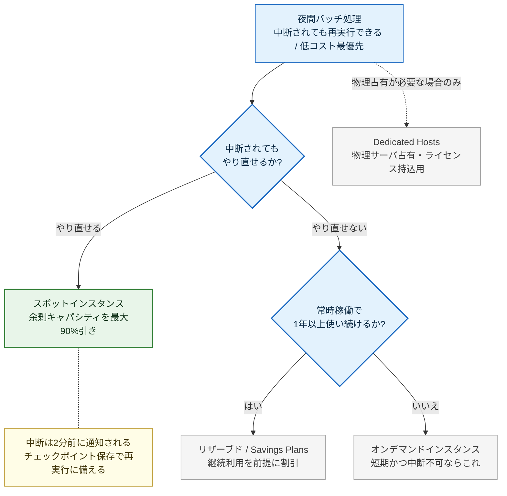
```mermaid
flowchart TD
    START["夜間バッチ処理<br/>中断されても再実行できる / 低コスト最優先"]:::req
    Q1{"中断されても<br/>やり直せるか?"}:::judge
    SPOT["スポットインスタンス<br/>余剰キャパシティを最大90%引き"]:::best
    NOTE["中断は2分前に通知される<br/>チェックポイント保存で再実行に備える"]:::note
    Q2{"常時稼働で<br/>1年以上使い続けるか?"}:::judge
    RI["リザーブド / Savings Plans<br/>継続利用を前提に割引"]:::alt
    OD["オンデマンドインスタンス<br/>短期かつ中断不可ならこれ"]:::alt
    DH["Dedicated Hosts<br/>物理サーバ占有・ライセンス持込用"]:::alt

    START --> Q1
    Q1 -->|"やり直せる"| SPOT
    Q1 -->|"やり直せない"| Q2
    Q2 -->|"はい"| RI
    Q2 -->|"いいえ"| OD
    START -.->|"物理占有が必要な場合のみ"| DH
    SPOT -.- NOTE
    classDef req fill:#e3f2fd,stroke:#1565c0,stroke-width:1px,color:#0d2b45
    classDef judge fill:#e3f2fd,stroke:#1565c0,stroke-width:2px,color:#0d2b45
    classDef best fill:#e8f5e9,stroke:#2e7d32,stroke-width:2px,color:#12331a
    classDef alt fill:#f5f5f5,stroke:#9e9e9e,stroke-width:1px,color:#3c3c3c
    classDef svc fill:#ffffff,stroke:#607d8b,stroke-width:1px,color:#22303a
    classDef note fill:#fffde7,stroke:#c0a03c,stroke-width:1px,color:#43380d
```

アプリ表示用の SVG: [`web/diagrams/cmp01.svg`](../../web/diagrams/cmp01.svg)

**解説**: スポットインスタンスは AWS の余剰キャパシティを最大 90% 引きで利用でき、中断耐性のあるバッチ処理・分析処理に最適です。中断通知(2分前)を受けてチェックポイントを保存する設計にします。常時稼働かつ中断不可ならリザーブド/Savings Plans、短期かつ中断不可ならオンデマンドを選びます。

**確認事項**: Savings Plans はリザーブドと1ノードにまとめている(解説の粒度に合わせた)。両者の違いを問う問題を追加する場合は分割が必要。

---

## cmp02 — コンピューティング / level 1

**問題**: Auto Scaling グループで、平均 CPU 使用率を 50% 前後に自動で維持したい。最も運用負荷が低いスケーリングポリシーはどれか?

**正解**: ターゲット追跡スケーリングポリシー

**他の選択肢**: シンプルスケーリングポリシー / ステップスケーリングポリシー / スケジュールされたスケーリング

**図解の主メッセージ**: 目標値の維持が要件なら、目標を1つ与えるだけで AWS が増減を計算するターゲット追跡が最も運用負荷が低い。

**採用パターン**: 循環(フィードバックループ)+ 対比。「AWS が代わりに回してくれる輪」が絵として見えることが主メッセージそのものであり、表では運用負荷の差が伝わりにくい。(候補: 循環(フィードバックループ)+ 対比: 自動で回る制御ループと、手で設計するポリシー群を並べる / テーブル: 4ポリシー × 設定項目 / 向くケースの比較表)

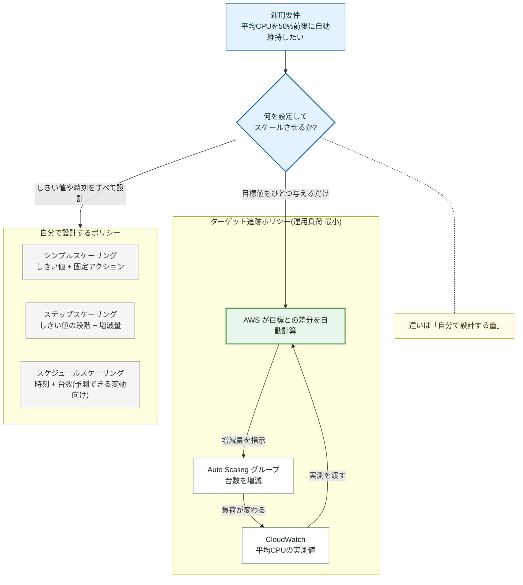
```mermaid
flowchart TB
    GOAL["運用要件<br/>平均CPUを50%前後に自動維持したい"]:::req
    Q{"何を設定して<br/>スケールさせるか?"}:::judge
    NOTE["違いは「自分で設計する量」"]:::note

    GOAL --> Q

    subgraph TT["ターゲット追跡ポリシー(運用負荷 最小)"]
        direction LR
        CALC["AWS が目標との差分を自動計算"]:::best
        ASG["Auto Scaling グループ<br/>台数を増減"]:::svc
        CW["CloudWatch<br/>平均CPUの実測値"]:::svc
        CALC -->|"増減量を指示"| ASG
        ASG -->|"負荷が変わる"| CW
        CW -->|"実測を渡す"| CALC
    end

    subgraph MANUAL["自分で設計するポリシー"]
        SIMPLE["シンプルスケーリング<br/>しきい値 + 固定アクション"]:::alt
        STEP["ステップスケーリング<br/>しきい値の段階 + 増減量"]:::alt
        SCHED["スケジュールスケーリング<br/>時刻 + 台数(予測できる変動向け)"]:::alt
    end

    Q -->|"目標値をひとつ与えるだけ"| CALC
    Q -->|"しきい値や時刻をすべて設計"| MANUAL
    Q -.- NOTE
    classDef req fill:#e3f2fd,stroke:#1565c0,stroke-width:1px,color:#0d2b45
    classDef judge fill:#e3f2fd,stroke:#1565c0,stroke-width:2px,color:#0d2b45
    classDef best fill:#e8f5e9,stroke:#2e7d32,stroke-width:2px,color:#12331a
    classDef alt fill:#f5f5f5,stroke:#9e9e9e,stroke-width:1px,color:#3c3c3c
    classDef svc fill:#ffffff,stroke:#607d8b,stroke-width:1px,color:#22303a
    classDef note fill:#fffde7,stroke:#c0a03c,stroke-width:1px,color:#43380d
```

アプリ表示用の SVG: [`web/diagrams/cmp02.svg`](../../web/diagrams/cmp02.svg)

**解説**: ターゲット追跡(Target Tracking)は「CPU 50% を維持」のように目標値を指定するだけで、必要な増減を AWS が自動計算するため運用が最も簡単です。ステップ/シンプルはしきい値とアクションを自分で細かく設計する必要があり、スケジュールは予測可能な負荷変動(平日9時に増加など)向けです。

**確認事項**: スケジュールスケーリングは「運用負荷が高い」のではなく「用途が違う(予測可能な変動向け)」。図ではグレー群に入れているため、ラベルで用途を明示している。

---

## cmp03 — コンピューティング / level 2

**問題**: ALB(Application Load Balancer)と NLB(Network Load Balancer)の使い分けとして正しい説明はどれか?

**正解**: ALB は L7 でパスベースルーティングが可能、NLB は L4 で超低レイテンシと静的 IP に対応

**他の選択肢**: ALB は L4 で TCP 負荷分散に特化、NLB は L7 で HTTP ヘッダーを解釈できる / どちらも L7 だが、NLB のほうがルーティング機能が豊富 / NLB は HTTP/HTTPS 専用で、ALB は全プロトコル対応

**図解の主メッセージ**: HTTPの中身で振り分けるなら L7 の ALB、TCP/UDP の性能と静的IPが要るなら L4 の NLB。

**採用パターン**: 対比(左右2グループ)+ 分岐。試験では「どちらを選ぶか」を問われるので、層の上下関係より選択の分かれ目を主役にした方が主メッセージに直結する。(候補: 対比(左右2グループ)+ 分岐: 1つの判断から L7 側 / L4 側へ分ける / レイヤー図: OSI の L7 / L4 を上下に積み、各層に該当サービスを置く)

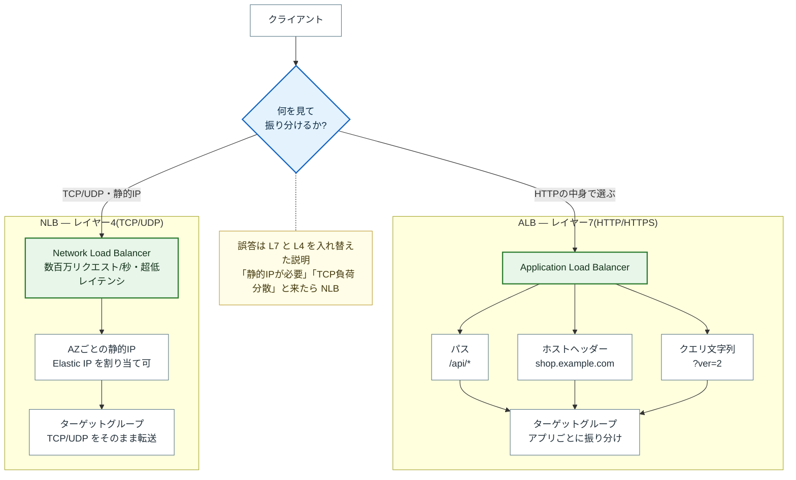
```mermaid
flowchart TB
    CLIENT["クライアント"]:::svc
    Q{"何を見て<br/>振り分けるか?"}:::judge
    NOTE["誤答は L7 と L4 を入れ替えた説明<br/>「静的IPが必要」「TCP負荷分散」と来たら NLB"]:::note

    CLIENT --> Q

    subgraph L7["ALB — レイヤー7(HTTP/HTTPS)"]
        ALB["Application Load Balancer"]:::best
        PATH["パス<br/>/api/*"]:::svc
        HOST["ホストヘッダー<br/>shop.example.com"]:::svc
        QS["クエリ文字列<br/>?ver=2"]:::svc
        TG7["ターゲットグループ<br/>アプリごとに振り分け"]:::svc
        ALB --> PATH --> TG7
        ALB --> HOST --> TG7
        ALB --> QS --> TG7
    end

    subgraph L4["NLB — レイヤー4(TCP/UDP)"]
        NLB["Network Load Balancer<br/>数百万リクエスト/秒・超低レイテンシ"]:::best
        EIP["AZごとの静的IP<br/>Elastic IP を割り当て可"]:::svc
        TG4["ターゲットグループ<br/>TCP/UDP をそのまま転送"]:::svc
        NLB --> EIP --> TG4
    end

    Q -->|"HTTPの中身で選ぶ"| ALB
    Q -->|"TCP/UDP・静的IP"| NLB
    Q -.- NOTE
    classDef req fill:#e3f2fd,stroke:#1565c0,stroke-width:1px,color:#0d2b45
    classDef judge fill:#e3f2fd,stroke:#1565c0,stroke-width:2px,color:#0d2b45
    classDef best fill:#e8f5e9,stroke:#2e7d32,stroke-width:2px,color:#12331a
    classDef alt fill:#f5f5f5,stroke:#9e9e9e,stroke-width:1px,color:#3c3c3c
    classDef svc fill:#ffffff,stroke:#607d8b,stroke-width:1px,color:#22303a
    classDef note fill:#fffde7,stroke:#c0a03c,stroke-width:1px,color:#43380d
```

アプリ表示用の SVG: [`web/diagrams/cmp03.svg`](../../web/diagrams/cmp03.svg)

**解説**: ALB はレイヤー7(HTTP/HTTPS)で動作し、パス・ホストヘッダー・クエリ文字列に基づくルーティングができます。NLB はレイヤー4(TCP/UDP)で動作し、数百万リクエスト/秒・超低レイテンシ・AZ ごとの静的 IP(Elastic IP 割当可)が特徴です。「静的 IP が必要」「TCP 負荷分散」と来たら NLB を選びます。

**確認事項**: この問題は「正しい説明を選ぶ」形式のため、誤答選択肢に対応する構成要素が図中に存在しない。誤答は注釈(L7とL4を逆にした説明)で補っている。 / Gateway Load Balancer / Classic Load Balancer は解説の範囲外のため描いていない。

---

## cmp04 — コンピューティング / level 2

**問題**: 単一 AZ の障害に耐えられるよう、EC2 ベースの Web アプリの可用性を高める構成として最も適切なのはどれか?

**正解**: 複数 AZ にまたがる Auto Scaling グループ + ALB

**他の選択肢**: 同一 AZ 内でインスタンスサイズを大きくする(垂直スケーリング) / 単一 AZ に Auto Scaling グループを構成し最小台数を増やす / 別リージョンに AMI をコピーして手動フェイルオーバーする

**図解の主メッセージ**: AZ 障害で全滅しないのは、複数 AZ に分散して ALB が生存インスタンスにだけ流す構成だけ。

**採用パターン**: 分岐(判断フロー)。対比は2つの構成図を描き分ける必要があり密になる。判断は「AZ をまたいでいるか」の一点なので、分岐1つに還元した方が解読が少ない。(候補: 分岐(判断フロー): 「AZ 障害で処理が残るか」の1問で正解と誤答を振り分け、正解側だけ構成を展開する / 対比(左右2枚): 単一 AZ 構成とマルチ AZ 構成を並べ、同じ AZ 障害を当てて結果を比べる)

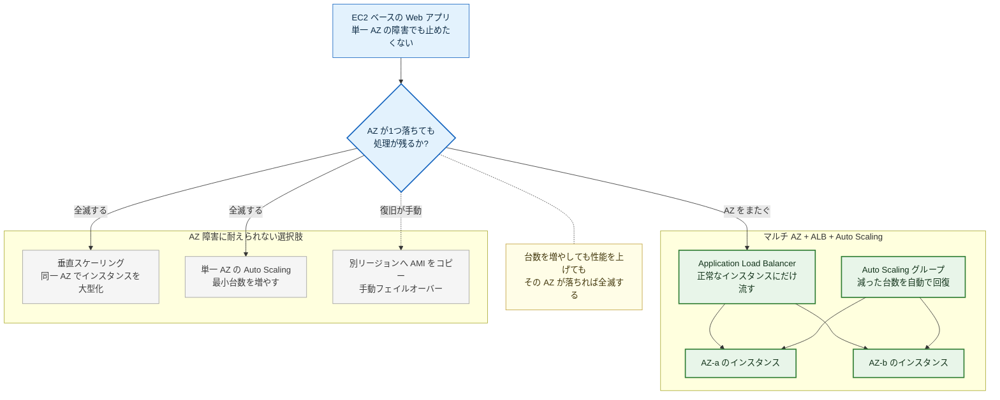
```mermaid
flowchart TD
    REQ["EC2 ベースの Web アプリ<br/>単一 AZ の障害でも止めたくない"]:::req
    Q{"AZ が1つ落ちても<br/>処理が残るか?"}:::judge

    subgraph HA["マルチ AZ + ALB + Auto Scaling"]
        ALB["Application Load Balancer<br/>正常なインスタンスにだけ流す"]:::best
        AZA["AZ-a のインスタンス"]:::best
        AZB["AZ-b のインスタンス"]:::best
        ASG["Auto Scaling グループ<br/>減った台数を自動で回復"]:::best
        ALB --> AZA
        ALB --> AZB
        ASG --> AZA
        ASG --> AZB
    end

    subgraph NG["AZ 障害に耐えられない選択肢"]
        VERT["垂直スケーリング<br/>同一 AZ でインスタンスを大型化"]:::alt
        ONE["単一 AZ の Auto Scaling<br/>最小台数を増やす"]:::alt
        DR["別リージョンへ AMI をコピー<br/>手動フェイルオーバー"]:::alt
    end

    NOTE["台数を増やしても性能を上げても<br/>その AZ が落ちれば全滅する"]:::note

    REQ --> Q
    Q -->|"AZ をまたぐ"| ALB
    Q -->|"全滅する"| VERT
    Q -->|"全滅する"| ONE
    Q -.->|"復旧が手動"| DR
    Q -.- NOTE
    classDef req fill:#e3f2fd,stroke:#1565c0,stroke-width:1px,color:#0d2b45
    classDef judge fill:#e3f2fd,stroke:#1565c0,stroke-width:2px,color:#0d2b45
    classDef best fill:#e8f5e9,stroke:#2e7d32,stroke-width:2px,color:#12331a
    classDef alt fill:#f5f5f5,stroke:#9e9e9e,stroke-width:1px,color:#3c3c3c
    classDef svc fill:#ffffff,stroke:#607d8b,stroke-width:1px,color:#22303a
    classDef note fill:#fffde7,stroke:#c0a03c,stroke-width:1px,color:#43380d
```

アプリ表示用の SVG: [`web/diagrams/cmp04.svg`](../../web/diagrams/cmp04.svg)

**解説**: 高可用性の基本パターンは「マルチ AZ + ELB + Auto Scaling」です。ALB が正常なインスタンスにのみトラフィックを流し、AZ 障害時も他 AZ のインスタンスが処理を継続、Auto Scaling が台数を回復します。垂直スケーリングや単一 AZ 構成は AZ 障害で全滅するため高可用性になりません。

**確認事項**: ALB のヘルスチェック機構そのもの(間隔・閾値)は解説の範囲外のため描いていない。 / 別リージョンへの AMI コピーは「手動フェイルオーバー」という選択肢の記述だけを根拠に非最適としている。RTO の数値は解説にないため図に入れていない。

---

## cmp05 — コンピューティング / level 1

**問題**: コンテナ化されたアプリを、サーバー(EC2 インスタンス)の管理なしで実行したい。どの組み合わせが最適か?

**正解**: ECS + Fargate 起動タイプ

**他の選択肢**: ECS + EC2 起動タイプ / EC2 に Docker を手動インストール / Elastic Beanstalk の EC2 プラットフォーム

**図解の主メッセージ**: サーバー管理をなくしたいなら、ホストを持たない Fargate 起動タイプを選ぶ。

**採用パターン**: 分岐(判断フロー)。この問題は層の理解ではなく起動タイプの二択そのものを問うており、分かれ目を主役にした方が主メッセージに直結する。レイヤー図は cmp13 側で使う。(候補: 分岐(判断フロー): 「ホスト EC2 を自分で持つか」の1問で Fargate 側と EC2 側に分ける / レイヤー図: オーケストレーション層(ECS)と実行基盤層(Fargate / EC2)を上下に積む)

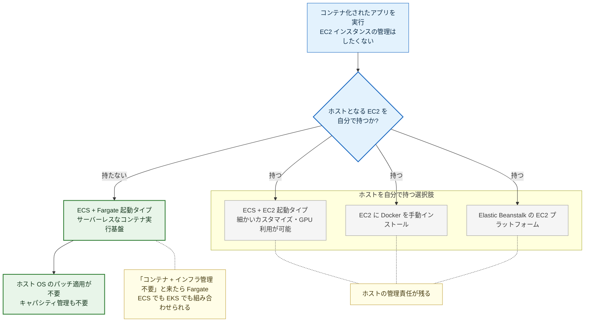
```mermaid
flowchart TD
    REQ["コンテナ化されたアプリを実行<br/>EC2 インスタンスの管理はしたくない"]:::req
    Q{"ホストとなる EC2 を<br/>自分で持つか?"}:::judge
    FARGATE["ECS + Fargate 起動タイプ<br/>サーバーレスなコンテナ実行基盤"]:::best
    FREE["ホスト OS のパッチ適用が不要<br/>キャパシティ管理も不要"]:::best

    subgraph OWN["ホストを自分で持つ選択肢"]
        EC2T["ECS + EC2 起動タイプ<br/>細かいカスタマイズ・GPU 利用が可能"]:::alt
        MANUAL["EC2 に Docker を手動インストール"]:::alt
        EB["Elastic Beanstalk の EC2 プラットフォーム"]:::alt
    end

    HOST["ホストの管理責任が残る"]:::note
    NOTE["「コンテナ + インフラ管理不要」と来たら Fargate<br/>ECS でも EKS でも組み合わせられる"]:::note

    REQ --> Q
    Q -->|"持たない"| FARGATE
    FARGATE --> FREE
    Q -->|"持つ"| EC2T
    Q -->|"持つ"| MANUAL
    Q -->|"持つ"| EB
    EC2T -.- HOST
    MANUAL -.- HOST
    EB -.- HOST
    FARGATE -.- NOTE
    classDef req fill:#e3f2fd,stroke:#1565c0,stroke-width:1px,color:#0d2b45
    classDef judge fill:#e3f2fd,stroke:#1565c0,stroke-width:2px,color:#0d2b45
    classDef best fill:#e8f5e9,stroke:#2e7d32,stroke-width:2px,color:#12331a
    classDef alt fill:#f5f5f5,stroke:#9e9e9e,stroke-width:1px,color:#3c3c3c
    classDef svc fill:#ffffff,stroke:#607d8b,stroke-width:1px,color:#22303a
    classDef note fill:#fffde7,stroke:#c0a03c,stroke-width:1px,color:#43380d
```

アプリ表示用の SVG: [`web/diagrams/cmp05.svg`](../../web/diagrams/cmp05.svg)

**解説**: Fargate はサーバーレスなコンテナ実行基盤で、ホスト OS のパッチ適用・キャパシティ管理が不要です。「コンテナ + インフラ管理不要」というキーワードが出たら Fargate(ECS または EKS と組み合わせ)を選びます。EC2 起動タイプはインスタンスの管理が必要になる代わりに、細かいカスタマイズや GPU 利用が可能です。

**確認事項**: Elastic Beanstalk の EC2 プラットフォームが非最適な理由は解説に明示がないため、「ホストの管理責任が残る」という共通の理由に寄せている。 / cmp13 も Fargate が正解の問題で、判断軸が重なる。cmp05 は ECS の起動タイプ二択、cmp13 は ECS/EKS 共通の実行基盤としての Fargate、と描き分けている。

---

## cmp06 — コンピューティング / level 1

**問題**: HTTP リクエストの URL パス(/api, /images など)に応じて異なるターゲットグループへ振り分けたい。どのロードバランサーを使うべきか?

**正解**: Application Load Balancer

**他の選択肢**: Network Load Balancer / Gateway Load Balancer / Classic Load Balancer

**図解の主メッセージ**: URL の中身を読んで振り分けられるのはレイヤー7の ALB だけ。

**採用パターン**: 分岐(判断フロー)。レイヤー図は4種すべての層を正確に置く必要があり、解説に記述のない GWLB / CLB の層まで断定してしまう。分岐なら解説にある「L7 か否か」だけで判断でき、創作を避けられる。(候補: 分岐(判断フロー): 「URL の中身を読む必要があるか」で ALB と他の ELB に分ける / レイヤー図: OSI の L7 / L4 / L3 を積み、各層に該当する ELB を配置する)

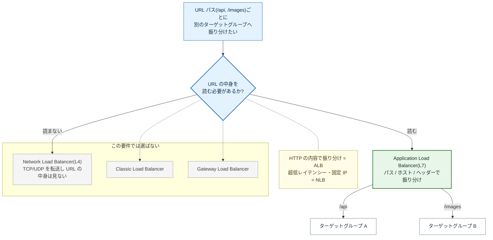
```mermaid
flowchart TD
    REQ["URL パス(/api, /images)ごとに<br/>別のターゲットグループへ振り分けたい"]:::req
    Q{"URL の中身を<br/>読む必要があるか?"}:::judge
    ALB["Application Load Balancer(L7)<br/>パス / ホスト / ヘッダーで振り分け"]:::best
    TG1["ターゲットグループ A"]:::svc
    TG2["ターゲットグループ B"]:::svc

    subgraph OTHERS["この要件では選ばない"]
        NLB["Network Load Balancer(L4)<br/>TCP/UDP を転送し URL の中身は見ない"]:::alt
        CLB["Classic Load Balancer"]:::alt
        GWLB["Gateway Load Balancer"]:::alt
    end

    NOTE["HTTP の内容で振り分け = ALB<br/>超低レイテンシー・固定 IP = NLB"]:::note

    REQ --> Q
    Q -->|"読む"| ALB
    ALB -->|"/api"| TG1
    ALB -->|"/images"| TG2
    Q -->|"読まない"| NLB
    Q -.-> CLB
    Q -.-> GWLB
    Q -.- NOTE
    classDef req fill:#e3f2fd,stroke:#1565c0,stroke-width:1px,color:#0d2b45
    classDef judge fill:#e3f2fd,stroke:#1565c0,stroke-width:2px,color:#0d2b45
    classDef best fill:#e8f5e9,stroke:#2e7d32,stroke-width:2px,color:#12331a
    classDef alt fill:#f5f5f5,stroke:#9e9e9e,stroke-width:1px,color:#3c3c3c
    classDef svc fill:#ffffff,stroke:#607d8b,stroke-width:1px,color:#22303a
    classDef note fill:#fffde7,stroke:#c0a03c,stroke-width:1px,color:#43380d
```

アプリ表示用の SVG: [`web/diagrams/cmp06.svg`](../../web/diagrams/cmp06.svg)

**解説**: ALB はレイヤー 7(HTTP/HTTPS)で動作し、パスベース・ホストベース・ヘッダーベースのルーティングが可能です。NLB はレイヤー 4(TCP/UDP)で動作するため URL の中身を見た振り分けはできません。「HTTP の内容で振り分け = ALB」「超低レイテンシー・固定 IP = NLB」と覚えます。

**確認事項**: Gateway Load Balancer と Classic Load Balancer は解説に説明がないため、名称のみを置きグループの枠で「この要件では選ばない」ことだけを示している。 / cmp03 / cmp07 も ALB と NLB の使い分けを扱う。cmp06 は「L7 側から見る」視点に固定して重複を避けている。

---

## cmp07 — コンピューティング / level 1

**問題**: 毎秒数百万リクエストの TCP トラフィックを超低レイテンシーで処理し、かつ固定 IP アドレスを顧客に案内する必要がある。どのロードバランサーが適切か?

**正解**: Network Load Balancer

**他の選択肢**: Application Load Balancer / Classic Load Balancer / Amazon CloudFront

**図解の主メッセージ**: TCP の超低レイテンシーと固定 IP を同時に満たすのはレイヤー4の NLB だけ。

**採用パターン**: 合流(2要件 → 1解)。マトリクスは CLB / CloudFront の位置を解説にない根拠で決める必要が出る。合流なら「2つの要件が同じ答えを指す」という主メッセージがそのまま線の形になる。(候補: 合流(2要件 → 1解): 2つの要件を1つの判断へ集め、両方を満たす NLB を導く / マトリクス: 「TCP 性能」×「固定 IP」の2軸に4選択肢を配置する)

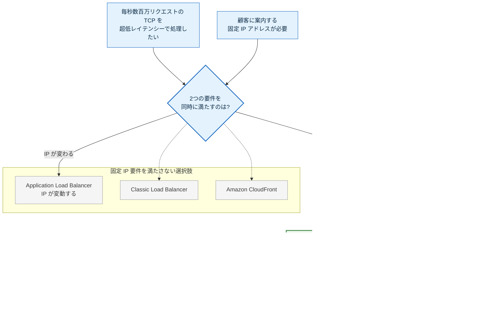
```mermaid
flowchart TD
    R1["毎秒数百万リクエストの TCP を<br/>超低レイテンシーで処理したい"]:::req
    R2["顧客に案内する<br/>固定 IP アドレスが必要"]:::req
    Q{"2つの要件を<br/>同時に満たすのは?"}:::judge
    NLB["Network Load Balancer(L4)"]:::best
    PERF["レイヤー4で動作<br/>大規模スループット・超低レイテンシー"]:::best
    EIP["AZ ごとに静的 IP<br/>Elastic IP も割り当て可"]:::best
    FW["顧客のファイアウォールで<br/>IP 許可リストを組める"]:::note

    subgraph NG["固定 IP 要件を満たさない選択肢"]
        ALB["Application Load Balancer<br/>IP が変動する"]:::alt
        CLB["Classic Load Balancer"]:::alt
        CF["Amazon CloudFront"]:::alt
    end

    R1 --> Q
    R2 --> Q
    Q -->|"両方満たす"| NLB
    NLB --> PERF
    NLB --> EIP
    EIP -.- FW
    Q -->|"IP が変わる"| ALB
    Q -.-> CLB
    Q -.-> CF
    classDef req fill:#e3f2fd,stroke:#1565c0,stroke-width:1px,color:#0d2b45
    classDef judge fill:#e3f2fd,stroke:#1565c0,stroke-width:2px,color:#0d2b45
    classDef best fill:#e8f5e9,stroke:#2e7d32,stroke-width:2px,color:#12331a
    classDef alt fill:#f5f5f5,stroke:#9e9e9e,stroke-width:1px,color:#3c3c3c
    classDef svc fill:#ffffff,stroke:#607d8b,stroke-width:1px,color:#22303a
    classDef note fill:#fffde7,stroke:#c0a03c,stroke-width:1px,color:#43380d
```

アプリ表示用の SVG: [`web/diagrams/cmp07.svg`](../../web/diagrams/cmp07.svg)

**解説**: NLB はレイヤー 4 で動作し、超低レイテンシーかつ大規模スループットに対応します。AZ ごとに静的 IP(または Elastic IP)を割り当てられるため、顧客のファイアウォールで IP 許可リストが必要な場合にも最適です。ALB は IP が変動するため固定 IP 要件には向きません。

**確認事項**: Classic Load Balancer と CloudFront が非最適な理由は解説に記述がないため、グループの枠で示すにとどめている。 / 「毎秒数百万リクエスト」は問題文の数値をそのまま使っており、図側で独自の性能値は足していない。

---

## cmp08 — コンピューティング / level 2

**問題**: HPC(ハイパフォーマンスコンピューティング)ワークロードで、ノード間通信のレイテンシーを最小化したい。どのプレイスメントグループを選ぶべきか?

**正解**: クラスタープレイスメントグループ

**他の選択肢**: スプレッドプレイスメントグループ / パーティションプレイスメントグループ / デフォルト配置(グループなし)

**図解の主メッセージ**: ノード間を速くしたいなら、物理的に近くへ集めるクラスタープレイスメントグループを選ぶ。

**採用パターン**: 分岐(判断フロー)。物理イメージの対比は絵として分かりやすい反面、ラック配置を図示すると解説にない構造まで描くことになる。分岐なら「目的が速さか耐障害性か」という解説どおりの判断軸で済む。(候補: 分岐(判断フロー): 「近づけるか離すか」の1問で3種のプレイスメントグループを振り分ける / 対比(左右2枚): 集約配置と分散配置の物理イメージを並べ、ノード間距離の違いを描く)

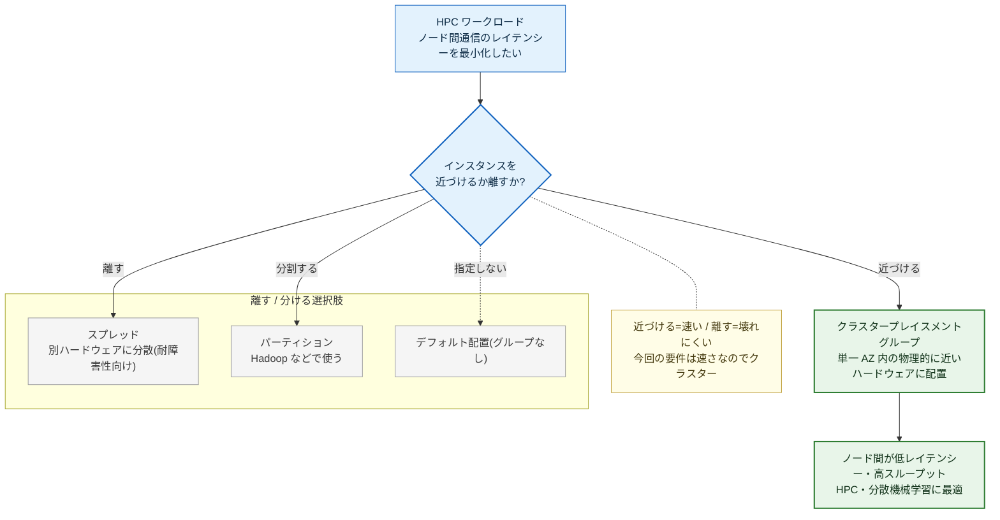
```mermaid
flowchart TD
    REQ["HPC ワークロード<br/>ノード間通信のレイテンシーを最小化したい"]:::req
    Q{"インスタンスを<br/>近づけるか離すか?"}:::judge
    CLUSTER["クラスタープレイスメントグループ<br/>単一 AZ 内の物理的に近いハードウェアに配置"]:::best
    EFFECT["ノード間が低レイテンシー・高スループット<br/>HPC・分散機械学習に最適"]:::best

    subgraph FAR["離す / 分ける選択肢"]
        SPREAD["スプレッド<br/>別ハードウェアに分散(耐障害性向け)"]:::alt
        PART["パーティション<br/>Hadoop などで使う"]:::alt
        DEF["デフォルト配置(グループなし)"]:::alt
    end

    NOTE["近づける=速い / 離す=壊れにくい<br/>今回の要件は速さなのでクラスター"]:::note

    REQ --> Q
    Q -->|"近づける"| CLUSTER
    CLUSTER --> EFFECT
    Q -->|"離す"| SPREAD
    Q -->|"分割する"| PART
    Q -.->|"指定しない"| DEF
    Q -.- NOTE
    classDef req fill:#e3f2fd,stroke:#1565c0,stroke-width:1px,color:#0d2b45
    classDef judge fill:#e3f2fd,stroke:#1565c0,stroke-width:2px,color:#0d2b45
    classDef best fill:#e8f5e9,stroke:#2e7d32,stroke-width:2px,color:#12331a
    classDef alt fill:#f5f5f5,stroke:#9e9e9e,stroke-width:1px,color:#3c3c3c
    classDef svc fill:#ffffff,stroke:#607d8b,stroke-width:1px,color:#22303a
    classDef note fill:#fffde7,stroke:#c0a03c,stroke-width:1px,color:#43380d
```

アプリ表示用の SVG: [`web/diagrams/cmp08.svg`](../../web/diagrams/cmp08.svg)

**解説**: クラスタープレイスメントグループは単一 AZ 内の物理的に近いハードウェアにインスタンスを配置し、ノード間の低レイテンシー・高スループット通信を実現します。HPC や分散機械学習に最適です。逆に耐障害性を高めたい場合はスプレッド(別ハードウェアに分散)、Hadoop などはパーティションを選びます。

**確認事項**: デフォルト配置が非最適な理由は解説に明示がないため、「配置を指定しない」という事実のみを示している。 / パーティションの用途は解説の「Hadoop など」をそのまま使い、それ以上の説明は足していない。

---

## cmp09 — コンピューティング / level 2

**問題**: 7 台の重要なインスタンスを、同一ハードウェア障害で同時に停止しないよう互いに異なる物理ラックへ配置したい。どの構成が適切か?

**正解**: スプレッドプレイスメントグループ

**他の選択肢**: クラスタープレイスメントグループ / 同一 AZ の同一サブネットに配置 / Dedicated Hosts に集約

**図解の主メッセージ**: 同一ハードウェア障害で共倒れさせないなら、各インスタンスを別ラックへ置くスプレッドを選ぶ。

**採用パターン**: 包含(分離の可視化)。この問題の要点は「別ラックに1台ずつ」という配置そのものなので、ラックを枠として描くと主メッセージが図の形と一致する。対比は cmp08 と絵が重複し、同じ絵を2問で使うことになる。(候補: 包含(分離の可視化): スプレッドの配下に独立したラックを並べ、1ラック1台であることを枠で示す / 対比(スプレッド vs クラスター): 同じ7台を集約配置と分散配置で並べて比べる)

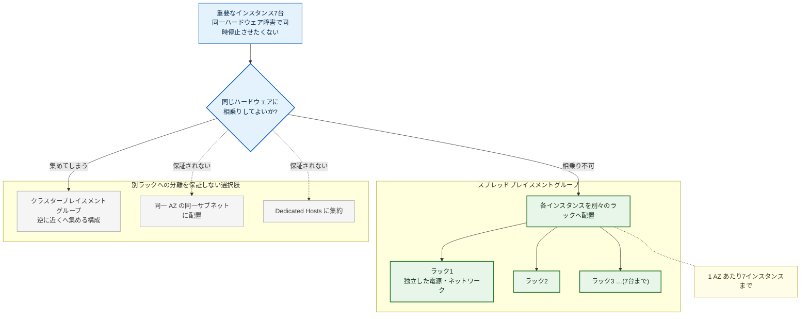
```mermaid
flowchart TD
    REQ["重要なインスタンス7台<br/>同一ハードウェア障害で同時停止させたくない"]:::req
    Q{"同じハードウェアに<br/>相乗りしてよいか?"}:::judge

    subgraph SP["スプレッドプレイスメントグループ"]
        SPREAD["各インスタンスを別々のラックへ配置"]:::best
        RACK1["ラック1<br/>独立した電源・ネットワーク"]:::best
        RACK2["ラック2"]:::best
        RACK3["ラック3 …(7台まで)"]:::best
        SPREAD --> RACK1
        SPREAD --> RACK2
        SPREAD --> RACK3
    end

    subgraph NG["別ラックへの分離を保証しない選択肢"]
        CLUSTER["クラスタープレイスメントグループ<br/>逆に近くへ集める構成"]:::alt
        SUBNET["同一 AZ の同一サブネットに配置"]:::alt
        DH["Dedicated Hosts に集約"]:::alt
    end

    LIMIT["1 AZ あたり7インスタンスまで"]:::note

    REQ --> Q
    Q -->|"相乗り不可"| SPREAD
    SPREAD -.- LIMIT
    Q -->|"集めてしまう"| CLUSTER
    Q -.->|"保証されない"| SUBNET
    Q -.->|"保証されない"| DH
    classDef req fill:#e3f2fd,stroke:#1565c0,stroke-width:1px,color:#0d2b45
    classDef judge fill:#e3f2fd,stroke:#1565c0,stroke-width:2px,color:#0d2b45
    classDef best fill:#e8f5e9,stroke:#2e7d32,stroke-width:2px,color:#12331a
    classDef alt fill:#f5f5f5,stroke:#9e9e9e,stroke-width:1px,color:#3c3c3c
    classDef svc fill:#ffffff,stroke:#607d8b,stroke-width:1px,color:#22303a
    classDef note fill:#fffde7,stroke:#c0a03c,stroke-width:1px,color:#43380d
```

アプリ表示用の SVG: [`web/diagrams/cmp09.svg`](../../web/diagrams/cmp09.svg)

**解説**: スプレッドプレイスメントグループは各インスタンスを別々のラック(独立した電源・ネットワーク)に配置し、ハードウェア障害の同時影響を防ぎます。1 AZ あたり 7 インスタンスまでという制限がある点も頻出です。クラスターは逆に「近くに集める」構成なので障害分離には不向きです。

**確認事項**: 同一サブネット配置と Dedicated Hosts が非最適な理由は解説に明示がない。解説が示す「スプレッドだけが別ラック配置を保証する」という点から、『分離は保証されない』とだけ書いている。 / ラックは図の都合で3つに省略している(実際の要件は7台)。ノード側に「7台まで」と明記して補った。

---

## cmp10 — コンピューティング / level 1

**問題**: Auto Scaling グループの平均 CPU 使用率を常に 50% 前後に保ちたい。最も簡単に実現できるスケーリングポリシーはどれか?

**正解**: ターゲット追跡スケーリング

**他の選択肢**: ステップスケーリング / スケジュールスケーリング / 手動スケーリング

**図解の主メッセージ**: メトリクスを目標値に保ちたいだけなら、目標を宣言するターゲット追跡が最も簡単。

**採用パターン**: 分岐(判断フロー)。制御ループはターゲット追跡の仕組みは説明できるが、他の3ポリシーを同じ図に置けず「なぜこれを選ぶか」に答えられない。設問は選択理由を問うているので分岐を採る。(候補: 分岐(判断フロー): 「増減の計算を誰がやるか」でターゲット追跡と他ポリシーを分ける / 循環(制御ループ): メトリクス測定 → 目標との差 → 台数調整 → 再測定 のフィードバックを描く)

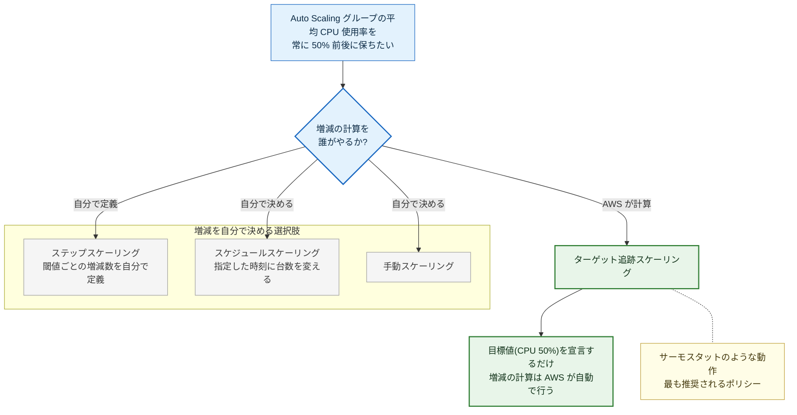
```mermaid
flowchart TD
    REQ["Auto Scaling グループの平均 CPU 使用率を<br/>常に 50% 前後に保ちたい"]:::req
    Q{"増減の計算を<br/>誰がやるか?"}:::judge
    TT["ターゲット追跡スケーリング"]:::best
    DECL["目標値(CPU 50%)を宣言するだけ<br/>増減の計算は AWS が自動で行う"]:::best

    subgraph SELF["増減を自分で決める選択肢"]
        STEP["ステップスケーリング<br/>閾値ごとの増減数を自分で定義"]:::alt
        SCHED["スケジュールスケーリング<br/>指定した時刻に台数を変える"]:::alt
        MANUAL["手動スケーリング"]:::alt
    end

    THERMO["サーモスタットのような動作<br/>最も推奨されるポリシー"]:::note

    REQ --> Q
    Q -->|"AWS が計算"| TT
    TT --> DECL
    TT -.- THERMO
    Q -->|"自分で定義"| STEP
    Q -->|"自分で決める"| SCHED
    Q -->|"自分で決める"| MANUAL
    classDef req fill:#e3f2fd,stroke:#1565c0,stroke-width:1px,color:#0d2b45
    classDef judge fill:#e3f2fd,stroke:#1565c0,stroke-width:2px,color:#0d2b45
    classDef best fill:#e8f5e9,stroke:#2e7d32,stroke-width:2px,color:#12331a
    classDef alt fill:#f5f5f5,stroke:#9e9e9e,stroke-width:1px,color:#3c3c3c
    classDef svc fill:#ffffff,stroke:#607d8b,stroke-width:1px,color:#22303a
    classDef note fill:#fffde7,stroke:#c0a03c,stroke-width:1px,color:#43380d
```

アプリ表示用の SVG: [`web/diagrams/cmp10.svg`](../../web/diagrams/cmp10.svg)

**解説**: ターゲット追跡スケーリングは「メトリクスを目標値(例: CPU 50%)に保つ」と宣言するだけで、増減の計算を AWS が自動で行います。サーモスタットのような動作で、最も推奨されるポリシーです。ステップスケーリングは閾値ごとの増減数を自分で細かく定義する必要があります。

**確認事項**: 手動スケーリングとスケジュールスケーリングが非最適な理由は解説に明示がないため、「台数を自分で決める」という共通点でまとめている。 / スケジュールスケーリングの詳細な使いどころは cmp11 側で扱う。

---

## cmp11 — コンピューティング / level 2

**問題**: 業務アプリは毎週月曜 9 時に必ずアクセスが急増する。スパイクの発生前にキャパシティを確保しておくには、どのスケーリング方式が適切か?

**正解**: スケジュールスケーリング

**他の選択肢**: ターゲット追跡スケーリング / 簡易スケーリング / ヘルスチェックによる置き換え

**図解の主メッセージ**: 急増の時刻が分かっているなら、起こる前に台数を増やすスケジュールスケーリングを選ぶ。

**採用パターン**: 分岐 + 短い時間軸。タイムライン2本は台数の推移カーブを描くことになるが、解説に台数や所要時間の数値はなく創作になる。分岐に 8:45 → 9:00 の2ステップだけ添えれば「スパイク前」という要点が数値を作らずに伝わる。(候補: 分岐 + 短い時間軸: 判断を1問に絞り、正解側だけ 8:45 → 9:00 の順序を描いて『前に増やす』を見せる / タイムライン2本: スケジュールとターゲット追跡の台数推移を同じ時間軸に並べて比較する)

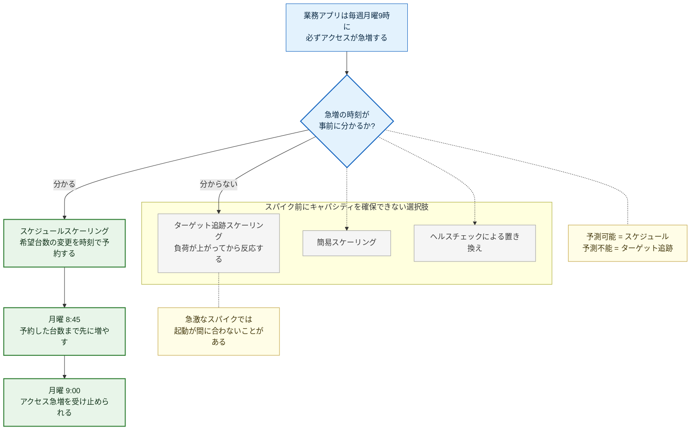
```mermaid
flowchart TD
    REQ["業務アプリは毎週月曜9時に<br/>必ずアクセスが急増する"]:::req
    Q{"急増の時刻が<br/>事前に分かるか?"}:::judge
    SCHED["スケジュールスケーリング<br/>希望台数の変更を時刻で予約する"]:::best
    T845["月曜 8:45<br/>予約した台数まで先に増やす"]:::best
    T900["月曜 9:00<br/>アクセス急増を受け止められる"]:::best

    subgraph NG["スパイク前にキャパシティを確保できない選択肢"]
        TT["ターゲット追跡スケーリング<br/>負荷が上がってから反応する"]:::alt
        SIMPLE["簡易スケーリング"]:::alt
        HC["ヘルスチェックによる置き換え"]:::alt
    end

    LATE["急激なスパイクでは<br/>起動が間に合わないことがある"]:::note
    NOTE["予測可能 = スケジュール<br/>予測不能 = ターゲット追跡"]:::note

    REQ --> Q
    Q -->|"分かる"| SCHED
    SCHED --> T845 --> T900
    Q -->|"分からない"| TT
    TT -.- LATE
    Q -.-> SIMPLE
    Q -.-> HC
    Q -.- NOTE
    classDef req fill:#e3f2fd,stroke:#1565c0,stroke-width:1px,color:#0d2b45
    classDef judge fill:#e3f2fd,stroke:#1565c0,stroke-width:2px,color:#0d2b45
    classDef best fill:#e8f5e9,stroke:#2e7d32,stroke-width:2px,color:#12331a
    classDef alt fill:#f5f5f5,stroke:#9e9e9e,stroke-width:1px,color:#3c3c3c
    classDef svc fill:#ffffff,stroke:#607d8b,stroke-width:1px,color:#22303a
    classDef note fill:#fffde7,stroke:#c0a03c,stroke-width:1px,color:#43380d
```

アプリ表示用の SVG: [`web/diagrams/cmp11.svg`](../../web/diagrams/cmp11.svg)

**解説**: アクセス増加のタイミングが事前に分かっている場合は、スケジュールスケーリングで「月曜 8:45 に希望台数を増やす」ように予約します。ターゲット追跡は負荷が実際に上がってから反応するため、急激なスパイクには起動が間に合わないことがあります。「予測可能 = スケジュール、予測不能 = ターゲット追跡」と整理します。

**確認事項**: 簡易スケーリングとヘルスチェック置き換えが非最適な理由は解説に明示がないため、グループの枠で「事前確保できない」とだけ示している。 / ターゲット追跡が間に合わない度合い(起動時間)は解説に数値がないため図に入れていない。

---

## cmp12 — コンピューティング / level 2

**問題**: 今後 3 年間 EC2 を使い続けるが、インスタンスファミリーやリージョンは柔軟に変更したい。割引を受けつつ柔軟性を最大化する購入オプションはどれか?

**正解**: Compute Savings Plans

**他の選択肢**: スタンダードリザーブドインスタンス / EC2 Instance Savings Plans / スポットインスタンス

**図解の主メッセージ**: ファミリーやリージョンを変えたいなら、適用先を固定しない Compute Savings Plans を選ぶ。

**採用パターン**: 分岐(判断フロー)。マトリクスはリザーブドとスポットの割引率を解説にない根拠で位置づけることになる。分岐なら解説にある「柔軟性か割引率か」という一点だけで判断でき、創作せずに済む。(候補: 分岐(判断フロー): 「適用先を固定してよいか」の1問で Compute と他オプションを分ける / マトリクス: 「柔軟性」×「割引率」の2軸に4オプションを配置する)

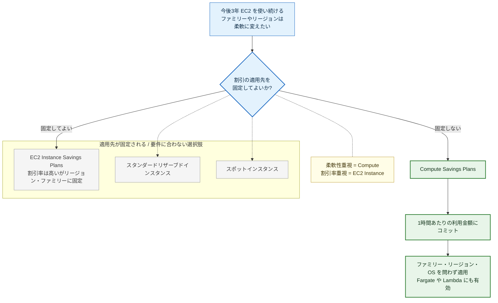
```mermaid
flowchart TD
    REQ["今後3年 EC2 を使い続ける<br/>ファミリーやリージョンは柔軟に変えたい"]:::req
    Q{"割引の適用先を<br/>固定してよいか?"}:::judge
    CSP["Compute Savings Plans"]:::best
    COMMIT["1時間あたりの利用金額にコミット"]:::best
    SCOPE["ファミリー・リージョン・OS を問わず適用<br/>Fargate や Lambda にも有効"]:::best

    subgraph NG["適用先が固定される / 要件に合わない選択肢"]
        EISP["EC2 Instance Savings Plans<br/>割引率は高いがリージョン・ファミリーに固定"]:::alt
        RI["スタンダードリザーブドインスタンス"]:::alt
        SPOT["スポットインスタンス"]:::alt
    end

    NOTE["柔軟性重視 = Compute<br/>割引率重視 = EC2 Instance"]:::note

    REQ --> Q
    Q -->|"固定しない"| CSP
    CSP --> COMMIT --> SCOPE
    Q -->|"固定してよい"| EISP
    Q -.-> RI
    Q -.-> SPOT
    Q -.- NOTE
    classDef req fill:#e3f2fd,stroke:#1565c0,stroke-width:1px,color:#0d2b45
    classDef judge fill:#e3f2fd,stroke:#1565c0,stroke-width:2px,color:#0d2b45
    classDef best fill:#e8f5e9,stroke:#2e7d32,stroke-width:2px,color:#12331a
    classDef alt fill:#f5f5f5,stroke:#9e9e9e,stroke-width:1px,color:#3c3c3c
    classDef svc fill:#ffffff,stroke:#607d8b,stroke-width:1px,color:#22303a
    classDef note fill:#fffde7,stroke:#c0a03c,stroke-width:1px,color:#43380d
```

アプリ表示用の SVG: [`web/diagrams/cmp12.svg`](../../web/diagrams/cmp12.svg)

**解説**: Compute Savings Plans は「1 時間あたりの利用金額」にコミットする方式で、インスタンスファミリー・リージョン・OS を問わず割引が適用され、Fargate や Lambda にも有効です。EC2 Instance Savings Plans は割引率が高い代わりに特定リージョン・ファミリーに固定されます。「柔軟性重視 = Compute、割引率重視 = EC2 Instance」と覚えます。

**確認事項**: スタンダードリザーブドインスタンスとスポットインスタンスが非最適な理由は解説に明示がないため、グループの枠で示すにとどめている。 / cmp01 では『リザーブド / Savings Plans』を1ノードにまとめている。本問で両者を分けたことで粒度が異なるが、いずれも各問の解説の粒度に合わせた結果。

---

## cmp13 — コンピューティング / level 1

**問題**: コンテナを実行したいが、EC2 インスタンスのプロビジョニングやパッチ適用などのサーバー管理を一切行いたくない。どの選択肢が適切か?

**正解**: AWS Fargate

**他の選択肢**: ECS on EC2 / EKS のセルフマネージドノード / EC2 上に Docker を手動インストール

**図解の主メッセージ**: サーバー管理をゼロにしたいなら、ECS でも EKS でもホストを持たない Fargate を選ぶ。

**採用パターン**: レイヤー図 + 分岐。分岐のみだと Fargate が ECS/EKS と並ぶ別サービスに見えてしまい、解説の「ECS・EKS の起動タイプとして選択できる」を伝えられない。オーケストレーション層を1ノード足すだけで誤読を防げる。(候補: レイヤー図 + 分岐: ECS/EKS の下に起動タイプを置き、その選択を1つの判断で決める / 分岐のみ: 4選択肢を「ホストを持つ/持たない」で二分する)

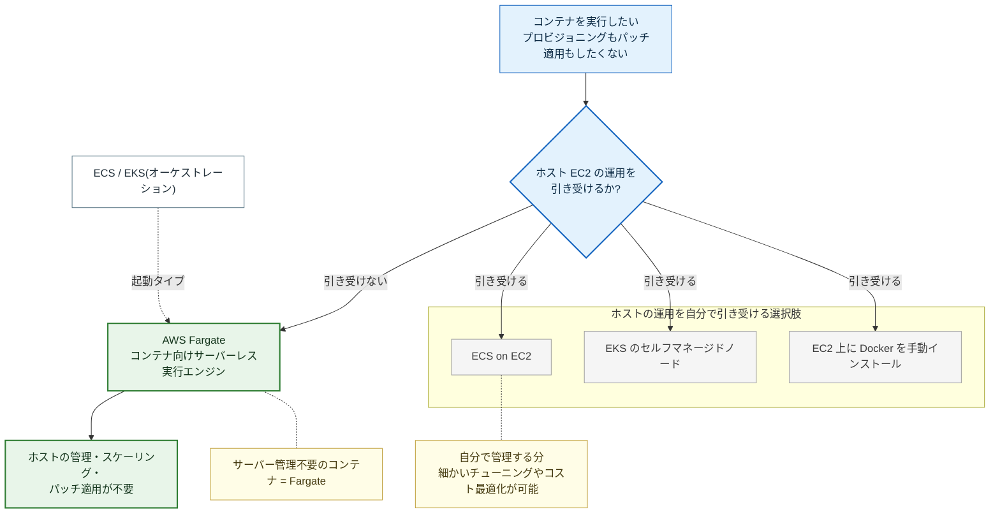
```mermaid
flowchart TD
    REQ["コンテナを実行したい<br/>プロビジョニングもパッチ適用もしたくない"]:::req
    ORCH["ECS / EKS(オーケストレーション)"]:::svc
    Q{"ホスト EC2 の運用を<br/>引き受けるか?"}:::judge
    FARGATE["AWS Fargate<br/>コンテナ向けサーバーレス実行エンジン"]:::best
    FREE["ホストの管理・スケーリング・<br/>パッチ適用が不要"]:::best

    subgraph OWN["ホストの運用を自分で引き受ける選択肢"]
        ECSEC2["ECS on EC2"]:::alt
        EKSSELF["EKS のセルフマネージドノード"]:::alt
        DOCKER["EC2 上に Docker を手動インストール"]:::alt
    end

    TUNE["自分で管理する分<br/>細かいチューニングやコスト最適化が可能"]:::note
    NOTE["サーバー管理不要のコンテナ = Fargate"]:::note

    REQ --> Q
    Q -->|"引き受けない"| FARGATE
    ORCH -.->|"起動タイプ"| FARGATE
    FARGATE --> FREE
    Q -->|"引き受ける"| ECSEC2
    Q -->|"引き受ける"| EKSSELF
    Q -->|"引き受ける"| DOCKER
    ECSEC2 -.- TUNE
    FARGATE -.- NOTE
    classDef req fill:#e3f2fd,stroke:#1565c0,stroke-width:1px,color:#0d2b45
    classDef judge fill:#e3f2fd,stroke:#1565c0,stroke-width:2px,color:#0d2b45
    classDef best fill:#e8f5e9,stroke:#2e7d32,stroke-width:2px,color:#12331a
    classDef alt fill:#f5f5f5,stroke:#9e9e9e,stroke-width:1px,color:#3c3c3c
    classDef svc fill:#ffffff,stroke:#607d8b,stroke-width:1px,color:#22303a
    classDef note fill:#fffde7,stroke:#c0a03c,stroke-width:1px,color:#43380d
```

アプリ表示用の SVG: [`web/diagrams/cmp13.svg`](../../web/diagrams/cmp13.svg)

**解説**: Fargate はコンテナ向けのサーバーレスコンピューティングエンジンで、ECS・EKS の起動タイプとして選択でき、ホストの管理・スケーリング・パッチ適用が不要になります。EC2 起動タイプはホストを自分で管理する分、細かいチューニングやコスト最適化が可能です。「サーバー管理不要のコンテナ = Fargate」が鉄板です。

**確認事項**: EKS + Fargate の組み合わせは解説に「ECS・EKS の起動タイプ」とあることを根拠に、オーケストレーション層を ECS/EKS の1ノードにまとめて表現している。EC2 起動タイプ側への線は交差が増えるため引いていない。 / cmp05 と正解サービスが同じ。cmp05 は ECS の起動タイプ二択、本問は ECS/EKS 共通の実行基盤という視点で描き分けている。

---

## cmp14 — コンピューティング / level 2

**問題**: オンプレミスで Kubernetes を運用してきたチームが、既存のマニフェストやツールをそのまま使いながら AWS へ移行したい。どのサービスが適切か?

**正解**: Amazon EKS

**他の選択肢**: Amazon ECS / AWS Elastic Beanstalk / AWS App Runner

**図解の主メッセージ**: 既存の Kubernetes 資産をそのまま使うことが要件なら、標準 Kubernetes API と完全互換の EKS を選ぶ。

**採用パターン**: 分岐。対比だと ECS / Beanstalk / App Runner それぞれの特徴を解説にない根拠で書き分ける必要が出る。分岐なら解説が示す唯一の判断軸(互換が要るか)がそのまま線の形になる。(候補: 分岐: 「Kubernetes 互換が要るか」の1判断から EKS 側と非 Kubernetes 側へ分ける / 対比(左右2グループ): Kubernetes 互換陣営と AWS 独自陣営を並べて特徴を比べる)

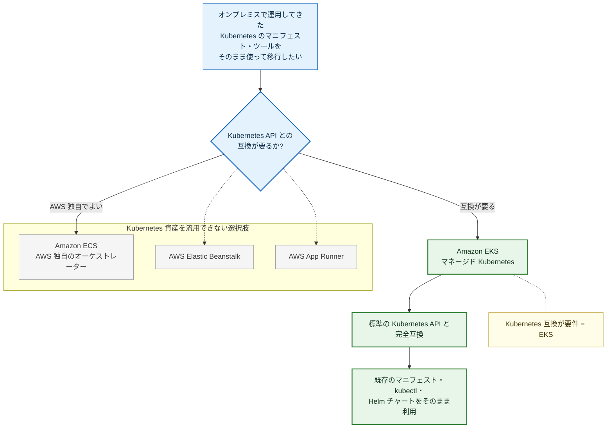
```mermaid
flowchart TD
    REQ["オンプレミスで運用してきた<br/>Kubernetes のマニフェスト・ツールを<br/>そのまま使って移行したい"]:::req
    Q{"Kubernetes API との<br/>互換が要るか?"}:::judge
    EKS["Amazon EKS<br/>マネージド Kubernetes"]:::best
    COMPAT["標準の Kubernetes API と完全互換"]:::best
    ASSETS["既存のマニフェスト・kubectl・<br/>Helm チャートをそのまま利用"]:::best
    NOTE["Kubernetes 互換が要件 = EKS"]:::note

    subgraph NG["Kubernetes 資産を流用できない選択肢"]
        ECS["Amazon ECS<br/>AWS 独自のオーケストレーター"]:::alt
        EB["AWS Elastic Beanstalk"]:::alt
        AR["AWS App Runner"]:::alt
    end

    REQ --> Q
    Q -->|"互換が要る"| EKS
    EKS --> COMPAT --> ASSETS
    Q -->|"AWS 独自でよい"| ECS
    Q -.-> EB
    Q -.-> AR
    EKS -.- NOTE
    classDef req fill:#e3f2fd,stroke:#1565c0,stroke-width:1px,color:#0d2b45
    classDef judge fill:#e3f2fd,stroke:#1565c0,stroke-width:2px,color:#0d2b45
    classDef best fill:#e8f5e9,stroke:#2e7d32,stroke-width:2px,color:#12331a
    classDef alt fill:#f5f5f5,stroke:#9e9e9e,stroke-width:1px,color:#3c3c3c
    classDef svc fill:#ffffff,stroke:#607d8b,stroke-width:1px,color:#22303a
    classDef note fill:#fffde7,stroke:#c0a03c,stroke-width:1px,color:#43380d
```

アプリ表示用の SVG: [`web/diagrams/cmp14.svg`](../../web/diagrams/cmp14.svg)

**解説**: EKS はマネージド Kubernetes サービスで、標準の Kubernetes API と完全互換のため、既存のマニフェスト・kubectl・Helm チャートをそのまま利用できます。ECS は AWS 独自のオーケストレーターなので Kubernetes 資産は流用できません。「Kubernetes 互換が要件 = EKS」で判断します。

**確認事項**: Elastic Beanstalk と App Runner が非最適な理由は解説に記述がないため、個別の理由を書かずグループの枠で位置づけるにとどめている。 / EKS のコントロールプレーン運用やコスト面は解説の範囲外のため描いていない。

---

## cmp15 — コンピューティング / level 1

**問題**: EC2 で一時的なスクラッチデータに対し最高レベルの IOPS が必要だが、インスタンス停止時にデータが消えても構わない。どのストレージが適切か?

**正解**: インスタンスストア

**他の選択肢**: EBS io2 ボリューム / EFS / S3

**図解の主メッセージ**: データが消えてよいという条件があって初めて、ホスト直結 NVMe のインスタンスストアが最高 IOPS の答えになる。

**採用パターン**: 合流(2要件 → 1解)。マトリクスは EFS と S3 の IOPS を解説にない根拠で位置づける必要が出る。合流なら「消えてよい、が効いて初めてインスタンスストアが選べる」という主メッセージがそのまま線の形になる。(候補: 合流(2要件 → 1解): 性能要件と永続性要件を1つの判断へ集め、両方を満たすインスタンスストアを導く / マトリクス: 「IOPS の高さ」×「永続性」の2軸に4つの選択肢を配置する)

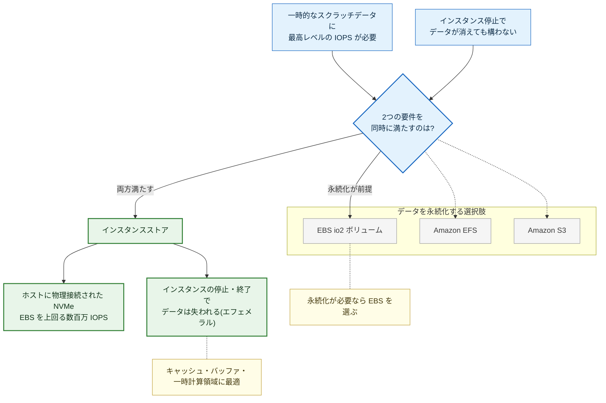
```mermaid
flowchart TD
    R1["一時的なスクラッチデータに<br/>最高レベルの IOPS が必要"]:::req
    R2["インスタンス停止で<br/>データが消えても構わない"]:::req
    Q{"2つの要件を<br/>同時に満たすのは?"}:::judge
    IS["インスタンスストア"]:::best
    NVME["ホストに物理接続された NVMe<br/>EBS を上回る数百万 IOPS"]:::best
    EPH["インスタンスの停止・終了で<br/>データは失われる(エフェメラル)"]:::best
    USE["キャッシュ・バッファ・<br/>一時計算領域に最適"]:::note
    NOTE["永続化が必要なら EBS を選ぶ"]:::note

    subgraph KEEP["データを永続化する選択肢"]
        IO2["EBS io2 ボリューム"]:::alt
        EFS["Amazon EFS"]:::alt
        S3["Amazon S3"]:::alt
    end

    R1 --> Q
    R2 --> Q
    Q -->|"両方満たす"| IS
    IS --> NVME
    IS --> EPH
    EPH -.- USE
    Q -->|"永続化が前提"| IO2
    Q -.-> EFS
    Q -.-> S3
    IO2 -.- NOTE
    classDef req fill:#e3f2fd,stroke:#1565c0,stroke-width:1px,color:#0d2b45
    classDef judge fill:#e3f2fd,stroke:#1565c0,stroke-width:2px,color:#0d2b45
    classDef best fill:#e8f5e9,stroke:#2e7d32,stroke-width:2px,color:#12331a
    classDef alt fill:#f5f5f5,stroke:#9e9e9e,stroke-width:1px,color:#3c3c3c
    classDef svc fill:#ffffff,stroke:#607d8b,stroke-width:1px,color:#22303a
    classDef note fill:#fffde7,stroke:#c0a03c,stroke-width:1px,color:#43380d
```

アプリ表示用の SVG: [`web/diagrams/cmp15.svg`](../../web/diagrams/cmp15.svg)

**解説**: インスタンスストアはホストに物理接続された NVMe ディスクで、EBS を上回る数百万 IOPS を実現できますが、インスタンスの停止・終了でデータが失われるエフェメラル(一時)ストレージです。キャッシュ・バッファ・一時計算領域に最適です。永続化が必要なら EBS を選びます。

**確認事項**: EFS と S3 が非最適な理由は解説に記述がないため、「永続化する選択肢」という枠の位置づけにとどめている。 / インスタンスストアを持つインスタンスファミリーの限定や、再起動(reboot)ではデータが残る点は解説の範囲外のため描いていない。

---

## cmp16 — コンピューティング / level 2

**問題**: EC2 インスタンス内のアプリが自身のインスタンス ID や IAM ロールの一時認証情報を取得する際、SSRF 攻撃への耐性を高めるために使用すべき方式はどれか?

**正解**: IMDSv2(セッショントークン方式)

**他の選択肢**: IMDSv1(リクエスト/レスポンス方式) / 認証情報をユーザーデータに埋め込む / アクセスキーを環境変数にハードコード

**図解の主メッセージ**: 単純な GET だけで読めるか、先にセッショントークンを取る必要があるか — その一手間の差が SSRF 耐性の差になる。

**採用パターン**: 対比 + 分岐。直列だと v2 の手順は分かっても「なぜ v1 では駄目か」が図に現れず、主メッセージ(一手間の差が耐性の差)を伝えられない。手順を左右に並べて初めて差が見える。(候補: 対比(上下2グループ)+ 分岐: v2 と v1 の取得手順を並べ、1つの判断から分ける / 直列: IMDSv2 の PUT → ヘッダー付与 → 取得の3ステップだけをタイムラインで描く)

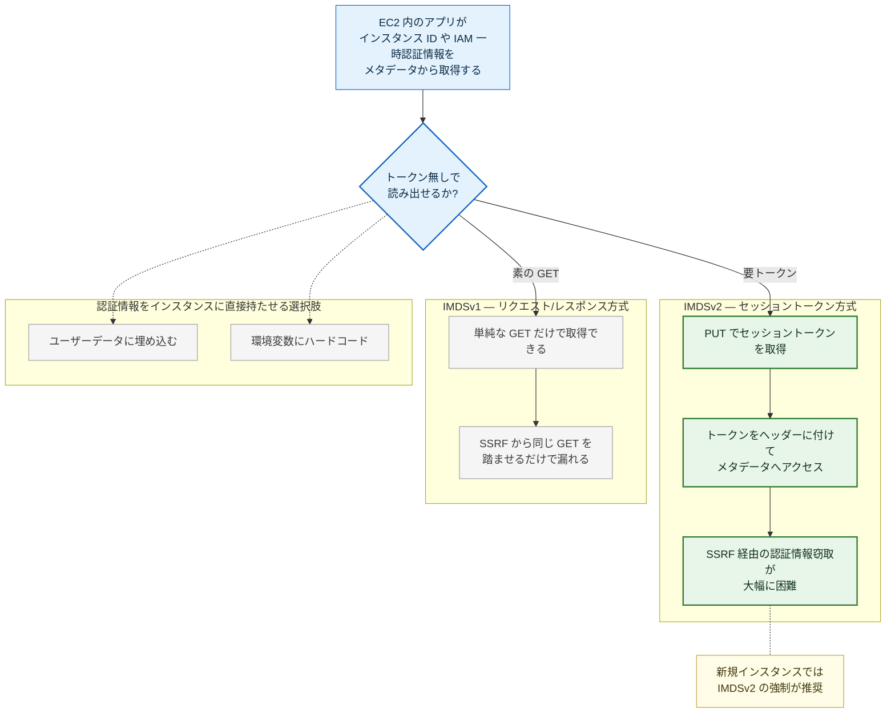
```mermaid
flowchart TD
    REQ["EC2 内のアプリが<br/>インスタンス ID や IAM 一時認証情報を<br/>メタデータから取得する"]:::req
    Q{"トークン無しで<br/>読み出せるか?"}:::judge

    subgraph V2["IMDSv2 — セッショントークン方式"]
        PUT["PUT でセッショントークンを取得"]:::best
        HDR["トークンをヘッダーに付けて<br/>メタデータへアクセス"]:::best
        HARD["SSRF 経由の認証情報窃取が<br/>大幅に困難"]:::best
        PUT --> HDR --> HARD
    end

    subgraph V1["IMDSv1 — リクエスト/レスポンス方式"]
        GET["単純な GET だけで取得できる"]:::alt
        LEAK["SSRF から同じ GET を<br/>踏ませるだけで漏れる"]:::alt
        GET --> LEAK
    end

    subgraph OWN["認証情報をインスタンスに直接持たせる選択肢"]
        UD["ユーザーデータに埋め込む"]:::alt
        ENV["環境変数にハードコード"]:::alt
    end

    NOTE["新規インスタンスでは<br/>IMDSv2 の強制が推奨"]:::note

    REQ --> Q
    Q -->|"要トークン"| PUT
    Q -->|"素の GET"| GET
    Q -.-> UD
    Q -.-> ENV
    HARD -.- NOTE
    classDef req fill:#e3f2fd,stroke:#1565c0,stroke-width:1px,color:#0d2b45
    classDef judge fill:#e3f2fd,stroke:#1565c0,stroke-width:2px,color:#0d2b45
    classDef best fill:#e8f5e9,stroke:#2e7d32,stroke-width:2px,color:#12331a
    classDef alt fill:#f5f5f5,stroke:#9e9e9e,stroke-width:1px,color:#3c3c3c
    classDef svc fill:#ffffff,stroke:#607d8b,stroke-width:1px,color:#22303a
    classDef note fill:#fffde7,stroke:#c0a03c,stroke-width:1px,color:#43380d
```

アプリ表示用の SVG: [`web/diagrams/cmp16.svg`](../../web/diagrams/cmp16.svg)

**解説**: IMDSv2 はまず PUT リクエストでセッショントークンを取得し、それをヘッダーに付けてメタデータへアクセスする方式です。単純な GET だけで取得できる IMDSv1 と異なり、SSRF 経由での認証情報窃取を大幅に困難にします。新規インスタンスでは IMDSv2 の強制が推奨されます。

**確認事項**: ユーザーデータ埋め込みとアクセスキーのハードコードが不適切な理由は解説に記述がないため、選択肢の文面だけを置き、理由は書いていない。 / IMDSv2 のホップ制限(既定 1)は SSRF 耐性に関わるが解説に記述がないため描いていない。

---

## cmp17 — コンピューティング / level 2

**問題**: 起動に 20 分かかる分析アプリを載せた EC2 を夜間停止してコスト削減したいが、翌朝はメモリ上の状態を保ったまま数分で再開したい。どの機能を使うべきか?

**正解**: EC2 Hibernate(休止)

**他の選択肢**: 通常の停止と起動 / AMI を作成して毎朝復元 / リザーブドインスタンスへ変更

**図解の主メッセージ**: メモリ上の状態を翌朝へ持ち越すのは、RAM を EBS へ保存して復元する Hibernate だけ。

**採用パターン**: 対比(2経路)+ 分岐。タイムラインは時刻の目盛りが必要になり要素が増える割に、判断軸(メモリ状態を持ち越すか)が図の中心に来ない。分岐なら1つの問いから2経路へ分かれ、主メッセージがそのまま構造になる。(候補: 対比(2経路)+ 分岐: メモリ状態を持ち越す経路と持ち越さない経路を並べる / タイムライン: 夜(停止)→ 朝(起動)の時間軸に、Hibernate と通常停止の2本を敷く)

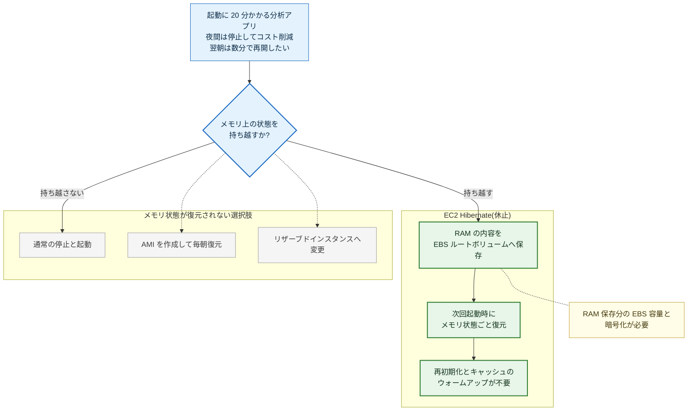
```mermaid
flowchart TD
    REQ["起動に 20 分かかる分析アプリ<br/>夜間は停止してコスト削減<br/>翌朝は数分で再開したい"]:::req
    Q{"メモリ上の状態を<br/>持ち越すか?"}:::judge

    subgraph HIB["EC2 Hibernate(休止)"]
        SAVE["RAM の内容を<br/>EBS ルートボリュームへ保存"]:::best
        RESTORE["次回起動時に<br/>メモリ状態ごと復元"]:::best
        FAST["再初期化とキャッシュの<br/>ウォームアップが不要"]:::best
        SAVE --> RESTORE --> FAST
    end

    subgraph PLAIN["メモリ状態が復元されない選択肢"]
        STOP["通常の停止と起動"]:::alt
        AMI["AMI を作成して毎朝復元"]:::alt
        RI["リザーブドインスタンスへ変更"]:::alt
    end

    COST["RAM 保存分の EBS 容量と<br/>暗号化が必要"]:::note

    REQ --> Q
    Q -->|"持ち越す"| SAVE
    Q -->|"持ち越さない"| STOP
    Q -.-> AMI
    Q -.-> RI
    SAVE -.- COST
    classDef req fill:#e3f2fd,stroke:#1565c0,stroke-width:1px,color:#0d2b45
    classDef judge fill:#e3f2fd,stroke:#1565c0,stroke-width:2px,color:#0d2b45
    classDef best fill:#e8f5e9,stroke:#2e7d32,stroke-width:2px,color:#12331a
    classDef alt fill:#f5f5f5,stroke:#9e9e9e,stroke-width:1px,color:#3c3c3c
    classDef svc fill:#ffffff,stroke:#607d8b,stroke-width:1px,color:#22303a
    classDef note fill:#fffde7,stroke:#c0a03c,stroke-width:1px,color:#43380d
```

アプリ表示用の SVG: [`web/diagrams/cmp17.svg`](../../web/diagrams/cmp17.svg)

**解説**: Hibernate は RAM の内容を EBS ルートボリュームへ保存してから停止し、次回起動時にメモリ状態ごと復元します。アプリの再初期化やキャッシュのウォームアップが不要になるため、起動準備が長いワークロードに有効です。RAM 保存分の EBS 容量と暗号化が必要な点に注意します。

**確認事項**: 通常の停止/起動・AMI 復元・リザーブドインスタンスが要件を満たさない理由は解説に個別記述がないため、Hibernate 側の説明の裏返し(メモリ状態が復元されない)としてグループ名で示すにとどめている。 / Hibernate の対象インスタンスタイプや RAM サイズの上限といった前提条件は解説の範囲外のため描いていない。

---

## cmp18 — コンピューティング / level 1

**問題**: 開発者がコードをアップロードするだけで、EC2・ALB・Auto Scaling などのインフラを自動構築・管理してくれるサービスはどれか?

**正解**: AWS Elastic Beanstalk

**他の選択肢**: AWS CloudFormation / AWS Systems Manager / Amazon Lightsail

**図解の主メッセージ**: 渡すのがコードだけなら PaaS の Elastic Beanstalk、インフラ定義のテンプレートを書くなら CloudFormation。

**採用パターン**: 分岐 + 包含。レイヤー図は Beanstalk の内部構造の説明になり、試験で問われる「CloudFormation との使い分け」が図から消える。分岐にすれば判断軸が主役のまま、自動化の範囲は1ノードで足りる。(候補: 分岐 + 包含: 「渡すもの」の1判断で分け、Beanstalk が面倒を見る範囲を枠で囲う / レイヤー図: 開発者 / PaaS / 実リソース(EC2・ALB・ASG)を上下に積む)

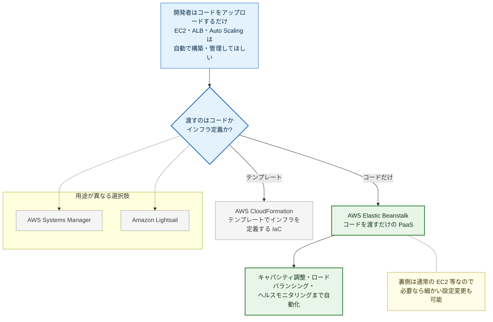
```mermaid
flowchart TD
    REQ["開発者はコードをアップロードするだけ<br/>EC2・ALB・Auto Scaling は<br/>自動で構築・管理してほしい"]:::req
    Q{"渡すのはコードか<br/>インフラ定義か?"}:::judge
    EB["AWS Elastic Beanstalk<br/>コードを渡すだけの PaaS"]:::best
    AUTO["キャパシティ調整・ロードバランシング・<br/>ヘルスモニタリングまで自動化"]:::best
    CFN["AWS CloudFormation<br/>テンプレートでインフラを定義する IaC"]:::alt
    NOTE["裏側は通常の EC2 等なので<br/>必要なら細かい設定変更も可能"]:::note

    subgraph OTHER["用途が異なる選択肢"]
        SSM["AWS Systems Manager"]:::alt
        LS["Amazon Lightsail"]:::alt
    end

    REQ --> Q
    Q -->|"コードだけ"| EB
    EB --> AUTO
    EB -.- NOTE
    Q -->|"テンプレート"| CFN
    Q -.-> SSM
    Q -.-> LS
    classDef req fill:#e3f2fd,stroke:#1565c0,stroke-width:1px,color:#0d2b45
    classDef judge fill:#e3f2fd,stroke:#1565c0,stroke-width:2px,color:#0d2b45
    classDef best fill:#e8f5e9,stroke:#2e7d32,stroke-width:2px,color:#12331a
    classDef alt fill:#f5f5f5,stroke:#9e9e9e,stroke-width:1px,color:#3c3c3c
    classDef svc fill:#ffffff,stroke:#607d8b,stroke-width:1px,color:#22303a
    classDef note fill:#fffde7,stroke:#c0a03c,stroke-width:1px,color:#43380d
```

アプリ表示用の SVG: [`web/diagrams/cmp18.svg`](../../web/diagrams/cmp18.svg)

**解説**: Elastic Beanstalk はコードをデプロイするだけで、キャパシティ調整・ロードバランシング・ヘルスモニタリングまで自動化する PaaS です。裏側のリソースは通常の EC2 等なので、必要なら細かい設定変更も可能です。CloudFormation は「テンプレートでインフラを定義する IaC」であり、コードだけ渡す使い方とは異なります。

**確認事項**: Systems Manager と Lightsail が非最適な理由は解説に記述がないため、個別の理由を書かず「用途が異なる選択肢」の枠に置くにとどめている。 / Beanstalk が構築するリソース名(EC2・ALB・Auto Scaling)は問題文に挙がっているものだけを自動化の対象として記載している。

---

## cmp19 — コンピューティング / level 2

**問題**: 東京リージョンで稼働中の EC2 環境を、災害対策として大阪リージョンでも起動できるようにしたい。カスタム AMI についてまず行うべきことは?

**正解**: AMI を大阪リージョンへコピーする

**他の選択肢**: AMI はグローバルリソースなのでそのまま使える / EBS スナップショットを S3 にエクスポートする / 大阪で新規にインスタンスを手動構築する

**図解の主メッセージ**: AMI はリージョン単位のリソースなので、大阪で使うにはまず AMI のコピーが要る。

**採用パターン**: 包含 + コピー矢印。分岐だけだと「リージョン単位」という言葉を読ませるだけになるが、枠を2つ描けばスコープが図形として伝わり、コピーが枠をまたぐ操作であることも同時に分かる。(候補: 包含(リージョン枠2つ)+ コピー矢印: リソースのスコープを枠そのもので表す / 分岐: 「AMI はグローバルかリージョン単位か」の判断から正解と誤答へ分ける)

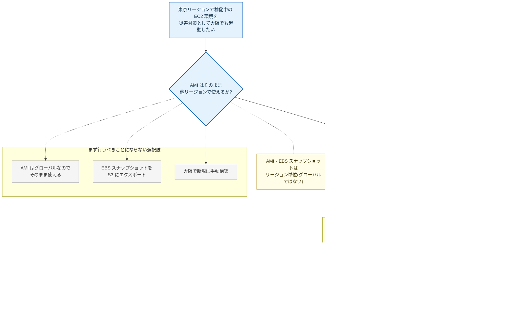
```mermaid
flowchart TD
    REQ["東京リージョンで稼働中の EC2 環境を<br/>災害対策として大阪でも起動したい"]:::req
    Q{"AMI はそのまま<br/>他リージョンで使えるか?"}:::judge
    NOTE["AMI・EBS スナップショットは<br/>リージョン単位(グローバルではない)"]:::note

    subgraph TOKYO["東京リージョン"]
        AMI_T["カスタム AMI"]:::svc
    end

    subgraph OSAKA["大阪リージョン"]
        AMI_O["コピーされた AMI<br/>新しい AMI ID が割り振られる"]:::best
        EC2_O["DR 用インスタンスを起動できる"]:::best
        AMI_O --> EC2_O
    end

    KMS["KMS 暗号化 AMI は<br/>コピー先リージョンのキーで再暗号化"]:::note

    subgraph NG["まず行うべきことにならない選択肢"]
        GLOBAL["AMI はグローバルなので<br/>そのまま使える"]:::alt
        EXP["EBS スナップショットを<br/>S3 にエクスポート"]:::alt
        MANUAL["大阪で新規に手動構築"]:::alt
    end

    REQ --> Q
    Q -->|"使えない"| AMI_T
    AMI_T -->|"AMI をコピー"| AMI_O
    Q -.-> GLOBAL
    Q -.-> EXP
    Q -.-> MANUAL
    AMI_O -.- KMS
    Q -.- NOTE
    classDef req fill:#e3f2fd,stroke:#1565c0,stroke-width:1px,color:#0d2b45
    classDef judge fill:#e3f2fd,stroke:#1565c0,stroke-width:2px,color:#0d2b45
    classDef best fill:#e8f5e9,stroke:#2e7d32,stroke-width:2px,color:#12331a
    classDef alt fill:#f5f5f5,stroke:#9e9e9e,stroke-width:1px,color:#3c3c3c
    classDef svc fill:#ffffff,stroke:#607d8b,stroke-width:1px,color:#22303a
    classDef note fill:#fffde7,stroke:#c0a03c,stroke-width:1px,color:#43380d
```

アプリ表示用の SVG: [`web/diagrams/cmp19.svg`](../../web/diagrams/cmp19.svg)

**解説**: AMI はリージョンローカルなリソースであり、別リージョンで使うには明示的なコピーが必要です。コピー先で新しい AMI ID が割り振られます。KMS 暗号化された AMI をコピーする場合は、コピー先リージョンのキーを指定して再暗号化します。「AMI・EBS スナップショットはリージョン単位」は頻出ポイントです。

**確認事項**: EBS スナップショットの S3 エクスポートと手動構築が非最適な理由は解説に記述がないため、枠の位置づけにとどめている。 / コピー後のインスタンス起動は DR の目的から自明な後続として1ノードだけ置いた。実際の DR 手順(起動テンプレート等)は解説の範囲外のため描いていない。

---

## cmp20 — コンピューティング / level 2

**問題**: Auto Scaling によるスケールイン時、インスタンスが終了する前にログを S3 へ退避する処理を確実に実行したい。どの機能を使うべきか?

**正解**: ライフサイクルフック

**他の選択肢**: 終了保護(Termination Protection) / スケールインクールダウン / CloudWatch アラーム

**図解の主メッセージ**: 終了を Terminating:Wait で待たせて自前の処理を挟めるのはライフサイクルフックだけ。

**採用パターン**: 直列(状態遷移)。対比は他3つの役割を解説にない根拠で書き分ける必要が出るうえ、「どこで処理が走るのか」という肝心の一点が図に現れない。直列なら待ち状態が流れの中の一区間として見える。(候補: 直列(状態遷移): スケールイン → Terminating:Wait → 処理 → continue → 終了 の順に並べる / 対比: 4つの選択肢の役割を並べ、終了前に割り込めるものを1つ選ばせる)

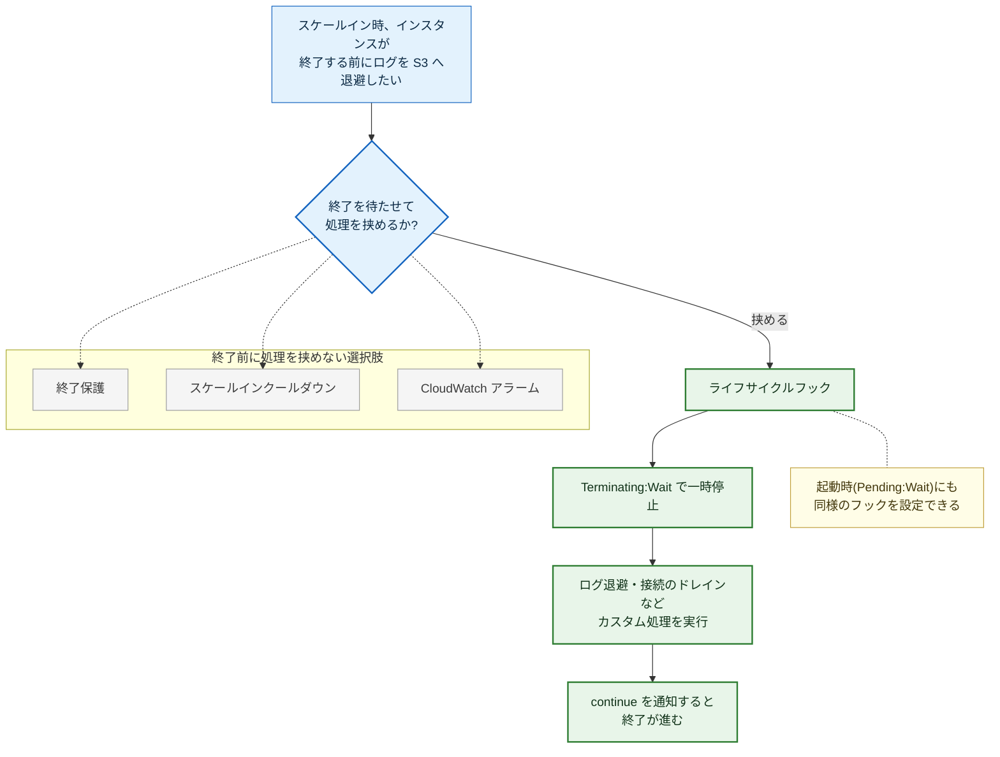
```mermaid
flowchart TD
    REQ["スケールイン時、インスタンスが<br/>終了する前にログを S3 へ退避したい"]:::req
    Q{"終了を待たせて<br/>処理を挟めるか?"}:::judge
    HOOK["ライフサイクルフック"]:::best
    WAIT["Terminating:Wait で一時停止"]:::best
    JOB["ログ退避・接続のドレインなど<br/>カスタム処理を実行"]:::best
    CONT["continue を通知すると<br/>終了が進む"]:::best
    LAUNCH["起動時(Pending:Wait)にも<br/>同様のフックを設定できる"]:::note

    subgraph NG["終了前に処理を挟めない選択肢"]
        PROT["終了保護"]:::alt
        COOL["スケールインクールダウン"]:::alt
        CWA["CloudWatch アラーム"]:::alt
    end

    REQ --> Q
    Q -->|"挟める"| HOOK
    HOOK --> WAIT --> JOB --> CONT
    Q -.-> PROT
    Q -.-> COOL
    Q -.-> CWA
    HOOK -.- LAUNCH
    classDef req fill:#e3f2fd,stroke:#1565c0,stroke-width:1px,color:#0d2b45
    classDef judge fill:#e3f2fd,stroke:#1565c0,stroke-width:2px,color:#0d2b45
    classDef best fill:#e8f5e9,stroke:#2e7d32,stroke-width:2px,color:#12331a
    classDef alt fill:#f5f5f5,stroke:#9e9e9e,stroke-width:1px,color:#3c3c3c
    classDef svc fill:#ffffff,stroke:#607d8b,stroke-width:1px,color:#22303a
    classDef note fill:#fffde7,stroke:#c0a03c,stroke-width:1px,color:#43380d
```

アプリ表示用の SVG: [`web/diagrams/cmp20.svg`](../../web/diagrams/cmp20.svg)

**解説**: ライフサイクルフックを使うと、インスタンスが Terminating:Wait 状態で一時停止し、その間にログ退避や接続のドレインなどのカスタム処理を実行できます。処理完了後に continue を通知すると終了が進みます。起動時(Pending:Wait)にも同様のフックを設定できます。

**確認事項**: 終了保護・クールダウン・CloudWatch アラームが要件を満たさない理由は解説に記述がないため、「終了前に処理を挟めない」という共通点だけで枠にまとめている。 / フックのタイムアウト時間や既定の継続動作(ABANDON / CONTINUE)は解説の範囲外のため描いていない。

---

## cmp21 — コンピューティング / level 2

**問題**: セッション情報をローカルに保持するレガシー Web アプリを ALB 配下で動かしたところ、リクエストごとに別サーバーへ振られてログインが切れる。応急対応として有効な ALB の機能はどれか?

**正解**: スティッキーセッション(セッションアフィニティ)

**他の選択肢**: クロスゾーン負荷分散 / 接続ドレイン / ホストベースルーティング

**図解の主メッセージ**: ローカルにセッションを持つアプリの応急対応は、Cookie で同じターゲットへ固定するスティッキーセッション。

**採用パターン**: 直列(症状 → 応急対応 → 恒久対応)。対比では解説が明示する「応急と恒久は別物」という前提が図から抜ける。直列なら正解が応急対応の位置に置かれ、外部化がその先にあることも同じ1枚で伝わる。(候補: 直列(症状 → 応急対応 → 恒久対応): 時間軸に沿って対応の段階を並べる / 対比: ALB の4機能を並べ、セッション固定に効くものを1つ選ばせる)

```mermaid
flowchart TD
    REQ["セッション情報をローカルに保持する<br/>レガシー Web アプリを ALB 配下で稼働"]:::req
    SYM["リクエストごとに別サーバーへ振られ<br/>ログインが切れる"]:::req
    Q{"同じターゲットへ<br/>固定できるか?"}:::judge
    STICKY["スティッキーセッション<br/>(セッションアフィニティ)"]:::best
    COOKIE["ALB が Cookie で同一クライアントを<br/>同じターゲットへ振り続ける"]:::best
    LIMIT["負荷の偏り・インスタンス障害時の<br/>セッション消失は残る"]:::note
    PERM["ElastiCache や DynamoDB へ<br/>セッションを外部化"]:::svc

    subgraph NG["振り先を固定しない選択肢"]
        XZ["クロスゾーン負荷分散"]:::alt
        DRAIN["接続ドレイン"]:::alt
        HOST["ホストベースルーティング"]:::alt
    end

    REQ --> SYM --> Q
    Q -->|"応急対応"| STICKY
    STICKY --> COOKIE
    COOKIE -.- LIMIT
    LIMIT -.->|"恒久対応"| PERM
    Q -.-> XZ
    Q -.-> DRAIN
    Q -.-> HOST
    classDef req fill:#e3f2fd,stroke:#1565c0,stroke-width:1px,color:#0d2b45
    classDef judge fill:#e3f2fd,stroke:#1565c0,stroke-width:2px,color:#0d2b45
    classDef best fill:#e8f5e9,stroke:#2e7d32,stroke-width:2px,color:#12331a
    classDef alt fill:#f5f5f5,stroke:#9e9e9e,stroke-width:1px,color:#3c3c3c
    classDef svc fill:#ffffff,stroke:#607d8b,stroke-width:1px,color:#22303a
    classDef note fill:#fffde7,stroke:#c0a03c,stroke-width:1px,color:#43380d
```

アプリ表示用の SVG: [`web/diagrams/cmp21.svg`](../../web/diagrams/cmp21.svg)

**解説**: スティッキーセッションを有効にすると、ALB が Cookie を使って同一クライアントを同じターゲットへ振り続けるため、ローカルセッション依存のアプリでも動作します。ただし負荷の偏りやインスタンス障害時のセッション消失は残るため、恒久対応としては ElastiCache や DynamoDB へのセッション外部化が推奨されます。

**確認事項**: クロスゾーン負荷分散・接続ドレイン・ホストベースルーティングが要件を満たさない理由は解説に記述がないため、「振り先を固定しない」という共通点だけで枠にまとめている。 / セッション外部化は正解の選択肢ではないが解説が推奨として挙げているため、緑(正解の構成要素)ではなく白のサービスとして応急対応の先に置いている。

---

## cmp22 — コンピューティング / level 1

**問題**: スケールアウト(水平分散)に対応していないモノリシックなデータベースサーバーの性能が不足してきた。まず取れる対応はどれか?

**正解**: より大きいインスタンスタイプへ変更する(スケールアップ)

**他の選択肢**: インスタンスを複数台に増やす / スポットインスタンスに変更する / AZ を追加する

**図解の主メッセージ**: アプリが分散に対応していないなら台数は増やせない。まずインスタンスタイプを上げる垂直スケーリング。

**採用パターン**: 分岐(前提の確認 → 2経路)。対比だと2つのやり方が対等に見え、「今回は前提を満たさないから垂直しかない」という主メッセージが弱まる。判断を先頭に置けば前提が効いていることが線で分かる。(候補: 分岐(前提の確認 → 2経路): 「水平分散できるか」を先に問い、垂直側と水平側へ分ける / 対比(左右2グループ): 垂直スケーリングと水平スケーリングの特徴を並べて比べる)

```mermaid
flowchart TD
    REQ["スケールアウトに対応していない<br/>モノリシックな DB サーバー<br/>性能が不足してきた"]:::req
    Q{"アプリは水平分散<br/>できるか?"}:::judge
    UP["より大きいインスタンスタイプへ変更<br/>(垂直スケーリング / スケールアップ)"]:::best
    STEP["停止 → タイプ変更 → 起動"]:::best
    PRE["水平スケーリングはアプリが<br/>ステートレスであることが前提"]:::note

    subgraph NG["今回は性能不足を解決しない選択肢"]
        MULTI["インスタンスを複数台に増やす<br/>(水平スケーリング)"]:::alt
        AZ["AZ を追加する"]:::alt
        SPOT["スポットインスタンスに変更"]:::alt
    end

    REQ --> Q
    Q -->|"できない"| UP
    UP --> STEP
    Q -->|"前提が不成立"| MULTI
    Q -.-> AZ
    Q -.-> SPOT
    MULTI -.- PRE
    classDef req fill:#e3f2fd,stroke:#1565c0,stroke-width:1px,color:#0d2b45
    classDef judge fill:#e3f2fd,stroke:#1565c0,stroke-width:2px,color:#0d2b45
    classDef best fill:#e8f5e9,stroke:#2e7d32,stroke-width:2px,color:#12331a
    classDef alt fill:#f5f5f5,stroke:#9e9e9e,stroke-width:1px,color:#3c3c3c
    classDef svc fill:#ffffff,stroke:#607d8b,stroke-width:1px,color:#22303a
    classDef note fill:#fffde7,stroke:#c0a03c,stroke-width:1px,color:#43380d
```

アプリ表示用の SVG: [`web/diagrams/cmp22.svg`](../../web/diagrams/cmp22.svg)

**解説**: 分散処理に対応していないアプリの性能向上は、インスタンスタイプを上位に変更する垂直スケーリング(スケールアップ)が基本です。EC2 は停止→タイプ変更→起動で簡単に変更できます。台数を増やす水平スケーリングはアプリ側がステートレスであることが前提です。

**確認事項**: スポットインスタンスへの変更と AZ 追加が性能不足の解決にならない理由は解説に記述がないため、共通の枠に置くにとどめている。 / 水平スケーリング自体は正当な手段だが、本問はアプリが対応していない前提のため誤答側に置き、その前提を注釈で明示している。

---

## cmp23 — コンピューティング / level 2

**問題**: 稼働中の EC2 群に対し、CloudWatch メトリクスの実績に基づいて「過剰・過小プロビジョニング」を判定し、最適なインスタンスタイプを提案してほしい。どのサービスを使うか?

**正解**: AWS Compute Optimizer

**他の選択肢**: AWS Cost Explorer / AWS Budgets / Amazon Inspector

**図解の主メッセージ**: 利用実績のメトリクスから最適なインスタンスタイプを出すのは Compute Optimizer。コストの可視化とは役割が違う。

**採用パターン**: 直列(入力 → 分析 → 推奨)+ 分岐。対比表は Budgets の役割を解説にない根拠で書く必要が出る。直列にすれば「CloudWatch の実績が入力で、推奨が出力」という Compute Optimizer 固有の働きが主役になり、他サービスは経路の違いとして片付く。(候補: 直列(入力 → 分析 → 推奨)+ 分岐: 実績が推奨に変わる流れを描き、他サービスは別経路にする / テーブル/対比: 4サービスの役割を並べて比較する)

```mermaid
flowchart TD
    REQ["稼働中の EC2 群について<br/>過剰・過小プロビジョニングを判定し<br/>最適なインスタンスタイプを提案してほしい"]:::req
    Q{"利用実績から<br/>サイズを判定するか?"}:::judge
    CW["CloudWatch メトリクス<br/>CPU・メモリなどの利用実績"]:::svc
    CO["AWS Compute Optimizer"]:::best
    ML["機械学習で分析"]:::best
    REC["EC2・Auto Scaling・EBS・Lambda の<br/>最適なサイズを推奨"]:::best
    NOTE["Cost Explorer もライトサイジング推奨を持つが<br/>体系的な性能分析は Compute Optimizer"]:::note

    subgraph NG["役割が異なる選択肢"]
        CE["AWS Cost Explorer<br/>コストの可視化"]:::alt
        BUD["AWS Budgets"]:::alt
        INSP["Amazon Inspector<br/>脆弱性診断"]:::alt
    end

    REQ --> Q
    Q -->|"実績で判定"| CO
    CW --> CO
    CO --> ML --> REC
    Q -.-> CE
    Q -.-> BUD
    Q -.-> INSP
    CE -.- NOTE
    classDef req fill:#e3f2fd,stroke:#1565c0,stroke-width:1px,color:#0d2b45
    classDef judge fill:#e3f2fd,stroke:#1565c0,stroke-width:2px,color:#0d2b45
    classDef best fill:#e8f5e9,stroke:#2e7d32,stroke-width:2px,color:#12331a
    classDef alt fill:#f5f5f5,stroke:#9e9e9e,stroke-width:1px,color:#3c3c3c
    classDef svc fill:#ffffff,stroke:#607d8b,stroke-width:1px,color:#22303a
    classDef note fill:#fffde7,stroke:#c0a03c,stroke-width:1px,color:#43380d
```

アプリ表示用の SVG: [`web/diagrams/cmp23.svg`](../../web/diagrams/cmp23.svg)

**解説**: Compute Optimizer は CPU・メモリなどの利用実績を機械学習で分析し、EC2・Auto Scaling・EBS・Lambda の最適なサイズを推奨します。Cost Explorer もライトサイジング推奨を持ちますが、体系的な性能分析は Compute Optimizer が担当です。Inspector は脆弱性診断でありサイジングとは無関係です。

**確認事項**: Budgets が非最適な理由は解説に記述がないため、名前だけを「役割が異なる選択肢」の枠に置いている。 / Compute Optimizer の推奨対象(EC2・Auto Scaling・EBS・Lambda)は解説の記述をそのまま使い、精度や有効化手順は描いていない。

---

## cmp24 — コンピューティング / level 2

**問題**: Web サービスの Auto Scaling グループで、最低限の安定性を保ちつつコストを最大限削減したい。ベースラインはオンデマンド、変動分は安価に賄う構成はどれか?

**正解**: 混合インスタンスポリシーでオンデマンド + スポットを併用する

**他の選択肢**: 全台スポットインスタンスにする / 全台リザーブドインスタンスにする / Dedicated Hosts で固定する

**図解の主メッセージ**: 安定性とコストを両立させる分かれ目は購入オプションを一律に選ぶかどうかで、ベースをオンデマンド・超過分をスポットに分けられる混合インスタンスポリシーが要件を満たす。

**採用パターン**: 分岐 + 包含。主メッセージは「一律に選ばず需要を2層に分ける」ことそのものなので、ベースと超過分が上下に積まれた形が見えれば解読なしで伝わる。比較表では安定性とコストを解説にない粒度で数値化したくなり、書きすぎのリスクがある。(候補: 分岐 + 包含: 需要を2層に割り、それぞれに当てる購入オプションを枠でまとめる / テーブル/対比: 4つの購入オプションを安定性・コストの2列で比較する)

```mermaid
flowchart TD
    REQ["要件<br/>最低限の安定性は保ちつつ<br/>コストを最大限削減したい"]:::req
    Q{"購入オプションを一律に選ぶか<br/>需要を分けて当てるか?"}:::judge
    NOTE["全台スポットは中断時に<br/>サービス全体が落ちる"]:::note

    REQ --> Q

    subgraph MIX["混合インスタンスポリシー"]
        direction TB
        BASE["ベース台数<br/>オンデマンド(中断されない土台)"]:::best
        SPOT["ベースを超える変動分<br/>スポット比率を指定して安く賄う"]:::best
        TYPES["複数インスタンスタイプへ分散<br/>スポット中断リスクを下げる"]:::best
        BASE -->|"超過分"| SPOT
        SPOT -->|"分散"| TYPES
    end

    subgraph FLAT["一律に揃える選択肢"]
        ALLSPOT["全台スポットインスタンス"]:::alt
        ALLRI["全台リザーブドインスタンス"]:::alt
        DH["Dedicated Hosts で固定"]:::alt
    end

    Q -->|"分けて当てる"| MIX
    Q -.->|"一律に選ぶ"| FLAT
    ALLSPOT -.- NOTE
    classDef req fill:#e3f2fd,stroke:#1565c0,stroke-width:1px,color:#0d2b45
    classDef judge fill:#e3f2fd,stroke:#1565c0,stroke-width:2px,color:#0d2b45
    classDef best fill:#e8f5e9,stroke:#2e7d32,stroke-width:2px,color:#12331a
    classDef alt fill:#f5f5f5,stroke:#9e9e9e,stroke-width:1px,color:#3c3c3c
    classDef svc fill:#ffffff,stroke:#607d8b,stroke-width:1px,color:#22303a
    classDef note fill:#fffde7,stroke:#c0a03c,stroke-width:1px,color:#43380d
```

アプリ表示用の SVG: [`web/diagrams/cmp24.svg`](../../web/diagrams/cmp24.svg)

**解説**: Auto Scaling の混合インスタンスポリシーでは「オンデマンドのベース台数」と「それ以上の部分のスポット比率」を指定でき、複数インスタンスタイプへの分散でスポット中断リスクも下げられます。全台スポットは中断時にサービス全体が落ちるリスクがあり、Web サービスのベースには不適切です。

**確認事項**: 全台リザーブド・Dedicated Hosts が不適切な理由は解説に記述がないため、名前だけを「一律に揃える選択肢」の枠に置いている。 / スポット比率やベース台数の具体値は解説にないため図には書いていない(指定できる、という事実だけを描く)。

---

## cmp25 — コンピューティング / level 2

**問題**: ソケット単位・コア単位でライセンスされた商用ソフトウェア(BYOL)を EC2 で利用したい。物理サーバーを専有し、ソケット/コアの可視性が得られる購入オプションはどれか?

**正解**: Dedicated Hosts

**他の選択肢**: ハードウェア専有インスタンス(Dedicated Instances) / オンデマンドインスタンス / キャパシティ予約

**図解の主メッセージ**: ソケット/コア単位ライセンスの持ち込みでは、専有できるだけでは足りず、ソケット・コア・ホスト ID が可視化される Dedicated Hosts が要る。

**採用パターン**: 二段の判断分岐。誤答の中心は Dedicated Instances で、これは一段目の「専有するか」では落ちず二段目でしか落ちない。段を分けた図はその落ちる位置がそのまま見えるので、比較表より誤読が起きにくい。(候補: 二段の判断分岐: 「専有するか」→「可視性が要るか」の順に絞る / テーブル/対比: 4つの購入オプションを専有・可視性・BYOL 可否の3列で比較する)

```mermaid
flowchart TD
    REQ["要件<br/>ソケット単位・コア単位でライセンスされた<br/>商用ソフトを EC2 に持ち込みたい(BYOL)"]:::req
    Q1{"物理サーバーを<br/>専有するか?"}:::judge
    Q2{"ソケット・コアの<br/>可視性が要るか?"}:::judge
    DH["Dedicated Hosts<br/>物理サーバー全体を専有"]:::best
    VIS["ソケット・コア・ホスト ID が可視<br/>= BYOL のライセンス要件を満たせる"]:::best
    DI["ハードウェア専有インスタンス<br/>専有はできるが<br/>ホストの可視性・制御がない"]:::alt
    NOTE["分かれ目は専有の有無ではなく<br/>ホストの可視性"]:::note

    subgraph SHARED["ハードウェアを専有しない選択肢"]
        OD["オンデマンドインスタンス"]:::alt
        CR["キャパシティ予約"]:::alt
    end

    REQ --> Q1
    Q1 -->|"専有する"| Q2
    Q1 -.->|"専有しない"| SHARED
    Q2 -->|"要る"| DH
    DH --> VIS
    Q2 -.->|"不要"| DI
    Q2 -.- NOTE
    classDef req fill:#e3f2fd,stroke:#1565c0,stroke-width:1px,color:#0d2b45
    classDef judge fill:#e3f2fd,stroke:#1565c0,stroke-width:2px,color:#0d2b45
    classDef best fill:#e8f5e9,stroke:#2e7d32,stroke-width:2px,color:#12331a
    classDef alt fill:#f5f5f5,stroke:#9e9e9e,stroke-width:1px,color:#3c3c3c
    classDef svc fill:#ffffff,stroke:#607d8b,stroke-width:1px,color:#22303a
    classDef note fill:#fffde7,stroke:#c0a03c,stroke-width:1px,color:#43380d
```

アプリ表示用の SVG: [`web/diagrams/cmp25.svg`](../../web/diagrams/cmp25.svg)

**解説**: Dedicated Hosts は物理サーバー全体を専有し、ソケット・コア・ホスト ID が可視化されるため、Windows Server や SQL Server などのソケット/コア単位ライセンスの持ち込み(BYOL)に対応できます。Dedicated Instances はハードウェア専有ですがホストの可視性・制御がなく、ライセンス要件を満たせない場合があります。

**確認事項**: キャパシティ予約が不適切な理由は解説に記述がないため、「専有しない選択肢」の枠に名前だけを置いている。 / 解説は Dedicated Instances について「ライセンス要件を満たせない場合がある」と条件付きで述べているため、図でも断定せず「可視性・制御がない」までにとどめている。

---

## cmp26 — コンピューティング / level 2

**問題**: データレジデンシー(データを自社データセンター内に保持する)要件があるが、AWS と同じ API・ツールでオンプレミス上のインフラを運用したい。どのサービスが適切か?

**正解**: AWS Outposts

**他の選択肢**: AWS Local Zones / AWS Wavelength / AWS Direct Connect

**図解の主メッセージ**: データを自社データセンターから出せない要件では、AWS の設備を自社 DC 内に置ける Outposts だけが AWS と同一の API での運用と両立できる。

**採用パターン**: 分岐。設問が問うのは位置関係そのものではなく「データを外に出さない配置はどれか」という一択の判断なので、判断ノードから設置先ごとに分ける形がいちばん短く読める。レイヤー図は距離の遠近まで描き込むことになり、解説にない情報を足しやすい。(候補: 中心放射/分岐: 「どこに置くか」を中心に、設置先ごとにサービスを枝分かれさせる / レイヤー: 自社 DC / 都市部 / 5G 網 / リージョン を層に積んで位置関係を示す)

```mermaid
flowchart TD
    REQ["要件<br/>データは自社データセンター内に保持したい<br/>かつ AWS と同じ API・ツールで運用したい"]:::req
    Q{"AWS のインフラを<br/>どこに置くか?"}:::judge
    OP["AWS Outposts<br/>AWS のラック/サーバーを自社 DC に設置"]:::best
    SAME["EC2・EBS・RDS などを<br/>AWS と同一の API で運用"]:::best
    DX["AWS Direct Connect<br/>拠点と AWS をつなぐ接続の手段"]:::alt
    NOTE["分かれ目はデータが<br/>施設外に出るかどうか"]:::note

    subgraph OUTSIDE["データが自社 DC の外に出る配置"]
        LZ["AWS Local Zones<br/>設置先は AWS 側の都市部"]:::alt
        WL["AWS Wavelength<br/>設置先は 5G ネットワーク内"]:::alt
    end

    REQ --> Q
    Q -->|"自社 DC 内"| OP
    OP --> SAME
    Q -.->|"AWS 側"| OUTSIDE
    Q -.->|"置かない"| DX
    OP -.- NOTE
    classDef req fill:#e3f2fd,stroke:#1565c0,stroke-width:1px,color:#0d2b45
    classDef judge fill:#e3f2fd,stroke:#1565c0,stroke-width:2px,color:#0d2b45
    classDef best fill:#e8f5e9,stroke:#2e7d32,stroke-width:2px,color:#12331a
    classDef alt fill:#f5f5f5,stroke:#9e9e9e,stroke-width:1px,color:#3c3c3c
    classDef svc fill:#ffffff,stroke:#607d8b,stroke-width:1px,color:#22303a
    classDef note fill:#fffde7,stroke:#c0a03c,stroke-width:1px,color:#43380d
```

アプリ表示用の SVG: [`web/diagrams/cmp26.svg`](../../web/diagrams/cmp26.svg)

**解説**: Outposts は AWS のラック/サーバーを自社データセンターに設置し、EC2・EBS・RDS などを AWS と同一の API で運用できるサービスです。データを施設外に出せない規制要件と AWS の運用モデルを両立できます。Local Zones は AWS 側の設備を都市部に置くもの、Wavelength は 5G ネットワーク内へ置くものです。

**確認事項**: Direct Connect が不適切な理由は解説に記述がないため、「接続の手段であって設備を置くサービスではない」以上のことは書いていない。 / Local Zones / Wavelength のレイテンシー特性は本問の解説の範囲外なので、設置先だけを書いている。

---

## cmp27 — コンピューティング / level 2

**問題**: リージョンから遠い大都市のユーザーに対し、ミリ秒単位の低レイテンシーでゲームサーバーを提供したい。データセンターは自社で持ちたくない。どの選択肢が適切か?

**正解**: AWS Local Zones

**他の選択肢**: AWS Outposts / リージョンを増やして全リージョンに展開 / S3 Transfer Acceleration

**図解の主メッセージ**: ユーザーの近くで EC2 を動かしたいが自社設備は持ちたくない場合、AWS 側が大都市圏に設置する Local Zones が要件を満たす。

**採用パターン**: 分岐(設備の所有者で分ける)。この問題の誤答の中心は Outposts で、レイテンシーの軸では落ちず所有者の軸でだけ落ちる。分岐なら落ちる位置が一目で分かる。マトリクスは残り2選択肢を置く座標を解説にない根拠で決めることになる。(候補: 分岐(設備の所有者で分ける): 近くに置く点は共通としたうえで所有者で Local Zones と Outposts を分ける / マトリクス: 「レイテンシー」×「自社設備の要否」の2軸に4選択肢を配置する)

```mermaid
flowchart TD
    REQ["要件<br/>リージョンから遠い大都市のユーザーに<br/>ミリ秒単位の低レイテンシーで提供したい<br/>データセンターは自社で持ちたくない"]:::req
    Q{"ユーザーの近くに置く設備を<br/>誰が持つか?"}:::judge
    LZ["AWS Local Zones<br/>AWS がリージョン外の大都市圏に設置<br/>自社設備は不要"]:::best
    RES["EC2・EBS をユーザーの近くで実行<br/>1 桁ミリ秒のレイテンシー"]:::best
    OP["AWS Outposts<br/>自社データセンターへの設置が前提"]:::alt
    NOTE["近さを満たしても<br/>自社設備が要る構成は要件外"]:::note

    subgraph OTHER["要件を満たさない他の選択肢"]
        MR["全リージョンに展開"]:::alt
        TA["S3 Transfer Acceleration"]:::alt
    end

    REQ --> Q
    Q -->|"AWS が持つ"| LZ
    LZ --> RES
    Q -.->|"自社が持つ"| OP
    Q -.-> OTHER
    OP -.- NOTE
    classDef req fill:#e3f2fd,stroke:#1565c0,stroke-width:1px,color:#0d2b45
    classDef judge fill:#e3f2fd,stroke:#1565c0,stroke-width:2px,color:#0d2b45
    classDef best fill:#e8f5e9,stroke:#2e7d32,stroke-width:2px,color:#12331a
    classDef alt fill:#f5f5f5,stroke:#9e9e9e,stroke-width:1px,color:#3c3c3c
    classDef svc fill:#ffffff,stroke:#607d8b,stroke-width:1px,color:#22303a
    classDef note fill:#fffde7,stroke:#c0a03c,stroke-width:1px,color:#43380d
```

アプリ表示用の SVG: [`web/diagrams/cmp27.svg`](../../web/diagrams/cmp27.svg)

**解説**: Local Zones は AWS がリージョン外の大都市圏に設置するインフラ拡張で、EC2 や EBS をユーザーの近くで実行し 1 桁ミリ秒のレイテンシーを実現します。自社設備は不要です。Outposts は自社データセンターへの設置が前提であり、要件(設備を持ちたくない)に合いません。

**確認事項**: 全リージョン展開・S3 Transfer Acceleration が不適切な理由は解説に記述がないため、名前だけを「要件を満たさない他の選択肢」の枠に置いている。 / 「1 桁ミリ秒」は解説の表現をそのまま使い、具体的な数値目標は足していない。

---

## cmp28 — コンピューティング / level 1

**問題**: AWS が設計した ARM ベースのプロセッサを搭載し、同等の x86 インスタンスより優れた価格性能比を提供するのはどれか?

**正解**: AWS Graviton 搭載インスタンス

**他の選択肢**: Intel Xeon 搭載インスタンス / GPU 搭載 P 系インスタンス / Mac インスタンス

**図解の主メッセージ**: AWS が自社設計した ARM プロセッサを積み、x86 比で優れた価格性能比を出すのは Graviton 搭載インスタンス。

**採用パターン**: 分岐。解説が根拠として挙げているのは「AWS 自社設計の ARM である」という一点だけなので、判断も一段で足りる。比較表にすると GPU 系や Mac の用途欄を解説にない知識で埋めることになる。(候補: 分岐: 「誰が設計した何のアーキテクチャか」の1問で該当する1つだけを抜き出す / テーブル: 4つのインスタンス群をアーキテクチャ・設計元・用途の3列で比較する)

```mermaid
flowchart TD
    REQ["要件<br/>同等の x86 インスタンスより<br/>優れた価格性能比がほしい"]:::req
    Q{"プロセッサを誰が設計し<br/>どのアーキテクチャか?"}:::judge
    GV["AWS Graviton 搭載インスタンス<br/>AWS が自社設計した ARM プロセッサ"]:::best
    PERF["対応するワークロードなら<br/>x86 比で最大 40% 程度<br/>優れた価格性能比"]:::best
    MARK["見分け方<br/>世代の後ろに g が付く(例 m7g, c7g)"]:::best
    NOTE["ARM 対応のビルドが必要な点だけ注意"]:::note

    subgraph NOTARM["AWS 自社設計の ARM ではない選択肢"]
        X86["Intel Xeon 搭載インスタンス"]:::alt
        GPU["GPU 搭載 P 系インスタンス"]:::alt
        MAC["Mac インスタンス"]:::alt
    end

    REQ --> Q
    Q -->|"AWS 設計 ARM"| GV
    GV --> PERF
    GV --> MARK
    Q -.-> NOTARM
    GV -.- NOTE
    classDef req fill:#e3f2fd,stroke:#1565c0,stroke-width:1px,color:#0d2b45
    classDef judge fill:#e3f2fd,stroke:#1565c0,stroke-width:2px,color:#0d2b45
    classDef best fill:#e8f5e9,stroke:#2e7d32,stroke-width:2px,color:#12331a
    classDef alt fill:#f5f5f5,stroke:#9e9e9e,stroke-width:1px,color:#3c3c3c
    classDef svc fill:#ffffff,stroke:#607d8b,stroke-width:1px,color:#22303a
    classDef note fill:#fffde7,stroke:#c0a03c,stroke-width:1px,color:#43380d
```

アプリ表示用の SVG: [`web/diagrams/cmp28.svg`](../../web/diagrams/cmp28.svg)

**解説**: Graviton は AWS が自社設計した ARM アーキテクチャのプロセッサで、対応するワークロードなら x86 比で最大 40% 程度優れた価格性能比を発揮します。インスタンス名の世代の後に g が付く(例: m7g, c7g)のが目印です。ARM 対応のビルドが必要な点だけ注意します。

**確認事項**: GPU 搭載 P 系・Mac インスタンスの用途は解説に記述がないため、名前だけを枠に置いている。 / 「最大 40% 程度」は解説の表現をそのまま引いており、ワークロード別の内訳は描いていない。

---

## cmp29 — コンピューティング / level 2

**問題**: ALB 配下の Auto Scaling グループで、OS は正常だがアプリケーションプロセスだけが応答しないインスタンスを自動的に入れ替えたい。どの設定が必要か?

**正解**: Auto Scaling のヘルスチェックタイプを ELB に変更する

**他の選択肢**: EC2 ステータスチェックだけを利用する / CloudWatch エージェントをインストールする / 終了保護を有効にする

**図解の主メッセージ**: OS は生きていてアプリだけ落ちた状態を置換につなげたいなら、ヘルスチェックタイプを ELB にして ALB の判定を Auto Scaling に使わせる。

**採用パターン**: 対比 + 直列。要件は「置換まで到達させたい」ことなので、判定から終了・置換までつながる線があるかどうかを2本の経路として並べると、守備範囲の帯を読ませるレイヤー図より結論が早い。(候補: 対比 + 直列: 既定の EC2 ヘルスチェックが取りこぼす経路と、ELB 連携で置換まで届く経路を並べる / レイヤー: ハードウェア / OS / アプリケーションの層を積み、各ヘルスチェックの守備範囲を帯で示す)

```mermaid
flowchart TD
    REQ["要件<br/>OS は正常だがアプリのプロセスだけが<br/>応答しないインスタンスを自動で入れ替えたい"]:::req
    Q{"どの層の異常を<br/>置換の根拠にするか?"}:::judge
    NOTE["アプリ層の死活監視で置き換え<br/>= ELB ヘルスチェック連携"]:::note

    REQ --> Q

    subgraph ELBHC["ヘルスチェックタイプ = ELB"]
        direction TB
        ALB["ALB のヘルスチェック<br/>HTTP 応答を確認"]:::best
        UNH["unhealthy と判定"]:::best
        ASG["Auto Scaling が終了・置換"]:::best
        ALB -->|"応答なし"| UNH
        UNH -->|"置換"| ASG
    end

    subgraph DEF["EC2 ヘルスチェック(既定)"]
        direction TB
        EC2HC["ハードウェア・OS レベルの<br/>障害だけを検知"]:::alt
        MISS["アプリだけ応答しない状態は<br/>検知されない"]:::alt
        EC2HC -->|"取りこぼす"| MISS
    end

    subgraph OTHER["要件を満たさない他の選択肢"]
        CWA["CloudWatch エージェントを導入"]:::alt
        TP["終了保護を有効にする"]:::alt
    end

    Q -->|"アプリ層"| ALB
    Q -.->|"OS 層のみ"| EC2HC
    Q -.-> OTHER
    ASG -.- NOTE
    classDef req fill:#e3f2fd,stroke:#1565c0,stroke-width:1px,color:#0d2b45
    classDef judge fill:#e3f2fd,stroke:#1565c0,stroke-width:2px,color:#0d2b45
    classDef best fill:#e8f5e9,stroke:#2e7d32,stroke-width:2px,color:#12331a
    classDef alt fill:#f5f5f5,stroke:#9e9e9e,stroke-width:1px,color:#3c3c3c
    classDef svc fill:#ffffff,stroke:#607d8b,stroke-width:1px,color:#22303a
    classDef note fill:#fffde7,stroke:#c0a03c,stroke-width:1px,color:#43380d
```

アプリ表示用の SVG: [`web/diagrams/cmp29.svg`](../../web/diagrams/cmp29.svg)

**解説**: デフォルトの EC2 ヘルスチェックはハードウェア・OS レベルの障害しか検知しません。ヘルスチェックタイプを ELB にすると、ALB のヘルスチェック(HTTP 応答の確認)で unhealthy と判定されたインスタンスを Auto Scaling が終了・置換します。「アプリ層の死活監視で置き換え = ELB ヘルスチェック連携」と覚えます。

**確認事項**: CloudWatch エージェント・終了保護が不適切な理由は解説に記述がないため、名前だけを「要件を満たさない他の選択肢」の枠に置いている。 / ALB のヘルスチェック設定値(閾値・間隔)は解説の範囲外なので描いていない。

---

## cmp30 — コンピューティング / level 2

**問題**: DR 用に特定 AZ で必要なときに確実に EC2 を起動できるようキャパシティを確保したいが、1 年・3 年の長期コミットはしたくない。どのオプションが適切か?

**正解**: オンデマンドキャパシティ予約

**他の選択肢**: スタンダードリザーブドインスタンス / スポットフリート / Savings Plans

**図解の主メッセージ**: 目的が割引ではなくキャパシティの確実な確保で、しかも長期コミットを避けたいなら、オンデマンドキャパシティ予約が該当する。

**採用パターン**: 二段の判断分岐。この問題は目的の取り違え(割引と混同する)が主な落とし穴で、それは一段目で片付く。二段目のコミット有無は補助的な条件にすぎないため、両者を対等な軸として扱うマトリクスより順序のある分岐のほうが誤読しにくい。(候補: 二段の判断分岐: 「目的は割引か確保か」→「長期コミットを受け入れるか」で絞る / マトリクス: 「割引の有無」×「コミットの要否」の2軸に4選択肢を配置する)

```mermaid
flowchart TD
    REQ["要件<br/>DR 用に特定 AZ で必要なときに<br/>確実に EC2 を起動できるようにしたい<br/>1年・3年の長期コミットはしたくない"]:::req
    Q1{"目的は割引か<br/>キャパシティの確保か?"}:::judge
    Q2{"長期コミットを<br/>受け入れるか?"}:::judge
    ODCR["オンデマンドキャパシティ予約"]:::best
    HOW["特定 AZ・インスタンスタイプの枠を確保<br/>期間コミットなし・いつでも解約できる"]:::best
    SF["スポットフリート"]:::alt
    COST["確保中は起動していなくても<br/>オンデマンド料金が発生する"]:::note

    subgraph DISC["割引が目的の選択肢(枠の確保が目的ではない)"]
        RI["スタンダードリザーブドインスタンス"]:::alt
        SP["Savings Plans"]:::alt
    end

    REQ --> Q1
    Q1 -->|"確保が目的"| Q2
    Q1 -.->|"割引が目的"| DISC
    Q1 -.-> SF
    Q2 -->|"コミット不要"| ODCR
    ODCR --> HOW
    ODCR -.- COST
    classDef req fill:#e3f2fd,stroke:#1565c0,stroke-width:1px,color:#0d2b45
    classDef judge fill:#e3f2fd,stroke:#1565c0,stroke-width:2px,color:#0d2b45
    classDef best fill:#e8f5e9,stroke:#2e7d32,stroke-width:2px,color:#12331a
    classDef alt fill:#f5f5f5,stroke:#9e9e9e,stroke-width:1px,color:#3c3c3c
    classDef svc fill:#ffffff,stroke:#607d8b,stroke-width:1px,color:#22303a
    classDef note fill:#fffde7,stroke:#c0a03c,stroke-width:1px,color:#43380d
```

アプリ表示用の SVG: [`web/diagrams/cmp30.svg`](../../web/diagrams/cmp30.svg)

**解説**: オンデマンドキャパシティ予約は、特定 AZ・インスタンスタイプのキャパシティを期間コミットなしで確保でき、いつでも解約できます。確保中は起動していなくてもオンデマンド料金が発生します。割引が目的の RI/Savings Plans とは役割が異なり、「キャパシティの確実な確保」が目的の機能です。

**確認事項**: スポットフリートが不適切な理由は本問の解説に記述がないため、名前だけを分岐の外に置き、断定的な説明は付けていない。 / 解説にある「確保中は未起動でも課金される」は選択の根拠ではないが、実運用で誤解しやすいため注釈として残した。

---

## cmp31 — コンピューティング / level 1

**問題**: EC2 インスタンスの初回起動時に、ミドルウェアのインストールや設定スクリプトを自動実行させたい。どの仕組みを使うか?

**正解**: ユーザーデータ

**他の選択肢**: インスタンスメタデータ / AMI の手動カスタマイズのみ / プレイスメントグループ

**図解の主メッセージ**: 初回起動時に root 権限で自動実行されるのはユーザーデータで、ミドルウェア導入や設定の初期化はここに書く。

**採用パターン**: 直列 + 分岐。要件が「初回起動時」という時点を指定しているので、起動という時点を起点に一本の線で描けば、ユーザーデータがその線の上にある唯一の選択肢だと解読なしで分かる。(候補: 直列(起動 → 自動実行 → 初期化完了)+ 分岐: 起動時に何が走るかを時間順に描く / テーブル: 4つの仕組みを「実行タイミング」「用途」の2列で比較する)

```mermaid
flowchart TD
    REQ["要件<br/>EC2 の初回起動時にミドルウェアの導入や<br/>設定スクリプトを自動実行させたい"]:::req
    Q{"初回起動時に自動実行される<br/>仕組みはどれか?"}:::judge
    UD["ユーザーデータ<br/>シェルスクリプト / cloud-init ディレクティブ"]:::best
    RUN["初回起動時に root 権限で自動実行"]:::best
    BOOT["パッケージ導入・設定の初期化<br/>= ブートストラップ"]:::best
    NOTE["定石<br/>頻繁に使う構成はゴールデン AMI に焼き込み<br/>環境差分だけユーザーデータで注入"]:::note

    subgraph OTHER["要件を満たさない他の選択肢"]
        MD["インスタンスメタデータ"]:::alt
        AMI["AMI の手動カスタマイズのみ"]:::alt
        PG["プレイスメントグループ"]:::alt
    end

    REQ --> Q
    Q -->|"起動時に実行"| UD
    UD --> RUN
    RUN --> BOOT
    Q -.-> OTHER
    UD -.- NOTE
    AMI -.- NOTE
    classDef req fill:#e3f2fd,stroke:#1565c0,stroke-width:1px,color:#0d2b45
    classDef judge fill:#e3f2fd,stroke:#1565c0,stroke-width:2px,color:#0d2b45
    classDef best fill:#e8f5e9,stroke:#2e7d32,stroke-width:2px,color:#12331a
    classDef alt fill:#f5f5f5,stroke:#9e9e9e,stroke-width:1px,color:#3c3c3c
    classDef svc fill:#ffffff,stroke:#607d8b,stroke-width:1px,color:#22303a
    classDef note fill:#fffde7,stroke:#c0a03c,stroke-width:1px,color:#43380d
```

アプリ表示用の SVG: [`web/diagrams/cmp31.svg`](../../web/diagrams/cmp31.svg)

**解説**: ユーザーデータに記述したシェルスクリプトや cloud-init ディレクティブは、インスタンスの初回起動時に root 権限で自動実行されます。パッケージ導入や設定の初期化(ブートストラップ)に使われます。頻繁に使う構成は AMI に焼き込み(ゴールデン AMI)、環境差分だけユーザーデータで注入するのが定石です。

**確認事項**: インスタンスメタデータ・プレイスメントグループの本来の役割は解説に記述がないため、名前だけを枠に置いている。 / AMI は「不適切な選択肢」であると同時に解説の定石にも登場するため、注釈側にも線を引いて役割の違いを示している。

---

## cmp32 — コンピューティング / level 2

**問題**: サードパーティー製のファイアウォール/IPS 仮想アプライアンス群へ、全トラフィックを透過的に流して検査させたい。どのロードバランサーを使うべきか?

**正解**: Gateway Load Balancer

**他の選択肢**: Application Load Balancer / Network Load Balancer / Classic Load Balancer

**図解の主メッセージ**: トラフィックを透過的にセキュリティアプライアンス群へ流して検査させたいなら、レイヤー 3 のゲートウェイとして動く Gateway Load Balancer を使う。

**採用パターン**: 直列 + 分岐。解説の要点は「トラフィックがアプライアンス群へ透過的に流れる」ことなので、その流れを1本の線で見せるのが最短。レイヤー図は各ロードバランサーの層を解説にない粒度で説明することになり、主メッセージがぼやける。(候補: 直列(トラフィック → GWLB → アプライアンス群)+ 分岐: 透過的に流れる経路を1本描く / レイヤー: L7 / L4 / L3 の層に4種類のロードバランサーを積んで位置づけを示す)

```mermaid
flowchart TD
    REQ["要件<br/>サードパーティー製のファイアウォール/IPS<br/>仮想アプライアンス群へ全トラフィックを<br/>透過的に流して検査させたい"]:::req
    Q{"何をどの層で<br/>分散するか?"}:::judge
    GWLB["Gateway Load Balancer<br/>レイヤー 3 のゲートウェイとして動作"]:::best
    GEN["GENEVE プロトコルで<br/>トラフィックを透過的に分散"]:::best
    APPL["FW / IPS 仮想アプライアンス群<br/>スケーリングと可用性管理も GWLB が担う"]:::best
    NOTE["検査用アプライアンスの前段 = GWLB<br/>一対一対応で覚えてよい"]:::note

    subgraph OTHER["要件を満たさない他のロードバランサー"]
        ALB["Application Load Balancer"]:::alt
        NLB["Network Load Balancer"]:::alt
        CLB["Classic Load Balancer"]:::alt
    end

    REQ --> Q
    Q -->|"L3 で透過"| GWLB
    GWLB --> GEN
    GEN --> APPL
    Q -.-> OTHER
    GWLB -.- NOTE
    classDef req fill:#e3f2fd,stroke:#1565c0,stroke-width:1px,color:#0d2b45
    classDef judge fill:#e3f2fd,stroke:#1565c0,stroke-width:2px,color:#0d2b45
    classDef best fill:#e8f5e9,stroke:#2e7d32,stroke-width:2px,color:#12331a
    classDef alt fill:#f5f5f5,stroke:#9e9e9e,stroke-width:1px,color:#3c3c3c
    classDef svc fill:#ffffff,stroke:#607d8b,stroke-width:1px,color:#22303a
    classDef note fill:#fffde7,stroke:#c0a03c,stroke-width:1px,color:#43380d
```

アプリ表示用の SVG: [`web/diagrams/cmp32.svg`](../../web/diagrams/cmp32.svg)

**解説**: GWLB はレイヤー 3 のゲートウェイとして動作し、GENEVE プロトコルでトラフィックをセキュリティアプライアンス群へ透過的に分散します。アプライアンスのスケーリングと可用性管理も担います。「検査用アプライアンスの前段 = GWLB」という一対一対応で覚えて問題ありません。

**確認事項**: ALB / NLB / CLB それぞれが不適切な理由は解説に記述がないため、名前だけを「要件を満たさない他のロードバランサー」の枠に置いている。 / 検査後のトラフィックがどこへ戻るかは解説に記述がないため、図でも戻りの経路は描いていない。

---

## cmp33 — コンピューティング / level 2

**問題**: 数十万件のシミュレーションジョブをキューで管理し、依存関係や優先度を考慮しつつ最適なコンピューティングリソースへ自動配置したい。どのサービスが適切か?

**正解**: AWS Batch

**他の選択肢**: AWS Lambda / Amazon EC2 Auto Scaling 単体 / AWS Step Functions 単体

**図解の主メッセージ**: 大量ジョブのキューイングと依存関係・優先度を考えたスケジューリング、リソース確保までフルマネージドで引き受けるのが AWS Batch。

**採用パターン**: 直列 + 分岐。要件が「キューで管理し」「配置したい」と順序のある仕事として書かれているため、その順に並べれば Batch がどこまでを引き受けるかが枠の範囲としてそのまま読める。包含図では順序が消え、依存関係・優先度を考える段が見えにくくなる。(候補: 直列(投入 → キュー/スケジューリング → リソース確保)+ 分岐: Batch が担う範囲を枠で囲う / 階層/包含: Batch を大枠として内側に機能を並べ、他サービスを外側に置く)

```mermaid
flowchart TD
    REQ["要件<br/>数十万件のシミュレーションジョブをキューで管理し<br/>依存関係や優先度を考慮しつつ<br/>最適なコンピューティングリソースへ自動配置したい"]:::req
    Q{"キューイングと<br/>スケジューリングを<br/>マネージドで任せるか?"}:::judge
    LAM["AWS Lambda<br/>15 分の実行時間制限"]:::alt
    NOTE["長時間のシミュレーションは<br/>15 分の制限に収まらない"]:::note

    subgraph BATCH["AWS Batch(フルマネージド)"]
        direction TB
        QUEUE["ジョブのキューイング<br/>依存関係・優先度を考慮したスケジューリング"]:::best
        PROV["コンピューティングリソースを自動プロビジョニング<br/>スポットインスタンス活用でコスト最適化"]:::best
        QUEUE -->|"実行先を確保"| PROV
    end

    subgraph OTHER["要件を満たさない他の選択肢"]
        ASGONLY["EC2 Auto Scaling 単体"]:::alt
        SFNONLY["Step Functions 単体"]:::alt
    end

    REQ --> Q
    Q -->|"任せる"| BATCH
    Q -.->|"時間制限あり"| LAM
    Q -.-> OTHER
    LAM -.- NOTE
    classDef req fill:#e3f2fd,stroke:#1565c0,stroke-width:1px,color:#0d2b45
    classDef judge fill:#e3f2fd,stroke:#1565c0,stroke-width:2px,color:#0d2b45
    classDef best fill:#e8f5e9,stroke:#2e7d32,stroke-width:2px,color:#12331a
    classDef alt fill:#f5f5f5,stroke:#9e9e9e,stroke-width:1px,color:#3c3c3c
    classDef svc fill:#ffffff,stroke:#607d8b,stroke-width:1px,color:#22303a
    classDef note fill:#fffde7,stroke:#c0a03c,stroke-width:1px,color:#43380d
```

アプリ表示用の SVG: [`web/diagrams/cmp33.svg`](../../web/diagrams/cmp33.svg)

**解説**: AWS Batch はバッチジョブのキューイング・スケジューリング・リソースプロビジョニングをフルマネージドで行い、ジョブの依存関係定義やスポットインスタンス活用によるコスト最適化も可能です。Lambda は 15 分の実行時間制限があるため長時間のシミュレーションには不向きです。

**確認事項**: EC2 Auto Scaling 単体・Step Functions 単体が不適切な理由は解説に記述がないため、名前だけを「要件を満たさない他の選択肢」の枠に置いている。 / スポットインスタンス活用は解説にある「可能」という記述にとどめ、削減率などは書いていない。

---

## cmp34 — コンピューティング / level 3

**問題**: ステートレスな Web API を Auto Scaling グループで運用している。平常時 40 台・ピーク時 200 台で、コストを 60% 削減するためスポットを積極活用したいが、単一インスタンスタイプに偏ると中断が集中して SLA 99.9% を割る恐れがある。ベースライン 40 台は中断させたくない。最も適切な構成はどれか?

**正解**: 混在インスタンスポリシーで 4〜6 種類のインスタンスタイプを指定し、オンデマンドベース容量を 40 台、それを超える分をスポット 100%(割当戦略 capacity-optimized)にし、キャパシティリバランスを有効化する

**他の選択肢**: スポット 100% の Auto Scaling グループを 1 種類のインスタンスタイプで構成し、中断時に備えてヘルスチェックの猶予時間を長くする / オンデマンド 200 台のグループを常時起動し、Compute Savings Plans を 3 年全前払いで購入する / スポットフリートを lowest-price 戦略で構成し、ベースライン分はリザーブドインスタンスを購入して同じグループ内で併用する

**図解の主メッセージ**: ベースライン分はオンデマンドで固定し、それを超える分だけを複数タイプに分散したスポットに任せることで、コスト削減と SLA を両立できる。

**採用パターン**: 分岐 + 包含。要件が「ベースラインは中断させたくない / 超過分は安くしたい」と台数の切り分けとして書かれているため、1本の分岐で割ってから、それぞれに何を設定するかを枠で示すのが最も解読が少ない。2軸マトリクスでは「同じ1グループの中で割る」という要点が消える。(候補: 分岐 + 包含: 1つの判断で台数を2つに割り、それぞれの扱いを枠で囲う / マトリクス: 中断耐性 × 割当戦略の2軸に4つの構成を配置)

```mermaid
flowchart TD
    REQ["要件<br/>ステートレスな Web API を平常時 40 台・ピーク時 200 台で運用<br/>コストは 60% 削減したいが SLA 99.9% は割れない<br/>ベースライン 40 台は中断させたくない"]:::req
    Q{"中断させたくない台数と<br/>中断してよい台数を<br/>分けられるか?"}:::judge

    subgraph MIX["混在インスタンスポリシー(1つの Auto Scaling グループ)"]
        direction TB
        BASE["オンデマンドベース容量 40 台<br/>ベースラインは中断させない"]:::best
        SPOT["ベース超過分はスポット 100%<br/>ピーク時の増分を安く賄う"]:::best
        BASE -->|"超過分"| SPOT
    end

    subgraph GUARD["中断を集中させないための設定"]
        direction TB
        TYPES["インスタンスタイプを 4〜6 種類指定<br/>複数タイプ・複数 AZ へ分散"]:::best
        CAPOPT["割当戦略 capacity-optimized<br/>余剰キャパシティの多いプールから起動"]:::best
        REBAL["キャパシティリバランス<br/>中断通知の前に代替を先行起動"]:::best
    end

    ONETYPE["単一タイプでスポット 100%<br/>中断が同時に集中する"]:::alt
    ALLOD["オンデマンド 200 台 + Savings Plans<br/>ピーク前提の台数を常時起動"]:::alt
    LOWEST["スポットフリート lowest-price<br/>価格優先で中断率は下がらない"]:::alt

    REQ --> Q
    Q -->|"分けられる"| MIX
    SPOT --> GUARD
    Q -.->|"分けない"| ONETYPE
    Q -.->|"分けない"| ALLOD
    Q -.->|"分けない"| LOWEST
    classDef req fill:#e3f2fd,stroke:#1565c0,stroke-width:1px,color:#0d2b45
    classDef judge fill:#e3f2fd,stroke:#1565c0,stroke-width:2px,color:#0d2b45
    classDef best fill:#e8f5e9,stroke:#2e7d32,stroke-width:2px,color:#12331a
    classDef alt fill:#f5f5f5,stroke:#9e9e9e,stroke-width:1px,color:#3c3c3c
    classDef svc fill:#ffffff,stroke:#607d8b,stroke-width:1px,color:#22303a
    classDef note fill:#fffde7,stroke:#c0a03c,stroke-width:1px,color:#43380d
```

アプリ表示用の SVG: [`web/diagrams/cmp34.svg`](../../web/diagrams/cmp34.svg)

**解説**: 混在インスタンスポリシーの OnDemandBaseCapacity でベースラインをオンデマンドに固定し、超過分をスポットにするのが定石です。割当戦略は lowest-price ではなく capacity-optimized(または price-capacity-optimized)を選ぶと余剰キャパシティの多いプールから起動するため中断率が下がり、複数タイプ・複数 AZ に分散させることで同時中断のリスクも減ります。キャパシティリバランスは中断通知の前に代替インスタンスを先行起動します。

**確認事項**: price-capacity-optimized は解説で capacity-optimized と並記されているが、図では代表として capacity-optimized のみを書いている。 / オンデマンド 200 台 + Savings Plans が不適切な理由は解説に明示がないため、ピーク前提の台数を常時起動する構成であることだけを書いている。

---

## cmp35 — コンピューティング / level 3

**問題**: 今後 3 年間、月あたり平均 $8,000 相当のコンピュートを使い続ける見込みだが、ワークロードは EC2(複数のインスタンスファミリー)・Fargate・Lambda の間で年内に大きく移り変わる予定である。コミットメントによる割引を得つつ最大の柔軟性を確保したい。最適な購入方法はどれか?

**正解**: Compute Savings Plans を 3 年契約で購入する

**他の選択肢**: EC2 Instance Savings Plans を主要ファミリー向けに 3 年契約で購入する / コンバーティブルリザーブドインスタンスを 3 年契約で購入する / スタンダードリザーブドインスタンスを 1 年契約で毎年買い直す

**図解の主メッセージ**: 実行環境が EC2・Fargate・Lambda をまたいで移り変わるなら、その全体に効く Compute Savings Plans を選ぶ。

**採用パターン**: 包含 + 分岐。「Compute Savings Plans だけが3つの実行環境をまとめて覆える」という一点が主メッセージなので、覆える範囲を枠として描けば比較表を読まなくても差が見える。テーブルは項目が増えるぶん、どこで決まったのかが埋もれる。(候補: 包含 + 分岐: 移り変わる実行環境を1つの枠にまとめ、その枠全体を覆えるかで判断する / テーブル/対比: 4つの購入方法を「適用範囲」「割引率」「交換の手間」で並べて比較する)

```mermaid
flowchart TD
    REQ["要件<br/>3 年間 月 $8,000 相当のコンピュートを使い続ける見込み<br/>ただし年内に EC2・Fargate・Lambda の間で<br/>ワークロードが大きく移り変わる"]:::req
    Q{"割引の適用範囲が<br/>実行環境の乗り換えを<br/>またげるか?"}:::judge
    CSP["Compute Savings Plans(3 年契約)<br/>リージョン・インスタンスファミリー・OS を問わず適用"]:::best

    subgraph TARGET["年内に移り変わる実行環境"]
        direction LR
        EC2["EC2<br/>複数ファミリー"]:::svc
        FG["Fargate"]:::svc
        LAM["Lambda"]:::svc
    end

    EISP["EC2 Instance Savings Plans<br/>特定リージョン内の特定ファミリーに固定"]:::alt
    CRI["コンバーティブル RI<br/>交換操作が必要 / Fargate・Lambda は対象外"]:::alt
    SRI["スタンダード RI を 1 年ごとに買い直し<br/>構成変更に追随できない"]:::alt
    NOTE["割引率の高さと適用範囲の広さは引き換え<br/>ここは柔軟性が最優先"]:::note

    REQ --> Q
    Q -->|"またげる"| CSP
    CSP --> TARGET
    Q -.->|"またげない"| EISP
    Q -.->|"またげない"| CRI
    Q -.->|"またげない"| SRI
    EISP -.- NOTE
    classDef req fill:#e3f2fd,stroke:#1565c0,stroke-width:1px,color:#0d2b45
    classDef judge fill:#e3f2fd,stroke:#1565c0,stroke-width:2px,color:#0d2b45
    classDef best fill:#e8f5e9,stroke:#2e7d32,stroke-width:2px,color:#12331a
    classDef alt fill:#f5f5f5,stroke:#9e9e9e,stroke-width:1px,color:#3c3c3c
    classDef svc fill:#ffffff,stroke:#607d8b,stroke-width:1px,color:#22303a
    classDef note fill:#fffde7,stroke:#c0a03c,stroke-width:1px,color:#43380d
```

アプリ表示用の SVG: [`web/diagrams/cmp35.svg`](../../web/diagrams/cmp35.svg)

**解説**: Compute Savings Plans は EC2・Fargate・Lambda を横断し、リージョン・インスタンスファミリー・OS を問わず適用されるため、構成が変化するワークロードに最適です。EC2 Instance Savings Plans は割引率が高い代わりに特定リージョン内の特定ファミリーに固定され、コンバーティブル RI は交換操作が必要で Fargate/Lambda には適用されません。「柔軟性最優先」なら Compute Savings Plans と覚えます。

**確認事項**: 割引率の大小は解説に「EC2 Instance Savings Plans は割引率が高い」とあるだけで具体値がないため、注釈で関係だけを述べ数値は書いていない。 / 月 $8,000 というコミットメント額は選択の分かれ目ではないため図には出していない(4択すべてが同じ利用量を前提としている)。

---

## cmp36 — コンピューティング / level 3

**問題**: 気象シミュレーションの HPC ジョブを 100 ノードの EC2 で実行する。ノード間は MPI 通信を行い、ノード間レイテンシーとネットワークスループットが実行時間を支配する。一方でハードウェア障害時に全ノードが同時に失われる事態は許容できるとされている。最適な配置と設定はどれか?

**正解**: クラスタープレイスメントグループ内に同一 AZ で起動し、Elastic Fabric Adapter(EFA)を有効にする

**他の選択肢**: パーティションプレイスメントグループを 3 AZ に分散し、拡張ネットワーキング(ENA)を有効にする / スプレッドプレイスメントグループを使い、各インスタンスを異なるハードウェアに分散させる / 複数 AZ の Auto Scaling グループで起動し、プレイスメントグループは使わずインスタンスタイプを最大サイズにする

**図解の主メッセージ**: ノード間レイテンシーが実行時間を支配し、全ノードの同時消失も許容できるなら、単一 AZ に近接配置するクラスタープレイスメントグループを選ぶ。

**採用パターン**: 分岐(2段の判断フロー)。本問は「近接配置が要る」と「単一 AZ に寄せてよい」の2つが揃って初めてクラスターが選べる構造なので、問いを2つ直列に置くと判断順序がそのまま追える。比較表では2つ目の条件(同時消失の許容)が要件由来であることが見えない。(候補: 分岐(2段の判断フロー): 通信が支配するか → 同時消失を許容できるか / テーブル: 3種のプレイスメントグループを「配置」「レイテンシー」「可用性」で比較する)

```mermaid
flowchart TD
    REQ["要件<br/>100 ノードで MPI 通信を行う HPC ジョブ<br/>実行時間を支配するのはノード間レイテンシーとスループット<br/>ハードウェア障害で全ノードを同時に失うことは許容できる"]:::req
    Q1{"実行時間を支配するのは<br/>ノード間の通信か?"}:::judge
    Q2{"全ノードの同時消失を<br/>許容できるか?"}:::judge
    CPG["クラスタープレイスメントグループ<br/>単一 AZ 内の近接した位置に配置し低レイテンシー・高帯域"]:::best
    EFA["Elastic Fabric Adapter(EFA)<br/>OS バイパスで集団通信を高速化"]:::best

    subgraph OTHER["ノード間レイテンシーを最小化しない配置"]
        direction TB
        SPREAD["スプレッドプレイスメントグループ<br/>異なるハードウェアへ分散"]:::alt
        PART["パーティションプレイスメントグループ<br/>分散データストア向け"]:::alt
        NOPG["複数 AZ + プレイスメントグループなし<br/>インスタンスタイプを最大サイズに"]:::alt
    end
    NOTE["スプレッドは可用性重視の配置で<br/>1 AZ あたり最大 7 インスタンス"]:::note

    REQ --> Q1
    Q1 -->|"通信が支配"| Q2
    Q2 -->|"許容できる"| CPG
    CPG --> EFA
    Q1 -.-> OTHER
    Q2 -.->|"許容しない"| SPREAD
    OTHER -.- NOTE
    classDef req fill:#e3f2fd,stroke:#1565c0,stroke-width:1px,color:#0d2b45
    classDef judge fill:#e3f2fd,stroke:#1565c0,stroke-width:2px,color:#0d2b45
    classDef best fill:#e8f5e9,stroke:#2e7d32,stroke-width:2px,color:#12331a
    classDef alt fill:#f5f5f5,stroke:#9e9e9e,stroke-width:1px,color:#3c3c3c
    classDef svc fill:#ffffff,stroke:#607d8b,stroke-width:1px,color:#22303a
    classDef note fill:#fffde7,stroke:#c0a03c,stroke-width:1px,color:#43380d
```

アプリ表示用の SVG: [`web/diagrams/cmp36.svg`](../../web/diagrams/cmp36.svg)

**解説**: クラスタープレイスメントグループは単一 AZ 内の近接した位置にインスタンスを配置し、ノード間の低レイテンシー・高帯域を実現するため MPI ベースの HPC に最適です。さらに EFA を使うと OS バイパスによる高速な集団通信が可能になります。スプレッドは可用性重視(最大 7 インスタンス/AZ)、パーティションは分散データストア向けで、いずれもノード間レイテンシーは最小化されません。

**確認事項**: 選択肢2の ENA(拡張ネットワーキング)は、パーティション+3 AZ という配置側が要件に合わないことが本質のため、図では配置の違いだけを描き ENA そのものには触れていない。

---

## cmp37 — コンピューティング / level 3

**問題**: Auto Scaling グループで動く Java アプリは、起動から JVM ウォームアップ・キャッシュ事前読み込みが完了するまで約 8 分かかる。トラフィックは予測不能に数分でスパイクし、その間レイテンシーが悪化して機会損失が出ている。予測スケーリングは効かず、常時多めに起動するとコストが合わない。最適な対策はどれか?

**正解**: Auto Scaling グループにウォームプールを構成し、初期化済みインスタンスを停止状態(Stopped)でプールしておく

**他の選択肢**: ヘルスチェックの猶予期間を 10 分に延ばし、ターゲット追跡のしきい値を下げる / スケジュールされたスケーリングで日中は最小台数を高く設定する / 起動テンプレートのユーザーデータを最適化して初期化時間を短縮し、簡易スケーリングポリシーに切り替える

**図解の主メッセージ**: 初期化に 8 分かかるなら、その 8 分をスパイクの前に済ませて待機させておく(ウォームプール)。

**採用パターン**: 対比 + タイムライン。効くかどうかの差は「初期化の 8 分がスパイクの後ろにあるか前にあるか」という時間軸上の位置だけなので、2本の時系列を並べれば説明なしで差が見える。分岐図だと選択肢は整理できるが、なぜ効くのかが伝わらない。(候補: 対比 + タイムライン: 現状の時系列とウォームプールの時系列を並べ、初期化の位置がどこへ動くかを見せる / 分岐: 「初期化を短縮するか / 前倒しするか」で選択肢を振り分ける)

```mermaid
flowchart TD
    REQ["要件<br/>起動から JVM ウォームアップとキャッシュ事前読み込みまで約 8 分<br/>トラフィックは数分で予測不能にスパイクする<br/>常時多めに起動するとコストが合わない"]:::req

    subgraph NOW["現状: スケールアウトのたびに初期化する"]
        direction LR
        N_SPIKE["スパイク発生"]:::alt
        N_BOOT["インスタンス起動"]:::alt
        N_INIT["初期化 約 8 分<br/>この間レイテンシーが悪化"]:::alt
        N_SERVE["ようやくサービス投入"]:::alt
        N_SPIKE --> N_BOOT --> N_INIT --> N_SERVE
    end

    Q{"初期化の 8 分を<br/>スパイクより前に<br/>済ませられるか?"}:::judge

    subgraph WARM["ウォームプール: 初期化を先に済ませて待機させる"]
        direction LR
        W_INIT["平常時に初期化まで実施"]:::best
        W_POOL["Stopped で待機<br/>EBS 料金のみ"]:::best
        W_SPIKE["スパイク発生"]:::best
        W_SERVE["起動するだけで即サービス投入"]:::best
        W_INIT --> W_POOL --> W_SPIKE --> W_SERVE
    end

    OTHER["猶予期間の延長 / しきい値の引き下げ<br/>スケジュールで最小台数を高く<br/>ユーザーデータの最適化"]:::alt
    NOTE["いずれも初期化そのものを<br/>スパイクより前へ動かせない"]:::note

    REQ --> NOW
    NOW --> Q
    Q -->|"前倒しする"| WARM
    Q -.->|"できない"| OTHER
    OTHER -.- NOTE
    classDef req fill:#e3f2fd,stroke:#1565c0,stroke-width:1px,color:#0d2b45
    classDef judge fill:#e3f2fd,stroke:#1565c0,stroke-width:2px,color:#0d2b45
    classDef best fill:#e8f5e9,stroke:#2e7d32,stroke-width:2px,color:#12331a
    classDef alt fill:#f5f5f5,stroke:#9e9e9e,stroke-width:1px,color:#3c3c3c
    classDef svc fill:#ffffff,stroke:#607d8b,stroke-width:1px,color:#22303a
    classDef note fill:#fffde7,stroke:#c0a03c,stroke-width:1px,color:#43380d
```

アプリ表示用の SVG: [`web/diagrams/cmp37.svg`](../../web/diagrams/cmp37.svg)

**解説**: ウォームプールは初期化済みのインスタンスを Stopped(または Hibernated / Running)で待機させ、スケールアウト時に起動するだけで即座にサービス投入できるため、初期化に時間がかかるアプリのスパイク対応に有効です。Stopped 状態なら EBS 料金のみでインスタンス料金はかからずコスト効率も良好です。猶予期間の延長やしきい値変更は初期化そのものを短縮しません。

**確認事項**: ウォームプールの状態は Stopped 以外に Hibernated / Running も選べるが、解説がコスト効率の観点で Stopped を挙げているため図では Stopped に絞っている。

---

## cmp38 — コンピューティング / level 3

**問題**: スケールイン時、終了するインスタンス上のアプリはローカルバッファに残る処理中データを外部へフラッシュする必要があり、これに最大 5 分かかる。フラッシュ完了前に終了するとデータが失われる。追加のサーバーを立てずに確実に猶予を確保する方法はどれか?

**正解**: Auto Scaling グループに終了ライフサイクルフックを設定し、フック内で処理完了後に CompleteLifecycleAction を呼び出す

**他の選択肢**: スケールインポリシーのクールダウン期間を 300 秒に設定する / ALB のターゲットグループの登録解除の遅延(deregistration delay)を 300 秒に設定する / インスタンスにスケールイン保護を有効化し、運用者が手動で終了させる

**図解の主メッセージ**: 終了処理の猶予が要るなら、インスタンスを Terminating:Wait で保留できる終了ライフサイクルフックを使う。

**採用パターン**: 分岐 + 直列。誤答の3つはいずれも「終了を止められない」という一点で落ちるため、その1問で振り分けたうえで、正解側だけ保留→退避→完了の流れを見せれば足りる。レイヤー図は正確だが層の定義を読ませる手間が増える。(候補: 分岐 + 直列: 「終了を保留できるか」で振り分け、フック内の流れを直列で示す / レイヤー: ALB 層・Auto Scaling 層・アプリ層に分け、各設定がどの層に効くかを示す)

```mermaid
flowchart TD
    REQ["要件<br/>終了するインスタンス上のデータのフラッシュに最大 5 分<br/>完了前に終了するとデータが失われる<br/>追加のサーバーは立てられない"]:::req
    Q{"インスタンスの<br/>終了そのものを<br/>保留できるか?"}:::judge

    subgraph HOOK["終了ライフサイクルフック(EC2_INSTANCE_TERMINATING)"]
        direction TB
        WAIT["Terminating:Wait で保留<br/>タイムアウトは最大 100 分"]:::best
        FLUSH["残った処理中データを外部へフラッシュ"]:::best
        DONE["CompleteLifecycleAction を呼ぶ<br/>呼べば即座に終了する"]:::best
        WAIT --> FLUSH --> DONE
    end

    COOL["クールダウン 300 秒<br/>次のスケーリング動作の間隔"]:::alt
    DEREG["登録解除の遅延 300 秒<br/>ALB からの接続ドレイン"]:::alt
    PROT["スケールイン保護<br/>運用者が手動で終了させる"]:::alt
    NOTE["制御しているのは ALB との接続であって<br/>アプリ内部のバッファ処理ではない"]:::note

    REQ --> Q
    Q -->|"保留できる"| HOOK
    Q -.->|"保留しない"| COOL
    Q -.->|"保留しない"| DEREG
    Q -.->|"保留しない"| PROT
    DEREG -.- NOTE
    classDef req fill:#e3f2fd,stroke:#1565c0,stroke-width:1px,color:#0d2b45
    classDef judge fill:#e3f2fd,stroke:#1565c0,stroke-width:2px,color:#0d2b45
    classDef best fill:#e8f5e9,stroke:#2e7d32,stroke-width:2px,color:#12331a
    classDef alt fill:#f5f5f5,stroke:#9e9e9e,stroke-width:1px,color:#3c3c3c
    classDef svc fill:#ffffff,stroke:#607d8b,stroke-width:1px,color:#22303a
    classDef note fill:#fffde7,stroke:#c0a03c,stroke-width:1px,color:#43380d
```

アプリ表示用の SVG: [`web/diagrams/cmp38.svg`](../../web/diagrams/cmp38.svg)

**解説**: ライフサイクルフック(autoscaling:EC2_INSTANCE_TERMINATING)はインスタンスを Terminating:Wait 状態で保留し、その間にデータ退避などの終了処理を実行できます。処理完了後 CompleteLifecycleAction を呼べば即座に終了し、呼ばれなくてもタイムアウト(最大 100 分)まで待ちます。登録解除の遅延は ALB からの接続ドレインを制御するだけでアプリ内部のバッファ処理は保証せず、クールダウンは次のスケーリング動作の間隔にすぎません。

**確認事項**: スケールイン保護が不適切な理由は解説に記述がないため、図では「運用者が手動で終了させる」という選択肢そのものの性質だけを書いている。

---

## cmp39 — コンピューティング / level 3

**問題**: ALB 配下の EC2 群で、リクエストごとに処理時間が数ミリ秒〜数十秒と大きくばらつく API を運用している。ラウンドロビンのため重いリクエストが偏ったインスタンスの応答が悪化し、一部のインスタンスだけ CPU が張り付く。アプリを改修せずに負荷の偏りを緩和したい。最も適切な設定はどれか?

**正解**: ターゲットグループのルーティングアルゴリズムを Least Outstanding Requests(未処理リクエスト最小)に変更する

**他の選択肢**: ターゲットグループでスティッキーセッション(期間ベースのクッキー)を有効にする / ALB をやめて NLB に変更し、フローハッシュによる分散に切り替える / ターゲットグループのスロースタート期間を 300 秒に設定する

**図解の主メッセージ**: 処理時間のばらつきが偏りの原因なら、未処理リクエスト数を見て振り分ける Least Outstanding Requests に変える。

**採用パターン**: 対比 + 分岐。原因(順番で配るから偏る)と対策(処理中の量で配る)が一対一で対応しているため、現状を左に置いてから1問で切り替える形が最も短く読める。中心放射では設定の一覧にはなるが、原因と対策の対応が見えない。(候補: 対比 + 分岐: 現状の振り分け方と結果を示したうえで、基準を変えるかで振り分ける / 中心放射: ターゲットグループの各設定を中心から並べ、それぞれの効き方を書く)

```mermaid
flowchart TD
    REQ["要件<br/>1 リクエストの処理時間が数ミリ秒〜数十秒と大きくばらつく API<br/>アプリを改修せずに負荷の偏りを緩和したい"]:::req

    subgraph RRG["現状: ラウンドロビン"]
        direction TB
        RR["順番に均等配分する"]:::alt
        SKEW["重いリクエストが偏ったインスタンスの<br/>応答が悪化し CPU が張り付く"]:::alt
        RR -->|"偏りを生む"| SKEW
    end

    Q{"振り分けの基準を<br/>順番から処理中の量へ<br/>変えるか?"}:::judge
    LOR["Least Outstanding Requests<br/>未処理リクエスト数が最小のターゲットへ振り分ける"]:::best

    STICKY["スティッキーセッション<br/>同じターゲットへ固定するため偏りを助長"]:::alt
    NLB["NLB のフローハッシュ<br/>L4 の均等分散にすぎない"]:::alt
    SLOW["スロースタート 300 秒<br/>新規登録ターゲットへ徐々に増やす機能"]:::alt

    REQ --> RRG
    RRG --> Q
    Q -->|"変える"| LOR
    Q -.->|"変えない"| STICKY
    Q -.->|"変えない"| NLB
    Q -.->|"変えない"| SLOW
    classDef req fill:#e3f2fd,stroke:#1565c0,stroke-width:1px,color:#0d2b45
    classDef judge fill:#e3f2fd,stroke:#1565c0,stroke-width:2px,color:#0d2b45
    classDef best fill:#e8f5e9,stroke:#2e7d32,stroke-width:2px,color:#12331a
    classDef alt fill:#f5f5f5,stroke:#9e9e9e,stroke-width:1px,color:#3c3c3c
    classDef svc fill:#ffffff,stroke:#607d8b,stroke-width:1px,color:#22303a
    classDef note fill:#fffde7,stroke:#c0a03c,stroke-width:1px,color:#43380d
```

アプリ表示用の SVG: [`web/diagrams/cmp39.svg`](../../web/diagrams/cmp39.svg)

**解説**: Least Outstanding Requests は処理中リクエスト数が最も少ないターゲットへ振り分けるため、処理時間のばらつきが大きいワークロードで偏りを抑えられます。スティッキーセッションはむしろ偏りを助長し、NLB のフローハッシュは L4 の均等分散でしかありません。スロースタートは新規登録ターゲットへ徐々にトラフィックを増やす機能で、定常時の偏りには効きません。

**確認事項**: 「アプリを改修せずに」という制約はすべての選択肢が満たすため、判断軸としては使わず要件として上部に置くにとどめている。

---

## cmp40 — コンピューティング / level 3

**問題**: ECS on Fargate で動くバッチ処理サービスがある。処理は中断されても再実行可能で、コストを最大限下げたいが、キャパシティ不足で 1 タスクも動かない状態は避けたい。最適な構成はどれか?

**正解**: サービスのキャパシティプロバイダー戦略で FARGATE をベース 1・ウェイト 1、FARGATE_SPOT をウェイト 9 に設定する

**他の選択肢**: FARGATE_SPOT のみをキャパシティプロバイダーに指定し、タスク数を多めに設定する / EC2 起動タイプに変更し、スポットインスタンスの Auto Scaling グループをキャパシティプロバイダーにする / FARGATE のみを使い、タスクサイズを最小の 0.25 vCPU に下げる

**図解の主メッセージ**: base=1 の FARGATE で最低 1 タスクを守り、残りを weight 9:1 で FARGATE_SPOT に寄せれば、全停止を避けつつ最大限安くできる。

**採用パターン**: 分岐 + 包含。base と weight は「何台を守るか」「残りをどう配るか」という別々の問いに答える設定なので、2つのノードに分けて並べれば役割の違いがそのまま読める。比率バーは配分は伝わるが、base が『中断しない枠』であるという意味が面積からは読み取れない。(候補: 分岐 + 包含: 1問でタスクを2つに割り、base と weight のそれぞれの役割を枠内に置く / 比率バー: タスク総数を1本の帯として base 部分と 9:1 の配分を面積で表す)

```mermaid
flowchart TD
    REQ["要件<br/>ECS on Fargate のバッチ処理・中断されても再実行できる<br/>コストは最大限下げたい<br/>ただし 1 タスクも動かない状態は避けたい"]:::req
    Q{"止めない最低限と<br/>安くする残りを<br/>分けられるか?"}:::judge

    subgraph CP["サービスのキャパシティプロバイダー戦略"]
        direction TB
        BASE["FARGATE: ベース 1・ウェイト 1<br/>最低 1 タスクは中断させない"]:::best
        SPOT["FARGATE_SPOT: ウェイト 9<br/>9:1 の比率で寄せて最大約 70% の割引"]:::best
        BASE -->|"超過分"| SPOT
    end

    ONLYSPOT["FARGATE_SPOT のみ<br/>キャパシティ不足時に全タスクが停止"]:::alt
    EC2SPOT["EC2 起動タイプ + スポットの ASG<br/>Fargate をやめる構成"]:::alt
    ONLYFG["FARGATE のみ・0.25 vCPU に縮小<br/>スポットの割引は得られない"]:::alt

    REQ --> Q
    Q -->|"分けられる"| CP
    Q -.->|"分けない"| ONLYSPOT
    Q -.->|"分けない"| EC2SPOT
    Q -.->|"分けない"| ONLYFG
    classDef req fill:#e3f2fd,stroke:#1565c0,stroke-width:1px,color:#0d2b45
    classDef judge fill:#e3f2fd,stroke:#1565c0,stroke-width:2px,color:#0d2b45
    classDef best fill:#e8f5e9,stroke:#2e7d32,stroke-width:2px,color:#12331a
    classDef alt fill:#f5f5f5,stroke:#9e9e9e,stroke-width:1px,color:#3c3c3c
    classDef svc fill:#ffffff,stroke:#607d8b,stroke-width:1px,color:#22303a
    classDef note fill:#fffde7,stroke:#c0a03c,stroke-width:1px,color:#43380d
```

アプリ表示用の SVG: [`web/diagrams/cmp40.svg`](../../web/diagrams/cmp40.svg)

**解説**: キャパシティプロバイダー戦略ではベース(base)で最低限確保するタスク数を通常 Fargate に固定し、ウェイト(weight)で超過分の配分比率を決められます。base=1 の FARGATE により最低 1 タスクは中断しない一方、残りは 9:1 の比率で FARGATE_SPOT に寄せられ最大約 70% の割引を得られます。SPOT のみではキャパシティ不足時に全タスクが停止するリスクがあります。

**確認事項**: EC2 起動タイプ + スポット ASG が不適切な理由は解説に明示がないため、図では Fargate をやめる構成である点だけを書いている。

---

## cmp41 — コンピューティング / level 3

**問題**: EKS クラスターで、ジョブの種類ごとに必要な CPU/メモリ比や GPU の有無が大きく異なる Pod が投入される。既存の Cluster Autoscaler ではノードグループを事前に多数定義する必要があり、スケールアウトにも数分かかっている。運用負荷を下げつつ最適なインスタンスタイプを自動選択させたい。最適な選択肢はどれか?

**正解**: Karpenter を導入し、保留中の Pod の要求に基づいて最適なインスタンスタイプを直接プロビジョニングさせる

**他の選択肢**: マネージドノードグループを Pod の種類ごとに作成し、Cluster Autoscaler の優先度エクスパンダーで制御する / Horizontal Pod Autoscaler の対象メトリクスをカスタムメトリクスに変更する / 全ノードを最大サイズのインスタンスタイプに統一し、Vertical Pod Autoscaler を有効化する

**図解の主メッセージ**: 要求が多様でノードグループの事前定義が膨らむなら、保留中 Pod の要求からインスタンスタイプを直接選ぶ Karpenter にする。

**採用パターン**: 対比 + 分岐。Cluster Autoscaler と Karpenter の差は「ノードを決める入力が事前定義のグループか、保留中 Pod の要求か」の一点なので、その1問を軸に2方式を並べれば運用負荷と起動時間の差まで同時に説明できる。レイヤー図は HPA/VPA の位置づけには向くが、主メッセージである2方式の差が薄まる。(候補: 対比 + 分岐: 「何を見てノードを決めるか」で2つの方式を左右に置く / レイヤー: Pod 層とノード層を分け、各選択肢がどちらの層に効くかを示す)

```mermaid
flowchart TD
    REQ["要件<br/>ジョブごとに CPU/メモリ比や GPU の有無が大きく異なる Pod が投入される<br/>ノードグループを多数事前定義する必要があり運用負荷が高い<br/>スケールアウトにも数分かかっている"]:::req
    Q{"ノードを決めるとき<br/>何を見るか?"}:::judge

    subgraph KP["Karpenter"]
        direction TB
        KP_READ["保留中 Pod の要求を解釈<br/>リソース要求・アフィニティ・アーキテクチャ"]:::best
        KP_LAUNCH["EC2 API から最適なインスタンスタイプを直接起動<br/>ノードグループの事前定義が不要"]:::best
        KP_READ --> KP_LAUNCH
    end

    subgraph CA["Cluster Autoscaler(現状)"]
        direction TB
        CA_DEF["Pod の種類ごとにノードグループを事前定義"]:::alt
        CA_SCALE["定義済みグループの台数を増減する"]:::alt
        CA_DEF --> CA_SCALE
    end

    HPA["HPA のメトリクスをカスタムに変更"]:::alt
    VPA["全ノードを最大サイズに統一 + VPA"]:::alt
    NOTE["HPA・VPA は Pod のスケーリングであり<br/>ノード供給の課題は解決しない"]:::note

    REQ --> Q
    Q -->|"Pod の要求"| KP
    Q -.->|"事前定義"| CA
    Q -.-> HPA
    Q -.-> VPA
    HPA -.- NOTE
    classDef req fill:#e3f2fd,stroke:#1565c0,stroke-width:1px,color:#0d2b45
    classDef judge fill:#e3f2fd,stroke:#1565c0,stroke-width:2px,color:#0d2b45
    classDef best fill:#e8f5e9,stroke:#2e7d32,stroke-width:2px,color:#12331a
    classDef alt fill:#f5f5f5,stroke:#9e9e9e,stroke-width:1px,color:#3c3c3c
    classDef svc fill:#ffffff,stroke:#607d8b,stroke-width:1px,color:#22303a
    classDef note fill:#fffde7,stroke:#c0a03c,stroke-width:1px,color:#43380d
```

アプリ表示用の SVG: [`web/diagrams/cmp41.svg`](../../web/diagrams/cmp41.svg)

**解説**: Karpenter は Auto Scaling グループを介さず、保留中 Pod のリソース要求・アフィニティ・アーキテクチャを解釈して最適なインスタンスタイプを EC2 API から直接起動するため、ノードグループの事前定義が不要で起動も高速です。Cluster Autoscaler は事前定義したノードグループの台数を増減するモデルのため、多様な要求には多数のグループ定義が必要になります。HPA/VPA は Pod のスケーリングであってノード供給の課題は解決しません。

**確認事項**: EKS Auto Mode など Karpenter を含むマネージド形態には解説が触れていないため図でも扱っていない。 / 起動が速い理由(Auto Scaling グループを介さない)は解説の記述どおりに書き、具体的な短縮時間は書いていない。

---

## cmp42 — コンピューティング / level 3

**問題**: EKS 上の複数のマイクロサービスが、それぞれ異なる S3 バケットと DynamoDB テーブルにアクセスする。現在はノードの IAM ロールに全権限をまとめており、同居する他の Pod からも権限が使えてしまう。最小権限を Pod 単位で徹底したい。最適な方法はどれか?

**正解**: IAM Roles for Service Accounts(IRSA)を有効化し、Kubernetes サービスアカウントと IAM ロールを OIDC 経由で紐付ける

**他の選択肢**: 各 Pod の環境変数に個別の IAM ユーザーのアクセスキーを Secret 経由で渡す / ノードグループを Pod の種類ごとに分け、それぞれのノード IAM ロールに必要な権限のみ付与する / Pod のセキュリティグループを分け、S3 と DynamoDB へのエンドポイントポリシーでアクセス制御する

**図解の主メッセージ**: 同居する Pod に権限が漏れるのを止めるには、権限の境界をノードから Pod へ移す IRSA を使う。

**採用パターン**: 分岐 + 直列。誤答は「境界がノードのまま」「そもそも ID の話ではない」の2種に整理でき、1問で振り分けられる。IRSA 側は紐付けの経路(サービスアカウント → OIDC → AssumeRoleWithWebIdentity → ロール)を追えることが理解の要なので直列で示す。包含図は現状の問題は伝わるが、IRSA がどう成立するかが描けない。(候補: 分岐 + 直列: 権限の境界をどこに置くかで振り分け、IRSA の紐付けの流れを直列で示す / 包含(対比): ノード枠の中に Pod を描き、権限がノード枠に付く現状と Pod に付く IRSA を並べる)

```mermaid
flowchart TD
    REQ["要件<br/>マイクロサービスごとに異なる S3 バケット・DynamoDB テーブルへアクセスする<br/>現在はノードの IAM ロールに全権限をまとめている<br/>同居する他の Pod からも権限が使えてしまう"]:::req
    Q{"権限の境界を<br/>ノードに置くか<br/>Pod に置くか?"}:::judge

    subgraph IRSA["IAM Roles for Service Accounts(IRSA)"]
        direction TB
        SA["Kubernetes サービスアカウント"]:::best
        OIDC["クラスターの OIDC プロバイダーを IAM に登録"]:::best
        STS["sts:AssumeRoleWithWebIdentity"]:::best
        ROLE["Pod 単位の IAM ロール(最小権限)"]:::best
        SA -->|"トークン"| OIDC
        OIDC --> STS
        STS --> ROLE
    end

    NODESPLIT["ノードグループを種類ごとに分割<br/>境界はノードのまま・運用が煩雑"]:::alt
    KEY["IAM ユーザーのアクセスキーを Secret で配布<br/>長期の認証情報は漏洩リスクが高い"]:::alt
    NET["セキュリティグループ / エンドポイントポリシー<br/>ネットワーク層の制御"]:::alt
    NOTE["ネットワーク層の制御は<br/>ID ベースの最小権限にはならない"]:::note
    NOTE2["EKS Pod Identity も<br/>同じ目的の新しい仕組み"]:::note

    REQ --> Q
    Q -->|"Pod に置く"| IRSA
    Q -.->|"ノードのまま"| NODESPLIT
    Q -.->|"ID 管理でない"| KEY
    Q -.->|"ID 管理でない"| NET
    NET -.- NOTE
    ROLE -.- NOTE2
    classDef req fill:#e3f2fd,stroke:#1565c0,stroke-width:1px,color:#0d2b45
    classDef judge fill:#e3f2fd,stroke:#1565c0,stroke-width:2px,color:#0d2b45
    classDef best fill:#e8f5e9,stroke:#2e7d32,stroke-width:2px,color:#12331a
    classDef alt fill:#f5f5f5,stroke:#9e9e9e,stroke-width:1px,color:#3c3c3c
    classDef svc fill:#ffffff,stroke:#607d8b,stroke-width:1px,color:#22303a
    classDef note fill:#fffde7,stroke:#c0a03c,stroke-width:1px,color:#43380d
```

アプリ表示用の SVG: [`web/diagrams/cmp42.svg`](../../web/diagrams/cmp42.svg)

**解説**: IRSA はクラスターの OIDC プロバイダーを IAM に登録し、サービスアカウントのトークンで sts:AssumeRoleWithWebIdentity を行うことで Pod 単位に IAM ロールを割り当てます(EKS Pod Identity も同様の目的の新しい仕組み)。長期のアクセスキー配布は漏洩リスクが高く、ノード分割は運用が煩雑でスケールしません。セキュリティグループやエンドポイントポリシーはネットワーク層の制御であり ID ベースの最小権限にはなりません。

**確認事項**: EKS Pod Identity は解説が併記しているため注釈として置いたが、IRSA との使い分けを問う問題を追加する場合は別図が必要。

---

## cmp43 — コンピューティング / level 3

**問題**: Fargate で動く 3 つのタスクが、同一の設定ファイル群とアップロード済み画像を共有し、タスクの再起動をまたいで永続化する必要がある。書き込みは全タスクから発生する。最も適切なストレージ構成はどれか?

**正解**: タスク定義で EFS ボリュームをマウントし、アクセスポイント経由で POSIX 権限を固定する

**他の選択肢**: タスクのエフェメラルストレージを 200 GiB に拡張し、各タスクのローカルに保持する / 各タスクが起動時に S3 から同期し、更新時に S3 へ書き戻すスクリプトを実装する / EBS ボリュームをタスクにアタッチし、マルチアタッチを有効化する

**図解の主メッセージ**: 複数タスクからの同時書き込みと再起動をまたぐ永続化を同時に満たせるのは EFS だけなので、タスク定義で EFS ボリュームをマウントする。

**採用パターン**: 分岐(2段の判断フロー)。誤答は落ちる理由がそれぞれ別(同時書き込み・利用不可・揮発)なので、条件を順に当てて脱落先を示すほうが、どの条件で落ちたかが1本の線で追える。マトリクスは4象限のうち2つが空になり、読む手間の割に情報が増えない。(候補: 分岐(2段の判断フロー): 同時書き込み → 永続化 の順に条件をふるいにかける / マトリクス: 同時書き込みの可否 × 永続化の可否の2軸に4つのストレージを配置)

```mermaid
flowchart TD
    REQ["要件<br/>Fargate の 3 タスクが設定ファイル群とアップロード済み画像を共有する<br/>書き込みは全タスクから発生する<br/>タスクの再起動をまたいで永続化する"]:::req
    Q1{"全タスクから<br/>同時に書けるか?"}:::judge
    Q2{"タスクの再起動を<br/>またいで残るか?"}:::judge
    EFS["タスク定義で EFS ボリュームをマウント<br/>複数タスクからの同時読み書きと永続化を両立"]:::best
    AP["EFS アクセスポイント<br/>マウント時の UID/GID とルートディレクトリを固定"]:::best

    S3["起動時に S3 から同期し更新時に書き戻す<br/>同時書き込みの整合性を担保できない"]:::alt
    EBS["EBS ボリューム + マルチアタッチ<br/>Fargate では利用できない"]:::alt
    EPH["エフェメラルストレージ 200 GiB<br/>タスク終了で消える"]:::alt

    REQ --> Q1
    Q1 -->|"書ける"| Q2
    Q2 -->|"残る"| EFS
    EFS -->|"権限を固定"| AP
    Q1 -.->|"担保できない"| S3
    Q1 -.->|"使えない"| EBS
    Q2 -.->|"消える"| EPH
    classDef req fill:#e3f2fd,stroke:#1565c0,stroke-width:1px,color:#0d2b45
    classDef judge fill:#e3f2fd,stroke:#1565c0,stroke-width:2px,color:#0d2b45
    classDef best fill:#e8f5e9,stroke:#2e7d32,stroke-width:2px,color:#12331a
    classDef alt fill:#f5f5f5,stroke:#9e9e9e,stroke-width:1px,color:#3c3c3c
    classDef svc fill:#ffffff,stroke:#607d8b,stroke-width:1px,color:#22303a
    classDef note fill:#fffde7,stroke:#c0a03c,stroke-width:1px,color:#43380d
```

アプリ表示用の SVG: [`web/diagrams/cmp43.svg`](../../web/diagrams/cmp43.svg)

**解説**: Fargate タスクは EFS ボリュームをマウントでき、複数タスクからの同時読み書きとタスク再起動をまたいだ永続化を両立できます。EFS アクセスポイントを使えばマウント時の UID/GID とルートディレクトリを強制でき、権限管理も簡潔になります。エフェメラルストレージはタスク終了で消え、EBS マルチアタッチは Fargate では利用できず、S3 同期は同時書き込みの整合性を担保できません。

**確認事項**: EBS は「Fargate では利用できない」という解説どおりの理由で落としており、マルチアタッチ自体の制約(同時書き込みにはクラスタ対応ファイルシステムが要る等)には触れていない。

---

## cmp44 — コンピューティング / level 3

**問題**: ゲノム解析パイプラインで、1 回の実行につき 5,000 個の独立したジョブを投入する。ジョブは 10〜60 分かかり、依存関係のある後続ジョブが 1 つある。コストは最重要で中断も許容できる。運用負荷を最小にしつつ実行したい。最適な構成はどれか?

**正解**: AWS Batch のマネージド型コンピュート環境(Fargate Spot または EC2 Spot、割当戦略 SPOT_CAPACITY_OPTIMIZED)で配列ジョブを投入し、依存関係はジョブ依存で表現する

**他の選択肢**: Step Functions の Map ステートから 5,000 個の Lambda 関数を並列起動する / ECS サービスの希望タスク数を 5,000 に設定し、完了したタスクを手動で停止する / 1 台の大きな EC2 インスタンス上で GNU parallel を使って 5,000 ジョブを順次実行する

**図解の主メッセージ**: 最長 60 分のジョブを数千本、中断許容・運用負荷最小で回すなら、キューイングと自動スケールを AWS Batch に任せ、配列ジョブとジョブ依存で表現する。

**採用パターン**: 分岐(2段の判断フロー)。誤答が落ちる理由が別々(実行時間制限・サービスモデル違い・自前運用)なので、条件を順に当てて脱落先を示すほうがどこで落ちたかを1本の線で追える。マトリクスは軸が「時間」と「運用」で性質が揃わず、読む手間の割に情報が増えない。(候補: 分岐(2段の判断フロー): 実行時間 → スケジューリングの持ち主 の順に条件をふるいにかける / マトリクス: 1ジョブの実行時間 × 運用の自前度 の2軸に4案を配置)

```mermaid
flowchart TD
    REQ["要件<br/>独立ジョブ 5,000 本 / 1 本 10〜60 分 / 後続ジョブあり<br/>コスト最重要・中断は許容<br/>運用負荷は最小にしたい"]:::req
    Q1{"1 ジョブが<br/>15 分を超えるか?"}:::judge
    Q2{"キューイングと自動スケールを<br/>自前で持つか?"}:::judge
    BATCH["AWS Batch のマネージド型コンピュート環境<br/>キューイング・スケジューリング・自動スケールを任せる"]:::best
    ARRAY["配列ジョブで 5,000 本を 1 回投入<br/>後続はジョブ依存で表現"]:::best
    SPOT["Spot + SPOT_CAPACITY_OPTIMIZED<br/>コストと中断率を両立"]:::best

    LAMBDA["Step Functions Map から Lambda 5,000 並列<br/>最大 15 分の実行時間制限に当たる"]:::alt
    ECS["ECS サービスの希望タスク数 5,000<br/>常駐サービス向けのモデル"]:::alt
    EC2["大型 EC2 1 台で GNU parallel<br/>スケールも運用も自前になる"]:::alt

    REQ --> Q1
    Q1 -->|"超える"| Q2
    Q2 -->|"任せる"| BATCH
    BATCH --> ARRAY
    BATCH --> SPOT
    Q1 -.->|"15 分上限"| LAMBDA
    Q2 -.->|"常駐向け"| ECS
    Q2 -.->|"自前運用"| EC2
    classDef req fill:#e3f2fd,stroke:#1565c0,stroke-width:1px,color:#0d2b45
    classDef judge fill:#e3f2fd,stroke:#1565c0,stroke-width:2px,color:#0d2b45
    classDef best fill:#e8f5e9,stroke:#2e7d32,stroke-width:2px,color:#12331a
    classDef alt fill:#f5f5f5,stroke:#9e9e9e,stroke-width:1px,color:#3c3c3c
    classDef svc fill:#ffffff,stroke:#607d8b,stroke-width:1px,color:#22303a
    classDef note fill:#fffde7,stroke:#c0a03c,stroke-width:1px,color:#43380d
```

アプリ表示用の SVG: [`web/diagrams/cmp44.svg`](../../web/diagrams/cmp44.svg)

**解説**: AWS Batch は大量のバッチジョブのキューイング・スケジューリング・コンピュート環境の自動スケールを担い、配列ジョブ(Array Jobs)で数千の独立ジョブを 1 回の投入で表現でき、ジョブ依存で後続処理も定義できます。スポット利用と capacity-optimized 戦略でコストと中断率を両立できます。Lambda は最大 15 分の実行時間制限があり 60 分ジョブに使えず、ECS サービスは常駐サービス向けのモデルです。

**確認事項**: 「大型 EC2 1 台で GNU parallel」は解説が個別に否定していないため、運用負荷最小という要件から外れる点だけを理由にしている。中断許容との相性(再実行の作り込み)には踏み込んでいない。

---

## cmp45 — コンピューティング / level 3

**問題**: Linux ベースの内製 Web アプリ(オープンソースのランタイムのみに依存し、ソースからビルド可能)を運用中で、コンピュートコストを 3 割削減したい。ダウンタイムは短時間なら許容される。最も効果的な最適化はどれか?

**正解**: AWS Graviton ベースのインスタンス(例: m7g)へ移行し、arm64 でビルドし直したうえで性能を検証する

**他の選択肢**: 同一ファミリー内でインスタンスサイズを 1 段階下げ、台数を 2 倍にする / 全インスタンスを Dedicated Hosts に変更してハードウェア専有による課金一本化を図る / EBS を gp3 から io2 へ変更して CPU 待ち時間を削減する

**図解の主メッセージ**: オープンソースのランタイムだけに依存し arm64 で再ビルドできるアプリなら、価格性能比の高い Graviton へ移すのがコストに効く唯一の打ち手。

**採用パターン**: 分岐(判断フロー)。誤答3つはいずれも「価格性能比を変えていない(むしろ費用が増える)」という同じ第1の問いで落ちるため、その問いを1つ立てて脱落させたうえで、正解だけに固有条件(arm64 で再ビルドできるか)を当てる形が最短で読める。対比2列は落ちる理由が3通りに散らばり、共通の判断軸が見えにくい。(候補: 分岐(判断フロー): 価格性能比を変えるか → arm64 で再ビルドできるか の順に絞る / 対比(Good/Bad の2列): 効く案と効かない案を左右に並べ、効かない理由を並記する)

```mermaid
flowchart TD
    REQ["要件<br/>Linux 内製 Web アプリ / OSS ランタイムのみ / ソースからビルド可能<br/>コンピュートコストを 3 割削減したい<br/>短時間のダウンタイムは許容"]:::req
    Q1{"同じ処理を<br/>単価の安いハードで<br/>動かせるか?"}:::judge
    Q2{"arm64 で<br/>再ビルドできるか?"}:::judge
    GRAVITON["Graviton ベースのインスタンス(例: m7g)へ移行<br/>同等の x86 に比べ最大 40% 優れた価格性能比"]:::best
    NOTE["依存ライブラリの arm64 対応を確認し<br/>移行後に性能をベンチマークする"]:::note

    RESIZE["サイズを 1 段下げて台数を 2 倍<br/>総 vCPU が同じでコストはほぼ変わらない"]:::alt
    DH["全インスタンスを Dedicated Hosts へ<br/>通常より高コストになる"]:::alt
    IO2["EBS を gp3 から io2 へ変更<br/>ストレージ費用が増える"]:::alt

    REQ --> Q1
    Q1 -->|"動かせる"| Q2
    Q2 -->|"できる"| GRAVITON
    GRAVITON -.- NOTE
    Q1 -.->|"変わらず"| RESIZE
    Q1 -.->|"高コスト"| DH
    Q1 -.->|"費用増"| IO2
    classDef req fill:#e3f2fd,stroke:#1565c0,stroke-width:1px,color:#0d2b45
    classDef judge fill:#e3f2fd,stroke:#1565c0,stroke-width:2px,color:#0d2b45
    classDef best fill:#e8f5e9,stroke:#2e7d32,stroke-width:2px,color:#12331a
    classDef alt fill:#f5f5f5,stroke:#9e9e9e,stroke-width:1px,color:#3c3c3c
    classDef svc fill:#ffffff,stroke:#607d8b,stroke-width:1px,color:#22303a
    classDef note fill:#fffde7,stroke:#c0a03c,stroke-width:1px,color:#43380d
```

アプリ表示用の SVG: [`web/diagrams/cmp45.svg`](../../web/diagrams/cmp45.svg)

**解説**: Graviton(arm64)インスタンスは同等の x86 インスタンスに比べ最大 40% 優れた価格性能比を提供し、Linux でソースからビルドできるアプリなら移行障壁は低めです。移行時は依存ライブラリの arm64 対応とベンチマークの確認が必要になります。サイズを下げて台数を倍にしても総 vCPU は同じでコストはほぼ変わらず、Dedicated Hosts は通常より高コスト、io2 への変更はストレージ費用を増やします。

**確認事項**: 「最大 40% 優れた価格性能比」は解説の記載どおりの表現にとどめ、要件の 3 割削減が必ず達成できるとは図に書いていない(ベンチマークで確認する前提)。

---

## cmp46 — コンピューティング / level 3

**問題**: ソケット単位でライセンスされた商用データベースを、既存ライセンス(BYOL)を持ち込んで AWS 上で稼働させたい。ライセンス監査に備えて物理ソケット数・物理コア数の可視性と、同一物理サーバー上での継続稼働が要求される。適切な構成はどれか?

**正解**: EC2 Dedicated Hosts を使い、ホストアフィニティを有効にして特定ホスト上でインスタンスを起動し、AWS License Manager でライセンス数を追跡する

**他の選択肢**: EC2 Dedicated Instances(専有インスタンス)を使い、専用テナンシーで起動する / デフォルトテナンシーの EC2 で起動し、AWS License Manager のルールでコア数を制限する / RDS のライセンス込みモデルで起動し、既存ライセンスは解約する

**図解の主メッセージ**: ソケット単位ライセンスの監査に応えるには、物理ソケット数とホスト ID が見える Dedicated Hosts を使い、ホストアフィニティで同じ物理サーバーに固定する。

**採用パターン**: 分岐(2段の判断フロー)。要件が「可視性」と「同一物理サーバー」の2つに分かれており、その順に問えば誤答がどの条件で落ちるかを1本の線で追える。2列対比は Dedicated Hosts と Dedicated Instances の比較には効くが、デフォルトテナンシーと RDS の2案を置く場所がなくなる。(候補: 分岐(2段の判断フロー): 可視性 → ホスト固定 の順に条件をふるいにかける / 対比(2列): Dedicated Hosts と Dedicated Instances を左右に並べ、可視性・固定・課金単位を並記する)

```mermaid
flowchart TD
    REQ["要件<br/>ソケット単位ライセンスを BYOL で持ち込む<br/>監査に備え物理ソケット数・物理コア数が見えること<br/>同一物理サーバー上で継続稼働すること"]:::req
    Q1{"物理ソケット数・<br/>コア数が見えるか?"}:::judge
    Q2{"停止・起動後も<br/>同じ物理ホストに戻るか?"}:::judge
    DH["EC2 Dedicated Hosts<br/>物理サーバーを専有しソケット数・コア数・ホスト ID が可視"]:::best
    AFFINITY["ホストアフィニティを有効化<br/>特定の物理ホスト上で起動し続ける"]:::best
    LM["AWS License Manager<br/>ライセンス数の追跡・強制を補助する"]:::best

    DI["EC2 Dedicated Instances<br/>ハードウェア専有だが物理ソケットの可視性もホスト固定もない"]:::alt
    DEFAULT["デフォルトテナンシー + コア数制限<br/>物理サーバーを専有しない"]:::alt
    RDS["RDS のライセンス込みモデル<br/>持ち込んだライセンスを活かせない"]:::alt

    REQ --> Q1
    Q1 -->|"見える"| Q2
    Q2 -->|"戻る"| DH
    DH --> AFFINITY
    DH --> LM
    Q1 -.->|"見えない"| DI
    Q1 -.->|"専有せず"| DEFAULT
    REQ -.->|"BYOL 放棄"| RDS
    classDef req fill:#e3f2fd,stroke:#1565c0,stroke-width:1px,color:#0d2b45
    classDef judge fill:#e3f2fd,stroke:#1565c0,stroke-width:2px,color:#0d2b45
    classDef best fill:#e8f5e9,stroke:#2e7d32,stroke-width:2px,color:#12331a
    classDef alt fill:#f5f5f5,stroke:#9e9e9e,stroke-width:1px,color:#3c3c3c
    classDef svc fill:#ffffff,stroke:#607d8b,stroke-width:1px,color:#22303a
    classDef note fill:#fffde7,stroke:#c0a03c,stroke-width:1px,color:#43380d
```

アプリ表示用の SVG: [`web/diagrams/cmp46.svg`](../../web/diagrams/cmp46.svg)

**解説**: Dedicated Hosts は物理サーバーを専有し、ソケット数・物理コア数・ホスト ID が可視化されるためソケット/コア単位の BYOL ライセンスに対応でき、ホストアフィニティで停止・起動後も同じ物理ホストに固定できます。Dedicated Instances はハードウェア専有ではあるものの物理ソケットの可視性やホスト固定がなく、ソケット課金の要件を満たしません。License Manager は追跡・強制の補助として併用します。

**確認事項**: RDS のライセンス込みモデルは「BYOL を解約する」という選択肢の前提そのものが要件と衝突する点だけを理由にしており、RDS 側のライセンス扱いの詳細には踏み込んでいない。

---

## cmp47 — コンピューティング / level 3

**問題**: 解析用 EC2 インスタンスは、メモリ上に 60 GB のデータセットを読み込むのに 20 分かかる。利用は 1 日 3 時間程度で、それ以外は課金を止めたいが、毎回 20 分の再読み込みは許容できない。最適な方法はどれか?

**正解**: EC2 のハイバネーション(休止状態)を有効にし、未使用時は hibernate、利用時は起動してメモリ状態を復元する

**他の選択肢**: インスタンスを停止(Stop)し、起動時にユーザーデータでデータセットを再読み込みする / インスタンスを終了(Terminate)し、AMI から必要時に再作成する / ElastiCache for Redis にデータセットを保持し、EC2 は毎回新規起動する

**図解の主メッセージ**: 20 分かけて読み込んだメモリ上のデータを捨てずに課金だけ止めたいなら、EC2 ハイバネーションでメモリ状態ごと保存・復元する。

**採用パターン**: 分岐(2段の判断フロー)。誤答3つはすべて「メモリの中身が残らない」という同じ第2の問いで落ちるので、その問いを立てて脱落させる形が最も少ない線で伝わる。時間軸の直列は復元の効果は描けるが、誤答がなぜ落ちるかを同じ図に載せると軸が2つになる。(候補: 分岐(2段の判断フロー): 課金を止めるか → メモリを残せるか の順に条件をふるいにかける / 直列(時間軸): 読み込み 20 分 → 休止 → 再開 の流れを1本で描き、停止・終了と対比する)

```mermaid
flowchart TD
    REQ["要件<br/>60 GB のデータセットをメモリへ読み込むのに 20 分<br/>利用は 1 日 3 時間、それ以外は課金を止めたい<br/>毎回 20 分の再読み込みは許容できない"]:::req
    Q1{"未使用時に<br/>インスタンス料金を<br/>止めるか?"}:::judge
    Q2{"メモリの中身を<br/>残したまま止められるか?"}:::judge
    HIB["EC2 ハイバネーション(休止状態)を有効化<br/>メモリの内容を暗号化済みルート EBS へ書き出す"]:::best
    RESUME["再開時にメモリ状態ごと復元<br/>20 分の再読み込みが要らない / 休止中は EBS 料金のみ"]:::best
    NOTE["前提条件<br/>対応インスタンスタイプ・RAM サイズ・暗号化ルートボリューム"]:::note

    STOP["停止しユーザーデータで再読み込み<br/>メモリ内容は失われ毎回 20 分かかる"]:::alt
    TERM["終了し AMI から再作成<br/>メモリ内容は失われる"]:::alt
    CACHE["ElastiCache for Redis に保持<br/>EC2 は毎回新規起動でメモリ状態は残らない"]:::alt

    REQ --> Q1
    Q1 -->|"止める"| Q2
    Q2 -->|"残せる"| HIB
    HIB --> RESUME
    HIB -.- NOTE
    Q2 -.->|"失われる"| STOP
    Q2 -.->|"失われる"| TERM
    Q2 -.->|"残らない"| CACHE
    classDef req fill:#e3f2fd,stroke:#1565c0,stroke-width:1px,color:#0d2b45
    classDef judge fill:#e3f2fd,stroke:#1565c0,stroke-width:2px,color:#0d2b45
    classDef best fill:#e8f5e9,stroke:#2e7d32,stroke-width:2px,color:#12331a
    classDef alt fill:#f5f5f5,stroke:#9e9e9e,stroke-width:1px,color:#3c3c3c
    classDef svc fill:#ffffff,stroke:#607d8b,stroke-width:1px,color:#22303a
    classDef note fill:#fffde7,stroke:#c0a03c,stroke-width:1px,color:#43380d
```

アプリ表示用の SVG: [`web/diagrams/cmp47.svg`](../../web/diagrams/cmp47.svg)

**解説**: EC2 ハイバネーションはメモリ(RAM)の内容を暗号化済みルート EBS ボリュームへ書き出し、再開時にメモリ状態ごと復元するため、長い初期化・データロードをやり直さずに済みます。休止中はインスタンス料金がかからず EBS 料金のみです(対応インスタンスタイプ・RAM サイズ・暗号化ルートボリュームなどの前提条件あり)。通常の停止/終了ではメモリ内容は失われます。

**確認事項**: ElastiCache 案は解説が個別に否定していないため、選択肢が明記する「EC2 は毎回新規起動する」= メモリ状態が残らないという点だけを落ちる理由にしている。Redis への転送時間やコストには触れていない。

---

## cmp48 — コンピューティング / level 3

**問題**: 動画トランスコード処理を行う EC2 で、中間ファイルの読み書きに 200 万 IOPS 級の性能が必要になっている。中間ファイルは処理完了後に破棄され、インスタンス障害時は最初からやり直してよい。最もコスト効率よく性能要件を満たす選択肢はどれか?

**正解**: NVMe インスタンスストアを備えたインスタンスタイプ(例: i4i、c6gd)を使い、中間ファイルをインスタンスストアに置く

**他の選択肢**: io2 Block Express の EBS を複数本アタッチして RAID 0 を構成する / gp3 の EBS で IOPS を上限まで引き上げる / EFS の Max I/O モードを使い、複数インスタンスから並列書き込みする

**図解の主メッセージ**: 処理後に捨てる中間ファイルなら、揮発性と引き換えに最高 IOPS を追加料金なしで得られる NVMe インスタンスストアに置く。

**採用パターン**: 分岐(2段の判断フロー)。要件の「破棄してよい」がインスタンスストアを選べる前提条件になっており、その前提を先に確定してから性能とコストで残りを落とす順序が、試験本番での思考順とそのまま一致する。マトリクスは4案のうち3案が同じ象限(永続あり)に固まり分離できない。(候補: 分岐(2段の判断フロー): 揮発してよいか → 追加料金なしで IOPS を出せるか の順に絞る / マトリクス: 永続性の要否 × IOPS 性能 の2軸に4案を配置)

```mermaid
flowchart TD
    REQ["要件<br/>動画トランスコードの中間ファイルに 200 万 IOPS 級<br/>中間ファイルは処理完了後に破棄する<br/>インスタンス障害時は最初からやり直してよい"]:::req
    Q1{"データは<br/>消えてよいか?"}:::judge
    Q2{"必要な IOPS を<br/>追加料金なしで出せるか?"}:::judge
    STORE["NVMe インスタンスストア搭載タイプ(例: i4i、c6gd)<br/>ホスト直結で EBS を大きく上回る IOPS と最低レイテンシー"]:::best
    NOTE["停止・終了でデータは失われる<br/>破棄前提の中間ファイルなので許容できる"]:::note

    IO2["io2 Block Express を複数本 RAID 0<br/>高性能だが高コスト"]:::alt
    GP3["gp3 の IOPS を上限まで引き上げ<br/>最大 16,000 IOPS/ボリュームで届かない"]:::alt
    EFS["EFS の Max I/O モードで並列書き込み<br/>ネットワーク越しでレイテンシーが不利"]:::alt

    REQ --> Q1
    Q1 -->|"消えてよい"| Q2
    Q2 -->|"出せる"| STORE
    STORE -.- NOTE
    Q2 -.->|"高コスト"| IO2
    Q2 -.->|"上限不足"| GP3
    Q2 -.->|"遅延不利"| EFS
    classDef req fill:#e3f2fd,stroke:#1565c0,stroke-width:1px,color:#0d2b45
    classDef judge fill:#e3f2fd,stroke:#1565c0,stroke-width:2px,color:#0d2b45
    classDef best fill:#e8f5e9,stroke:#2e7d32,stroke-width:2px,color:#12331a
    classDef alt fill:#f5f5f5,stroke:#9e9e9e,stroke-width:1px,color:#3c3c3c
    classDef svc fill:#ffffff,stroke:#607d8b,stroke-width:1px,color:#22303a
    classDef note fill:#fffde7,stroke:#c0a03c,stroke-width:1px,color:#43380d
```

アプリ表示用の SVG: [`web/diagrams/cmp48.svg`](../../web/diagrams/cmp48.svg)

**解説**: インスタンスストア(NVMe SSD)は物理的にホストに直結しており、EBS を大きく上回る IOPS と最低レイテンシーを追加料金なし(インスタンス価格に内包)で提供します。データはインスタンス停止・終了で失われますが、破棄前提の中間ファイルには最適です。io2 Block Express は高性能ですが高コストで、gp3 は最大 16,000 IOPS/ボリューム、EFS はネットワーク越しのためレイテンシー面で不利です。

**確認事項**: io2 Block Express の RAID 0 が 200 万 IOPS に届くかどうかは解説が触れていないため、図では「高コスト」という解説どおりの理由だけで落としている。

---

## cmp49 — コンピューティング / level 3

**問題**: 毎日 9:00 に負荷が 5 倍になり 11:00 に戻る、という明確な周期性を持つワークロードがある。インスタンスの起動と初期化に 10 分かかるため、リアクティブなターゲット追跡だけでは 9:00 直後にエラー率が上がる。最も適切な対応はどれか?

**正解**: 予測スケーリングを有効にして事前に容量を確保し、ターゲット追跡スケーリングと併用する

**他の選択肢**: ターゲット追跡の目標値を CPU 30% に下げ、常に余剰容量を持たせる / ステップスケーリングでしきい値を細かく刻み、1 回あたりの追加台数を増やす / スケジュールされたスケーリングで最小台数を 24 時間高い値に固定する

**図解の主メッセージ**: 周期性のある急増に 10 分の起動遅延が重なるなら、過去メトリクスから先回りして容量を用意する予測スケーリングを、ターゲット追跡と併用する。

**採用パターン**: 分岐(2段の判断フロー)。誤答が落ちる理由は「事後にしか動けない」と「常時余剰を抱える」の2種類しかないため、その2つを問いにすれば全案を2本の線で仕分けできる。タイムラインは遅延の実感は出るが、コスト面で落ちる2案を同じ軸に載せられない。(候補: 分岐(2段の判断フロー): 事前に読めるか → 常時余剰なしで先回りできるか の順に絞る / タイムライン: 9:00 の負荷上昇に対して各方式の容量が追いつくタイミングを時間軸で並べる)

```mermaid
flowchart TD
    REQ["要件<br/>毎日 9:00 に負荷が 5 倍、11:00 に戻る明確な周期性<br/>インスタンスの起動と初期化に 10 分かかる<br/>リアクティブな追随だけでは 9:00 直後にエラー率が上がる"]:::req
    Q1{"負荷の立ち上がりを<br/>事前に読めるか?"}:::judge
    Q2{"余剰を常時抱えずに<br/>先回りできるか?"}:::judge
    PRED["予測スケーリングを有効化<br/>過去メトリクスから将来の負荷を予測し事前に容量を確保"]:::best
    TT["ターゲット追跡を併用<br/>予測外の変動にはリアクティブに追随する"]:::best
    NOTE["前提<br/>過去メトリクスが最低 24 時間、推奨 14 日以上必要"]:::note

    STEP["ステップスケーリングのしきい値を細かく刻む<br/>負荷が上がってから動くので 10 分の起動遅延が残る"]:::alt
    LOWER["目標値を CPU 30% に下げる<br/>常時余剰を抱えコスト効率が悪い"]:::alt
    SCHED["最小台数を 24 時間高い値で固定<br/>常時余剰を抱えコスト効率が悪い"]:::alt

    REQ --> Q1
    Q1 -->|"読める"| Q2
    Q2 -->|"できる"| PRED
    PRED --> TT
    PRED -.- NOTE
    Q1 -.->|"事後に動く"| STEP
    Q2 -.->|"常時余剰"| LOWER
    Q2 -.->|"常時余剰"| SCHED
    classDef req fill:#e3f2fd,stroke:#1565c0,stroke-width:1px,color:#0d2b45
    classDef judge fill:#e3f2fd,stroke:#1565c0,stroke-width:2px,color:#0d2b45
    classDef best fill:#e8f5e9,stroke:#2e7d32,stroke-width:2px,color:#12331a
    classDef alt fill:#f5f5f5,stroke:#9e9e9e,stroke-width:1px,color:#3c3c3c
    classDef svc fill:#ffffff,stroke:#607d8b,stroke-width:1px,color:#22303a
    classDef note fill:#fffde7,stroke:#c0a03c,stroke-width:1px,color:#43380d
```

アプリ表示用の SVG: [`web/diagrams/cmp49.svg`](../../web/diagrams/cmp49.svg)

**解説**: 予測スケーリングは過去のメトリクス(最低 24 時間、推奨 14 日以上)を機械学習で分析して将来の負荷を予測し、必要な容量を事前にプロビジョニングします。ターゲット追跡と併用すれば、予測外の変動にはリアクティブに追随できます。目標値を下げる方法や最小台数の固定は常時余剰を抱えコスト効率が悪く、ステップスケーリングは負荷が上がってから動くため 10 分の起動遅延は解消できません。

**確認事項**: スケジュールされたスケーリング自体は周期性に合わせて時間帯を限れば有効だが、選択肢が「24 時間高い値で固定」と書いているため、図でも常時余剰という点だけを落ちる理由にしている。

---

## cmp50 — コンピューティング / level 3

**問題**: SQS キューを処理するワーカー群を Auto Scaling で運用している。CPU 使用率は常に 20% 前後で変動しないが、キューの滞留が増えると処理遅延の SLA(15 分以内)を割ってしまう。SLA を満たすスケーリング指標として最も適切なのはどれか?

**正解**: ApproximateNumberOfMessagesVisible をインスタンス数で割った「インスタンスあたりバックログ」をカスタムメトリクスとして発行し、ターゲット追跡でその値を維持する

**他の選択肢**: ApproximateNumberOfMessagesVisible そのものをターゲット追跡の指標にする / CPU 使用率のターゲット値を 20% から 10% に引き下げる / ApproximateAgeOfOldestMessage を基準にシンプルスケーリングポリシーを設定する

**図解の主メッセージ**: ターゲット追跡はインスタンス数に応じて増減する比率メトリクスを必要とするので、キュー長そのものではなくバックログ÷インスタンス数をカスタムメトリクスとして発行する。

**採用パターン**: 分岐(2段の判断フロー)。誤答は「そもそも負荷を映さない(CPU)」と「映すが比率でない(キュー長・最古経過時間)」の2段階で落ちるため、その順に問えば1本の線でどこで外れたかが追える。2列対比は比率か否かは示せるが、CPU が落ちる理由(問題文の前提)を置く場所がない。(候補: 分岐(2段の判断フロー): 負荷を映すか → 比率メトリクスか の順に指標をふるいにかける / 対比(2列): 絶対値メトリクスと比率メトリクスを左右に並べ、台数を増やしたときの挙動を並記する)

```mermaid
flowchart TD
    REQ["要件<br/>SQS ワーカー群の CPU は常に 20% 前後で変動しない<br/>キューの滞留が増えると処理遅延 15 分以内の SLA を割る<br/>スケーリングの指標を選び直したい"]:::req
    Q1{"その指標は<br/>負荷を反映するか?"}:::judge
    Q2{"インスタンス数を増やすと<br/>下がる比率メトリクスか?"}:::judge
    BACKLOG["バックログ ÷ インスタンス数をカスタムメトリクスで発行<br/>ターゲット追跡でその値を維持する"]:::best
    TARGET["目標値 = 許容遅延 ÷ 1 メッセージあたり処理時間"]:::best

    CPU["CPU 使用率の目標値を 10% へ引き下げ<br/>CPU は変動せず滞留を映さない"]:::alt
    QLEN["キュー長そのものを指標にする<br/>台数を増やしても下がる保証がない"]:::alt
    AGE["最古メッセージの経過時間 + シンプルスケーリング<br/>台数に応じて増減する比率メトリクスではない"]:::alt

    REQ --> Q1
    Q1 -->|"反映する"| Q2
    Q2 -->|"比率である"| BACKLOG
    BACKLOG --> TARGET
    Q1 -.->|"映さない"| CPU
    Q2 -.->|"絶対値"| QLEN
    Q2 -.->|"絶対値"| AGE
    classDef req fill:#e3f2fd,stroke:#1565c0,stroke-width:1px,color:#0d2b45
    classDef judge fill:#e3f2fd,stroke:#1565c0,stroke-width:2px,color:#0d2b45
    classDef best fill:#e8f5e9,stroke:#2e7d32,stroke-width:2px,color:#12331a
    classDef alt fill:#f5f5f5,stroke:#9e9e9e,stroke-width:1px,color:#3c3c3c
    classDef svc fill:#ffffff,stroke:#607d8b,stroke-width:1px,color:#22303a
    classDef note fill:#fffde7,stroke:#c0a03c,stroke-width:1px,color:#43380d
```

アプリ表示用の SVG: [`web/diagrams/cmp50.svg`](../../web/diagrams/cmp50.svg)

**解説**: ターゲット追跡は「インスタンス数に応じて増減する比率メトリクス」を必要とするため、キュー長そのものではなく『バックログ ÷ インスタンス数(= インスタンスあたりの処理待ち件数)』をカスタムメトリクスとして発行するのが AWS 推奨パターンです。目標値は「許容遅延 ÷ 1 メッセージあたり処理時間」から算出します。キュー長の絶対値はインスタンス数を増やしても下がる保証がなく、ターゲット追跡の前提を満たしません。

**確認事項**: 最古メッセージの経過時間 + シンプルスケーリングは解説が個別に否定していないため、解説が示す原則(比率メトリクスであること)に照らして落としている。シンプルスケーリング自体のクールダウン挙動には触れていない。

---

## cmp51 — コンピューティング / level 3

**問題**: Auto Scaling グループ配下の 100 台に新しい AMI を適用したい。一度に置き換える台数を制限し、25%・50%・100% の各段階で監視結果を確認してから次へ進めたい。問題があればロールバックしたい。最も適切な方法はどれか?

**正解**: 起動テンプレートの新バージョンを作成し、インスタンスリフレッシュをチェックポイント(25/50/100%)と最小正常率つきで実行する

**他の選択肢**: 新しい Auto Scaling グループを作成して ALB に追加し、Route 53 の加重ルーティングで徐々に切り替える / 既存インスタンスを手動で終了させ、Auto Scaling に新 AMI で再作成させる / 起動テンプレートを更新し、スケジュールされたスケーリングで夜間に全台入れ替える

**図解の主メッセージ**: 25/50/100% で止めて監視結果を確かめながら入れ替え、問題があれば戻したいなら、起動テンプレートの新バージョンをインスタンスリフレッシュのチェックポイント付きで適用する。

**採用パターン**: 分岐(2段の判断フロー)。誤答のうち2つは「段階で止められない」で、1つは「実現はできるが管理対象と DNS が増える」という別の理由で落ちるため、2つの問いに整理すると4案の位置づけが線1本で読める。段階の直列は正解の動きは描けるが、誤答を同じ図に置けない。(候補: 分岐(2段の判断フロー): 段階で止められるか → 同じグループのまま戻せるか の順に絞る / 直列(段階の時間軸): 25% → 50% → 100% の各チェックポイントを1本の線で描く)

```mermaid
flowchart TD
    REQ["要件<br/>Auto Scaling 配下の 100 台に新しい AMI を適用する<br/>一度に置き換える台数を制限し 25/50/100% で監視結果を確認<br/>問題があればロールバックしたい"]:::req
    Q1{"置き換えを段階で<br/>止めて確認できるか?"}:::judge
    Q2{"同じグループのまま<br/>戻せるか?"}:::judge
    REFRESH["起動テンプレートの新バージョン + インスタンスリフレッシュ<br/>グループのインスタンスを段階的に置き換える"]:::best
    CHECKPOINT["チェックポイント 25/50/100% と待機時間<br/>MinHealthyPercentage で最小正常率を保つ"]:::best
    ROLLBACK["問題があればロールバックする"]:::best

    MANUAL["既存インスタンスを手動で終了<br/>制御性がなく検証ポイントを設けられない"]:::alt
    SCHED["スケジュールされたスケーリングで夜間に全台入れ替え<br/>段階ごとの確認ができない"]:::alt
    NEWASG["新 ASG + Route 53 加重ルーティング<br/>管理対象が増え DNS キャッシュの影響も受ける"]:::alt

    REQ --> Q1
    Q1 -->|"止められる"| Q2
    Q2 -->|"戻せる"| REFRESH
    REFRESH --> CHECKPOINT
    REFRESH --> ROLLBACK
    Q1 -.->|"制御不可"| MANUAL
    Q1 -.->|"一括入替"| SCHED
    Q2 -.->|"管理増"| NEWASG
    classDef req fill:#e3f2fd,stroke:#1565c0,stroke-width:1px,color:#0d2b45
    classDef judge fill:#e3f2fd,stroke:#1565c0,stroke-width:2px,color:#0d2b45
    classDef best fill:#e8f5e9,stroke:#2e7d32,stroke-width:2px,color:#12331a
    classDef alt fill:#f5f5f5,stroke:#9e9e9e,stroke-width:1px,color:#3c3c3c
    classDef svc fill:#ffffff,stroke:#607d8b,stroke-width:1px,color:#22303a
    classDef note fill:#fffde7,stroke:#c0a03c,stroke-width:1px,color:#43380d
```

アプリ表示用の SVG: [`web/diagrams/cmp51.svg`](../../web/diagrams/cmp51.svg)

**解説**: インスタンスリフレッシュは Auto Scaling グループのインスタンスを段階的に置き換える機能で、チェックポイント割合と待機時間、MinHealthyPercentage を指定して段階検証ができ、問題があればロールバックも可能です。新グループ+加重ルーティングでも実現できますが、ALB 配下では管理対象が増え、DNS キャッシュの影響も受けます。手動終了は制御性がなく検証ポイントも設けられません。

**確認事項**: 新 ASG + 加重ルーティングは解説が「実現できるが管理対象が増える」と位置づけているため、図でも完全な誤りとしては描かず、第2の問いで外れる案として置いている。

---

## cmp52 — コンピューティング / level 3

**問題**: ALB 配下のインスタンスで、アプリのスレッドプールが枯渇して HTTP リクエストにまったく応答しなくなる障害が起きた。しかし Auto Scaling はインスタンスを異常と判定せず、置き換えが行われなかった。原因と対策として正しいのはどれか?

**正解**: ヘルスチェックタイプが EC2 のみのため OS レベルの正常性しか見ていない。ELB ヘルスチェックを有効にし、アプリの実処理を伴うパスをターゲットグループのヘルスチェックに指定する

**他の選択肢**: ALB のアイドルタイムアウトが短すぎるため。アイドルタイムアウトを 4000 秒に延長する / ヘルスチェックの猶予期間が長すぎるため。猶予期間を 0 に設定する / ターゲットグループの登録解除の遅延が長すぎるため。0 秒に設定する

**図解の主メッセージ**: ヘルスチェックタイプが EC2 のままではハードウェア・OS 層しか見ていないので、ELB ヘルスチェックを有効にし主要依存を含む実処理パスを見せてアプリ層の停止を検知させる。

**採用パターン**: 原因 → 判断 → 対策の直列。設問が原因と対策の両方を問うており、事象から対策までを1本の線でたどれる形が誤読なく読める。レイヤー図は「見えている層」が直感的だが、誤答3つを層の絵の中に置く場所がなく、対策の具体(実処理パスの指定)も表現しにくい。(候補: 原因 → 判断 → 対策の直列: 事象から原因を特定し、見ている層を問い直して対策へ進む / レイヤー: OS 層とアプリ層を上下に積み、どちらを監視しているかを塗り分ける)

```mermaid
flowchart TD
    REQ["事象<br/>ALB 配下のインスタンスでスレッドプールが枯渇<br/>HTTP リクエストにまったく応答しない<br/>しかし Auto Scaling は異常と判定せず置き換えが行われない"]:::req
    CAUSE["原因: ヘルスチェックタイプが EC2 のみ<br/>ステータスチェック(ハードウェア・OS 層)しか見ていない"]:::alt
    Q1{"アプリ層の応答を<br/>見ているか?"}:::judge
    ELBHC["ELB ヘルスチェックを有効化<br/>ロードバランサーから見た応答性を判定に加える"]:::best
    PATH["ヘルスチェックパスに実処理を伴うパス(/health)を指定<br/>静的ファイルではなく DB 接続など主要依存を含める"]:::best
    DETECT["アプリ障害を検知して自動置換される"]:::best

    TIMEOUT["ALB のアイドルタイムアウトを 4000 秒へ延長"]:::alt
    GRACE["ヘルスチェックの猶予期間を 0 に設定"]:::alt
    DEREG["登録解除の遅延を 0 秒に設定"]:::alt

    REQ --> CAUSE
    CAUSE --> Q1
    Q1 -->|"見ていない"| ELBHC
    ELBHC --> PATH
    PATH --> DETECT
    Q1 -.->|"層は不変"| TIMEOUT
    Q1 -.->|"層は不変"| GRACE
    Q1 -.->|"層は不変"| DEREG
    classDef req fill:#e3f2fd,stroke:#1565c0,stroke-width:1px,color:#0d2b45
    classDef judge fill:#e3f2fd,stroke:#1565c0,stroke-width:2px,color:#0d2b45
    classDef best fill:#e8f5e9,stroke:#2e7d32,stroke-width:2px,color:#12331a
    classDef alt fill:#f5f5f5,stroke:#9e9e9e,stroke-width:1px,color:#3c3c3c
    classDef svc fill:#ffffff,stroke:#607d8b,stroke-width:1px,color:#22303a
    classDef note fill:#fffde7,stroke:#c0a03c,stroke-width:1px,color:#43380d
```

アプリ表示用の SVG: [`web/diagrams/cmp52.svg`](../../web/diagrams/cmp52.svg)

**解説**: Auto Scaling のヘルスチェックタイプが EC2 の場合、インスタンスのステータスチェック(ハードウェア・OS レベル)しか見ないため、OS は生きているがアプリが応答しない状態を検知できません。ELB ヘルスチェックを有効にし、かつヘルスチェックパスを静的ファイルではなく DB 接続など主要依存を含む /health のような実処理パスにすることでアプリ障害を検知して自動置換できます。

**確認事項**: アイドルタイムアウト・猶予期間・登録解除の遅延の3案は解説が個別に否定していないため、「検知する層を変えない」という共通の理由でまとめて落としている。各設定を実際に変えたときの副作用には触れていない。 / 原因ノードは選択肢ではなく現状設定なので alt(グレー)で描いている。要件を満たさない状態という点で意味は揃うが、他問の alt が誤答選択肢である点とは役割がずれる。

---

## cmp53 — コンピューティング / level 3

**問題**: Elastic Beanstalk で稼働する本番アプリのデプロイ要件は「デプロイ中も全キャパシティを維持」「新旧バージョンが同一インスタンスに混在しない」「失敗時は速やかに元へ戻る」である。追加インスタンス費用は一時的なら許容する。最適なデプロイポリシーはどれか?

**正解**: イミュータブルデプロイ

**他の選択肢**: 追加バッチによるローリング(Rolling with additional batch) / ローリング / All at once(一括)

**図解の主メッセージ**: キャパシティ維持・新旧の非混在・即時ロールバックを同時に満たすのは、新しい Auto Scaling グループを丸ごと作るイミュータブルデプロイだけ。

**採用パターン**: 分岐(2段の判断フロー)。4つのポリシーが要件2つで順に脱落し最後に1つ残る構造そのものなので、上から下へ読むだけで正解にたどり着ける。比較表は網羅的だが、どの要件が決め手だったかが読み手の目に委ねられる。(候補: 分岐(2段の判断フロー): キャパシティ維持 → 新旧の非混在 の順に4つのポリシーをふるいにかける / テーブル(比較表): 4ポリシー × キャパシティ・混在・ロールバック・追加費用 の表で並べる)

```mermaid
flowchart TD
    REQ["要件<br/>デプロイ中も全キャパシティを維持する<br/>新旧バージョンを混在させない / 失敗時は速やかに元へ戻す<br/>一時的な追加インスタンス費用は許容する"]:::req
    Q1{"デプロイ中も<br/>全キャパシティを維持するか?"}:::judge
    Q2{"新旧バージョンが<br/>同時にサービスしないか?"}:::judge
    IMM["イミュータブルデプロイ<br/>新しい Auto Scaling グループに新バージョンを丸ごと作る"]:::best
    SWITCH["ヘルスチェック通過後に既存グループへ移し<br/>旧インスタンスを削除する"]:::best
    ROLLBACK["失敗時は新グループを破棄するだけで即座に戻る"]:::best

    RWAB["追加バッチによるローリング<br/>キャパシティは維持するが移行中は新旧が同時にサービスする"]:::alt
    ROLLING["ローリング<br/>入れ替え中のキャパシティを維持できない"]:::alt
    ALLATONCE["All at once(一括)<br/>ダウンタイムを伴う"]:::alt

    REQ --> Q1
    Q1 -->|"維持する"| Q2
    Q2 -->|"しない"| IMM
    IMM --> SWITCH
    IMM --> ROLLBACK
    Q1 -.->|"維持不可"| ROLLING
    Q1 -.->|"停止あり"| ALLATONCE
    Q2 -.->|"同時提供"| RWAB
    classDef req fill:#e3f2fd,stroke:#1565c0,stroke-width:1px,color:#0d2b45
    classDef judge fill:#e3f2fd,stroke:#1565c0,stroke-width:2px,color:#0d2b45
    classDef best fill:#e8f5e9,stroke:#2e7d32,stroke-width:2px,color:#12331a
    classDef alt fill:#f5f5f5,stroke:#9e9e9e,stroke-width:1px,color:#3c3c3c
    classDef svc fill:#ffffff,stroke:#607d8b,stroke-width:1px,color:#22303a
    classDef note fill:#fffde7,stroke:#c0a03c,stroke-width:1px,color:#43380d
```

アプリ表示用の SVG: [`web/diagrams/cmp53.svg`](../../web/diagrams/cmp53.svg)

**解説**: イミュータブルデプロイは新しい Auto Scaling グループに新バージョンのインスタンス群を丸ごと作り、ヘルスチェック通過後に既存グループへ移して旧インスタンスを削除するため、キャパシティを維持したまま新旧混在を避けられ、失敗時は新グループを破棄するだけで即座に戻せます。追加バッチ付きローリングはキャパシティを維持しますが、移行中は新旧バージョンが同時にサービスします。All at once はダウンタイムを伴います。

**確認事項**: ローリング(追加バッチなし)は解説が直接には否定しておらず、追加バッチ付きが「キャパシティを維持する」と書かれていることの裏返しとしてキャパシティ維持不可に置いている。 / 「一時的な追加インスタンス費用は許容」という条件はイミュータブルを選べる前提として要件ノードに入れているが、図の判断軸には使っていない。

---

## cmp54 — コンピューティング / level 3

**問題**: ECS on EC2 のクラスターで、リザーブド済みの m6i インスタンス台数を可能な限り少なく保ちながら多数の小さなタスクを詰め込みたい。一方でクラスターのインスタンス障害で 1 サービスの全タスクが同時に落ちることは避けたい。適切なタスク配置設定はどれか?

**正解**: タスク配置戦略を binpack(memory)にし、配置制約として同一サービスのタスクを異なるインスタンスへ分散させる spread(instanceId)を組み合わせる

**他の選択肢**: タスク配置戦略を random のみにする / タスク配置戦略を spread(attribute:ecs.availability-zone)のみにし、インスタンスタイプを最大サイズにする / タスク配置制約に distinctInstance を指定し、1 インスタンスに 1 タスクのみ配置する

**図解の主メッセージ**: ECS は配置戦略を順序付きで複数指定できるので、binpack で詰め込みつつ spread(instanceId)で同一サービスのタスクを分散させれば、集約と可用性を同時に満たせる。

**採用パターン**: 合流。この問題の要点は「どちらを取るか」ではなく「相反する2つを同時に取れる」ことなので、2本の線が1つの構成へ合流する形がそのまま主メッセージになる。判断フローだと最後まで読まないと両立という結論が見えない。(候補: 合流: 相反する2要件をそれぞれの戦略で受け、順序付き指定という1点で1つの構成に統合する / 分岐(判断フロー): 要件を1つずつ問い、4つの選択肢をふるい落とす)

```mermaid
flowchart TD
    REQ["要件<br/>リザーブド済み m6i の台数を可能な限り少なく保つ<br/>1インスタンス障害で1サービスの全タスクが同時に落ちない"]:::req
    N1{"台数を最小化するには?<br/>(コスト)"}:::judge
    N2{"同時全滅を避けるには?<br/>(可用性)"}:::judge
    BINPACK["配置戦略 binpack(memory)<br/>残りリソースが最も少ないインスタンスへ優先配置する"]:::best
    SPREAD["配置戦略 spread(instanceId)<br/>同一サービスのタスクを異なるインスタンスへ分散する"]:::best
    COMBO["ECS は配置戦略を順序付きで複数指定できる<br/>詰め込みつつ同一サービスのタスクは分散する"]:::best

    DISTINCT["配置制約 distinctInstance<br/>1インスタンス1タスクとなり集約の目的に反する"]:::alt
    SINGLE["戦略を1つだけ指定する案<br/>random のみ / spread(AZ)のみ<br/>2要件の片方しか満たせない"]:::alt

    REQ --> N1
    REQ --> N2
    N1 -->|"詰め込む"| BINPACK
    N2 -->|"分散する"| SPREAD
    BINPACK -->|"1番目"| COMBO
    SPREAD -->|"2番目"| COMBO
    N1 -.->|"集約に反する"| DISTINCT
    REQ -.->|"片方のみ"| SINGLE
    classDef req fill:#e3f2fd,stroke:#1565c0,stroke-width:1px,color:#0d2b45
    classDef judge fill:#e3f2fd,stroke:#1565c0,stroke-width:2px,color:#0d2b45
    classDef best fill:#e8f5e9,stroke:#2e7d32,stroke-width:2px,color:#12331a
    classDef alt fill:#f5f5f5,stroke:#9e9e9e,stroke-width:1px,color:#3c3c3c
    classDef svc fill:#ffffff,stroke:#607d8b,stroke-width:1px,color:#22303a
    classDef note fill:#fffde7,stroke:#c0a03c,stroke-width:1px,color:#43380d
```

アプリ表示用の SVG: [`web/diagrams/cmp54.svg`](../../web/diagrams/cmp54.svg)

**解説**: binpack はリソースの残りが最も少ないインスタンスへ優先配置し、必要なインスタンス台数を最小化してコストを下げます。ECS は複数の配置戦略を順序付きで指定できるため、binpack と instanceId による spread を組み合わせると「詰め込みつつ同一サービスのタスクは分散」という両立ができます。distinctInstance は 1 タスク/インスタンスとなり集約の目的に反します。

**確認事項**: 解説が明示的に否定しているのは distinctInstance だけで、random のみ・spread(AZ)のみは触れられていない。図では「戦略が1つでは2要件の片方しか満たせない」という要件側の論理でまとめており、各選択肢固有の欠点は書いていない。 / binpack の基準に memory を選ぶ理由(cpu ではなく)は解説に書かれていないため、図では選択肢の表記どおり binpack(memory) と置くにとどめた。

---

## cmp55 — コンピューティング / level 3

**問題**: 社内標準の OS 強化設定・エージェント・パッチを含む AMI を毎月ビルドし、テストに合格したものだけを複数リージョンの本番アカウントへ配布したい。ビルド〜テスト〜配布を宣言的に管理し、監査証跡も残したい。最適なサービスはどれか?

**正解**: EC2 Image Builder のイメージパイプラインを使い、レシピ・テストコンポーネント・配布設定でリージョン/アカウント共有まで自動化する

**他の選択肢**: Systems Manager Automation で EC2 を起動しスクリプトで構成後、手動で AMI を作成してコピーする / CodePipeline から Packer を実行する EC2 を毎回起動してビルドする / 起動テンプレートのユーザーデータですべての強化設定を毎回適用する

**図解の主メッセージ**: ビルド・テスト・配布の3段をレシピと設定として宣言的に持ち、実行基盤を自前で維持しなくてよいのは EC2 Image Builder のイメージパイプラインだけ。

**採用パターン**: 直列(パイプラインの3段)。要件そのものが「毎月ビルド→テスト合格分だけ→複数リージョンへ配布」という連なりなので、3段を並べたうえで正解だけがその全段を覆っている形にすると、なぜ他案が足りないかも同じ図で読める。対比は維持コストの話に寄り、テスト・配布まで含む点が落ちる。(候補: 直列(パイプラインの3段): ビルド→テスト→配布 を並べ、その全段をどの選択肢が賄えるかで比べる / 対比: マネージド(Image Builder)と自前運用(Packer / SSM)を左右に並べて維持コストの差を見せる)

```mermaid
flowchart TD
    REQ["要件<br/>強化設定・エージェント・パッチ入りの AMI を毎月ビルドする<br/>テスト合格分だけを複数リージョンの本番アカウントへ配布する<br/>宣言的に管理し監査証跡も残す"]:::req
    Q{"ビルド・テスト・配布の全段を<br/>マネージドに宣言的管理できるか?"}:::judge
    IB["EC2 Image Builder<br/>イメージパイプライン"]:::best

    subgraph PIPE["イメージパイプラインの3段"]
        RECIPE["レシピ<br/>ベースイメージ+コンポーネントでビルドを定義する"]:::best
        TEST["テストコンポーネント<br/>合格したイメージだけを次へ進める"]:::best
        DIST["配布設定<br/>複数リージョン/アカウントへ AMI を共有・暗号化する"]:::best
    end

    AUDIT["ビルド履歴が残る(監査証跡)"]:::note
    SELF["SSM Automation + 手動で AMI 作成・コピー<br/>CodePipeline から Packer を実行<br/>実行基盤とテスト・配布の仕組みを自前で維持する必要がある"]:::alt
    UD["ユーザーデータで毎回すべて適用する<br/>起動時間と再現性の面で不利"]:::alt

    REQ --> Q
    Q -->|"できる"| IB
    IB --> RECIPE
    RECIPE --> TEST
    TEST --> DIST
    IB -.- AUDIT
    Q -.->|"自前運用"| SELF
    Q -.->|"都度適用"| UD
    classDef req fill:#e3f2fd,stroke:#1565c0,stroke-width:1px,color:#0d2b45
    classDef judge fill:#e3f2fd,stroke:#1565c0,stroke-width:2px,color:#0d2b45
    classDef best fill:#e8f5e9,stroke:#2e7d32,stroke-width:2px,color:#12331a
    classDef alt fill:#f5f5f5,stroke:#9e9e9e,stroke-width:1px,color:#3c3c3c
    classDef svc fill:#ffffff,stroke:#607d8b,stroke-width:1px,color:#22303a
    classDef note fill:#fffde7,stroke:#c0a03c,stroke-width:1px,color:#43380d
```

アプリ表示用の SVG: [`web/diagrams/cmp55.svg`](../../web/diagrams/cmp55.svg)

**解説**: EC2 Image Builder はイメージのビルド・テスト・配布のパイプラインをマネージドに提供し、レシピ(ベースイメージ+コンポーネント)、テストコンポーネント、配布設定(複数リージョン/アカウントへの AMI 共有・暗号化)をコードとして管理でき、ビルド履歴も残ります。Packer や SSM Automation でも実現できますが、実行基盤とテスト・配布の仕組みを自前で維持する必要があります。ユーザーデータでの都度適用は起動時間と再現性の面で不利です。

**確認事項**: SSM Automation 案と Packer 案は解説で同じ理由(実行基盤とテスト・配布を自前で維持)により退けられているため1ノードにまとめた。両者の違いを問う問題を足す場合は分割が必要。 / 「毎月」というスケジュール実行の扱いは解説に明示がないため、図ではパイプラインの起動契機として描かず要件側にとどめた。

---

## cmp56 — コンピューティング / level 3

**問題**: ECS on Fargate の本番サービスを更新する際、新バージョンへ 10% のトラフィックを 15 分流して CloudWatch アラームを監視し、問題なければ残りを切り替え、異常時は即座に旧バージョンへ戻したい。最も適切な構成はどれか?

**正解**: CodeDeploy の ECS Blue/Green デプロイを使い、Canary(10% → 15 分後に 100%)のトラフィック移行設定とアラームによる自動ロールバックを構成する

**他の選択肢**: ECS のローリング更新(minimumHealthyPercent 100 / maximumPercent 200)で新タスクを段階投入する / ALB のターゲットグループを 2 つ用意し、加重ルーティングを手動で変更する / Route 53 の加重ルーティングで新旧の ALB へ 10:90 の比率でトラフィックを分配する

**図解の主メッセージ**: 割合指定のトラフィック移行と、CloudWatch アラーム発報時の自動ロールバックを両方持つのは CodeDeploy の ECS Blue/Green だけ。

**採用パターン**: 分岐(2段の判断フロー)。設問が問うているのは「どの構成か」であり、決め手は割合制御と自動ロールバックの有無という2つの機能差なので、その2問で他案が脱落する形が最短で伝わる。タイムラインは Canary の動きは描けるが、なぜ他の3案ではだめかが図に入らない。(候補: 分岐(2段の判断フロー): 割合指定 → 自動ロールバック の順に4案をふるいにかけ、残った1つの中身を続けて示す / タイムライン: 0分(10%)→15分(100%)→ベイク→旧環境削除 の時間軸に、異常時の戻り道を添える)

```mermaid
flowchart TD
    REQ["要件<br/>新バージョンへ10%を15分流し CloudWatch アラームを監視する<br/>問題なければ残りを切り替える / 異常時は即座に旧バージョンへ戻す"]:::req
    Q1{"割合を指定して<br/>トラフィックを移せるか?"}:::judge
    Q2{"アラーム発報時に<br/>自動でロールバックできるか?"}:::judge
    BG["CodeDeploy の ECS Blue/Green デプロイ<br/>新旧タスクセットを別ターゲットグループに配置する"]:::best
    CANARY["Canary 設定<br/>10% を流し 15分後に 100% へ移行する"]:::best
    ALARM["CloudWatch アラーム発報で自動ロールバックする"]:::best
    BAKE["ベイクタイム後に旧環境を削除する"]:::best

    ROLLING["ECS のローリング更新<br/>割合指定のトラフィック制御やベイク中のロールバック機構がない"]:::alt
    MANUAL["ALB のターゲットグループを手動で加重変更する<br/>自動ロールバックにならず運用手数が残る"]:::alt
    R53["Route 53 の加重ルーティング<br/>DNS キャッシュと運用手数の問題が残る"]:::alt

    REQ --> Q1
    Q1 -->|"移せる"| Q2
    Q2 -->|"できる"| BG
    BG --> CANARY
    BG --> ALARM
    CANARY --> BAKE
    Q1 -.->|"割合制御なし"| ROLLING
    Q2 -.->|"手動運用"| MANUAL
    Q2 -.->|"DNSキャッシュ"| R53
    classDef req fill:#e3f2fd,stroke:#1565c0,stroke-width:1px,color:#0d2b45
    classDef judge fill:#e3f2fd,stroke:#1565c0,stroke-width:2px,color:#0d2b45
    classDef best fill:#e8f5e9,stroke:#2e7d32,stroke-width:2px,color:#12331a
    classDef alt fill:#f5f5f5,stroke:#9e9e9e,stroke-width:1px,color:#3c3c3c
    classDef svc fill:#ffffff,stroke:#607d8b,stroke-width:1px,color:#22303a
    classDef note fill:#fffde7,stroke:#c0a03c,stroke-width:1px,color:#43380d
```

アプリ表示用の SVG: [`web/diagrams/cmp56.svg`](../../web/diagrams/cmp56.svg)

**解説**: CodeDeploy の ECS Blue/Green は新旧タスクセットを別ターゲットグループに配置し、Canary/Linear/All-at-once のトラフィック移行と、CloudWatch アラーム発報時の自動ロールバック、ベイクタイム後の旧環境削除までを自動化します。ECS ローリング更新には割合指定のトラフィック制御やベイク中のロールバック機構がなく、手動加重や Route 53 では DNS キャッシュと運用手数の問題が残ります。

**確認事項**: ALB の手動加重は「割合指定はできるが自動ロールバックがない」ため2問目で落とし、Route 53 も同じ位置に置いた。解説は両者をまとめて「DNS キャッシュと運用手数」と述べており、ALB 手動加重に DNS の論点は当たらないため図では運用手数のみを理由にしている。 / Linear と All-at-once は解説に名前だけ出てくる移行方式で、この問題の判断には使わないため図から省いた。

---

## cmp57 — コンピューティング / level 3

**問題**: 300 台の EC2 が稼働するアカウントで、実測のメトリクスに基づき過剰なインスタンスタイプ/サイズを特定し、Graviton や新世代への移行候補も含めた推奨と削減見込み額を得たい。追加のエージェント導入は最小限にしたい。最適なサービスはどれか?

**正解**: AWS Compute Optimizer を有効化し、必要に応じて CloudWatch エージェントでメモリメトリクスも収集して推奨精度を上げる

**他の選択肢**: AWS Cost Explorer のリザーブドインスタンス推奨レポートを確認する / AWS Trusted Advisor の「低使用率の Amazon EC2 インスタンス」チェックのみを使う / AWS Budgets で予算アラートを設定し、超過時に手動で棚卸しする

**図解の主メッセージ**: 実測メトリクスを分析して具体的な移行先インスタンスタイプと削減見込み額まで出すのは Compute Optimizer で、他の3つは主目的がそれぞれ別にある。

**採用パターン**: 分岐(判断フロー)。判断軸は「実測から移行先タイプと削減額まで出せるか」の1点で、その1問に対する各サービスの主目的の違いが落選理由になる。並置の対比でも違いは見えるが、どれが要件に当たるのかは読み手の照合に委ねられてしまう。(候補: 分岐(判断フロー): 1つの問いで4サービスをふるい、正解側だけ入力と出力を続けて描く / 対比(目的別の並置): 4サービスを横に並べ、それぞれの主目的をラベルにして違いを見せる)

```mermaid
flowchart TD
    REQ["要件<br/>実測メトリクスから過剰なタイプ/サイズを特定する<br/>Graviton や新世代への移行候補と削減見込み額まで得る<br/>追加のエージェント導入は最小限にする"]:::req
    Q{"実測メトリクスから<br/>移行先タイプと削減見込み額を<br/>出せるか?"}:::judge
    CO["AWS Compute Optimizer"]:::best
    ML["CloudWatch のメトリクス履歴を<br/>機械学習で分析する"]:::best
    OUT["移行先タイプ・パフォーマンスリスク・削減見込み額を提示する<br/>Graviton など別アーキテクチャの推奨も可能"]:::best
    AGENT["メモリは既定で取得されない<br/>CloudWatch エージェント併用で推奨精度が上がる"]:::note

    TA["Trusted Advisor の低使用率チェック<br/>簡易チェックが主目的"]:::alt
    CE["Cost Explorer の RI 推奨レポート<br/>購入コミットの推奨が主目的"]:::alt
    BUDGET["AWS Budgets の予算アラート<br/>予算監視が主目的"]:::alt

    REQ --> Q
    Q -->|"出せる"| CO
    CO --> ML
    ML --> OUT
    ML -.- AGENT
    Q -.->|"簡易チェック"| TA
    Q -.->|"購入コミット"| CE
    Q -.->|"予算監視"| BUDGET
    classDef req fill:#e3f2fd,stroke:#1565c0,stroke-width:1px,color:#0d2b45
    classDef judge fill:#e3f2fd,stroke:#1565c0,stroke-width:2px,color:#0d2b45
    classDef best fill:#e8f5e9,stroke:#2e7d32,stroke-width:2px,color:#12331a
    classDef alt fill:#f5f5f5,stroke:#9e9e9e,stroke-width:1px,color:#3c3c3c
    classDef svc fill:#ffffff,stroke:#607d8b,stroke-width:1px,color:#22303a
    classDef note fill:#fffde7,stroke:#c0a03c,stroke-width:1px,color:#43380d
```

アプリ表示用の SVG: [`web/diagrams/cmp57.svg`](../../web/diagrams/cmp57.svg)

**解説**: Compute Optimizer は CloudWatch のメトリクス履歴を機械学習で分析し、EC2・Auto Scaling グループ・EBS・Lambda・ECS on Fargate に対して具体的な移行先タイプとパフォーマンスリスク・削減見込み額を提示します(Graviton など別アーキテクチャの推奨も可能)。メモリは既定で取得されないため CloudWatch エージェントを併用すると精度が上がります。Trusted Advisor は簡易チェック、Cost Explorer は購入コミットの推奨、Budgets は予算監視が主目的です。

**確認事項**: Compute Optimizer の対応対象(ASG・EBS・Lambda・ECS on Fargate)は解説にあるが、この問題は EC2 が主題なので図には入れていない。対象範囲を問う問題を足す場合は別図にしたい。 / 「エージェント導入は最小限」という要件と、精度向上のための CloudWatch エージェント併用は緊張関係にある。解説どおり併用は任意として注釈に置いたが、図では判断軸に使っていない。

---

## cmp58 — コンピューティング / level 3

**問題**: 災害対策として、東京リージョン障害時に大阪リージョンで 200 台のインスタンスを 30 分以内に確実に起動できる保証が欲しい。平常時に大阪でインスタンスを稼働させ続けるコストは避けたい。最も確実な方法はどれか?

**正解**: 大阪リージョンの各 AZ にオンデマンドキャパシティ予約(ODCR)を作成し、必要ならキャパシティ予約に対する Savings Plans を適用する

**他の選択肢**: 大阪リージョンにリージョン単位のリザーブドインスタンス(RI)を購入する / 大阪リージョンに Auto Scaling グループを最小 0 台で作成し、複数のインスタンスタイプを指定しておく / 大阪リージョンでスポットフリートを capacity-optimized 戦略で構成しておく

**図解の主メッセージ**: 物理キャパシティを押さえて「起動できること」を保証するのはオンドマンドキャパシティ予約だけで、リージョン RI やスポット/ASG は割引や需要頼みにとどまる。

**採用パターン**: 分岐(判断フロー)。DR 要件から出発して1つの問いで4案が分かれる構造なので、上から読むだけで「保証か割引か」の取り違えに気づける。2列の対比は分類としては正しいが、要件からの導出が図に残らない。(候補: 分岐(判断フロー): 「キャパシティを確保するか」の1問で保証と割引/需要頼みを分ける / 対比(2列の並置): 左に容量を保証する仕組み、右に割引・需要頼みの仕組みを置いて性質の違いを見せる)

```mermaid
flowchart TD
    REQ["要件<br/>東京リージョン障害時に大阪で200台を30分以内に確実に起動できる保証<br/>平常時に大阪でインスタンスを稼働させ続けるコストは避ける"]:::req
    Q{"物理キャパシティを確保して<br/>起動できることを保証するか?"}:::judge
    ODCR["オンデマンドキャパシティ予約(ODCR)を各 AZ に作成する<br/>特定 AZ・インスタンスタイプの物理キャパシティを確保する"]:::best
    SP["必要ならキャパシティ予約に対する Savings Plans を適用する"]:::best
    COST["予約中は起動の有無にかかわらず課金される"]:::note
    ZRI["ゾーン RI もキャパシティ予約を伴う"]:::note

    RRI["リージョン単位のリザーブドインスタンス<br/>課金割引のみでキャパシティ保証はない"]:::alt
    ASG["最小0台の Auto Scaling グループ + 複数インスタンスタイプ<br/>需要逼迫時に容量を得られない可能性がある"]:::alt
    SPOT["capacity-optimized 戦略のスポットフリート<br/>需要逼迫時に容量を得られない可能性がある"]:::alt

    REQ --> Q
    Q -->|"確保する"| ODCR
    ODCR --> SP
    ODCR -.- COST
    ODCR -.- ZRI
    Q -.->|"割引のみ"| RRI
    Q -.->|"需要頼み"| ASG
    Q -.->|"需要頼み"| SPOT
    classDef req fill:#e3f2fd,stroke:#1565c0,stroke-width:1px,color:#0d2b45
    classDef judge fill:#e3f2fd,stroke:#1565c0,stroke-width:2px,color:#0d2b45
    classDef best fill:#e8f5e9,stroke:#2e7d32,stroke-width:2px,color:#12331a
    classDef alt fill:#f5f5f5,stroke:#9e9e9e,stroke-width:1px,color:#3c3c3c
    classDef svc fill:#ffffff,stroke:#607d8b,stroke-width:1px,color:#22303a
    classDef note fill:#fffde7,stroke:#c0a03c,stroke-width:1px,color:#43380d
```

アプリ表示用の SVG: [`web/diagrams/cmp58.svg`](../../web/diagrams/cmp58.svg)

**解説**: オンデマンドキャパシティ予約は特定 AZ・インスタンスタイプの物理キャパシティを確保するもので、これだけが「起動できること」を保証します(予約中は起動有無にかかわらず課金)。ゾーン RI もキャパシティ予約を伴いますが、リージョン RI は課金割引のみでキャパシティ保証はありません。ASG やスポットは需要逼迫時に容量を得られない可能性があり、DR の保証にはなりません。

**確認事項**: 「30分以内」という時間要件は解説が直接には扱っておらず、容量が確保されていることの言い換えとして図では判断軸に使っていない。 / ゾーン RI は選択肢に無いが解説が対比のために挙げているため注釈として残した。図の判断軸(容量を確保するか)では正解側に属する点に注意。

---

## cmp59 — コンピューティング / level 3

**問題**: スポットインスタンスで実行するステートレスな処理で、中断時のエラー率を下げたい。中断通知(2 分前)を受けてから作業を止める実装は済んでいるが、それでも処理の取りこぼしが残る。追加で行うべき最も効果的な対策はどれか?

**正解**: Auto Scaling グループのキャパシティリバランスを有効にし、EC2 インスタンスリバランス推奨(中断リスク上昇の予兆)を受けた時点で代替インスタンスを先行起動する

**他の選択肢**: スポット価格の上限をオンデマンド価格の 2 倍に設定して中断されにくくする / スポットリクエストを persistent 型にし、中断後に自動再作成させる / インスタンスの中断動作を stop ではなく hibernate に変更する

**図解の主メッセージ**: 取りこぼしを減らせるのは、2分前の中断通知より早く出るリバランス推奨を受けて代替インスタンスを先行起動し、実質的な猶予を増やす対策だけ。

**採用パターン**: タイムライン。この問題の決め手は対策の種類ではなく発生の順序(通知より早いシグナルがある)なので、時間軸に並べると「なぜ既存実装だけでは足りないか」と「なぜ persistent / hibernate では遅いか」が同じ1枚で読める。判断フローでは早い・遅いという肝心の差が表現できない。(候補: タイムライン: リバランス推奨 → 中断通知(2分前) → 中断 の時間軸に、各対策が効く位置を置く / 分岐(判断フロー): 「予防か復旧か」を問い、4つの選択肢を振り分ける)

```mermaid
flowchart TD
    REQ["前提<br/>スポットで動くステートレス処理<br/>2分前の中断通知を受けて作業を止める実装は済んでいる<br/>それでも処理の取りこぼしが残る"]:::req

    subgraph TL["中断までの時間軸"]
        REBAL["EC2 インスタンスリバランス推奨<br/>中断リスク上昇の予兆・中断通知より早く発行される"]:::req
        NOTICE["中断通知(2分前)<br/>既存実装が反応している地点"]:::req
        STOP["中断"]:::req
    end

    CR["Auto Scaling のキャパシティリバランスを有効にする"]:::best
    PRELAUNCH["代替インスタンスを先行起動してから<br/>旧インスタンスを外す"]:::best
    GAIN["実質的な猶予が増え、取りこぼしが減る"]:::best

    PRICE["上限価格をオンデマンドの2倍にする<br/>スポット価格は市場価格で決まり<br/>キャパシティ不足による中断は防げない"]:::alt
    PERSIST["persistent 型で中断後に自動再作成する<br/>復旧手段であって予防にはならない"]:::alt
    HIB["中断動作を hibernate にする<br/>復旧手段であって予防にはならない"]:::alt

    REQ -->|"より早い信号"| REBAL
    REBAL --> CR
    CR --> PRELAUNCH
    PRELAUNCH --> GAIN
    REBAL -->|"その後2分前"| NOTICE
    NOTICE --> STOP
    REQ -.->|"中断は防げず"| PRICE
    STOP -.->|"中断後の復旧"| PERSIST
    STOP -.->|"中断後の復旧"| HIB
    classDef req fill:#e3f2fd,stroke:#1565c0,stroke-width:1px,color:#0d2b45
    classDef judge fill:#e3f2fd,stroke:#1565c0,stroke-width:2px,color:#0d2b45
    classDef best fill:#e8f5e9,stroke:#2e7d32,stroke-width:2px,color:#12331a
    classDef alt fill:#f5f5f5,stroke:#9e9e9e,stroke-width:1px,color:#3c3c3c
    classDef svc fill:#ffffff,stroke:#607d8b,stroke-width:1px,color:#22303a
    classDef note fill:#fffde7,stroke:#c0a03c,stroke-width:1px,color:#43380d
```

アプリ表示用の SVG: [`web/diagrams/cmp59.svg`](../../web/diagrams/cmp59.svg)

**解説**: EC2 インスタンスリバランス推奨は 2 分前の中断通知より早いタイミングで発行されるシグナルで、キャパシティリバランスを有効にすると Auto Scaling が事前に代替インスタンスを起動してから旧インスタンスを外せるため、実質的な猶予が増えます。スポットの上限価格を上げても現在のスポット価格は市場価格で決まり、キャパシティ不足による中断は防げません。persistent や hibernate は復旧手段であって取りこぼしの予防にはなりません。

**確認事項**: リバランス推奨が中断通知よりどれだけ早いかは解説にも明示がないため、図では時間軸上の前後関係だけを描き、具体的な秒数は書いていない。 / 上限価格の案は時間軸上のどこにも乗らない性質の対策(中断そのものを防ごうとする案)なので、前提ノードから分けて置いた。 / 先行起動が中断通知より前に完了することは、時間軸上でリバランス推奨が通知より手前にあることで示している。先行起動から通知へ矢印を引くと『先行起動が通知を引き起こす』と誤読されるため、その線は引いていない。

---

## cmp60 — コンピューティング / level 3

**問題**: オンプレミスの VMware 上で稼働する 40 台の Windows サーバーを、アプリの再構築なしで EC2 へ移行したい。移行前に各サーバーの依存関係とスペックを把握し、移行のリハーサル(テストカットオーバー)も行いたい。最も適切な組み合わせはどれか?

**正解**: AWS Application Discovery Service で依存関係とリソース使用状況を収集し、AWS Application Migration Service(MGN)で継続レプリケーションとテストインスタンス起動を行う

**他の選択肢**: AWS DataSync でファイルを転送し、EC2 に手動で OS とアプリをインストールする / VM Import/Export で OVA を一括インポートし、そのまま本番カットオーバーする / AWS Database Migration Service(DMS)で各サーバーを継続レプリケーションする

**図解の主メッセージ**: 移行前の依存関係の把握は Application Discovery Service、再構築なしの移行とテストカットオーバーは Application Migration Service と、フェーズごとに役割の合う2つを組み合わせる。

**採用パターン**: 直列(2フェーズ)。設問が「組み合わせ」を問うており、2つのサービスがなぜ両方必要かはフェーズの前後関係で説明できる。対象別の並置は誤答の切り分けには効くが、正解が2つのサービスの組み合わせである理由が図に出ない。(候補: 直列(2フェーズ): 計画フェーズと移行フェーズを枠で分け、担当サービスをそれぞれに置く / 対比(対象別の並置): 4案をサーバー移行・ファイル・データベースなど対象で分類して並べる)

```mermaid
flowchart TD
    REQ["要件<br/>VMware 上の Windows サーバー40台をアプリ再構築なしで EC2 へ移行する<br/>移行前に各サーバーの依存関係とスペックを把握する<br/>移行のリハーサル(テストカットオーバー)も行う"]:::req

    subgraph P1["移行前(計画)"]
        ADS["AWS Application Discovery Service"]:::best
        INV["インベントリ・性能・ネットワーク依存関係を収集し<br/>移行計画に用いる"]:::best
    end

    subgraph P2["移行(実行とリハーサル)"]
        MGN["AWS Application Migration Service(MGN)"]:::best
        REPL["ブロックレベルの継続レプリケーション<br/>最小ダウンタイムのリフト&シフト"]:::best
        TEST["本番に影響を与えないテストインスタンス起動"]:::best
    end

    DATASYNC["AWS DataSync<br/>対象はファイル転送"]:::alt
    DMS["AWS Database Migration Service<br/>対象はデータベース移行"]:::alt
    VMIE["VM Import/Export で OVA を一括インポート<br/>継続レプリケーションやテスト起動の仕組みがない"]:::alt

    REQ --> ADS
    ADS --> INV
    INV --> MGN
    MGN --> REPL
    MGN --> TEST
    REQ -.->|"ファイル用"| DATASYNC
    REQ -.->|"DB用"| DMS
    REQ -.->|"都度移送"| VMIE
    classDef req fill:#e3f2fd,stroke:#1565c0,stroke-width:1px,color:#0d2b45
    classDef judge fill:#e3f2fd,stroke:#1565c0,stroke-width:2px,color:#0d2b45
    classDef best fill:#e8f5e9,stroke:#2e7d32,stroke-width:2px,color:#12331a
    classDef alt fill:#f5f5f5,stroke:#9e9e9e,stroke-width:1px,color:#3c3c3c
    classDef svc fill:#ffffff,stroke:#607d8b,stroke-width:1px,color:#22303a
    classDef note fill:#fffde7,stroke:#c0a03c,stroke-width:1px,color:#43380d
```

アプリ表示用の SVG: [`web/diagrams/cmp60.svg`](../../web/diagrams/cmp60.svg)

**解説**: Application Discovery Service はオンプレミスのインベントリ・性能・ネットワーク依存関係を収集して移行計画に用い、Application Migration Service(MGN)はブロックレベルの継続レプリケーションにより最小ダウンタイムのリフト&シフトと、本番に影響を与えないテストインスタンス起動を提供します。DataSync はファイル転送、DMS はデータベース移行が対象で、VM Import/Export は都度のインポートとなり継続レプリケーションやテスト起動の仕組みがありません。

**確認事項**: DataSync 案は「ファイルを転送して手動で OS とアプリを入れる」という選択肢だが、解説はサービスの対象(ファイル転送)を理由に退けている。図もその粒度に合わせ、手動構築の是非は描いていない。 / 「アプリの再構築なし(リフト&シフト)」という条件は MGN 側のラベルに含めたが、フェーズを分ける判断軸としては使っていない。

---

## cmp61 — コンピューティング / level 3

**問題**: 1 つの ALB で、/api/* は ECS サービスへ、/static/* は S3(CloudFront 経由)へ、その他は EC2 の Auto Scaling グループへ振り分けたい。さらに社内 IP からのアクセスのみ /admin/* を許可したい。ALB の機能のみで実現できない要件はどれか?

**正解**: /static/* を ALB のターゲットとして S3 バケットへ直接ルーティングすること

**他の選択肢**: パスパターンに基づく複数ターゲットグループへのルーティング / ソース IP 条件によるリスナールールでの許可・拒否(固定レスポンス返却) / ホストヘッダー条件による振り分け

**図解の主メッセージ**: ALB のターゲットに指定できるのはインスタンス・IP・Lambda・別の ALB だけなので、S3 への直接ルーティングだけが ALB の機能では実現できない。

**採用パターン**: 包含。「実現できないのはどれか」を問う設問で、根拠はターゲットタイプという閉じた一覧に S3 が入っていないという1点なので、枠の内と外という配置がそのまま根拠になる。2列の対比でも可否は示せるが、なぜできないのかは別途文字で説明する必要が出る。(候補: 包含: ALB のターゲットにできるものを枠で囲み、S3 をその外に置いて「集合の外」を一目で見せる / 対比(できる/できない の2列): 4つの選択肢を実現可否で左右に分ける)

```mermaid
flowchart TD
    REQ["要件<br/>1つの ALB で /api/* は ECS、/static/* は S3(CloudFront 経由)、その他は EC2 の ASG へ<br/>さらに /admin/* は社内 IP からのみ許可する"]:::req
    Q{"ALB の機能だけで<br/>実現できるか?"}:::judge

    subgraph TG["ALB のターゲットに指定できるもの"]
        EC2INST["インスタンス"]:::svc
        IPADDR["IP アドレス"]:::svc
        LAMBDA["Lambda 関数"]:::svc
        ALB2["別の ALB"]:::svc
    end

    S3["S3 バケットへ直接ルーティングする<br/>ターゲットに指定できない = これが設問の答え"]:::best
    CF["定石: CloudFront のオリジンに S3 を指定し<br/>ビヘイビアで振り分ける"]:::svc
    RULES["リスナールールで実現できる条件<br/>パス条件 / ホストヘッダー条件 / ソース IP 条件と固定レスポンス・リダイレクト"]:::alt

    REQ --> Q
    Q -->|"できる"| RULES
    Q -->|"できない"| S3
    S3 -.->|"集合の外"| TG
    S3 --> CF
    classDef req fill:#e3f2fd,stroke:#1565c0,stroke-width:1px,color:#0d2b45
    classDef judge fill:#e3f2fd,stroke:#1565c0,stroke-width:2px,color:#0d2b45
    classDef best fill:#e8f5e9,stroke:#2e7d32,stroke-width:2px,color:#12331a
    classDef alt fill:#f5f5f5,stroke:#9e9e9e,stroke-width:1px,color:#3c3c3c
    classDef svc fill:#ffffff,stroke:#607d8b,stroke-width:1px,color:#22303a
    classDef note fill:#fffde7,stroke:#c0a03c,stroke-width:1px,color:#43380d
```

アプリ表示用の SVG: [`web/diagrams/cmp61.svg`](../../web/diagrams/cmp61.svg)

**解説**: ALB のターゲットとして指定できるのはインスタンス・IP アドレス・Lambda 関数・別の ALB であり、S3 バケットを直接ターゲットにはできません。静的コンテンツは CloudFront のオリジンとして S3 を指定し、ビヘイビアで振り分けるのが定石です。一方、パス条件・ホストヘッダー条件・ソース IP 条件によるルールと固定レスポンス/リダイレクトは ALB のリスナールールで実現できます。

**確認事項**: この設問は「実現できない要件はどれか」を問う否定形なので、緑(best)は正解として選ぶべき選択肢=S3 直接ルーティングに付けている。緑を「望ましい構成」と読むと逆に見えるため、ノード内に『これが設問の答え』と明記して補った。 / ALB のリスナールールで実現できる3条件(パス・ホストヘッダー・ソース IP)は誤答選択肢なのでグレー1ノードにまとめた。個別の機能差を問う問題を追加する場合は分割が必要。

---

## cmp62 — コンピューティング / level 3

**問題**: レガシーな TCP プロトコル(独自ポート 9000)を話すクライアントが、送信元 IP に基づくアクセス制御を行うバックエンドへ接続する。ロードバランサーを挟んでもバックエンドのアプリがクライアントの実 IP をそのまま参照できる必要がある(アプリ改修は不可)。最適な構成はどれか?

**正解**: NLB をインスタンス ID ターゲットで構成する(クライアント IP が保持される)

**他の選択肢**: ALB を使い、X-Forwarded-For ヘッダーからアプリに IP を渡す / NLB を IP アドレスターゲットで構成し、プロキシプロトコル v2 を無効にする / Gateway Load Balancer を挟んでトラフィックを検査アプライアンスへ転送する

**図解の主メッセージ**: アプリを改修せずに送信元 IP を参照させられるのは、クライアント IP を保持したまま転送する NLB のインスタンス ID ターゲットだけ。

**採用パターン**: 分岐(2段の判断フロー)。誤答の3つは落ちる理由がそれぞれ別(L7 である・IP ターゲットで既定無効・用途違い)なので、2つの問いに割り当てると1枚で全部の理由が置ける。経路の並置は ALB と NLB の差はよく見えるが、同じ NLB でもターゲットタイプで結論が変わるという肝心の点が表しにくい。(候補: 分岐(2段の判断フロー): L4 かどうか → アプリ対応なしで IP が見えるか の順に4案をふるいにかける / 対比(通信経路の並置): ALB 経由と NLB 経由でバックエンドに届く送信元 IP がどう変わるかを2本の経路で見せる)

```mermaid
flowchart TD
    REQ["要件<br/>独自ポート 9000 のレガシー TCP プロトコル<br/>バックエンドが送信元 IP でアクセス制御する<br/>アプリ改修は不可"]:::req
    Q1{"L4 のまま透過的に転送するか?<br/>(L7 プロキシではないか)"}:::judge
    Q2{"アプリ側の対応なしに<br/>クライアント IP が見えるか?"}:::judge
    NLB["NLB をインスタンス ID ターゲットで構成する"]:::best
    KEEP["クライアント IP を保持したままバックエンドへ転送する<br/>アプリを変更せず送信元 IP を参照できる"]:::best

    ALB["ALB + X-Forwarded-For ヘッダー<br/>L7 プロキシなので送信元 IP が ALB のものになり<br/>ヘッダーを解釈する改修が必要"]:::alt
    NLBIP["NLB の IP アドレスターゲット(プロキシプロトコル v2 無効)<br/>クライアント IP 保持が既定で無効<br/>v2 で伝達はできるがアプリ側の対応が必要"]:::alt
    GWLB["Gateway Load Balancer で検査アプライアンスへ転送<br/>用途が異なる"]:::alt

    REQ --> Q1
    Q1 -->|"L4 のまま"| Q2
    Q2 -->|"見える"| NLB
    NLB --> KEEP
    Q1 -.->|"L7 プロキシ"| ALB
    Q1 -.->|"用途違い"| GWLB
    Q2 -.->|"既定で無効"| NLBIP
    classDef req fill:#e3f2fd,stroke:#1565c0,stroke-width:1px,color:#0d2b45
    classDef judge fill:#e3f2fd,stroke:#1565c0,stroke-width:2px,color:#0d2b45
    classDef best fill:#e8f5e9,stroke:#2e7d32,stroke-width:2px,color:#12331a
    classDef alt fill:#f5f5f5,stroke:#9e9e9e,stroke-width:1px,color:#3c3c3c
    classDef svc fill:#ffffff,stroke:#607d8b,stroke-width:1px,color:#22303a
    classDef note fill:#fffde7,stroke:#c0a03c,stroke-width:1px,color:#43380d
```

アプリ表示用の SVG: [`web/diagrams/cmp62.svg`](../../web/diagrams/cmp62.svg)

**解説**: NLB はインスタンス ID(または対応する構成)をターゲットにした場合、クライアント IP を保持したままバックエンドへ転送するため、アプリを変更せず送信元 IP を参照できます。ALB は L7 プロキシで送信元 IP が ALB のものになり、X-Forwarded-For をアプリが解釈する改修が必要です。IP ターゲットではクライアント IP 保持が既定で無効となり(プロキシプロトコル v2 で伝達可能だがアプリ側の対応が必要)、GWLB は用途が異なります。

**確認事項**: 解説は「インスタンス ID(または対応する構成)」と幅を持たせているが、図では選択肢の表記どおりインスタンス ID ターゲットに絞った。 / IP ターゲットでもプロキシプロトコル v2 を有効にすれば IP を伝達できる点は、アプリ側の対応が必要という条件付きなのでノード内の但し書きにとどめ、独立した経路としては描いていない。

---

## cmp63 — コンピューティング / level 3

**問題**: 既存の ALB 配下の EC2 で稼働する API を、段階的に Lambda ベースへ移行したい。同一のホスト名・パスを維持したまま、特定のパス(/v2/*)のみ Lambda へ流したい。追加のプロキシ層を設けたくない。最適な方法はどれか?

**正解**: ALB に Lambda 関数をターゲットとするターゲットグループを作成し、/v2/* のリスナールールをそのターゲットグループへ向ける

**他の選択肢**: API Gateway を ALB の前段に置き、/v2/* だけ Lambda 統合にする / CloudFront Functions で /v2/* を書き換え、Lambda 関数 URL へリダイレクトする / EC2 上のリバースプロキシから Lambda の Invoke API を呼び出す

**図解の主メッセージ**: ALB は Lambda 関数をターゲットタイプとして直接サポートするので、パス条件のリスナールールを足すだけでホスト名も層も変えずに段階移行できる。

**採用パターン**: 分岐(構成図)。「追加のプロキシ層を設けない」という要件は、層が1つも増えていない構成図を見せるのが最も直接的な証明になる。判断フローだと『層が増えない』という結論を文字で主張することになり、図の力が使えない。(候補: 分岐(構成図): 既存 ALB を起点にリスナールールで /v2/* と既定を振り分ける実構成をそのまま描く / 判断フロー: 「層を増やさずにパスだけ切り替えられるか」を問い、4案をふるいにかける)

```mermaid
flowchart TD
    REQ["要件<br/>同一のホスト名・パスを維持したまま /v2/* だけ Lambda へ流す<br/>追加のプロキシ層は設けない"]:::req
    ALB["既存の ALB(そのまま使う)"]:::best
    RULE{"リスナールール<br/>パス条件 /v2/*"}:::judge
    TGL["Lambda 関数をターゲットとする<br/>ターゲットグループ"]:::best
    FN["Lambda 関数(新バージョン)"]:::best
    TGE["既定のターゲットグループ(EC2)"]:::svc
    KEEP["ホスト名・証明書・WAF 構成を維持したまま段階移行できる"]:::best

    LAYERS["層を1つ足す他案<br/>API Gateway の前置 / CloudFront Functions から Lambda 関数 URL へリダイレクト<br/>EC2 リバースプロキシから Invoke<br/>いずれも層が増え URL やクライアント挙動に影響する"]:::alt

    REQ --> ALB
    ALB --> RULE
    RULE -->|"/v2/*"| TGL
    RULE -->|"その他"| TGE
    TGL --> FN
    TGL --> KEEP
    REQ -.->|"層が増える"| LAYERS
    classDef req fill:#e3f2fd,stroke:#1565c0,stroke-width:1px,color:#0d2b45
    classDef judge fill:#e3f2fd,stroke:#1565c0,stroke-width:2px,color:#0d2b45
    classDef best fill:#e8f5e9,stroke:#2e7d32,stroke-width:2px,color:#12331a
    classDef alt fill:#f5f5f5,stroke:#9e9e9e,stroke-width:1px,color:#3c3c3c
    classDef svc fill:#ffffff,stroke:#607d8b,stroke-width:1px,color:#22303a
    classDef note fill:#fffde7,stroke:#c0a03c,stroke-width:1px,color:#43380d
```

アプリ表示用の SVG: [`web/diagrams/cmp63.svg`](../../web/diagrams/cmp63.svg)

**解説**: ALB は Lambda 関数をターゲットタイプとして直接サポートし、リスナールールのパス条件で特定パスだけを Lambda へルーティングできます。これにより既存のホスト名・証明書・WAF 構成を維持したまま段階移行が可能です。API Gateway の前置や Lambda 関数 URL へのリダイレクトは層が増え、URL やクライアント挙動にも影響します。

**確認事項**: 誤答3案は落ちる理由が同じ(層が増える)なので1ノードにまとめ、図の横幅を抑えた。ただし EC2 リバースプロキシ案だけは解説が個別に論じておらず、要件『追加のプロキシ層を設けない』に正面から反するという理由でまとめている。 / 既定のターゲットグループ(EC2)は移行元として図に残したが、問題文は既存構成の詳細を与えていないため『既定』以上の記述はしていない。

---

## cmp64 — コンピューティング / level 3

**問題**: EC2 の Auto Scaling グループでスケールインが発生する際、最も古い起動設定/テンプレートバージョンのインスタンスから優先的に終了させ、かつ AZ 間の台数バランスを保ちたい。最も適切な設定はどれか?

**正解**: 終了ポリシーに OldestLaunchTemplate を指定する(Auto Scaling は既定で AZ 間のバランスを優先したうえでポリシーを適用する)

**他の選択肢**: 終了ポリシーに OldestInstance を指定し、AZ ごとに別々の Auto Scaling グループを作る / 終了ポリシーに ClosestToNextInstanceHour を指定する / 終了ポリシーを Default のままにし、スケールイン保護を古いインスタンスに付与する

**図解の主メッセージ**: 終了対象は先に AZ の不均衡解消で AZ が絞られ、その中で終了ポリシーが適用されるので、AZ バランスのために構成を分ける必要はなく OldestLaunchTemplate を指定するだけでよい。

**採用パターン**: 直列(2段階の絞り込み)+ 対比。この問題の肝は「AZ バランスとポリシーが競合せず、順番に効く」ことなので、順序を線で見せるのが最短で伝わる。表にすると各ポリシーの基準は並ぶが、AZ バランスが先に効くという肝心の順序が表現できない。(候補: 直列(2段階の絞り込み)+ 対比: AZ 選定 → ポリシー適用の順序を軸に、そこへ乗らない案を横に置く / テーブル: 4つの終了ポリシー × 基準 / 向く目的 の比較表)

```mermaid
flowchart TD
    REQ["要件<br/>古い起動テンプレートのインスタンスから優先的に終了させたい<br/>AZ 間の台数バランスも保ちたい"]:::req
    S1["第1段階<br/>不均衡を解消する AZ を選ぶ(Auto Scaling の既定動作)"]:::best
    S2{"第2段階<br/>その AZ の中で<br/>終了ポリシーを適用"}:::judge
    OLT["OldestLaunchTemplate<br/>古い起動テンプレート/バージョンのインスタンスを優先終了"]:::best
    RESULT["AMI 更新後の入れ替えが自然に進む"]:::best
    NOTE["AZ バランスは既定で先に効くため<br/>指定するのは終了の基準だけでよい"]:::note

    subgraph OTHERS["要件を満たさない終了ポリシー / 構成"]
        A1["OldestInstance + AZ ごとに別の ASG<br/>基準が起動時刻になり構成も分かれる"]:::alt
        A2["ClosestToNextInstanceHour<br/>時間課金時代の名残でコスト最適化目的"]:::alt
        A3["Default のまま + スケールイン保護<br/>保護は終了から除外する設定"]:::alt
    end

    REQ --> S1
    S1 --> S2
    S2 -->|"採用"| OLT
    OLT --> RESULT
    S1 -.- NOTE
    S2 -.->|"要件外"| OTHERS
    classDef req fill:#e3f2fd,stroke:#1565c0,stroke-width:1px,color:#0d2b45
    classDef judge fill:#e3f2fd,stroke:#1565c0,stroke-width:2px,color:#0d2b45
    classDef best fill:#e8f5e9,stroke:#2e7d32,stroke-width:2px,color:#12331a
    classDef alt fill:#f5f5f5,stroke:#9e9e9e,stroke-width:1px,color:#3c3c3c
    classDef svc fill:#ffffff,stroke:#607d8b,stroke-width:1px,color:#22303a
    classDef note fill:#fffde7,stroke:#c0a03c,stroke-width:1px,color:#43380d
```

アプリ表示用の SVG: [`web/diagrams/cmp64.svg`](../../web/diagrams/cmp64.svg)

**解説**: Auto Scaling は終了対象を選ぶ際、まず AZ 間の不均衡を解消する AZ を選び、その中で終了ポリシーを適用します。OldestLaunchTemplate は古い起動テンプレート(またはそのバージョン)のインスタンスを優先終了するため、AMI 更新後の入れ替えを自然に進められます。OldestInstance は起動時刻基準、ClosestToNextInstanceHour は時間課金時代の名残でコスト最適化目的です。

**確認事項**: 選択肢4(Default + スケールイン保護)は解説が個別に論じていない。図では「スケールイン保護は終了から除外する設定」という語義だけを添え、性能や挙動の推測は足していない。 / 解説の「まず AZ 間の不均衡を解消する AZ を選ぶ」を第1段階として図示したが、不均衡がない場合の挙動は解説の範囲外なので描いていない。

---

## cmp65 — コンピューティング / level 3

**問題**: コンテナ化されたステートレス Web アプリを、VPC・ロードバランサー・Auto Scaling の設計を自前で行わずに、GitHub のソースから自動ビルド・デプロイし、HTTPS エンドポイントと自動スケールを最小の運用で得たい。トラフィックがない時間帯のコストも抑えたい。最適なサービスはどれか?

**正解**: AWS App Runner

**他の選択肢**: Amazon ECS on EC2 とキャパシティプロバイダー / Amazon EKS と AWS Load Balancer Controller / AWS Elastic Beanstalk のマルチコンテナ環境

**図解の主メッセージ**: VPC・ロードバランサー・Auto Scaling を自分で設計しないことが要件なら、ビルドから HTTPS・自動スケールまでを引き受けアイドル時は縮退する App Runner が唯一そのまま当てはまる。

**採用パターン**: 判断フロー + 包含。要件が「自前で設計しない」の一点に集約されるので、分岐は1回で足りる。責任分界のレイヤー図は4サービス×4層の格子になり、解説が触れていない層まで塗り分けを迫られるため、書かれていない情報を足さずには描けない。(候補: 判断フロー + 包含: 「基盤の設計を誰が持つか」で分岐し、AWS 側が持つ範囲を枠で囲って見せる / レイヤー(責任分界)図: ビルド / ネットワーク / スケーリング / OS の各層を4サービスで塗り分ける)

```mermaid
flowchart TD
    REQ["要件<br/>VPC・LB・Auto Scaling を自前で設計しない<br/>GitHub のソースから自動ビルド・デプロイ<br/>HTTPS と自動スケールを最小の運用で<br/>トラフィックがない時間帯のコストも抑えたい"]:::req
    J{"基盤の設計・運用を<br/>誰が持つか?"}:::judge
    AR["AWS App Runner"]:::best

    subgraph MANAGED["App Runner が引き受ける範囲"]
        BUILD["ソース/イメージから自動ビルド・デプロイ"]:::best
        SERVE["HTTPS エンドポイント・自動スケール・ロードバランシング"]:::best
        IDLE["アイドル時はコンピュートを縮退<br/>プロビジョニング済みメモリの低額課金のみ"]:::best
    end

    subgraph SELF["自分で設計・運用が残る選択肢"]
        ECS["ECS on EC2 + キャパシティプロバイダー<br/>ネットワークとスケーリングの設計が必要"]:::alt
        EKS["EKS + AWS Load Balancer Controller<br/>ネットワークとスケーリングの設計が必要"]:::alt
        EB["Elastic Beanstalk のマルチコンテナ環境<br/>EC2 基盤の管理が残る"]:::alt
    end

    REQ --> J
    J -->|"AWS 側"| AR
    AR --> MANAGED
    J -.->|"自分側"| SELF
    classDef req fill:#e3f2fd,stroke:#1565c0,stroke-width:1px,color:#0d2b45
    classDef judge fill:#e3f2fd,stroke:#1565c0,stroke-width:2px,color:#0d2b45
    classDef best fill:#e8f5e9,stroke:#2e7d32,stroke-width:2px,color:#12331a
    classDef alt fill:#f5f5f5,stroke:#9e9e9e,stroke-width:1px,color:#3c3c3c
    classDef svc fill:#ffffff,stroke:#607d8b,stroke-width:1px,color:#22303a
    classDef note fill:#fffde7,stroke:#c0a03c,stroke-width:1px,color:#43380d
```

アプリ表示用の SVG: [`web/diagrams/cmp65.svg`](../../web/diagrams/cmp65.svg)

**解説**: App Runner はソースコードまたはコンテナイメージから自動でビルド・デプロイし、HTTPS エンドポイント・自動スケール・ロードバランシングをフルマネージドで提供します。アイドル時はコンピュートを縮退させプロビジョニング済みメモリの低額課金のみになるため、断続的トラフィックのコストも抑えられます。ECS/EKS は自由度が高い反面ネットワークやスケーリングの設計・運用が必要で、Beanstalk は EC2 基盤の管理が残ります。

**確認事項**: ECS と EKS は解説がまとめて「ネットワークやスケーリングの設計・運用が必要」と論じているため、図でも同じ枠に並べて理由を1つにまとめた。 / GitHub 連携は解説が「ソースコードまたはコンテナイメージから」としか述べていないため、図でも接続方式(リポジトリ連携の具体手順)には踏み込んでいない。

---

## cmp66 — コンピューティング / level 3

**問題**: 工場内で稼働する検査アプリを、通信が断続的なオンプレミス環境で AWS と同じ API・ツールで動かしたい。データはローカルで前処理し、集約結果のみを定期的に AWS へ送りたい。ラック搭載型のハードウェアを長期リースできる。最適な選択肢はどれか?

**正解**: AWS Outposts ラックを設置し、ローカルで EC2/EBS/ECS を実行して結果を親リージョンへ送信する

**他の選択肢**: AWS Snowball Edge Compute Optimized を継続的に借り続けて運用する / Local Zones にワークロードを配置し、工場から VPN で接続する / Wavelength Zone に配置し、5G ネットワーク経由で接続する

**図解の主メッセージ**: 工場内で AWS と同じ API を長期に使いたいなら、計算資源を顧客のデータセンターに常設できるのは Outposts だけで、Local Zones と Wavelength は AWS 側の拠点、Snowball Edge は一時利用向けになる。

**採用パターン**: 配置マップ(場所による包含)。この問題の誤答は「置かれる場所」を取り違えることで起きるので、場所の枠に入れて見せれば理由の文章を読まなくても差が分かる。判断フローでも同じ結論には至るが、場所の違いが線の分岐としてしか残らず、絵の力が弱い。(候補: 配置マップ(場所による包含): 「工場内」と「AWS 側の拠点」の2枠に4選択肢を配置する / 判断フロー: 「工場内に置けるか」→「長期常設か」を順に問い、4案をふるいにかける)

```mermaid
flowchart TD
    REQ["要件<br/>工場内で AWS と同じ API・ツールを使う<br/>通信は断続的・データはローカルで前処理<br/>ラック搭載型のハードウェアを長期リースできる"]:::req
    J{"計算資源を<br/>物理的にどこへ置くか?"}:::judge
    NOTE["工場内に置けるかで分かれ<br/>そのうえで長期常設かどうかで分かれる"]:::note

    subgraph SITE["工場内(お客様の建物)"]
        OP["AWS Outposts ラック<br/>AWS が設計・設置・運用する物理ラック<br/>EC2 / EBS / S3 on Outposts / ECS・EKS を<br/>同じ API で実行できる"]:::best
        SB["Snowball Edge Compute Optimized<br/>一時的なエッジ処理・データ移送向け"]:::alt
    end

    subgraph AWSSIDE["AWS 側の拠点"]
        LZ["Local Zones<br/>大都市圏に置かれた AWS の拠点"]:::alt
        WL["Wavelength Zone<br/>通信事業者の 5G ネットワーク内"]:::alt
    end

    AGG["集約結果のみを親リージョンへ定期送信"]:::best

    REQ --> J
    J -->|"工場内"| SITE
    J -.->|"AWS 拠点"| AWSSIDE
    OP --> AGG
    J -.- NOTE
    classDef req fill:#e3f2fd,stroke:#1565c0,stroke-width:1px,color:#0d2b45
    classDef judge fill:#e3f2fd,stroke:#1565c0,stroke-width:2px,color:#0d2b45
    classDef best fill:#e8f5e9,stroke:#2e7d32,stroke-width:2px,color:#12331a
    classDef alt fill:#f5f5f5,stroke:#9e9e9e,stroke-width:1px,color:#3c3c3c
    classDef svc fill:#ffffff,stroke:#607d8b,stroke-width:1px,color:#22303a
    classDef note fill:#fffde7,stroke:#c0a03c,stroke-width:1px,color:#43380d
```

アプリ表示用の SVG: [`web/diagrams/cmp66.svg`](../../web/diagrams/cmp66.svg)

**解説**: Outposts は AWS が設計・設置・運用する物理ラックを顧客のデータセンターに置き、EC2・EBS・S3 on Outposts・ECS/EKS などを同じ API で実行できるため、長期のオンプレミス常設と AWS 一貫運用の要件に合致します。Snowball Edge は一時的なエッジ処理やデータ移送向け、Local Zones と Wavelength は AWS 側の拠点であり工場内での実行にはなりません。

**確認事項**: Snowball Edge は工場内に置ける点で Outposts と同じ枠に入るため、枠の中で緑とグレーが並ぶ。枠だけでは差が出ないので「一時的なエッジ処理・データ移送向け」というラベルで区別している。 / 断続的な通信そのもの(オフライン時の挙動)は解説が触れていないため、図では「集約結果のみを定期送信」という問題文の記述の範囲にとどめた。

---

## cmp67 — コンピューティング / level 3

**問題**: リアルタイム性が重要なマルチプレイヤーゲームで、特定都市のユーザーに対して一桁ミリ秒のレイテンシーが求められる。ゲームサーバーは EC2 上で動作し、同一 VPC 内の他リソースとも通信する。最も適切な配置はどれか?

**正解**: 対象都市の AWS Local Zone にサブネットを拡張し、そこにゲームサーバーの EC2 を配置する

**他の選択肢**: 対象都市に最も近いリージョンの複数 AZ にゲームサーバーを分散配置する / CloudFront のエッジロケーションに Lambda@Edge としてゲームロジックを配置する / Global Accelerator を有効化し、最寄りのエッジからリージョンへ最適化された経路で接続する

**図解の主メッセージ**: 一桁ミリ秒が要る EC2 のゲームサーバーは、親リージョンの VPC を都市へ拡張できる Local Zone に置くしかなく、AZ 分散や経路最適化では物理距離が残る。

**採用パターン**: 判断フロー(1問での分岐)。誤答3案は落ちる理由が「物理距離が残る」「用途が違う」と別種なので、枠に入れて位置だけで語らせるより、分岐の先に理由を1行ずつ添える方が誤読が少ない。配置マップは Global Accelerator のように場所ではなく経路の話である案をどこに置くか決められない。(候補: 判断フロー(1問での分岐): 「EC2 本体を対象都市に置けるか」で分け、置けない案の残る要因を並べる / 配置マップ: 都市とリージョンを2枠に描き、各案の処理がどちらで走るかを配置で見せる)

```mermaid
flowchart TD
    REQ["要件<br/>特定都市のユーザーに一桁ミリ秒のレイテンシー<br/>ゲームサーバーは EC2 上で動作<br/>同一 VPC 内の他リソースとも通信する"]:::req
    J{"ゲームサーバーの EC2 を<br/>対象都市に置けるか?"}:::judge
    LZ["対象都市の AWS Local Zone<br/>リージョンの一部として大都市圏に配置"]:::best
    SUBNET["親リージョンの VPC を拡張してサブネットを作る"]:::best
    EC2["ゲームサーバーの EC2<br/>同一 VPC のまま都市内で動く"]:::best
    RESULT["対象都市のユーザーに一桁ミリ秒"]:::best

    subgraph OTHERS["サーバー本体を都市に置けない案"]
        AZ["最寄りリージョンの複数 AZ に分散<br/>リージョン所在地までの物理距離が残る"]:::alt
        GA["Global Accelerator<br/>経路最適化には有効だが物理距離は解消できない"]:::alt
        LE["Lambda@Edge<br/>短時間の HTTP 処理向け<br/>ゲームサーバーには不適"]:::alt
    end

    REQ --> J
    J -->|"置ける"| LZ
    LZ --> SUBNET
    SUBNET --> EC2
    EC2 --> RESULT
    J -.->|"置けない"| OTHERS
    classDef req fill:#e3f2fd,stroke:#1565c0,stroke-width:1px,color:#0d2b45
    classDef judge fill:#e3f2fd,stroke:#1565c0,stroke-width:2px,color:#0d2b45
    classDef best fill:#e8f5e9,stroke:#2e7d32,stroke-width:2px,color:#12331a
    classDef alt fill:#f5f5f5,stroke:#9e9e9e,stroke-width:1px,color:#3c3c3c
    classDef svc fill:#ffffff,stroke:#607d8b,stroke-width:1px,color:#22303a
    classDef note fill:#fffde7,stroke:#c0a03c,stroke-width:1px,color:#43380d
```

アプリ表示用の SVG: [`web/diagrams/cmp67.svg`](../../web/diagrams/cmp67.svg)

**解説**: Local Zones はリージョンの一部として大都市圏に配置されたインフラで、親リージョンの VPC を拡張してサブネットを作れるため、その都市のエンドユーザーに一桁ミリ秒のレイテンシーで EC2 を提供できます。AZ 分散はリージョン所在地までの物理距離が残り、Lambda@Edge は短時間の HTTP 処理向けでゲームサーバーには不適です。Global Accelerator は経路最適化に有効ですが、物理距離由来のレイテンシーは解消できません。

**確認事項**: 「同一 VPC 内の他リソースとも通信する」という条件は、Local Zone が VPC の拡張である点と結び付く。図では VPC 拡張のノードで表しているが、他リソースとの通信経路そのものは解説の範囲外なので描いていない。 / Global Accelerator は経路最適化として有効という解説の評価を残すため、ラベルを「有効だが距離は残る」の形にして全否定に見えないようにした。

---

## db01 — データベース / level 1

**問題**: RDS のマルチ AZ 配置とリードレプリカの目的の違いとして正しいのはどれか?

**正解**: マルチ AZ は高可用性(自動フェイルオーバー)、リードレプリカは読み取り性能のスケーリングが目的

**他の選択肢**: マルチ AZ は読み取り性能向上、リードレプリカは障害対策が目的 / どちらも読み取り性能向上のための機能で違いはない / リードレプリカは同期レプリケーション、マルチ AZ は非同期レプリケーションを使う

**図解の主メッセージ**: 複製先を読み取りに使えないマルチ AZ は可用性のための機能、読み取りを分散できるリードレプリカは性能スケールのための機能で、同期/非同期の違いもこの目的の違いから来る。

**採用パターン**: 分岐 + 対比。表でも同じ情報は並ぶが、この問題の誤答は「どちらがどちらか」の取り違えなので、1つの判断から2列が生まれる形にすると、読み取り可否という起点から目的が決まることまで一目で追える。(候補: 分岐 + 対比: 「複製先を読めるか」で2列に分け、各列に方式・目的・範囲を積む / テーブル: 2機能 × レプリケーション方式 / 読み取り可否 / 目的 / 作成範囲 の比較表)

```mermaid
flowchart TD
    REQ["問い<br/>マルチ AZ 配置とリードレプリカ<br/>目的の違いは?"]:::req
    J{"複製先を<br/>読み取りに使えるか?"}:::judge
    NOTE["可用性ならマルチ AZ<br/>読み取りスケールなら<br/>リードレプリカ"]:::note

    subgraph HA["マルチ AZ = 高可用性"]
        M1["別 AZ のスタンバイへ同期レプリケーション"]:::best
        M2["障害時に自動フェイルオーバー"]:::best
        M3["スタンバイは読み取り不可"]:::best
        M1 --> M2 --> M3
    end

    subgraph SCALE["リードレプリカ = 読み取りスケール"]
        R1["非同期レプリケーション"]:::best
        R2["読み取りトラフィックを分散"]:::best
        R3["別リージョンにも作成できる"]:::best
        R1 --> R2 --> R3
    end

    TRAP["誤答の型<br/>マルチ AZ を読み取り向上と読む<br/>リードレプリカを同期と読む"]:::alt

    REQ -.- NOTE
    REQ --> J
    J -->|"使えない"| HA
    J -->|"使える"| SCALE
    HA -.->|"逆転が誤答"| TRAP
    SCALE -.-> TRAP
    classDef req fill:#e3f2fd,stroke:#1565c0,stroke-width:1px,color:#0d2b45
    classDef judge fill:#e3f2fd,stroke:#1565c0,stroke-width:2px,color:#0d2b45
    classDef best fill:#e8f5e9,stroke:#2e7d32,stroke-width:2px,color:#12331a
    classDef alt fill:#f5f5f5,stroke:#9e9e9e,stroke-width:1px,color:#3c3c3c
    classDef svc fill:#ffffff,stroke:#607d8b,stroke-width:1px,color:#22303a
    classDef note fill:#fffde7,stroke:#c0a03c,stroke-width:1px,color:#43380d
```

アプリ表示用の SVG: [`web/diagrams/db01.svg`](../../web/diagrams/db01.svg)

**解説**: マルチ AZ は同期レプリケーションのスタンバイを別 AZ に持ち、障害時に自動フェイルオーバーします(スタンバイは読み取り不可)。リードレプリカは非同期レプリケーションで読み取りトラフィックを分散します(別リージョンにも作成可)。「可用性ならマルチ AZ、読み取りスケールならリードレプリカ」と覚えます。

**確認事項**: 正解は「両者の違いの記述」そのものなので、2列とも正解につながる要素(緑)にしてある。グレーは誤答の型(目的と方式の入れ替え)を1ノードにまとめて表した。 / 「同期しているから切り替えられる」という順序は解説が明示していない。図では M1→M2 を流れとして描いているが、これは同じ文に並記された2つの性質であり、因果の強さは主張していない。

---

## db02 — データベース / level 1

**問題**: ミリ秒未満の応答が必要な、キーバリュー型の大規模セッションデータストアが必要。スキーマは柔軟でサーバー管理はしたくない。最適なサービスはどれか?

**正解**: Amazon DynamoDB

**他の選択肢**: Amazon RDS for MySQL / Amazon Redshift / Amazon Neptune

**図解の主メッセージ**: ミリ秒未満・キーバリュー・柔軟なスキーマ・サーバー管理なしという4つの要件が同時に重なる先はフルマネージド NoSQL の DynamoDB だけで、他の3つは用途そのものが違う。

**採用パターン**: 合流(要件の収束)。「4つの要件が全部そろって初めて DynamoDB に決まる」という構造が線の集まりでそのまま見える。マトリクスは 16 マスの充足を埋める必要があり、解説が個別に述べていないマス(RDS の応答速度など)まで断定することになる。(候補: 合流(要件の収束): 4つの要件を1点に集め、そこから正解サービスへ伸ばす / マトリクス: 4サービス × 4要件の充足表で塗り分ける)

```mermaid
flowchart TD
    subgraph REQS["同時に満たすべき要件"]
        R1["ミリ秒未満の応答"]:::req
        R2["キーバリュー型・柔軟なスキーマ"]:::req
        R3["大規模なセッションデータストア"]:::req
        R4["サーバー管理をしたくない"]:::req
    end

    J{"4つを同時に<br/>満たすのは?"}:::judge
    DDB["Amazon DynamoDB<br/>フルマネージドの NoSQL<br/>キーバリュー / ドキュメント"]:::best
    F1["1 桁ミリ秒の応答"]:::best
    F2["自動スケーリングでサーバー管理が不要"]:::best

    subgraph OTHERS["用途が違うサービス"]
        RDS["RDS for MySQL<br/>リレーショナル DB<br/>スキーマ定義とインスタンス管理"]:::alt
        RS["Redshift<br/>分析用データウェアハウス"]:::alt
        NEP["Neptune<br/>グラフ DB"]:::alt
    end

    R1 --> J
    R2 --> J
    R3 --> J
    R4 --> J
    J -->|"満たす"| DDB
    DDB --> F1
    DDB --> F2
    J -.->|"用途が別"| OTHERS
    classDef req fill:#e3f2fd,stroke:#1565c0,stroke-width:1px,color:#0d2b45
    classDef judge fill:#e3f2fd,stroke:#1565c0,stroke-width:2px,color:#0d2b45
    classDef best fill:#e8f5e9,stroke:#2e7d32,stroke-width:2px,color:#12331a
    classDef alt fill:#f5f5f5,stroke:#9e9e9e,stroke-width:1px,color:#3c3c3c
    classDef svc fill:#ffffff,stroke:#607d8b,stroke-width:1px,color:#22303a
    classDef note fill:#fffde7,stroke:#c0a03c,stroke-width:1px,color:#43380d
```

アプリ表示用の SVG: [`web/diagrams/db02.svg`](../../web/diagrams/db02.svg)

**解説**: DynamoDB はフルマネージドの NoSQL(キーバリュー/ドキュメント)データベースで、1 桁ミリ秒の応答と自動スケーリングが特徴です。「NoSQL」「キーバリュー」「サーバーレス」「無制限にスケール」がキーワードです。Redshift は分析用データウェアハウス、Neptune はグラフ DB で用途が異なります。

**確認事項**: RDS for MySQL について解説は個別に論じていない。図では「リレーショナル DB(スキーマ定義とインスタンス管理が伴う)」という語義の範囲にとどめ、性能面の優劣は書いていない。 / 問題文の「ミリ秒未満」と解説の「1 桁ミリ秒」は表現が異なる。図では要件側を問題文、サービスの特徴側を解説の表現のまま併記している。

---

## db03 — データベース / level 2

**問題**: RDS データベースへの読み取りクエリが特定の同じデータに集中し、レイテンシが問題になっている。マイクロ秒単位の応答を実現するために追加すべきものはどれか?

**正解**: Amazon ElastiCache(Redis/Memcached)によるキャッシュ層

**他の選択肢**: RDS インスタンスの垂直スケールアップ / S3 へのデータエクスポート / AWS Backup による定期バックアップ

**図解の主メッセージ**: 読み取りが同じデータに集中しているなら、DB の手前にインメモリの ElastiCache を挟むことでマイクロ秒の応答が得られ、同時に DB 負荷も下がる。

**採用パターン**: 構成図(直列 + 分岐)。「手前に1層足す」という解答そのものが構成の絵で、経路を見れば速くなる理由と DB 負荷が下がる理由が同時に読める。判断フローだと結論は出せるが、なぜ両方の効果が同時に得られるかが線として残らない。(候補: 構成図(直列 + 分岐): アプリ → キャッシュ → ミス時のみ DB という読み取り経路をそのまま描く / 判断フロー: 「マイクロ秒が要るか」「同じデータか」を順に問い、4案をふるいにかける)

```mermaid
flowchart TD
    REQ["要件<br/>読み取りが特定の同じデータに集中<br/>マイクロ秒単位の応答が必要"]:::req
    APP["アプリケーション"]:::svc
    EC["Amazon ElastiCache(Redis/Memcached)<br/>インメモリのキャッシュ層"]:::best
    HIT["ヒット時はマイクロ秒単位で応答"]:::best
    RDS["RDS(元データ)"]:::svc
    LOAD["読み取りを肩代わりするため DB 負荷も大幅に下がる"]:::best
    NOTE["セッション共有やランキング<br/>(Sorted Set)が要るなら Redis"]:::note

    subgraph OTHERS["マイクロ秒の応答をもたらさない案"]
        UP["RDS インスタンスの垂直スケールアップ"]:::alt
        S3["S3 へのデータエクスポート"]:::alt
        BK["AWS Backup による定期バックアップ"]:::alt
    end

    REQ --> APP
    APP --> EC
    EC -->|"ヒット"| HIT
    EC -.->|"ミス時のみ"| RDS
    EC --> LOAD
    EC -.- NOTE
    REQ -.->|"要件外"| OTHERS
    classDef req fill:#e3f2fd,stroke:#1565c0,stroke-width:1px,color:#0d2b45
    classDef judge fill:#e3f2fd,stroke:#1565c0,stroke-width:2px,color:#0d2b45
    classDef best fill:#e8f5e9,stroke:#2e7d32,stroke-width:2px,color:#12331a
    classDef alt fill:#f5f5f5,stroke:#9e9e9e,stroke-width:1px,color:#3c3c3c
    classDef svc fill:#ffffff,stroke:#607d8b,stroke-width:1px,color:#22303a
    classDef note fill:#fffde7,stroke:#c0a03c,stroke-width:1px,color:#43380d
```

アプリ表示用の SVG: [`web/diagrams/db03.svg`](../../web/diagrams/db03.svg)

**解説**: 同じデータへの読み取りが集中する場合、ElastiCache をキャッシュ層として追加するのが定石です。インメモリのためマイクロ秒単位の応答が可能で、DB 負荷も大幅に下がります。「マイクロ秒」「キャッシュ」がキーワードなら ElastiCache、セッション共有やランキング(Sorted Set)なら Redis を選びます。

**確認事項**: 誤答3案は落ちる理由が同じ(マイクロ秒の応答をもたらさない)なので枠のラベルに一度だけ書き、各案には理由を重ねていない。垂直スケールアップが無効である程度は解説が数値で述べていないため、図でも比較値は出していない。 / キャッシュミス時の書き戻し方(Cache-Aside など)は解説の範囲外なので、図では「ミス時のみ」の線までにとどめた。

---

## db04 — データベース / level 2

**問題**: Aurora の特徴として正しい説明はどれか?

**正解**: データは 3 つの AZ に 6 つのコピーが自動保存され、MySQL 互換で最大 5 倍のスループットを謳う

**他の選択肢**: データは単一 AZ にのみ保存されるため、スナップショットが必須 / Oracle と SQL Server のみ互換性がある / ストレージは事前にプロビジョニングした容量から拡張できない

**図解の主メッセージ**: Aurora はストレージ層が 3 AZ に 6 コピーを自動レプリケーションして自動拡張する作りなので、単一 AZ・容量固定・Oracle/SQL Server 互換という記述はいずれもこの構造と両立しない。

**採用パターン**: レイヤー(層の分離)図。誤答3つはすべて「ストレージ層の作り」か「互換性」のどちらかに反しており、層を描いておくとどの層に反するかが線でたどれる。表だと4行の正誤が並ぶだけで、Aurora の構造そのものが頭に残らない。(候補: レイヤー(層の分離)図: コンピュート層とストレージ層を積み、各層の性質から正誤を判定する / テーブル: 4つの記述 × 正誤 / 根拠 の一覧表)

```mermaid
flowchart TD
    REQ["問い<br/>Aurora の特徴として<br/>正しい説明はどれか"]:::req

    subgraph AUR["Aurora のアーキテクチャ(層が分離)"]
        C["コンピュート層<br/>MySQL/PostgreSQL 互換<br/>最大 15 個のリードレプリカ・高速フェイルオーバー"]:::best
        S["ストレージ層<br/>3 AZ × 2 = 6 コピーに自動レプリケーション<br/>10GB 単位で最大 128TB まで自動拡張"]:::best
        C -->|"読み書き"| S
    end

    ANS["正解の記述<br/>3 AZ に 6 コピーが自動保存され<br/>MySQL 互換で最大 5 倍のスループットを謳う"]:::best
    SV["Aurora Serverless(オンデマンド自動スケール)も選べる"]:::note

    subgraph WRONG["この構造と矛盾するため誤り"]
        W1["単一 AZ にのみ保存<br/>スナップショットが必須"]:::alt
        W2["Oracle と SQL Server のみ互換性がある"]:::alt
        W3["事前にプロビジョニングした容量から拡張できない"]:::alt
    end

    REQ --> AUR
    S --> ANS
    AUR -.- SV
    AUR -.-> WRONG
    classDef req fill:#e3f2fd,stroke:#1565c0,stroke-width:1px,color:#0d2b45
    classDef judge fill:#e3f2fd,stroke:#1565c0,stroke-width:2px,color:#0d2b45
    classDef best fill:#e8f5e9,stroke:#2e7d32,stroke-width:2px,color:#12331a
    classDef alt fill:#f5f5f5,stroke:#9e9e9e,stroke-width:1px,color:#3c3c3c
    classDef svc fill:#ffffff,stroke:#607d8b,stroke-width:1px,color:#22303a
    classDef note fill:#fffde7,stroke:#c0a03c,stroke-width:1px,color:#43380d
```

アプリ表示用の SVG: [`web/diagrams/db04.svg`](../../web/diagrams/db04.svg)

**解説**: Aurora は MySQL/PostgreSQL 互換のクラウドネイティブ RDB で、ストレージ層が 3AZ×2 の 6 コピーに自動レプリケーションされ、10GB 単位で最大 128TB まで自動拡張します。最大 15 個のリードレプリカ、高速フェイルオーバー、Aurora Serverless(オンデマンド自動スケール)も特徴です。

**確認事項**: 「最大 5 倍のスループット」は選択肢の文言であり、解説は数値の根拠を述べていない。図でも選択肢どおり『謳う』の形で引用し、性能の断定はしていない。 / 誤答のグレー枠は「実在するが要件を満たさない選択肢」ではなく『事実として誤った記述』である。この問題は構成選択ではなく知識確認型のため、共通スタイルのグレー(非最適)を誤りの意味に転用している。

---

## db05 — データベース / level 2

**問題**: DynamoDB テーブルの項目が変更されたことをトリガーに、リアルタイムで Lambda 関数を実行したい。何を使うべきか?

**正解**: DynamoDB Streams

**他の選択肢**: DynamoDB Accelerator(DAX) / DynamoDB グローバルテーブル / ポイントインタイムリカバリ(PITR)

**図解の主メッセージ**: 変更をイベントとして時系列に流せるのは DynamoDB Streams だけで、DAX・グローバルテーブル・PITR は読み取り高速化・複製・復元の機能でありトリガーの経路を持たない。

**採用パターン**: 直列(イベントの流れ)+ 対比。要件が「変更が Lambda に届く」ことなので、届く線が1本引けるかどうかが判断そのものになる。分類図でも正解には至るが、『経路がある/ない』という肝心の差が言葉の分類でしか表せない。(候補: 直列(イベントの流れ)+ 対比: テーブル → Streams → Lambda の経路を描き、経路を持たない機能を並べる / 分類(階層): DynamoDB の付随機能を「高速化 / 複製 / 復元 / 変更配信」に分ける)

```mermaid
flowchart TD
    REQ["要件<br/>テーブルの項目が変更されたことをトリガーに<br/>リアルタイムで Lambda 関数を実行したい"]:::req
    TBL["DynamoDB テーブル"]:::svc
    ST["DynamoDB Streams<br/>変更(作成・更新・削除)を時系列にキャプチャ"]:::best
    ES["Lambda のイベントソースとして設定"]:::best
    FN["Lambda 関数がほぼリアルタイムに起動"]:::best

    subgraph OTHERS["変更をイベントとして配信する経路を持たない機能"]
        DAX["DAX<br/>読み取りキャッシュ"]:::alt
        GT["グローバルテーブル<br/>マルチリージョンレプリケーション"]:::alt
        PITR["PITR<br/>ポイントインタイムリカバリ<br/>復元のための機能"]:::alt
    end

    REQ --> TBL
    TBL -->|"変更発生"| ST
    ST --> ES
    ES --> FN
    REQ -.->|"用途が別"| OTHERS
    classDef req fill:#e3f2fd,stroke:#1565c0,stroke-width:1px,color:#0d2b45
    classDef judge fill:#e3f2fd,stroke:#1565c0,stroke-width:2px,color:#0d2b45
    classDef best fill:#e8f5e9,stroke:#2e7d32,stroke-width:2px,color:#12331a
    classDef alt fill:#f5f5f5,stroke:#9e9e9e,stroke-width:1px,color:#3c3c3c
    classDef svc fill:#ffffff,stroke:#607d8b,stroke-width:1px,color:#22303a
    classDef note fill:#fffde7,stroke:#c0a03c,stroke-width:1px,color:#43380d
```

アプリ表示用の SVG: [`web/diagrams/db05.svg`](../../web/diagrams/db05.svg)

**解説**: DynamoDB Streams はテーブルへの変更(作成・更新・削除)を時系列にキャプチャし、Lambda のイベントソースとして設定することでほぼリアルタイムに処理を起動できます。DAX は読み取りキャッシュ、グローバルテーブルはマルチリージョンレプリケーション、PITR は復元機能で、いずれもトリガー用途ではありません。

**確認事項**: 解説の「ほぼリアルタイム」をそのまま使い、遅延の数値は書いていない(解説にないため)。 / Streams からの起動はイベントソースマッピングによるポーリング型だが、解説は『イベントソースとして設定する』としか述べていないため、図もその粒度に合わせている。

---

## db06 — データベース / level 1

**問題**: RDS のマルチ AZ 配置の主目的として正しいものはどれか?

**正解**: 高可用性(同期レプリケーションと自動フェイルオーバー)

**他の選択肢**: 読み取り性能のスケールアウト / ストレージコストの削減 / リージョン間のデータ複製

**図解の主メッセージ**: マルチ AZ は別 AZ のスタンバイへ同期レプリケーションし障害時に自動フェイルオーバーする構成で、スタンバイは読み取りにも使えないため主目的は可用性に限られる。

**採用パターン**: 構成図の2状態(通常時 / 障害時)。主目的が可用性であることは、障害が起きたときに何が起きるかを見せるのが最も直接的。リードレプリカとの2列対比は db01 で扱っており、同じ絵を繰り返すより「スタンバイが昇格する」動きを見せた方がこの問題の引っかけに効く。(候補: 構成図の2状態(通常時 / 障害時): 同じ構成が障害でどう変わるかを2枠で並べる / 対比: マルチ AZ とリードレプリカを2列に並べて目的を書き分ける)

```mermaid
flowchart TD
    REQ["問い<br/>RDS のマルチ AZ 配置の主目的は?"]:::req

    subgraph NORMAL["通常時"]
        direction TB
        P["プライマリ(別 AZ の一方)"]:::svc
        SB["スタンバイ(別 AZ)<br/>読み取りにも使えない"]:::svc
        P -->|"同期複製"| SB
    end

    subgraph FAILOVER["障害時"]
        direction TB
        DNS["DNS 切り替えで自動フェイルオーバー<br/>通常 1〜2 分"]:::best
        NEW["スタンバイが新しいプライマリになる"]:::best
        DNS --> NEW
    end

    ANS["主目的 = 高可用性<br/>同期レプリケーションと自動フェイルオーバー"]:::best
    TRAP["最頻出の引っかけ<br/>スタンバイは読み取りにも使えない(リードレプリカとは別物)"]:::note

    subgraph OTHERS["主目的ではないもの"]
        W1["読み取り性能のスケールアウト<br/>リードレプリカの役割"]:::alt
        W2["ストレージコストの削減"]:::alt
        W3["リージョン間のデータ複製"]:::alt
    end

    REQ --> NORMAL
    NORMAL -->|"AZ 障害"| FAILOVER
    FAILOVER --> ANS
    SB -.- TRAP
    REQ -.->|"目的が別"| OTHERS
    classDef req fill:#e3f2fd,stroke:#1565c0,stroke-width:1px,color:#0d2b45
    classDef judge fill:#e3f2fd,stroke:#1565c0,stroke-width:2px,color:#0d2b45
    classDef best fill:#e8f5e9,stroke:#2e7d32,stroke-width:2px,color:#12331a
    classDef alt fill:#f5f5f5,stroke:#9e9e9e,stroke-width:1px,color:#3c3c3c
    classDef svc fill:#ffffff,stroke:#607d8b,stroke-width:1px,color:#22303a
    classDef note fill:#fffde7,stroke:#c0a03c,stroke-width:1px,color:#43380d
```

アプリ表示用の SVG: [`web/diagrams/db06.svg`](../../web/diagrams/db06.svg)

**解説**: マルチ AZ は別 AZ のスタンバイへ同期レプリケーションを行い、障害時に DNS 切り替えで自動フェイルオーバー(通常 1〜2 分)します。スタンバイは読み取りにも使えない(リードレプリカとは別物)点が最頻出の引っかけです。「マルチ AZ = 可用性、リードレプリカ = 読み取りスケール」と必ず区別します。

**確認事項**: db01 と同じ知識を扱うが、あちらは「リードレプリカとの違い」、こちらは「主目的の確認」が問われている。図を意図的に別パターン(2状態の構成図)にして、復習時に同じ絵の繰り返しにならないようにした。 / AZ 名(AZ-a / AZ-b)は説明のための仮名で、問題文・解説には出てこない。別 AZ であることを示す以上の意味は持たせていない。

---

## db07 — データベース / level 1

**問題**: RDS で読み取りクエリの負荷が増大し、書き込み性能に影響が出始めた。読み取り負荷を分散する適切な方法はどれか?

**正解**: リードレプリカを追加し、読み取りをそちらへ向ける

**他の選択肢**: マルチ AZ を有効にする / インスタンスを停止して再起動する / バックアップ保持期間を延ばす

**図解の主メッセージ**: 読み取りクエリを別インスタンスへ向けられるのはリードレプリカだけで、そのぶんプライマリは書き込みに専念できる。

**採用パターン**: 構成図(経路の分離)。解答そのものが「読み取りの向き先を別インスタンスに変える」ことなので、線が2本に分かれる絵を見れば、なぜプライマリの負荷が下がるのかまで同時に読める。判断フローだと結論には至るが、負荷が下がる理由が絵に残らない。(候補: 構成図(経路の分離): 読み取りと書き込みが別のインスタンスへ向かう線を描く / 判断フロー: 「増えているのは読み取りか書き込みか」から分岐させる)

```mermaid
flowchart TD
    REQ["要件<br/>読み取り負荷の増大で<br/>書き込み性能に影響が出ている"]:::req
    APP["アプリケーション"]:::svc
    PRI["プライマリ(RDS)<br/>書き込みを担当"]:::svc
    REP["リードレプリカ<br/>読み取り専用インスタンス"]:::best
    NOTE["読み取り接続先はアプリ側で<br/>レプリカのエンドポイントへ向ける<br/>非同期のためわずかな遅延がある"]:::note

    subgraph OTHERS["読み取り負荷を分散しない選択肢"]
        W1["マルチ AZ を有効にする"]:::alt
        W2["インスタンスを停止して再起動する"]:::alt
        W3["バックアップ保持期間を延ばす"]:::alt
    end

    REQ --> APP
    APP -->|"書き込み"| PRI
    APP -->|"読み取り"| REP
    PRI -->|"非同期複製"| REP
    REP -.- NOTE
    REQ -.->|"分散しない"| OTHERS
    classDef req fill:#e3f2fd,stroke:#1565c0,stroke-width:1px,color:#0d2b45
    classDef judge fill:#e3f2fd,stroke:#1565c0,stroke-width:2px,color:#0d2b45
    classDef best fill:#e8f5e9,stroke:#2e7d32,stroke-width:2px,color:#12331a
    classDef alt fill:#f5f5f5,stroke:#9e9e9e,stroke-width:1px,color:#3c3c3c
    classDef svc fill:#ffffff,stroke:#607d8b,stroke-width:1px,color:#22303a
    classDef note fill:#fffde7,stroke:#c0a03c,stroke-width:1px,color:#43380d
```

アプリ表示用の SVG: [`web/diagrams/db07.svg`](../../web/diagrams/db07.svg)

**解説**: リードレプリカは非同期レプリケーションで複製される読み取り専用インスタンスで、参照系クエリやレポート処理をオフロードできます。アプリ側で読み取り接続先をレプリカのエンドポイントへ向ける必要があります。非同期のためわずかなレプリケーション遅延がある点も押さえます。

**確認事項**: 誤答のマルチ AZ には「可用性のための構成」といった説明を付けていない。db07 の解説はマルチ AZ に触れていないため、この図では「読み取りを分散しない側」に置くだけに留めた(違いそのものは db01・db06 の図で扱っている)。 / レプリケーション遅延の許容量は問題文に無いため、注釈で存在を示すだけにして具体的な秒数は書いていない。

---

## db08 — データベース / level 2

**問題**: RDS のデータを別リージョンでも参照できるようにし、リージョン障害時にはそのコピーを昇格して DR とすることも想定したい。どの機能を使うか?

**正解**: クロスリージョンリードレプリカ

**他の選択肢**: マルチ AZ 配置 / 自動バックアップ / RDS Proxy

**図解の主メッセージ**: 別リージョンからの低レイテンシー読み取りと、災害時に昇格してスタンドアロン DB になる DR を1つで満たすのはクロスリージョンリードレプリカだけ。

**採用パターン**: 構成図(2リージョン)。この問題の争点は「どのリージョンに何があるか」なので、リージョンの枠を描くだけでマルチ AZ が同一リージョン内の話であることまで同時に伝わる。合流図は要件の数が2つしかなく、線を集める形にする利点が小さい。(候補: 構成図(2リージョン): リージョンの枠を2つ描き、複製の線と昇格の線を分けて引く / 合流(要件の収束): 「現地読み取り」と「DR」の2要件を1つのサービスへ集める)

```mermaid
flowchart TD
    REQ["要件<br/>別リージョンでも参照でき<br/>リージョン障害時は昇格して DR にしたい"]:::req

    subgraph PRIM["プライマリリージョン"]
        SRC["RDS プライマリ"]:::svc
    end

    subgraph SEC["別リージョン"]
        direction TB
        CRR["クロスリージョン<br/>リードレプリカ"]:::best
        LOCAL["現地からの低レイテンシー読み取り"]:::best
        PROMO["昇格(プロモート)して<br/>スタンドアロン DB になる = DR"]:::best
    end

    subgraph OTHERS["2つの要求を同時に満たさない選択肢"]
        W1["マルチ AZ 配置<br/>同一リージョン内の可用性対策"]:::alt
        W2["自動バックアップ"]:::alt
        W3["RDS Proxy"]:::alt
    end

    REQ --> SRC
    SRC -->|"非同期複製"| CRR
    CRR --> LOCAL
    CRR -.->|"災害時"| PROMO
    REQ -.->|"満たさない"| OTHERS
    classDef req fill:#e3f2fd,stroke:#1565c0,stroke-width:1px,color:#0d2b45
    classDef judge fill:#e3f2fd,stroke:#1565c0,stroke-width:2px,color:#0d2b45
    classDef best fill:#e8f5e9,stroke:#2e7d32,stroke-width:2px,color:#12331a
    classDef alt fill:#f5f5f5,stroke:#9e9e9e,stroke-width:1px,color:#3c3c3c
    classDef svc fill:#ffffff,stroke:#607d8b,stroke-width:1px,color:#22303a
    classDef note fill:#fffde7,stroke:#c0a03c,stroke-width:1px,color:#43380d
```

アプリ表示用の SVG: [`web/diagrams/db08.svg`](../../web/diagrams/db08.svg)

**解説**: クロスリージョンリードレプリカは別リージョンへ非同期複製され、現地からの低レイテンシー読み取りと、災害時のスタンドアロン DB への昇格(プロモート)による DR を両立します。マルチ AZ は同一リージョン内の可用性対策であり、リージョン障害には対応できません。

**確認事項**: 昇格は災害時にだけ起きるので破線矢印(条件付き)で描いた。通常時は読み取り専用のままである点を線種で区別している。 / リージョン名は問題文に無いため「プライマリリージョン / 別リージョン」という一般名にした。

---

## db09 — データベース / level 2

**問題**: Lambda 関数から RDS へ接続するアプリで、同時実行数の急増により DB 接続数が枯渇してエラーが多発している。どのサービスで解決すべきか?

**正解**: RDS Proxy を導入して接続をプーリングする

**他の選択肢**: DB インスタンスを最大サイズへ変更する / Lambda のメモリを増やす / マルチ AZ を有効にする

**図解の主メッセージ**: 枯渇しているのは DB の接続数であって計算資源ではないので、接続をプールして再利用する RDS Proxy が根本解決になる。

**採用パターン**: 分岐(ボトルネックの切り分け)。誤答3つはいずれも「資源を増やす」方向の対処で、切り分けの1問を置くだけで3つまとめて外れる理由が説明できる。構成図でも正解は示せるが、なぜ増強では駄目なのかが絵に残らない(構成図の型は db03 で使っており、同じ絵の繰り返しにもなる)。(候補: 分岐(ボトルネックの切り分け): 「接続数か計算資源か」の1問で正解と誤答3つを一度に振り分ける / 構成図(手前に1層挟む): Lambda と DB の間に Proxy を置いた構成を描く)

```mermaid
flowchart TD
    REQ["状況<br/>Lambda の同時実行数が急増し<br/>DB 接続数が枯渇してエラーが多発"]:::req
    Q{"枯渇しているのは<br/>接続数か、計算資源か"}:::judge
    CONN["接続数<br/>短命な接続が大量に作られている"]:::best
    PROXY["RDS Proxy<br/>接続をプールして再利用し<br/>DB を保護する"]:::best
    GAIN["付随する利点<br/>フェイルオーバー時間の短縮<br/>IAM 認証・Secrets Manager 統合"]:::note

    subgraph OTHERS["接続数の枯渇に効かない選択肢"]
        W1["DB インスタンスを最大サイズへ変更<br/>接続数問題は残りコストだけ増える"]:::alt
        W2["Lambda のメモリを増やす"]:::alt
        W3["マルチ AZ を有効にする"]:::alt
    end

    REQ --> Q
    Q -->|"接続数"| CONN
    CONN --> PROXY
    PROXY -.- GAIN
    Q -.->|"資源増強"| OTHERS
    classDef req fill:#e3f2fd,stroke:#1565c0,stroke-width:1px,color:#0d2b45
    classDef judge fill:#e3f2fd,stroke:#1565c0,stroke-width:2px,color:#0d2b45
    classDef best fill:#e8f5e9,stroke:#2e7d32,stroke-width:2px,color:#12331a
    classDef alt fill:#f5f5f5,stroke:#9e9e9e,stroke-width:1px,color:#3c3c3c
    classDef svc fill:#ffffff,stroke:#607d8b,stroke-width:1px,color:#22303a
    classDef note fill:#fffde7,stroke:#c0a03c,stroke-width:1px,color:#43380d
```

アプリ表示用の SVG: [`web/diagrams/db09.svg`](../../web/diagrams/db09.svg)

**解説**: RDS Proxy はデータベース接続をプールして再利用し、Lambda のような大量の短命接続から DB を保護します。フェイルオーバー時間の短縮や IAM 認証・Secrets Manager 統合の利点もあります。インスタンスの増強は接続数問題の根本解決にならず、コストも増大します。

**確認事項**: 解説が明示するコスト増の指摘は「インスタンスを最大サイズへ変更する」ノードにだけ書いた。他の2つはコストの話が解説に無いため、外れる理由をグループ名(接続数の枯渇に効かない)で示すに留めた。 / 接続プールの上限値や Proxy 経由のレイテンシーは問題文・解説に無いため描いていない。

---

## db10 — データベース / level 1

**問題**: RDS の自動バックアップで可能になることはどれか?

**正解**: 保持期間内の任意時点への復元(ポイントインタイムリカバリ)

**他の選択肢**: リージョン間の同期レプリケーション / 読み取り性能の向上 / インスタンス削除後も無期限の保存

**図解の主メッセージ**: 自動バックアップは日次スナップショットに加えてトランザクションログを保存するため、保持期間内なら秒単位の任意時点へ復元できる。

**採用パターン**: タイムライン。この問題の要は「日次の点ではなく、その間のどこへでも戻れる」ことなので、時間軸に点(スナップショット)と線(ログ)を並べるのが最も直接的。合流図でも同じ2要素は示せるが、『間を埋める』という時間的な意味が絵から落ちる。(候補: タイムライン: 日次スナップショットとログを時間軸に並べ、間の任意時点を指す / 合流: 「スナップショット」と「ログ」の2入力が揃って任意時点復元になる形にする)

```mermaid
flowchart TD
    REQ["問い<br/>自動バックアップで<br/>可能になることはどれか"]:::req

    subgraph KEEP["保持期間(最大 35 日)"]
        direction LR
        D1["日次スナップショット<br/>(前日)"]:::svc
        TLOG["トランザクションログ<br/>スナップショットの間を埋める"]:::svc
        D2["日次スナップショット<br/>(当日)"]:::svc
        D1 --> TLOG --> D2
    end

    ANY["保持期間内の任意時点へ復元<br/>ポイントインタイムリカバリ(秒単位)"]:::best
    NOTE["インスタンス削除で自動バックアップは既定で消える<br/>長期保存したいなら手動スナップショットを取得する"]:::note

    subgraph OTHERS["自動バックアップの機能ではないもの"]
        W1["リージョン間の同期レプリケーション"]:::alt
        W2["読み取り性能の向上"]:::alt
        W3["インスタンス削除後も無期限の保存"]:::alt
    end

    REQ --> D1
    TLOG --> ANY
    ANY -.- NOTE
    REQ -.->|"当てはまらない"| OTHERS
    classDef req fill:#e3f2fd,stroke:#1565c0,stroke-width:1px,color:#0d2b45
    classDef judge fill:#e3f2fd,stroke:#1565c0,stroke-width:2px,color:#0d2b45
    classDef best fill:#e8f5e9,stroke:#2e7d32,stroke-width:2px,color:#12331a
    classDef alt fill:#f5f5f5,stroke:#9e9e9e,stroke-width:1px,color:#3c3c3c
    classDef svc fill:#ffffff,stroke:#607d8b,stroke-width:1px,color:#22303a
    classDef note fill:#fffde7,stroke:#c0a03c,stroke-width:1px,color:#43380d
```

アプリ表示用の SVG: [`web/diagrams/db10.svg`](../../web/diagrams/db10.svg)

**解説**: 自動バックアップは日次スナップショットとトランザクションログを保存し、保持期間(最大 35 日)内なら秒単位の任意時点へ復元できます。インスタンス削除時に自動バックアップは(既定では)消える点が重要で、長期保存したい場合は手動スナップショットを取得します。

**確認事項**: スナップショットを「前日 / 当日」と書いたのは時間軸であることを示すためで、問題文が特定の日付を指しているわけではない。 / db11(手動スナップショット)と知識が隣接するため、こちらでは削除時の扱いを注釈1つに留め、対比そのものは db11 の図に持たせている。

---

## db11 — データベース / level 2

**問題**: RDS インスタンスを削除する予定だが、監査のためデータを数年間復元可能な形で残したい。どうすべきか?

**正解**: 削除前に手動スナップショットを取得する

**他の選択肢**: 自動バックアップに任せる / リードレプリカを残す / CloudWatch Logs にエクスポートする

**図解の主メッセージ**: 自動バックアップはインスタンスの寿命に縛られて削除とともに失われるが、手動スナップショットは明示的に削除するまで残るので、数年の監査保管には削除前の手動スナップショットが要る。

**採用パターン**: 対比(削除イベントを境にした2分岐)。差が出るのは削除の瞬間だけなので、その1点を分岐に置けば「残る/消える」がそのまま答えになる。タイムラインは db10 で使っており、こちらで繰り返すと同じ絵に見えるうえ、保持年数が問題文に無いため軸の目盛りを描けない。(候補: 対比(削除イベントを境にした2分岐): 同じ削除に対して残るもの・消えるものを左右に並べる / タイムライン: 取得から数年後までの保持期間を時間軸に描く)

```mermaid
flowchart TD
    REQ["要件<br/>インスタンス削除後も監査のため<br/>数年間復元できるようにしたい"]:::req
    EVENT{"インスタンスの削除"}:::judge

    subgraph AUTO["自動バックアップに任せた場合"]
        A1["削除に伴い失われる<br/>最終スナップショットを選ばない限り"]:::alt
    end

    subgraph MANUAL["削除前に手動スナップショットを取得した場合"]
        direction TB
        M1["明示的に削除するまで<br/>無期限に保持される"]:::best
        M2["新しいインスタンスへ<br/>いつでも復元できる"]:::best
        M1 --> M2
    end

    subgraph OTHERS["長期の復元手段にならない選択肢"]
        W1["リードレプリカを残す"]:::alt
        W2["CloudWatch Logs にエクスポート"]:::alt
    end

    REQ --> EVENT
    EVENT -->|"自動のみ"| A1
    EVENT -->|"手動を取得"| M1
    REQ -.->|"要件を満たさない"| OTHERS
    classDef req fill:#e3f2fd,stroke:#1565c0,stroke-width:1px,color:#0d2b45
    classDef judge fill:#e3f2fd,stroke:#1565c0,stroke-width:2px,color:#0d2b45
    classDef best fill:#e8f5e9,stroke:#2e7d32,stroke-width:2px,color:#12331a
    classDef alt fill:#f5f5f5,stroke:#9e9e9e,stroke-width:1px,color:#3c3c3c
    classDef svc fill:#ffffff,stroke:#607d8b,stroke-width:1px,color:#22303a
    classDef note fill:#fffde7,stroke:#c0a03c,stroke-width:1px,color:#43380d
```

アプリ表示用の SVG: [`web/diagrams/db11.svg`](../../web/diagrams/db11.svg)

**解説**: 手動スナップショットは明示的に削除するまで無期限に保持され、そこから新しいインスタンスをいつでも復元できます。自動バックアップはインスタンス削除に伴い失われる(最終スナップショットの取得を選ばない限り)ため、長期保管には手動スナップショットが正解です。

**確認事項**: 誤答2つには外れる理由を書き添えていない。解説がこの2つに触れていないため、要件(削除後も数年復元できる)を満たす経路が無いことをグループ名で示すだけにした。 / 「最終スナップショットの取得を選ばない限り」という例外は自動側のノードに残した。これを落とすと言い切りが強すぎて解説とずれる。

---

## db12 — データベース / level 2

**問題**: Amazon Aurora の特徴として正しいものはどれか?

**正解**: データは 3 つの AZ に 6 コピー保存され、ストレージは自動拡張する

**他の選択肢**: ストレージは単一 AZ に保存される / リードレプリカは最大 2 台まで / MySQL とは互換性がない

**図解の主メッセージ**: Aurora はストレージが 3 AZ に 6 コピーで自動拡張し、MySQL/PostgreSQL 互換でリードレプリカは最大 15 台なので、単一 AZ・レプリカ 2 台・互換なしという記述はどれもこの作りと食い違う。

**採用パターン**: 対比(記述と事実の1対1突き合わせ)。誤答3つが単一 AZ・台数・互換性という別々の観点なので、層に整理するより1つずつ横に正解を置いた方が読む手数が少ない。レイヤー図は同じ Aurora の耐久性を扱う db04 で採用済みで、こちらで繰り返すと復習時に同じ絵になる。(候補: 対比(記述と事実の1対1突き合わせ): 誤りの記述の隣に実際の仕様を置く / レイヤー(層の分離): コンピュート層とストレージ層を描き、どの層の説明かで正誤を判定する)

```mermaid
flowchart TD
    REQ["問い<br/>Aurora の特徴として<br/>正しいものはどれか"]:::req
    A1["ストレージは単一 AZ に保存される"]:::alt
    B1["3 AZ に 6 コピー保存され<br/>ストレージは自動拡張する"]:::best
    A2["リードレプリカは最大 2 台まで"]:::alt
    B2["リードレプリカは最大 15 台"]:::svc
    A3["MySQL とは互換性がない"]:::alt
    B3["MySQL / PostgreSQL 互換"]:::svc
    NOTE["容量は最大 128TB(現行世代 256TB)まで自動拡張<br/>フェイルオーバーも標準 RDS より高速(通常 30 秒以内)"]:::note

    REQ --> A1
    REQ --> A2
    REQ --> A3
    A1 -->|"実際は"| B1
    A2 -->|"実際は"| B2
    A3 -->|"実際は"| B3
    B1 -.- NOTE
    classDef req fill:#e3f2fd,stroke:#1565c0,stroke-width:1px,color:#0d2b45
    classDef judge fill:#e3f2fd,stroke:#1565c0,stroke-width:2px,color:#0d2b45
    classDef best fill:#e8f5e9,stroke:#2e7d32,stroke-width:2px,color:#12331a
    classDef alt fill:#f5f5f5,stroke:#9e9e9e,stroke-width:1px,color:#3c3c3c
    classDef svc fill:#ffffff,stroke:#607d8b,stroke-width:1px,color:#22303a
    classDef note fill:#fffde7,stroke:#c0a03c,stroke-width:1px,color:#43380d
```

アプリ表示用の SVG: [`web/diagrams/db12.svg`](../../web/diagrams/db12.svg)

**解説**: Aurora は MySQL/PostgreSQL 互換のクラウドネイティブ DB で、ストレージ層が 3 AZ × 2 = 6 コピーに自動複製され、最大 128TB(現行世代では 256TB)まで自動拡張します。リードレプリカは最大 15 台で、フェイルオーバーも標準 RDS より高速(通常 30 秒以内)です。この耐久性アーキテクチャは頻出ポイントです。

**確認事項**: 正解の記述(3 AZ に 6 コピー・自動拡張)だけを緑にし、他の2つの事実(15 台・互換)は白のサービス色にした。3つとも緑にすると、どれが選ぶべき記述かが図から読めなくなるため。 / db04 も Aurora の耐久性を問うが、あちらは「層の作り」、こちらは「記述の突き合わせ」に振り分けた。両方に出てくる 6 コピーの数字は意図的に重複させている(頻出ポイントのため)。

---

## db13 — データベース / level 2

**問題**: グローバル展開するサービスで、DB のリージョン障害時に RPO 1 秒・RTO 1 分未満での復旧と、各地からの低レイテンシー読み取りを実現したい。どの構成が適切か?

**正解**: Aurora Global Database

**他の選択肢**: RDS マルチ AZ / DynamoDB オンデマンド / RDS の日次スナップショットをコピー

**図解の主メッセージ**: 障害の範囲がリージョン全体で、かつ RPO 1 秒・RTO 1 分未満が要るなら、ストレージレベルで複製する Aurora Global Database しか残らない。

**採用パターン**: 分岐(2段の判断フロー)。誤答が外れる理由が「範囲が足りない(マルチ AZ)」「速さが足りない(日次コピー)」と段階的にずれているので、問いを2つ順に置くだけで振り分けが終わる。マトリクスは DynamoDB オンデマンドが軸に載らず(そもそもリレーショナルではない)、4マスのうち置き場のない選択肢が出る。(候補: 分岐(2段の判断フロー): 障害の範囲 → 復旧の速さ の順で選択肢を絞る / マトリクス: 「同一リージョン / 複数リージョン」×「復旧が秒〜分 / 時間単位」の2軸に4案を配置する)

```mermaid
flowchart TD
    REQ["要件<br/>リージョン障害から RPO 1 秒・RTO 1 分未満で復旧<br/>各地から低レイテンシー読み取り"]:::req
    Q1{"守るべき障害の範囲は<br/>リージョン全体か?"}:::judge
    Q2{"RPO 秒・RTO 分の<br/>速さが要るか?"}:::judge
    AGD["Aurora Global Database<br/>ストレージレベルで 1 秒未満の遅延<br/>最大 5 つのセカンダリリージョン"]:::best
    LOCAL["各リージョンで<br/>ローカル読み取りができる"]:::best
    PROMO["災害時は 1 分未満で<br/>セカンダリを昇格できる"]:::best
    W1["RDS マルチ AZ<br/>同一リージョン内の対策"]:::alt
    W2["RDS の日次スナップショットをコピー<br/>日次では RPO 1 秒に届かない"]:::alt
    W3["DynamoDB オンデマンド<br/>リレーショナル DB ではない"]:::alt

    REQ --> Q1
    Q1 -->|"AZ 単位"| W1
    Q1 -->|"リージョン全体"| Q2
    Q2 -->|"日次で可"| W2
    Q2 -->|"秒・分が要る"| AGD
    AGD --> LOCAL
    AGD --> PROMO
    REQ -.->|"前提が違う"| W3
    classDef req fill:#e3f2fd,stroke:#1565c0,stroke-width:1px,color:#0d2b45
    classDef judge fill:#e3f2fd,stroke:#1565c0,stroke-width:2px,color:#0d2b45
    classDef best fill:#e8f5e9,stroke:#2e7d32,stroke-width:2px,color:#12331a
    classDef alt fill:#f5f5f5,stroke:#9e9e9e,stroke-width:1px,color:#3c3c3c
    classDef svc fill:#ffffff,stroke:#607d8b,stroke-width:1px,color:#22303a
    classDef note fill:#fffde7,stroke:#c0a03c,stroke-width:1px,color:#43380d
```

アプリ表示用の SVG: [`web/diagrams/db13.svg`](../../web/diagrams/db13.svg)

**解説**: Aurora Global Database はストレージレベルのレプリケーションにより 1 秒未満の遅延で最大 5 つのセカンダリリージョンへ複製し、災害時は 1 分未満でセカンダリを昇格できます。各リージョンでローカル読み取りも可能です。「RPO 秒・RTO 分のグローバル RDB 要件 = Aurora Global Database」で判断します。

**確認事項**: 「日次スナップショットのコピーでは RPO 1 秒に届かない」は解説に明記が無いが、日次という語と要件の秒単位を突き合わせただけの範囲に留めている。 / DynamoDB オンデマンドだけは判断フローの外(破線)に置いた。問われているのがリレーショナル DB の構成であり、2つの問いのどちらでもなく前提で外れるため。

---

## db14 — データベース / level 2

**問題**: 利用が不定期で予測できない社内アプリのリレーショナル DB を、アイドル時のコストを抑えつつ負荷に応じて自動で処理能力を増減させたい。どれが適切か?

**正解**: Aurora Serverless v2

**他の選択肢**: RDS の最大サイズインスタンス / Redshift / EC2 に MySQL を自前構築

**図解の主メッセージ**: 利用が不定期で予測できないなら、ピークに合わせた固定サイズは谷でも容量を持ち続けるが、Aurora Serverless v2 は ACU 単位で秒ごとに増減するのでアイドル時のコストが下がる。

**採用パターン**: 対比(固定容量 と 追従容量)。この問題が問うているのはサービス名ではなく「アイドル時にコストが残るかどうか」なので、谷での振る舞いを横に並べるとコスト差の理由がそのまま見える。判断フローだと結論(Serverless)には着くが、なぜ安くなるのかが絵から落ちる。(候補: 対比(固定容量 と 追従容量): 同じ負荷の谷に対する振る舞いを左右に並べる / 判断フロー: 「負荷が予測できるか」の1問で Serverless とプロビジョンドを振り分ける)

```mermaid
flowchart TD
    REQ["要件<br/>利用が不定期で予測できない社内アプリの RDB<br/>アイドル時のコストを抑えたい"]:::req
    Q{"容量を固定するか<br/>負荷に追従させるか"}:::judge

    subgraph FIXED["容量を固定する場合"]
        direction TB
        F1["ピークに合わせて選ぶ"]:::alt
        F2["負荷の谷でも同じ容量のまま<br/>遊休コストが大きい"]:::alt
        F1 --> F2
    end

    subgraph SVLS["容量を負荷に追従させる場合"]
        direction TB
        S1["Aurora Serverless v2<br/>ACU 単位で秒単位にオートスケール"]:::best
        S2["負荷の谷では最小容量まで下がる"]:::best
        S1 --> S2
    end

    subgraph OTHERS["要件に合わない選択肢"]
        W1["Redshift"]:::alt
        W2["EC2 に MySQL を自前構築"]:::alt
    end

    REQ --> Q
    Q -->|"固定する"| F1
    Q -->|"追従させる"| S1
    REQ -.->|"要件に合わない"| OTHERS
    classDef req fill:#e3f2fd,stroke:#1565c0,stroke-width:1px,color:#0d2b45
    classDef judge fill:#e3f2fd,stroke:#1565c0,stroke-width:2px,color:#0d2b45
    classDef best fill:#e8f5e9,stroke:#2e7d32,stroke-width:2px,color:#12331a
    classDef alt fill:#f5f5f5,stroke:#9e9e9e,stroke-width:1px,color:#3c3c3c
    classDef svc fill:#ffffff,stroke:#607d8b,stroke-width:1px,color:#22303a
    classDef note fill:#fffde7,stroke:#c0a03c,stroke-width:1px,color:#43380d
```

アプリ表示用の SVG: [`web/diagrams/db14.svg`](../../web/diagrams/db14.svg)

**解説**: Aurora Serverless v2 は ACU 単位で秒単位の細かいオートスケーリングを行い、負荷の谷では最小容量まで下がるため、不定期・予測不能なワークロードのコストを最適化できます。固定サイズのインスタンスはピークに合わせると遊休コストが大きくなります。「使用頻度が不定期な RDB = Aurora Serverless」が定番です。

**確認事項**: Redshift と EC2 自前構築には個別の否定理由を書いていない。解説がこの2つに触れていないため、要件(自動で増減するリレーショナル DB)に合わないという1つのグループに束ねた。 / ACU の最小値や課金単価は問題文・解説に無いため描いていない。「谷では最小容量まで下がる」という解説どおりの表現に留めている。

---

## db15 — データベース / level 1

**問題**: Aurora クラスターで、複数のリードレプリカへ読み取りクエリを自動分散させる最も簡単な方法はどれか?

**正解**: リーダーエンドポイントに接続する

**他の選択肢**: 各レプリカの IP を順番に使う / クラスターエンドポイントに接続する / ALB をレプリカの前段に置く

**図解の主メッセージ**: Aurora は接続先をエンドポイントで抽象化しており、リーダーエンドポイントに繋ぐだけで全リードレプリカへ自動分散される。

**採用パターン**: 構成図(エンドポイントと接続先)。誤答の中心はクラスターエンドポイントとの取り違えなので、両方のエンドポイントを描いて線の行き先を分けるのが最短の説明になる。対比表でも正誤は付くが、クラスターエンドポイントが「間違い」ではなく「書き込み用」であることが伝わらない。(候補: 構成図(エンドポイントと接続先): 2種類のエンドポイントから伸びる線でどこへ繋がるかを描く / 対比: 4つの選択肢を「自動で分散する / 自前で分散する」の2列に並べる)

```mermaid
flowchart TD
    APP["アプリケーション"]:::req
    WEP["クラスター(ライター)<br/>エンドポイント"]:::svc
    REP["リーダーエンドポイント<br/>読み取り用"]:::best
    WRITER["ライターインスタンス"]:::svc
    R1["リードレプリカ 1"]:::best
    R2["リードレプリカ 2"]:::best
    NOTE1["クラスターエンドポイントは書き込み先<br/>読み取りの分散はしない"]:::note
    NOTE2["レプリカの追加・削除・フェイルオーバー時も<br/>エンドポイントが自動追従するため<br/>アプリの接続先変更は不要"]:::note

    subgraph OTHERS["自前で分散させる案(不要な手間)"]
        W1["各レプリカの IP を順番に使う"]:::alt
        W2["ALB をレプリカの前段に置く"]:::alt
    end

    APP -->|"書き込み"| WEP
    APP -->|"読み取り"| REP
    WEP --> WRITER
    REP -->|"自動分散"| R1
    REP -->|"自動分散"| R2
    WEP -.- NOTE1
    REP -.- NOTE2
    APP -.->|"不要"| OTHERS
    classDef req fill:#e3f2fd,stroke:#1565c0,stroke-width:1px,color:#0d2b45
    classDef judge fill:#e3f2fd,stroke:#1565c0,stroke-width:2px,color:#0d2b45
    classDef best fill:#e8f5e9,stroke:#2e7d32,stroke-width:2px,color:#12331a
    classDef alt fill:#f5f5f5,stroke:#9e9e9e,stroke-width:1px,color:#3c3c3c
    classDef svc fill:#ffffff,stroke:#607d8b,stroke-width:1px,color:#22303a
    classDef note fill:#fffde7,stroke:#c0a03c,stroke-width:1px,color:#43380d
```

アプリ表示用の SVG: [`web/diagrams/db15.svg`](../../web/diagrams/db15.svg)

**解説**: Aurora のリーダーエンドポイントは、クラスター内の全リードレプリカへ接続を自動的に負荷分散する専用エンドポイントです。書き込みはクラスター(ライター)エンドポイントへ向けます。レプリカの追加・削除・フェイルオーバー時もエンドポイントが自動追従するため、アプリの接続先変更は不要です。

**確認事項**: クラスターエンドポイントは誤答だがグレー(alt)ではなく白(svc)にした。存在しない/使えないものではなく書き込み用として正しく使うものであり、グレーにすると『使ってはいけない』と読めてしまうため。理由は注釈で補っている。 / レプリカを 2 台描いたのは分散の対象が複数であることを示すためで、台数そのものは問題文に無い。

---

## db16 — データベース / level 1

**問題**: 1 桁ミリ秒の応答が必要な大規模なキーバリュー型データ(ユーザーセッション、ゲームデータなど)を、サーバー管理なしで無制限にスケールさせたい。どのサービスが適切か?

**正解**: Amazon DynamoDB

**他の選択肢**: Amazon RDS / Amazon Redshift / Amazon Neptune

**図解の主メッセージ**: 必要なのが大規模なキーバリュー参照なら、規模によらず 1 桁ミリ秒でサーバー管理も要らない DynamoDB が答えで、複雑な JOIN や集計が要るならリレーショナル側へ振れる。

**採用パターン**: 分岐(データモデルで選ぶ)。解説が最後に「複雑な JOIN や集計なら RDS/Aurora」と対にしているとおり、判断の起点は性能値ではなくデータモデルなので、その1問を先頭に置くのが解説の筋と一致する。合流図は同じ DynamoDB 選定を扱う db02 で採用済みで、こちらで繰り返すと復習時に同じ絵になる。(候補: 分岐(データモデルで選ぶ): キーバリュー参照か JOIN・集計かの1問で振り分ける / 合流(要件の収束): 1 桁ミリ秒・キーバリュー・サーバー管理なし・無制限スケールの4要件を1つのサービスへ集める)

```mermaid
flowchart TD
    REQ["要件<br/>大規模なキーバリュー型データ(セッション・ゲームデータ)<br/>1 桁ミリ秒・サーバー管理なし・無制限にスケール"]:::req
    Q{"必要なのは<br/>キーバリュー参照か<br/>複雑な JOIN・集計か"}:::judge
    DDB["Amazon DynamoDB<br/>フルマネージドの NoSQL<br/>キーバリュー / ドキュメント"]:::best
    RDS["Amazon RDS<br/>複雑な JOIN・集計が要るならこちら"]:::alt

    subgraph FIT["DynamoDB が満たすもの"]
        F1["規模によらず 1 桁ミリ秒"]:::best
        F2["テーブルスキーマが柔軟"]:::best
        F3["無制限のスケーラビリティ<br/>サーバー管理は不要"]:::best
    end

    subgraph OTHERS["用途そのものが違う選択肢"]
        W1["Amazon Redshift"]:::alt
        W2["Amazon Neptune"]:::alt
    end

    REQ --> Q
    Q -->|"キーバリュー"| DDB
    Q -->|"JOIN・集計"| RDS
    DDB --> F1
    DDB --> F2
    DDB --> F3
    REQ -.->|"用途が違う"| OTHERS
    classDef req fill:#e3f2fd,stroke:#1565c0,stroke-width:1px,color:#0d2b45
    classDef judge fill:#e3f2fd,stroke:#1565c0,stroke-width:2px,color:#0d2b45
    classDef best fill:#e8f5e9,stroke:#2e7d32,stroke-width:2px,color:#12331a
    classDef alt fill:#f5f5f5,stroke:#9e9e9e,stroke-width:1px,color:#3c3c3c
    classDef svc fill:#ffffff,stroke:#607d8b,stroke-width:1px,color:#22303a
    classDef note fill:#fffde7,stroke:#c0a03c,stroke-width:1px,color:#43380d
```

アプリ表示用の SVG: [`web/diagrams/db16.svg`](../../web/diagrams/db16.svg)

**解説**: DynamoDB はフルマネージドの NoSQL(キーバリュー/ドキュメント)データベースで、規模によらず 1 桁ミリ秒の性能を発揮し、サーバー管理は不要です。テーブルスキーマの柔軟性と無制限のスケーラビリティが特徴です。複雑な JOIN や集計が必要なリレーショナル要件には RDS/Aurora を選びます。

**確認事項**: RDS は選択肢の1つ(誤答)だが、解説が「リレーショナル要件ならこちら」と積極的な行き先として挙げているため、分岐のもう一方の枝に置いてグレーで示した。単なる×として脇に置くと、解説の対の構図が図から落ちる。 / Redshift と Neptune には個別の説明を付けていない。解説がこの2つに触れていないため、用途が違うという1グループに束ねている。

---

## db17 — データベース / level 2

**問題**: DynamoDB のテーブルで、トラフィックが突発的で予測不能なため、キャパシティ管理なしでリクエスト分だけ課金されるようにしたい。どのモードを選ぶか?

**正解**: オンデマンドキャパシティモード

**他の選択肢**: プロビジョンドモード / リザーブドキャパシティ / DAX を追加

**図解の主メッセージ**: トラフィックが突発的で予測不能なら、キャパシティ設定が要らずリクエスト分だけ課金されるオンデマンドモードを選ぶ。

**採用パターン**: 分岐(判断フロー)。解説が使い分けを「予測不能 = オンデマンド、安定 = プロビジョンド」という1軸に還元しているので、比較表より1問の分岐で描く方が判断の順序をそのままなぞれる。対比表にすると比較項目が増え、決め手がどれか読み取る手間が生じる。(候補: 分岐(判断フロー): 「予測できるか」の1問でオンデマンドとプロビジョンドに振り分ける / 対比(左右2列): オンデマンドとプロビジョンドを並べ、課金方式・キャパシティ設定・向くトラフィックを行で比較する)

```mermaid
flowchart TD
    REQ["要件<br/>トラフィックが突発的で予測不能<br/>キャパシティ管理なしでリクエスト分だけ課金したい"]:::req
    Q{"トラフィックを<br/>予測できるか?"}:::judge
    ONDEMAND["オンデマンドキャパシティモード<br/>キャパシティ設定は不要<br/>実際のリクエスト数に応じた従量課金"]:::best
    SPIKE["スパイクにも自動で対応する"]:::best
    PROV["プロビジョンドモード<br/>+ オートスケーリング<br/>安定・予測可能ならこちらが安価"]:::alt
    RC["リザーブドキャパシティ<br/>プロビジョンドを前提にした割引"]:::alt
    DAX["DAX を追加<br/>読み取りの高速化でキャパシティ設計とは別の話"]:::alt
    NOTE["予測不能 = オンデマンド<br/>安定 = プロビジョンド"]:::note

    REQ --> Q
    Q -->|"予測できない"| ONDEMAND
    Q -->|"予測できる"| PROV
    ONDEMAND --> SPIKE
    PROV -.->|"さらに割引"| RC
    REQ -.->|"論点が違う"| DAX
    Q -.- NOTE
    classDef req fill:#e3f2fd,stroke:#1565c0,stroke-width:1px,color:#0d2b45
    classDef judge fill:#e3f2fd,stroke:#1565c0,stroke-width:2px,color:#0d2b45
    classDef best fill:#e8f5e9,stroke:#2e7d32,stroke-width:2px,color:#12331a
    classDef alt fill:#f5f5f5,stroke:#9e9e9e,stroke-width:1px,color:#3c3c3c
    classDef svc fill:#ffffff,stroke:#607d8b,stroke-width:1px,color:#22303a
    classDef note fill:#fffde7,stroke:#c0a03c,stroke-width:1px,color:#43380d
```

アプリ表示用の SVG: [`web/diagrams/db17.svg`](../../web/diagrams/db17.svg)

**解説**: オンデマンドモードはキャパシティ設定不要で、実際のリクエスト数に応じた従量課金です。スパイクにも自動対応します。トラフィックが安定・予測可能な場合はプロビジョンドモード(+オートスケーリング)の方が安価です。「予測不能 = オンデマンド、安定 = プロビジョンド」の使い分けが問われます。

**確認事項**: リザーブドキャパシティはプロビジョンドを前提とした割引なので、独立した誤答として並べず、プロビジョンド枝の先にぶら下げた。誤答同士の関係まで描くと線が増えるが、この2つは並列ではないため区別しないと誤読を招く。 / DAX はキャパシティモードの選択肢ではなく読み取り高速化の手段だが、解説が触れていないため「論点が違う」以上の説明は付けていない。DAX 自体は db18 で扱う。

---

## db18 — データベース / level 2

**問題**: DynamoDB を使う人気商品ページで、同一アイテムへの読み取りが集中している。アプリの大幅な改修なしにマイクロ秒レベルの応答へ高速化したい。どれを使うか?

**正解**: DynamoDB Accelerator(DAX)

**他の選択肢**: ElastiCache for Redis / リードレプリカ / S3 キャッシュ

**図解の主メッセージ**: DynamoDB の読み取りをアプリの大幅な改修なしにマイクロ秒へ縮めたいなら、API 互換でエンドポイントを差し替えるだけの DAX を選ぶ。

**採用パターン**: 分岐(判断フロー)。ElastiCache も「使えるが実装が必要」であって誤りではない、というのが解説の主旨なので、優劣の比較表ではなく改修を許容できるかの1問で分ける方が主メッセージと一致する。(候補: 分岐(判断フロー): 「キャッシュ処理をアプリに書くか」の1問で DAX と ElastiCache に振り分ける / 対比(左右2列): DAX と ElastiCache を並べ、対象データストア・導入時の改修量・応答時間を行で比較する)

```mermaid
flowchart TD
    REQ["要件<br/>DynamoDB の同一アイテムへ読み取りが集中<br/>アプリの大幅な改修なしにマイクロ秒応答へ"]:::req
    Q{"キャッシュ処理を<br/>アプリに書くか?"}:::judge
    DAX["DynamoDB Accelerator(DAX)<br/>DynamoDB 専用のインメモリキャッシュ"]:::best
    API["API 互換<br/>エンドポイントを差し替えるだけで導入できる"]:::best
    LAT["読み取りをマイクロ秒に短縮"]:::best
    EC["ElastiCache for Redis<br/>汎用キャッシュ・キャッシュロジックの実装が必要"]:::alt
    NOTE["DynamoDB + 改修最小のキャッシュ = DAX"]:::note

    subgraph OTHERS["用途そのものが違う選択肢"]
        RR["リードレプリカ"]:::alt
        S3C["S3 キャッシュ"]:::alt
    end

    REQ --> Q
    Q -->|"書かない"| DAX
    Q -->|"書いてよい"| EC
    DAX --> API
    DAX --> LAT
    REQ -.->|"用途が違う"| OTHERS
    DAX -.- NOTE
    classDef req fill:#e3f2fd,stroke:#1565c0,stroke-width:1px,color:#0d2b45
    classDef judge fill:#e3f2fd,stroke:#1565c0,stroke-width:2px,color:#0d2b45
    classDef best fill:#e8f5e9,stroke:#2e7d32,stroke-width:2px,color:#12331a
    classDef alt fill:#f5f5f5,stroke:#9e9e9e,stroke-width:1px,color:#3c3c3c
    classDef svc fill:#ffffff,stroke:#607d8b,stroke-width:1px,color:#22303a
    classDef note fill:#fffde7,stroke:#c0a03c,stroke-width:1px,color:#43380d
```

アプリ表示用の SVG: [`web/diagrams/db18.svg`](../../web/diagrams/db18.svg)

**解説**: DAX は DynamoDB 専用のインメモリキャッシュで、API 互換のためエンドポイントを差し替えるだけで導入でき、読み取りをマイクロ秒に短縮します。汎用キャッシュの ElastiCache も使えますがキャッシュロジックの実装が必要です。「DynamoDB + 改修最小のキャッシュ = DAX」で覚えます。

**確認事項**: ElastiCache は誤答だが解説が「使えるが実装が必要」と条件付きで認めているため、×として脇に置かず分岐のもう一方の枝に置いた。この置き方は db16 と同じ扱い。 / リードレプリカと S3 キャッシュには個別の理由を書いていない。解説がこの2つに触れていないため、用途が違うという1グループに束ねている。

---

## db19 — データベース / level 2

**問題**: 世界 3 リージョンで展開するアプリが、各リージョンで DynamoDB への低レイテンシーな読み書きを必要としている。どの機能を使うか?

**正解**: DynamoDB グローバルテーブル

**他の選択肢**: クロスリージョンリードレプリカ / DynamoDB Streams / S3 レプリケーション

**図解の主メッセージ**: 各リージョンで読みだけでなく書き込みも必要なら、マルチアクティブに複製される DynamoDB グローバルテーブルを選ぶ。

**採用パターン**: 分岐(判断フロー)。配置図はマルチアクティブの様子は伝わるが、なぜ他の選択肢では駄目かが描けない。解説の決め手は「書き込みも必要かどうか」の1点なので、その問いを先頭に置く分岐の方が主メッセージに直結する。(候補: 分岐(判断フロー): 「各リージョンで書き込みも要るか」の1問で振り分ける / 配置図: 3リージョンのテーブルを三角に並べ、双方向のレプリケーション線でマルチアクティブを表す)

```mermaid
flowchart TD
    REQ["要件<br/>世界 3 リージョンで展開<br/>各リージョンで低レイテンシーな読み書きが必要"]:::req
    Q{"各リージョンで<br/>書き込みも要るか?"}:::judge
    GT["DynamoDB グローバルテーブル<br/>複数リージョンにテーブルを複製"]:::best
    RR["クロスリージョンリードレプリカ<br/>読み取りの複製"]:::alt

    subgraph FIT["グローバルテーブルが満たすもの"]
        MA["どのリージョンでも読み書き可能<br/>マルチアクティブ"]:::best
        REP["レプリケーションは通常 1 秒以内"]:::best
        FO["リージョン障害時も他リージョンで継続稼働"]:::best
    end

    subgraph OTHERS["用途そのものが違う選択肢"]
        ST["DynamoDB Streams"]:::alt
        S3R["S3 レプリケーション"]:::alt
    end

    REQ --> Q
    Q -->|"書き込みも"| GT
    Q -->|"読み取りだけ"| RR
    GT --> MA
    GT --> REP
    GT --> FO
    REQ -.->|"用途が違う"| OTHERS
    classDef req fill:#e3f2fd,stroke:#1565c0,stroke-width:1px,color:#0d2b45
    classDef judge fill:#e3f2fd,stroke:#1565c0,stroke-width:2px,color:#0d2b45
    classDef best fill:#e8f5e9,stroke:#2e7d32,stroke-width:2px,color:#12331a
    classDef alt fill:#f5f5f5,stroke:#9e9e9e,stroke-width:1px,color:#3c3c3c
    classDef svc fill:#ffffff,stroke:#607d8b,stroke-width:1px,color:#22303a
    classDef note fill:#fffde7,stroke:#c0a03c,stroke-width:1px,color:#43380d
```

アプリ表示用の SVG: [`web/diagrams/db19.svg`](../../web/diagrams/db19.svg)

**解説**: グローバルテーブルは複数リージョンにテーブルを複製し、どのリージョンでも読み書き可能(マルチアクティブ)なマルチリージョン構成です。レプリケーションは通常 1 秒以内で、リージョン障害時も他リージョンで継続稼働できます。「マルチリージョンで書き込みも必要 = グローバルテーブル」です。

**確認事項**: クロスリージョンリードレプリカを「読み取りだけなら」の枝に置いたのは、名前が示す読み取り用途に沿った配置。解説はこの選択肢の中身に触れていないため、それ以上の説明は付けていない。 / リージョン数を 3 と具体的に描くか迷ったが、問題文の設定なのでそのまま要件ノードに残した。図の構造(分岐)はリージョン数に依存しない。

---

## db20 — データベース / level 2

**問題**: DynamoDB のテーブルに新しい注文アイテムが書き込まれたら、ほぼリアルタイムで後続処理(通知やデータ連携)を実行したい。どの構成が適切か?

**正解**: DynamoDB Streams + Lambda トリガー

**他の選択肢**: 1 分ごとにテーブルをスキャン / RDS へ移行してトリガーを使う / CloudTrail でテーブル操作を監視

**図解の主メッセージ**: アイテムの変更をほぼリアルタイムに後続処理へつなぐなら、テーブルを取りに行くのではなく変更履歴を流す DynamoDB Streams + Lambda トリガーにする。

**採用パターン**: 直列(イベントの流れ)+ 分岐。この問題で覚えるべきは Streams → Lambda → 後続処理という配線そのものなので、線をたどれば構成が読める直列を主役にした。対比表だと構成が2段に割れ、肝心の配線が見えにくくなる。(候補: 直列(イベントの流れ)+ 分岐: 書き込みから後続処理までを一本の線で描き、途中でポーリング案を分ける / 対比(上下2段): 上段にポーリング方式、下段にイベント駆動方式を並べ、遅延とコストを比較する)

```mermaid
flowchart TD
    REQ["要件<br/>新しい注文アイテムの書き込みを<br/>ほぼリアルタイムで後続処理につなげたい"]:::req
    WRITE["DynamoDB テーブルへの書き込み<br/>作成・更新・削除"]:::svc
    Q{"変更を取りに行くか<br/>流してもらうか"}:::judge
    STREAM["DynamoDB Streams<br/>変更履歴を時系列で保持"]:::best
    LAMBDA["Lambda トリガー<br/>変更イベント駆動でサーバーレス実行"]:::best
    NEXT["後続処理<br/>通知・データ連携"]:::best
    SCAN["1 分ごとにテーブルをスキャン<br/>RCU を大量消費・リアルタイム性も劣る"]:::alt

    subgraph OTHERS["用途そのものが違う選択肢"]
        RDSMIG["RDS へ移行してトリガーを使う"]:::alt
        CT["CloudTrail でテーブル操作を監視"]:::alt
    end

    REQ --> WRITE --> Q
    Q -->|"流してもらう"| STREAM
    STREAM --> LAMBDA --> NEXT
    Q -->|"取りに行く"| SCAN
    REQ -.->|"用途が違う"| OTHERS
    classDef req fill:#e3f2fd,stroke:#1565c0,stroke-width:1px,color:#0d2b45
    classDef judge fill:#e3f2fd,stroke:#1565c0,stroke-width:2px,color:#0d2b45
    classDef best fill:#e8f5e9,stroke:#2e7d32,stroke-width:2px,color:#12331a
    classDef alt fill:#f5f5f5,stroke:#9e9e9e,stroke-width:1px,color:#3c3c3c
    classDef svc fill:#ffffff,stroke:#607d8b,stroke-width:1px,color:#22303a
    classDef note fill:#fffde7,stroke:#c0a03c,stroke-width:1px,color:#43380d
```

アプリ表示用の SVG: [`web/diagrams/db20.svg`](../../web/diagrams/db20.svg)

**解説**: DynamoDB Streams はアイテムの変更履歴(作成・更新・削除)を時系列で保持し、Lambda をトリガーとして関連付けると変更イベント駆動の処理をサーバーレスで実現できます。テーブルスキャンによるポーリングは RCU を大量消費し、リアルタイム性も劣ります。

**確認事項**: スキャンによるポーリングは誤答だが「取りに行く」側の代表として分岐のもう一方の枝に置いた。解説が明示している欠点(RCU の大量消費とリアルタイム性)だけをラベルに書き、それ以上の数値は足していない。 / RDS への移行と CloudTrail 監視には個別の理由を書いていない。解説がこの2つに触れていないため、用途が違うという1グループに束ねている。

---

## db21 — データベース / level 1

**問題**: DynamoDB に保存するセッションデータを、有効期限が過ぎたら追加コストなしで自動削除したい。どの機能を使うか?

**正解**: TTL(Time to Live)

**他の選択肢**: ライフサイクルルール / DynamoDB Streams / 定期バッチで Delete を実行

**図解の主メッセージ**: 期限切れのアイテムを追加コストなしで消したいなら、削除の書き込みキャパシティを消費しない TTL に任せる。

**採用パターン**: 分岐(判断フロー)。タイムラインは TTL の動作は説明できるが、なぜバッチ削除ではなく TTL なのかという決め手(追加コストの有無)が線の上に乗らない。「誰が消すか」の1問に還元する方が主メッセージに直結する。(候補: 分岐(判断フロー): 「期限切れを誰が消すか」の1問で TTL と自前バッチに振り分ける / タイムライン: 書き込み → 期限到来 → 自動削除 の時間軸に沿ってアイテムの一生を描く)

```mermaid
flowchart TD
    REQ["要件<br/>期限切れのセッションデータを<br/>追加コストなしで自動削除したい"]:::req
    Q{"期限切れを<br/>誰が消すか?"}:::judge
    TTL["TTL(Time to Live)<br/>属性の Unix タイムスタンプを過ぎたアイテムを自動削除"]:::best
    COST["削除に書き込みキャパシティを消費しない"]:::best
    USE["セッション・一時トークン・イベントログの自動掃除"]:::best
    BATCH["定期バッチで Delete を実行<br/>削除処理を自前で書く必要がある"]:::alt
    NOTE["削除は期限後数日以内のベストエフォート<br/>即時削除の保証はない"]:::note

    subgraph OTHERS["用途そのものが違う選択肢"]
        LC["ライフサイクルルール"]:::alt
        ST["DynamoDB Streams"]:::alt
    end

    REQ --> Q
    Q -->|"DynamoDB"| TTL
    Q -->|"アプリ側"| BATCH
    TTL --> COST
    TTL --> USE
    REQ -.->|"用途が違う"| OTHERS
    TTL -.- NOTE
    classDef req fill:#e3f2fd,stroke:#1565c0,stroke-width:1px,color:#0d2b45
    classDef judge fill:#e3f2fd,stroke:#1565c0,stroke-width:2px,color:#0d2b45
    classDef best fill:#e8f5e9,stroke:#2e7d32,stroke-width:2px,color:#12331a
    classDef alt fill:#f5f5f5,stroke:#9e9e9e,stroke-width:1px,color:#3c3c3c
    classDef svc fill:#ffffff,stroke:#607d8b,stroke-width:1px,color:#22303a
    classDef note fill:#fffde7,stroke:#c0a03c,stroke-width:1px,color:#43380d
```

アプリ表示用の SVG: [`web/diagrams/db21.svg`](../../web/diagrams/db21.svg)

**解説**: TTL はアイテムの属性に指定した Unix タイムスタンプを過ぎたアイテムを自動削除する機能で、削除の書き込みキャパシティは消費されません。セッション・一時トークン・イベントログの自動掃除に最適です。削除は期限後数日以内に行われるベストエフォートであり、即時削除保証はない点に注意します。

**確認事項**: 定期バッチのラベルには「削除を自前で書く必要がある」とだけ書き、削除分の課金には踏み込んでいない。解説は TTL 側が消費しないことしか述べていないため、裏返しの主張を足さないようにした。 / ライフサイクルルールがどのサービスの機能かは解説にないため、名前だけ置いて用途が違うグループに束ねている。

---

## db22 — データベース / level 2

**問題**: DynamoDB テーブルの一部パーティションにアクセスが集中しスロットリングが発生している。設計上の根本的な対策はどれか?

**正解**: カーディナリティの高いパーティションキーを選び、アクセスを分散させる

**他の選択肢**: テーブルを毎日作り直す / スキャン操作を増やす / すべての属性にインデックスを張る

**図解の主メッセージ**: DynamoDB はパーティションキーのハッシュで負荷を分散するので、ホットパーティションの根本対策はカーディナリティの高いキーを選んでアクセスを均すことにある。

**採用パターン**: 原因 → 対策(直列 + 分岐)。Before / After はパーティションごとの負荷を絵で見せる必要があり、解説にない負荷量の描写を足しがちになる。分散の仕組みを1ノードで置き、そこからキーの良し悪しを分ける方が、解説の範囲内で「なぜキー設計が根本策か」を言い切れる。(候補: 原因 → 対策(直列 + 分岐): 分散の仕組みを起点に、偏るキーと散るキーを分けて対策へ導く / 対比(Before / After): 偏ったキーでのアクセス集中と、分散したキーでのアクセス分布を左右に並べる)

```mermaid
flowchart TD
    REQ["現状<br/>一部パーティションにアクセスが集中し<br/>スロットリングが発生している"]:::req
    MECH["DynamoDB はパーティションキーのハッシュで<br/>データと負荷を分散する"]:::svc
    Q{"パーティションキーの<br/>値の種類は多いか?"}:::judge
    LOW["値の種類が少ないキー(例: 日付だけ)<br/>ホットパーティションを生む"]:::alt
    HIGH["カーディナリティの高いキー<br/>例: ユーザー ID"]:::best
    SHARD["書き込みシャーディング<br/>キーへの接尾辞付与"]:::best
    EVEN["アクセスが均される"]:::best

    subgraph OTHERS["キーの偏りに触れない選択肢"]
        OTHER1["テーブルを毎日作り直す"]:::alt
        OTHER2["スキャン操作を増やす"]:::alt
        OTHER3["すべての属性にインデックスを張る"]:::alt
    end

    REQ --> MECH --> Q
    Q -->|"少ない"| LOW
    Q -->|"多い"| HIGH
    LOW -->|"キーを見直す"| HIGH
    LOW -->|"接尾辞を足す"| SHARD
    HIGH --> EVEN
    SHARD --> EVEN
    REQ -.->|"偏りは直らない"| OTHERS
    classDef req fill:#e3f2fd,stroke:#1565c0,stroke-width:1px,color:#0d2b45
    classDef judge fill:#e3f2fd,stroke:#1565c0,stroke-width:2px,color:#0d2b45
    classDef best fill:#e8f5e9,stroke:#2e7d32,stroke-width:2px,color:#12331a
    classDef alt fill:#f5f5f5,stroke:#9e9e9e,stroke-width:1px,color:#3c3c3c
    classDef svc fill:#ffffff,stroke:#607d8b,stroke-width:1px,color:#22303a
    classDef note fill:#fffde7,stroke:#c0a03c,stroke-width:1px,color:#43380d
```

アプリ表示用の SVG: [`web/diagrams/db22.svg`](../../web/diagrams/db22.svg)

**解説**: DynamoDB はパーティションキーのハッシュでデータと負荷を分散するため、値の種類が少ない(例: 日付だけ)キーはホットパーティションを生みます。ユーザー ID のようなカーディナリティの高いキーや、書き込みシャーディング(キーへの接尾辞付与)でアクセスを均すのが設計の基本です。

**確認事項**: 書き込みシャーディングは正解選択肢の文言には含まれないが、解説が「設計の基本」として並記しているため、カーディナリティの高いキーと並ぶ緑ノードとして残した。 / 偏ったキーからの対策を「キーを見直す」と「接尾辞を足す」の2本に分けて実線で描いた。どちらも問題が求める根本対策そのものなので、片方だけを主たる流れにはしていない。

---

## db23 — データベース / level 2

**問題**: 注文テーブル(パーティションキー: 注文 ID)に対し、「顧客 ID で注文一覧を検索」という新しいクエリ要件が発生した。スキャンを避けて効率的に検索するには?

**正解**: 顧客 ID をキーにしたグローバルセカンダリインデックス(GSI)を作成する

**他の選択肢**: 毎回テーブル全体をスキャンしてフィルタする / ローカルセカンダリインデックス(LSI)を後から追加する / テーブルを分割して手動管理する

**図解の主メッセージ**: ベースと違うパーティションキー(顧客 ID)で検索したいので、テーブル作成後でも追加できる GSI を作る。

**採用パターン**: 分岐(判断フロー)。比較表は覚え直しには向くが、この問題の答えは「顧客 ID = 別のパーティションキー」という当てはめ1回で出る。その1回を図の中心に置く分岐の方が、解答時の思考をそのまま再現できる。LSI の作成時期の制約は枝の先のラベルとして残せるので、表にしなくても情報は落ちない。(候補: 分岐(判断フロー): 「ベースと同じパーティションキーか」の1問で GSI と LSI に振り分ける / テーブル(比較表): GSI と LSI について、キーの自由度・追加できる時期・用途を行で比べる)

```mermaid
flowchart TD
    REQ["要件<br/>注文テーブル(パーティションキー: 注文 ID)に<br/>「顧客 ID で注文一覧」の新しいクエリ<br/>スキャンは避けたい"]:::req
    Q{"検索したいキーは<br/>ベースと同じ<br/>パーティションキーか?"}:::judge
    GSI["グローバルセカンダリインデックス(GSI)"]:::best
    DIFFKEY["ベースと異なるパーティションキー<br/>ソートキーで検索できる"]:::best
    ADD["テーブル作成後でも追加できる"]:::best
    LSI["ローカルセカンダリインデックス(LSI)<br/>同一パーティションキー内の別ソートキー用<br/>テーブル作成時にしか定義できない"]:::alt
    SCAN["テーブル全体をスキャンしてフィルタ<br/>全件読み取りでコストと遅延が深刻"]:::alt
    SPLIT["テーブルを分割して手動管理"]:::alt
    NOTE["顧客 ID は別のパーティションキー<br/>しかも後から追加したい"]:::note

    REQ --> Q
    Q -->|"違うキー"| GSI
    Q -->|"同じキー"| LSI
    GSI --> DIFFKEY
    GSI --> ADD
    REQ -.->|"避けたい案"| SCAN
    REQ -.->|"手作業が増える"| SPLIT
    Q -.- NOTE
    classDef req fill:#e3f2fd,stroke:#1565c0,stroke-width:1px,color:#0d2b45
    classDef judge fill:#e3f2fd,stroke:#1565c0,stroke-width:2px,color:#0d2b45
    classDef best fill:#e8f5e9,stroke:#2e7d32,stroke-width:2px,color:#12331a
    classDef alt fill:#f5f5f5,stroke:#9e9e9e,stroke-width:1px,color:#3c3c3c
    classDef svc fill:#ffffff,stroke:#607d8b,stroke-width:1px,color:#22303a
    classDef note fill:#fffde7,stroke:#c0a03c,stroke-width:1px,color:#43380d
```

アプリ表示用の SVG: [`web/diagrams/db23.svg`](../../web/diagrams/db23.svg)

**解説**: GSI はベーステーブルと異なるパーティションキー/ソートキーで検索できるインデックスで、テーブル作成後でも追加できます。LSI は同一パーティションキー内の別ソートキー用で、テーブル作成時にしか定義できません。スキャン+フィルタは全件読み取りのため大規模テーブルではコストと遅延が深刻です。

**確認事項**: LSI は「同じパーティションキーで別ソートキー」という別要件の行き先なので、単なる×ではなく分岐のもう一方の枝に置いた。ただし今回の要件では作成時期の制約からも外れるため、その点はラベルに明記している。 / スキャン+フィルタとテーブル分割は判断の枝ではなく、要件から直接外れる案として破線でぶら下げている。

---

## db24 — データベース / level 1

**問題**: Web アプリのセッションストアとして、レプリケーションによる高可用性やデータ永続化もサポートするインメモリデータストアはどれか?

**正解**: ElastiCache for Redis

**他の選択肢**: ElastiCache for Memcached / DynamoDB DAX / RDS for MySQL

**図解の主メッセージ**: セッションストアのようにレプリケーションによる高可用性とデータ永続化まで要るインメモリなら、ElastiCache for Redis を選ぶ。

**採用パターン**: 分岐(判断フロー)。この問題は「要件が並べられ、それを満たす方を選ぶ」形なので、要件 → 問い → Redis → 満たす機能、という一方向の流れが解答時の思考と重なる。対比表は db25(裏返しの出題)と絵が近くなるため、そちらとの描き分けの意味でも分岐を採った。(候補: 分岐(判断フロー): 「永続化とレプリケーションが要るか」の1問で Redis と Memcached に振り分ける / 対比(左右2列): Redis と Memcached の機能を横並びにして、有無を1行ずつ突き合わせる)

```mermaid
flowchart TD
    REQ["要件<br/>Web アプリのセッションストア<br/>レプリケーションによる高可用性とデータ永続化も必要"]:::req
    Q{"永続化と<br/>レプリケーションが<br/>要るか?"}:::judge
    REDIS["ElastiCache for Redis"]:::best
    MC["ElastiCache for Memcached<br/>シンプルなマルチスレッドキャッシュ<br/>永続化やレプリケーションはない"]:::alt
    NOTE["セッションストアと<br/>ランキングの定番は Redis"]:::note

    subgraph FIT["Redis が満たすもの"]
        F1["レプリケーション<br/>自動フェイルオーバー"]:::best
        F2["スナップショットによる永続化"]:::best
        F3["ソート済みセットなど<br/>豊富なデータ構造"]:::best
    end

    subgraph OTHERS["用途そのものが違う選択肢"]
        DAX["DynamoDB DAX"]:::alt
        RDSM["RDS for MySQL"]:::alt
    end

    REQ --> Q
    Q -->|"要る"| REDIS
    Q -->|"要らない"| MC
    REDIS --> F1
    REDIS --> F2
    REDIS --> F3
    REQ -.->|"用途が違う"| OTHERS
    REDIS -.- NOTE
    classDef req fill:#e3f2fd,stroke:#1565c0,stroke-width:1px,color:#0d2b45
    classDef judge fill:#e3f2fd,stroke:#1565c0,stroke-width:2px,color:#0d2b45
    classDef best fill:#e8f5e9,stroke:#2e7d32,stroke-width:2px,color:#12331a
    classDef alt fill:#f5f5f5,stroke:#9e9e9e,stroke-width:1px,color:#3c3c3c
    classDef svc fill:#ffffff,stroke:#607d8b,stroke-width:1px,color:#22303a
    classDef note fill:#fffde7,stroke:#c0a03c,stroke-width:1px,color:#43380d
```

アプリ表示用の SVG: [`web/diagrams/db24.svg`](../../web/diagrams/db24.svg)

**解説**: Redis はレプリケーション・自動フェイルオーバー・スナップショットによる永続化・ソート済みセットなどの豊富なデータ構造をサポートし、セッションストアやランキング(リーダーボード)の定番です。Memcached はシンプルなマルチスレッドキャッシュで、永続化やレプリケーションはありません。この対比は頻出です。

**確認事項**: db25 が同じ Redis / Memcached の軸を裏側から問う問題なので、判断軸は同じでも図の型を変えた(こちらは分岐、db25 は要件の合流)。復習時に同じ絵が2枚並ぶのを避けるための措置。 / DAX と RDS for MySQL には個別の理由を書いていない。解説がこの2つに触れていないため、用途が違うという1グループに束ねている。

---

## db25 — データベース / level 2

**問題**: DB クエリ結果の単純なキャッシュ用途で、永続化やフェイルオーバーは不要、マルチスレッドでシンプルに水平分割したい。どのエンジンを選ぶか?

**正解**: ElastiCache for Memcached

**他の選択肢**: ElastiCache for Redis / DynamoDB / Aurora

**図解の主メッセージ**: 永続化もレプリケーションも高度なデータ型も要らない純粋なキャッシュなら、マルチスレッドで水平分割しやすい Memcached が最小構成になる。

**採用パターン**: 合流(要件の収束)。この問題の要点は「要らないものが多いから最小構成でよい」という引き算の判断で、落とせる条件を並べて1つのサービスに集める合流がその形をそのまま写せる。分岐は裏返しの出題である db24 で採用済みで、こちらで繰り返すと復習時に同じ絵になる。(候補: 合流(要件の収束): 要る条件と落とせる条件をすべて Memcached に集める / 分岐(判断フロー): 「永続化とレプリケーションが要るか」の1問で Redis と Memcached に振り分ける)

```mermaid
flowchart TD
    REQ["要件<br/>DB クエリ結果の単純なキャッシュ用途"]:::req
    MC["ElastiCache for Memcached<br/>シンプルな分散キャッシュ<br/>純粋なキャッシュならこれが最小構成"]:::best
    REDIS["ElastiCache for Redis"]:::alt
    NOTE["可用性や永続化が必要になったら<br/>Redis を選び直す"]:::note

    subgraph NEED["要る条件"]
        Y1["マルチスレッドで動く"]:::req
        Y2["ノード追加でシンプルに水平分割"]:::req
    end

    subgraph DROP["落とせる条件"]
        N1["永続化は不要"]:::req
        N2["フェイルオーバーは不要"]:::req
        N3["高度なデータ型は不要"]:::req
    end

    subgraph OTHERS["用途そのものが違う選択肢"]
        DDB["DynamoDB"]:::alt
        AUR["Aurora"]:::alt
    end

    REQ --> MC
    Y1 --> MC
    Y2 --> MC
    N1 --> MC
    N2 --> MC
    N3 --> MC
    MC -.->|"要件が増えたら"| REDIS
    REQ -.->|"用途が違う"| OTHERS
    MC -.- NOTE
    classDef req fill:#e3f2fd,stroke:#1565c0,stroke-width:1px,color:#0d2b45
    classDef judge fill:#e3f2fd,stroke:#1565c0,stroke-width:2px,color:#0d2b45
    classDef best fill:#e8f5e9,stroke:#2e7d32,stroke-width:2px,color:#12331a
    classDef alt fill:#f5f5f5,stroke:#9e9e9e,stroke-width:1px,color:#3c3c3c
    classDef svc fill:#ffffff,stroke:#607d8b,stroke-width:1px,color:#22303a
    classDef note fill:#fffde7,stroke:#c0a03c,stroke-width:1px,color:#43380d
```

アプリ表示用の SVG: [`web/diagrams/db25.svg`](../../web/diagrams/db25.svg)

**解説**: Memcached はマルチスレッドで動作するシンプルな分散キャッシュで、ノード追加による水平分割が容易です。永続化・レプリケーション・高度なデータ型が不要な「純粋なキャッシュ」ならば Memcached が最小構成になります。可用性や永続化が必要になったら Redis を選び直します。

**確認事項**: 「落とせる条件」を要件と同じ青の矩形で描いている。要件の一部(不要と明記された条件)なので色は分けていないが、枠のラベルだけで要否の反転が読めるかは、ギャラリーで見て違和感があれば見直したい。 / Redis を誤答のグレーで置きつつ「要件が増えたら選び直す」線を伸ばしている。この問題では誤りだが将来の行き先でもある、という解説の含みを1本の破線で表している。

---

## db26 — データベース / level 2

**問題**: 数ペタバイト規模の構造化データに対し、BI ツールから複雑な集計クエリ(OLAP)を高速実行するデータウェアハウスが必要。どのサービスが適切か?

**正解**: Amazon Redshift

**他の選択肢**: Amazon RDS for PostgreSQL / Amazon DynamoDB / Amazon ElastiCache

**図解の主メッセージ**: ペタバイト級の構造化データに複雑な集計クエリ(OLAP)をかけるなら、列指向ストレージと超並列処理で分析を高速化する Redshift を選ぶ。

**採用パターン**: 分岐(判断フロー)+ 合流。解説が「OLTP = RDS、OLAP = Redshift」という1軸の対応で締めているので、その問いを頂点に置くのが素直。Redshift が速い理由は列指向と MPP の2つがそろって効く話なので、枝の先だけ合流にして高速化に集めた。左右対比では、この2つが並列の理由であることが線に出ない。(候補: 分岐(判断フロー)+ 合流: OLTP か OLAP かで分け、Redshift 側は2つの仕組みが高速化に合流する形にする / 対比(左右2列): RDS(行指向・トランザクション)と Redshift(列指向・分析)を並べて特徴を突き合わせる)

```mermaid
flowchart TD
    REQ["要件<br/>数ペタバイト規模の構造化データ<br/>BI ツールから複雑な集計クエリ(OLAP)を高速実行"]:::req
    Q{"OLTP か<br/>OLAP か?"}:::judge
    RS["Amazon Redshift<br/>データウェアハウス"]:::best
    RDS["Amazon RDS for PostgreSQL<br/>行指向・大量集計には不向き"]:::alt
    DDB["Amazon DynamoDB<br/>集計クエリ自体が苦手"]:::alt
    EC["Amazon ElastiCache"]:::alt
    NOTE["OLTP(トランザクション)= RDS<br/>OLAP(分析)= Redshift"]:::note

    subgraph WHY["Redshift が速い理由"]
        COL["列指向ストレージ"]:::best
        MPP["超並列処理(MPP)"]:::best
        FAST["ペタバイト級の分析クエリを高速化"]:::best
        COL --> FAST
        MPP --> FAST
    end

    REQ --> Q
    Q -->|"OLAP"| RS
    Q -->|"OLTP"| RDS
    RS --> COL
    RS --> MPP
    REQ -.->|"集計が苦手"| DDB
    REQ -.->|"用途が違う"| EC
    Q -.- NOTE
    classDef req fill:#e3f2fd,stroke:#1565c0,stroke-width:1px,color:#0d2b45
    classDef judge fill:#e3f2fd,stroke:#1565c0,stroke-width:2px,color:#0d2b45
    classDef best fill:#e8f5e9,stroke:#2e7d32,stroke-width:2px,color:#12331a
    classDef alt fill:#f5f5f5,stroke:#9e9e9e,stroke-width:1px,color:#3c3c3c
    classDef svc fill:#ffffff,stroke:#607d8b,stroke-width:1px,color:#22303a
    classDef note fill:#fffde7,stroke:#c0a03c,stroke-width:1px,color:#43380d
```

アプリ表示用の SVG: [`web/diagrams/db26.svg`](../../web/diagrams/db26.svg)

**解説**: Redshift は列指向ストレージと超並列処理(MPP)によりペタバイト級の分析クエリを高速化するデータウェアハウスです。行指向の RDS は大量集計に不向きで、DynamoDB は集計クエリ自体が苦手です。「OLTP(トランザクション)= RDS、OLAP(分析)= Redshift」の区別が基本です。

**確認事項**: RDS は誤答だが、解説が OLTP 側の正解として対に挙げているため、×として脇に置かず分岐のもう一方の枝に置いた(db16 と同じ扱い)。 / ElastiCache には理由を書いていない。解説が触れていないため「用途が違う」以上には踏み込まない。

---

## db27 — データベース / level 2

**問題**: S3 に保存された CSV/Parquet ファイルに対し、サーバーを立てずに標準 SQL でアドホックな分析クエリを実行し、スキャン量に応じた課金で済ませたい。どのサービスを使うか?

**正解**: Amazon Athena

**他の選択肢**: Amazon Redshift クラスターを常設 / RDS にインポートしてクエリ / EMR クラスターを構築

**図解の主メッセージ**: たまのアドホック分析でインフラを構築したくないなら、S3 のデータへ直接 SQL を実行しスキャン量だけ課金される Athena を選ぶ。

**採用パターン**: 分岐(判断フロー)+ 合流。解説が「常時大量なら Redshift、たまのアドホックなら Athena」という1つの問いで締めているため、その問いを頂点に置くのが素直。Athena が選ばれる理由は「構築不要」と「スキャン量課金」の2つが揃って効く話なので、枝の先だけ合流させた。左右対比にすると、RDS / EMR の2つの誤答を置く場所が余る。(候補: 分岐(判断フロー)+ 合流: 常設基盤の要否で分け、Athena 側は2つの特徴が適合に合流する形にする / 対比(左右2列): Athena(サーバーレス・スキャン量課金)と Redshift(常設クラスター)を並べて突き合わせる)

```mermaid
flowchart TD
    REQ["要件<br/>S3 上の CSV / Parquet に標準 SQL でアドホック分析<br/>サーバーを立てず、スキャン量に応じた課金で済ませたい"]:::req
    Q{"常設の分析基盤を<br/>持つ必要があるか?"}:::judge
    ATH["Amazon Athena<br/>S3 のデータへ直接 SQL を実行するサーバーレスのクエリサービス"]:::best
    RS["Amazon Redshift クラスターを常設<br/>常時大量の分析を行うならこちら"]:::alt
    RDS["RDS にインポートしてクエリ"]:::alt
    EMR["EMR クラスターを構築"]:::alt
    NOTE["Parquet などの列指向形式 + パーティション分割で<br/>スキャン量=コストを大幅に削減できる"]:::note

    subgraph WHY["Athena が要件に合う理由"]
        NOINF["インフラ構築が不要"]:::best
        PAY["スキャンしたデータ量に応じた課金"]:::best
        FIT["たまのアドホック分析に適する"]:::best
        NOINF --> FIT
        PAY --> FIT
    end

    REQ --> Q
    Q -->|"不要"| ATH
    Q -->|"常時大量"| RS
    ATH --> NOINF
    ATH --> PAY
    REQ -.->|"取り込みが要る"| RDS
    REQ -.->|"構築が要る"| EMR
    ATH -.- NOTE
    classDef req fill:#e3f2fd,stroke:#1565c0,stroke-width:1px,color:#0d2b45
    classDef judge fill:#e3f2fd,stroke:#1565c0,stroke-width:2px,color:#0d2b45
    classDef best fill:#e8f5e9,stroke:#2e7d32,stroke-width:2px,color:#12331a
    classDef alt fill:#f5f5f5,stroke:#9e9e9e,stroke-width:1px,color:#3c3c3c
    classDef svc fill:#ffffff,stroke:#607d8b,stroke-width:1px,color:#22303a
    classDef note fill:#fffde7,stroke:#c0a03c,stroke-width:1px,color:#43380d
```

アプリ表示用の SVG: [`web/diagrams/db27.svg`](../../web/diagrams/db27.svg)

**解説**: Athena は S3 上のデータへ直接 SQL を実行できるサーバーレスのクエリサービスで、インフラ構築不要・スキャンしたデータ量に応じた課金です。Parquet などの列指向形式+パーティション分割でコストを大幅に削減できます。常時大量の分析を行うなら Redshift、たまのアドホック分析なら Athena が適します。

**確認事項**: RDS・EMR には「取り込みや構築が要る」以上の理由を書いていない。解説がこの2つに触れていないため踏み込まない。

---

## db28 — データベース / level 2

**問題**: オンプレミスの Oracle データベースを、ダウンタイムを最小限にして Aurora PostgreSQL へ移行したい。使用すべきサービスの組み合わせはどれか?

**正解**: AWS SCT でスキーマ変換 + AWS DMS で継続レプリケーション移行

**他の選択肢**: AWS DataSync のみ / スナップショットの手動コピー / S3 経由の CSV エクスポート/インポート

**図解の主メッセージ**: 異種 DB 間の移行は、SCT でスキーマを変換してから DMS の CDC で稼働中のデータを継続複製し、同期が追いついた時点で切り替えることでダウンタイムを数分レベルに抑える。

**採用パターン**: 直列(手順)。解説が「まず SCT で変換 → DMS の CDC で複製 → 追いついた時点で切り替え」と時間順に書かれており、順序そのものが答えの根拠になっているため、手順を1本の線で見せるのが最も解読が少ない。分岐案は SCT と DMS が独立の選択に見えてしまい、両方を順に使うという要点がぼやける。(候補: 直列(手順): SCT → DMS(CDC)→ 切り替え → ダウンタイム最小、という時間順に並べる / 分岐(判断フロー): 「異種 DB か」「稼働したまま移すか」の2問で SCT の要否と DMS の要否を決める)

```mermaid
flowchart TD
    REQ["要件<br/>オンプレの Oracle → Aurora PostgreSQL(異種 DB 間)<br/>ダウンタイムを最小限にしたい"]:::req
    Q{"スキーマ変換と<br/>継続複製の両方が要るか?"}:::judge
    DS["AWS DataSync のみ"]:::alt
    SNAP["スナップショットの手動コピー"]:::alt
    CSV["S3 経由の CSV エクスポート / インポート"]:::alt
    NOTE["同種 DB 間の移行なら SCT は不要"]:::note

    subgraph STEPS["ダウンタイムを最小化する手順"]
        SCT["1. AWS SCT<br/>スキーマ・ストアドプロシージャを変換"]:::best
        DMS["2. AWS DMS の CDC(変更データキャプチャ)<br/>稼働中のデータを継続複製"]:::best
        CUT["3. 同期が追いついた時点で切り替え"]:::best
        RESULT["ダウンタイムを数分レベルに抑えられる"]:::best
        SCT --> DMS
        DMS --> CUT
        CUT --> RESULT
    end

    REQ --> Q
    Q -->|"異種 DB"| SCT
    REQ -.->|"一括のみ"| DS
    REQ -.->|"一括のみ"| SNAP
    REQ -.->|"一括のみ"| CSV
    SCT -.- NOTE
    classDef req fill:#e3f2fd,stroke:#1565c0,stroke-width:1px,color:#0d2b45
    classDef judge fill:#e3f2fd,stroke:#1565c0,stroke-width:2px,color:#0d2b45
    classDef best fill:#e8f5e9,stroke:#2e7d32,stroke-width:2px,color:#12331a
    classDef alt fill:#f5f5f5,stroke:#9e9e9e,stroke-width:1px,color:#3c3c3c
    classDef svc fill:#ffffff,stroke:#607d8b,stroke-width:1px,color:#22303a
    classDef note fill:#fffde7,stroke:#c0a03c,stroke-width:1px,color:#43380d
```

アプリ表示用の SVG: [`web/diagrams/db28.svg`](../../web/diagrams/db28.svg)

**解説**: 異種 DB 間の移行では、まず SCT(Schema Conversion Tool)でスキーマやストアドプロシージャを変換し、DMS(Database Migration Service)の CDC(変更データキャプチャ)で稼働中のデータを継続複製します。同期が追いついた時点で切り替えれば、ダウンタイムを数分レベルに抑えられます。同種 DB 間なら SCT は不要です。

**確認事項**: 誤答3つはいずれも「一括コピーのみで稼働中の変更に追従しない」という同じ理由でまとめた。解説が CDC との対比しか述べていないため、個別の理由には踏み込んでいない。

---

## db29 — データベース / level 2

**問題**: MongoDB 互換の API を必要とする既存アプリケーションを、フルマネージドなデータベースへ移行したい。どのサービスが適切か?

**正解**: Amazon DocumentDB

**他の選択肢**: Amazon DynamoDB / Amazon Aurora / Amazon Keyspaces

**図解の主メッセージ**: 既存の MongoDB ドライバー・ツールをアプリ改修なしで使い続けたいなら、MongoDB 互換 API を持つ DocumentDB を選ぶ。

**採用パターン**: 分岐(判断フロー)。この問題で迷うのは DocumentDB と DynamoDB の間であり、そこを分ける軸(API 互換をそのまま使えるか / アプリ改修が要るか)を線で見せるのが直接的。対応表案は覚え方としては有効だが、DynamoDB が誤答である理由が表に載らないため、対応表の要素は注釈に落として1枚に収めた。(候補: 分岐(判断フロー): 「既存ドライバーをそのまま使えるか」で DocumentDB と DynamoDB に分ける / 対応表(隣接): 「MongoDB 互換 = DocumentDB」「Cassandra 互換 = Keyspaces」の対応を並べて覚えさせる)

```mermaid
flowchart TD
    REQ["要件<br/>既存アプリが MongoDB 互換 API を必要とする<br/>フルマネージドなデータベースへ移行したい"]:::req
    Q{"既存のドライバー・ツールを<br/>そのまま使えるか?"}:::judge
    DOC["Amazon DocumentDB<br/>MongoDB 互換のフルマネージドなドキュメント DB"]:::best
    KEEP["既存の MongoDB ドライバー・ツールを<br/>ほぼそのまま使える"]:::best
    DDB["Amazon DynamoDB<br/>ドキュメントは扱えるが API が独自"]:::alt
    AUR["Amazon Aurora"]:::alt
    KS["Amazon Keyspaces"]:::alt
    NOTE["互換で覚える<br/>MongoDB 互換 = DocumentDB / Cassandra 互換 = Keyspaces"]:::note

    REQ --> Q
    Q -->|"使える"| DOC
    DOC --> KEEP
    Q -->|"改修が要る"| DDB
    REQ -.->|"互換が違う"| AUR
    REQ -.->|"互換が違う"| KS
    Q -.- NOTE
    classDef req fill:#e3f2fd,stroke:#1565c0,stroke-width:1px,color:#0d2b45
    classDef judge fill:#e3f2fd,stroke:#1565c0,stroke-width:2px,color:#0d2b45
    classDef best fill:#e8f5e9,stroke:#2e7d32,stroke-width:2px,color:#12331a
    classDef alt fill:#f5f5f5,stroke:#9e9e9e,stroke-width:1px,color:#3c3c3c
    classDef svc fill:#ffffff,stroke:#607d8b,stroke-width:1px,color:#22303a
    classDef note fill:#fffde7,stroke:#c0a03c,stroke-width:1px,color:#43380d
```

アプリ表示用の SVG: [`web/diagrams/db29.svg`](../../web/diagrams/db29.svg)

**解説**: DocumentDB は MongoDB 互換のフルマネージドなドキュメントデータベースで、既存の MongoDB ドライバー・ツールをほぼそのまま使えます。DynamoDB もドキュメントを扱えますが API が独自のためアプリ改修が必要です。同様に「Cassandra 互換 = Keyspaces」という対応も覚えておきます。

**確認事項**: Keyspaces は誤答だが、解説が「Cassandra 互換 = Keyspaces」を覚え方として挙げているため、注釈にも名前を残している。 / Aurora には理由を書いていない。解説が触れていないため「求められている互換が違う」以上には踏み込まない。

---

## db30 — データベース / level 2

**問題**: SNS アプリで「友人の友人」をたどる推薦機能のように、データ間の複雑な関係性を高速に探索するクエリが中心となる。どのデータベースが適切か?

**正解**: Amazon Neptune

**他の選択肢**: Amazon RDS / Amazon Timestream / Amazon Redshift

**図解の主メッセージ**: 「友人の友人」のようにデータ間のつながりをたどるクエリが中心なら、ノードとエッジを直接探索するグラフデータベース Neptune を選ぶ。

**採用パターン**: 分岐(判断フロー)。解説が「関係性・つながりの探索 = Neptune」という1軸の判断で締めているため、その問いを頂点に置き、RDS を「多段 JOIN になる」枝として並べれば対比の要点も同じ1枚に収まる。左右対比だけにすると Timestream・Redshift の置き場所がなくなる。(候補: 分岐(判断フロー): 「関係性の探索が主役か」で Neptune とリレーショナル DB に分ける / 対比(左右2列): グラフ探索(ノードとエッジをたどる)と多段 JOIN の繰り返しを並べて効率差を見せる)

```mermaid
flowchart TD
    REQ["要件<br/>SNS の「友人の友人」をたどる推薦機能<br/>データ間の複雑な関係性を高速に探索するクエリが中心"]:::req
    Q{"クエリの主役は<br/>関係性の探索か?"}:::judge
    NEP["Amazon Neptune<br/>グラフデータベース"]:::best
    GRAPH["ノードとエッジで表現された<br/>関係性の探索を高速に処理"]:::best
    USE["友人関係・レコメンデーション<br/>不正検知のつながり分析"]:::best
    RDS["Amazon RDS<br/>多段 JOIN の繰り返しになる"]:::alt
    TS["Amazon Timestream"]:::alt
    RS["Amazon Redshift"]:::alt
    NOTE["関係性・つながりの探索 = Neptune"]:::note

    REQ --> Q
    Q -->|"はい"| NEP
    NEP --> GRAPH
    GRAPH --> USE
    Q -->|"JOIN で表す"| RDS
    REQ -.->|"データが違う"| TS
    REQ -.->|"データが違う"| RS
    Q -.- NOTE
    classDef req fill:#e3f2fd,stroke:#1565c0,stroke-width:1px,color:#0d2b45
    classDef judge fill:#e3f2fd,stroke:#1565c0,stroke-width:2px,color:#0d2b45
    classDef best fill:#e8f5e9,stroke:#2e7d32,stroke-width:2px,color:#12331a
    classDef alt fill:#f5f5f5,stroke:#9e9e9e,stroke-width:1px,color:#3c3c3c
    classDef svc fill:#ffffff,stroke:#607d8b,stroke-width:1px,color:#22303a
    classDef note fill:#fffde7,stroke:#c0a03c,stroke-width:1px,color:#43380d
```

アプリ表示用の SVG: [`web/diagrams/db30.svg`](../../web/diagrams/db30.svg)

**解説**: Neptune はグラフデータベースで、ノードとエッジで表現された関係性の探索(友人関係、レコメンデーション、不正検知のつながり分析)を高速に処理します。リレーショナル DB で多段 JOIN を繰り返すより遥かに効率的です。「関係性・つながりの探索 = Neptune」で判断します。

**確認事項**: Timestream・Redshift には理由を書いていない。解説が触れていないため「扱うデータの性格が違う」以上には踏み込まない。

---

## db31 — データベース / level 2

**問題**: 数百万台の IoT デバイスから送られる計測値を時刻順に保存し、直近データの高速参照と古いデータの自動階層化を行いたい。どのデータベースが適切か?

**正解**: Amazon Timestream

**他の選択肢**: Amazon RDS / Amazon Neptune / Amazon DocumentDB

**図解の主メッセージ**: 時刻順の計測値を大量に書き込み、直近は速く・古いデータは自動で安い階層へ落としたいなら、その階層化を内蔵する時系列専用の Timestream を選ぶ。

**採用パターン**: 分岐(判断フロー)+ 包含。問われているのは「どのデータベースか」であり、階層化はその選択理由なので、まず選択の問いを立て、階層化は Timestream の内側に囲んで従属させた。タイムライン案だけでは RDS を選ばない理由(スケールとコスト)が図に載らない。(候補: 分岐(判断フロー)+ 包含: 時系列専用の要否で分け、Timestream の中に自動階層化の仕組みを入れる / タイムライン(左から右): データの新しさに沿ってメモリ階層 → 磁気ストレージ階層の移動だけを描く)

```mermaid
flowchart TD
    REQ["要件<br/>数百万台の IoT デバイスの計測値を時刻順に保存<br/>直近データの高速参照と古いデータの自動階層化"]:::req
    Q{"時系列データ専用の<br/>仕組みが要るか?"}:::judge
    TS["Amazon Timestream<br/>時系列データ専用のサーバーレスデータベース"]:::best
    RDS["Amazon RDS<br/>時系列の大量書き込みはスケールとコストで不利"]:::alt
    NEP["Amazon Neptune"]:::alt
    DOC["Amazon DocumentDB"]:::alt
    NOTE["IoT テレメトリ・DevOps メトリクスの<br/>保存/分析の第一候補"]:::note

    subgraph TIER["Timestream が要件を満たす仕組み"]
        MEM["メモリ階層<br/>直近データを高速参照"]:::best
        MAG["磁気ストレージ階層<br/>古いデータを保持"]:::best
        FN["時系列分析関数を組み込みで提供"]:::best
        MEM -->|"自動移動"| MAG
    end

    REQ --> Q
    Q -->|"要る"| TS
    Q -->|"汎用 RDB"| RDS
    TS --> MEM
    TS --> FN
    REQ -.->|"データが違う"| NEP
    REQ -.->|"データが違う"| DOC
    TS -.- NOTE
    classDef req fill:#e3f2fd,stroke:#1565c0,stroke-width:1px,color:#0d2b45
    classDef judge fill:#e3f2fd,stroke:#1565c0,stroke-width:2px,color:#0d2b45
    classDef best fill:#e8f5e9,stroke:#2e7d32,stroke-width:2px,color:#12331a
    classDef alt fill:#f5f5f5,stroke:#9e9e9e,stroke-width:1px,color:#3c3c3c
    classDef svc fill:#ffffff,stroke:#607d8b,stroke-width:1px,color:#22303a
    classDef note fill:#fffde7,stroke:#c0a03c,stroke-width:1px,color:#43380d
```

アプリ表示用の SVG: [`web/diagrams/db31.svg`](../../web/diagrams/db31.svg)

**解説**: Timestream は時系列データ専用のサーバーレスデータベースで、直近データをメモリ階層、古いデータを磁気ストレージ階層へ自動移動し、時系列分析関数も組み込みで提供します。IoT テレメトリや DevOps メトリクスの保存・分析の第一候補です。汎用 RDB での時系列大量書き込みはスケールとコストで不利です。

**確認事項**: 階層間の移動は解説どおり「自動移動」とのみ書き、保持期間や移行条件は書いていない(解説に無いため)。 / Neptune・DocumentDB には理由を書いていない。解説が触れていないため踏み込まない。

---

## db32 — データベース / level 2

**問題**: 暗号化されていない既存の RDS インスタンスを暗号化したい。正しい手順はどれか?

**正解**: スナップショットを取得し、暗号化オプション付きでコピーしてから復元する

**他の選択肢**: 設定画面で暗号化を有効にするだけでよい / マルチ AZ を有効にすると自動で暗号化される / リードレプリカを作ると暗号化される

**図解の主メッセージ**: 稼働中の RDS は直接暗号化できないため、スナップショット取得 → 暗号化コピー → 復元 → 接続先切り替え、という作り直しの手順を踏む。

**採用パターン**: 直列(手順)。この問題の答えは操作の順序そのものなので、順序を1本の線で見せるのが最短。対比案は「できない」ことは伝わるが、正解が求めている具体的な手順が図に出ないため、判断軸として弱い。(候補: 直列(手順): 「後から暗号化できない」を起点に、スナップショット経由の4ステップを時間順に並べる / 対比(左右2列): 「設定変更でできること」と「できないこと」を並べ、暗号化を後者に置く)

```mermaid
flowchart TD
    REQ["要件<br/>暗号化されていない既存の RDS インスタンスを暗号化したい"]:::req
    Q{"稼働中のまま<br/>後から暗号化できるか?"}:::judge
    NO["できない<br/>暗号化の指定はインスタンス作成時のみ"]:::req
    A1["設定画面で暗号化を有効にするだけでよい"]:::alt
    A2["マルチ AZ を有効にすると自動で暗号化される"]:::alt
    A3["リードレプリカを作ると暗号化される"]:::alt
    NOTE["暗号化は作成時のみ、後からはスナップショット経由<br/>RDS / EBS 共通の頻出パターン"]:::note

    subgraph STEPS["スナップショット経由で作り直す手順"]
        S1["1. スナップショットを取得"]:::best
        S2["2. KMS キーを指定して暗号化コピー"]:::best
        S3["3. そのスナップショットから新インスタンスを復元"]:::best
        S4["4. アプリの接続先を切り替え"]:::best
        S1 --> S2
        S2 --> S3
        S3 --> S4
    end

    REQ --> Q
    Q -->|"できない"| NO
    NO --> S1
    Q -.->|"暗号化されない"| A1
    Q -.->|"暗号化されない"| A2
    Q -.->|"暗号化されない"| A3
    NO -.- NOTE
    classDef req fill:#e3f2fd,stroke:#1565c0,stroke-width:1px,color:#0d2b45
    classDef judge fill:#e3f2fd,stroke:#1565c0,stroke-width:2px,color:#0d2b45
    classDef best fill:#e8f5e9,stroke:#2e7d32,stroke-width:2px,color:#12331a
    classDef alt fill:#f5f5f5,stroke:#9e9e9e,stroke-width:1px,color:#3c3c3c
    classDef svc fill:#ffffff,stroke:#607d8b,stroke-width:1px,color:#22303a
    classDef note fill:#fffde7,stroke:#c0a03c,stroke-width:1px,color:#43380d
```

アプリ表示用の SVG: [`web/diagrams/db32.svg`](../../web/diagrams/db32.svg)

**解説**: 稼働中の RDS を直接暗号化することはできません。スナップショット取得 → KMS キーを指定して暗号化コピー → そのスナップショットから新インスタンスを復元、という手順を踏み、アプリの接続先を切り替えます。「暗号化は作成時のみ、後からはスナップショット経由」は RDS/EBS 共通の頻出パターンです。

**確認事項**: 誤答3つはいずれも「既存インスタンスは暗号化されない」という同じ理由でまとめた。解説がこの1点しか述べていないため個別の理由には踏み込まない。

---

## db33 — データベース / level 2

**問題**: RDS for MySQL への接続で、DB パスワードの管理をやめ、IAM の一時的な認証トークンでログインさせたい。どの機能を使うか?

**正解**: IAM データベース認証

**他の選択肢**: セキュリティグループ / KMS 暗号化 / パラメータグループ

**図解の主メッセージ**: DB パスワードの保管・ローテーションそのものをやめたいなら、IAM が発行する 15 分間有効なトークンで接続する IAM データベース認証を使う。

**採用パターン**: 分岐(判断フロー)。問われているのは機能の選択であり、迷いどころは「パスワードを無くす(IAM 認証)」か「パスワードを安全に回す(Secrets Manager)」かなので、その分岐を頂点に置くと解説の代替策までそのまま収まる。直列案は接続の流れは示せるが、他の選択肢を退ける理由が図に出ない。(候補: 分岐(判断フロー): 「パスワードを持たずに認証するか」で IAM 認証と Secrets Manager に分ける / 直列(手順): IAM 認証を有効化 → トークン発行 → TLS で接続、という接続の流れを描く)

```mermaid
flowchart TD
    REQ["要件<br/>RDS for MySQL への接続で DB パスワードの管理をやめたい<br/>IAM の一時的な認証トークンでログインさせたい"]:::req
    Q{"パスワードを持たずに<br/>認証するか?"}:::judge
    IAMAUTH["IAM データベース認証"]:::best
    TOKEN["IAM が発行する 15 分間有効な<br/>認証トークンで接続"]:::best
    NOPW["パスワードの保管・ローテーションが不要になる"]:::best
    SM["Secrets Manager の自動ローテーション<br/>パスワードを使い続ける場合の代替策"]:::svc
    SG["セキュリティグループ"]:::alt
    KMS["KMS 暗号化"]:::alt
    PG["パラメータグループ"]:::alt
    NOTE["MySQL・PostgreSQL 系でサポート<br/>通信は TLS 必須"]:::note

    REQ --> Q
    Q -->|"持たない"| IAMAUTH
    IAMAUTH --> TOKEN
    TOKEN --> NOPW
    Q -.->|"持ち続ける"| SM
    REQ -.->|"用途が違う"| SG
    REQ -.->|"用途が違う"| KMS
    REQ -.->|"用途が違う"| PG
    IAMAUTH -.- NOTE
    classDef req fill:#e3f2fd,stroke:#1565c0,stroke-width:1px,color:#0d2b45
    classDef judge fill:#e3f2fd,stroke:#1565c0,stroke-width:2px,color:#0d2b45
    classDef best fill:#e8f5e9,stroke:#2e7d32,stroke-width:2px,color:#12331a
    classDef alt fill:#f5f5f5,stroke:#9e9e9e,stroke-width:1px,color:#3c3c3c
    classDef svc fill:#ffffff,stroke:#607d8b,stroke-width:1px,color:#22303a
    classDef note fill:#fffde7,stroke:#c0a03c,stroke-width:1px,color:#43380d
```

アプリ表示用の SVG: [`web/diagrams/db33.svg`](../../web/diagrams/db33.svg)

**解説**: IAM データベース認証を有効にすると、IAM で発行される 15 分間有効な認証トークンで DB へ接続でき、パスワードの保管・ローテーションが不要になります。MySQL・PostgreSQL 系でサポートされ、通信は TLS 必須です。パスワードを使い続ける場合は Secrets Manager の自動ローテーションが代替策です。

**確認事項**: Secrets Manager は選択肢に無いが、解説が代替策として挙げているため分岐のもう一方に置いた(サービスとして svc で表現し、誤答の alt とは見た目を分けている)。 / セキュリティグループ・KMS・パラメータグループには理由を書いていない。解説が触れていないため「認証の仕組みではない」以上には踏み込まない。

---

## db34 — データベース / level 3

**問題**: Aurora MySQL クラスターで、月次レポートの重い分析クエリが本番トランザクションのレイテンシーに影響している。分析クエリは最新から数秒遅れたデータでよい。追加のライターを増やさず、分析側の負荷でトランザクション処理が劣化しない構成にしたい。最適な方法はどれか?

**正解**: リーダーインスタンスを追加し、カスタムエンドポイントを作成して分析クエリ専用に振り向ける

**他の選択肢**: ライターインスタンスのサイズを 2 倍にする / リードレプリカを作らず、クエリキャッシュを有効にする / Aurora Serverless v2 に切り替えて自動スケールに任せる

**図解の主メッセージ**: 数秒の遅れが許される重い分析は、リーダーを追加してカスタムエンドポイントで振り向け、トランザクション処理と別インスタンスに分離する。

**採用パターン**: 分岐(判断フロー)。誤答3つはいずれも「容量側をいじる」案であり、正解だけが「ワークロードを分ける」案なので、この1軸で全選択肢が説明できる。前後対比案は分離の効果は直感的だが、Serverless v2 や クエリキャッシュ を退ける理由を同じ図に置けない。(候補: 分岐(判断フロー): 「容量を足すのか、ワークロードを分離するのか」で正解と3つの誤答を分ける / 対比(左右2列): 分離前(ライター1台に分析とトランザクションが同居)と分離後(分析は専用リーダー)を並べる)

```mermaid
flowchart TD
    REQ["要件<br/>月次レポートの重い分析クエリが本番トランザクションのレイテンシーに影響<br/>分析は数秒遅れのデータでよい / 追加のライターは増やさない"]:::req
    Q{"容量を足すのか<br/>ワークロードを分離するのか?"}:::judge
    READER["リーダーインスタンスを追加"]:::best
    CEP["カスタムエンドポイントを作成<br/>分析クエリ専用に振り向ける"]:::best
    SEP["通常の読み取り用リーダーエンドポイントと分離できる"]:::best
    SHARED["Aurora は共有ストレージ<br/>リーダーを足してもストレージ層の負荷は増えない"]:::note
    LAG["レプリカラグは通常 数十〜数百ミリ秒"]:::note
    UP["ライターインスタンスのサイズを 2 倍<br/>干渉を根本的に解消しない"]:::alt
    CACHE["リードレプリカを作らずクエリキャッシュを有効化"]:::alt
    SLS["Aurora Serverless v2 の自動スケール<br/>容量の自動調整でありワークロード分離ではない"]:::alt

    REQ --> Q
    Q -->|"分離する"| READER
    READER --> CEP
    CEP --> SEP
    READER -.- SHARED
    READER -.- LAG
    Q -.->|"容量を足す"| UP
    Q -.->|"容量を足す"| CACHE
    Q -.->|"容量を足す"| SLS
    classDef req fill:#e3f2fd,stroke:#1565c0,stroke-width:1px,color:#0d2b45
    classDef judge fill:#e3f2fd,stroke:#1565c0,stroke-width:2px,color:#0d2b45
    classDef best fill:#e8f5e9,stroke:#2e7d32,stroke-width:2px,color:#12331a
    classDef alt fill:#f5f5f5,stroke:#9e9e9e,stroke-width:1px,color:#3c3c3c
    classDef svc fill:#ffffff,stroke:#607d8b,stroke-width:1px,color:#22303a
    classDef note fill:#fffde7,stroke:#c0a03c,stroke-width:1px,color:#43380d
```

アプリ表示用の SVG: [`web/diagrams/db34.svg`](../../web/diagrams/db34.svg)

**解説**: Aurora は共有ストレージのため、リーダーインスタンスを追加してもストレージ層の負荷は増えず、通常は数十〜数百ミリ秒のレプリカラグで読み取りをオフロードできます。カスタムエンドポイントを作れば「分析用は特定のリーダーのみ」といった振り分けができ、通常の読み取り用リーダーエンドポイントと分離できます。ライターのスケールアップは干渉を根本的に解消せず、Serverless v2 は容量の自動調整であってワークロード分離ではありません。

**確認事項**: レプリカラグの値は解説にある「数十〜数百ミリ秒」をそのまま注釈に置いた。問題文の「数秒遅れでよい」との対応は線ではなく注釈の接続で表している。 / クエリキャッシュには「容量側の対策」以上の理由を書いていない。解説が個別に触れていないため踏み込まない。

---

## db35 — データベース / level 3

**問題**: Aurora PostgreSQL クラスターの読み取り負荷が日中の 3 時間だけ 10 倍になる。リーダーを常時多く配置するのはコストが見合わない。ダウンタイムなしで自動追従させたい。最適な構成はどれか?

**正解**: Aurora Auto Scaling をリーダーに設定し、平均 CPU または平均接続数のターゲット値に基づいてリードレプリカを自動増減させる

**他の選択肢**: スケジュールで毎日クラスターを停止・起動する / リーダーインスタンスのインスタンスクラスを毎日手動で変更する / リードレプリカを別リージョンに作成して負荷を分散する

**図解の主メッセージ**: 日中だけ跳ねる読み取り負荷には、平均 CPU または平均接続数のターゲット追跡でリードレプリカを自動増減する Aurora Auto Scaling を使う。

**採用パターン**: 分岐(判断フロー)。誤答3つはいずれも「人手やスケジュールで合わせにいく」案で、正解だけが「指標に追従して自動で増減する」案なので、この1軸で4択すべてを説明できる。タイムライン案は挙動の直感は得られるが、時刻や倍率の目盛りを描くと問題文に無い数値を足しかねず、誤答を退ける理由も載らない。(候補: 分岐(判断フロー): 「負荷に自動で追従できるか」で Auto Scaling と手動・スケジュール運用に分ける / タイムライン: 1日の負荷曲線に沿って、日中だけレプリカが増えて夜間に戻る様子を描く)

```mermaid
flowchart TD
    REQ["要件<br/>読み取り負荷が日中の 3 時間だけ 10 倍<br/>リーダーの常時多配置はコストが見合わない / ダウンタイムなしで自動追従"]:::req
    Q{"負荷に自動で<br/>追従できるか?"}:::judge
    AS["Aurora Auto Scaling をリーダーに設定"]:::best
    TT["ターゲット追跡ポリシー<br/>平均 CPU 使用率 または 平均接続数"]:::best
    ADD["Aurora レプリカを自動的に増減"]:::best
    EP["リーダーエンドポイントに自動で組み込まれる"]:::best
    STOP["スケジュールで毎日クラスターを停止・起動<br/>最大 7 日で自動再開され日次運用に不向き"]:::alt
    MAN["インスタンスクラスを毎日手動で変更<br/>運用負荷と再起動を伴う"]:::alt
    XR["別リージョンにリードレプリカを作成<br/>レイテンシーとコストの面で目的に合わない"]:::alt

    REQ --> Q
    Q -->|"自動"| AS
    AS --> TT
    TT --> ADD
    ADD --> EP
    Q -.->|"手動・定時"| STOP
    Q -.->|"手動・定時"| MAN
    Q -.->|"配置替え"| XR
    classDef req fill:#e3f2fd,stroke:#1565c0,stroke-width:1px,color:#0d2b45
    classDef judge fill:#e3f2fd,stroke:#1565c0,stroke-width:2px,color:#0d2b45
    classDef best fill:#e8f5e9,stroke:#2e7d32,stroke-width:2px,color:#12331a
    classDef alt fill:#f5f5f5,stroke:#9e9e9e,stroke-width:1px,color:#3c3c3c
    classDef svc fill:#ffffff,stroke:#607d8b,stroke-width:1px,color:#22303a
    classDef note fill:#fffde7,stroke:#c0a03c,stroke-width:1px,color:#43380d
```

アプリ表示用の SVG: [`web/diagrams/db35.svg`](../../web/diagrams/db35.svg)

**解説**: Aurora レプリカの Auto Scaling は、平均 CPU 使用率または平均接続数のターゲット追跡ポリシーで Aurora レプリカを自動的に増減し、リーダーエンドポイントに自動で組み込みます。クラスターの停止は最大 7 日で自動再開され日次運用には不向き、インスタンスクラスの手動変更は運用負荷と再起動を伴い、別リージョンのレプリカはレイテンシーとコストの面で目的に合いません。

**確認事項**: ターゲット値の具体的な数値は書いていない(解説が指標の種類までしか述べていないため)。

---

## db36 — データベース / level 3

**問題**: Aurora クラスターのライター障害時のフェイルオーバー時間を短縮し、アプリ側の再接続を確実にしたい。アプリは接続文字列にクラスターエンドポイントを使用している。最も効果的な対策はどれか?

**正解**: 各 AZ に Aurora レプリカを配置してフェイルオーバー優先度(ティア)を設定し、アプリ側は AWS が提供する JDBC/ドライバのフェイルオーバー機能や短い DNS TTL を前提とした再接続ロジックを実装する

**他の選択肢**: クラスターエンドポイントの代わりにライターインスタンスのインスタンスエンドポイントを直接指定する / Multi-AZ 配置を無効化してシングル AZ にし、復旧を単純化する / アプリ側の接続プールを無効化して毎回新規接続する

**図解の主メッセージ**: フェイルオーバーを速く確実にするには、昇格先のレプリカを各 AZ に用意する DB 側と、DNS 更新を待たずに再接続するアプリ側の両方が要る。

**採用パターン**: 合流(2要素 → 1成果)。正解の選択肢が「レプリカ配置+優先度」と「ドライバ/再接続ロジック」の2点セットになっており、片方だけでは要件を満たさないことが要点なので、2本の線が1つの成果に集まる形が最も素直。タイムライン案は各対策の効き所まで描けるが、秒数の目盛りを引くと解説にない時間配分を暗示してしまう。(候補: 合流(2要素 → 1成果): DB 側の備えとアプリ側の備えが揃って初めて短縮が成立することを線で見せる / タイムライン: 障害発生 → 昇格 → DNS 更新 → 再接続 の時間軸に、各対策がどこを短くするかを重ねる)

```mermaid
flowchart TD
    REQ["要件<br/>Aurora ライター障害時のフェイルオーバー時間を短縮し、再接続を確実にしたい<br/>アプリは接続文字列にクラスターエンドポイントを使用"]:::req
    Q{"昇格先と再接続の<br/>両方が用意されているか?"}:::judge
    NOTE["レプリカがない場合は<br/>新インスタンスの作成が必要で長時間化する"]:::note
    IEP["ライターのインスタンスエンドポイントを直接指定<br/>フェイルオーバーに追従できない"]:::alt
    SAZ["Multi-AZ 配置を無効化してシングル AZ にする"]:::alt
    POOL["接続プールを無効化して毎回新規接続する"]:::alt

    subgraph READY["短縮に必要な2つの備え"]
        DBSIDE["DB 側<br/>各 AZ に Aurora レプリカを配置<br/>フェイルオーバー優先度(ティア)で昇格順を制御"]:::best
        APPSIDE["アプリ側<br/>クラスター認識ドライバのフェイルオーバー機能<br/>短い DNS TTL を前提とした再接続ロジック"]:::best
        FAST["レプリカがあれば通常 30 秒程度で完了し<br/>確実に再接続できる"]:::best
        DBSIDE --> FAST
        APPSIDE --> FAST
    end

    REQ --> Q
    Q -->|"DB 側"| DBSIDE
    Q -->|"アプリ側"| APPSIDE
    DBSIDE -.- NOTE
    Q -.->|"追従しない"| IEP
    Q -.->|"昇格先が減る"| SAZ
    Q -.->|"速くならない"| POOL
    classDef req fill:#e3f2fd,stroke:#1565c0,stroke-width:1px,color:#0d2b45
    classDef judge fill:#e3f2fd,stroke:#1565c0,stroke-width:2px,color:#0d2b45
    classDef best fill:#e8f5e9,stroke:#2e7d32,stroke-width:2px,color:#12331a
    classDef alt fill:#f5f5f5,stroke:#9e9e9e,stroke-width:1px,color:#3c3c3c
    classDef svc fill:#ffffff,stroke:#607d8b,stroke-width:1px,color:#22303a
    classDef note fill:#fffde7,stroke:#c0a03c,stroke-width:1px,color:#43380d
```

アプリ表示用の SVG: [`web/diagrams/db36.svg`](../../web/diagrams/db36.svg)

**解説**: Aurora のフェイルオーバーはレプリカが存在すれば通常 30 秒程度で完了し、レプリカがない場合は新インスタンスの作成が必要で長時間化します。フェイルオーバー優先度で昇格順を制御し、AWS Advanced JDBC Wrapper などのクラスター認識ドライバを使うとエンドポイントの DNS 更新を待たずに切り替えられます。インスタンスエンドポイント直指定はフェイルオーバーに追従できません。

**確認事項**: 「通常 30 秒程度」は解説の記述をそのまま置いた。フェイルオーバー優先度の具体的なティア番号は解説に無いため書いていない。 / シングル AZ 化と接続プール無効化には、解説が個別に触れていないため短い理由のみを付けている。
